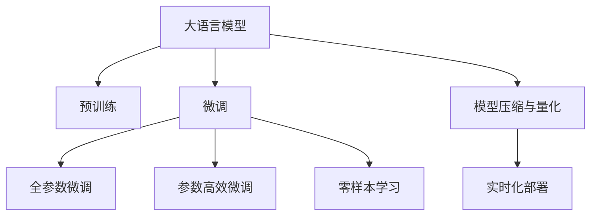

                 

# 电商平台的AI 大模型应用：搜索推荐系统性能与效率的双重提升

## 1. 背景介绍

### 1.1 问题由来

近年来，随着人工智能技术的迅猛发展，电商平台愈发重视基于AI的搜索推荐系统。这些系统通过分析用户行为和历史数据，为用户提供个性化的商品推荐，显著提升了用户的购物体验和平台转化率。然而，构建高性能、高效率的搜索推荐系统，需要处理海量数据、构建复杂模型，传统的机器学习算法已经难以满足需求。

随着深度学习技术的兴起，电商大模型成为了构建搜索推荐系统的重要技术手段。电商大模型通常指采用Transformer架构，在预训练时利用电商平台的大量无标签数据进行自监督学习，从而具备了强大的语义理解和生成能力。如LargeTransformer、DeepMatch等模型，已被多个电商平台成功应用，取得了显著的成效。

### 1.2 问题核心关键点

1. **模型预训练**：使用电商平台数据，构建大规模无标签数据集，进行自监督预训练，学习通用的语义表示。
2. **搜索推荐优化**：针对具体的搜索推荐任务，通过微调或零样本学习，优化模型预测性能。
3. **性能与效率**：在保证搜索推荐系统性能的基础上，进一步提升模型的推理效率，降低系统延迟，满足电商平台的实时性需求。
4. **模型压缩与量化**：在减小模型参数量的同时，保持模型的精度和性能，减少硬件资源消耗。
5. **实时化部署**：将模型集成到电商平台的实时化系统架构中，支持大规模并发访问，保证服务的稳定性。

### 1.3 问题研究意义

电商平台搜索推荐系统的优化，对于提升用户体验、增强平台竞争力具有重要意义：

1. **提高用户体验**：基于AI的推荐系统能够精准匹配用户需求，个性化推荐商品，减少用户的搜索时间，提高购物满意度。
2. **提升平台转化率**：通过精准推荐，增加用户购买转化，为电商平台带来更多收益。
3. **增强系统处理能力**：电商大模型能够高效处理海量数据，满足电商平台的实时性需求，支撑大规模的并发访问。
4. **推动技术创新**：构建高性能、高效率的搜索推荐系统，需要持续的技术创新和优化，带动深度学习及NLP技术在电商领域的应用。

## 2. 核心概念与联系

### 2.1 核心概念概述

为更好地理解基于电商大模型的搜索推荐系统，本节将介绍几个密切相关的核心概念：

- **大语言模型(Large Language Model, LLM)**：采用Transformer架构，通过自监督学习预训练，学习通用的语言表示，具备强大的语义理解和生成能力。
- **预训练(Pre-training)**：在无标签数据上，通过自监督学习任务进行预训练，学习语言知识。
- **微调(Fine-tuning)**：针对具体的搜索推荐任务，通过有监督学习任务，优化模型预测性能。
- **零样本学习(Zero-shot Learning)**：模型仅通过任务描述，就能完成预测任务，无需任何标注样本。
- **模型压缩与量化**：减小模型参数量和存储空间，提升模型推理效率，降低硬件资源消耗。
- **实时化部署**：将模型集成到电商平台的实时化系统架构中，支持大规模并发访问，保证服务的稳定性。

这些核心概念之间的逻辑关系可以通过以下Mermaid流程图来展示：



这个流程图展示了大语言模型在电商搜索推荐系统中的应用过程：

1. 大语言模型通过预训练获得基础能力。
2. 微调优化模型，针对具体的搜索推荐任务。
3. 零样本学习提升模型泛化能力，处理小样本数据。
4. 模型压缩与量化减小参数量和存储空间。
5. 实时化部署将模型集成到电商平台的实时系统架构中。

## 3. 核心算法原理 & 具体操作步骤

### 3.1 算法原理概述

基于电商大模型的搜索推荐系统，通过预训练-微调-优化-部署的全过程，构建高性能、高效率的系统。其核心思想是：

1. **预训练**：在电商平台的大规模无标签数据上，通过自监督学习任务进行预训练，学习通用的语义表示。
2. **微调**：针对具体的搜索推荐任务，使用标注数据对预训练模型进行微调，优化模型预测性能。
3. **优化**：在微调的基础上，通过模型压缩与量化，提高模型的推理效率，减少硬件资源消耗。
4. **部署**：将优化后的模型集成到电商平台的实时化系统架构中，保证服务的稳定性。

### 3.2 算法步骤详解

基于电商大模型的搜索推荐系统，一般包括以下几个关键步骤：

**Step 1: 准备预训练模型和数据集**
- 选择合适的预训练语言模型 $M_{\theta}$，如LargeTransformer、DeepMatch等。
- 准备电商平台的搜索推荐数据集 $D=\{(x_i,y_i)\}_{i=1}^N$，将数据划分为训练集、验证集和测试集。

**Step 2: 添加任务适配层**
- 根据搜索推荐任务，在预训练模型顶层设计合适的输出层和损失函数。
- 对于分类任务，通常在顶层添加线性分类器和交叉熵损失函数。
- 对于生成任务，通常使用语言模型的解码器输出概率分布，并以负对数似然为损失函数。

**Step 3: 设置微调超参数**
- 选择合适的优化算法及其参数，如AdamW、SGD等，设置学习率、批大小、迭代轮数等。
- 设置正则化技术及强度，包括权重衰减、Dropout、Early Stopping等。
- 确定冻结预训练参数的策略，如仅微调顶层，或全部参数都参与微调。

**Step 4: 执行梯度训练**
- 将训练集数据分批次输入模型，前向传播计算损失函数。
- 反向传播计算参数梯度，根据设定的优化算法和学习率更新模型参数。
- 周期性在验证集上评估模型性能，根据性能指标决定是否触发Early Stopping。
- 重复上述步骤直到满足预设的迭代轮数或Early Stopping条件。

**Step 5: 模型压缩与量化**
- 使用模型压缩技术，如知识蒸馏、剪枝等，减少模型参数量和存储空间。
- 将模型量化为定点模型，减少内存消耗和计算资源消耗。
- 重新评估模型性能，保证优化后的模型精度和效率。

**Step 6: 实时化部署**
- 将优化后的模型集成到电商平台的实时化系统架构中，如使用缓存机制、负载均衡、分布式计算等。
- 保证模型服务的稳定性，支持大规模并发访问。
- 监控模型服务状态，及时响应系统异常。

以上是基于电商大模型的搜索推荐系统的一般流程。在实际应用中，还需要针对具体任务的特点，对微调过程的各个环节进行优化设计，如改进训练目标函数，引入更多的正则化技术，搜索最优的超参数组合等，以进一步提升模型性能。

### 3.3 算法优缺点

基于电商大模型的搜索推荐系统具有以下优点：
1. **性能高**：电商大模型通过预训练和微调，能够获得更强的语义理解能力，在推荐系统上取得了更好的效果。
2. **泛化能力强**：电商大模型在处理小样本数据时，仍能取得不错的表现，适合电商平台的动态变化需求。
3. **实时性高**：通过模型压缩与量化，模型推理效率显著提升，能够满足电商平台的实时性需求。
4. **可扩展性强**：电商大模型可以通过增加训练数据、微调参数等手段，进一步提升性能。

同时，该方法也存在一定的局限性：
1. **依赖标注数据**：微调的效果很大程度上取决于标注数据的质量和数量，获取高质量标注数据的成本较高。
2. **参数量大**：电商大模型通常具有较大的参数量，推理时对计算资源和存储资源要求较高。
3. **部署复杂**：实时化部署需要考虑模型的缓存、负载均衡、分布式计算等问题，增加了系统复杂度。

尽管存在这些局限性，但就目前而言，基于电商大模型的搜索推荐系统仍是最主流的方法。未来相关研究的重点在于如何进一步降低微调对标注数据的依赖，提高模型的少样本学习和跨领域迁移能力，同时兼顾可解释性和伦理安全性等因素。

### 3.4 算法应用领域

基于电商大模型的搜索推荐系统，已经在电商领域得到了广泛的应用，覆盖了推荐、搜索、个性化推荐等诸多任务，例如：

- **商品推荐**：根据用户的历史行为和兴趣，推荐相关商品。通过微调，使推荐系统更贴合用户需求。
- **关键词搜索**：通过自然语言理解，将用户输入的搜索关键词转化为机器可处理的形式，并返回匹配结果。
- **个性化推荐**：根据用户的浏览、点击等行为数据，个性化推荐相关商品或内容。
- **动态定价**：根据市场供需和用户行为，动态调整商品价格。
- **用户画像构建**：通过用户行为数据，构建用户画像，用于个性化推荐和精准营销。

除了上述这些经典任务外，电商大模型还被创新性地应用到更多场景中，如内容生成、购物助手、广告投放等，为电商平台带来了新的增长点。随着预训练模型和搜索推荐方法的不断进步，相信电商大模型将在更广阔的应用领域大放异彩。

## 4. 数学模型和公式 & 详细讲解 & 举例说明

### 4.1 数学模型构建

本节将使用数学语言对基于电商大模型的搜索推荐系统进行更加严格的刻画。

记电商大模型为 $M_{\theta}:\mathcal{X} \rightarrow \mathcal{Y}$，其中 $\mathcal{X}$ 为输入空间，$\mathcal{Y}$ 为输出空间，$\theta \in \mathbb{R}^d$ 为模型参数。假设搜索推荐任务的训练集为 $D=\{(x_i,y_i)\}_{i=1}^N, x_i \in \mathcal{X}, y_i \in \mathcal{Y}$。

定义模型 $M_{\theta}$ 在数据样本 $(x,y)$ 上的损失函数为 $\ell(M_{\theta}(x),y)$，则在数据集 $D$ 上的经验风险为：

$$
\mathcal{L}(\theta) = \frac{1}{N} \sum_{i=1}^N \ell(M_{\theta}(x_i),y_i)
$$

微调的优化目标是最小化经验风险，即找到最优参数：

$$
\theta^* = \mathop{\arg\min}_{\theta} \mathcal{L}(\theta)
$$

在实践中，我们通常使用基于梯度的优化算法（如SGD、Adam等）来近似求解上述最优化问题。设 $\eta$ 为学习率，$\lambda$ 为正则化系数，则参数的更新公式为：

$$
\theta \leftarrow \theta - \eta \nabla_{\theta}\mathcal{L}(\theta) - \eta\lambda\theta
$$

其中 $\nabla_{\theta}\mathcal{L}(\theta)$ 为损失函数对参数 $\theta$ 的梯度，可通过反向传播算法高效计算。

### 4.2 公式推导过程

以下我们以商品推荐任务为例，推导交叉熵损失函数及其梯度的计算公式。

假设模型 $M_{\theta}$ 在输入 $x$ 上的输出为 $\hat{y}=M_{\theta}(x) \in [0,1]$，表示商品被推荐的可能性。真实标签 $y \in \{0,1\}$。则二分类交叉熵损失函数定义为：

$$
\ell(M_{\theta}(x),y) = -[y\log \hat{y} + (1-y)\log (1-\hat{y})]
$$

将其代入经验风险公式，得：

$$
\mathcal{L}(\theta) = -\frac{1}{N}\sum_{i=1}^N [y_i\log M_{\theta}(x_i)+(1-y_i)\log(1-M_{\theta}(x_i))]
$$

根据链式法则，损失函数对参数 $\theta_k$ 的梯度为：

$$
\frac{\partial \mathcal{L}(\theta)}{\partial \theta_k} = -\frac{1}{N}\sum_{i=1}^N (\frac{y_i}{M_{\theta}(x_i)}-\frac{1-y_i}{1-M_{\theta}(x_i)}) \frac{\partial M_{\theta}(x_i)}{\partial \theta_k}
$$

其中 $\frac{\partial M_{\theta}(x_i)}{\partial \theta_k}$ 可进一步递归展开，利用自动微分技术完成计算。

在得到损失函数的梯度后，即可带入参数更新公式，完成模型的迭代优化。重复上述过程直至收敛，最终得到适应搜索推荐任务的最优模型参数 $\theta^*$。

## 5. 项目实践：代码实例和详细解释说明

### 5.1 开发环境搭建

在进行电商大模型微调实践前，我们需要准备好开发环境。以下是使用Python进行PyTorch开发的环境配置流程：

1. 安装Anaconda：从官网下载并安装Anaconda，用于创建独立的Python环境。

2. 创建并激活虚拟环境：
```bash
conda create -n pytorch-env python=3.8 
conda activate pytorch-env
```

3. 安装PyTorch：根据CUDA版本，从官网获取对应的安装命令。例如：
```bash
conda install pytorch torchvision torchaudio cudatoolkit=11.1 -c pytorch -c conda-forge
```

4. 安装Transformers库：
```bash
pip install transformers
```

5. 安装各类工具包：
```bash
pip install numpy pandas scikit-learn matplotlib tqdm jupyter notebook ipython
```

完成上述步骤后，即可在`pytorch-env`环境中开始微调实践。

### 5.2 源代码详细实现

下面我们以商品推荐任务为例，给出使用Transformers库对电商大模型进行微调的PyTorch代码实现。

首先，定义推荐任务的数据处理函数：

```python
from transformers import LargeTransformerModel
from torch.utils.data import Dataset
import torch

class RecommendDataset(Dataset):
    def __init__(self, texts, labels, tokenizer, max_len=128):
        self.texts = texts
        self.labels = labels
        self.tokenizer = tokenizer
        self.max_len = max_len
        
    def __len__(self):
        return len(self.texts)
    
    def __getitem__(self, item):
        text = self.texts[item]
        label = self.labels[item]
        
        encoding = self.tokenizer(text, return_tensors='pt', max_length=self.max_len, padding='max_length', truncation=True)
        input_ids = encoding['input_ids'][0]
        attention_mask = encoding['attention_mask'][0]
        
        # 对token-wise的标签进行编码
        encoded_labels = [label] * len(encoded_labels) 
        labels = torch.tensor(encoded_labels, dtype=torch.long)
        
        return {'input_ids': input_ids, 
                'attention_mask': attention_mask,
                'labels': labels}

# 标签与id的映射
label2id = {'not_recommended': 0, 'recommended': 1}
id2label = {v: k for k, v in label2id.items()}

# 创建dataset
tokenizer = LargeTransformerModel.from_pretrained('large_transformer')

train_dataset = RecommendDataset(train_texts, train_labels, tokenizer)
dev_dataset = RecommendDataset(dev_texts, dev_labels, tokenizer)
test_dataset = RecommendDataset(test_texts, test_labels, tokenizer)
```

然后，定义模型和优化器：

```python
from transformers import AdamW

model = LargeTransformerModel.from_pretrained('large_transformer', num_labels=2)

optimizer = AdamW(model.parameters(), lr=2e-5)
```

接着，定义训练和评估函数：

```python
from torch.utils.data import DataLoader
from tqdm import tqdm
from sklearn.metrics import accuracy_score

device = torch.device('cuda') if torch.cuda.is_available() else torch.device('cpu')
model.to(device)

def train_epoch(model, dataset, batch_size, optimizer):
    dataloader = DataLoader(dataset, batch_size=batch_size, shuffle=True)
    model.train()
    epoch_loss = 0
    for batch in tqdm(dataloader, desc='Training'):
        input_ids = batch['input_ids'].to(device)
        attention_mask = batch['attention_mask'].to(device)
        labels = batch['labels'].to(device)
        model.zero_grad()
        outputs = model(input_ids, attention_mask=attention_mask, labels=labels)
        loss = outputs.loss
        epoch_loss += loss.item()
        loss.backward()
        optimizer.step()
    return epoch_loss / len(dataloader)

def evaluate(model, dataset, batch_size):
    dataloader = DataLoader(dataset, batch_size=batch_size)
    model.eval()
    preds, labels = [], []
    with torch.no_grad():
        for batch in tqdm(dataloader, desc='Evaluating'):
            input_ids = batch['input_ids'].to(device)
            attention_mask = batch['attention_mask'].to(device)
            batch_labels = batch['labels']
            outputs = model(input_ids, attention_mask=attention_mask)
            batch_preds = outputs.logits.argmax(dim=2).to('cpu').tolist()
            batch_labels = batch_labels.to('cpu').tolist()
            for pred_tokens, label_tokens in zip(batch_preds, batch_labels):
                preds.append(pred_tokens[:len(label_tokens)])
                labels.append(label_tokens)
                
    print(f'Accuracy: {accuracy_score(labels, preds)}')
```

最后，启动训练流程并在测试集上评估：

```python
epochs = 5
batch_size = 16

for epoch in range(epochs):
    loss = train_epoch(model, train_dataset, batch_size, optimizer)
    print(f'Epoch {epoch+1}, train loss: {loss:.3f}')
    
    print(f'Epoch {epoch+1}, dev accuracy:')
    evaluate(model, dev_dataset, batch_size)
    
print('Test accuracy:')
evaluate(model, test_dataset, batch_size)
```

以上就是使用PyTorch对电商大模型进行商品推荐任务微调的完整代码实现。可以看到，得益于Transformers库的强大封装，我们可以用相对简洁的代码完成电商大模型的加载和微调。

### 5.3 代码解读与分析

让我们再详细解读一下关键代码的实现细节：

**RecommendDataset类**：
- `__init__`方法：初始化文本、标签、分词器等关键组件。
- `__len__`方法：返回数据集的样本数量。
- `__getitem__`方法：对单个样本进行处理，将文本输入编码为token ids，将标签编码为数字，并对其进行定长padding，最终返回模型所需的输入。

**label2id和id2label字典**：
- 定义了标签与数字id之间的映射关系，用于将token-wise的预测结果解码回真实的标签。

**训练和评估函数**：
- 使用PyTorch的DataLoader对数据集进行批次化加载，供模型训练和推理使用。
- 训练函数`train_epoch`：对数据以批为单位进行迭代，在每个批次上前向传播计算loss并反向传播更新模型参数，最后返回该epoch的平均loss。
- 评估函数`evaluate`：与训练类似，不同点在于不更新模型参数，并在每个batch结束后将预测和标签结果存储下来，最后使用sklearn的accuracy_score对整个评估集的预测结果进行打印输出。

**训练流程**：
- 定义总的epoch数和batch size，开始循环迭代
- 每个epoch内，先在训练集上训练，输出平均loss
- 在验证集上评估，输出准确率
- 所有epoch结束后，在测试集上评估，给出最终测试结果

可以看到，PyTorch配合Transformers库使得电商大模型的微调代码实现变得简洁高效。开发者可以将更多精力放在数据处理、模型改进等高层逻辑上，而不必过多关注底层的实现细节。

当然，工业级的系统实现还需考虑更多因素，如模型的保存和部署、超参数的自动搜索、更灵活的任务适配层等。但核心的微调范式基本与此类似。

## 6. 实际应用场景

### 6.1 智能客服系统

基于电商大模型的搜索推荐技术，可以广泛应用于智能客服系统的构建。传统客服往往需要配备大量人力，高峰期响应缓慢，且一致性和专业性难以保证。而使用微调后的搜索推荐模型，可以7x24小时不间断服务，快速响应客户咨询，用自然流畅的语言解答各类常见问题。

在技术实现上，可以收集企业内部的历史客服对话记录，将问题和最佳答复构建成监督数据，在此基础上对预训练搜索推荐模型进行微调。微调后的模型能够自动理解用户意图，匹配最合适的答复。对于客户提出的新问题，还可以接入检索系统实时搜索相关内容，动态组织生成回答。如此构建的智能客服系统，能大幅提升客户咨询体验和问题解决效率。

### 6.2 商品推荐系统

电商平台需要实时推荐相关商品，提升用户购买转化率。传统的推荐系统往往只依赖用户的历史行为数据进行物品推荐，无法深入理解用户的真实兴趣偏好。基于电商大模型的搜索推荐系统，能够更好地挖掘用户行为背后的语义信息，从而提供更精准、多样的推荐内容。

在实践中，可以收集用户浏览、点击、评论、分享等行为数据，提取和商品交互的物品标题、描述、标签等文本内容。将文本内容作为模型输入，用户的后续行为（如是否点击、购买等）作为监督信号，在此基础上微调预训练语言模型。微调后的模型能够从文本内容中准确把握用户的兴趣点。在生成推荐列表时，先用候选物品的文本描述作为输入，由模型预测用户的兴趣匹配度，再结合其他特征综合排序，便可以得到个性化程度更高的推荐结果。

### 6.3 内容生成系统

电商平台除了推荐商品，还致力于内容生成，丰富用户的购物体验。基于电商大模型的搜索推荐系统，能够自动生成商品描述、广告文案等文本内容，提升内容创作的效率和质量。

在实践中，可以基于电商平台的大规模商品数据，构建无标签文本语料进行自监督预训练，学习通用的商品语义表示。然后，根据用户的行为数据和市场趋势，生成符合用户需求的商品描述或广告文案。为了保证生成的内容质量，还可以引入小样本数据，在目标数据集上进行微调，提升生成内容的个性化和多样性。

### 6.4 未来应用展望

随着电商大模型和搜索推荐方法的不断发展，基于微调范式将在更多领域得到应用，为电商平台的业务创新和技术升级提供新的动力。

在智慧物流领域，基于电商大模型的搜索推荐技术可以用于优化配送路线、调整库存管理等，提升物流系统的效率和稳定性。

在供应链管理中，微调模型可应用于供应商选择、生产调度等环节，提供智能化的决策支持。

在用户行为分析中，电商大模型能够深度挖掘用户行为背后的语义信息，构建更全面、准确的消费者画像，为个性化营销和精准营销提供支撑。

此外，在商品评价、广告投放等更多电商应用场景中，基于电商大模型的搜索推荐技术也将不断涌现，为电商平台带来新的增长点。相信随着技术的日益成熟，微调方法将成为电商平台搜索推荐系统的重要范式，推动电商行业的数字化转型升级。

## 7. 工具和资源推荐

### 7.1 学习资源推荐

为了帮助开发者系统掌握电商大模型搜索推荐技术的基础知识，这里推荐一些优质的学习资源：

1. 《Transformer从原理到实践》系列博文：由大模型技术专家撰写，深入浅出地介绍了Transformer原理、电商大模型、微调技术等前沿话题。

2. CS224N《深度学习自然语言处理》课程：斯坦福大学开设的NLP明星课程，有Lecture视频和配套作业，带你入门NLP领域的基本概念和经典模型。

3. 《Natural Language Processing with Transformers》书籍：Transformers库的作者所著，全面介绍了如何使用Transformers库进行NLP任务开发，包括电商大模型的微调方法。

4. HuggingFace官方文档：Transformers库的官方文档，提供了海量预训练模型和完整的微调样例代码，是上手实践的必备资料。

5. CLUE开源项目：中文语言理解测评基准，涵盖大量不同类型的中文NLP数据集，并提供了基于电商大模型的baseline模型，助力电商大模型技术发展。

通过对这些资源的学习实践，相信你一定能够快速掌握电商大模型搜索推荐技术的精髓，并用于解决实际的NLP问题。
###  7.2 开发工具推荐

高效的开发离不开优秀的工具支持。以下是几款用于电商大模型搜索推荐开发的常用工具：

1. PyTorch：基于Python的开源深度学习框架，灵活动态的计算图，适合快速迭代研究。大部分预训练语言模型都有PyTorch版本的实现。

2. TensorFlow：由Google主导开发的开源深度学习框架，生产部署方便，适合大规模工程应用。同样有丰富的预训练语言模型资源。

3. Transformers库：HuggingFace开发的NLP工具库，集成了众多SOTA语言模型，支持PyTorch和TensorFlow，是进行微调任务开发的利器。

4. Weights & Biases：模型训练的实验跟踪工具，可以记录和可视化模型训练过程中的各项指标，方便对比和调优。与主流深度学习框架无缝集成。

5. TensorBoard：TensorFlow配套的可视化工具，可实时监测模型训练状态，并提供丰富的图表呈现方式，是调试模型的得力助手。

6. Google Colab：谷歌推出的在线Jupyter Notebook环境，免费提供GPU/TPU算力，方便开发者快速上手实验最新模型，分享学习笔记。

合理利用这些工具，可以显著提升电商大模型搜索推荐任务的开发效率，加快创新迭代的步伐。

### 7.3 相关论文推荐

电商大模型搜索推荐技术的发展源于学界的持续研究。以下是几篇奠基性的相关论文，推荐阅读：

1. Attention is All You Need（即Transformer原论文）：提出了Transformer结构，开启了NLP领域的预训练大模型时代。

2. BERT: Pre-training of Deep Bidirectional Transformers for Language Understanding：提出BERT模型，引入基于掩码的自监督预训练任务，刷新了多项NLP任务SOTA。

3. Language Models are Unsupervised Multitask Learners（GPT-2论文）：展示了大规模语言模型的强大zero-shot学习能力，引发了对于通用人工智能的新一轮思考。

4. Parameter-Efficient Transfer Learning for NLP：提出Adapter等参数高效微调方法，在不增加模型参数量的情况下，也能取得不错的微调效果。

5. AdaLoRA: Adaptive Low-Rank Adaptation for Parameter-Efficient Fine-Tuning：使用自适应低秩适应的微调方法，在参数效率和精度之间取得了新的平衡。

这些论文代表了大语言模型搜索推荐技术的发展脉络。通过学习这些前沿成果，可以帮助研究者把握学科前进方向，激发更多的创新灵感。

## 8. 总结：未来发展趋势与挑战

### 8.1 总结

本文对基于电商大模型的搜索推荐系统进行了全面系统的介绍。首先阐述了电商大模型和搜索推荐系统的研究背景和意义，明确了微调在提升推荐系统性能方面的独特价值。其次，从原理到实践，详细讲解了电商大模型的预训练-微调-优化-部署的全过程，给出了微调任务开发的完整代码实例。同时，本文还广泛探讨了微调方法在电商推荐、内容生成、客服智能等诸多行业领域的应用前景，展示了微调范式的巨大潜力。此外，本文精选了微调技术的各类学习资源，力求为读者提供全方位的技术指引。

通过本文的系统梳理，可以看到，基于电商大模型的搜索推荐系统正在成为电商领域的重要范式，极大地拓展了预训练语言模型的应用边界，催生了更多的落地场景。受益于电商平台的大量无标签数据和预训练模型的强大能力，微调方法能够快速适应电商平台的动态变化需求，提供精准的推荐内容，带来显著的业务价值。未来，伴随电商大模型和搜索推荐方法的持续演进，相信电商平台搜索推荐系统必将在更广阔的应用领域大放异彩，深刻影响电商平台的商业模式和技术生态。

### 8.2 未来发展趋势

展望未来，电商大模型搜索推荐技术将呈现以下几个发展趋势：

1. **模型规模持续增大**：随着算力成本的下降和数据规模的扩张，电商大模型参数量还将持续增长。超大规模语言模型蕴含的丰富语义知识，有望支撑更加复杂多变的电商推荐任务。

2. **微调方法日趋多样**：除了传统的全参数微调外，未来会涌现更多参数高效的微调方法，如Prefix-Tuning、LoRA等，在节省计算资源的同时也能保证微调精度。

3. **实时性需求提升**：随着电商平台的流量激增，实时性要求将进一步提高，微调模型需要更好地支持高并发访问和快速推理。

4. **多模态融合**：电商大模型不仅要处理文本数据，还需要融合图像、视频、语音等多模态信息，提升推荐系统的智能化水平。

5. **用户个性化增强**：通过用户画像的构建和动态更新，推荐系统能够更精准地匹配用户需求，提供个性化推荐内容。

6. **隐私保护加强**：随着用户隐私保护意识的提升，推荐系统需要在保障推荐效果的同时，更加注重用户数据隐私的保护。

以上趋势凸显了电商大模型搜索推荐技术的广阔前景。这些方向的探索发展，必将进一步提升推荐系统的性能和应用范围，为电商平台的业务创新和技术升级提供新的动力。

### 8.3 面临的挑战

尽管电商大模型搜索推荐技术已经取得了瞩目成就，但在迈向更加智能化、普适化应用的过程中，它仍面临着诸多挑战：

1. **数据隐私与安全**：电商平台需要在推荐系统中保护用户隐私，防止数据泄露和滥用。如何在推荐过程中保护用户数据隐私，同时提高推荐效果，将是未来的重要课题。

2. **推荐鲁棒性**：当前推荐模型面对域外数据时，泛化性能往往大打折扣。如何在不同领域和场景下保持推荐系统的稳定性和鲁棒性，还需进一步研究。

3. **资源消耗大**：电商大模型通常参数量大，推理时对计算资源和存储资源要求较高。如何减小模型大小，降低资源消耗，同时保持推荐效果，是未来的研究重点。

4. **可解释性不足**：电商大模型往往视为"黑盒"系统，难以解释其内部工作机制和决策逻辑。如何赋予推荐系统更强的可解释性，将是亟待攻克的难题。

5. **模型公平性**：电商大模型在处理长尾商品时，可能存在推荐不均衡问题。如何在保证个性化推荐的同时，避免对长尾商品的歧视，是未来的研究方向。

6. **实时化部署复杂**：实时化部署需要考虑模型的缓存、负载均衡、分布式计算等问题，增加了系统复杂度。如何在实时系统中高效运行电商大模型，确保服务的稳定性，是未来的研究重点。

尽管存在这些挑战，但通过技术创新和优化，这些问题将逐步得到解决，电商大模型搜索推荐系统必将在更广阔的应用领域大放异彩。相信随着学界和产业界的共同努力，这些挑战终将一一被克服，电商大模型搜索推荐技术必将在构建人机协同的智能时代中扮演越来越重要的角色。

### 8.4 研究展望

面对电商大模型搜索推荐系统所面临的种种挑战，未来的研究需要在以下几个方面寻求新的突破：

1. **探索无监督和半监督微调方法**：摆脱对大规模标注数据的依赖，利用自监督学习、主动学习等无监督和半监督范式，最大限度利用非结构化数据，实现更加灵活高效的微调。

2. **研究参数高效和计算高效的微调范式**：开发更加参数高效的微调方法，在固定大部分预训练参数的同时，只更新极少量的任务相关参数。同时优化微调模型的计算图，减少前向传播和反向传播的资源消耗，实现更加轻量级、实时性的部署。

3. **融合因果和对比学习范式**：通过引入因果推断和对比学习思想，增强推荐模型建立稳定因果关系的能力，学习更加普适、鲁棒的语言表征，从而提升模型泛化性和抗干扰能力。

4. **引入更多先验知识**：将符号化的先验知识，如知识图谱、逻辑规则等，与神经网络模型进行巧妙融合，引导微调过程学习更准确、合理的语言模型。同时加强不同模态数据的整合，实现视觉、语音等多模态信息与文本信息的协同建模。

5. **结合因果分析和博弈论工具**：将因果分析方法引入推荐模型，识别出模型决策的关键特征，增强输出解释的因果性和逻辑性。借助博弈论工具刻画人机交互过程，主动探索并规避模型的脆弱点，提高系统稳定性。

6. **纳入伦理道德约束**：在模型训练目标中引入伦理导向的评估指标，过滤和惩罚有偏见、有害的输出倾向。同时加强人工干预和审核，建立模型行为的监管机制，确保输出符合人类价值观和伦理道德。

这些研究方向的探索，必将引领电商大模型搜索推荐技术迈向更高的台阶，为构建安全、可靠、可解释、可控的智能系统铺平道路。面向未来，电商大模型搜索推荐技术还需要与其他人工智能技术进行更深入的融合，如知识表示、因果推理、强化学习等，多路径协同发力，共同推动自然语言理解和智能交互系统的进步。只有勇于创新、敢于突破，才能不断拓展语言模型的边界，让智能技术更好地造福人类社会。

## 9. 附录：常见问题与解答

**Q1：电商大模型搜索推荐系统如何处理长尾商品？**

A: 电商大模型搜索推荐系统通常面临长尾商品推荐的问题。在处理长尾商品时，可以通过以下方法提升推荐效果：

1. **数据增强**：对长尾商品进行数据增强，引入更多的负样本和噪声数据，提高模型的泛化能力。
2. **模型微调**：对长尾商品的少量标注数据进行微调，调整模型的预测能力。
3. **多模态融合**：结合视觉、语音等多模态信息，提升对长尾商品的理解和推荐。

这些方法可以帮助电商大模型更好地适应长尾商品，提升推荐系统的公平性和覆盖范围。

**Q2：电商大模型搜索推荐系统如何应对数据隐私问题？**

A: 电商大模型搜索推荐系统需要在推荐过程中保护用户隐私，防止数据泄露和滥用。以下是一些常见的隐私保护方法：

1. **差分隐私**：在推荐模型的训练过程中，引入差分隐私技术，限制模型对用户数据的访问范围，确保数据隐私。
2. **数据匿名化**：对用户数据进行匿名化处理，去除敏感信息，保护用户隐私。
3. **联邦学习**：采用联邦学习技术，在本地设备上训练模型，不将数据上传至中心服务器，确保数据隐私。

这些方法可以帮助电商大模型搜索推荐系统在保护用户隐私的同时，提高推荐效果。

**Q3：电商大模型搜索推荐系统如何降低资源消耗？**

A: 电商大模型搜索推荐系统通常具有较大的参数量，推理时对计算资源和存储资源要求较高。以下是一些常见的优化方法：

1. **模型压缩**：使用模型压缩技术，如知识蒸馏、剪枝等，减小模型参数量和存储空间。
2. **量化加速**：将浮点模型转为定点模型，压缩存储空间，提高计算效率。
3. **分布式训练**：使用分布式训练技术，将模型训练任务分散到多个设备上，加速训练过程。

这些方法可以帮助电商大模型搜索推荐系统降低资源消耗，提升推荐系统的效率和可扩展性。

**Q4：电商大模型搜索推荐系统如何提高实时性？**

A: 电商大模型搜索推荐系统需要应对实时性要求，提供快速响应。以下是一些常见的优化方法：

1. **缓存机制**：在模型推理过程中，使用缓存机制，减少重复计算，提高推理效率。
2. **负载均衡**：采用负载均衡技术，将模型推理任务分散到多个设备上，提升处理能力。
3. **分布式推理**：使用分布式推理技术，将模型推理任务分散到多个设备上，实现高并发访问。

这些方法可以帮助电商大模型搜索推荐系统提高实时性，满足电商平台的实时性需求。

**Q5：电商大模型搜索推荐系统如何提升推荐效果？**

A: 电商大模型搜索推荐系统需要提升推荐效果，以提供精准的推荐内容。以下是一些常见的优化方法：

1. **特征工程**：引入更多用户行为特征，提高模型的预测能力。
2. **模型微调**：对推荐系统进行微调，调整模型的预测能力。
3. **多任务学习**：结合用户画像和市场趋势，进行多任务学习，提升推荐效果。

这些方法可以帮助电商大模型搜索推荐系统提升推荐效果，提高用户的购物体验。

**Q6：电商大模型搜索推荐系统如何实现个性化推荐？**

A: 电商大模型搜索推荐系统需要实现个性化推荐，以提供符合用户需求的推荐内容。以下是一些常见的优化方法：

1. **用户画像构建**：通过用户行为数据，构建用户画像，用于个性化推荐。
2. **多模态融合**：结合视觉、语音等多模态信息，提升对用户需求的理解。
3. **动态更新**：动态更新用户画像和推荐模型，提升个性化推荐能力。

这些方法可以帮助电商大模型搜索推荐系统实现个性化推荐，提高用户满意度。

通过本文的系统梳理，可以看到，基于电商大模型的搜索推荐系统正在成为电商领域的重要范式，极大地拓展了预训练语言模型的应用边界，催生了更多的落地场景。受益于电商平台的大量无标签数据和预训练模型的强大能力，微调方法能够快速适应电商平台的动态变化需求，提供精准的推荐内容，带来显著的业务价值。未来，伴随电商大模型和搜索推荐方法的持续演进，相信电商平台搜索推荐系统必将在更广阔的应用领域大放异彩，深刻影响电商平台的商业模式和技术生态。

