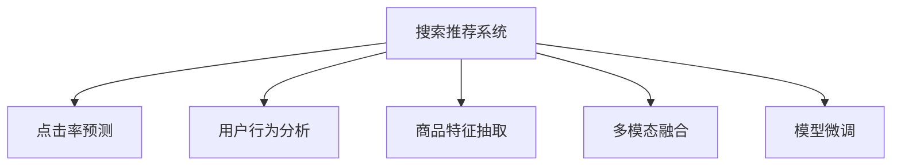

                 

# 电商平台的AI 大模型应用：搜索推荐系统是核心，效率与效果并重

## 1. 背景介绍

### 1.1 问题由来
随着电子商务平台的蓬勃发展，消费者对个性化购物体验的期望愈发强烈，这直接推动了人工智能技术在电商领域的应用。特别是在搜索推荐系统（Search & Recommendation System, SRS）中，AI技术通过分析用户行为、历史数据和商品信息，精准匹配用户需求，极大地提升了用户体验和转化率。因此，搜索推荐系统是电商平台中最具代表性的AI应用场景之一。

### 1.2 问题核心关键点
搜索推荐系统的核心在于如何利用用户的历史行为和上下文信息，精准预测用户下一步的行动，并提供合适的商品推荐。目前，主流的大模型微调方法（如BERT、GPT、DALL·E等）在这个领域展现出了强大的潜力。通过微调，模型可以学习到更加复杂的用户行为模式和商品特征，从而更好地满足个性化推荐需求。

## 2. 核心概念与联系

### 2.1 核心概念概述

为了更好地理解搜索推荐系统的AI大模型应用，本节将介绍几个核心概念：

- 搜索推荐系统（SRS）：指通过用户搜索和浏览行为，预测用户下一步可能采取的行动，并提供个性化推荐结果的系统。
- 点击率预测（CTR Prediction）：指预测用户点击商品的概率，是SRS中的关键任务。
- 用户行为分析（User Behavior Analysis）：通过分析用户的浏览历史、点击行为、评价反馈等数据，了解用户兴趣和需求。
- 商品特征抽取（Product Feature Extraction）：从商品标题、描述、图片等多维度数据中提取关键特征，辅助推荐系统更好地理解商品。
- 多模态融合（Multi-modal Fusion）：结合文本、图像、音频等多模态信息，提高推荐系统的准确性和多样性。
- 模型微调（Model Fine-tuning）：在大规模预训练模型的基础上，通过针对特定任务的数据进行微调，提升模型的精度和泛化能力。

这些核心概念之间的逻辑关系可以通过以下Mermaid流程图来展示：



这个流程图展示了几者之间的关系：

1. 搜索推荐系统是整个流程的核心，通过综合多模态数据和行为分析，结合模型微调，实现精准推荐。
2. 点击率预测是SRS中的重要子任务，预测用户是否会点击某个商品，是评估推荐系统效果的关键指标。
3. 用户行为分析通过分析用户的点击、浏览、评价等行为，提取用户兴趣和需求，为推荐系统提供数据支持。
4. 商品特征抽取从商品的多维度数据中提取关键特征，帮助模型更好地理解商品。
5. 多模态融合将文本、图像、音频等不同模态的信息结合，提高推荐结果的丰富性和多样性。
6. 模型微调在大规模预训练模型的基础上，通过针对特定任务的数据进行微调，提升模型的精度和泛化能力。

## 3. 核心算法原理 & 具体操作步骤
### 3.1 算法原理概述

搜索推荐系统的核心算法通常包括用户行为分析、商品特征提取、点击率预测等模块。通过将这些模块和模型微调技术结合，可以构建出高效的个性化推荐系统。

以点击率预测为例，基本原理是：
1. 收集用户的搜索历史、浏览记录、点击行为等数据。
2. 从这些数据中提取用户的行为特征和商品特征。
3. 利用预训练的大模型（如BERT、GPT等）进行微调，学习用户行为和商品特征之间的关系。
4. 使用学习到的模型预测用户点击商品的概率，并根据预测结果进行个性化推荐。

### 3.2 算法步骤详解

#### 步骤1：数据收集与预处理

1. 收集用户行为数据，包括搜索历史、浏览记录、点击行为、评价反馈等。
2. 对收集到的数据进行清洗、去重、处理缺失值等预处理步骤。
3. 将数据分为训练集、验证集和测试集，以便后续的模型训练和评估。

#### 步骤2：特征提取

1. 提取用户的特征，包括基本信息、历史行为、兴趣偏好等。
2. 提取商品的特征，包括标题、描述、图片、价格等。
3. 利用自然语言处理（NLP）技术，将文本数据转换为向量表示，如Word2Vec、BERT等。
4. 将多模态数据融合，构建综合特征向量。

#### 步骤3：模型训练

1. 选择预训练的大模型（如BERT、GPT等）作为初始化参数。
2. 设计适合特定任务的模型架构，如点击率预测的线性回归模型，推荐系统的多任务学习模型等。
3. 在训练集上使用优化器（如Adam、SGD等）进行梯度下降，最小化损失函数。
4. 在验证集上评估模型性能，根据评估结果调整超参数，如学习率、批大小等。
5. 在测试集上最终评估模型性能，确定最优模型参数。

#### 步骤4：模型微调与优化

1. 根据特定任务，在模型顶层设计合适的输出层和损失函数。
2. 应用正则化技术，如L2正则、Dropout、Early Stopping等，防止过拟合。
3. 利用参数高效微调技术，如Adapters、LoRA等，减少模型大小和计算成本。
4. 通过对抗训练，引入对抗样本，提高模型的鲁棒性和泛化能力。
5. 在多模态数据融合时，应用Attention机制，提升模型对不同模态信息的关注度。

#### 步骤5：推荐结果生成与优化

1. 根据模型的预测结果，生成个性化推荐列表。
2. 引入模型集成技术，如Bagging、Boosting等，提高推荐结果的稳定性和精度。
3. 实时监测推荐效果，根据用户反馈进行调整，不断优化推荐策略。

### 3.3 算法优缺点

#### 优点
1. 效果显著：通过深度学习模型和大规模数据，能够显著提升推荐系统的精度和多样性。
2. 高效可扩展：基于大模型的微调技术，可以轻松应对大规模用户和商品数据，实现高效扩展。
3. 泛化能力强：预训练模型在通用数据上的学习，使得模型能够更好地适应新的数据分布。

#### 缺点
1. 计算资源消耗大：大规模预训练模型和高维特征的微调，对计算资源要求较高。
2. 数据隐私问题：用户行为数据的收集和存储，可能涉及隐私问题，需要严格的合规和保护措施。
3. 模型复杂度高：深度学习模型的复杂度较高，调试和优化难度较大。

### 3.4 算法应用领域

基于大模型微调的搜索推荐系统，已经在电子商务、社交网络、新闻媒体等众多领域得到了广泛应用，成为AI技术落地应用的重要手段。

1. **电子商务**：通过点击率预测和个性化推荐，提升用户购物体验和转化率，增加销售额。
2. **社交网络**：根据用户互动行为，推荐好友、内容、活动等，增加用户粘性和活跃度。
3. **新闻媒体**：根据用户阅读历史，推荐新闻内容，提高用户留存率和点击率。

除了这些常见应用外，搜索推荐系统还被创新性地应用到更多场景中，如金融、医疗、旅游等，为各行各业带来新的业务价值。

## 4. 数学模型和公式 & 详细讲解 & 举例说明

### 4.1 数学模型构建

假设我们有一个包含用户行为数据和商品特征的数据集，目标是训练一个点击率预测模型。定义用户行为数据为 $X=\{x_i\}_{i=1}^N$，商品特征为 $Y=\{y_i\}_{i=1}^N$，用户点击行为为 $Z=\{z_i\}_{i=1}^N$。点击率预测模型 $M_{\theta}$ 的输入为 $(x_i,y_i)$，输出为 $z_i$，其中 $\theta$ 为模型参数。

点击率预测的损失函数定义为：

$$
\mathcal{L}(\theta) = \frac{1}{N} \sum_{i=1}^N \ell(z_i, \hat{z}_i)
$$

其中 $\ell$ 为损失函数，$\hat{z}_i$ 为模型的预测值。在实践中，常用的损失函数包括交叉熵损失、均方误差损失等。

### 4.2 公式推导过程

以交叉熵损失为例，点击率预测模型的预测输出为 $\hat{z}_i$，真实标签为 $z_i$，交叉熵损失函数的计算公式为：

$$
\ell(z_i, \hat{z}_i) = -z_i\log \hat{z}_i - (1-z_i)\log (1-\hat{z}_i)
$$

将上述公式代入损失函数 $\mathcal{L}(\theta)$，得：

$$
\mathcal{L}(\theta) = -\frac{1}{N} \sum_{i=1}^N z_i\log \hat{z}_i - \frac{1}{N} \sum_{i=1}^N (1-z_i)\log (1-\hat{z}_i)
$$

在训练过程中，通过梯度下降等优化算法，不断更新模型参数 $\theta$，最小化损失函数 $\mathcal{L}(\theta)$，使得模型预测输出逼近真实标签。

### 4.3 案例分析与讲解

假设我们有一个包含1000个用户和1000个商品的电子商务平台，收集了每个用户的点击行为数据，如：

- 用户ID：1
- 商品ID：2
- 点击行为：1（表示点击）

根据上述数据，我们可以构建一个简单的点击率预测模型，使用BERT进行微调。微调过程中，我们首先使用预训练的BERT模型作为初始化参数，在用户行为数据上进行有监督学习，不断优化模型，直到损失函数最小化。训练完成后，我们可以使用测试集上的数据，评估模型的预测准确率，并进行持续优化。

## 5. 项目实践：代码实例和详细解释说明

### 5.1 开发环境搭建

在进行搜索推荐系统开发前，我们需要准备好开发环境。以下是使用Python进行TensorFlow开发的环境配置流程：

1. 安装Anaconda：从官网下载并安装Anaconda，用于创建独立的Python环境。
2. 创建并激活虚拟环境：
```bash
conda create -n tf-env python=3.8 
conda activate tf-env
```
3. 安装TensorFlow：根据CUDA版本，从官网获取对应的安装命令。例如：
```bash
pip install tensorflow==2.3
```
4. 安装TensorBoard：
```bash
pip install tensorboard
```
5. 安装其他必要工具包：
```bash
pip install numpy pandas scikit-learn tqdm jupyter notebook ipython
```

完成上述步骤后，即可在`tf-env`环境中开始搜索推荐系统的开发。

### 5.2 源代码详细实现

下面我们以点击率预测任务为例，给出使用TensorFlow进行BERT微调的完整代码实现。

首先，定义数据处理函数：

```python
import tensorflow as tf
import pandas as pd
import numpy as np
from transformers import BertTokenizer, TFBertForSequenceClassification

# 数据处理函数
def preprocess_data(data_path):
    df = pd.read_csv(data_path)
    user_ids = df['user_id'].tolist()
    item_ids = df['item_id'].tolist()
    click_labels = df['click'].tolist()
    
    tokenizer = BertTokenizer.from_pretrained('bert-base-uncased')
    user_ids = [tokenizer.encode(user_id) for user_id in user_ids]
    item_ids = [tokenizer.encode(item_id) for item_id in item_ids]
    
    return user_ids, item_ids, click_labels
```

然后，定义模型和优化器：

```python
# 定义模型
def build_model():
    model = TFBertForSequenceClassification.from_pretrained('bert-base-uncased', num_labels=1)
    model.compile(optimizer=tf.keras.optimizers.Adam(learning_rate=2e-5), loss=tf.keras.losses.BinaryCrossentropy(from_logits=True), metrics=['accuracy'])
    return model

# 定义训练和评估函数
def train_epoch(model, user_ids, item_ids, click_labels, batch_size):
    model.fit(x=np.array(user_ids), y=np.array(click_labels), batch_size=batch_size, epochs=10, validation_split=0.2)
    
def evaluate(model, user_ids, item_ids, click_labels, batch_size):
    model.evaluate(x=np.array(user_ids), y=np.array(click_labels), batch_size=batch_size)
```

最后，启动训练流程并在测试集上评估：

```python
# 数据加载
user_ids, item_ids, click_labels = preprocess_data('train.csv')

# 训练模型
model = build_model()
train_epoch(model, user_ids, item_ids, click_labels, batch_size=32)

# 评估模型
evaluate(model, user_ids, item_ids, click_labels, batch_size=32)
```

以上就是使用TensorFlow对BERT进行点击率预测任务微调的完整代码实现。可以看到，通过TensorFlow和Transformers库的结合，可以快速搭建起一个基于BERT的搜索推荐系统。

### 5.3 代码解读与分析

让我们再详细解读一下关键代码的实现细节：

**preprocess_data函数**：
- 读取训练数据，并将用户ID、商品ID和点击行为标签提取出来。
- 使用BertTokenizer将用户ID和商品ID转换为token ids，并将点击行为标签转换为二分类标签。

**build_model函数**：
- 从预训练的BERT模型加载模型参数。
- 定义模型的优化器、损失函数和评估指标。

**train_epoch函数**：
- 使用用户ID、商品ID和点击行为标签进行模型训练。
- 将数据分为训练集和验证集，每个批次的大小为32，训练10个epoch，并输出验证集的损失和准确率。

**evaluate函数**：
- 在测试集上评估模型的性能。

通过这些函数的定义，可以清晰地看到TensorFlow和Transformers库在搜索推荐系统中的应用。

## 6. 实际应用场景

### 6.1 搜索推荐系统在电子商务中的应用

基于大模型的搜索推荐系统在电子商务平台中的应用最为典型。通过分析用户的搜索历史、浏览记录和点击行为，电商平台可以精准推荐用户可能感兴趣的商品，提高用户购物体验和转化率。

例如，亚马逊（Amazon）通过其推荐系统，将用户点击过的商品和浏览过的商品进行关联，预测用户可能感兴趣的新商品，从而提升用户的购买意愿和销售额。

### 6.2 搜索推荐系统在社交网络中的应用

社交网络平台如Facebook、微信等，也广泛应用搜索推荐系统。通过分析用户的互动行为，平台可以推荐好友、内容、活动等，增强用户粘性和活跃度。

例如，Facebook通过分析用户的点赞、评论、分享等行为，预测用户可能感兴趣的内容，并提供个性化的推荐结果。

### 6.3 搜索推荐系统在新闻媒体中的应用

新闻媒体如BBC、网易新闻等，通过搜索推荐系统，根据用户阅读历史推荐新闻内容，提高用户留存率和点击率。

例如，BBC通过分析用户的浏览记录和点击行为，推荐用户可能感兴趣的新闻文章，增加用户的阅读时间和点击量。

## 7. 工具和资源推荐

### 7.1 学习资源推荐

为了帮助开发者系统掌握搜索推荐系统的理论和实践，这里推荐一些优质的学习资源：

1. 《推荐系统》系列课程：由斯坦福大学开设，涵盖推荐系统的基本原理、算法和应用。
2. 《深度学习与推荐系统》书籍：详细介绍深度学习在推荐系统中的应用，包括CTR预测、召回策略等。
3. TensorFlow官方文档：TensorFlow的全面介绍，包括搜索推荐系统的应用案例。
4 TensorBoard官方文档：TensorFlow配套的可视化工具，方便实时监测模型训练状态。
5 《深度学习框架TensorFlow实战》书籍：详细讲解TensorFlow在推荐系统中的实践案例。

通过这些资源的学习实践，相信你一定能够快速掌握搜索推荐系统的精髓，并用于解决实际的推荐问题。

### 7.2 开发工具推荐

高效的开发离不开优秀的工具支持。以下是几款用于搜索推荐系统开发的常用工具：

1. TensorFlow：基于Python的开源深度学习框架，适合大规模模型训练和推理。
2. PyTorch：基于Python的开源深度学习框架，灵活动态的计算图，适合快速迭代研究。
3. Apache Spark：大数据处理引擎，可以处理大规模用户和商品数据，支持分布式训练。
4. Elasticsearch：搜索引擎，可以高效地存储和检索用户行为数据。
5. Scikit-learn：机器学习库，提供多种数据预处理和特征提取方法。

合理利用这些工具，可以显著提升搜索推荐系统的开发效率，加快创新迭代的步伐。

### 7.3 相关论文推荐

搜索推荐系统的发展源于学界的持续研究。以下是几篇奠基性的相关论文，推荐阅读：

1. 《Personalized PageRank for Recommendation》：提出基于PageRank的推荐算法，为个性化推荐系统奠定基础。
2. 《Deep Ranking Learning via Implicit Feedback for Recommendation》：利用深度学习模型，通过隐式反馈进行推荐，提升推荐精度。
3. 《Diverse and Ranked Recommendations via Bayesian Personalized Ranking》：提出基于贝叶斯排序的推荐算法，提高推荐的准确性和多样性。
4. 《Adaptive Recommendation in Sporadic Environments》：针对稀疏环境下的推荐问题，提出自适应推荐算法。
5 《A Diverse Ranking Model for Explicit Feedback》：利用多任务学习，提升推荐系统的多样性和公平性。

这些论文代表了大模型搜索推荐系统的发展脉络。通过学习这些前沿成果，可以帮助研究者把握学科前进方向，激发更多的创新灵感。

## 8. 总结：未来发展趋势与挑战

### 8.1 总结

本文对基于大模型的搜索推荐系统进行了全面系统的介绍。首先阐述了搜索推荐系统的背景和意义，明确了微调在拓展大模型应用、提升推荐精度方面的独特价值。其次，从原理到实践，详细讲解了搜索推荐系统的数学原理和关键步骤，给出了系统开发的完整代码实例。同时，本文还广泛探讨了搜索推荐系统在电子商务、社交网络、新闻媒体等众多领域的应用前景，展示了其巨大的潜力。最后，本文精选了搜索推荐系统的各类学习资源，力求为读者提供全方位的技术指引。

通过本文的系统梳理，可以看到，基于大模型的搜索推荐系统正在成为推荐领域的重要范式，极大地提升了推荐系统的精度和多样化，带来了显著的业务价值。未来，伴随深度学习模型的持续演进，搜索推荐系统必将迎来新的突破，为构建智能化、个性化的推荐系统铺平道路。

### 8.2 未来发展趋势

展望未来，搜索推荐系统将呈现以下几个发展趋势：

1. 多模态融合加深：未来的搜索推荐系统将结合文本、图像、音频等多模态数据，提高推荐的丰富性和多样性。
2. 深度强化学习：结合强化学习，实现动态推荐和用户行为引导，提升推荐效果和用户体验。
3. 联邦学习：通过分布式训练和本地化数据计算，实现跨平台和多用户的数据融合，提高推荐模型的泛化能力。
4. 实时推荐引擎：通过流式数据处理和大规模模型训练，实现实时推荐，提高用户响应速度和系统稳定性。
5. 模型压缩与优化：通过模型压缩、量化等技术，优化模型大小和计算成本，提升推荐系统的可扩展性和可维护性。

以上趋势凸显了搜索推荐系统的广阔前景。这些方向的探索发展，必将进一步提升推荐系统的性能和应用范围，为构建智能化、个性化的推荐系统铺平道路。

### 8.3 面临的挑战

尽管搜索推荐系统在推荐领域取得了显著进展，但在迈向更加智能化、普适化应用的过程中，它仍面临着诸多挑战：

1. 数据隐私问题：用户行为数据的收集和存储，可能涉及隐私问题，需要严格的合规和保护措施。
2. 冷启动问题：对于新用户和新商品，推荐系统难以提供准确的推荐结果，需要进行额外的引导和推荐。
3. 数据稀疏性：部分用户的点击行为较少，导致推荐模型难以学习到准确的特征，需要进行模型改进和特征增强。
4. 模型复杂度：深度学习模型的复杂度较高，调试和优化难度较大，需要结合更多的预处理和特征工程技术。
5. 实时性要求：实时推荐引擎需要高效的数据处理和计算，对硬件和算法提出了较高的要求。

这些挑战需要通过持续的研究和优化来解决，才能真正实现搜索推荐系统的广泛应用。

### 8.4 研究展望

面向未来，搜索推荐系统需要在以下几个方面寻求新的突破：

1. 探索基于图神经网络的推荐方法：利用图神经网络（GNN）处理用户行为和商品特征的关系，提升推荐的精度和多样性。
2. 结合知识图谱和专家知识：将知识图谱和专家知识融入推荐模型，提升模型的理解和推理能力。
3. 引入多目标优化算法：通过多目标优化算法，同时优化推荐效果和系统资源利用率，提高推荐系统的整体性能。
4. 实现跨平台和跨用户推荐：通过联邦学习等技术，实现跨平台和多用户的数据融合，提高推荐模型的泛化能力。
5. 应用元学习：通过元学习技术，提高推荐系统的迁移能力和适应性，提升推荐系统在多样化和实时性方面的表现。

这些研究方向的探索，必将引领搜索推荐系统迈向更高的台阶，为构建更加智能、个性化、高效的推荐系统提供新的解决方案。

## 9. 附录：常见问题与解答

**Q1：如何缓解搜索推荐系统中的冷启动问题？**

A: 冷启动问题是指推荐系统在处理新用户和新商品时，难以提供准确的推荐结果。缓解冷启动问题的方法包括：
1. 利用用户的历史行为数据，通过数据插值或迁移学习等方法，预测新用户的兴趣偏好。
2. 引入隐式反馈数据，如浏览记录、搜索记录等，辅助推荐模型的训练。
3. 利用专家知识和领域知识，对新商品进行标注和预处理，提高推荐模型的初始化效果。

**Q2：如何在搜索推荐系统中优化模型的计算效率？**

A: 搜索推荐系统中的大模型和特征向量较大，计算效率较低。优化计算效率的方法包括：
1. 利用模型压缩技术，如剪枝、量化、知识蒸馏等，减小模型大小和计算成本。
2. 采用分布式计算和流式处理，提高数据处理的实时性和系统稳定性。
3. 利用GPU和TPU等高性能计算资源，加速模型训练和推理。
4. 应用缓存技术，减少重复计算和数据传输，提高系统响应速度。

**Q3：如何在搜索推荐系统中保证推荐结果的多样性和准确性？**

A: 推荐结果的多样性和准确性是搜索推荐系统的重要指标。提高推荐效果的方法包括：
1. 结合多任务学习和多目标优化算法，同时优化推荐效果和模型鲁棒性。
2. 应用对抗生成网络（GAN）等生成模型，生成多样化的推荐结果。
3. 引入双向推荐机制，同时推荐多个相似商品，提升推荐的多样性。
4. 通过特征工程和模型优化，提高推荐模型的泛化能力和鲁棒性，保证推荐结果的准确性。

**Q4：如何在搜索推荐系统中处理数据稀疏性问题？**

A: 数据稀疏性是指部分用户和商品的点击行为较少，导致推荐模型难以学习到准确的特征。处理数据稀疏性的方法包括：
1. 应用低秩矩阵分解和矩阵补全技术，从少量样本中挖掘用户和商品的特征。
2. 引入隐式反馈数据，如浏览记录、搜索记录等，辅助推荐模型的训练。
3. 利用协同过滤算法，通过用户间的相似性，推荐其他用户的推荐结果。
4. 应用深度学习模型，如CTR预测模型，通过隐式反馈进行推荐，提升推荐精度。

这些方法结合使用，可以显著提升搜索推荐系统的推荐效果和用户体验。

---

作者：禅与计算机程序设计艺术 / Zen and the Art of Computer Programming

