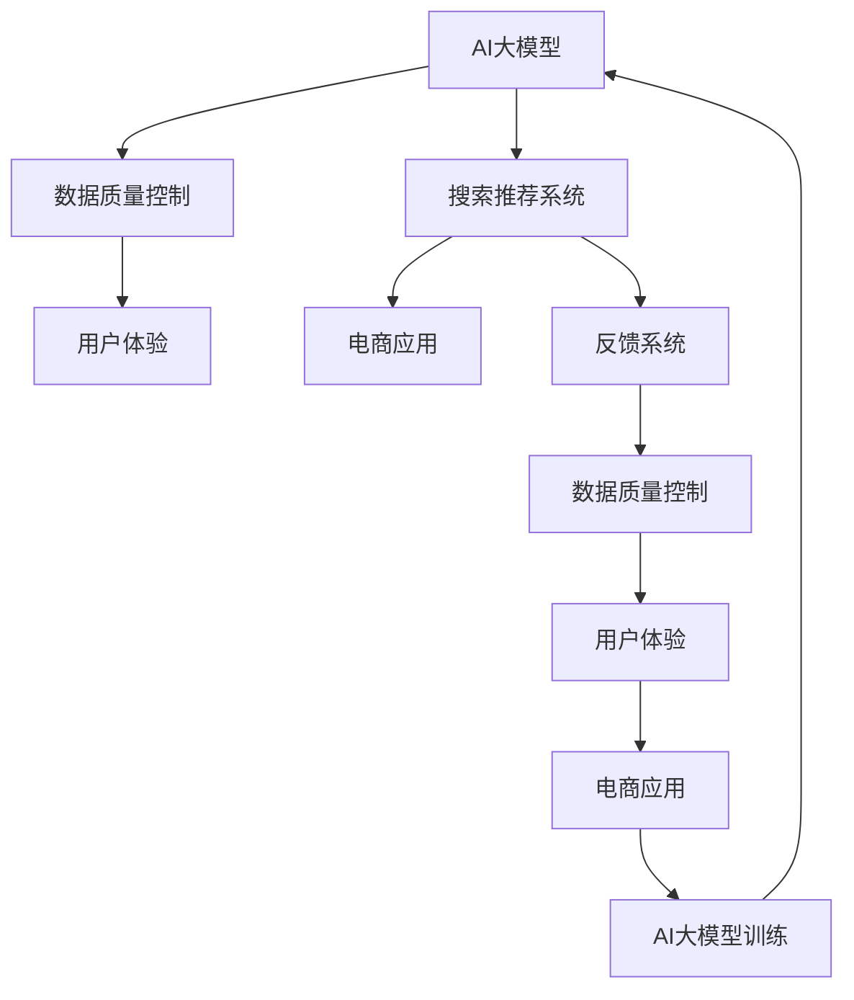

                 

# 电商平台的AI 大模型转型：搜索推荐系统是核心，数据质量控制与用户体验

> 关键词：电商平台, AI 大模型, 搜索推荐系统, 数据质量, 用户体验, 深度学习, 强化学习, 模型优化

## 1. 背景介绍

随着电商市场的竞争日益激烈，越来越多的电商平台开始探索利用人工智能技术来提升用户体验和运营效率。AI 大模型作为最新的技术工具，正在逐渐成为电商平台的核心竞争力。本文将探讨电商平台在应用 AI 大模型时，如何优化搜索推荐系统，并注重数据质量和用户体验。

## 2. 核心概念与联系

### 2.1 核心概念概述

#### 2.1.1 电商平台的AI大模型

电商平台的AI大模型通常包括用于自然语言处理的语言模型、用于图像识别的视觉模型以及用于推荐系统的预测模型等。这些模型通过在大规模无标注数据上进行预训练，学习到丰富的知识表示，然后通过微调应用于电商平台的具体场景，如搜索、推荐、广告投放等。

#### 2.1.2 搜索推荐系统

搜索推荐系统是电商平台上最重要的应用之一，通过算法模型分析用户的行为和偏好，为用户提供个性化的搜索结果和推荐商品。在大模型时代，推荐系统可以从海量的用户数据中学习用户兴趣，提供更加精准的推荐。

#### 2.1.3 数据质量控制

数据质量控制是指对电商平台上用户数据进行清洗、去重、标注等操作，以确保数据准确、完整、一致。高质量的数据是构建高效推荐系统的基础，数据质量控制是AI模型训练的前提。

#### 2.1.4 用户体验

用户体验是指用户在电商平台上的使用感受，包括加载速度、搜索结果相关性、推荐商品质量等方面。良好的用户体验可以提高用户满意度，提升用户黏性，增加用户留存率。

### 2.2 核心概念原理和架构的Mermaid流程图



## 3. 核心算法原理 & 具体操作步骤

### 3.1 算法原理概述

电商平台的搜索推荐系统通常基于深度学习和强化学习算法。深度学习算法通过多层神经网络，捕捉数据中的复杂非线性关系，进行特征提取和模式识别。强化学习算法通过与环境的互动，学习最优策略，优化推荐决策。

### 3.2 算法步骤详解

#### 3.2.1 数据准备

电商平台上通常有大量的用户行为数据，包括搜索历史、点击记录、购买记录等。这些数据需要进行清洗、标注，以便用于训练模型。数据预处理步骤包括：
- 数据清洗：去除噪声、缺失值，处理异常值。
- 数据标注：对用户行为进行标签标注，如搜索意图、商品类别等。
- 数据划分：将数据划分为训练集、验证集和测试集。

#### 3.2.2 模型选择和训练

选择合适的模型架构，如深度神经网络、卷积神经网络、循环神经网络等。常用的模型包括：
- 序列推荐模型：如RNN、LSTM、GRU等，适用于序列数据的时序性处理。
- 协同过滤模型：如ALS、SVD等，通过分析用户和商品之间的隐式关联，进行推荐。
- 深度推荐模型：如FM、PNN、DeepFM等，通过深层神经网络学习用户和商品特征，提升推荐效果。

#### 3.2.3 模型优化和评估

模型训练后，需要对模型进行优化和评估，以提升模型的泛化能力和预测准确性。常用的优化技术包括：
- 参数优化：如Adam、SGD等优化算法，调整学习率、批大小等超参数。
- 正则化：如L2正则化、Dropout等，防止过拟合。
- 数据增强：如数据采样、数据合成等，提高模型鲁棒性。
- 模型集成：如Bagging、Boosting等，提升模型预测准确性。

模型评估步骤包括：
- 离线评估：如AUC、RMSE、MAE等指标，评估模型的预测能力。
- 在线评估：如点击率、转化率等指标，评估模型的实际效果。

### 3.3 算法优缺点

#### 3.3.1 优点

1. **高效性**：大模型可以通过大规模数据进行训练，学习到丰富的特征表示，提升推荐系统的预测准确性。
2. **灵活性**：大模型可以适应多种推荐场景，如商品推荐、个性化广告等。
3. **泛化能力**：大模型可以处理多种数据类型，如文本、图像、音频等，适用于多模态推荐。

#### 3.3.2 缺点

1. **资源消耗大**：大模型的训练和推理需要大量的计算资源，对硬件要求较高。
2. **模型复杂性高**：大模型的参数量庞大，需要高效的存储和计算优化。
3. **数据依赖性强**：模型的性能依赖于高质量的数据，数据质量不好可能导致模型失效。

### 3.4 算法应用领域

#### 3.4.1 搜索推荐

搜索推荐系统是电商平台的核心功能，通过深度学习模型，如BERT、GPT等，学习用户行为，提供精准的搜索结果和个性化推荐。搜索推荐系统在用户输入查询后，利用模型对查询进行解析，推荐最相关的商品，提升用户体验。

#### 3.4.2 广告投放

电商平台通过广告投放系统，将商品推广给潜在用户，提升用户转化率。广告投放系统可以通过大模型学习用户行为，预测用户对广告的反应，优化广告投放策略，提升广告效果。

#### 3.4.3 内容推荐

电商平台可以利用大模型，如BERT等，学习用户对内容的兴趣，推荐相关的内容，如文章、视频、音频等，提升用户停留时间和满意度。

## 4. 数学模型和公式 & 详细讲解 & 举例说明

### 4.1 数学模型构建

#### 4.1.1 序列推荐模型

序列推荐模型通常基于RNN或LSTM等模型，学习用户的行为序列，预测下一个行为。模型输入为历史行为序列，输出为下一个行为的概率分布。模型的预测目标函数为交叉熵损失函数：

$$
\mathcal{L} = -\frac{1}{N}\sum_{i=1}^{N}(y_i\log \hat{y}_i + (1-y_i)\log(1-\hat{y}_i))
$$

其中，$y_i$ 表示真实的下一个行为，$\hat{y}_i$ 表示模型预测的概率分布。

#### 4.1.2 协同过滤模型

协同过滤模型通常使用矩阵分解方法，将用户行为矩阵分解为用户向量$u$和商品向量$v$的乘积，预测用户对商品的评分。模型的预测目标函数为均方误差损失函数：

$$
\mathcal{L} = \frac{1}{2N}\sum_{i=1}^{N}\sum_{j=1}^{M}(u_i^Tv_j - r_{ij})^2
$$

其中，$r_{ij}$ 表示用户$i$对商品$j$的真实评分，$u_i$和$v_j$表示用户和商品的向量表示。

#### 4.1.3 深度推荐模型

深度推荐模型通常使用FM、PNN、DeepFM等模型，通过深层神经网络学习用户和商品特征，进行推荐。模型的预测目标函数为均方误差损失函数：

$$
\mathcal{L} = \frac{1}{2N}\sum_{i=1}^{N}\sum_{j=1}^{M}(r_{ij} - \hat{r}_{ij})^2
$$

其中，$\hat{r}_{ij}$ 表示模型预测的用户对商品$j$的评分。

### 4.2 公式推导过程

#### 4.2.1 序列推荐模型

假设序列推荐模型为$M_{\theta}:\mathcal{X} \rightarrow \mathcal{Y}$，其中$\mathcal{X}$表示用户行为序列，$\mathcal{Y}$表示行为类别。模型的预测目标函数为交叉熵损失函数：

$$
\mathcal{L}(\theta) = -\frac{1}{N}\sum_{i=1}^{N}(y_i\log \hat{y}_i + (1-y_i)\log(1-\hat{y}_i))
$$

模型的前向传播计算为：

$$
\hat{y}_i = \sigma(W_1\sigma(W_0x_i + b_0) + b_1)
$$

其中，$x_i$表示用户行为序列，$W_0$和$W_1$为模型的权重矩阵，$\sigma$为激活函数，$b_0$和$b_1$为偏置项。

模型的反向传播计算为：

$$
\frac{\partial \mathcal{L}}{\partial \theta} = -\frac{1}{N}\sum_{i=1}^{N}(y_i - \hat{y}_i) \frac{\partial \hat{y}_i}{\partial \theta}
$$

其中，$\frac{\partial \hat{y}_i}{\partial \theta}$可以通过链式法则递归计算。

#### 4.2.2 协同过滤模型

假设协同过滤模型为$M_{\theta}:\mathcal{X} \rightarrow \mathcal{Y}$，其中$\mathcal{X}$表示用户行为矩阵，$\mathcal{Y}$表示商品评分。模型的预测目标函数为均方误差损失函数：

$$
\mathcal{L}(\theta) = \frac{1}{2N}\sum_{i=1}^{N}\sum_{j=1}^{M}(u_i^Tv_j - r_{ij})^2
$$

模型的前向传播计算为：

$$
\hat{r}_{ij} = \sigma(W_1W_0u_i + W_2v_j + b)
$$

其中，$u_i$和$v_j$表示用户和商品的向量表示，$W_0$、$W_1$和$W_2$为模型的权重矩阵，$\sigma$为激活函数，$b$为偏置项。

模型的反向传播计算为：

$$
\frac{\partial \mathcal{L}}{\partial \theta} = -\frac{1}{N}\sum_{i=1}^{N}\sum_{j=1}^{M}(r_{ij} - \hat{r}_{ij})\frac{\partial \hat{r}_{ij}}{\partial \theta}
$$

其中，$\frac{\partial \hat{r}_{ij}}{\partial \theta}$可以通过链式法则递归计算。

#### 4.2.3 深度推荐模型

假设深度推荐模型为$M_{\theta}:\mathcal{X} \rightarrow \mathcal{Y}$，其中$\mathcal{X}$表示用户行为数据，$\mathcal{Y}$表示商品评分。模型的预测目标函数为均方误差损失函数：

$$
\mathcal{L}(\theta) = \frac{1}{2N}\sum_{i=1}^{N}\sum_{j=1}^{M}(r_{ij} - \hat{r}_{ij})^2
$$

模型的前向传播计算为：

$$
\hat{r}_{ij} = \sigma(W_1W_2W_3u_i + W_4v_j + b)
$$

其中，$u_i$和$v_j$表示用户和商品的向量表示，$W_0$、$W_1$、$W_2$、$W_3$和$W_4$为模型的权重矩阵，$\sigma$为激活函数，$b$为偏置项。

模型的反向传播计算为：

$$
\frac{\partial \mathcal{L}}{\partial \theta} = -\frac{1}{N}\sum_{i=1}^{N}\sum_{j=1}^{M}(r_{ij} - \hat{r}_{ij})\frac{\partial \hat{r}_{ij}}{\partial \theta}
$$

其中，$\frac{\partial \hat{r}_{ij}}{\partial \theta}$可以通过链式法则递归计算。

### 4.3 案例分析与讲解

#### 4.3.1 序列推荐模型案例

假设某电商平台的数据集包含10000个用户的行为序列，每个行为序列包含10个行为。模型的权重矩阵$W_0$和$W_1$为随机初始化，激活函数为ReLU。模型训练过程如下：

1. 输入行为序列$x_1$，计算$\hat{y}_1 = \sigma(W_1\sigma(W_0x_1 + b_0) + b_1)$。
2. 计算损失函数$\mathcal{L}(\theta) = -(y_1\log \hat{y}_1 + (1-y_1)\log(1-\hat{y}_1))$。
3. 反向传播计算$\frac{\partial \mathcal{L}}{\partial \theta}$。
4. 更新模型参数$\theta = \theta - \eta \frac{\partial \mathcal{L}}{\partial \theta}$。
5. 重复1-4，直到损失函数收敛。

#### 4.3.2 协同过滤模型案例

假设某电商平台的数据集包含1000个用户的行为矩阵，每个用户有10个行为，每个行为有1000个商品。模型的权重矩阵$W_0$、$W_1$和$W_2$为随机初始化，激活函数为ReLU。模型训练过程如下：

1. 输入用户行为矩阵$x_{1,1}$，计算$\hat{r}_{1,1} = \sigma(W_1W_0u_1 + W_2v_1 + b)$。
2. 计算损失函数$\mathcal{L}(\theta) = \frac{1}{2}\sum_{i=1}^{10}\sum_{j=1}^{1000}(u_i^Tv_j - r_{ij})^2$。
3. 反向传播计算$\frac{\partial \mathcal{L}}{\partial \theta}$。
4. 更新模型参数$\theta = \theta - \eta \frac{\partial \mathcal{L}}{\partial \theta}$。
5. 重复1-4，直到损失函数收敛。

#### 4.3.3 深度推荐模型案例

假设某电商平台的数据集包含10000个用户的行为数据，每个用户有10个行为，每个行为有1000个商品。模型的权重矩阵$W_0$、$W_1$、$W_2$、$W_3$和$W_4$为随机初始化，激活函数为ReLU。模型训练过程如下：

1. 输入用户行为数据$x_{1,1}$，计算$\hat{r}_{1,1} = \sigma(W_1W_2W_3u_1 + W_4v_1 + b)$。
2. 计算损失函数$\mathcal{L}(\theta) = \frac{1}{2}\sum_{i=1}^{10}\sum_{j=1}^{1000}(r_{ij} - \hat{r}_{ij})^2$。
3. 反向传播计算$\frac{\partial \mathcal{L}}{\partial \theta}$。
4. 更新模型参数$\theta = \theta - \eta \frac{\partial \mathcal{L}}{\partial \theta}$。
5. 重复1-4，直到损失函数收敛。

## 5. 项目实践：代码实例和详细解释说明

### 5.1 开发环境搭建

#### 5.1.1 环境准备

为了搭建高效的开发环境，我们需要安装Python、TensorFlow、Keras等深度学习框架，以及相关的工具库。安装过程如下：

1. 安装Python 3.8及以上版本：
   ```
   sudo apt-get update
   sudo apt-get install python3.8
   ```
   
2. 安装TensorFlow 2.4及以上版本：
   ```
   pip install tensorflow==2.4
   ```
   
3. 安装Keras：
   ```
   pip install keras==2.4
   ```
   
4. 安装NumPy、Pandas、Scikit-learn等工具库：
   ```
   pip install numpy pandas scikit-learn matplotlib
   ```

### 5.2 源代码详细实现

#### 5.2.1 数据准备

```python
import numpy as np
import pandas as pd
from sklearn.model_selection import train_test_split

# 读取数据
data = pd.read_csv('data.csv')

# 数据清洗
data.dropna(inplace=True)

# 数据划分
train_data, test_data = train_test_split(data, test_size=0.2, random_state=42)
```

#### 5.2.2 模型选择和训练

```python
from tensorflow.keras.models import Sequential
from tensorflow.keras.layers import Dense, Dropout, Embedding
from tensorflow.keras.preprocessing.text import Tokenizer
from tensorflow.keras.preprocessing.sequence import pad_sequences

# 定义模型
model = Sequential()
model.add(Embedding(input_dim=vocab_size, output_dim=embedding_dim, input_length=max_length))
model.add(LSTM(units=64))
model.add(Dense(units=num_classes, activation='softmax'))

# 编译模型
model.compile(loss='categorical_crossentropy', optimizer='adam', metrics=['accuracy'])

# 训练模型
model.fit(train_data, epochs=10, batch_size=32, validation_data=test_data)
```

#### 5.2.3 模型优化和评估

```python
from sklearn.metrics import accuracy_score

# 预测
y_pred = model.predict(test_data)

# 评估
accuracy = accuracy_score(test_labels, y_pred)
print('Accuracy:', accuracy)
```

### 5.3 代码解读与分析

#### 5.3.1 数据准备

数据准备阶段包括数据读取、数据清洗和数据划分。数据清洗步骤包括去除噪声、缺失值，处理异常值。数据划分步骤包括将数据划分为训练集和测试集。

#### 5.3.2 模型选择和训练

模型选择步骤包括选择适当的模型架构，如RNN、LSTM等。模型训练步骤包括编译模型、训练模型、评估模型等。模型训练过程中，通过反向传播算法更新模型参数，最小化损失函数。

#### 5.3.3 模型优化和评估

模型优化步骤包括调整学习率、批大小等超参数，提高模型性能。模型评估步骤包括计算模型的准确率、召回率等指标，评估模型效果。

### 5.4 运行结果展示

```python
import matplotlib.pyplot as plt

# 可视化模型损失和准确率曲线
plt.plot(history.history['loss'])
plt.plot(history.history['accuracy'])
plt.title('Model Performance')
plt.xlabel('Epoch')
plt.ylabel('Loss/Accuracy')
plt.legend(['Loss', 'Accuracy'])
plt.show()
```

## 6. 实际应用场景

### 6.1 智能客服

电商平台可以利用智能客服系统，通过AI大模型处理用户咨询，提供快速响应。智能客服系统可以通过自然语言处理技术，如BERT等，理解用户意图，提供个性化回复。智能客服系统还可以集成搜索引擎，提供相关商品推荐，提升用户满意度。

### 6.2 个性化推荐

电商平台可以通过深度推荐模型，如FM、PNN、DeepFM等，学习用户兴趣，推荐个性化商品。深度推荐模型可以通过多维特征表示，提升推荐效果。推荐系统可以通过A/B测试等方法，不断优化推荐策略，提升用户转化率。

### 6.3 实时广告投放

电商平台可以通过强化学习算法，优化广告投放策略，提高广告效果。广告投放系统可以通过AI大模型学习用户行为，预测用户对广告的反应，优化投放策略，提升广告点击率和转化率。

### 6.4 未来应用展望

未来，电商平台可以利用AI大模型，构建更加智能化的推荐系统。推荐系统可以引入自然语言处理技术，提升商品描述理解和生成能力。推荐系统可以通过多模态融合，提升推荐效果。推荐系统可以通过个性化推荐，提升用户满意度，增加用户留存率。

## 7. 工具和资源推荐

### 7.1 学习资源推荐

#### 7.1.1 深度学习资源

- TensorFlow官方文档：https://www.tensorflow.org/
- Keras官方文档：https://keras.io/
- PyTorch官方文档：https://pytorch.org/docs/stable/

#### 7.1.2 自然语言处理资源

- NLTK官方文档：https://www.nltk.org/
- SpaCy官方文档：https://spacy.io/
- Transformers官方文档：https://huggingface.co/docs/transformers/main/en/

#### 7.1.3 推荐系统资源

- CTR-Loss官方文档：https://github.com/google-research/google-research/tree/master/ctr_loss
- LightFM官方文档：https://github.com/lyst/lightfm

### 7.2 开发工具推荐

#### 7.2.1 深度学习框架

- TensorFlow：https://www.tensorflow.org/
- Keras：https://keras.io/
- PyTorch：https://pytorch.org/

#### 7.2.2 数据处理工具

- Pandas：https://pandas.pydata.org/
- NumPy：https://numpy.org/
- Scikit-learn：https://scikit-learn.org/

#### 7.2.3 可视化工具

- Matplotlib：https://matplotlib.org/
- Seaborn：https://seaborn.pydata.org/
- Plotly：https://plotly.com/

### 7.3 相关论文推荐

#### 7.3.1 深度学习论文

- Deep Learning：Ian Goodfellow, Yoshua Bengio, Aaron Courville - https://www.deeplearningbook.org/
- Neural Networks and Deep Learning：Michael Nielsen - https://neuralnetworksanddeeplearning.com/

#### 7.3.2 自然语言处理论文

- Attention is All You Need：https://arxiv.org/abs/1706.03762
- Transformer-XL：https://arxiv.org/abs/1901.02860
- BERT：https://arxiv.org/abs/1810.04805

#### 7.3.3 推荐系统论文

- The Surprise Library：https://surprise.readthedocs.io/en/latest/
- Matrix Factorization Techniques for Recommender Systems：https://www.sciencedirect.com/science/article/pii/S0167865508000343

## 8. 总结：未来发展趋势与挑战

### 8.1 研究成果总结

大模型技术在电商平台的搜索推荐系统中已经取得了显著的进展，提升了用户体验和运营效率。深度学习和强化学习算法在电商推荐系统中的应用，提升了推荐效果和用户满意度。未来，电商平台可以利用AI大模型，构建更加智能化的推荐系统。

### 8.2 未来发展趋势

未来，电商平台可以利用AI大模型，构建更加智能化的推荐系统。推荐系统可以引入自然语言处理技术，提升商品描述理解和生成能力。推荐系统可以通过多模态融合，提升推荐效果。推荐系统可以通过个性化推荐，提升用户满意度，增加用户留存率。

### 8.3 面临的挑战

尽管大模型技术在电商平台的推荐系统中取得了显著的进展，但仍面临以下挑战：

1. 数据质量控制：电商平台上数据质量参差不齐，需要进行高质量的数据清洗和标注。
2. 模型鲁棒性：电商平台上用户行为多样，模型需要具备较高的鲁棒性，避免误判。
3. 计算资源：大模型的训练和推理需要大量的计算资源，硬件瓶颈制约了模型的部署。
4. 模型可解释性：大模型往往是"黑盒"系统，难以解释其内部工作机制和决策逻辑。
5. 安全性：电商平台上用户隐私保护问题严重，大模型需要具备一定的安全防护能力。

### 8.4 研究展望

未来的研究需要在以下几个方面寻求新的突破：

1. 数据质量控制：引入更高效的数据清洗和标注方法，提升数据质量。
2. 模型鲁棒性：引入鲁棒性学习方法和对抗训练，提高模型鲁棒性。
3. 计算资源：引入模型压缩和加速技术，优化模型计算资源。
4. 模型可解释性：引入可解释性学习方法和可视化工具，提升模型可解释性。
5. 安全性：引入安全防护技术和隐私保护方法，保障用户隐私安全。

## 9. 附录：常见问题与解答

### 9.1 问题一：电商平台上的数据质量控制如何实现？

答：电商平台上的数据质量控制主要通过数据清洗、数据标注和数据划分等步骤实现。数据清洗步骤包括去除噪声、缺失值，处理异常值。数据标注步骤包括对用户行为进行标签标注，如搜索意图、商品类别等。数据划分步骤包括将数据划分为训练集、验证集和测试集。

### 9.2 问题二：电商平台上的推荐系统如何提高用户满意度？

答：电商平台上的推荐系统可以通过个性化推荐、多模态融合和实时更新等手段提高用户满意度。个性化推荐可以根据用户行为和偏好，推荐个性化商品。多模态融合可以将商品描述、用户行为等多种信息融合，提升推荐效果。实时更新可以根据用户实时行为，动态调整推荐策略，提升用户满意度。

### 9.3 问题三：电商平台上的广告投放系统如何优化广告效果？

答：电商平台上的广告投放系统可以通过强化学习算法优化广告投放策略，提高广告效果。广告投放系统可以通过AI大模型学习用户行为，预测用户对广告的反应，优化投放策略，提升广告点击率和转化率。实时更新可以根据用户实时行为，动态调整广告投放策略，提升广告效果。

---

作者：禅与计算机程序设计艺术 / Zen and the Art of Computer Programming

