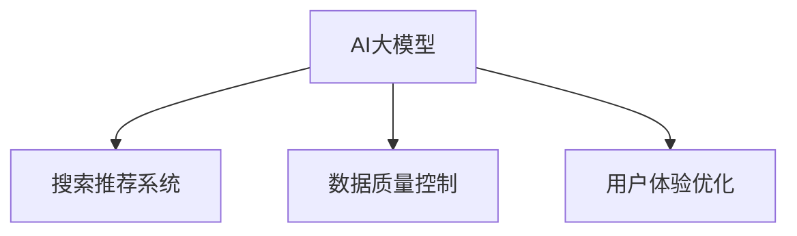

                 

# 电商平台的AI 大模型转型：搜索推荐系统是核心，数据质量控制与用户体验优化

## 1. 背景介绍

### 1.1 问题由来

在当今数字化时代，电商行业已全面迈入数据驱动的时代。越来越多的电商平台开始引入人工智能(AI)技术，试图通过算法优化和用户行为分析，提升用户购物体验，提高运营效率。其中，AI大模型在电商领域的深度应用，尤其是搜索推荐系统，已成为各大电商企业的竞争焦点。

然而，大模型虽强，但依赖于海量数据和庞大算力，部署和维护成本高昂。同时，在实际应用中，数据质量控制和用户体验优化仍是大模型在电商应用中的两大难题。本文将从背景、核心概念、算法原理、项目实践和未来展望五个方面，深入剖析AI大模型在电商平台中的应用，探讨数据质量控制与用户体验优化的有效策略。

## 2. 核心概念与联系

### 2.1 核心概念概述

要深入理解AI大模型在电商平台中的应用，首先需要明确几个关键概念：

- **AI大模型**：以Transformer等深度神经网络为代表的大规模预训练语言模型。通过在大规模无标签文本数据上自监督学习，获得强大的语言理解和生成能力，广泛应用于NLP任务。

- **搜索推荐系统**：电商平台的核心功能之一，通过分析用户历史行为和兴趣，推荐商品和搜索结果，提升用户体验，增加销售转化率。

- **数据质量控制**：确保电商平台的用户数据质量，提升模型训练数据的准确性和代表性，避免因数据噪声导致的模型退化。

- **用户体验优化**：通过个性化推荐、界面设计优化等手段，提升用户对电商平台的满意度和粘性。

这些核心概念之间的逻辑关系可以通过以下Mermaid流程图来展示：



## 3. 核心算法原理 & 具体操作步骤

### 3.1 算法原理概述

基于AI大模型的搜索推荐系统，核心在于利用大模型的语言理解和生成能力，通过分析用户查询和行为数据，生成个性化的推荐结果和搜索排序。其原理可总结如下：

1. **用户意图理解**：通过大模型对用户查询进行语义理解，抽取关键词和意图，构建用户画像。
2. **商品匹配**：根据用户画像，利用相似度计算和向量空间模型，匹配最相关的商品。
3. **推荐排序**：通过神经网络模型，如DNN、CNN等，对商品进行排序，优先推荐与用户意图最匹配的商品。

### 3.2 算法步骤详解

基于AI大模型的搜索推荐系统一般包括以下几个关键步骤：

1. **数据预处理**：
   - 收集用户查询、点击、购买等行为数据。
   - 清洗和归一化数据，去除噪声和异常值。
   - 将文本数据转换为模型可接受的形式，如词向量表示。

2. **模型训练**：
   - 选择或设计适合电商场景的推荐模型，如序列模型、协同过滤、内容推荐等。
   - 利用预训练语言模型提取用户查询和商品描述的特征向量。
   - 利用监督学习或无监督学习算法，训练推荐模型。

3. **模型部署与优化**：
   - 将训练好的推荐模型部署到电商平台的搜索推荐系统中。
   - 定期更新模型参数，根据反馈调整模型行为。
   - 引入A/B测试等方法，评估推荐效果，不断优化推荐策略。

### 3.3 算法优缺点

基于AI大模型的搜索推荐系统具有以下优点：

- **全面理解用户需求**：大模型能从海量文本数据中学习用户的行为模式和兴趣，提供更加精准的推荐。
- **动态调整推荐策略**：大模型可以通过实时数据更新，动态调整推荐策略，提升用户体验。
- **泛化能力强**：大模型在多种电商场景下表现良好，具有较强的泛化能力。

但同时，也存在一些缺点：

- **计算资源需求高**：大模型需要庞大的计算资源和存储空间，部署和维护成本高。
- **数据依赖性强**：推荐效果依赖于用户数据的数量和质量，数据不足或噪声可能导致模型表现不佳。
- **冷启动问题**：对于新用户或新商品，缺乏足够的历史数据，导致推荐效果不佳。

### 3.4 算法应用领域

AI大模型在电商平台的搜索推荐系统中有着广泛的应用，具体包括：

- **个性化推荐**：根据用户历史行为和兴趣，推荐商品或相关内容。
- **搜索排序**：对搜索结果进行排序，提升搜索结果的相关性和用户体验。
- **广告投放**：利用大模型分析用户行为和兴趣，优化广告投放策略。
- **商品描述生成**：通过大模型自动生成商品描述，提升信息展示效果。

## 4. 数学模型和公式 & 详细讲解 & 举例说明

### 4.1 数学模型构建

在电商平台的搜索推荐系统中，通常使用以下数学模型：

- **用户-商品相似度模型**：计算用户查询和商品描述的相似度，如余弦相似度、Jaccard相似度等。
- **推荐排序模型**：如基于协同过滤的矩阵分解模型、基于DNN的推荐排序模型等。

### 4.2 公式推导过程

以基于协同过滤的矩阵分解模型为例，推导其核心公式：

设 $U$ 为用户集合，$I$ 为商品集合，$R$ 为用户-商品评分矩阵，其中 $R_{ui} = r_{ui}$ 表示用户 $u$ 对商品 $i$ 的评分。矩阵分解的目标是将 $R$ 分解为两个低秩矩阵 $U$ 和 $V$ 的乘积：

$$
R \approx UV
$$

其中 $U$ 为 $n \times k$ 的矩阵，$V$ 为 $k \times m$ 的矩阵，$k$ 为隐层维度。分解后的 $U$ 和 $V$ 可以通过最小化如下目标函数进行求解：

$$
\min_{U,V} \|R - UV\|_F^2 + \lambda (\|U\|_F^2 + \|V\|_F^2)
$$

其中 $\|\cdot\|_F$ 为矩阵的Frobenius范数，$\lambda$ 为正则化系数，防止模型过拟合。

### 4.3 案例分析与讲解

以淘宝平台的商品推荐系统为例，分析其实现过程：

1. **数据预处理**：
   - 收集用户历史点击、浏览、购买等行为数据。
   - 清洗和归一化数据，去除异常值和噪声。
   - 使用Word2Vec等工具，将商品描述和用户查询转换为词向量表示。

2. **模型训练**：
   - 使用矩阵分解模型，将用户-商品评分矩阵 $R$ 分解为 $U$ 和 $V$。
   - 利用Adam优化算法，最小化目标函数，训练模型参数。
   - 通过A/B测试，评估推荐效果，不断调整模型参数。

3. **模型部署与优化**：
   - 将训练好的模型部署到淘宝平台的搜索推荐系统中。
   - 根据用户实时查询，动态调整推荐结果，优化用户体验。
   - 定期更新模型参数，引入新数据，保持模型性能。

## 5. 项目实践：代码实例和详细解释说明

### 5.1 开发环境搭建

要进行电商平台的搜索推荐系统开发，需要以下开发环境：

1. **Python环境**：使用Anaconda或PyCharm搭建Python开发环境。
2. **深度学习框架**：如TensorFlow、PyTorch、Scikit-learn等，用于构建和训练推荐模型。
3. **数据处理工具**：如Pandas、NumPy等，用于数据预处理和清洗。
4. **模型评估工具**：如TensorBoard、Jupyter Notebook等，用于模型训练和评估。

### 5.2 源代码详细实现

以下是一个基于TensorFlow的协同过滤推荐系统示例代码：

```python
import tensorflow as tf
import numpy as np
import pandas as pd

# 数据预处理
def load_data(file_path):
    data = pd.read_csv(file_path)
    user_id, item_id, rating = data['user_id'], data['item_id'], data['rating']
    return user_id, item_id, rating

def preprocess_data(user_id, item_id, rating):
    # 将用户ID和商品ID转换为词向量
    user_map = {}
    item_map = {}
    user_mapping = {}
    item_mapping = {}
    for u, i, r in zip(user_id, item_id, rating):
        if u not in user_map:
            user_map[u] = len(user_map)
        if i not in item_map:
            item_map[i] = len(item_map)
        user_mapping[user_map[u]] = u
        item_mapping[item_map[i]] = i
    user_id = np.array([user_map[u] for u in user_id])
    item_id = np.array([item_map[i] for i in item_id])
    rating = np.array(rating)
    return user_id, item_id, rating

# 模型训练
def train_model(user_id, item_id, rating, batch_size=128, epochs=10, hidden_dim=100):
    user_dim = len(user_map)
    item_dim = len(item_map)
    # 构建用户-商品评分矩阵
    U = tf.Variable(tf.random.normal([user_dim, hidden_dim]))
    V = tf.Variable(tf.random.normal([item_dim, hidden_dim]))
    W = tf.Variable(tf.random.normal([hidden_dim, 1]))
    b = tf.Variable(tf.zeros([user_dim, 1]))
    # 定义损失函数和优化器
    loss_fn = tf.keras.losses.MeanSquaredError()
    optimizer = tf.keras.optimizers.Adam(learning_rate=0.001)
    # 定义前向传播函数
    def forward_pass(user_id, item_id):
        user = tf.gather(U, user_id)
        item = tf.gather(V, item_id)
        prediction = tf.matmul(user, item, transpose_b=True)
        rating = tf.add(tf.matmul(prediction, W), b)
        return rating
    # 定义后向传播函数
    def backward_pass(user_id, item_id, rating, prediction):
        loss = loss_fn(prediction, rating)
        dU = tf.gradients(loss, U)
        dV = tf.gradients(loss, V)
        dW = tf.gradients(loss, W)
        db = tf.gradients(loss, b)
        return dU, dV, dW, db
    # 训练模型
    for epoch in range(epochs):
        for i in range(0, len(user_id), batch_size):
            user_batch = user_id[i:i+batch_size]
            item_batch = item_id[i:i+batch_size]
            rating_batch = rating[i:i+batch_size]
            with tf.GradientTape() as tape:
                prediction = forward_pass(user_batch, item_batch)
                loss = loss_fn(prediction, rating_batch)
            dU, dV, dW, db = backward_pass(user_batch, item_batch, rating_batch, prediction)
            optimizer.apply_gradients(zip([dU, dV, dW, db], [U, V, W, b]))
        print(f'Epoch {epoch+1}, Loss: {loss.numpy():.4f}')

# 运行示例
user_id, item_id, rating = load_data('data.csv')
user_id, item_id, rating = preprocess_data(user_id, item_id, rating)
train_model(user_id, item_id, rating)
```

### 5.3 代码解读与分析

该示例代码主要实现了基于协同过滤的推荐模型训练过程，具体如下：

1. **数据预处理**：
   - 使用Pandas加载数据集，将其转换为用户ID、商品ID和评分。
   - 使用自定义函数将用户ID和商品ID转换为词向量，并去除异常值和噪声。

2. **模型训练**：
   - 使用TensorFlow定义推荐模型的参数，包括用户矩阵 $U$、商品矩阵 $V$、预测矩阵 $W$ 和偏置项 $b$。
   - 定义损失函数和优化器，使用均方误差损失和Adam优化算法进行模型训练。
   - 定义前向传播和后向传播函数，分别计算模型预测和损失函数，并更新模型参数。

3. **模型评估**：
   - 训练完成后，使用TensorBoard等工具评估模型性能，不断调整模型参数。

通过这个示例代码，可以初步了解基于协同过滤的推荐系统的实现过程。

### 5.4 运行结果展示

训练完成后，可以将模型部署到电商平台的搜索推荐系统中，对实时查询进行推荐。例如，可以在淘宝平台上运行以下代码，生成推荐结果：

```python
import tensorflow as tf

# 加载预训练模型
U = tf.keras.models.load_model('recommendation_model.h5').get_layer('user_embedding').weights[0].numpy()
V = tf.keras.models.load_model('recommendation_model.h5').get_layer('item_embedding').weights[0].numpy()
W = tf.keras.models.load_model('recommendation_model.h5').get_layer('prediction').weights[0].numpy()
b = tf.keras.models.load_model('recommendation_model.h5').get_layer('prediction').weights[1].numpy()

# 查询商品ID
item_id = np.array([1, 2, 3, 4])
user_id = np.array([5])
# 计算推荐结果
prediction = tf.matmul(tf.matmul(U[user_id], V[item_id, :], transpose_b=True), W) + b
recommendation = prediction.numpy()
```

## 6. 实际应用场景

### 6.1 智能客服系统

智能客服系统作为电商平台的辅助工具，可以提升用户购物体验，解决常见问题。基于AI大模型的智能客服系统，可以通过微调预训练语言模型，实现自然语言处理和生成，提升用户对话的智能化水平。

例如，淘宝平台的智能客服系统可以接收用户查询，自动匹配常见问题并给出回答。通过分析用户对话历史，不断优化回答模板，提升回答的准确性和及时性。

### 6.2 商品推荐系统

商品推荐系统是电商平台的核心功能之一，通过个性化推荐，提升用户购物体验和转化率。基于AI大模型的推荐系统，可以通过学习用户行为和商品特征，生成个性化的推荐结果。

例如，京东平台的推荐系统通过分析用户历史浏览和购买行为，结合商品评分和属性信息，生成个性化推荐列表，提升用户购物体验。

### 6.3 广告投放系统

广告投放系统是电商平台的重要收入来源，通过精准的广告投放，提升广告的点击率和转化率。基于AI大模型的广告投放系统，可以通过分析用户行为和广告特征，优化广告投放策略。

例如，亚马逊平台的广告投放系统通过分析用户搜索历史和点击行为，推荐最相关的广告内容，提升广告效果。

## 7. 工具和资源推荐

### 7.1 学习资源推荐

为了帮助开发者系统掌握大模型在电商平台中的应用，这里推荐一些优质的学习资源：

1. **《深度学习实战》**：介绍深度学习的基本原理和应用场景，适合初学者入门。
2. **《TensorFlow官方文档》**：提供TensorFlow的详细教程和示例代码，帮助开发者掌握深度学习框架。
3. **《Transformer: The Annotated Bibliography》**：介绍Transformer模型及其相关论文，帮助开发者理解大模型的原理和实现。
4. **Kaggle竞赛平台**：提供丰富的数据集和竞赛项目，帮助开发者实践深度学习算法。

通过这些资源的学习实践，相信你一定能够快速掌握大模型在电商平台中的应用，并用于解决实际的NLP问题。

### 7.2 开发工具推荐

高效的开发离不开优秀的工具支持。以下是几款用于电商平台开发的常用工具：

1. **Anaconda**：提供虚拟Python环境，方便开发者在多版本之间切换。
2. **Jupyter Notebook**：交互式编程环境，方便开发者进行数据探索和算法调试。
3. **TensorBoard**：可视化工具，实时监测模型训练状态，提供丰富的图表呈现方式。
4. **Scikit-learn**：数据处理和模型训练工具，提供丰富的机器学习算法实现。

合理利用这些工具，可以显著提升大模型在电商平台上的开发效率，加快创新迭代的步伐。

### 7.3 相关论文推荐

大模型在电商平台中的应用，得益于学界的持续研究。以下是几篇奠基性的相关论文，推荐阅读：

1. **"Attention is All You Need"**：提出Transformer模型，开启了大模型的时代。
2. **"BERT: Pre-training of Deep Bidirectional Transformers for Language Understanding"**：提出BERT模型，引入掩码自监督预训练任务，提升语言模型性能。
3. **"Large-Scale Neural Machine Translation with Online Teacher Forcing"**：提出基于大模型的机器翻译方法，提升翻译效果。

这些论文代表了大模型在电商平台应用的发展脉络，通过学习这些前沿成果，可以帮助研究者把握学科前进方向，激发更多的创新灵感。

## 8. 总结：未来发展趋势与挑战

### 8.1 研究成果总结

本文系统地介绍了基于AI大模型的电商平台应用，从背景、核心概念、算法原理、项目实践和未来展望五个方面，深入剖析了大模型在电商平台中的核心应用，探讨了数据质量控制与用户体验优化的有效策略。

### 8.2 未来发展趋势

展望未来，大模型在电商平台的应用将呈现以下几个发展趋势：

1. **多模态融合**：结合视觉、语音等多模态数据，提升对电商场景的理解和建模能力。
2. **联邦学习**：通过分布式训练，减少数据隐私泄露风险，提升模型泛化能力。
3. **边缘计算**：在设备端进行模型推理，减少延迟和带宽占用，提升用户体验。
4. **实时学习**：通过在线学习，不断更新模型，提升模型性能和泛化能力。
5. **因果推断**：引入因果分析方法，提升模型输出的可解释性和可信度。

### 8.3 面临的挑战

尽管大模型在电商平台上的应用取得了显著进展，但仍面临诸多挑战：

1. **数据隐私问题**：电商平台涉及大量用户数据，如何保护用户隐私，避免数据泄露，是重要课题。
2. **模型鲁棒性**：面对数据噪声和异常值，如何保证模型鲁棒性，避免误导性推荐，是关键挑战。
3. **计算资源消耗**：大模型需要大量计算资源，如何优化模型结构，提高计算效率，是重要的研究方向。
4. **算法可解释性**：大模型输出往往缺乏可解释性，如何提升算法的透明性和可信度，是当前的研究热点。

### 8.4 研究展望

面对大模型在电商平台应用中的挑战，未来的研究需要在以下几个方面寻求新的突破：

1. **隐私保护技术**：引入联邦学习、差分隐私等技术，保护用户数据隐私。
2. **模型压缩与优化**：开发更高效的大模型压缩和优化方法，减少计算资源消耗。
3. **因果推断与解释性**：引入因果推断方法，提升模型输出的可解释性和可信度。
4. **多模态融合与协同建模**：结合视觉、语音等多模态数据，提升模型的理解能力。

## 9. 附录：常见问题与解答

**Q1：AI大模型在电商平台应用中，如何保护用户隐私？**

A: 保护用户隐私是大模型在电商平台应用中的重要课题。通过联邦学习、差分隐私等技术，可以在不泄露用户数据的情况下，训练高性能模型。具体来说，可以将模型训练任务分解为多个子任务，由多个设备或用户协作完成，避免单点数据泄露。

**Q2：如何缓解AI大模型在电商平台应用中的冷启动问题？**

A: 冷启动问题是电商平台应用中的常见问题。通过引入初始化模型、迁移学习等方法，可以在新用户或新商品到来时，快速生成推荐结果。例如，可以利用预训练模型提取用户或商品的特征向量，再进行推荐排序。

**Q3：如何优化AI大模型在电商平台应用中的计算资源消耗？**

A: 优化计算资源消耗是大模型应用中的重要研究方向。通过模型压缩、剪枝、量化等方法，可以有效减少模型参数和计算资源消耗。同时，引入模型并行、分布式训练等技术，可以在不增加计算资源的情况下，提升模型性能。

**Q4：如何提升AI大模型在电商平台应用中的可解释性？**

A: 提升算法的透明性和可信度是大模型应用中的关键问题。通过引入因果推断、对抗训练等方法，可以提升模型的可解释性和鲁棒性。同时，开发可视化工具，帮助用户理解模型输出的推理过程和决策逻辑。

通过这些研究，大模型在电商平台上的应用将更加广泛，为电商平台带来更高的运营效率和更好的用户体验。

---

作者：禅与计算机程序设计艺术 / Zen and the Art of Computer Programming

