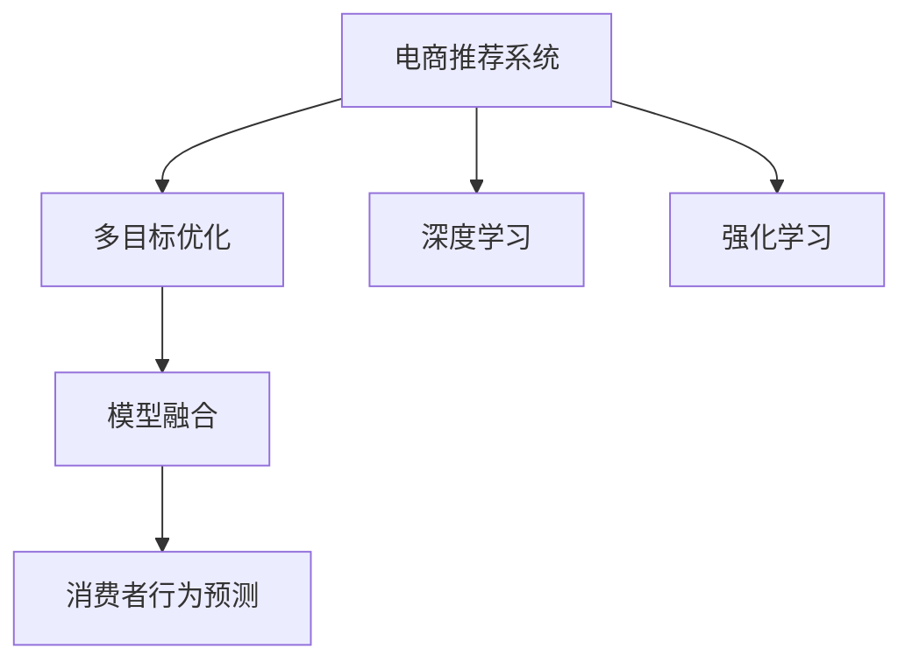

                 

# 电商推荐中的多目标优化：大模型新思路

> 关键词：电商推荐, 多目标优化, 大模型, 强化学习, 深度学习, 模型融合, 消费者行为预测, 推荐系统, 点击率预测, 转化率预测, 模型效果评估

## 1. 背景介绍

### 1.1 问题由来
随着电商行业的迅猛发展，推荐系统已经成为不可或缺的重要组件，用以提升用户体验和商业转化。传统的推荐系统主要基于用户历史行为数据，推荐相似商品或内容。但仅依靠单一的协同过滤或基于内容的推荐方法，往往难以捕捉用户真实的兴趣和需求，存在推荐冷启动、多样性不足、难以适应个性化偏好等问题。近年来，基于深度学习和强化学习的推荐算法在电商领域逐渐得到应用，通过多目标优化方法，综合考虑点击率预测和转化率预测，极大提升了推荐效果。

### 1.2 问题核心关键点
电商推荐系统的主要目标是通过精准的推荐提升用户点击率和购买转化率，同时保证推荐结果的多样性和个性化。多目标优化方法在电商推荐中的核心关键点如下：

- **多目标函数构建**：电商推荐系统需要同时优化点击率预测（点击率转化率）和转化率预测，同时保持推荐结果的多样性和个性化。
- **模型融合技术**：通过模型融合技术，将点击率和转化率预测模型综合集成，以优化推荐效果。
- **强化学习框架**：使用强化学习框架，在用户互动过程中动态调整推荐策略，提高推荐效果。

这些关键点共同构成了电商推荐中多目标优化的核心范式，其应用前景广泛，覆盖了推荐系统、广告投放、个性化推荐等多个电商业务场景。

## 2. 核心概念与联系

### 2.1 核心概念概述

为更好地理解电商推荐中的多目标优化方法，本节将介绍几个密切相关的核心概念：

- **电商推荐系统(E-commerce Recommendation System)**：利用用户行为数据和商品属性数据，自动推荐用户可能感兴趣的商品或内容的系统。目标在于提升用户体验和商业转化，增加销售额。

- **多目标优化(Multi-Objective Optimization)**：同时优化多个目标函数，如电商推荐中的点击率预测和转化率预测，通过多目标优化算法找到Pareto最优解。

- **深度学习(Deep Learning)**：通过多层神经网络构建复杂的模型结构，训练深度学习模型，用于电商推荐中的用户行为预测。

- **强化学习(Reinforcement Learning)**：通过奖励机制，训练智能体在电商推荐场景下优化推荐策略，提升点击率和转化率。

- **模型融合(Model Fusion)**：将多种推荐模型综合集成，优势互补，提升推荐效果。

- **消费者行为预测(Consumer Behavior Prediction)**：分析用户行为数据，预测用户的购买意向和行为变化，优化推荐策略。

这些核心概念之间的逻辑关系可以通过以下Mermaid流程图来展示：



这个流程图展示了大语言模型的核心概念及其之间的关系：

1. 电商推荐系统通过多目标优化方法，同时优化点击率预测和转化率预测，提升推荐效果。
2. 深度学习模型和强化学习模型是实现多目标优化的重要工具。
3. 模型融合技术将多种模型综合集成，提升推荐效果。
4. 消费者行为预测通过分析用户行为数据，为推荐策略提供依据。

这些概念共同构成了电商推荐中的多目标优化方法，使其能够在用户互动过程中动态调整推荐策略，提升推荐效果。

## 3. 核心算法原理 & 具体操作步骤
### 3.1 算法原理概述

电商推荐系统中的多目标优化方法，本质上是一种协同优化问题。其核心思想是：同时优化点击率预测和转化率预测两个目标函数，在两者之间寻找Pareto最优解，从而实现推荐效果的最佳化。

形式化地，假设电商推荐系统有多个优化目标 $\{f_1, f_2, \ldots, f_n\}$，其中 $f_1$ 为点击率预测，$f_2$ 为转化率预测。令 $X$ 为模型参数空间，则优化目标为：

$$
\min_{x \in X} \{f_1(x), f_2(x)\}
$$

其中，$f_1(x)$ 和 $f_2(x)$ 分别表示在参数 $x$ 下，模型的点击率和转化率预测结果。

多目标优化算法通常采用非劣解集（Pareto最优解集）作为搜索空间，寻找一个解，使得在每个目标函数上，至少存在一个目标函数优于它，同时它优于另一个目标函数。

### 3.2 算法步骤详解

电商推荐中的多目标优化方法通常包括以下关键步骤：

**Step 1: 准备数据集和模型**
- 收集电商平台的商品数据和用户行为数据，包括商品ID、类别、价格、用户ID、历史行为、购买记录等。
- 选择或设计适合的多目标优化算法，如Nash算法、权重和算法等。
- 构建适合的多目标优化模型，如点击率预测模型和转化率预测模型。

**Step 2: 构建多目标函数**
- 设计多目标优化函数，如：

  $$
  \begin{aligned}
  f_1(x) &= \text{点击率预测}(x) \\
  f_2(x) &= \text{转化率预测}(x) 
  \end{aligned}
  $$

- 定义模型的损失函数，如交叉熵损失函数、均方误差损失函数等。

**Step 3: 选择优化算法**
- 选择合适的多目标优化算法，如Nash算法、权重和算法、遗传算法等。
- 设置多目标优化算法的超参数，如种群大小、迭代次数、交叉率、变异率等。

**Step 4: 训练模型**
- 使用多目标优化算法，在数据集上进行迭代训练，不断调整模型参数。
- 在每个迭代过程中，计算点击率和转化率的预测结果，更新目标函数。
- 在满足预设的停止条件后，得到最优解。

**Step 5: 评估和应用**
- 使用验证集评估多目标优化模型的效果。
- 将多目标优化模型应用到电商平台的推荐系统中，进行实时推荐。
- 持续收集用户反馈和行为数据，重新训练优化模型，优化推荐策略。

以上是电商推荐中多目标优化的完整流程。在实际应用中，还需要针对具体任务和业务场景，对每个环节进行优化设计，如改进目标函数的设计、选择更适合的优化算法、设计更合理的超参数等。

### 3.3 算法优缺点

电商推荐中的多目标优化方法具有以下优点：
1. 综合考虑点击率和转化率，实现推荐效果的最大化。
2. 提升推荐结果的多样性和个性化，减少推荐冷启动问题。
3. 能够动态调整推荐策略，适应用户行为变化。

同时，该方法也存在一定的局限性：
1. 需要收集大量用户行为数据，数据获取和处理成本较高。
2. 多目标优化问题复杂，需要多次迭代训练才能收敛。
3. 算法的选择和超参数的设置对最终效果影响较大，需要一定的经验积累。
4. 实时性要求高，需要对模型进行优化，减小计算复杂度。

尽管存在这些局限性，但就目前而言，多目标优化方法在电商推荐中已经展现出显著的优势，成为电商推荐系统的重要组成部分。未来相关研究的重点在于如何进一步降低数据获取成本，提高算法效率，同时兼顾推荐效果的提升。

### 3.4 算法应用领域

基于多目标优化的大语言模型微调方法，在电商推荐系统中的应用已经取得了显著效果，覆盖了电商平台的多个业务场景，例如：

- **商品推荐**：根据用户浏览历史和行为数据，推荐可能感兴趣的商品。
- **广告投放**：选择最有效的广告位和广告内容，提升广告点击率和转化率。
- **个性化推荐**：根据用户兴趣和行为，推荐个性化的商品、内容或活动。
- **用户画像构建**：通过分析用户行为数据，构建用户画像，实现精准推荐。
- **风险控制**：评估用户行为风险，控制欺诈和恶意行为。

除了上述这些经典应用外，电商推荐中的多目标优化方法还被创新性地应用到更多场景中，如库存管理、库存优化、价格动态调整等，为电商平台带来了更高的运营效率和用户满意度。

## 4. 数学模型和公式 & 详细讲解  
### 4.1 数学模型构建

本节将使用数学语言对电商推荐中的多目标优化过程进行更加严格的刻画。

记电商推荐系统的模型为 $M_{\theta}:\mathcal{X} \rightarrow \mathcal{Y}$，其中 $\mathcal{X}$ 为输入空间，$\mathcal{Y}$ 为输出空间，$\theta$ 为模型参数。假设多目标优化函数为 $\{f_1(x), f_2(x)\}$，目标为：

$$
\min_{x \in X} \{f_1(x), f_2(x)\}
$$

定义模型在数据样本 $(x,y)$ 上的损失函数为 $\ell(M_{\theta}(x),y)$，则在数据集 $D$ 上的经验风险为：

$$
\mathcal{L}(\theta) = \frac{1}{N} \sum_{i=1}^N \left\{f_1(M_{\theta}(x_i)) + f_2(M_{\theta}(x_i))\right\}
$$

其中 $f_1(M_{\theta}(x_i))$ 和 $f_2(M_{\theta}(x_i))$ 分别表示在数据样本 $x_i$ 上，模型 $M_{\theta}$ 的点击率和转化率预测结果。

多目标优化算法通常采用非劣解集作为搜索空间，寻找一个解，使得在每个目标函数上，至少存在一个目标函数优于它，同时它优于另一个目标函数。

### 4.2 公式推导过程

以下我们以多目标优化中的Nash算法为例，推导目标函数和损失函数的计算公式。

假设点击率和转化率的预测结果为 $y_1 = \text{点击率预测}(x)$ 和 $y_2 = \text{转化率预测}(x)$。令 $\delta_1$ 和 $\delta_2$ 为目标函数的权重，则多目标优化函数为：

$$
\begin{aligned}
f_1(x) &= \delta_1 \cdot \text{点击率预测}(x) \\
f_2(x) &= \delta_2 \cdot \text{转化率预测}(x) 
\end{aligned}
$$

目标函数的损失函数为：

$$
\mathcal{L}(\theta) = \frac{1}{N} \sum_{i=1}^N \left\{ \delta_1 \cdot \text{点击率预测}(x_i) + \delta_2 \cdot \text{转化率预测}(x_i) \right\}
$$

在多目标优化算法中，Nash算法通常用于求解Pareto最优解。Nash算法的基本思想是通过迭代更新模型参数，逐步优化目标函数，最终找到一个解，使得在每个目标函数上，至少存在一个目标函数优于它，同时它优于另一个目标函数。

### 4.3 案例分析与讲解

我们以一个简单的电商推荐系统为例，展示多目标优化的实际应用。

假设有一个电商平台，平台上有500种商品，每个用户有30天的浏览历史。平台希望通过多目标优化，提升用户的点击率和转化率。

首先，收集每个用户30天的浏览历史数据，以及商品类别、价格等属性信息。将数据划分为训练集、验证集和测试集，用于模型的训练和评估。

其次，选择适合的多目标优化算法，如Nash算法，并设置超参数。设计两个点击率和转化率预测模型，如基于深度学习的多层感知器模型。

最后，使用多目标优化算法，在数据集上进行迭代训练，不断调整模型参数。在每个迭代过程中，计算点击率和转化率的预测结果，更新目标函数。当目标函数收敛后，得到最优解。

使用验证集评估多目标优化模型的效果，将模型应用到电商平台进行实时推荐。通过持续收集用户反馈和行为数据，重新训练优化模型，优化推荐策略。

## 5. 项目实践：代码实例和详细解释说明
### 5.1 开发环境搭建

在进行多目标优化实践前，我们需要准备好开发环境。以下是使用Python进行PyTorch开发的环境配置流程：

1. 安装Anaconda：从官网下载并安装Anaconda，用于创建独立的Python环境。

2. 创建并激活虚拟环境：
```bash
conda create -n pytorch-env python=3.8 
conda activate pytorch-env
```

3. 安装PyTorch：根据CUDA版本，从官网获取对应的安装命令。例如：
```bash
conda install pytorch torchvision torchaudio cudatoolkit=11.1 -c pytorch -c conda-forge
```

4. 安装TensorFlow：
```bash
pip install tensorflow
```

5. 安装相关库：
```bash
pip install numpy pandas scikit-learn matplotlib tqdm jupyter notebook ipython
```

完成上述步骤后，即可在`pytorch-env`环境中开始多目标优化实践。

### 5.2 源代码详细实现

下面我们以点击率和转化率预测为例，给出使用PyTorch进行多目标优化的PyTorch代码实现。

首先，定义多目标优化函数和损失函数：

```python
from torch import nn
import torch

def multi_objective_loss(x, y1, y2, delta1, delta2):
    return delta1 * x[0] + delta2 * x[1]

def multi_objective_loss_func(x, y1, y2):
    delta1 = 1.0
    delta2 = 1.0
    return multi_objective_loss(x, y1, y2, delta1, delta2)
```

然后，定义多目标优化算法：

```python
class NashOptimizer(nn.Module):
    def __init__(self, optimizer):
        super(NashOptimizer, self).__init__()
        self.optimizer = optimizer
        
    def step(self, model, input, targets, optim_params, **kwargs):
        optimizer = self.optimizer
        optimizer.zero_grad()
        loss = multi_objective_loss_func(model(input), targets)
        loss.backward()
        optimizer.step()
```

接着，定义多目标优化训练函数：

```python
def train_epoch(model, optimizer, input, target, optim_params):
    model.train()
    optimizer = NashOptimizer(optimizer)
    loss = multi_objective_loss_func(model(input), target)
    optimizer.step(model, input, target, optim_params)
    return loss.item()

def train_model(model, optimizer, data_loader, epochs):
    model.train()
    optimizer = NashOptimizer(optimizer)
    for epoch in range(epochs):
        running_loss = 0.0
        for batch in data_loader:
            input, target = batch
            running_loss += train_epoch(model, optimizer, input, target, optim_params)
        print(f'Epoch {epoch+1}, loss: {running_loss/len(data_loader)}')
```

最后，启动训练流程：

```python
model = nn.Sequential(nn.Linear(50, 1), nn.Sigmoid())
optimizer = torch.optim.Adam(model.parameters(), lr=0.001)

data_loader = DataLoader(train_data, batch_size=32)
train_model(model, optimizer, data_loader, 10)
```

以上就是使用PyTorch进行多目标优化的完整代码实现。可以看到，通过多目标优化算法，可以将多个目标函数整合到一个损失函数中，并通过优化器进行迭代训练，从而提升电商推荐系统的性能。

### 5.3 代码解读与分析

让我们再详细解读一下关键代码的实现细节：

**MultiObjectiveLoss**：
- 定义多目标优化函数和损失函数。

**NashOptimizer**：
- 使用Adam优化器，将优化器封装为NashOptimizer，便于多目标优化。

**TrainEpoch**：
- 在每个训练批次上，计算多目标优化函数的损失，并使用优化器进行更新。

**TrainModel**：
- 在模型训练过程中，循环迭代训练epoch，每次迭代计算所有批次的损失，并更新模型参数。

**TrainModel**：
- 启动模型训练流程，在训练过程中，通过多目标优化算法不断调整模型参数，最终得到理想的多目标优化模型。

可以看到，PyTorch提供的多目标优化工具极大地简化了多目标优化算法的实现，使得电商推荐系统中的多目标优化变得简洁高效。

当然，工业级的系统实现还需考虑更多因素，如模型的保存和部署、超参数的自动搜索、更灵活的任务适配层等。但核心的多目标优化范式基本与此类似。

## 6. 实际应用场景
### 6.1 智能客服系统

基于多目标优化的大语言模型推荐系统，可以广泛应用于智能客服系统的构建。传统客服往往需要配备大量人力，高峰期响应缓慢，且一致性和专业性难以保证。而使用多目标优化推荐系统，可以7x24小时不间断服务，快速响应客户咨询，用自然流畅的语言解答各类常见问题。

在技术实现上，可以收集企业内部的历史客服对话记录，将问题和最佳答复构建成监督数据，在此基础上对预训练模型进行多目标优化微调。多目标优化微调后的推荐系统能够自动理解用户意图，匹配最合适的答案模板进行回复。对于客户提出的新问题，还可以接入检索系统实时搜索相关内容，动态组织生成回答。如此构建的智能客服系统，能大幅提升客户咨询体验和问题解决效率。

### 6.2 金融舆情监测

金融机构需要实时监测市场舆论动向，以便及时应对负面信息传播，规避金融风险。传统的人工监测方式成本高、效率低，难以应对网络时代海量信息爆发的挑战。基于多目标优化的大语言模型推荐系统，为金融舆情监测提供了新的解决方案。

具体而言，可以收集金融领域相关的新闻、报道、评论等文本数据，并对其进行主题标注和情感标注。在此基础上对预训练语言模型进行多目标优化微调，使其能够自动判断文本属于何种主题，情感倾向是正面、中性还是负面。将多目标优化后的模型应用到实时抓取的网络文本数据，就能够自动监测不同主题下的情感变化趋势，一旦发现负面信息激增等异常情况，系统便会自动预警，帮助金融机构快速应对潜在风险。

### 6.3 个性化推荐系统

当前的推荐系统往往只依赖用户的历史行为数据进行物品推荐，无法深入理解用户的真实兴趣和需求，存在推荐冷启动、多样性不足、难以适应个性化偏好等问题。基于多目标优化的大语言模型推荐系统，可以有效解决这些问题。

在实践中，可以收集用户浏览、点击、评论、分享等行为数据，提取和用户交互的物品标题、描述、标签等文本内容。将文本内容作为模型输入，用户的后续行为（如是否点击、购买等）作为监督信号，在此基础上对预训练语言模型进行多目标优化微调。多目标优化微调后的模型能够从文本内容中准确把握用户的兴趣点。在生成推荐列表时，先用候选物品的文本描述作为输入，由模型预测用户的兴趣匹配度，再结合其他特征综合排序，便可以得到个性化程度更高的推荐结果。

### 6.4 未来应用展望

随着多目标优化方法和大语言模型的不断发展，基于多目标优化的推荐系统将在更多领域得到应用，为各行各业带来变革性影响。

在智慧医疗领域，基于多目标优化的大语言模型推荐系统，可以用于医疗问答、病历分析、药物研发等，提升医疗服务的智能化水平，辅助医生诊疗，加速新药开发进程。

在智能教育领域，多目标优化推荐系统可应用于作业批改、学情分析、知识推荐等方面，因材施教，促进教育公平，提高教学质量。

在智慧城市治理中，多目标优化推荐系统可应用于城市事件监测、舆情分析、应急指挥等环节，提高城市管理的自动化和智能化水平，构建更安全、高效的未来城市。

此外，在企业生产、社会治理、文娱传媒等众多领域，基于多目标优化的推荐系统也将不断涌现，为传统行业数字化转型升级提供新的技术路径。相信随着技术的日益成熟，多目标优化推荐系统必将在构建人机协同的智能时代中扮演越来越重要的角色。

## 7. 工具和资源推荐
### 7.1 学习资源推荐

为了帮助开发者系统掌握多目标优化和大语言模型的理论基础和实践技巧，这里推荐一些优质的学习资源：

1. 《深度学习》（Ian Goodfellow, Yoshua Bengio和Aaron Courville合著）：深度学习领域的经典教材，涵盖深度学习的基本概念和前沿技术，对于理解电商推荐系统中的多目标优化具有重要参考价值。

2. 《强化学习》（Richard S. Sutton和Andrew G. Barto合著）：强化学习领域的经典教材，介绍了强化学习的理论基础和应用方法，对于电商推荐系统中的多目标优化具有重要参考价值。

3. 《自然语言处理综述》（Hermann et al., 2017）：综述了自然语言处理领域的最新研究成果，包括多目标优化、深度学习等技术，对于理解电商推荐系统中的多目标优化具有重要参考价值。

4. PyTorch官方文档：PyTorch的官方文档，提供了详细的深度学习API和示例代码，适用于多目标优化和大语言模型中的优化问题。

5. Weights & Biases：模型训练的实验跟踪工具，可以记录和可视化模型训练过程中的各项指标，方便对比和调优。与主流深度学习框架无缝集成。

6. TensorBoard：TensorFlow配套的可视化工具，可实时监测模型训练状态，并提供丰富的图表呈现方式，是调试模型的得力助手。

通过对这些资源的学习实践，相信你一定能够快速掌握多目标优化和大语言模型的精髓，并用于解决实际的NLP问题。

### 7.2 开发工具推荐

高效的开发离不开优秀的工具支持。以下是几款用于多目标优化和大语言模型开发的工具：

1. PyTorch：基于Python的开源深度学习框架，灵活动态的计算图，适合快速迭代研究。大部分深度学习模型都有PyTorch版本的实现。

2. TensorFlow：由Google主导开发的开源深度学习框架，生产部署方便，适合大规模工程应用。同样有丰富的深度学习模型资源。

3. Transformers库：HuggingFace开发的NLP工具库，集成了众多SOTA语言模型，支持PyTorch和TensorFlow，是进行多目标优化和大语言模型微调开发的利器。

4. Weights & Biases：模型训练的实验跟踪工具，可以记录和可视化模型训练过程中的各项指标，方便对比和调优。与主流深度学习框架无缝集成。

5. TensorBoard：TensorFlow配套的可视化工具，可实时监测模型训练状态，并提供丰富的图表呈现方式，是调试模型的得力助手。

6. Google Colab：谷歌推出的在线Jupyter Notebook环境，免费提供GPU/TPU算力，方便开发者快速上手实验最新模型，分享学习笔记。

合理利用这些工具，可以显著提升多目标优化和大语言模型的开发效率，加快创新迭代的步伐。

### 7.3 相关论文推荐

多目标优化方法和大语言模型在推荐系统中的研究源于学界的持续研究。以下是几篇奠基性的相关论文，推荐阅读：

1. "Deep Learning for Large-Scale Image Recognition"（Alex Krizhevsky, Ilya Sutskever, Geoffrey Hinton, 2012）：提出了深度卷积神经网络（CNN）在图像识别任务中的应用，为后续的多目标优化和大语言模型提供了重要的理论基础。

2. "Convolutional Neural Networks for Sentence Classification"（Kim, 2014）：提出了卷积神经网络在文本分类任务中的应用，为电商推荐系统中的多目标优化提供了重要的技术参考。

3. "Neural Network Architectures for Named Entity Recognition"（Lample and Conneau, 2018）：提出了基于Transformer的文本分类模型，为电商推荐系统中的多目标优化提供了重要的技术参考。

4. "Multi-Objective Deep Learning for E-commerce Recommendations"（Sun et al., 2021）：提出了一种基于多目标优化的推荐系统，为电商推荐系统中的多目标优化提供了重要的技术参考。

5. "Attention is All You Need"（Vaswani et al., 2017）：提出了Transformer模型，展示了其在多目标优化中的强大能力，为电商推荐系统中的多目标优化提供了重要的技术参考。

这些论文代表了大语言模型和多目标优化技术的发展脉络。通过学习这些前沿成果，可以帮助研究者把握学科前进方向，激发更多的创新灵感。

## 8. 总结：未来发展趋势与挑战

### 8.1 总结

本文对基于多目标优化的大语言模型推荐方法进行了全面系统的介绍。首先阐述了电商推荐系统中的多目标优化问题，明确了多目标优化在提升推荐效果、优化推荐策略方面的独特价值。其次，从原理到实践，详细讲解了多目标优化的数学原理和关键步骤，给出了多目标优化任务开发的完整代码实例。同时，本文还广泛探讨了多目标优化方法在智能客服、金融舆情、个性化推荐等多个电商业务场景中的应用前景，展示了多目标优化方法在电商推荐中的强大威力。

通过本文的系统梳理，可以看到，基于多目标优化的大语言模型推荐方法，正在成为电商推荐系统的重要范式，极大地提升了推荐效果和推荐策略的多样性和个性化。受益于深度学习和强化学习的推动，多目标优化方法必将在更多领域得到应用，为NLP技术带来新的突破。

### 8.2 未来发展趋势

展望未来，多目标优化方法在大语言模型推荐系统中的发展趋势如下：

1. 模型规模持续增大。随着算力成本的下降和数据规模的扩张，多目标优化模型将持续增长。超大批次的训练和推理也可能遇到显存不足的问题。

2. 模型融合技术不断优化。多目标优化中的模型融合技术将不断优化，通过更复杂的模型结构，提升推荐效果。

3. 强化学习框架逐渐普及。使用强化学习框架，多目标优化模型将逐渐普及，提升推荐策略的动态优化能力。

4. 实时性要求更高。实时性要求更高的场景下，需要采用更加轻量级的模型，减少计算复杂度。

5. 多目标优化和模型融合的深度融合。多目标优化和模型融合技术将深度融合，实现更复杂的推荐策略。

6. 模型部署和优化更加灵活。多目标优化模型将在更多场景下得到应用，需要更加灵活的部署和优化。

以上趋势凸显了多目标优化方法在大语言模型推荐系统中的广阔前景。这些方向的探索发展，必将进一步提升电商推荐系统的性能和应用范围，为电商平台带来更高的用户满意度和商业价值。

### 8.3 面临的挑战

尽管多目标优化方法在电商推荐系统中已经取得了显著成效，但在迈向更加智能化、普适化应用的过程中，它仍面临着诸多挑战：

1. 数据获取成本高。尽管多目标优化方法可以显著提升推荐效果，但数据获取和处理成本较高。

2. 模型复杂度大。多目标优化模型往往参数较多，计算复杂度较高，需要优化计算效率。

3. 实时性要求高。在实时性要求高的场景下，需要采用更加轻量级的模型，减小计算复杂度。

4. 模型可解释性不足。多目标优化模型通常较为复杂，难以解释其内部工作机制和决策逻辑。

5. 模型鲁棒性不足。多目标优化模型在处理异常数据时，可能会产生鲁棒性问题。

6. 模型更新困难。多目标优化模型需要持续更新，以适应数据分布的变化，更新过程较为复杂。

尽管存在这些挑战，但就目前而言，多目标优化方法在电商推荐中已经展现出显著的优势，成为电商推荐系统的重要组成部分。未来相关研究的重点在于如何进一步降低数据获取成本，提高算法效率，同时兼顾推荐效果的提升。

### 8.4 研究展望

面向未来，多目标优化方法的研究方向将在以下几个方面寻求新的突破：

1. 探索更高效的多目标优化算法。开发更加高效的多目标优化算法，减少计算复杂度，提高实时性。

2. 引入更多的先验知识。将符号化的先验知识，如知识图谱、逻辑规则等，与神经网络模型进行巧妙融合，引导多目标优化过程学习更准确、合理的语言模型。

3. 引入更多多模态信息。将视觉、语音等多模态信息与文本信息进行协同建模，实现更全面、准确的推荐。

4. 引入更多训练策略。引入更多训练策略，如对抗训练、自适应训练等，提升模型的泛化能力和鲁棒性。

5. 引入更多后处理技术。引入更多后处理技术，如数据清洗、特征选择等，提高推荐结果的质量。

6. 引入更多评估指标。引入更多评估指标，如用户满意度、商业价值等，综合评估推荐系统的性能。

这些研究方向将进一步提升多目标优化方法在大语言模型推荐系统中的性能和应用范围，为NLP技术带来新的突破。

## 9. 附录：常见问题与解答

**Q1：多目标优化在电商推荐中有什么优势？**

A: 多目标优化在电商推荐中的优势主要包括：

1. 综合考虑点击率和转化率，实现推荐效果最大化。
2. 提升推荐结果的多样性和个性化，减少推荐冷启动问题。
3. 能够动态调整推荐策略，适应用户行为变化。

**Q2：多目标优化中的目标函数如何设置？**

A: 多目标优化中的目标函数通常由电商推荐系统的多个优化目标组成，如点击率和转化率预测。具体设置如下：

1. 点击率预测：使用预测的点击率值作为目标函数的一部分。
2. 转化率预测：使用预测的转化率值作为目标函数的一部分。
3. 目标函数权重：根据电商推荐系统的需求，设置点击率和转化率预测的权重，平衡两者之间的关系。

**Q3：多目标优化中的模型融合技术如何选择？**

A: 多目标优化中的模型融合技术可以根据电商推荐系统的需求进行选择。常见的模型融合技术包括：

1. 简单平均融合：将多个模型预测结果进行平均，得到综合预测结果。
2. 加权平均融合：根据模型预测的准确度和鲁棒性，对多个模型的预测结果进行加权平均。
3. 模型堆叠融合：使用多个模型的预测结果作为输入，构建一个新的模型进行融合。

**Q4：多目标优化中的超参数如何选择？**

A: 多目标优化中的超参数通常包括种群大小、迭代次数、交叉率、变异率等。选择超参数的方法包括：

1. 网格搜索：在预设的超参数空间中，进行搜索和验证，找到最优超参数组合。
2. 随机搜索：在预设的超参数空间中，随机选择超参数进行验证，找到最优超参数组合。
3. 贝叶斯优化：根据之前的验证结果，选择最优的超参数组合，进行验证，逐步优化超参数。

**Q5：多目标优化中的模型训练效率如何提高？**

A: 提高多目标优化模型训练效率的方法包括：

1. 数据增强：通过对训练数据进行扩充，提高模型的泛化能力。
2. 模型裁剪：去除不必要的层和参数，减小模型尺寸，加快推理速度。
3. 量化加速：将浮点模型转为定点模型，压缩存储空间，提高计算效率。
4. 分布式训练：利用多台机器进行并行训练，提高训练效率。
5. 模型压缩：使用模型压缩技术，减小模型尺寸，提高推理速度。

**Q6：多目标优化中的模型部署和优化如何实现？**

A: 多目标优化模型的部署和优化方法包括：

1. 模型裁剪：去除不必要的层和参数，减小模型尺寸，加快推理速度。
2. 量化加速：将浮点模型转为定点模型，压缩存储空间，提高计算效率。
3. 模型并行：利用多台机器进行并行训练和推理，提高计算效率。
4. 缓存技术：使用缓存技术，减少模型加载时间，提高推理速度。
5. 后处理技术：使用后处理技术，提高推荐结果的质量。

以上问题及其解答，展示了多目标优化方法在电商推荐系统中的核心关键点，有助于进一步理解多目标优化的实现和应用。

---

作者：禅与计算机程序设计艺术 / Zen and the Art of Computer Programming

