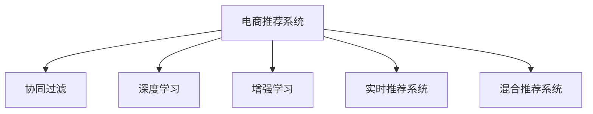

                 

## 1. 背景介绍

### 1.1 问题由来

电商推荐系统旨在通过个性化推荐，提高用户购物体验和平台销售转化率。然而，由于用户行为多样、动态变化，传统基于历史行为的推荐模型难以应对。近年来，实时个性化推荐技术迅速发展，通过动态分析用户行为和上下文信息，提供即时、精准的推荐服务，极大提升了用户满意度和平台收益。

### 1.2 问题核心关键点

实时个性化推荐的核心在于如何利用当前用户行为数据和上下文信息，动态调整推荐策略，使其更加符合用户的即时需求和偏好。目前主流方法包括：

- **基于协同过滤**：通过分析用户历史行为，推断相似用户偏好，进行推荐。
- **基于深度学习**：利用深度神经网络，对用户行为和上下文特征进行建模，动态调整推荐模型。
- **基于增强学习**：通过模拟环境奖励，学习用户行为和推荐效果的关系，优化推荐策略。
- **基于混合模型**：结合协同过滤、深度学习和增强学习，综合利用多种推荐方法的优势。

这些方法中，深度学习模型因其强大的表达能力和泛化能力，在实时个性化推荐中尤为受欢迎。

### 1.3 问题研究意义

实时个性化推荐技术对于电商平台而言，具有重要意义：

- **提升用户体验**：通过实时推荐，满足用户即时需求，增强粘性，提升购物体验。
- **提高转化率**：通过精准推荐，增加商品曝光和点击，提升销售转化率。
- **优化库存管理**：通过实时需求预测，优化库存配置，减少缺货和库存积压。
- **数据驱动决策**：基于用户行为数据，进行业务优化和决策，降低运营成本。

## 2. 核心概念与联系

### 2.1 核心概念概述

为更好地理解实时个性化推荐，本节将介绍几个密切相关的核心概念：

- **电商推荐系统(Online Recommendation System)**：基于用户历史行为、上下文信息和实时反馈，动态生成推荐列表的系统。
- **协同过滤(Collaborative Filtering)**：通过分析用户行为模式，推断用户兴趣，进行相似性匹配，推荐相似用户喜欢的商品。
- **深度学习(Deep Learning)**：利用多层神经网络，对用户行为和上下文进行建模，提取特征，预测推荐结果。
- **增强学习(Reinforcement Learning)**：通过模拟环境奖励，优化推荐策略，提高推荐效果。
- **实时推荐系统(Real-Time Recommendation System)**：基于实时数据流，动态调整推荐策略，提供即时推荐服务。
- **混合推荐系统(Hybrid Recommendation System)**：结合多种推荐方法，综合利用其优点，提高推荐精度和覆盖度。

这些核心概念之间的逻辑关系可以通过以下Mermaid流程图来展示：



这个流程图展示了几类推荐方法的逻辑关系：

1. 电商推荐系统是各类推荐方法的共同目标，通过不同方法，提供精准推荐。
2. 协同过滤、深度学习、增强学习是常见的推荐方法。
3. 实时推荐系统和混合推荐系统是动态调整推荐策略的高级形式，能够适应用户即时需求。

## 3. 核心算法原理 & 具体操作步骤
### 3.1 算法原理概述

实时个性化推荐的核心在于实时处理用户行为数据和上下文信息，动态生成个性化推荐列表。其核心思想是：通过分析用户历史行为和当前上下文，预测用户即时需求，生成推荐结果。

形式化地，假设用户 $u$ 在时间 $t$ 的当前上下文特征为 $c_t$，已展示商品为 $\mathcal{I}_t$，当前已点击商品为 $\mathcal{C}_t$，历史行为为 $\mathcal{H}_t$，推荐列表为 $L_t$。推荐过程可以表示为：

$$
L_t = f(\mathcal{H}_t, c_t, \mathcal{I}_t, \mathcal{C}_t)
$$

其中，$f$ 为推荐函数，表示根据用户历史行为和当前上下文，动态生成推荐列表。

### 3.2 算法步骤详解

实时个性化推荐的一般步骤如下：

**Step 1: 数据收集与预处理**
- 收集用户行为数据（点击、浏览、购买等）、商品信息、上下文信息（时间、地点、天气等）。
- 对数据进行清洗、归一化、标准化等预处理操作，生成推荐输入数据。

**Step 2: 特征工程**
- 设计推荐模型的输入特征，包括用户历史行为、当前上下文、已展示商品、已点击商品等。
- 使用特征工程技术，提取和组合特征，提高模型的表达能力。

**Step 3: 模型训练与优化**
- 根据历史推荐数据，使用监督学习或增强学习算法训练推荐模型。
- 使用交叉验证、正则化等技术，优化模型参数，提高推荐精度。

**Step 4: 实时推荐**
- 对实时数据流进行动态处理，预测用户即时需求，生成推荐结果。
- 使用缓存、异步处理等技术，提升推荐响应速度。

**Step 5: 结果评估与反馈**
- 对推荐结果进行评估，使用准确率、召回率、覆盖率等指标衡量推荐效果。
- 根据用户反馈，调整推荐策略，提高推荐效果。

### 3.3 算法优缺点

实时个性化推荐方法具有以下优点：
1. 动态适应用户需求：通过实时分析用户行为，提供即时推荐，提高用户满意度。
2. 精准预测用户偏好：利用深度学习等先进技术，挖掘用户深层次需求，提高推荐精度。
3. 优化用户体验：推荐算法能够不断学习用户行为，进行动态调整，提升用户体验。

同时，该方法也存在一定的局限性：
1. 数据量大：实时推荐需要处理大规模数据流，对系统处理能力提出了较高要求。
2. 算法复杂度高：深度学习、增强学习等先进算法，计算复杂度高，需要较强计算资源。
3. 冷启动问题：对于新用户或新商品，缺乏足够历史数据，难以进行精准推荐。
4. 实时性要求高：推荐模型需要实时处理数据流，对系统实时处理能力要求高。

尽管存在这些局限性，但就目前而言，实时个性化推荐方法在电商平台的应用最为广泛，已成为电商推荐系统的核心技术。未来相关研究重点在于如何降低实时推荐对计算资源的需求，提高推荐系统的实时性和泛化能力，同时兼顾推荐效果的提升。

### 3.4 算法应用领域

实时个性化推荐技术在电商领域得到了广泛的应用，覆盖了几乎所有常见的推荐场景，例如：

- 商品推荐：基于用户历史购买行为和当前上下文，动态生成商品推荐列表。
- 跨品类推荐：将用户在不同品类下的兴趣进行关联，推荐相关商品。
- 个性化搜索：根据用户搜索行为和上下文信息，生成个性化的搜索结果。
- 内容推荐：根据用户浏览行为和上下文信息，推荐相关内容。
- 促销推荐：根据用户购物行为和促销信息，推荐优惠活动。

除了这些经典应用外，实时个性化推荐还被创新性地应用到更多场景中，如广告推荐、竞价排名、流量分配等，为电商平台带来了新的业务增长点。

## 4. 数学模型和公式 & 详细讲解 & 举例说明

### 4.1 数学模型构建

本节将使用数学语言对实时个性化推荐过程进行更加严格的刻画。

记用户 $u$ 在时间 $t$ 的当前上下文特征为 $c_t \in \mathcal{C}$，已展示商品为 $\mathcal{I}_t$，当前已点击商品为 $\mathcal{C}_t \subseteq \mathcal{I}_t$。设历史行为为 $\mathcal{H}_t = \{(h_1, i_1), (h_2, i_2), \ldots, (h_m, i_m)\}$，其中 $h_j = (t_j, x_j, c_j)$ 表示历史行为的时间和上下文特征，$i_j \in \mathcal{I}$ 表示历史行为中的商品。推荐函数为 $f$，推荐列表为 $L_t$。

推荐过程可以表示为：

$$
L_t = f(\mathcal{H}_t, c_t, \mathcal{I}_t, \mathcal{C}_t)
$$

其中，$f$ 为推荐函数，可以表示为：

$$
f(\mathcal{H}_t, c_t, \mathcal{I}_t, \mathcal{C}_t) = \arg\max_{i \in \mathcal{I}_t} g(\mathcal{H}_t, c_t, i)
$$

其中 $g$ 为评分函数，表示根据历史行为和当前上下文，对商品进行评分。

### 4.2 公式推导过程

以下我们以深度学习模型为例，推导实时推荐系统的评分函数。

假设推荐模型为 $M_{\theta}:\mathcal{X} \rightarrow \mathcal{R}$，其中 $\mathcal{X}$ 为输入空间，$\mathcal{R}$ 为评分空间。使用神经网络对历史行为和上下文特征进行建模，得到评分向量 $s_i = M_{\theta}(\mathcal{H}_t, c_t, i)$，表示商品 $i$ 对用户 $u$ 在时间 $t$ 的评分。

评分函数 $g$ 可以表示为：

$$
g(\mathcal{H}_t, c_t, i) = s_i
$$

即直接使用评分向量 $s_i$ 作为推荐评分。

### 4.3 案例分析与讲解

以用户 $u$ 在时间 $t$ 的推荐过程为例，详细解读代码实现：

**输入数据准备**

假设用户 $u$ 在时间 $t$ 的历史行为为 $\mathcal{H}_t = \{(h_1, i_1), (h_2, i_2), \ldots, (h_m, i_m)\}$，其中 $h_j = (t_j, x_j, c_j)$，$i_j \in \mathcal{I}$。

**神经网络建模**

假设使用一个简单的神经网络模型，输入为历史行为和上下文特征的组合向量 $\mathcal{X}_t = \{x_t, c_t\}$，输出为评分向量 $s_i$。

**推荐评分计算**

根据评分函数 $g$，计算每个未展示商品 $i$ 的评分 $g_i = s_i$。

**推荐列表生成**

将评分排序，选择前 $n$ 个商品作为推荐列表 $L_t$。

## 5. 项目实践：代码实例和详细解释说明
### 5.1 开发环境搭建

在进行实时推荐系统开发前，我们需要准备好开发环境。以下是使用Python进行PyTorch开发的环境配置流程：

1. 安装Anaconda：从官网下载并安装Anaconda，用于创建独立的Python环境。

2. 创建并激活虚拟环境：
```bash
conda create -n pytorch-env python=3.8 
conda activate pytorch-env
```

3. 安装PyTorch：根据CUDA版本，从官网获取对应的安装命令。例如：
```bash
conda install pytorch torchvision torchaudio cudatoolkit=11.1 -c pytorch -c conda-forge
```

4. 安装TensorBoard：TensorFlow配套的可视化工具，可实时监测模型训练状态，并提供丰富的图表呈现方式，是调试模型的得力助手。

5. 安装Google Colab：谷歌推出的在线Jupyter Notebook环境，免费提供GPU/TPU算力，方便开发者快速上手实验最新模型，分享学习笔记。

完成上述步骤后，即可在`pytorch-env`环境中开始实时推荐系统的开发。

### 5.2 源代码详细实现

下面以协同过滤算法为例，给出使用PyTorch进行电商推荐系统开发的代码实现。

**协同过滤算法实现**

```python
import torch
import torch.nn as nn
import torch.nn.functional as F
from torch.utils.data import DataLoader
from torch.autograd import Variable

class CollaborativeFiltering(nn.Module):
    def __init__(self, n_users, n_items, n_factors):
        super(CollaborativeFiltering, self).__init__()
        self.n_users = n_users
        self.n_items = n_items
        self.n_factors = n_factors
        self.user_factors = nn.Embedding(n_users, n_factors)
        self.item_factors = nn.Embedding(n_items, n_factors)
        self.interactions = nn.Linear(n_factors * 2, 1)
    
    def forward(self, user_ids, item_ids, user_factors, item_factors):
        user_factors = self.user_factors(user_ids)
        item_factors = self.item_factors(item_ids)
        interactions = user_factors * item_factors.unsqueeze(1)
        interactions = interactions.view(-1, self.n_factors * 2)
        predictions = self.interactions(interactions)
        return predictions
    
    def predict(self, user_ids, item_ids):
        user_factors = self.user_factors(Variable(torch.LongTensor(user_ids)))
        item_factors = self.item_factors(Variable(torch.LongTensor(item_ids)))
        predictions = self.forward(user_ids, item_ids, user_factors, item_factors).data.numpy().squeeze()
        return predictions
```

在模型定义完成后，我们可以使用Syndata框架进行数据处理和模型训练。

**数据准备**

假设我们有用户行为数据和商品信息，使用Syndata框架进行数据处理。

```python
import syndata
from syndata.datasets import Breader

def build_dataloader(dataset, batch_size):
    reader = Breader(dataset)
    dataset = syndata.pipeline.impute.fillna_zero(reader)
    dataloader = DataLoader(dataset, batch_size=batch_size, shuffle=True)
    return dataloader
```

**模型训练**

使用Syndata框架进行模型训练，训练过程中需要设置超参数和学习率等。

```python
from syndata.learners import Trainer

n_epochs = 10
lr = 0.001
loss = nn.MSELoss()

learner = Trainer(model=collaborative_filtering, loss=loss, optimizer=torch.optim.Adam(model.parameters(), lr=lr))
learner.fit(dataloader, n_epochs=n_epochs)
```

在训练完成后，我们可以使用模型进行实时推荐。

**实时推荐**

假设用户 $u$ 在时间 $t$ 的历史行为为 $\mathcal{H}_t = \{(h_1, i_1), (h_2, i_2), \ldots, (h_m, i_m)\}$，使用模型进行实时推荐。

```python
def recommend(user_ids, item_ids):
    user_factors = collaborative_filtering.user_factors(Variable(torch.LongTensor(user_ids)))
    item_factors = collaborative_filtering.item_factors(Variable(torch.LongTensor(item_ids)))
    predictions = collaborative_filtering.forward(user_ids, item_ids, user_factors, item_factors).data.numpy().squeeze()
    return predictions
```

### 5.3 代码解读与分析

让我们再详细解读一下关键代码的实现细节：

**CollaborativeFiltering类**

- `__init__`方法：初始化用户和商品的因子嵌入层，以及交互矩阵的线性层。
- `forward`方法：计算用户和商品之间的交互矩阵，并进行线性变换，得到推荐评分。
- `predict`方法：根据用户和商品ID，计算推荐评分。

**build_dataloader函数**

- 使用Syndata框架的Breader类读取数据集。
- 使用impute.fillna_zero方法填补缺失值，确保数据完整性。
- 创建数据加载器，进行批量处理和随机打乱。

**Trainer类**

- 定义模型、损失函数和优化器。
- 使用Syndata框架的Trainer类进行模型训练，设置超参数和学习率。

**recommend函数**

- 使用模型计算推荐评分。
- 将评分转换为可解释的预测结果。

通过Syndata框架，我们可以看到实时推荐系统的开发过程，从数据准备、模型训练到实时推荐，每个环节都非常清晰和高效。

## 6. 实际应用场景

### 6.1 智能推荐系统

智能推荐系统是实时个性化推荐技术的重要应用场景。通过分析用户行为和上下文信息，动态生成推荐列表，提高用户满意度和平台收益。

在实际应用中，智能推荐系统可以广泛应用于电商平台、视频平台、音乐平台等，提供商品、电影、音乐等个性化推荐服务。

### 6.2 广告推荐系统

广告推荐系统利用实时个性化推荐技术，根据用户行为和上下文信息，精准投放广告，提高广告点击率和转化率。

在实际应用中，广告推荐系统可以应用于各类互联网广告平台，如百度、Google等，通过精准广告投放，提升平台收益。

### 6.3 内容推荐系统

内容推荐系统利用实时个性化推荐技术，根据用户浏览行为和上下文信息，动态生成推荐内容，提升用户使用体验和平台留存率。

在实际应用中，内容推荐系统可以应用于新闻平台、视频平台、社交平台等，提供新闻、视频、文章等个性化内容推荐服务。

### 6.4 智能客服系统

智能客服系统利用实时个性化推荐技术，根据用户历史行为和当前需求，动态生成推荐回答，提升用户服务体验和平台满意度。

在实际应用中，智能客服系统可以应用于各类电商平台、银行、保险公司等，提供7x24小时不间断服务，快速响应客户咨询。

## 7. 工具和资源推荐

### 7.1 学习资源推荐

为了帮助开发者系统掌握实时个性化推荐技术，这里推荐一些优质的学习资源：

1. 《推荐系统实践》：本书系统介绍了推荐系统的发展历程、基础原理和实际应用，适合初学者和进阶者阅读。
2. 《深度学习实战》：本书详细介绍了深度学习技术在推荐系统中的应用，包括协同过滤、深度学习等方法。
3. 《TensorFlow实战》：本书系统介绍了TensorFlow的深度学习框架，适合初学者和中级开发者阅读。
4. Coursera《推荐系统》课程：斯坦福大学开设的推荐系统课程，涵盖了推荐系统的基本原理和实际应用。
5. Kaggle推荐系统竞赛：通过实际数据集和竞赛任务，练习推荐系统算法，提升实战能力。

通过对这些资源的学习实践，相信你一定能够快速掌握实时个性化推荐技术的精髓，并用于解决实际的推荐问题。

### 7.2 开发工具推荐

高效的开发离不开优秀的工具支持。以下是几款用于实时推荐系统开发的常用工具：

1. PyTorch：基于Python的开源深度学习框架，灵活动态的计算图，适合快速迭代研究。

2. TensorFlow：由Google主导开发的开源深度学习框架，生产部署方便，适合大规模工程应用。

3. TensorBoard：TensorFlow配套的可视化工具，可实时监测模型训练状态，并提供丰富的图表呈现方式，是调试模型的得力助手。

4. Apache Spark：Hadoop的升级版本，适合大规模数据处理和机器学习任务。

5. PySpark：基于Python的Spark API，方便进行数据处理和机器学习任务。

6. Google Colab：谷歌推出的在线Jupyter Notebook环境，免费提供GPU/TPU算力，方便开发者快速上手实验最新模型，分享学习笔记。

合理利用这些工具，可以显著提升实时推荐系统的开发效率，加快创新迭代的步伐。

### 7.3 相关论文推荐

实时个性化推荐技术的发展源于学界的持续研究。以下是几篇奠基性的相关论文，推荐阅读：

1. "Collaborative Filtering for Implicit Feedback Datasets"：提出了基于矩阵分解的协同过滤方法，开创了协同过滤推荐系统。
2. "A Neural Probabilistic Language Model"：提出了基于神经网络的深度学习推荐方法，将推荐系统推向新高度。
3. "Adaptive Collaborative Filtering"：提出基于增强学习的自适应协同过滤方法，进一步提高了推荐精度。
4. "Hybrid Recommender Systems"：提出结合协同过滤和深度学习的混合推荐方法，提高了推荐效果和覆盖度。
5. "Real-Time Recommender Systems"：系统介绍了实时推荐系统的发展历程、基础原理和实际应用。

这些论文代表了大规模推荐系统的发展脉络。通过学习这些前沿成果，可以帮助研究者把握学科前进方向，激发更多的创新灵感。

## 8. 总结：未来发展趋势与挑战

### 8.1 总结

本文对实时个性化推荐技术进行了全面系统的介绍。首先阐述了实时个性化推荐技术的研究背景和意义，明确了推荐系统在提升用户体验、提高销售转化率方面的独特价值。其次，从原理到实践，详细讲解了实时推荐系统的数学原理和关键步骤，给出了推荐系统开发的完整代码实例。同时，本文还广泛探讨了实时推荐系统在电商、广告、内容、客服等多个行业领域的应用前景，展示了推荐技术在实际应用中的强大能力。

通过本文的系统梳理，可以看到，实时个性化推荐技术在电商平台的应用最为广泛，已成为推荐系统的核心技术。得益于深度学习等先进技术，推荐系统能够动态处理用户行为，提供精准推荐，极大提升了用户满意度和平台收益。未来，伴随推荐技术的不断发展，实时推荐系统必将在更多领域得到应用，为各行各业带来新的业务增长点。

### 8.2 未来发展趋势

展望未来，实时个性化推荐技术将呈现以下几个发展趋势：

1. 多模态推荐崛起：推荐系统将不仅仅依赖文本信息，还将引入图像、视频、语音等多模态信息，提供更丰富的推荐内容。
2. 实时性要求提升：实时推荐系统需要进一步提高实时性，保证推荐结果的即时性。
3. 推荐系统多样化：推荐系统将不仅仅局限于电商领域，还将应用于医疗、金融、教育等多个行业。
4. 推荐效果优化：推荐系统将更加注重推荐效果和用户体验，提供个性化推荐的同时，减少用户体验成本。
5. 推荐系统部署优化：推荐系统需要进一步优化部署效率，提高服务稳定性和可用性。

以上趋势凸显了实时个性化推荐技术在电商领域的广阔前景。这些方向的探索发展，必将进一步提升推荐系统的性能和应用范围，为电商平台带来更大的商业价值。

### 8.3 面临的挑战

尽管实时个性化推荐技术已经取得了瞩目成就，但在迈向更加智能化、普适化应用的过程中，它仍面临着诸多挑战：

1. 数据量大：实时推荐需要处理大规模数据流，对系统处理能力提出了较高要求。
2. 算法复杂度高：深度学习、增强学习等先进算法，计算复杂度高，需要较强计算资源。
3. 冷启动问题：对于新用户或新商品，缺乏足够历史数据，难以进行精准推荐。
4. 实时性要求高：推荐模型需要实时处理数据流，对系统实时处理能力要求高。

尽管存在这些局限性，但就目前而言，实时个性化推荐方法在电商平台的应用最为广泛，已成为推荐系统的核心技术。未来相关研究重点在于如何降低实时推荐对计算资源的需求，提高推荐系统的实时性和泛化能力，同时兼顾推荐效果的提升。

### 8.4 研究展望

面对实时推荐面临的种种挑战，未来的研究需要在以下几个方面寻求新的突破：

1. 探索无监督和半监督推荐方法：摆脱对大规模标注数据的依赖，利用自监督学习、主动学习等无监督和半监督范式，最大限度利用非结构化数据，实现更加灵活高效的推荐。
2. 研究参数高效和计算高效的推荐范式：开发更加参数高效的推荐方法，在固定大部分预训练参数的同时，只更新极少量的任务相关参数。同时优化推荐模型的计算图，减少前向传播和反向传播的资源消耗，实现更加轻量级、实时性的部署。
3. 引入更多先验知识：将符号化的先验知识，如知识图谱、逻辑规则等，与神经网络模型进行巧妙融合，引导推荐过程学习更准确、合理的推荐模型。同时加强不同模态数据的整合，实现视觉、语音等多模态信息与文本信息的协同建模。
4. 结合因果分析和博弈论工具：将因果分析方法引入推荐模型，识别出模型决策的关键特征，增强推荐结果的因果性和逻辑性。借助博弈论工具刻画人机交互过程，主动探索并规避模型的脆弱点，提高系统稳定性。
5. 纳入伦理道德约束：在推荐系统目标中引入伦理导向的评估指标，过滤和惩罚有偏见、有害的推荐结果，确保推荐内容符合用户价值观和伦理道德。

这些研究方向的探索，必将引领实时个性化推荐技术迈向更高的台阶，为构建更加安全、可靠、可解释、可控的推荐系统铺平道路。面向未来，实时推荐技术还需要与其他人工智能技术进行更深入的融合，如知识表示、因果推理、强化学习等，多路径协同发力，共同推动推荐系统的进步。只有勇于创新、敢于突破，才能不断拓展推荐系统的边界，让推荐技术更好地造福人类社会。

## 9. 附录：常见问题与解答

**Q1：实时推荐系统如何处理冷启动问题？**

A: 实时推荐系统通常会采用以下方法处理冷启动问题：
1. 利用用户的其他行为数据进行推荐：例如，对于新商品，可以使用用户的其他行为数据，如点击、浏览等，进行相似性匹配推荐。
2. 引入专家知识进行推荐：例如，对于新用户，可以使用专家制定的推荐规则，进行推荐。
3. 引入聚类算法进行推荐：例如，对于新用户，可以将用户聚类到已知的用户群体中，进行相似性匹配推荐。
4. 引入随机推荐：例如，对于新用户和新商品，可以随机推荐少量商品，逐步优化推荐结果。

**Q2：实时推荐系统如何处理数据稀疏问题？**

A: 实时推荐系统通常会采用以下方法处理数据稀疏问题：
1. 利用协同过滤进行推荐：例如，对于用户行为稀疏的数据，可以使用协同过滤方法，利用用户和商品之间的关系，进行推荐。
2. 利用矩阵分解进行推荐：例如，对于用户行为稀疏的数据，可以使用矩阵分解方法，将用户行为矩阵分解为用户和商品的因子表示，进行推荐。
3. 利用深度学习进行推荐：例如，对于用户行为稀疏的数据，可以使用深度学习模型，直接学习用户和商品之间的隐含关系，进行推荐。
4. 利用混合方法进行推荐：例如，对于用户行为稀疏的数据，可以结合多种推荐方法，综合利用其优点，进行推荐。

**Q3：实时推荐系统如何提高推荐效果？**

A: 实时推荐系统可以通过以下方法提高推荐效果：
1. 利用深度学习进行推荐：例如，利用神经网络模型，对用户行为和上下文信息进行建模，提高推荐精度。
2. 利用增强学习进行推荐：例如，利用模拟环境奖励，优化推荐策略，提高推荐效果。
3. 利用多模态信息进行推荐：例如，利用图像、视频、语音等多模态信息，提供更丰富的推荐内容。
4. 利用混合方法进行推荐：例如，结合多种推荐方法，综合利用其优点，提高推荐效果和覆盖度。

**Q4：实时推荐系统如何提高实时性？**

A: 实时推荐系统可以通过以下方法提高实时性：
1. 利用缓存机制进行推荐：例如，使用缓存技术，存储推荐结果，加快推荐速度。
2. 利用异步处理进行推荐：例如，使用异步处理技术，并行处理多个请求，提高推荐响应速度。
3. 利用分布式系统进行推荐：例如，使用分布式系统，分散处理数据和计算任务，提高实时性。
4. 利用GPU/TPU加速进行推荐：例如，使用GPU/TPU等高性能设备，加速推荐模型的计算和推理。

通过合理利用这些方法，可以显著提高实时推荐系统的实时性，保证推荐结果的即时性，提升用户满意度和平台收益。

**Q5：实时推荐系统如何提高可解释性？**

A: 实时推荐系统可以通过以下方法提高可解释性：
1. 利用可解释的推荐模型进行推荐：例如，使用可解释的推荐模型，如基于规则的推荐模型、基于逻辑的推荐模型等，提高推荐结果的可解释性。
2. 利用可解释的特征进行推荐：例如，使用可解释的特征，如用户行为特征、上下文特征等，提高推荐结果的可解释性。
3. 利用可解释的推荐算法进行推荐：例如，使用可解释的推荐算法，如协同过滤、深度学习等，提高推荐结果的可解释性。
4. 利用可解释的推荐技术进行推荐：例如，使用可解释的推荐技术，如推荐路径分析、推荐策略优化等，提高推荐结果的可解释性。

通过合理利用这些方法，可以显著提高实时推荐系统的可解释性，帮助用户理解和信任推荐结果，提升用户体验和平台满意度。

---

作者：禅与计算机程序设计艺术 / Zen and the Art of Computer Programming

