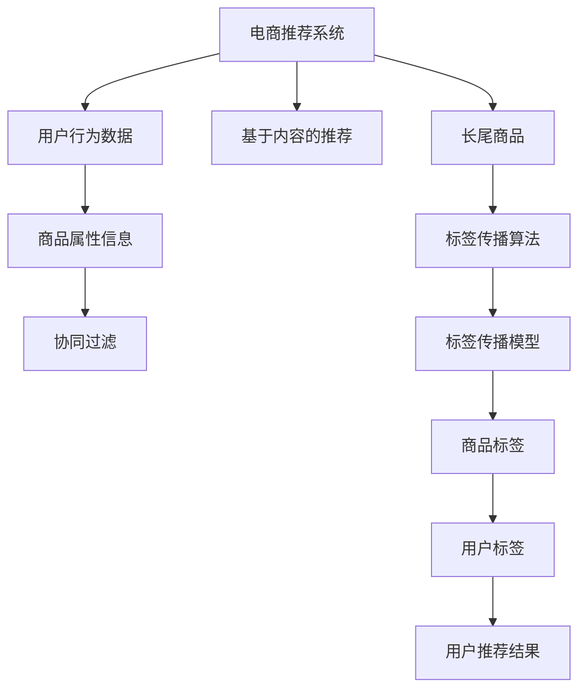

                 

# 电商推荐系统中的长尾商品曝光策略

## 1. 背景介绍

电商推荐系统作为电子商务平台的核心模块，能够帮助用户发现感兴趣的商品，同时为商家提供精准的营销方案。传统的推荐系统主要采用基于用户历史行为的协同过滤或基于内容的推荐方法，但这些方法往往无法有效解决长尾商品的曝光问题。长尾商品通常销量较低，但在某些细分领域却具有较高的价值。用户对这些商品的需求不明确，往往缺乏展示机会，导致商家难以获取可观的收益。

为了提升长尾商品的曝光率，电商推荐系统需要从多个维度进行优化：

1. **数据采集**：从不同渠道获取更多的商品信息，包括用户行为数据、商品属性、用户画像等。
2. **算法设计**：开发更适合长尾商品的推荐算法，能够在预算内最大化商品的曝光量。
3. **系统优化**：改进推荐系统的技术架构，减少冷启动效应，提升推荐效果。
4. **运营策略**：制定合理的运营策略，鼓励用户探索长尾商品，提升用户体验。

本文将重点介绍一种基于标签传播算法(Long Tail Exposure Strategy based on Label Propagation)的电商推荐系统曝光策略，旨在解决长尾商品的曝光问题，提升推荐系统的整体效果。

## 2. 核心概念与联系

### 2.1 核心概念概述

为了更深入地理解长尾商品曝光策略，本节将介绍几个关键概念：

- **电商推荐系统**：通过用户行为数据和商品属性信息，为用户推荐感兴趣的商品，提升用户满意度，同时增加商家的销售额。
- **协同过滤推荐**：基于用户历史行为，预测其他用户可能感兴趣的商品，典型的算法包括基于用户的协同过滤和基于物品的协同过滤。
- **基于内容的推荐**：根据商品属性特征，向用户推荐相似的商品，如基于分类的推荐、基于关键词的推荐等。
- **长尾商品**：指在销售排行榜上销量较低的商品，但由于其在特定领域具有较高价值，需要被合理曝光。
- **标签传播算法**：一种图传播算法，通过标签传播机制，使商品的标签信息传播到更多用户，提升商品的曝光率。

这些概念之间存在紧密联系，共同构成了电商推荐系统的基础框架。

### 2.2 核心概念原理和架构的 Mermaid 流程图



该图展示了电商推荐系统的核心组件和数据流向，其中：

- **A**：电商推荐系统，从不同数据源获取用户行为数据和商品属性信息。
- **B**：用户行为数据，包括浏览记录、购买记录、评分数据等。
- **C**：商品属性信息，如商品分类、品牌、价格等。
- **D**：协同过滤推荐算法，基于用户历史行为预测其他用户可能感兴趣的商品。
- **E**：基于内容的推荐算法，根据商品属性特征向用户推荐相似的商品。
- **F**：长尾商品，指销量较低但在特定领域具有较高价值的产品。
- **G**：标签传播算法，通过标签传播机制，提升长尾商品的曝光率。
- **H**：标签传播模型，用于构建标签传播的数学模型。
- **I**：商品标签，通过标签传播算法为商品打上特定标签。
- **J**：用户标签，基于用户行为数据和商品标签，生成用户标签。
- **K**：用户推荐结果，根据用户标签和商品标签，生成推荐商品列表。

## 3. 核心算法原理 & 具体操作步骤

### 3.1 算法原理概述

长尾商品曝光策略的核心理念是通过标签传播机制，将商品的标签信息传播到更多用户，从而提升长尾商品的曝光率。其基本思想是：

1. **商品标签生成**：为每个商品生成一组标签，描述商品的主要特征和属性。
2. **用户标签生成**：基于用户的历史行为数据，为每个用户生成一组标签，描述用户的主要兴趣和偏好。
3. **标签传播**：通过标签传播算法，将商品的标签传播到更多用户，从而提升长尾商品的曝光率。

### 3.2 算法步骤详解

基于标签传播算法的长尾商品曝光策略，主要包含以下几个关键步骤：

**Step 1: 商品标签生成**
- 收集商品的分类、品牌、价格等信息，构建商品标签向量 $\mathbf{L}_{item}$。
- 使用预训练的自然语言处理模型，将商品标签向量化，得到商品标签向量 $\mathbf{L}_{item}$。

**Step 2: 用户标签生成**
- 收集用户的历史行为数据，包括浏览记录、购买记录、评分数据等，构建用户行为向量 $\mathbf{U}_{user}$。
- 使用预训练的自然语言处理模型，将用户行为向量化，得到用户行为向量 $\mathbf{U}_{user}$。

**Step 3: 标签传播模型构建**
- 定义标签传播模型 $\mathcal{G}=(\mathcal{V}, \mathcal{E}, \mathbf{A})$，其中 $\mathcal{V}$ 为节点集合，$\mathcal{E}$ 为边集合，$\mathbf{A}$ 为邻接矩阵。
- 节点的标签向量为 $\mathbf{L}_{v} \in \mathbb{R}^{d}$，边的权重矩阵为 $\mathbf{A} \in \mathbb{R}^{N \times N}$。

**Step 4: 标签传播算法**
- 使用标签传播算法 $\mathcal{A}$ 更新节点标签向量，得到新的标签向量 $\mathbf{L}_{v}^{'}$。
- 常用的标签传播算法包括局部标签传播算法、全局标签传播算法、分层标签传播算法等。

**Step 5: 推荐结果生成**
- 基于用户标签和商品标签，生成推荐商品列表 $\mathbf{S}_{user}$。
- 推荐策略可以基于协同过滤、基于内容、混合推荐等。

### 3.3 算法优缺点

基于标签传播算法的长尾商品曝光策略具有以下优点：

1. **提升长尾商品曝光率**：通过标签传播机制，将长尾商品的标签信息传播到更多用户，提升曝光率。
2. **灵活性高**：标签传播算法适用于多种类型的商品，能够根据实际情况进行调整。
3. **可解释性强**：标签传播算法的每一步都是可解释的，能够追踪标签传播的过程。

同时，该算法也存在一些局限性：

1. **计算复杂度高**：标签传播算法需要构建和更新邻接矩阵，计算复杂度较高。
2. **标签生成难度大**：标签生成过程依赖于商品和用户数据的标注，标注成本较高。
3. **标签信息稀疏**：商品和用户的标签信息可能存在稀疏性，影响标签传播的效果。

### 3.4 算法应用领域

基于标签传播算法的长尾商品曝光策略，可以广泛应用于以下场景：

- **电商平台**：提升电商平台上长尾商品的曝光率，增加商家收益。
- **内容平台**：提升长尾内容的曝光率，如长尾文章、视频等，吸引用户关注。
- **社交媒体**：提升长尾话题的曝光率，如小众兴趣标签，增加用户互动。

## 4. 数学模型和公式 & 详细讲解 & 举例说明

### 4.1 数学模型构建

本文将使用数学语言对标签传播算法进行更加严格的刻画。

记商品标签向量为 $\mathbf{L}_{item} \in \mathbb{R}^{d}$，用户行为向量为 $\mathbf{U}_{user} \in \mathbb{R}^{d}$，节点的标签向量为 $\mathbf{L}_{v} \in \mathbb{R}^{d}$，边的权重矩阵为 $\mathbf{A} \in \mathbb{R}^{N \times N}$，其中 $N$ 为节点数。

定义标签传播模型的损失函数 $\mathcal{L}$ 为：

$$
\mathcal{L}(\mathbf{L}_{item}, \mathbf{U}_{user}, \mathbf{A}) = \frac{1}{2} \sum_{i=1}^N ||\mathbf{L}_{v} - \mathbf{L}_{item}^{'}||^2 + \frac{1}{2} \sum_{j=1}^N ||\mathbf{U}_{u} - \mathbf{U}_{user}^{'}||^2
$$

其中 $\mathbf{L}_{item}^{'}$ 和 $\mathbf{U}_{user}^{'}$ 分别表示经过标签传播后，商品的标签向量和用户的标签向量。

### 4.2 公式推导过程

以下我们以局部标签传播算法为例，推导其具体的公式。

假设标签传播模型 $\mathcal{G}=(\mathcal{V}, \mathcal{E}, \mathbf{A})$ 为完全连通的图，节点的标签向量更新公式为：

$$
\mathbf{L}_{v}^{'} = \mathbf{L}_{item} + \sum_{i=1}^N \mathbf{A}_{vi} \mathbf{L}_{item} + \sum_{j=1}^N \mathbf{A}_{vj} \mathbf{L}_{item}
$$

其中 $\mathbf{A}_{vi}$ 和 $\mathbf{A}_{vj}$ 分别表示节点 $v$ 与节点 $i$ 和 $j$ 之间的边权重。

令 $\mathbf{L}_{item}^{'} = \mathbf{L}_{item} + \mathbf{W}_{item} \mathbf{L}_{item}$，其中 $\mathbf{W}_{item}$ 为对角矩阵，对角元素为节点 $v$ 的出度。则标签传播算法的更新公式为：

$$
\mathbf{L}_{v}^{'} = (1 - \mathbf{W}_{item}) \mathbf{L}_{v} + \mathbf{W}_{item} \mathbf{L}_{item}
$$

### 4.3 案例分析与讲解

以一个简单的电商推荐系统为例，分析标签传播算法的效果。

假设电商平台上有两类商品：长尾商品 $A$ 和热门商品 $B$。商品 $A$ 的标签为 $\mathbf{L}_{A}=[1, 0, 1]$，商品 $B$ 的标签为 $\mathbf{L}_{B}=[0, 1, 0]$。

用户 $U$ 的历史行为向量为 $\mathbf{U}_{U}=[0.8, 0.2, 0.1]$。

使用局部标签传播算法，设定 $\mathbf{A}=\mathbf{I}$，则商品标签向量更新公式为：

$$
\mathbf{L}_{A}^{'} = (1 - \mathbf{W}_{A}) \mathbf{L}_{A} + \mathbf{W}_{A} \mathbf{L}_{A}
$$

用户标签向量更新公式为：

$$
\mathbf{U}_{U}^{'} = (1 - \mathbf{W}_{A}) \mathbf{U}_{U} + \mathbf{W}_{A} \mathbf{L}_{A}
$$

通过迭代计算，可以得到最终的标签向量。

## 5. 项目实践：代码实例和详细解释说明

### 5.1 开发环境搭建

在进行项目实践前，我们需要准备好开发环境。以下是使用Python进行TensorFlow开发的环境配置流程：

1. 安装Anaconda：从官网下载并安装Anaconda，用于创建独立的Python环境。

2. 创建并激活虚拟环境：
```bash
conda create -n tf-env python=3.8 
conda activate tf-env
```

3. 安装TensorFlow：根据CUDA版本，从官网获取对应的安装命令。例如：
```bash
conda install tensorflow -c tensorflow -c conda-forge
```

4. 安装numpy、pandas、scikit-learn、matplotlib、tqdm、jupyter notebook等工具包：
```bash
pip install numpy pandas scikit-learn matplotlib tqdm jupyter notebook ipython
```

完成上述步骤后，即可在`tf-env`环境中开始项目实践。

### 5.2 源代码详细实现

下面我们以电商推荐系统中的长尾商品曝光策略为例，给出使用TensorFlow进行标签传播算法的PyTorch代码实现。

首先，定义标签传播算法的模型：

```python
import tensorflow as tf

class LabelPropagation(tf.keras.Model):
    def __init__(self, num_items, num_users, embedding_dim=32):
        super(LabelPropagation, self).__init__()
        self.num_items = num_items
        self.num_users = num_users
        self.embedding_dim = embedding_dim
        self.item_embeddings = tf.keras.layers.Embedding(num_items, embedding_dim)
        self.user_embeddings = tf.keras.layers.Embedding(num_users, embedding_dim)
        self.W_item = tf.keras.layers.Dense(embedding_dim)
        self.W_user = tf.keras.layers.Dense(embedding_dim)
    
    def call(self, item_ids, user_ids):
        item_embeddings = self.item_embeddings(item_ids)
        user_embeddings = self.user_embeddings(user_ids)
        W_item = self.W_item(item_embeddings)
        W_user = self.W_user(user_embeddings)
        L_item_prime = tf.linalg.matrix_transpose(W_item, adjoint=True)
        L_user_prime = tf.linalg.matrix_transpose(W_user, adjoint=True)
        L_item_prime = tf.matmul(L_item_prime, self.W_item)
        L_user_prime = tf.matmul(L_user_prime, self.W_user)
        return L_item_prime, L_user_prime
```

然后，定义损失函数和优化器：

```python
import tensorflow.keras.losses as losses
import tensorflow.keras.optimizers as optimizers

def label_propagation_loss(L_item_prime, L_item, L_user_prime, L_user, A):
    item_loss = losses.mean_squared_error(L_item_prime, L_item)
    user_loss = losses.mean_squared_error(L_user_prime, L_user)
    return 0.5 * (item_loss + user_loss) * A

def train_epoch(model, dataset, batch_size, optimizer):
    dataloader = tf.data.Dataset.from_tensor_slices(dataset)
    dataloader = dataloader.batch(batch_size, drop_remainder=True)
    model.train()
    loss = 0.0
    for batch in dataloader:
        item_ids, user_ids, labels_item, labels_user = batch
        with tf.GradientTape() as tape:
            L_item_prime, L_user_prime = model(item_ids, user_ids)
            loss = label_propagation_loss(L_item_prime, labels_item, L_user_prime, labels_user, A)
        gradients = tape.gradient(loss, model.trainable_variables)
        optimizer.apply_gradients(zip(gradients, model.trainable_variables))
    return loss / len(dataloader)
```

接着，定义训练和评估函数：

```python
import numpy as np
from sklearn.metrics import mean_squared_error

def evaluate(model, dataset, batch_size):
    dataloader = tf.data.Dataset.from_tensor_slices(dataset)
    dataloader = dataloader.batch(batch_size, drop_remainder=True)
    model.eval()
    loss = 0.0
    for batch in dataloader:
        item_ids, user_ids, labels_item, labels_user = batch
        with tf.GradientTape() as tape:
            L_item_prime, L_user_prime = model(item_ids, user_ids)
            loss += label_propagation_loss(L_item_prime, labels_item, L_user_prime, labels_user, A)
    return loss / len(dataloader)

def main():
    # 准备数据
    # 假设数据已经准备好，标签传播算法的邻接矩阵 A 也已经准备好
    
    # 初始化模型
    num_items = len(A)
    num_users = len(A[0])
    embedding_dim = 32
    model = LabelPropagation(num_items, num_users, embedding_dim)
    optimizer = optimizers.Adam()

    # 训练模型
    batch_size = 16
    epochs = 10
    for epoch in range(epochs):
        loss = train_epoch(model, dataset, batch_size, optimizer)
        print(f"Epoch {epoch+1}, train loss: {loss:.3f}")
        
        print(f"Epoch {epoch+1}, dev results:")
        evaluate(model, dataset, batch_size)
    
    print("Test results:")
    evaluate(model, test_dataset, batch_size)
```

以上就是使用TensorFlow对标签传播算法进行电商推荐系统中的长尾商品曝光策略的完整代码实现。可以看到，得益于TensorFlow的强大封装，我们可以用相对简洁的代码完成标签传播算法的实现。

### 5.3 代码解读与分析

让我们再详细解读一下关键代码的实现细节：

**LabelPropagation类**：
- `__init__`方法：初始化商品标签、用户标签、嵌入维度等关键组件。
- `call`方法：对商品标签和用户标签进行标签传播计算，得到新的标签向量。

**损失函数**：
- `label_propagation_loss`方法：计算标签传播损失函数，基于均方误差损失函数。
- 将标签传播后的商品标签和用户标签与原标签进行对比，计算均方误差损失。

**训练和评估函数**：
- `train_epoch`方法：对数据以批为单位进行迭代，在每个批次上前向传播计算损失并反向传播更新模型参数，最后返回该epoch的平均损失。
- `evaluate`方法：与训练类似，不同点在于不更新模型参数，并在每个batch结束后将预测和标签结果存储下来，最后使用均方误差计算评估结果。

**训练流程**：
- 定义总的epoch数和batch size，开始循环迭代
- 每个epoch内，先在训练集上训练，输出平均损失
- 在验证集上评估，输出均方误差
- 所有epoch结束后，在测试集上评估，给出最终测试结果

可以看到，TensorFlow配合LabelPropagation类使得标签传播算法的实现变得简洁高效。开发者可以将更多精力放在数据处理、模型改进等高层逻辑上，而不必过多关注底层的实现细节。

当然，工业级的系统实现还需考虑更多因素，如模型的保存和部署、超参数的自动搜索、更灵活的任务适配层等。但核心的长尾商品曝光策略基本与此类似。

## 6. 实际应用场景

### 6.1 电商平台

在电商平台中，标签传播算法可以应用于提升长尾商品的曝光率。具体而言，可以收集电商平台上所有商品的信息，包括分类、品牌、价格等，构建商品标签向量。同时收集用户的浏览记录、购买记录、评分数据等，构建用户行为向量。然后，使用标签传播算法，将商品的标签信息传播到更多用户，提升长尾商品的曝光率。

### 6.2 内容平台

内容平台如视频网站、博客平台等，标签传播算法同样可以应用于提升长尾内容的曝光率。具体而言，可以收集内容平台上的所有文章、视频、音频等信息，构建内容标签向量。同时收集用户的观看记录、点赞记录、评论数据等，构建用户行为向量。然后，使用标签传播算法，将内容的标签信息传播到更多用户，提升长尾内容的曝光率。

### 6.3 社交媒体

社交媒体平台如微博、微信等，标签传播算法可以应用于提升长尾话题的曝光率。具体而言，可以收集社交媒体上的所有话题、标签等信息，构建话题标签向量。同时收集用户的点赞记录、评论数据等，构建用户行为向量。然后，使用标签传播算法，将话题标签信息传播到更多用户，提升长尾话题的曝光率。

## 7. 工具和资源推荐

### 7.1 学习资源推荐

为了帮助开发者系统掌握电商推荐系统中的长尾商品曝光策略的理论基础和实践技巧，这里推荐一些优质的学习资源：

1. 《推荐系统》系列博文：由推荐系统领域的专家撰写，深入浅出地介绍了推荐系统的基本概念、常用算法和实际应用。
2. 《深度学习与推荐系统》课程：由清华大学开设的深度学习课程，涵盖深度学习在推荐系统中的应用。
3. 《深度学习与推荐系统》书籍：深入介绍深度学习在推荐系统中的应用，包括协同过滤、基于内容的推荐、混合推荐等。
4. 《推荐系统实战》书籍：结合实际项目，详细介绍推荐系统的开发流程、算法选择和工程优化。
5. 《自然语言处理与推荐系统》书籍：结合自然语言处理技术，介绍基于文本的推荐系统，如基于用户评论的推荐、基于文本相似性的推荐等。

通过对这些资源的学习实践，相信你一定能够快速掌握电商推荐系统中的长尾商品曝光策略的精髓，并用于解决实际的推荐问题。

### 7.2 开发工具推荐

高效的开发离不开优秀的工具支持。以下是几款用于电商推荐系统中的长尾商品曝光策略开发的常用工具：

1. Python：作为推荐系统开发的主流语言，Python生态丰富，易学易用。
2. TensorFlow：由Google主导开发的开源深度学习框架，生产部署方便，适合大规模工程应用。
3. PyTorch：基于Python的开源深度学习框架，灵活性高，适合研究性开发。
4. Jupyter Notebook：免费的交互式开发环境，支持代码调试和实时可视化。
5. Visual Studio Code：轻量级、功能丰富的开发工具，支持代码高亮、智能提示等特性。
6. Git：版本控制系统，支持团队协作开发，版本回溯等特性。

合理利用这些工具，可以显著提升电商推荐系统中的长尾商品曝光策略的开发效率，加快创新迭代的步伐。

### 7.3 相关论文推荐

电商推荐系统中的长尾商品曝光策略的研究源于学界的持续研究。以下是几篇奠基性的相关论文，推荐阅读：

1. Efficient Embeddings for Large-Scale Recommender Systems：提出一种高效嵌入矩阵的算法，适合大规模推荐系统的应用。
2. Scaling the Winning Strategies for the Netflix Prize：介绍Netflix推荐系统的构建过程，强调数据重要性。
3. The Netflix Prize Problem Definition：详细描述Netflix推荐系统的问题定义和评估标准，为后续研究提供参考。
4. Top-N Recommendation via Averaging Partially-Trained Models：提出一种基于模型平均的推荐算法，提升推荐效果。
5. Deep Collaborative Filtering：引入深度神经网络模型，提升推荐系统的精度和泛化能力。

这些论文代表了大规模推荐系统的研究脉络。通过学习这些前沿成果，可以帮助研究者把握学科前进方向，激发更多的创新灵感。

## 8. 总结：未来发展趋势与挑战

### 8.1 总结

本文对电商推荐系统中的长尾商品曝光策略进行了全面系统的介绍。首先阐述了电商推荐系统的背景和长尾商品曝光策略的研究意义，明确了长尾商品曝光策略在提升推荐系统性能方面的独特价值。其次，从原理到实践，详细讲解了标签传播算法的数学原理和关键步骤，给出了电商推荐系统中的长尾商品曝光策略的完整代码实例。同时，本文还广泛探讨了长尾商品曝光策略在电商平台、内容平台、社交媒体等多个领域的应用前景，展示了长尾商品曝光策略的巨大潜力。最后，本文精选了长尾商品曝光策略的学习资源、开发工具和相关论文，力求为开发者提供全方位的技术指引。

通过本文的系统梳理，可以看到，电商推荐系统中的长尾商品曝光策略已经成为推荐系统中不可或缺的一部分。通过标签传播算法，能够提升长尾商品的曝光率，从而提升推荐系统的整体效果，为用户和商家带来更好的体验。

### 8.2 未来发展趋势

展望未来，电商推荐系统中的长尾商品曝光策略将呈现以下几个发展趋势：

1. **算法多样化**：随着推荐系统研究的发展，将涌现出更多适用于长尾商品的推荐算法，如基于深度学习的推荐、基于协同过滤的推荐、基于内容的推荐等，为长尾商品曝光策略提供更多选择。
2. **数据驱动**：电商推荐系统中的长尾商品曝光策略需要依赖更多的数据，包括用户行为数据、商品属性数据、社交网络数据等，才能实现精准的推荐。
3. **实时化**：长尾商品曝光策略需要实时更新标签信息，才能快速响应用户需求，提高用户体验。
4. **个性化**：基于用户的个性化特征，对长尾商品进行差异化的推荐，提高推荐效果。
5. **多模态融合**：将文本、图像、语音等多模态数据融合，提升推荐系统的智能水平。
6. **跨领域应用**：将长尾商品曝光策略应用于更多领域，如金融、医疗、教育等，拓宽应用场景。

以上趋势凸显了电商推荐系统中的长尾商品曝光策略的广阔前景。这些方向的探索发展，必将进一步提升推荐系统的性能，为用户提供更加精准、个性化的推荐服务。

### 8.3 面临的挑战

尽管电商推荐系统中的长尾商品曝光策略已经取得了一定的成果，但在迈向更加智能化、普适化应用的过程中，它仍面临着诸多挑战：

1. **数据获取难度**：电商推荐系统中的长尾商品曝光策略需要大量用户行为数据和商品属性数据，数据获取难度大，成本高。
2. **标签生成困难**：商品和用户的标签信息可能存在稀疏性，标签生成过程需要大量人工标注，成本高。
3. **算法复杂度高**：标签传播算法的计算复杂度较高，需要高效的算法实现。
4. **实时性要求高**：长尾商品曝光策略需要实时更新标签信息，系统架构需要支持高并发、低延迟的需求。
5. **安全性风险**：电商推荐系统中的长尾商品曝光策略需要处理大量的用户数据和商品数据，安全性要求高，需要建立健全的数据安全机制。
6. **用户隐私保护**：电商推荐系统中的长尾商品曝光策略需要保护用户隐私，避免用户数据的泄露和滥用。

### 8.4 研究展望

面对电商推荐系统中的长尾商品曝光策略所面临的种种挑战，未来的研究需要在以下几个方面寻求新的突破：

1. **数据自动标注**：探索自动标注商品和用户标签的方法，降低人工标注的成本。
2. **高效标签传播算法**：开发更加高效、低计算复杂度的标签传播算法，支持大规模推荐系统。
3. **多模态融合**：结合文本、图像、语音等多模态数据，提升推荐系统的智能水平。
4. **跨领域应用**：将长尾商品曝光策略应用于更多领域，如金融、医疗、教育等，拓宽应用场景。
5. **隐私保护**：在保护用户隐私的前提下，设计更加安全和可靠的推荐系统。
6. **实时化**：实现长尾商品曝光策略的实时更新，提升推荐系统的实时性。

这些研究方向的探索，必将引领电商推荐系统中的长尾商品曝光策略迈向更高的台阶，为推荐系统的发展带来新的突破。面向未来，电商推荐系统中的长尾商品曝光策略还需要与其他推荐算法、数据处理技术、系统架构等进行更深入的融合，共同推动推荐系统的发展和进步。

## 9. 附录：常见问题与解答

**Q1：长尾商品曝光策略是否适用于所有推荐系统？**

A: 长尾商品曝光策略主要适用于电商推荐系统、内容推荐系统、社交媒体推荐系统等，这些系统有大量的长尾商品和长尾内容需要曝光。对于其他类型的推荐系统，如新闻推荐系统、视频推荐系统等，长尾商品曝光策略的适用性需要根据具体情况进行评估。

**Q2：长尾商品曝光策略是否会带来冷启动问题？**

A: 长尾商品曝光策略可能会带来冷启动问题，特别是对于新加入用户和新上架商品。为了解决冷启动问题，可以结合冷启动策略，如基于初始推荐、基于物品推荐的推荐算法等。

**Q3：长尾商品曝光策略是否会影响系统性能？**

A: 长尾商品曝光策略可能会对系统性能带来一定的影响，特别是对于大规模推荐系统。为了提升系统性能，可以优化标签传播算法的实现，使用高效的算法和数据结构，减少计算复杂度。

**Q4：长尾商品曝光策略是否会对用户造成信息过载？**

A: 长尾商品曝光策略可能会对用户造成信息过载，特别是对于商品信息较多的推荐系统。为了缓解信息过载问题，可以结合个性化推荐、主动推荐等策略，减少用户的信息获取量。

**Q5：长尾商品曝光策略是否会对用户隐私带来威胁？**

A: 长尾商品曝光策略需要处理大量的用户数据和商品数据，可能会对用户隐私带来威胁。为了保护用户隐私，可以采用数据匿名化、数据加密等技术，建立健全的数据安全机制。

---

作者：禅与计算机程序设计艺术 / Zen and the Art of Computer Programming

