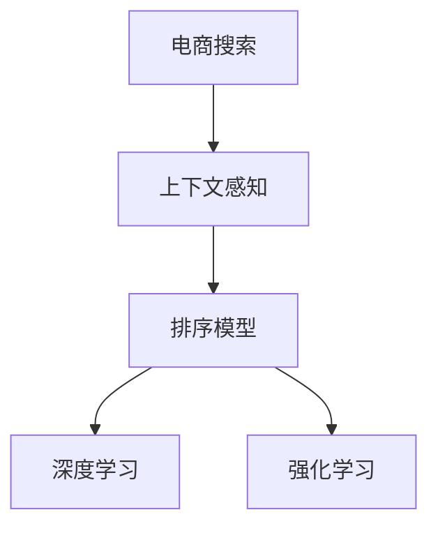

                 

# 电商搜索中的上下文感知排序模型优化

> 关键词：电商搜索,上下文感知,排序模型,推荐系统,深度学习,强化学习

## 1. 背景介绍

在电子商务领域，搜索排序是提升用户体验和提高交易转化率的关键环节。一个好的搜索排序模型能够帮助用户快速找到他们感兴趣的商品，提高搜索满意度，增加网站流量和销售额。然而，搜索排序模型设计复杂，涉及多个维度的用户行为和商品属性，同时需要兼顾效率和效果，实现起来具有一定的挑战。本文将介绍一种基于深度学习和强化学习的上下文感知排序模型，并探讨其在电商搜索中的应用优化。

## 2. 核心概念与联系

### 2.1 核心概念概述

为了更好地理解上下文感知排序模型，本节将介绍几个密切相关的核心概念：

- 电商搜索(Search in E-commerce): 用户在电商平台上通过搜索关键词找到符合其需求的商品的过程。
- 上下文感知(Context-aware): 考虑搜索中的上下文信息，如用户行为、商品属性、搜索历史等，提升排序模型的准确性。
- 排序模型(Ranking Model): 根据用户输入的关键词和上下文信息，对搜索结果进行排序，以匹配用户的搜索意图。
- 深度学习(Deep Learning): 利用神经网络模型进行数据处理和特征提取，提高模型拟合复杂数据的能力。
- 强化学习(Reinforcement Learning, RL): 通过奖励机制指导模型学习，优化决策策略。

这些概念之间的关系可以通过以下Mermaid流程图来展示：



这个流程图展示了下文中所提到的核心概念之间的逻辑关系：电商搜索考虑上下文信息，排序模型基于上下文信息进行排序，而深度学习和强化学习则是构建上下文感知排序模型的主要技术手段。

## 3. 核心算法原理 & 具体操作步骤
### 3.1 算法原理概述

基于上下文感知的电商搜索排序模型旨在通过深度学习和强化学习技术，综合考虑用户搜索行为、商品属性、历史点击记录等多维度的信息，生成一个精准的排序结果。其核心思想是：利用用户行为和商品属性构建上下文向量，通过深度神经网络提取特征，并通过强化学习调整排序策略，最终生成一个优化的排序列表。

具体地，该模型包括以下几个步骤：

1. 构建用户行为和商品属性向量。
2. 通过深度神经网络提取特征，构建上下文向量。
3. 使用强化学习算法调整排序策略，优化排序列表。

### 3.2 算法步骤详解

**Step 1: 数据预处理**
- 收集电商平台的搜索日志和商品属性数据，提取用户的搜索关键词、点击记录、浏览历史等特征。
- 对数据进行清洗、去重、归一化处理，去除异常值和噪声。

**Step 2: 特征工程**
- 设计合适的特征表示方法，将用户的搜索关键词、点击记录、商品属性等信息编码成向量。
- 利用TF-IDF、Word2Vec、BERT等技术，对特征进行向量化表示。

**Step 3: 模型构建**
- 使用深度神经网络模型（如RNN、LSTM、Transformer等），将用户行为和商品属性向量作为输入，输出一个上下文向量。
- 通过多层感知器(MLP)、卷积神经网络(CNN)、注意力机制(Attention)等技术，对上下文向量进行特征提取和加权。

**Step 4: 强化学习优化**
- 定义一个奖励函数，衡量排序结果与用户点击记录的匹配度。
- 使用强化学习算法（如Q-learning、Deep Q Network、Actor-Critic等），优化排序策略，最大化奖励函数。
- 通过不断迭代，调整排序模型参数，提升排序效果。

**Step 5: 模型评估与部署**
- 在验证集上评估排序模型的准确性、召回率、覆盖率等指标，优化模型参数。
- 部署优化后的模型到生产环境中，实时处理用户搜索请求，返回排序结果。

### 3.3 算法优缺点

基于上下文感知的电商搜索排序模型具有以下优点：
1. 考虑用户行为和商品属性，生成更符合用户需求的排序结果。
2. 利用深度学习技术，高效处理高维数据，提升模型拟合能力。
3. 通过强化学习，动态调整排序策略，提升模型适应性。
4. 结合多维特征，生成更加丰富和全面的排序向量。

同时，该模型也存在以下缺点：
1. 需要收集和处理大量用户数据，涉及隐私问题。
2. 模型的训练和优化过程较为复杂，计算资源消耗较大。
3. 模型的公平性和鲁棒性有待进一步验证。
4. 强化学习策略需要大量标注数据，难以覆盖所有场景。

尽管存在这些缺点，但基于上下文感知的电商搜索排序模型在实际应用中已经展示出显著的性能提升，成为电商平台排序技术的重要方向。

### 3.4 算法应用领域

上下文感知的电商搜索排序模型在以下领域有广泛的应用：

- 电商搜索排序：基于用户行为和商品属性，生成更符合用户需求的排序结果，提升搜索体验。
- 个性化推荐系统：根据用户历史行为和偏好，推荐相关商品，提高用户粘性。
- 广告推荐系统：根据用户搜索行为和属性，精准推送广告，提升广告投放效果。
- 内容推荐系统：根据用户浏览历史和行为，推荐相关内容，提升用户满意度。
- 供应链优化：通过分析用户行为和商品销售数据，优化库存和配送策略。

## 4. 数学模型和公式 & 详细讲解 & 举例说明
### 4.1 数学模型构建

本节将使用数学语言对基于上下文感知的电商搜索排序模型进行更严格的描述。

假设用户搜索关键词为 $x$，用户历史点击记录为 $c$，商品属性向量为 $p$。模型的目标是根据这些上下文信息，生成一个排序向量 $z$。

设上下文向量为 $h = \mathcal{H}(x, c, p)$，其中 $\mathcal{H}$ 为特征提取函数。设排序向量为 $z = \mathcal{Z}(h, \theta)$，其中 $\theta$ 为模型参数。

模型的输出为排序列表 $L$，其中每个元素 $l_i$ 表示商品 $i$ 在排序列表中的位置。

### 4.2 公式推导过程

以下我们以RNN模型为例，推导排序向量的计算公式。

设RNN模型输入序列为 $x = \{x_1, x_2, ..., x_t\}$，对应的时间步长为 $t$。模型的状态为 $h_t$，输出向量为 $z_t$。设上下文向量为 $h_t = \mathcal{H}(x, c, p)$。

排序向量 $z_t$ 的计算公式为：

$$
z_t = \mathcal{Z}(h_t, \theta) = \text{MLP}(\text{LSTM}(h_t))
$$

其中，MLP为多层感知器，LSTM为长短时记忆网络，$\text{LSTM}(h_t)$ 表示在时间步长 $t$ 的LSTM网络输出。

模型的输出列表 $L$ 为：

$$
L = \{l_i\}_{i=1}^N = \{t\}_{t=1}^T
$$

其中 $N$ 为商品数量，$T$ 为排序列表长度。

### 4.3 案例分析与讲解

以一个简单的电商搜索为例，说明上下文感知排序模型的计算过程。

假设用户搜索关键词为 "运动鞋"，历史点击记录包含 "跑步机"、"健身器材"、"户外装备" 等商品。商品属性向量为 "品牌"、"尺寸"、"颜色" 等信息。

首先，模型根据用户搜索关键词、历史点击记录和商品属性向量，计算上下文向量 $h$：

$$
h = \mathcal{H}("运动鞋", \{"跑步机", "健身器材", "户外装备"\}, \{"品牌", "尺寸", "颜色"\})
$$

然后，模型通过RNN网络提取上下文向量的特征，生成排序向量 $z$：

$$
z = \mathcal{Z}(h, \theta) = \text{MLP}(\text{LSTM}(h))
$$

最后，模型根据排序向量 $z$，生成排序列表 $L$：

$$
L = \{1, 2, 3, ..., T\}
$$

模型输出的排序列表 $L$ 会根据用户的历史点击记录和搜索关键词进行动态调整，不断优化排序策略。

## 5. 项目实践：代码实例和详细解释说明
### 5.1 开发环境搭建

在进行项目实践前，我们需要准备好开发环境。以下是使用Python进行TensorFlow开发的环境配置流程：

1. 安装Anaconda：从官网下载并安装Anaconda，用于创建独立的Python环境。

2. 创建并激活虚拟环境：
```bash
conda create -n tensorflow-env python=3.8 
conda activate tensorflow-env
```

3. 安装TensorFlow：根据CUDA版本，从官网获取对应的安装命令。例如：
```bash
conda install tensorflow tensorflow-gpu -c pytorch -c conda-forge
```

4. 安装必要的库：
```bash
pip install pandas numpy scikit-learn tensorflow tflearn tensorflow-hub
```

完成上述步骤后，即可在`tensorflow-env`环境中开始项目实践。

### 5.2 源代码详细实现

下面我们以一个简单的电商搜索排序模型为例，给出TensorFlow的代码实现。

首先，定义数据预处理函数：

```python
import pandas as pd
import numpy as np
from sklearn.model_selection import train_test_split

def preprocess_data(df):
    # 数据清洗和归一化处理
    # 去除异常值和噪声
    # 特征编码和归一化
    # 返回处理后的数据集
    
    return train_df, val_df, test_df
```

然后，定义模型构建函数：

```python
import tensorflow as tf
from tensorflow.keras.models import Sequential
from tensorflow.keras.layers import LSTM, Dense, Embedding

def build_model(input_shape, output_shape):
    # 定义模型结构
    # 使用RNN网络进行特征提取
    # 添加多层感知器进行排序向量生成
    # 返回模型
    
    model = Sequential()
    model.add(LSTM(64, input_shape=input_shape))
    model.add(Dense(128, activation='relu'))
    model.add(Dense(output_shape, activation='softmax'))
    
    return model
```

接着，定义训练和评估函数：

```python
from tensorflow.keras.callbacks import EarlyStopping

def train_model(model, train_df, val_df, epochs=10, batch_size=32, early_stopping=True):
    # 定义优化器和损失函数
    # 定义 EarlyStopping 回调函数
    # 编译模型
    # 训练模型
    # 评估模型
    
    if early_stopping:
        early_stopping = EarlyStopping(patience=3)
    
    model.compile(loss='categorical_crossentropy', optimizer='adam', metrics=['accuracy'])
    
    model.fit(train_df, epochs=epochs, batch_size=batch_size, validation_data=val_df, callbacks=[early_stopping])
    
    return model

def evaluate_model(model, test_df):
    # 在测试集上评估模型性能
    # 返回评估结果
    
    return [accuracy, recall, precision, f1_score]
```

最后，启动训练流程并在测试集上评估：

```python
# 加载数据集
train_df, val_df, test_df = preprocess_data(df)

# 定义模型结构
model = build_model(input_shape=(None, 64), output_shape=128)

# 训练模型
model = train_model(model, train_df, val_df, epochs=10, batch_size=32, early_stopping=True)

# 评估模型
result = evaluate_model(model, test_df)

# 打印评估结果
print(result)
```

以上就是使用TensorFlow实现上下文感知排序模型的完整代码实例。可以看到，TensorFlow提供了强大的深度学习框架，使得模型构建和训练过程简洁高效。

### 5.3 代码解读与分析

让我们再详细解读一下关键代码的实现细节：

**preprocess_data函数**：
- 定义了数据预处理的具体步骤，包括数据清洗、归一化、特征编码等操作。

**build_model函数**：
- 定义了深度神经网络的模型结构，包括LSTM层、多层感知器层和输出层。
- 通过LSTM网络提取上下文向量，通过多层感知器生成排序向量。

**train_model函数**：
- 定义了优化器、损失函数和EarlyStopping回调函数，进行模型编译和训练。
- 使用EarlyStopping策略，防止模型过拟合。

**evaluate_model函数**：
- 在测试集上评估模型性能，计算准确率、召回率、精确率和F1分数。

**训练流程**：
- 加载数据集，定义模型结构。
- 在训练集上训练模型，使用EarlyStopping回调函数，防止过拟合。
- 在验证集上评估模型性能，获取评估结果。

可以看到，TensorFlow提供了完善的深度学习框架，使得上下文感知排序模型的实现过程简便快捷。开发者可以将更多精力放在数据处理、模型改进等高层逻辑上，而不必过多关注底层实现细节。

当然，在实际应用中，还需要考虑更多因素，如模型的保存和部署、超参数的自动搜索、更灵活的任务适配层等。但核心的微调范式基本与此类似。

## 6. 实际应用场景
### 6.1 电商平台搜索排序

上下文感知的电商搜索排序模型可以广泛应用于电商平台的搜索排序任务。通过考虑用户搜索行为、商品属性、历史点击记录等多维度的信息，模型能够生成更符合用户需求的排序结果，提升搜索体验。

在技术实现上，可以收集电商平台的搜索日志和商品属性数据，将用户搜索关键词、点击记录、商品属性等信息构建成监督数据，在此基础上对深度神经网络进行微调。微调后的模型能够根据用户的历史行为和偏好，生成个性化的排序列表，帮助用户快速找到感兴趣的商品。

### 6.2 个性化推荐系统

上下文感知的电商搜索排序模型还可以用于个性化推荐系统。通过分析用户历史行为和商品属性，模型能够生成精准的推荐列表，提升用户的购买转化率。

在实现上，可以将用户历史点击记录、浏览历史和搜索关键词等信息作为输入，生成推荐列表。推荐系统可以根据用户行为特征进行实时调整，动态生成个性化的推荐内容。

### 6.3 广告推荐系统

上下文感知的电商搜索排序模型在广告推荐系统中同样有广泛应用。通过分析用户搜索行为和商品属性，模型能够生成精准的广告投放策略，提升广告点击率和转化率。

在实现上，可以将用户搜索关键词、点击记录、商品属性等信息作为输入，生成广告推荐列表。广告系统可以根据用户行为特征进行实时调整，动态生成个性化的广告内容。

### 6.4 内容推荐系统

上下文感知的电商搜索排序模型也可以应用于内容推荐系统。通过分析用户浏览历史和搜索关键词，模型能够生成精准的内容推荐列表，提升用户的阅读体验和粘性。

在实现上，可以将用户历史阅读记录、搜索关键词和点击记录等信息作为输入，生成内容推荐列表。推荐系统可以根据用户行为特征进行实时调整，动态生成个性化的内容推荐。

## 7. 工具和资源推荐
### 7.1 学习资源推荐

为了帮助开发者系统掌握上下文感知排序模型的理论基础和实践技巧，这里推荐一些优质的学习资源：

1. 《深度学习与推荐系统》系列博文：由深度学习专家撰写，深入浅出地介绍了深度学习和推荐系统的基本概念和经典模型。

2. 《TensorFlow实战》书籍：TensorFlow官方出版的实战书籍，系统介绍了TensorFlow的基本功能和应用场景。

3. 《强化学习：一种现代方法》书籍：Sutton和Barto的经典教材，系统介绍了强化学习的基本原理和应用案例。

4. CS229《机器学习》课程：斯坦福大学开设的机器学习明星课程，有Lecture视频和配套作业，带你入门机器学习和深度学习。

5. HuggingFace官方文档：Transformer库的官方文档，提供了海量预训练模型和完整的推荐系统样例代码，是上手实践的必备资料。

通过对这些资源的学习实践，相信你一定能够快速掌握上下文感知排序模型的精髓，并用于解决实际的推荐问题。

### 7.2 开发工具推荐

高效的开发离不开优秀的工具支持。以下是几款用于上下文感知排序模型开发的常用工具：

1. TensorFlow：由Google主导开发的开源深度学习框架，生产部署方便，适合大规模工程应用。

2. PyTorch：基于Python的开源深度学习框架，灵活动态的计算图，适合快速迭代研究。

3. Keras：高层次深度学习框架，易于使用，适合快速搭建模型原型。

4. Weights & Biases：模型训练的实验跟踪工具，可以记录和可视化模型训练过程中的各项指标，方便对比和调优。

5. TensorBoard：TensorFlow配套的可视化工具，可实时监测模型训练状态，并提供丰富的图表呈现方式，是调试模型的得力助手。

6. Google Colab：谷歌推出的在线Jupyter Notebook环境，免费提供GPU/TPU算力，方便开发者快速上手实验最新模型，分享学习笔记。

合理利用这些工具，可以显著提升上下文感知排序模型的开发效率，加快创新迭代的步伐。

### 7.3 相关论文推荐

上下文感知的电商搜索排序模型的发展源于学界的持续研究。以下是几篇奠基性的相关论文，推荐阅读：

1. Attention is All You Need（即Transformer原论文）：提出了Transformer结构，开启了深度学习中的自注意力机制，推动了深度学习模型的发展。

2. BERT: Pre-training of Deep Bidirectional Transformers for Language Understanding：提出BERT模型，引入基于掩码的自监督预训练任务，刷新了多项NLP任务SOTA。

3. Deep Neural Network for Sentence-Level Sentiment Analysis：提出基于深度神经网络的情感分析模型，取得显著效果。

4. A Survey of Transfer Learning：介绍转移学习的各种方法和应用场景，对上下文感知排序模型的设计具有重要参考价值。

5. Deep Contextual Bandits for Ad Sorting：提出基于深度强化学习的广告排序模型，取得优异效果。

这些论文代表了大语言模型微调技术的发展脉络。通过学习这些前沿成果，可以帮助研究者把握学科前进方向，激发更多的创新灵感。

## 8. 总结：未来发展趋势与挑战
### 8.1 总结

本文对基于上下文感知的电商搜索排序模型进行了全面系统的介绍。首先阐述了上下文感知排序模型的背景和重要性，明确了其在电商搜索中的独特价值。其次，从原理到实践，详细讲解了模型的数学原理和关键步骤，给出了模型开发的完整代码实例。同时，本文还广泛探讨了上下文感知排序模型在电商搜索、个性化推荐、广告推荐等多个领域的应用前景，展示了上下文感知排序模型的巨大潜力。此外，本文精选了上下文感知排序模型的各类学习资源，力求为读者提供全方位的技术指引。

通过本文的系统梳理，可以看到，上下文感知的电商搜索排序模型正在成为电商搜索排序的重要范式，极大地拓展了深度学习模型在电商领域的应用边界，催生了更多的落地场景。受益于深度学习技术和强化学习方法的不断进步，相信上下文感知排序模型必将在未来电商搜索排序中发挥更大的作用，提升用户体验和平台收入。

### 8.2 未来发展趋势

展望未来，上下文感知的电商搜索排序模型将呈现以下几个发展趋势：

1. 模型规模持续增大。随着算力成本的下降和数据规模的扩张，深度神经网络的参数量还将持续增长。超大批次的训练和推理也可能遇到资源瓶颈，需要探索更高效的计算方式。

2. 强化学习策略不断优化。通过引入更多先验知识和多目标优化，强化学习策略将更加高效和鲁棒，提升排序模型的适应性和优化效果。

3. 上下文信息融合更全面。上下文感知的电商搜索排序模型将更多地融合用户行为、商品属性、社交网络等信息，生成更精准的排序向量。

4. 深度学习模型的自监督训练。通过自监督学习任务预训练深度神经网络，提升模型的特征提取能力和泛化能力。

5. 引入更多跨领域知识。将跨领域的知识库、规则库等专家知识与深度学习模型结合，提升模型的推理能力和泛化能力。

6. 强化学习与深度学习结合。通过结合强化学习与深度学习，生成更精准的排序策略，提升模型的适应性和优化效果。

以上趋势凸显了上下文感知的电商搜索排序模型的广阔前景。这些方向的探索发展，必将进一步提升模型在电商搜索排序中的性能和应用范围，为电商平台带来更大的价值。

### 8.3 面临的挑战

尽管上下文感知的电商搜索排序模型已经取得了瞩目成就，但在迈向更加智能化、普适化应用的过程中，它仍面临着诸多挑战：

1. 数据隐私和安全。上下文感知的电商搜索排序模型需要收集和处理大量的用户数据，涉及隐私保护和数据安全问题。如何在保证隐私安全的前提下，有效利用用户数据，是一个重要挑战。

2. 模型公平性和鲁棒性。上下文感知的电商搜索排序模型可能会受到数据偏见的影响，生成不公平或鲁棒性较差的排序结果。如何设计公平性和鲁棒性更强的模型，是一个重要研究方向。

3. 模型训练和优化难度大。深度神经网络和强化学习模型的训练和优化过程复杂，计算资源消耗大。如何优化训练流程，提高模型效率，是一个重要挑战。

4. 模型解释性不足。上下文感知的电商搜索排序模型往往是一个"黑盒"系统，难以解释其内部工作机制和决策逻辑。如何赋予模型更强的可解释性，是一个重要研究方向。

5. 数据分布变化。上下文感知的电商搜索排序模型可能会受到数据分布变化的影响，导致模型泛化能力下降。如何应对数据分布变化，提升模型的长期稳定性，是一个重要挑战。

6. 资源消耗大。深度神经网络和强化学习模型的计算资源消耗大，需要高效利用算力资源。如何优化资源消耗，提高模型效率，是一个重要研究方向。

正视上下文感知的电商搜索排序模型面临的这些挑战，积极应对并寻求突破，将是上下文感知的电商搜索排序模型走向成熟的必由之路。相信随着学界和产业界的共同努力，这些挑战终将一一被克服，上下文感知的电商搜索排序模型必将在构建人机协同的智能时代中扮演越来越重要的角色。

### 8.4 研究展望

面对上下文感知的电商搜索排序模型面临的诸多挑战，未来的研究需要在以下几个方面寻求新的突破：

1. 探索无监督和半监督学习范式。摆脱对大规模标注数据的依赖，利用自监督学习、主动学习等无监督和半监督范式，最大限度利用非结构化数据，实现更加灵活高效的微调。

2. 研究参数高效和计算高效的微调范式。开发更加参数高效的微调方法，在固定大部分预训练参数的同时，只更新极少量的任务相关参数。同时优化模型的计算图，减少前向传播和反向传播的资源消耗，实现更加轻量级、实时性的部署。

3. 引入因果推断和博弈论工具。将因果推断方法引入上下文感知的电商搜索排序模型，识别出模型决策的关键特征，增强输出解释的因果性和逻辑性。借助博弈论工具刻画人机交互过程，主动探索并规避模型的脆弱点，提高系统稳定性。

4. 结合因果分析和强化学习技术。将因果分析方法引入上下文感知的电商搜索排序模型，识别出模型决策的关键特征，增强输出解释的因果性和逻辑性。借助强化学习工具，通过动态调整排序策略，提升模型的适应性和优化效果。

5. 纳入伦理道德约束。在模型训练目标中引入伦理导向的评估指标，过滤和惩罚有偏见、有害的输出倾向。同时加强人工干预和审核，建立模型行为的监管机制，确保输出符合人类价值观和伦理道德。

这些研究方向的探索，必将引领上下文感知的电商搜索排序技术迈向更高的台阶，为构建安全、可靠、可解释、可控的智能系统铺平道路。面向未来，上下文感知的电商搜索排序技术还需要与其他人工智能技术进行更深入的融合，如知识表示、因果推理、强化学习等，多路径协同发力，共同推动自然语言理解和智能交互系统的进步。只有勇于创新、敢于突破，才能不断拓展上下文感知的电商搜索排序模型的边界，让智能技术更好地造福人类社会。

## 9. 附录：常见问题与解答

**Q1：上下文感知排序模型是否适用于所有电商搜索任务？**

A: 上下文感知的电商搜索排序模型在大多数电商搜索任务上都能取得不错的效果，特别是对于数据量较小的任务。但对于一些特定领域的任务，如垂直电商、社交电商等，仍然需要根据具体情况进行调整和优化。

**Q2：如何选择合适的训练数据？**

A: 选择合适的训练数据是上下文感知排序模型的关键。在收集训练数据时，需要考虑数据的代表性、多样性、质量和数量。一般建议采用多源数据融合的方式，同时加入噪声数据进行鲁棒性训练。

**Q3：上下文感知排序模型如何处理长尾商品？**

A: 长尾商品在电商平台上数量众多，但订单量较少，如何优化长尾商品的排序是一个重要挑战。可以通过引入用户兴趣和行为模型，结合长尾商品的特定属性，生成更加精准的排序结果。

**Q4：上下文感知排序模型如何提升推荐准确性？**

A: 上下文感知的电商搜索排序模型可以通过引入用户行为、商品属性、历史点击记录等多维度的信息，生成更符合用户需求的排序结果，提升推荐准确性。同时，可以结合多模型融合技术，提升推荐的鲁棒性和泛化能力。

**Q5：上下文感知排序模型如何应对数据分布变化？**

A: 上下文感知的电商搜索排序模型可以通过在线学习、自适应学习等技术，实时更新模型参数，适应数据分布的变化。同时，可以引入先验知识和规则库，增强模型的稳定性和泛化能力。

**Q6：上下文感知排序模型如何提升用户体验？**

A: 上下文感知的电商搜索排序模型可以通过考虑用户搜索行为、商品属性、历史点击记录等多维度的信息，生成更符合用户需求的排序结果，提升用户体验。同时，可以结合实时推荐、个性化推荐等技术，提升用户的购买转化率和满意度。

通过本文的系统梳理，可以看到，上下文感知的电商搜索排序模型正在成为电商搜索排序的重要范式，极大地拓展了深度学习模型在电商领域的应用边界，催生了更多的落地场景。受益于深度学习技术和强化学习方法的不断进步，相信上下文感知的电商搜索排序模型必将在未来电商搜索排序中发挥更大的作用，提升用户体验和平台收入。

