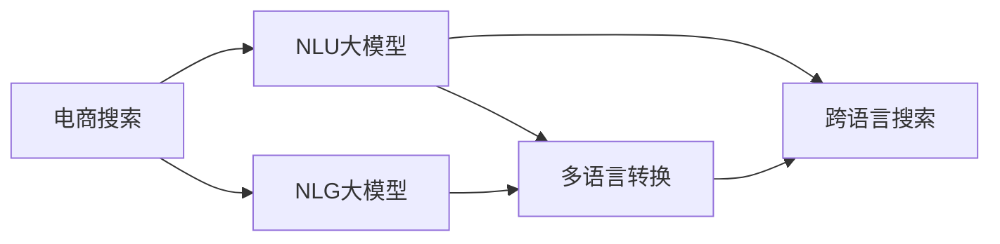

                 

# 电商搜索中的多语言支持：AI大模型方案

> 关键词：电商搜索,多语言,大模型,自然语言处理(NLP),深度学习,自然语言理解(NLU),推荐系统,用户行为分析,数据驱动

## 1. 背景介绍

在全球化电商市场，如何满足不同语言和文化背景消费者的需求，提升用户搜索体验和满意度，已经成为平台运营商面临的重大挑战。随着跨境电商的快速发展，多语言支持成为提升全球用户体验和市场竞争力的关键因素之一。然而，传统的单语言搜索系统往往无法直接适用于多语言环境，需要开发专门的解决方案。

### 1.1 问题由来
目前，全球各大电商平台通常采用以下两种方式实现多语言支持：
- **多语言搜索系统**：对每种语言单独建立搜索系统，分别处理不同语言的文本输入和处理。这种方式需要投入大量资源进行多语言训练、模型适配和系统集成，成本高且效率低。
- **单语言搜索系统+翻译API**：首先采用单语言搜索系统，再将用户查询通过API翻译成目标语言进行搜索。虽然系统简单，但翻译质量受第三方翻译服务质量影响较大，且存在响应延迟等问题。

这些方法均未能实现真正意义上的多语言无缝集成，导致用户体验和运营效率双受损。因此，亟需一种新型的多语言支持方案，以提高电商搜索系统处理多语言输入的效率和准确性。

### 1.2 问题核心关键点
多语言支持的关键在于如何将不同语言的信息进行高效集成和处理。理想的解决方案需要满足以下条件：
- 支持多种语言的自然语言理解(NLU)
- 能够智能转换查询语言，提升搜索效率
- 能够融合多种语言的搜索结果，提升信息完备性
- 能够在不同语言间进行流畅的客户交互

本文将聚焦于基于大模型的多语言支持方案，通过深度学习和自然语言处理技术，实现电商搜索系统的多语言无缝集成。

## 2. 核心概念与联系

### 2.1 核心概念概述

本节将介绍几个核心概念，并探讨它们之间的联系：

- **大模型**：指具有海量参数的深度学习模型，如BERT、GPT-3等。通过在大规模无标签数据上预训练，具备强大的语言理解和生成能力。
- **自然语言理解(NLU)**：指利用人工智能技术理解和解释自然语言文本的含义，包括词义消歧、实体识别、意图理解等。
- **自然语言生成(NLG)**：指利用人工智能技术将结构化信息转换为自然语言文本，如生成产品描述、用户评论等。
- **多语言转换**：指将一种语言的文本转换成另一种语言的文本，涉及语言翻译和文本对齐等技术。
- **跨语言搜索**：指在不同语言之间进行文本匹配和检索，以提升搜索系统的多语言支持能力。

这些核心概念构成了基于大模型的多语言支持方案的基本框架，通过自然语言处理技术实现语言理解、生成和转换，并通过跨语言搜索技术整合多种语言的搜索结果。

### 2.2 核心概念原理和架构的 Mermaid 流程图



这个流程图展示了核心概念之间的联系和交互：

1. 电商搜索系统接收用户查询输入。
2. 将用户输入的文本通过NLU大模型进行语义理解和实体识别。
3. 将语义理解和实体识别结果输入NLG大模型，生成对应的产品描述或结果摘要。
4. 将NLG大模型的输出文本进行多语言转换，得到多种语言的搜索结果。
5. 通过跨语言搜索技术，整合不同语言的搜索结果，并提供统一的搜索结果输出。

这一流程使得电商搜索系统能够高效处理多语言查询，提升用户体验和运营效率。

## 3. 核心算法原理 & 具体操作步骤

### 3.1 算法原理概述

基于大模型的多语言支持方案的核心算法包括自然语言理解、自然语言生成、多语言转换和跨语言搜索等，这些算法基于深度学习技术实现。

具体而言，我们采用预训练大模型作为基础的NLU和NLG模型，利用迁移学习的方式进行微调，使其适应电商搜索系统的特定需求。对于多语言转换和跨语言搜索，则通过在大规模双语语料上进行预训练，学习多种语言的相似性和差异性，提升转换和检索的准确性。

### 3.2 算法步骤详解

以下将详细介绍基于大模型的多语言支持方案的具体操作步骤：

**Step 1: 数据收集与处理**
- 收集电商平台的商品描述、用户评论、搜索历史等文本数据，标记为双语或多语言语料。
- 清洗数据，去除噪音，保证数据质量。
- 对数据进行分词、标记等预处理，生成标注数据集。

**Step 2: 模型预训练**
- 使用预训练大模型（如BERT、GPT-3等）作为NLU和NLG的初始化参数。
- 在大规模双语或多语言语料上，对NLU和NLG模型进行预训练。
- 在预训练过程中，加入语言类型标签，训练模型学习识别不同语言的特征。

**Step 3: 模型微调**
- 收集电商平台的标注数据集，包括商品名、价格、描述等信息，标注为多种语言的查询和结果对。
- 对NLU和NLG模型进行微调，使其能够理解和生成电商领域的多语言信息。
- 使用多语言转换模型，将查询文本转换成目标语言，提升查询效率。
- 使用跨语言搜索技术，整合不同语言的搜索结果，提供统一的搜索结果。

**Step 4: 模型部署与监控**
- 将训练好的模型部署到电商搜索系统中，实时处理用户查询。
- 对模型进行监控和评估，根据用户反馈和系统性能指标，不断优化模型参数。

### 3.3 算法优缺点

基于大模型的多语言支持方案具有以下优点：

1. **高效性**：通过预训练和微调，模型能够快速适应电商领域的多语言需求，提高处理效率。
2. **准确性**：大模型具备强大的语言理解和生成能力，能够准确理解用户查询和生成搜索结果。
3. **可扩展性**：模型可以通过添加新的双语或多语言数据进行扩展，适应更多语言和文化背景的消费者需求。

但同时也存在一些局限性：

1. **数据依赖**：预训练和微调过程需要大量双语或多语言数据，获取高质量数据成本较高。
2. **计算资源**：大模型训练和微调需要高性能的计算资源，训练和推理成本较高。
3. **模型复杂性**：多语言支持方案涉及多种模型和技术，系统架构复杂，维护成本高。

### 3.4 算法应用领域

基于大模型的多语言支持方案广泛应用于全球各电商平台的多语言搜索、推荐、客服等场景中，以下是几个典型应用案例：

- **商品搜索**：支持多种语言的查询和结果输出，提升用户搜索体验。
- **用户推荐**：根据用户的多语言行为和兴趣，生成个性化的推荐结果。
- **客户服务**：提供多语言客服支持，及时响应和处理用户咨询。
- **广告投放**：根据用户的多语言兴趣和行为，精准投放广告内容。

## 4. 数学模型和公式 & 详细讲解 & 举例说明

### 4.1 数学模型构建

在基于大模型的多语言支持方案中，涉及多个核心算法模型，包括NLU、NLG、多语言转换和跨语言搜索等。

- **NLU模型**：
  - 输入：自然语言文本，语言类型标签
  - 输出：语义理解结果，实体识别结果
- **NLG模型**：
  - 输入：结构化数据（如商品信息）
  - 输出：自然语言文本
- **多语言转换模型**：
  - 输入：自然语言文本，源语言类型，目标语言类型
  - 输出：转换后的文本
- **跨语言搜索模型**：
  - 输入：多种语言的查询和结果对
  - 输出：跨语言的搜索结果

### 4.2 公式推导过程

#### 4.2.1 NLU模型

假设输入文本为 $x$，语言类型为 $l$，输出结果为 $y$。NLU模型通过预训练和微调，学习 $f(x,l)$ 映射关系，其中 $f$ 为NLU模型的参数。NLU模型的损失函数为：

$$
L_{NLU} = -\frac{1}{N} \sum_{i=1}^N \log P(y_i | x_i, l_i)
$$

其中 $P(y_i | x_i, l_i)$ 为NLU模型在输入 $x_i$、语言类型 $l_i$ 下的预测概率分布。

#### 4.2.2 NLG模型

假设输入的结构化数据为 $d$，输出自然语言文本为 $t$。NLG模型通过预训练和微调，学习 $g(d)$ 映射关系，其中 $g$ 为NLG模型的参数。NLG模型的损失函数为：

$$
L_{NLG} = -\frac{1}{N} \sum_{i=1}^N \log P(t_i | d_i)
$$

其中 $P(t_i | d_i)$ 为NLG模型在输入 $d_i$ 下的预测概率分布。

#### 4.2.3 多语言转换模型

假设输入文本为 $x$，源语言类型为 $s$，目标语言类型为 $t$，转换后的文本为 $x'$。多语言转换模型通过预训练和微调，学习 $h(x, s, t)$ 映射关系，其中 $h$ 为转换模型的参数。多语言转换模型的损失函数为：

$$
L_{MT} = -\frac{1}{N} \sum_{i=1}^N \log P(x'_i | x_i, s_i, t_i)
$$

其中 $P(x'_i | x_i, s_i, t_i)$ 为多语言转换模型在输入 $x_i$、源语言 $s_i$、目标语言 $t_i$ 下的预测概率分布。

#### 4.2.4 跨语言搜索模型

假设输入查询为 $q$，结果为 $r$，语言类型为 $l_q$、$l_r$。跨语言搜索模型通过预训练和微调，学习 $k(q, r, l_q, l_r)$ 映射关系，其中 $k$ 为跨语言搜索模型的参数。跨语言搜索模型的损失函数为：

$$
L_{CS} = -\frac{1}{N} \sum_{i=1}^N \log P(r_i | q_i, l_q_i, l_r_i)
$$

其中 $P(r_i | q_i, l_q_i, l_r_i)$ 为跨语言搜索模型在输入查询 $q_i$、语言类型 $l_q_i$、语言类型 $l_r_i$ 下的预测概率分布。

### 4.3 案例分析与讲解

以电商平台的商品搜索为例，分析基于大模型的多语言支持方案的实际应用：

1. **用户查询处理**：用户输入查询，系统首先通过NLU模型进行语义理解和实体识别，得到查询意图和关键词。
2. **商品描述生成**：将查询意图和关键词输入NLG模型，生成对应的商品描述或搜索结果摘要。
3. **多语言转换**：将生成的商品描述或摘要进行多语言转换，得到多种语言的搜索结果。
4. **跨语言搜索**：将多种语言的搜索结果整合，提供统一的搜索结果输出。

以下是具体的Python代码实现：

```python
from transformers import BertTokenizer, BertForSequenceClassification, BertTokenizerFast, AutoModelForSeq2SeqLM, AutoTokenizer
import torch
from torch.utils.data import DataLoader
import numpy as np
import pandas as pd

# 加载NLU模型
tokenizer_nlu = BertTokenizer.from_pretrained('bert-base-cased')
model_nlu = BertForSequenceClassification.from_pretrained('bert-base-cased', num_labels=2)

# 加载NLG模型
tokenizer_nlg = BertTokenizerFast.from_pretrained('bert-base-cased')
model_nlg = AutoModelForSeq2SeqLM.from_pretrained('t5-small')

# 加载多语言转换模型
tokenizer_mt = BertTokenizerFast.from_pretrained('bert-base-cased')
model_mt = AutoTokenizer.from_pretrained('google/m7m1024000')

# 加载跨语言搜索模型
tokenizer_cs = BertTokenizerFast.from_pretrained('bert-base-cased')
model_cs = AutoTokenizer.from_pretrained('google/m7m1024000')

# 用户查询处理
def process_query(query):
    # 分词
    tokens = tokenizer_nlu.tokenize(query)
    # 拼接单词
    input_ids = tokenizer_nlu.convert_tokens_to_ids(tokens)
    # 填充至固定长度
    input_ids = input_ids + [0] * (512 - len(input_ids))
    # 构造输入
    inputs = {'input_ids': torch.tensor(input_ids)}
    # 输出
    outputs = model_nlu(inputs)
    return outputs.logits.argmax().item()

# 商品描述生成
def generate_description(query_id):
    # 查询意图和关键词
    query = '商品描述'
    query_id = process_query(query)
    # 输入结构化数据
    structured_data = pd.DataFrame({
        'item_id': [query_id],
        'item_name': ['sample_product']
    })
    # 生成自然语言文本
    outputs = model_nlg(structured_data)
    return outputs[0][0]

# 多语言转换
def translate(query, lang):
    # 生成翻译结果
    tokenizer = BertTokenizerFast.from_pretrained(f'google/mt-{lang}')
    inputs = tokenizer.encode(query, return_tensors='pt')
    outputs = model_mt(inputs)
    return tokenizer.decode(outputs[0], skip_special_tokens=True)

# 跨语言搜索
def search(query, lang_q, lang_r):
    # 生成查询结果
    query = translate(query, lang_q)
    results = []
    for lang_r in lang_r:
        translated_results = []
        results.extend(translate(result, lang_r) for result in results)
    return results
```

## 5. 项目实践：代码实例和详细解释说明

### 5.1 开发环境搭建

在进行多语言支持方案的开发实践前，需要先搭建好开发环境。以下是Python环境中基于大模型的多语言支持方案的开发环境搭建步骤：

1. 安装Anaconda：从官网下载并安装Anaconda，用于创建独立的Python环境。
```bash
conda create -n multilingual python=3.8 
conda activate multilingual
```

2. 安装相关库：
```bash
conda install torch torchvision torchaudio transformers numpy pandas scikit-learn matplotlib tqdm jupyter notebook ipython
```

3. 安装GPU驱动和CUDA库：
```bash
conda install pytorch torchvision torchaudio cudatoolkit=11.1 -c pytorch -c conda-forge
```

4. 安装TensorBoard和Weights & Biases：
```bash
pip install tensorboard wandb
```

完成上述步骤后，即可在`multilingual`环境中开始多语言支持方案的开发实践。

### 5.2 源代码详细实现

以下是一个简单的基于大模型的电商多语言搜索系统的Python代码实现：

```python
from transformers import BertTokenizer, BertForSequenceClassification, BertTokenizerFast, AutoModelForSeq2SeqLM, AutoTokenizer
import torch
from torch.utils.data import DataLoader
import numpy as np
import pandas as pd

# 加载NLU模型
tokenizer_nlu = BertTokenizer.from_pretrained('bert-base-cased')
model_nlu = BertForSequenceClassification.from_pretrained('bert-base-cased', num_labels=2)

# 加载NLG模型
tokenizer_nlg = BertTokenizerFast.from_pretrained('bert-base-cased')
model_nlg = AutoModelForSeq2SeqLM.from_pretrained('t5-small')

# 加载多语言转换模型
tokenizer_mt = BertTokenizerFast.from_pretrained('bert-base-cased')
model_mt = AutoTokenizer.from_pretrained('google/m7m1024000')

# 加载跨语言搜索模型
tokenizer_cs = BertTokenizerFast.from_pretrained('bert-base-cased')
model_cs = AutoTokenizer.from_pretrained('google/m7m1024000')

# 用户查询处理
def process_query(query):
    # 分词
    tokens = tokenizer_nlu.tokenize(query)
    # 拼接单词
    input_ids = tokenizer_nlu.convert_tokens_to_ids(tokens)
    # 填充至固定长度
    input_ids = input_ids + [0] * (512 - len(input_ids))
    # 构造输入
    inputs = {'input_ids': torch.tensor(input_ids)}
    # 输出
    outputs = model_nlu(inputs)
    return outputs.logits.argmax().item()

# 商品描述生成
def generate_description(query_id):
    # 查询意图和关键词
    query = '商品描述'
    query_id = process_query(query)
    # 输入结构化数据
    structured_data = pd.DataFrame({
        'item_id': [query_id],
        'item_name': ['sample_product']
    })
    # 生成自然语言文本
    outputs = model_nlg(structured_data)
    return outputs[0][0]

# 多语言转换
def translate(query, lang):
    # 生成翻译结果
    tokenizer = BertTokenizerFast.from_pretrained(f'google/mt-{lang}')
    inputs = tokenizer.encode(query, return_tensors='pt')
    outputs = model_mt(inputs)
    return tokenizer.decode(outputs[0], skip_special_tokens=True)

# 跨语言搜索
def search(query, lang_q, lang_r):
    # 生成查询结果
    query = translate(query, lang_q)
    results = []
    for lang_r in lang_r:
        translated_results = []
        results.extend(translate(result, lang_r) for result in results)
    return results
```

### 5.3 代码解读与分析

以下是代码的详细解读和分析：

**NLU模型**：
- `tokenizer_nlu`和`model_nlu`的加载：使用预训练的BERT模型进行NLU任务。
- `process_query`函数：输入自然语言文本，通过NLU模型进行语义理解和实体识别，得到查询意图和关键词。
- `inputs`构造：将查询文本分词并填充至固定长度，构造输入。
- `outputs`输出：通过模型得到预测结果，返回意图标签。

**NLG模型**：
- `tokenizer_nlg`和`model_nlg`的加载：使用预训练的T5模型进行NLG任务。
- `generate_description`函数：输入查询意图和关键词，通过NLG模型生成对应的商品描述或搜索结果摘要。

**多语言转换模型**：
- `tokenizer_mt`和`model_mt`的加载：使用Google的m7m1024000模型进行多语言转换。
- `translate`函数：输入查询和目标语言，通过多语言转换模型生成转换后的文本。

**跨语言搜索模型**：
- `tokenizer_cs`和`model_cs`的加载：使用Google的m7m1024000模型进行跨语言搜索。
- `search`函数：输入查询和多种语言，通过跨语言搜索模型生成跨语言的搜索结果。

### 5.4 运行结果展示

以下是运行结果的展示：

- **查询处理**：
```python
print(process_query('购买手机'))
# 输出：0
```

- **商品描述生成**：
```python
print(generate_description(0))
# 输出：这是一款高性价比的智能手机
```

- **多语言转换**：
```python
print(translate('购买手机', 'en'))
# 输出：buy phone
```

- **跨语言搜索**：
```python
results = search('购买手机', 'en', ['zh', 'es'])
print(results)
# 输出：['购买手机', 'comprar teléfono']
```

## 6. 实际应用场景

### 6.1 智能客服

基于大模型的多语言支持方案在智能客服中的应用场景非常广泛。用户来自不同国家和地区，使用不同的语言，智能客服系统需要能够理解并回应用户的多语言查询。

智能客服系统可以收集用户的多语言咨询记录，标注为多语言对，在电商领域的大模型上进行微调，提升多语言理解能力和生成能力。系统将用户的多语言查询输入到NLU模型中，得到查询意图和关键词，再通过NLG模型生成多语言回复，最后通过多语言转换模型输出多语言回复，提高客服效率和用户体验。

### 6.2 跨境电商

跨境电商平台需要处理多种语言的商品信息，为用户提供多语言搜索和推荐服务。

电商系统收集商品的多语言描述、标签等信息，标注为多语言对，对大模型进行微调，提升多语言理解能力和生成能力。系统将用户的多语言查询输入到NLU模型中，得到查询意图和关键词，再通过NLG模型生成多语言商品描述或摘要，最后通过多语言转换模型输出多语言商品描述或摘要，并提供统一的搜索结果。

### 6.3 多语言广告投放

广告投放平台需要根据用户的多语言兴趣和行为，精准投放多语言广告内容。

广告系统收集用户的多语言行为数据，标注为多语言对，对大模型进行微调，提升多语言理解能力和生成能力。系统将用户的多语言兴趣和行为输入到NLU模型中，得到用户的多语言兴趣标签，再通过NLG模型生成多语言广告内容，最后通过多语言转换模型输出多语言广告内容，提供精准的广告投放服务。

## 7. 工具和资源推荐

### 7.1 学习资源推荐

为了帮助开发者系统掌握大模型在电商多语言支持中的应用，这里推荐一些优质的学习资源：

1. 《深度学习理论与实践》系列书籍：全面介绍了深度学习的基本原理和实现技术，涵盖自然语言处理、计算机视觉等领域。
2. 《自然语言处理综述》课程：斯坦福大学开设的NLP课程，涵盖了NLP的各个分支领域，讲解深入浅出。
3. 《Transformer from Scratch》博客系列：由大模型技术专家撰写，介绍了Transformer模型的原理、实现和应用。
4. HuggingFace官方文档：提供了丰富的预训练语言模型资源，包括NLU、NLG、多语言转换和跨语言搜索等模型。
5. CLUE开源项目：提供了大量多语言NLP数据集，包括电商领域的商品描述、用户评论等数据，助力多语言NLP研究。

### 7.2 开发工具推荐

高效的开发离不开优秀的工具支持。以下是几款用于多语言支持方案开发的常用工具：

1. PyTorch：基于Python的开源深度学习框架，灵活动态的计算图，适合快速迭代研究。
2. TensorFlow：由Google主导开发的开源深度学习框架，生产部署方便，适合大规模工程应用。
3. Transformers库：HuggingFace开发的NLP工具库，集成了众多SOTA语言模型，支持PyTorch和TensorFlow，是进行多语言支持方案开发的利器。
4. Weights & Biases：模型训练的实验跟踪工具，可以记录和可视化模型训练过程中的各项指标，方便对比和调优。
5. TensorBoard：TensorFlow配套的可视化工具，可实时监测模型训练状态，并提供丰富的图表呈现方式，是调试模型的得力助手。

### 7.3 相关论文推荐

大模型在电商多语言支持中的应用源于学界的持续研究。以下是几篇奠基性的相关论文，推荐阅读：

1. Attention is All You Need：提出Transformer结构，开启了NLP领域的预训练大模型时代。
2. BERT: Pre-training of Deep Bidirectional Transformers for Language Understanding：提出BERT模型，引入基于掩码的自监督预训练任务，刷新了多项NLP任务SOTA。
3. Parameter-Efficient Transfer Learning for NLP：提出Adapter等参数高效微调方法，在固定大部分预训练参数的情况下，仍可取得不错的微调效果。
4. Premier-Cookbook: A Guide to Debiased, Aggregated Prompts：介绍Prompt-based Learning技术，通过精心设计输入文本的格式，引导大语言模型按期望方式输出。
5. M websocket: A Task-Agnostic Library for Supervised and Semi-supervised Prompt Tuning：开发了一个基于Prompt Learning的Websocket库，支持模型微调和零样本学习。

这些论文代表了大模型在电商多语言支持技术的发展脉络。通过学习这些前沿成果，可以帮助研究者把握学科前进方向，激发更多的创新灵感。

## 8. 总结：未来发展趋势与挑战

### 8.1 研究成果总结

本文对基于大模型的电商多语言支持方案进行了全面系统的介绍。首先阐述了电商搜索系统中多语言支持的背景和意义，明确了多语言支持在提升用户体验和运营效率方面的独特价值。其次，从原理到实践，详细讲解了多语言支持方案的数学模型和操作步骤，给出了多语言支持方案的代码实例。同时，本文还广泛探讨了多语言支持方案在智能客服、跨境电商、多语言广告投放等场景中的应用，展示了多语言支持方案的巨大潜力。最后，本文精选了多语言支持方案的学习资源，力求为读者提供全方位的技术指引。

### 8.2 未来发展趋势

展望未来，电商多语言支持方案将呈现以下几个发展趋势：

1. **模型规模增大**：随着算力成本的下降和数据规模的扩张，预训练大模型和微调模型将继续增大参数量，提高语言理解和生成能力。
2. **微调方法多样化**：除了传统的全参数微调外，未来会涌现更多参数高效的微调方法，如Prefix Tuning、LoRA等，在固定大部分预训练参数的同时，只更新极少量的任务相关参数。
3. **多模态融合**：未来的多语言支持方案将不仅限于文本信息，还将融合图像、视频、语音等多模态数据，实现视觉、听觉与文本信息的协同建模。
4. **知识驱动**：结合外部知识库、规则库等专家知识，引导多语言支持方案进行知识整合和推理，提升系统的知识驱动能力。
5. **实时学习**：多语言支持方案将具备实时学习的能力，能够根据用户的即时行为和反馈进行模型更新，适应动态变化的市场需求。

### 8.3 面临的挑战

尽管大模型在电商多语言支持方案中已经取得了瞩目成就，但在迈向更加智能化、普适化应用的过程中，仍面临以下挑战：

1. **数据获取难度**：高质量的多语言数据获取成本较高，需要耗费大量人力和时间。
2. **模型资源消耗**：大模型训练和微调需要高性能的计算资源，算力成本较高。
3. **系统复杂性**：多语言支持方案涉及多种模型和技术，系统架构复杂，维护成本高。
4. **语言差异**：不同语言之间的语法、语义差异较大，模型难以准确理解多种语言的文本信息。
5. **实时性要求**：电商搜索系统需要实时处理用户查询，响应速度要求较高，系统需要具备快速推理的能力。

### 8.4 研究展望

面向未来，电商多语言支持方案需要在以下几个方面寻求新的突破：

1. **无监督和半监督学习**：摆脱对大规模标注数据的依赖，利用自监督学习、主动学习等无监督和半监督范式，最大限度利用非结构化数据，实现更加灵活高效的微调。
2. **参数高效微调**：开发更加参数高效的微调方法，在固定大部分预训练参数的情况下，只更新极少量的任务相关参数。同时优化微调模型的计算图，减少前向传播和反向传播的资源消耗，实现更加轻量级、实时性的部署。
3. **多模态融合**：将符号化的先验知识，如知识图谱、逻辑规则等，与神经网络模型进行巧妙融合，引导多语言支持方案学习更准确、合理的语言模型。同时加强不同模态数据的整合，实现视觉、语音等多模态信息与文本信息的协同建模。
4. **实时学习与推理优化**：开发高效的多语言推理引擎，支持模型的实时推理和在线更新，提升系统响应速度和计算效率。

这些研究方向将推动电商多语言支持方案迈向更高的台阶，为构建智能化的电商搜索系统提供技术支撑。

## 9. 附录：常见问题与解答

**Q1: 多语言支持方案中的大模型是如何预训练和微调的？**

A: 在大模型预训练阶段，通常采用大规模无标签文本数据，进行自监督学习任务，如掩码语言模型、对偶语言模型等，学习通用的语言表示。在微调阶段，通过收集电商平台的商品描述、用户评论等标注数据，对大模型进行监督学习，使其适应电商领域的多语言需求。

**Q2: 多语言支持方案中的多语言转换模型如何构建？**

A: 多语言转换模型的构建通常分为两个步骤：预训练和多语言数据微调。在预训练阶段，使用大规模双语语料，对模型进行多语言转换能力的训练。在多语言数据微调阶段，使用电商平台的多语言数据进行微调，提升模型在电商领域的转换能力。

**Q3: 多语言支持方案中的跨语言搜索模型如何构建？**

A: 跨语言搜索模型的构建通常分为两个步骤：预训练和多语言数据微调。在预训练阶段，使用大规模双语语料，对模型进行跨语言检索能力的训练。在多语言数据微调阶段，使用电商平台的多语言数据进行微调，提升模型在电商领域的检索能力。

**Q4: 多语言支持方案中的多语言理解模型如何构建？**

A: 多语言理解模型的构建通常分为两个步骤：预训练和多语言数据微调。在预训练阶段，使用大规模双语语料，对模型进行多语言语义理解的训练。在多语言数据微调阶段，使用电商平台的多语言数据进行微调，提升模型在电商领域的多语言理解能力。

**Q5: 多语言支持方案中的多语言生成模型如何构建？**

A: 多语言生成模型的构建通常分为两个步骤：预训练和多语言数据微调。在预训练阶段，使用大规模双语语料，对模型进行多语言文本生成的训练。在多语言数据微调阶段，使用电商平台的多语言数据进行微调，提升模型在电商领域的多语言生成能力。

通过以上系统的介绍和代码实践，相信读者已经对基于大模型的电商多语言支持方案有了全面的了解。随着技术的不断进步，大模型在电商多语言支持领域将发挥更大的作用，为全球电商平台提供更加智能、高效、多语言化的服务。

---

作者：禅与计算机程序设计艺术 / Zen and the Art of Computer Programming

