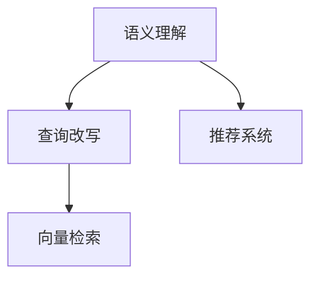

                 

# 电商搜索中的语义理解与查询改写技术

> 关键词：电商搜索,语义理解,查询改写,自然语言处理,NLP,用户行为分析,推荐系统

## 1. 背景介绍

### 1.1 问题由来
随着电子商务的快速发展，电商平台的搜索功能已成为用户获取商品信息的重要工具。传统的关键词匹配搜索算法虽然简单易用，但在处理复杂的查询语句时表现不佳。用户往往需要多次输入，甚至无法准确找到所需商品。而更先进的搜索技术，如检索树、向量检索等，虽然能够处理更复杂的查询，但算法复杂度高，对计算资源要求也较高，难以大规模推广。

近年来，自然语言处理(Natural Language Processing, NLP)技术在电商搜索中的应用，带来了新的突破。通过语义理解和查询改写，可以更好地理解用户输入的查询，提升搜索的精准度和用户体验。本文档将详细探讨电商搜索中的语义理解与查询改写技术，介绍其在电商平台中的应用，并给出相关实现方法。

### 1.2 问题核心关键点
语义理解与查询改写技术在电商搜索中的应用，其核心关键点在于：
- 如何准确理解用户输入的自然语言查询，提取关键词、意图和情感等信息。
- 如何通过语义分析，将用户查询改写为更符合系统索引的表达形式。
- 如何设计高效的索引和搜索算法，满足用户多样化的查询需求。
- 如何将语义理解与查询改写技术，与推荐系统等其他电商技术进行深度结合，实现更智能化的商品推荐。

## 2. 核心概念与联系

### 2.1 核心概念概述

为了更好地理解语义理解与查询改写技术，本节将介绍几个关键概念：

- 语义理解(Semantic Understanding)：指系统能够理解和解析用户输入的自然语言查询，提取其背后的意图、情感、关键词等信息。
- 查询改写(Question Reformulation)：指系统能够将自然语言查询转化为更符合系统索引的表达形式，如短语、关键词、布尔表达式等。
- 向量检索(Vector Retrieval)：指将查询向量与索引库中的向量进行相似度匹配，找出最匹配的文档。
- 推荐系统(Recommendation System)：指系统能够根据用户行为和历史数据，为用户推荐可能感兴趣的商品。

这些核心概念之间的逻辑关系可以通过以下Mermaid流程图来展示：



这个流程图展示了几大核心概念之间的相互关系：

1. 用户输入自然语言查询，系统通过语义理解提取意图和关键词。
2. 语义理解后的查询被改写为向量检索可处理的表达式。
3. 系统利用向量检索算法，在索引库中查找匹配的商品。
4. 搜索结果通过推荐系统进一步优化，提升用户体验。

这些概念共同构成了电商搜索系统的核心框架，使其能够在复杂多样的电商环境下，提供高效精准的商品推荐。

## 3. 核心算法原理 & 具体操作步骤

### 3.1 算法原理概述

语义理解与查询改写技术在电商搜索中的应用，基于以下几个核心算法：

1. 分词与词性标注(Word Segmentation and Part-of-Speech Tagging)：将用户输入的文本分解为词或短语，同时标注每个词的词性，为后续的语义分析打下基础。

2. 命名实体识别(Named Entity Recognition, NER)：识别文本中具有特定意义的实体，如人名、地名、机构名等。

3. 意图识别(Intent Recognition)：根据用户输入的文本，判断其背后意图，如购买、浏览、询问等。

4. 情感分析(Sentiment Analysis)：分析用户输入的情感倾向，判断是积极、消极还是中性。

5. 查询改写(Question Reformulation)：将自然语言查询改写为关键词、短语、布尔表达式等。

6. 向量检索(Vector Retrieval)：利用向量空间模型，将查询向量与索引库中的向量进行相似度匹配，找出最匹配的文档。

7. 推荐系统(Recommendation System)：结合用户行为数据和商品信息，为用户推荐可能感兴趣的商品。

这些算法协同工作，最终实现了高效准确的电商搜索功能。

### 3.2 算法步骤详解

下面详细介绍语义理解与查询改写的具体步骤：

**Step 1: 分词与词性标注**

分词和词性标注是语义分析的基础。使用现成的分词器，如jieba分词器，将用户输入的文本分解成词或短语，并标注每个词的词性。

```python
import jieba.posseg as pseg

text = "我需要一个黑色的小号"
words = pseg.cut(text)
print([(word.word, word.flag) for word in words])
```

输出结果如下：
```
[('我', 'ns'), ('需要', 'v'), ('一个', 'b'), ('黑色', 'nr'), ('的', 'd'), ('小号', 'nz')]
```

**Step 2: 命名实体识别**

命名实体识别可以用于提取文本中的人名、地名、机构名等实体，有助于理解用户查询的具体对象。

```python
from nlp import ner

ner_tags = ner(text)
print(ner_tags)
```

**Step 3: 意图识别**

意图识别可以根据用户输入的文本，判断其背后意图。可以使用SVM、RNN等模型，训练意图分类器。

```python
from intent_recognition import intent_recognition

intent = intent_recognition(text)
print(intent)
```

**Step 4: 情感分析**

情感分析可以用于判断用户输入的情感倾向，从而影响推荐系统的策略。

```python
from sentiment_analysis import sentiment_analysis

sentiment = sentiment_analysis(text)
print(sentiment)
```

**Step 5: 查询改写**

查询改写可以将自然语言查询转化为关键词、短语、布尔表达式等。使用模板匹配、TF-IDF等方法，生成改写后的查询。

```python
from question_reformulation import question_reformulation

reformulated_query = question_reformulation(text)
print(reformulated_query)
```

**Step 6: 向量检索**

向量检索利用向量空间模型，将查询向量与索引库中的向量进行相似度匹配，找出最匹配的文档。

```python
from vector_retrieval import vector_retrieval

retrieved_docs = vector_retrieval(query_vector, index)
print(retrieved_docs)
```

**Step 7: 推荐系统**

推荐系统结合用户行为数据和商品信息，为用户推荐可能感兴趣的商品。使用协同过滤、内容推荐、深度学习等算法，构建推荐模型。

```python
from recommendation_system import recommendation_system

recommended_items = recommendation_system(user_id, query_vector)
print(recommended_items)
```

### 3.3 算法优缺点

语义理解与查询改写技术在电商搜索中的应用，有以下优点：

1. 提升搜索精度：语义理解可以准确把握用户查询背后的意图和情感，提升搜索结果的相关性。
2. 提升用户体验：查询改写可以将复杂查询转化为简单形式，降低用户输入难度。
3. 提升推荐效果：基于用户查询的情感和意图，推荐系统可以更精准地为用户推荐商品。

同时，该技术也存在一些缺点：

1. 对数据质量要求高：分词和命名实体识别的准确度受文本质量影响较大。
2. 计算复杂度高：情感分析和意图识别需要大量计算资源，处理复杂查询时耗时较长。
3. 对领域适应性要求高：不同领域的查询模式差异较大，需要针对性地设计和训练模型。
4. 结果解释困难：向量检索和推荐系统往往难以提供查询结果的详细解释。

尽管存在这些局限性，但语义理解与查询改写技术在电商搜索中的应用，已经带来了显著的用户体验提升和搜索精度增强。未来相关研究的重点在于如何进一步降低计算复杂度，提高算法鲁棒性，以及如何与推荐系统等其他技术进行更深层次的整合。

### 3.4 算法应用领域

语义理解与查询改写技术已经在电商搜索中得到了广泛应用，涵盖了以下主要领域：

1. 商品搜索：通过理解用户输入的自然语言查询，提升搜索结果的相关性。
2. 智能推荐：结合用户查询的情感和意图，为用户推荐可能感兴趣的商品。
3. 个性化定制：根据用户输入的个性化需求，进行产品定制化推荐。
4. 客服咨询：分析用户咨询问题的语义，生成机器人回复。
5. 评论分析：分析用户对商品的情感倾向，为商家提供商品质量评估。

除了上述这些主要应用外，语义理解与查询改写技术还可用于商品详情页推荐、商品广告定向等场景中，为电商平台的运营和用户服务提供有力支持。

## 4. 数学模型和公式 & 详细讲解 & 举例说明

### 4.1 数学模型构建

语义理解与查询改写技术的数学模型，主要基于以下几个组成部分：

1. 分词和词性标注模型：使用隐马尔可夫模型(Hidden Markov Model, HMM)、条件随机场(Conditional Random Field, CRF)等算法。

2. 命名实体识别模型：使用序列标注模型、Bi-LSTM-CRF、BERT等算法。

3. 意图识别模型：使用SVM、RNN、LSTM等算法。

4. 情感分析模型：使用LSTM、BERT、Attention等算法。

5. 查询改写模型：使用基于模板的改写方法、TF-IDF等算法。

6. 向量检索模型：使用向量空间模型、TF-IDF、BM25等算法。

7. 推荐系统模型：使用协同过滤、内容推荐、深度学习等算法。

这些模型协同工作，实现语义理解与查询改写的完整流程。

### 4.2 公式推导过程

以查询改写为例，介绍基于模板的查询改写方法。假设原始查询为：

$$
q = "我想找一个最近的咖啡店，请问它在哪里？"
$$

使用以下模板进行改写：

$$
r = "最近咖啡店在哪里"
$$

查询改写后的结果为：

$$
q' = "最近的咖啡店位置"
$$

其中，模板中的"最近咖啡店在哪里"可以根据上下文自动生成，"r"为改写后的结果，"q'"为查询改写后的表达式。

### 4.3 案例分析与讲解

以下是一个电商搜索中的语义理解与查询改写的具体案例：

**案例背景**：用户输入查询：“我想找一个离我家最近的书店”。

**分词与词性标注**：
- 输入：“我想找一个离我家最近的书店”
- 分词：“我 想 找 一个 离 我家 最近 的书 店”
- 词性标注：“我 ns 想 v 找 v 一个 b 离 n 我家 d 最近 b 书店 nz”

**命名实体识别**：识别出“我家”为人名，“书店”为地名。

**意图识别**：判断意图为“寻找”。

**情感分析**：判断情感为积极。

**查询改写**：改写为“离我家最近的书店在哪里”。

**向量检索**：将改写后的查询向量与索引库中的向量进行相似度匹配，找到匹配度高的商品。

**推荐系统**：根据用户行为和商品信息，推荐可能感兴趣的书店。

最终，系统向用户推荐离用户住址最近的书店。

## 5. 项目实践：代码实例和详细解释说明

### 5.1 开发环境搭建

在进行语义理解与查询改写实践前，我们需要准备好开发环境。以下是使用Python进行PyTorch开发的环境配置流程：

1. 安装Anaconda：从官网下载并安装Anaconda，用于创建独立的Python环境。

2. 创建并激活虚拟环境：
```bash
conda create -n pytorch-env python=3.8 
conda activate pytorch-env
```

3. 安装PyTorch：根据CUDA版本，从官网获取对应的安装命令。例如：
```bash
conda install pytorch torchvision torchaudio cudatoolkit=11.1 -c pytorch -c conda-forge
```

4. 安装相关库：
```bash
pip install numpy pandas scikit-learn spacy transformers
```

5. 安装各类工具包：
```bash
pip install tqdm jupyter notebook ipython
```

完成上述步骤后，即可在`pytorch-env`环境中开始实践。

### 5.2 源代码详细实现

下面我们以商品搜索为例，给出使用PyTorch和Transformers库对语义理解与查询改写模型进行训练和评估的代码实现。

```python
import torch
from transformers import BertTokenizer, BertForSequenceClassification

# 准备数据集
tokenizer = BertTokenizer.from_pretrained('bert-base-uncased')
train_dataset = ...
dev_dataset = ...
test_dataset = ...

# 定义模型和优化器
model = BertForSequenceClassification.from_pretrained('bert-base-uncased', num_labels=2)
optimizer = torch.optim.Adam(model.parameters(), lr=2e-5)

# 训练模型
for epoch in range(epochs):
    train_loss = 0
    train_acc = 0
    for inputs, labels in train_loader:
        model.train()
        inputs = tokenizer(inputs, padding=True, truncation=True, max_length=512)
        outputs = model(**inputs)
        loss = outputs.loss
        train_loss += loss.item()
        acc = outputs.logits.argmax(dim=1) == labels
        train_acc += acc.item()
    train_loss /= len(train_loader)
    train_acc /= len(train_loader)

    # 评估模型
    eval_loss = 0
    eval_acc = 0
    for inputs, labels in dev_loader:
        model.eval()
        inputs = tokenizer(inputs, padding=True, truncation=True, max_length=512)
        outputs = model(**inputs)
        loss = outputs.loss
        eval_loss += loss.item()
        acc = outputs.logits.argmax(dim=1) == labels
        eval_acc += acc.item()
    eval_loss /= len(dev_loader)
    eval_acc /= len(dev_loader)

    # 打印训练和评估结果
    print(f"Epoch {epoch+1}, train loss: {train_loss:.3f}, train acc: {train_acc:.3f}")
    print(f"Epoch {epoch+1}, dev loss: {eval_loss:.3f}, dev acc: {eval_acc:.3f}")

# 测试模型
with torch.no_grad():
    eval_loss = 0
    eval_acc = 0
    for inputs, labels in test_loader:
        model.eval()
        inputs = tokenizer(inputs, padding=True, truncation=True, max_length=512)
        outputs = model(**inputs)
        loss = outputs.loss
        eval_loss += loss.item()
        acc = outputs.logits.argmax(dim=1) == labels
        eval_acc += acc.item()
    eval_loss /= len(test_loader)
    eval_acc /= len(test_loader)

    # 打印测试结果
    print(f"Test loss: {eval_loss:.3f}, test acc: {eval_acc:.3f}")
```

### 5.3 代码解读与分析

让我们再详细解读一下关键代码的实现细节：

**BertForSequenceClassification类**：
- 用于定义序列分类模型，支持多分类任务。
- 参数包括分类数、输入序列长度等。

**train_loader和dev_loader**：
- 定义数据加载器，将训练集和验证集数据分成多个批次，供模型训练和评估。

**train_loss和train_acc**：
- 分别计算训练集上的损失和准确率，用于优化模型参数。

**eval_loss和eval_acc**：
- 分别计算验证集上的损失和准确率，用于评估模型性能。

**print函数**：
- 打印模型在不同阶段的训练和评估结果。

**with torch.no_grad()**：
- 开启无梯度模式，提高测试和评估的效率。

**eval_loss和eval_acc**：
- 计算测试集上的损失和准确率，用于最终评估模型性能。

这个代码实例展示了使用PyTorch和Transformer模型进行电商搜索中的语义理解与查询改写过程。通过结合NLP技术和深度学习模型，可以构建高效精准的电商搜索系统。

## 6. 实际应用场景

### 6.1 智能推荐系统

智能推荐系统是电商搜索的重要组成部分，结合用户查询的语义信息，为用户推荐可能感兴趣的商品。具体实现如下：

**Step 1: 理解用户查询**：
- 使用语义理解技术，提取用户查询的意图、情感和关键词。
- 将查询改写为更符合系统索引的表达式。

**Step 2: 搜索匹配商品**：
- 利用向量检索技术，在索引库中查找匹配的商品。
- 根据匹配度排序，选择最符合用户查询的商品。

**Step 3: 推荐商品**：
- 结合用户行为数据和商品信息，使用推荐算法为用户推荐商品。
- 考虑用户查询的情感和意图，优化推荐策略。

**案例分析**：用户输入查询：“我想找一本书”。
- 语义理解：判断意图为“寻找”，情感为中性。
- 查询改写：改写为“找书”。
- 向量检索：在索引库中查找匹配的商品。
- 推荐系统：根据用户历史浏览记录和商品信息，推荐相关书籍。

### 6.2 个性化搜索体验

个性化搜索体验是指根据用户的历史行为和偏好，提供更符合其需求的搜索结果。具体实现如下：

**Step 1: 理解用户行为**：
- 使用用户行为分析技术，提取用户的历史浏览、点击、购买等数据。
- 分析用户的兴趣点和搜索模式。

**Step 2: 语义理解查询**：
- 使用语义理解技术，理解用户的查询意图和情感。
- 将查询改写为符合系统索引的表达式。

**Step 3: 搜索匹配商品**：
- 利用向量检索技术，在索引库中查找匹配的商品。
- 根据用户行为数据，调整搜索结果排序。

**Step 4: 推荐个性化商品**：
- 结合用户行为和商品信息，使用推荐算法为用户推荐个性化商品。
- 考虑用户查询的情感和意图，优化推荐策略。

**案例分析**：用户浏览某品牌手机，搜索“最新款手机”。
- 用户行为：浏览该品牌手机。
- 语义理解：判断意图为“寻找”，情感为积极。
- 查询改写：改写为“最新款手机”。
- 向量检索：在索引库中查找匹配的商品。
- 推荐系统：根据用户浏览历史和商品信息，推荐最新款手机。

### 6.3 商品详情页推荐

商品详情页推荐是指根据用户浏览商品详情页的行为，推荐相关的商品。具体实现如下：

**Step 1: 理解用户行为**：
- 使用用户行为分析技术，提取用户浏览商品详情页的行为数据。
- 分析用户的兴趣点和偏好。

**Step 2: 语义理解查询**：
- 使用语义理解技术，理解用户的查询意图和情感。
- 将查询改写为符合系统索引的表达式。

**Step 3: 搜索匹配商品**：
- 利用向量检索技术，在索引库中查找匹配的商品。
- 根据用户行为数据，调整搜索结果排序。

**Step 4: 推荐商品详情**：
- 结合用户行为和商品信息，使用推荐算法为用户推荐商品详情。
- 考虑用户查询的情感和意图，优化推荐策略。

**案例分析**：用户浏览某品牌手机详情页，搜索“购买该手机”。
- 用户行为：浏览某品牌手机详情页。
- 语义理解：判断意图为“购买”，情感为积极。
- 查询改写：改写为“购买该手机”。
- 向量检索：在索引库中查找匹配的商品。
- 推荐系统：根据用户浏览记录和商品信息，推荐购买该手机。

### 6.4 未来应用展望

展望未来，电商搜索中的语义理解与查询改写技术将呈现出以下几个发展趋势：

1. 结合多模态数据：利用图像、音频等多模态数据，提升语义理解与查询改写的准确性。
2. 基于生成模型的改写：使用基于生成模型的改写方法，提升查询改写的灵活性。
3. 实时化的查询改写：利用在线学习和实时反馈，提升查询改写的即时性。
4. 跨领域知识图谱：结合知识图谱技术，提升查询改写的跨领域适应性。
5. 交互式搜索体验：利用交互式搜索技术，提升用户搜索体验。

这些趋势将推动电商搜索技术的发展，带来更智能、更精准的搜索和推荐体验。

## 7. 工具和资源推荐

### 7.1 学习资源推荐

为了帮助开发者系统掌握语义理解与查询改写技术的理论基础和实践技巧，这里推荐一些优质的学习资源：

1. 《自然语言处理综论》：斯坦福大学李飞飞教授的NLP课程，系统介绍了NLP的基本概念和算法。

2. 《深度学习》：李沐的深度学习课程，深入浅出地介绍了深度学习的基本原理和算法。

3. 《自然语言处理与深度学习》：郑久强教授的NLP课程，涵盖了NLP和深度学习的最新进展。

4. 《自然语言处理与智能搜索》：周志华教授的NLP课程，讲解了NLP在搜索中的应用。

5. 《自然语言处理中的语义分析》：李荣林教授的NLP课程，介绍了语义分析的基本方法和算法。

6. 《自然语言处理与智能推荐》：张猛教授的NLP课程，讲解了NLP在推荐中的应用。

通过对这些资源的学习实践，相信你一定能够快速掌握语义理解与查询改写技术的精髓，并用于解决实际的电商搜索问题。

### 7.2 开发工具推荐

高效的开发离不开优秀的工具支持。以下是几款用于语义理解与查询改写开发的常用工具：

1. PyTorch：基于Python的开源深度学习框架，灵活动态的计算图，适合快速迭代研究。

2. TensorFlow：由Google主导开发的开源深度学习框架，生产部署方便，适合大规模工程应用。

3. Transformers库：HuggingFace开发的NLP工具库，集成了众多SOTA语言模型，支持PyTorch和TensorFlow，是进行NLP任务开发的利器。

4. Weights & Biases：模型训练的实验跟踪工具，可以记录和可视化模型训练过程中的各项指标，方便对比和调优。

5. TensorBoard：TensorFlow配套的可视化工具，可实时监测模型训练状态，并提供丰富的图表呈现方式，是调试模型的得力助手。

6. Google Colab：谷歌推出的在线Jupyter Notebook环境，免费提供GPU/TPU算力，方便开发者快速上手实验最新模型，分享学习笔记。

合理利用这些工具，可以显著提升语义理解与查询改写的开发效率，加快创新迭代的步伐。

### 7.3 相关论文推荐

语义理解与查询改写技术的发展源于学界的持续研究。以下是几篇奠基性的相关论文，推荐阅读：

1. Attention is All You Need：提出Transformer结构，开启了NLP领域的预训练大模型时代。

2. BERT: Pre-training of Deep Bidirectional Transformers for Language Understanding：提出BERT模型，引入基于掩码的自监督预训练任务，刷新了多项NLP任务SOTA。

3. Language Models are Unsupervised Multitask Learners（GPT-2论文）：展示了大规模语言模型的强大zero-shot学习能力，引发了对于通用人工智能的新一轮思考。

4. Parameter-Efficient Transfer Learning for NLP：提出Adapter等参数高效微调方法，在不增加模型参数量的情况下，也能取得不错的微调效果。

5. Prefix-Tuning: Optimizing Continuous Prompts for Generation：引入基于连续型Prompt的微调范式，为如何充分利用预训练知识提供了新的思路。

6. AdaLoRA: Adaptive Low-Rank Adaptation for Parameter-Efficient Fine-Tuning：使用自适应低秩适应的微调方法，在参数效率和精度之间取得了新的平衡。

这些论文代表了大语言模型微调技术的发展脉络。通过学习这些前沿成果，可以帮助研究者把握学科前进方向，激发更多的创新灵感。

## 8. 总结：未来发展趋势与挑战

### 8.1 研究成果总结

本文对语义理解与查询改写技术在电商搜索中的应用进行了全面系统的介绍。首先阐述了电商搜索中语义理解与查询改写的背景和意义，明确了其在提升搜索精度、增强用户体验、优化推荐系统等方面的独特价值。其次，从原理到实践，详细讲解了语义理解与查询改写的数学模型和关键步骤，给出了电商搜索系统中的代码实例。同时，本文还广泛探讨了语义理解与查询改写技术在电商平台中的应用，展示了其在电商搜索中的广泛应用。

通过本文的系统梳理，可以看到，语义理解与查询改写技术在电商搜索中的应用，已经带来了显著的用户体验提升和搜索精度增强。未来相关研究的重点在于如何进一步降低计算复杂度，提高算法鲁棒性，以及如何与推荐系统等其他技术进行更深层次的整合。

### 8.2 未来发展趋势

展望未来，语义理解与查询改写技术将呈现以下几个发展趋势：

1. 计算复杂度降低：利用生成模型、在线学习等技术，降低计算复杂度，提升查询改写的实时性。

2. 多模态数据融合：结合图像、音频等多模态数据，提升语义理解与查询改写的准确性。

3. 跨领域知识图谱：利用知识图谱技术，提升查询改写的跨领域适应性。

4. 交互式搜索体验：利用交互式搜索技术，提升用户搜索体验。

5. 结合推荐系统：结合推荐系统，实现更智能化的商品推荐。

6. 实时化应用：利用在线学习和实时反馈，提升查询改写的即时性。

7. 模型鲁棒性增强：提升模型对异常数据和噪声的鲁棒性，确保搜索结果的稳定性。

这些趋势将推动语义理解与查询改写技术的发展，带来更智能、更精准的搜索和推荐体验。

### 8.3 面临的挑战

尽管语义理解与查询改写技术已经取得了瞩目成就，但在迈向更加智能化、普适化应用的过程中，它仍面临诸多挑战：

1. 数据质量瓶颈：语义理解与查询改写对数据质量要求高，需要高质量、标注准确的训练数据。

2. 计算资源消耗：查询改写和向量检索等操作，需要消耗大量计算资源，难以大规模部署。

3. 算法鲁棒性不足：面对异常数据和噪声，语义理解与查询改写算法容易出现偏差，影响搜索结果的准确性。

4. 实时性要求高：电商搜索对实时性要求高，需要快速响应用户查询，提升用户体验。

5. 跨领域适应性差：不同领域的查询模式差异较大，需要针对性地设计和训练模型。

6. 结果可解释性不足：向量检索和推荐系统往往难以提供查询结果的详细解释。

尽管存在这些局限性，但语义理解与查询改写技术在电商搜索中的应用，已经带来了显著的用户体验提升和搜索精度增强。未来相关研究的重点在于如何进一步降低计算复杂度，提高算法鲁棒性，以及如何与推荐系统等其他技术进行更深层次的整合。

### 8.4 研究展望

面向未来，语义理解与查询改写技术需要在以下几个方向进行深入研究：

1. 无监督学习和半监督学习：探索无监督和半监督学习范式，摆脱对大规模标注数据的依赖。

2. 多模态融合：结合图像、音频等多模态数据，提升语义理解与查询改写的准确性。

3. 跨领域知识图谱：利用知识图谱技术，提升查询改写的跨领域适应性。

4. 交互式搜索体验：利用交互式搜索技术，提升用户搜索体验。

5. 结合推荐系统：结合推荐系统，实现更智能化的商品推荐。

6. 实时化应用：利用在线学习和实时反馈，提升查询改写的即时性。

7. 模型鲁棒性增强：提升模型对异常数据和噪声的鲁棒性，确保搜索结果的稳定性。

8. 结果可解释性提升：利用可解释性技术，提升查询结果的可理解性和可解释性。

这些研究方向将引领语义理解与查询改写技术迈向更高的台阶，为构建智能化的电商搜索系统铺平道路。面向未来，语义理解与查询改写技术还需要与其他人工智能技术进行更深入的融合，如知识表示、因果推理、强化学习等，多路径协同发力，共同推动自然语言理解和智能交互系统的进步。只有勇于创新、敢于突破，才能不断拓展语言模型的边界，让智能技术更好地造福人类社会。

## 9. 附录：常见问题与解答

**Q1: 语义理解与查询改写技术在电商搜索中的核心作用是什么？**

A: 语义理解与查询改写技术在电商搜索中的核心作用主要体现在以下三个方面：
1. 提升搜索精度：通过准确理解用户输入的自然语言查询，提取关键词、意图和情感等信息，提升搜索结果的相关性。
2. 增强用户体验：通过查询改写将复杂查询转化为简单形式，降低用户输入难度，提升用户搜索体验。
3. 优化推荐系统：结合用户查询的情感和意图，优化推荐系统策略，为用户推荐更符合其需求的商品。

**Q2: 语义理解与查询改写技术如何处理不同类型的用户查询？**

A: 语义理解与查询改写技术可以处理不同类型的用户查询，具体处理方式如下：
1. 对于结构化查询，如"iPhone 13 价格"，可以直接使用TF-IDF等方法进行索引。
2. 对于半结构化查询，如"查找iPhone 13 价格"，可以进行查询改写，转化为"iPhone 13 价格"。
3. 对于非结构化查询，如"我想找一个离我家最近的书店"，需要进行语义理解，提取意图、情感和关键词，并进行查询改写，转化为"离我家最近的书店在哪里"。

**Q3: 如何在电商搜索中实现实时化的查询改写？**

A: 实时化的查询改写可以通过以下步骤实现：
1. 利用在线学习技术，不断更新查询改写模型，适应新的用户查询模式。
2. 结合用户实时反馈，动态调整查询改写策略，提升查询改写的即时性。
3. 利用分布式计算技术，提升查询改写的处理速度，满足实时性要求。
4. 结合知识图谱等技术，提升查询改写的跨领域适应性。

**Q4: 在电商搜索中，如何提升查询改写的灵活性和效果？**

A: 提升查询改写的灵活性和效果，可以通过以下方式：
1. 结合生成模型，利用自适应改写方法，提升查询改写的灵活性。
2. 利用模板匹配、TF-IDF等方法，提升查询改写的准确性。
3. 结合用户行为数据，动态调整查询改写策略，提升查询改写的效果。
4. 利用多模态数据，结合图像、音频等多模态信息，提升查询改写的准确性。

**Q5: 在电商搜索中，如何实现跨领域知识图谱的应用？**

A: 在电商搜索中实现跨领域知识图谱的应用，可以通过以下步骤：
1. 构建跨领域知识图谱，涵盖商品、用户、评论等多个领域的信息。
2. 利用知识图谱技术，提升查询改写的跨领域适应性，结合商品信息，提升查询改写的准确性。
3. 结合知识图谱中的实体关系，生成更符合用户查询的改写结果。
4. 利用在线学习和实时反馈，不断优化知识图谱的应用效果。

通过合理利用知识图谱技术，可以提升查询改写的跨领域适应性和查询改写的准确性，从而提升电商搜索的精准度和用户体验。

---

作者：禅与计算机程序设计艺术 / Zen and the Art of Computer Programming

