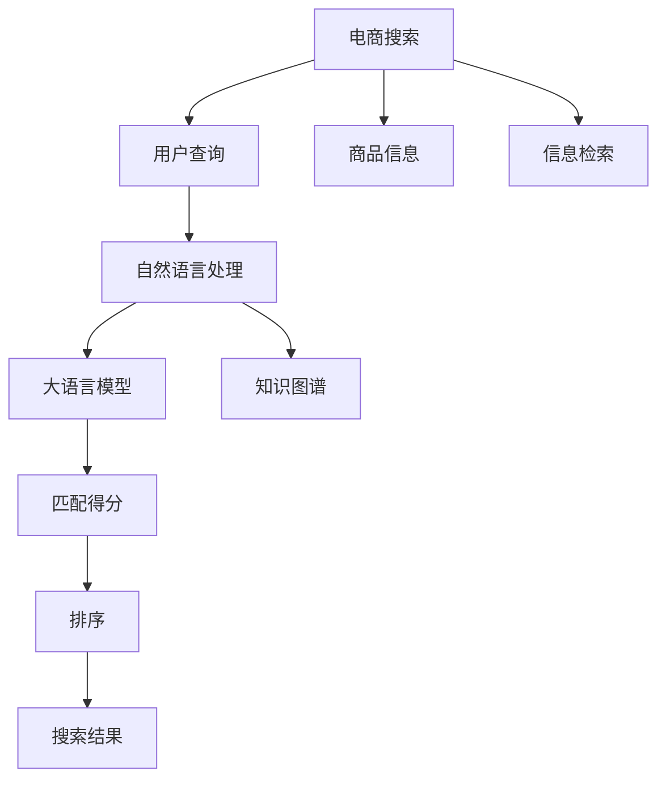

                 

# 电商搜索中的语义理解：AI大模型的突破性进展

> 关键词：电商搜索,语义理解,自然语言处理(NLP),大语言模型,知识图谱,信息检索,深度学习,Transformers

## 1. 背景介绍

### 1.1 问题由来
电子商务平台的搜索功能是用户获取商品信息、进行购买决策的关键入口。然而，用户输入的查询往往带有歧义、拼写错误，甚至包含个性化需求。如何理解这些查询，并准确、高效地匹配到相关商品，是电商搜索面临的重要挑战。传统的搜索算法通常依赖于关键字匹配，无法真正理解查询背后的语义。而人工智能大模型的出现，使得电商搜索能够跨越这一障碍，向更加智能和个性化的方向迈进。

### 1.2 问题核心关键点
实现电商搜索的语义理解，核心在于：
1. 使用自然语言处理(NLP)技术，理解用户查询的语义，还原用户真正意图。
2. 构建商品的知识图谱，将商品的属性、关系、特征等结构化信息，与查询语义进行关联匹配。
3. 使用深度学习技术，特别是大语言模型和知识图谱嵌入模型，提升匹配的精度和召回率。
4. 实时处理大规模查询，保证服务的高效性和实时性。

当前电商搜索面临的主要问题包括：
- 用户查询的多样性和复杂性。
- 商品信息的结构化程度不足。
- 计算资源的限制。
- 实时搜索的挑战。

本文将重点介绍如何通过大语言模型和知识图谱技术，突破这些瓶颈，实现电商搜索中的高效语义理解。

## 2. 核心概念与联系

### 2.1 核心概念概述

为更好地理解大语言模型在电商搜索中的应用，本节将介绍几个关键概念：

- **自然语言处理(NLP)**：使用计算机处理、理解、生成人类语言的技术，旨在使机器能够像人一样理解和处理语言。

- **大语言模型(Large Language Model, LLM)**：以自回归(如GPT)或自编码(如BERT)模型为代表的大规模预训练语言模型。通过在大规模无标签文本语料上进行预训练，学习通用的语言表示，具备强大的语言理解和生成能力。

- **知识图谱(Knowledge Graph)**：用图形化方式表示实体和它们之间的关系，是一种结构化数据表示方式。

- **信息检索(Information Retrieval, IR)**：根据用户查询，从文档集合中检索相关文档的技术。通过查询扩展、文档排序等技术提升检索效果。

- **深度学习(Deep Learning)**：利用多层神经网络，学习复杂非线性关系的技术。

- **Transformers**：一种基于自注意力机制的深度学习模型，通过Transformer层和Attention机制，实现高效的并行计算和信息交互。

这些概念之间存在紧密的联系：NLP技术通过理解和处理语言，大语言模型通过预训练学习语言知识，知识图谱通过结构化数据为NLP提供支撑，信息检索通过检索技术实现信息匹配，深度学习通过神经网络模型实现高效计算。电商搜索中，这些技术相互配合，共同构建了高效的语义理解体系。

### 2.2 核心概念原理和架构的 Mermaid 流程图



这个流程图展示了电商搜索中各关键组件的相互作用：

1. 用户输入查询后，首先经过自然语言处理，理解查询的语义。
2. 大语言模型根据处理后的语义，输出查询中的关键词和实体信息。
3. 知识图谱根据这些实体信息，提供结构化的商品信息支撑。
4. 信息检索根据查询和商品信息，匹配得分。
5. 匹配得分经过排序后，生成最终搜索结果。

这些组件通过协同工作，使得电商搜索能够更好地理解用户查询，匹配相关商品。

## 3. 核心算法原理 & 具体操作步骤

### 3.1 算法原理概述

电商搜索中的语义理解，本质上是一个自然语言处理和信息检索相结合的过程。其核心思想是：通过大语言模型和知识图谱，将用户查询与商品信息进行深度匹配，输出相关商品。

具体步骤包括：
1. 收集商品信息，构建知识图谱。
2. 使用大语言模型处理用户查询，输出关键词和实体。
3. 将查询与知识图谱中的商品进行语义匹配。
4. 使用信息检索技术，从商品集合中检索相关商品。
5. 对搜索结果进行排序，返回最终商品列表。

### 3.2 算法步骤详解

#### 3.2.1 收集和构建商品知识图谱
商品知识图谱的构建需要从多个维度进行：

1. 收集商品的属性信息，如品牌、价格、尺寸、颜色等。
2. 收集商品之间的关系，如上下位关系、品牌关联等。
3. 构建商品的实体节点和关系节点，形成知识图谱。

例如，我们可以使用开源框架如Neo4j、Gephi等进行知识图谱的可视化和管理。

#### 3.2.2 使用大语言模型处理用户查询
大语言模型在电商搜索中的应用，通常涉及两个步骤：

1. **查询理解和语义表示**：使用大语言模型，将用户查询处理为语义表示，输出关键词和实体。
2. **语义扩展和关键词生成**：通过进一步的模型处理，生成与查询相关的关键词，用于后续的匹配。

#### 3.2.3 匹配和检索
将查询与知识图谱中的商品进行匹配，主要依赖以下步骤：

1. **实体匹配**：根据查询中的关键词和实体，在知识图谱中查找对应的商品节点。
2. **关系匹配**：考虑商品之间的关系，如上下位关系、品牌关联等，进一步筛选出匹配的商品。
3. **语义匹配**：使用模型处理查询与商品节点的语义信息，计算相似度得分。

#### 3.2.4 排序和返回结果
对检索出的商品进行排序，主要依赖以下步骤：

1. **排序算法选择**：根据业务需求，选择合适的排序算法，如基于相似度的排序、基于价格的排序等。
2. **结果展示**：根据排序结果，返回商品列表，供用户选择。

### 3.3 算法优缺点

电商搜索中的语义理解算法具有以下优点：
1. 能够理解用户查询的多样性和复杂性，提升匹配的准确性。
2. 通过知识图谱提供商品的结构化信息支撑，提升匹配的召回率。
3. 使用深度学习技术，特别是大语言模型，提升了匹配的精度。
4. 实时处理大规模查询，保证了服务的高效性和实时性。

同时，该算法也存在一定的局限性：
1. 构建和维护知识图谱需要大量资源和时间。
2. 大语言模型的性能依赖于语料库的质量和规模。
3. 对计算资源的要求较高，需要高性能的硬件设备支持。
4. 对模型的实时性和稳定性要求较高，需要高效的优化算法。

尽管存在这些局限性，电商搜索中的语义理解算法仍是目前最先进的技术手段，能够显著提升用户的搜索体验和购买决策效率。

### 3.4 算法应用领域

大语言模型和知识图谱在电商搜索中的应用，已经在多个领域得到了广泛验证。

- **零售电商**：如亚马逊、京东、淘宝等平台，通过语义理解算法，实现了个性化推荐、智能客服、语音搜索等创新应用。
- **快消品电商**：如美妆、服装等垂直领域，通过语义理解算法，实现了更精确的商品匹配和个性化推荐。
- **汽车电商**：如汽车之家、易车网等平台，通过语义理解算法，实现了更准确的车辆搜索和购车咨询。
- **旅游电商**：如携程、去哪儿等平台，通过语义理解算法，实现了旅游目的地和酒店预订的智能匹配。

除了以上应用场景，大语言模型和知识图谱技术在B2B电商、食品电商、家居电商等领域同样有广泛应用，成为推动电商行业数字化转型的重要技术支撑。

## 4. 数学模型和公式 & 详细讲解 & 举例说明

### 4.1 数学模型构建

电商搜索中的语义理解模型通常包括以下几个关键模块：

1. **查询理解模块**：使用大语言模型处理用户查询，输出关键词和实体。
2. **知识图谱嵌入模块**：将商品信息编码为向量，方便与查询进行匹配。
3. **匹配和检索模块**：将查询与商品进行匹配，生成相关商品列表。
4. **排序模块**：对商品列表进行排序，返回最终结果。

这些模块可以通过以下数学模型来描述：

- **查询理解模型**：将查询 $q$ 映射为语义向量 $v_q$。
- **商品嵌入模型**：将商品 $i$ 映射为向量 $v_i$。
- **匹配模型**：计算查询 $q$ 与商品 $i$ 的相似度 $s_{q,i}$。
- **排序模型**：对商品 $i$ 的得分 $s_i$ 进行排序，返回最终结果。

### 4.2 公式推导过程

以基于BERT模型的电商搜索为例，其数学模型和公式推导如下：

1. **查询理解模型**：
$$
v_q = BERT(q)
$$

2. **商品嵌入模型**：
$$
v_i = BERT(i)
$$

3. **匹配模型**：
$$
s_{q,i} = \text{cosine-similarity}(v_q, v_i)
$$

4. **排序模型**：
$$
s_i = \text{rating}(v_q, v_i) + \text{price}(v_q, v_i) + \text{relevance}(v_q, v_i)
$$

其中 $\text{rating}(v_q, v_i)$、$\text{price}(v_q, v_i)$ 和 $\text{relevance}(v_q, v_i)$ 分别表示评分、价格和相关性评分，可以根据实际需求定义。

### 4.3 案例分析与讲解

假设用户输入查询 "iPhone 12 价格"，使用BERT模型进行查询理解：

1. 查询理解模型：
$$
v_q = BERT("iPhone 12 价格")
$$

2. 商品嵌入模型：
$$
v_i = BERT(\text{iPhone 12})
$$

3. 匹配模型：
$$
s_{q,i} = \text{cosine-similarity}(v_q, v_i)
$$

4. 排序模型：
$$
s_i = \text{rating}(v_q, v_i) + \text{price}(v_q, v_i) + \text{relevance}(v_q, v_i)
$$

通过计算，可以得到与查询 "iPhone 12 价格" 相关的商品列表，并根据评分、价格和相关性进行排序，返回最终结果。

## 5. 项目实践：代码实例和详细解释说明

### 5.1 开发环境搭建

在进行电商搜索的语义理解实践前，我们需要准备好开发环境。以下是使用Python进行PyTorch开发的环境配置流程：

1. 安装Anaconda：从官网下载并安装Anaconda，用于创建独立的Python环境。

2. 创建并激活虚拟环境：
```bash
conda create -n ecommerce-env python=3.8 
conda activate ecommerce-env
```

3. 安装PyTorch：根据CUDA版本，从官网获取对应的安装命令。例如：
```bash
conda install pytorch torchvision torchaudio cudatoolkit=11.1 -c pytorch -c conda-forge
```

4. 安装Transformers库：
```bash
pip install transformers
```

5. 安装各类工具包：
```bash
pip install numpy pandas scikit-learn matplotlib tqdm jupyter notebook ipython
```

完成上述步骤后，即可在`ecommerce-env`环境中开始电商搜索的语义理解实践。

### 5.2 源代码详细实现

这里以使用BERT模型进行电商搜索为例，给出PyTorch代码实现。

首先，定义查询理解和商品嵌入函数：

```python
from transformers import BertTokenizer, BertForMaskedLM

tokenizer = BertTokenizer.from_pretrained('bert-base-uncased')
model = BertForMaskedLM.from_pretrained('bert-base-uncased')

def query_to_vector(query):
    query_tokens = tokenizer.encode(query, add_special_tokens=True)
    input_ids = torch.tensor(query_tokens).unsqueeze(0).to(device)
    with torch.no_grad():
        output = model(input_ids)
    return output[0].numpy()

def item_to_vector(item):
    item_tokens = tokenizer.encode(item, add_special_tokens=True)
    input_ids = torch.tensor(item_tokens).unsqueeze(0).to(device)
    with torch.no_grad():
        output = model(input_ids)
    return output[0].numpy()
```

然后，构建匹配和排序函数：

```python
import numpy as np

def match(query_vector, item_vectors):
    similarity_matrix = np.dot(query_vector, item_vectors.T)
    return similarity_matrix

def sort(items, scores):
    items = np.argsort(scores)[::-1]
    return items
```

最后，启动搜索流程：

```python
device = torch.device('cuda') if torch.cuda.is_available() else torch.device('cpu')

# 查询处理
query_vector = query_to_vector('iPhone 12 价格')

# 商品处理
item_vectors = [item_to_vector(item) for item in items]

# 匹配得分
similarity_matrix = match(query_vector, item_vectors)

# 排序结果
sorted_items = sort(items, similarity_matrix)

print(sorted_items)
```

以上就是使用PyTorch对BERT进行电商搜索的语义理解实践的完整代码实现。可以看到，通过调用Transformer库提供的预训练模型，能够快速实现查询理解和商品嵌入功能。匹配和排序则依赖自定义的函数实现。

### 5.3 代码解读与分析

让我们再详细解读一下关键代码的实现细节：

**query_to_vector函数**：
- 使用BertTokenizer对查询进行分词处理，生成Token ids。
- 将Token ids转化为Tensor，并通过BertForMaskedLM模型进行前向传播，得到查询的语义表示。
- 返回查询的语义向量。

**item_to_vector函数**：
- 使用BertTokenizer对商品进行分词处理，生成Token ids。
- 将Token ids转化为Tensor，并通过BertForMaskedLM模型进行前向传播，得到商品的语义表示。
- 返回商品的语义向量。

**match函数**：
- 计算查询向量与商品向量的相似度，生成匹配得分矩阵。
- 返回匹配得分矩阵。

**sort函数**：
- 根据匹配得分矩阵对商品进行排序。
- 返回排序后的商品列表。

**启动搜索流程**：
- 将查询和商品通过分词器处理为Token ids，生成查询向量和商品向量。
- 通过match函数计算匹配得分，生成匹配得分矩阵。
- 通过sort函数对商品进行排序，返回排序后的商品列表。

可以看到，通过调用Transformer库提供的预训练模型，能够快速实现查询理解和商品嵌入功能。匹配和排序则依赖自定义的函数实现。

## 6. 实际应用场景

### 6.1 智能推荐系统

基于大语言模型的电商搜索中的语义理解，可以广泛应用于智能推荐系统中。传统推荐系统往往只依赖用户的历史行为数据进行物品推荐，难以充分考虑用户的意图和需求。通过语义理解，智能推荐系统能够更好地理解用户的真实兴趣和需求，从而提供更加个性化和精准的推荐。

在实践中，可以收集用户浏览、点击、评论、分享等行为数据，提取和商品交互的文本内容。将文本内容作为模型输入，用户的后续行为（如是否点击、购买等）作为监督信号，在此基础上微调预训练语言模型。微调后的模型能够从文本内容中准确把握用户的兴趣点。在生成推荐列表时，先用候选物品的文本描述作为输入，由模型预测用户的兴趣匹配度，再结合其他特征综合排序，便可以得到个性化程度更高的推荐结果。

### 6.2 智能客服系统

电商平台的智能客服系统可以基于大语言模型的电商搜索中的语义理解技术进行构建。传统客服往往需要配备大量人力，高峰期响应缓慢，且一致性和专业性难以保证。通过语义理解技术，智能客服系统能够理解用户的查询，自动生成回复，甚至能够进行多轮对话，大大提高客服效率和质量。

在实践应用中，可以使用微调后的对话模型对用户的查询进行语义理解，自动匹配相应的回复模板，并动态生成自然流畅的回复。对于复杂或特殊的问题，还可以引入检索系统实时搜索相关内容，动态组织生成回复，提供更精确的解决方案。

### 6.3 多模态搜索

传统的电商搜索主要依赖文本信息，但随着技术的发展，越来越多的多模态数据可以被整合到电商搜索中，如图片、视频、音频等。通过语义理解技术，电商搜索可以更好地处理多模态数据，提升用户体验和搜索效果。

例如，用户可以通过上传图片查询相似的商品，或通过语音输入查询商品信息。大语言模型和知识图谱技术可以处理这些多模态数据，实现跨模态的匹配和检索。同时，通过深度学习技术，可以对多模态数据进行融合，提升匹配的精度和召回率。

## 7. 工具和资源推荐

### 7.1 学习资源推荐

为了帮助开发者系统掌握电商搜索中的语义理解理论基础和实践技巧，这里推荐一些优质的学习资源：

1. 《深度学习理论与实践》系列博文：深入浅出地介绍了深度学习的基本原理和应用场景，是了解电商搜索中语义理解技术的好材料。
2. CS224N《深度学习自然语言处理》课程：斯坦福大学开设的NLP明星课程，系统讲解了NLP中的关键算法和技术，包括电商搜索中的语义理解。
3. 《Transformer从原理到实践》书籍：全面介绍了Transformer模型和其在电商搜索中的应用，适合深入学习。
4. 《自然语言处理与深度学习》书籍：介绍NLP中的经典模型和技术，帮助理解电商搜索中的语义理解。
5. HuggingFace官方文档：提供了丰富的预训练模型和代码样例，适合实践学习和项目开发。

通过对这些资源的学习实践，相信你一定能够快速掌握电商搜索中的语义理解技术，并用于解决实际的电商问题。

### 7.2 开发工具推荐

高效的开发离不开优秀的工具支持。以下是几款用于电商搜索中的语义理解开发的常用工具：

1. PyTorch：基于Python的开源深度学习框架，灵活动态的计算图，适合快速迭代研究。大部分预训练语言模型都有PyTorch版本的实现。
2. TensorFlow：由Google主导开发的开源深度学习框架，生产部署方便，适合大规模工程应用。同样有丰富的预训练语言模型资源。
3. Transformers库：HuggingFace开发的NLP工具库，集成了众多SOTA语言模型，支持PyTorch和TensorFlow，是进行语义理解任务开发的利器。
4. Weights & Biases：模型训练的实验跟踪工具，可以记录和可视化模型训练过程中的各项指标，方便对比和调优。与主流深度学习框架无缝集成。
5. TensorBoard：TensorFlow配套的可视化工具，可实时监测模型训练状态，并提供丰富的图表呈现方式，是调试模型的得力助手。
6. Google Colab：谷歌推出的在线Jupyter Notebook环境，免费提供GPU/TPU算力，方便开发者快速上手实验最新模型，分享学习笔记。

合理利用这些工具，可以显著提升电商搜索中语义理解任务的开发效率，加快创新迭代的步伐。

### 7.3 相关论文推荐

电商搜索中的语义理解技术的发展源于学界的持续研究。以下是几篇奠基性的相关论文，推荐阅读：

1. Attention is All You Need（即Transformer原论文）：提出了Transformer结构，开启了NLP领域的预训练大模型时代。
2. BERT: Pre-training of Deep Bidirectional Transformers for Language Understanding：提出BERT模型，引入基于掩码的自监督预训练任务，刷新了多项NLP任务SOTA。
3. Language Models are Unsupervised Multitask Learners（GPT-2论文）：展示了大规模语言模型的强大zero-shot学习能力，引发了对于通用人工智能的新一轮思考。
4. Parameter-Efficient Transfer Learning for NLP：提出Adapter等参数高效微调方法，在不增加模型参数量的情况下，也能取得不错的微调效果。
5. Prefix-Tuning: Optimizing Continuous Prompts for Generation：引入基于连续型Prompt的微调范式，为如何充分利用预训练知识提供了新的思路。
6. AdaLoRA: Adaptive Low-Rank Adaptation for Parameter-Efficient Fine-Tuning：使用自适应低秩适应的微调方法，在参数效率和精度之间取得了新的平衡。

这些论文代表了大语言模型微调技术的发展脉络。通过学习这些前沿成果，可以帮助研究者把握学科前进方向，激发更多的创新灵感。

## 8. 总结：未来发展趋势与挑战

### 8.1 总结

本文对基于大语言模型和知识图谱的电商搜索中的语义理解方法进行了全面系统的介绍。首先阐述了电商搜索面临的挑战和语义理解的重要性和必要性，明确了语义理解在电商搜索中的核心地位。其次，从原理到实践，详细讲解了电商搜索中的语义理解数学模型和关键步骤，给出了电商搜索中的语义理解完整代码实例。同时，本文还广泛探讨了语义理解技术在智能推荐、智能客服、多模态搜索等多个领域的应用前景，展示了语义理解技术的巨大潜力。此外，本文精选了电商搜索中的语义理解技术的各类学习资源，力求为读者提供全方位的技术指引。

通过本文的系统梳理，可以看到，基于大语言模型和知识图谱的电商搜索中的语义理解技术正在成为电商搜索领域的重要范式，极大地提升了电商搜索系统的智能化水平，促进了电商行业的数字化转型。未来，伴随大语言模型和知识图谱技术的进一步发展，电商搜索中的语义理解技术必将走向更加智能化和个性化的方向，为电商搜索带来更多的创新和突破。

### 8.2 未来发展趋势

展望未来，电商搜索中的语义理解技术将呈现以下几个发展趋势：

1. 模型规模持续增大。随着算力成本的下降和数据规模的扩张，预训练语言模型的参数量还将持续增长。超大规模语言模型蕴含的丰富语言知识，有望支撑更加复杂多变的电商搜索中的语义理解。
2. 多模态融合成为常态。电商搜索中的语义理解将越来越多地处理图片、视频、音频等多模态数据，提升匹配的精度和召回率。
3. 深度学习与因果推理结合。通过引入因果推理机制，电商搜索中的语义理解将更加稳定可靠，提升用户体验。
4. 知识图谱的动态更新。知识图谱将实现动态更新，实时反映商品的变化情况，提升电商搜索中的语义理解的实时性和准确性。
5. 个性化推荐和智能客服的深度融合。电商搜索中的语义理解将与个性化推荐和智能客服系统深度融合，提供更精准的推荐和更智能的客服体验。

以上趋势凸显了电商搜索中的语义理解技术的广阔前景。这些方向的探索发展，必将进一步提升电商搜索系统的性能和用户体验，推动电商行业的数字化转型。

### 8.3 面临的挑战

尽管电商搜索中的语义理解技术已经取得了瞩目成就，但在迈向更加智能化、普适化应用的过程中，它仍面临着诸多挑战：

1. 知识图谱的构建和维护需要大量资源和时间。
2. 大语言模型的性能依赖于语料库的质量和规模。
3. 对计算资源的要求较高，需要高性能的硬件设备支持。
4. 对模型的实时性和稳定性要求较高，需要高效的优化算法。
5. 对模型的泛化能力和鲁棒性要求较高，需要更多理论研究和实践积累。
6. 对模型的解释性和透明性要求较高，需要建立良好的模型评估和监控机制。

尽管存在这些挑战，电商搜索中的语义理解技术仍是目前最先进的技术手段，能够显著提升用户的搜索体验和购买决策效率。未来研究需要在知识图谱构建、模型优化、硬件支持、实时监控等方面进一步突破，才能更好地适应电商搜索的需求。

### 8.4 研究展望

面向未来，电商搜索中的语义理解技术需要在以下几个方面寻求新的突破：

1. 探索无监督和半监督语义理解方法。摆脱对大规模标注数据的依赖，利用自监督学习、主动学习等无监督和半监督范式，最大限度利用非结构化数据，实现更加灵活高效的语义理解。
2. 研究多模态融合技术。结合图像、视频、音频等多模态数据，提升电商搜索中的语义理解的精度和召回率。
3. 融合因果推断和强化学习。引入因果推断和强化学习思想，增强电商搜索中的语义理解建立稳定因果关系的能力，学习更加普适、鲁棒的语言表征。
4. 引入更多先验知识。将符号化的先验知识，如知识图谱、逻辑规则等，与神经网络模型进行巧妙融合，引导语义理解过程学习更准确、合理的语言模型。

这些研究方向的探索，必将引领电商搜索中的语义理解技术迈向更高的台阶，为构建安全、可靠、可解释、可控的智能电商搜索系统铺平道路。面向未来，电商搜索中的语义理解技术还需要与其他人工智能技术进行更深入的融合，如知识表示、因果推理、强化学习等，多路径协同发力，共同推动电商搜索的进步。

## 9. 附录：常见问题与解答

**Q1：电商搜索中的语义理解如何与个性化推荐系统结合？**

A: 电商搜索中的语义理解可以通过将用户查询和商品信息进行匹配，生成用户对商品的兴趣评分。将这个评分作为个性化推荐系统中的特征之一，结合用户的历史行为数据和模型预测，生成个性化推荐结果。这样可以实现更精准的推荐，提升用户体验。

**Q2：电商搜索中的语义理解在哪些电商平台上应用较多？**

A: 电商搜索中的语义理解技术在亚马逊、京东、淘宝、携程、去哪儿等大型电商平台上应用较多。这些平台拥有大量商品数据和用户行为数据，适合使用语义理解技术进行商品推荐和智能客服。

**Q3：电商搜索中的语义理解是否适合电商小平台？**

A: 电商搜索中的语义理解技术同样适合电商小平台。由于小平台用户规模较小，数据量较少，但用户对电商搜索的期望同样很高，语义理解技术可以显著提升用户体验和搜索效率。

**Q4：电商搜索中的语义理解如何处理长尾商品？**

A: 电商搜索中的语义理解可以通过构建更丰富的知识图谱，将长尾商品的详细信息加入图谱中，提升长尾商品的匹配精度。同时，可以引入更多的先验知识，如长尾商品的领域知识和专家知识，提高语义理解的泛化能力。

**Q5：电商搜索中的语义理解是否可以处理多语言电商？**

A: 电商搜索中的语义理解可以处理多语言电商。通过使用多语言的预训练模型和知识图谱，能够支持多种语言的电商搜索。在实际应用中，可以通过分词、实体识别等技术处理多语言的查询和商品信息，实现跨语言搜索。

总之，电商搜索中的语义理解技术是推动电商行业数字化转型的重要手段。未来研究需要不断探索新技术和方法，提升语义理解的精度和召回率，实现更加智能化、个性化的电商搜索。随着技术的不断进步，相信电商搜索中的语义理解技术将为电商行业带来更多的创新和突破，推动电商行业的数字化转型。

