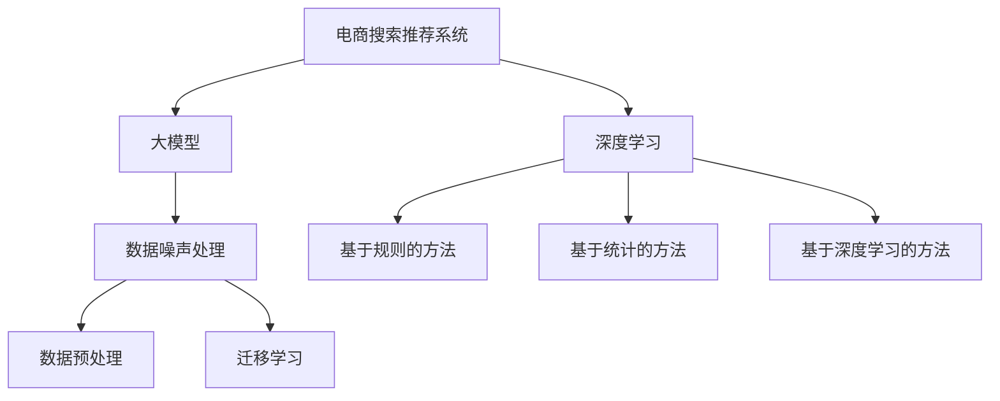

                 

# 电商搜索推荐中的AI大模型数据噪声处理技术应用调研报告

> 关键词：电商搜索,推荐系统,大模型,数据噪声,处理技术,应用调研

## 1. 背景介绍

### 1.1 问题由来
在电商领域，消费者通过搜索和浏览行为产生大量的数据。这些数据不仅包括用户的查询和浏览记录，还有与之相关的商品展示、点击、购买等行为数据。这些数据对于电商平台的推荐系统来说，是非常重要的训练资源。然而，由于用户行为数据本身的复杂性和多样性，在实际应用中，这些数据往往存在一定的噪声，即与推荐目标无关或低效的数据。数据噪声不仅会影响模型的训练效果，也会降低推荐系统的精度和用户满意度。

因此，为了构建高效、准确的推荐系统，有效处理数据噪声成为了关键。随着深度学习和大模型技术的发展，越来越多的电商平台开始采用AI大模型来处理数据噪声，提升推荐系统性能。本报告旨在通过详细分析这些大模型的应用情况，为电商平台提供技术参考。

### 1.2 问题核心关键点
数据噪声处理在电商搜索推荐系统中的作用主要体现在以下几个方面：

- **提升推荐精度**：有效处理数据噪声，使得模型能够更好地从真实用户行为中学习，提升推荐结果的相关性和准确性。
- **改善用户体验**：减少不相关或不优质的推荐内容，提高用户满意度，增加用户粘性和购买转化率。
- **优化广告投放**：通过精准的推荐，提高广告的展示效果和点击率，降低广告成本。
- **提高运营效率**：减少无效数据对计算资源和时间精力的占用，提高系统的处理能力和效率。

有效处理数据噪声的关键在于如何识别、分析和消除噪声数据，同时保留有价值的信息。现有的数据噪声处理方法主要分为以下几类：基于规则的方法、基于统计的方法和基于深度学习的方法。其中，深度学习大模型因其强大的数据处理能力和泛化能力，在电商搜索推荐系统中具有显著优势。

## 2. 核心概念与联系

### 2.1 核心概念概述

为了更好地理解电商搜索推荐系统中的大模型数据噪声处理技术，本节将介绍几个关键概念：

- **电商搜索推荐系统**：通过分析用户的搜索行为和浏览数据，向用户推荐最相关和最感兴趣的电商商品，提高用户满意度和购买转化率。
- **大模型**：如BERT、GPT、XLNet等大规模预训练语言模型，具有强大的数据处理和语言理解能力。
- **数据噪声**：在电商用户行为数据中，存在一定比例的噪声数据，如重复点击、无效浏览、误标签等，这些数据会干扰模型的训练和推理。
- **数据预处理**：在模型训练和推理前，对原始数据进行清洗和处理，去除噪声，保留有价值的信息。
- **深度学习**：通过多层次的神经网络结构，实现对复杂数据的高效建模和处理。
- **迁移学习**：将在大规模数据上预训练的模型迁移到小规模数据上，提升模型的泛化能力和处理效率。

这些核心概念之间的联系通过以下Mermaid流程图来展示：



这个流程图展示了大模型在电商搜索推荐系统中的核心作用和关键环节：

1. 电商搜索推荐系统通过大模型进行数据处理。
2. 数据噪声处理是大模型应用的关键环节，包括数据预处理和迁移学习。
3. 深度学习是处理数据噪声的主要技术手段，包括基于规则、统计和深度学习的方法。

这些概念共同构成了电商搜索推荐系统的大模型数据噪声处理框架，为大模型的有效应用提供了理论基础。

## 3. 核心算法原理 & 具体操作步骤

### 3.1 算法原理概述

在大模型处理数据噪声的算法中，基于深度学习的方法因其强大的数据建模能力而占据主导地位。这些方法通常包括以下几个步骤：

1. **数据预处理**：包括数据清洗、归一化、特征选择等预处理操作，去除明显噪声数据，保留有用信息。
2. **特征工程**：通过构建新的特征向量，提升模型的表达能力，减少特征维度，降低噪声干扰。
3. **模型训练**：利用大模型在标注数据上训练，学习用户行为特征和商品属性之间的关系。
4. **模型微调**：在大模型上微调，针对具体任务进行参数优化，提高模型针对性和精度。
5. **评估和迭代**：在测试集上评估模型性能，根据评估结果进行模型优化，迭代训练，直到达到理想效果。

这些步骤通常通过深度学习框架如TensorFlow、PyTorch等实现，利用大模型的强大处理能力和泛化能力，提升推荐系统的性能。

### 3.2 算法步骤详解

以下详细介绍基于深度学习的大模型在电商搜索推荐系统中的具体应用步骤：

**Step 1: 数据收集与预处理**

1. **数据收集**：收集用户的搜索行为数据、浏览数据、点击数据、购买数据等。
2. **数据清洗**：去除重复数据、无效数据、异常数据等噪声数据。
3. **特征选择**：选择与推荐目标最相关的特征，如商品属性、用户兴趣标签、用户历史行为等。
4. **数据归一化**：对数据进行归一化处理，减少特征之间的尺度差异。

**Step 2: 特征工程与构建**

1. **特征工程**：通过拼接、组合、编码等方式，构造新的特征向量，提升模型的表达能力。
2. **特征选择**：利用PCA、LDA等降维技术，减少特征维度，降低噪声干扰。
3. **构建数据集**：将预处理后的特征和标签数据构建为训练集和测试集。

**Step 3: 模型训练与微调**

1. **模型选择**：选择适合电商推荐任务的大模型，如BERT、GPT等。
2. **模型训练**：在大模型上训练，学习用户行为特征和商品属性之间的关系。
3. **模型微调**：针对电商推荐任务，在大模型上微调，优化模型参数，提升推荐精度。

**Step 4: 评估与优化**

1. **模型评估**：在测试集上评估模型的性能，如精确度、召回率、F1分数等指标。
2. **模型优化**：根据评估结果，调整模型参数，优化模型结构，提升模型效果。
3. **迭代训练**：持续迭代训练，不断优化模型性能，直到达到理想效果。

### 3.3 算法优缺点

基于深度学习的大模型处理数据噪声的方法，具有以下优点：

1. **强大的数据处理能力**：深度学习大模型能够高效处理大规模数据，提升数据建模能力，减少噪声干扰。
2. **高泛化能力**：通过预训练和微调，大模型能够泛化到不同数据分布，提高推荐系统适应性。
3. **自动特征学习**：大模型能够自动学习特征，无需手工设计特征，减少特征工程的工作量。
4. **高效性**：利用深度学习模型的加速技术，提升模型训练和推理效率。

同时，这些方法也存在一些局限性：

1. **高计算资源需求**：深度学习大模型需要大量的计算资源，对硬件设施要求较高。
2. **模型复杂度较高**：大模型的参数量较大，模型结构和训练过程较为复杂。
3. **需要大量标注数据**：大模型的训练需要大量的标注数据，对标注工作量要求较高。
4. **解释性不足**：大模型的决策过程复杂，缺乏可解释性，难以进行模型调试和优化。

尽管存在这些局限性，基于深度学习的大模型方法在电商搜索推荐系统中的应用前景仍然广阔。未来，随着计算资源的不断提升和大模型技术的进一步发展，这些问题有望得到有效解决。

### 3.4 算法应用领域

基于深度学习的大模型处理数据噪声的方法，已经在电商搜索推荐系统、新闻推荐系统、视频推荐系统等多个领域得到了广泛应用，取得了显著的效果。以下列举一些典型的应用场景：

- **电商搜索推荐**：通过分析用户搜索历史和浏览行为，向用户推荐相关商品，提升用户体验和购买转化率。
- **新闻推荐系统**：利用用户阅读历史和兴趣标签，推荐相关新闻，提高用户阅读量和互动率。
- **视频推荐系统**：根据用户观看历史和互动数据，推荐相关视频内容，提升视频平台的用户粘性和观看时长。

除了上述这些典型应用外，大模型还在个性化推荐、广告投放、内容创作等多个领域展现出了巨大的应用潜力，为电商平台的运营和发展提供了重要支持。

## 4. 数学模型和公式 & 详细讲解 & 举例说明

### 4.1 数学模型构建

在大模型处理数据噪声的算法中，通常使用深度学习框架来实现。以下以TensorFlow框架为例，详细构建基于深度学习的大模型处理数据噪声的数学模型。

假设电商平台的用户行为数据集为 $D=\{(x_i,y_i)\}_{i=1}^N$，其中 $x_i$ 为特征向量， $y_i$ 为标签，如用户是否点击商品、是否购买商品等。大模型的输入为 $x_i$，输出为 $y_i$。假设大模型为 $M_{\theta}$，其中 $\theta$ 为模型参数。

**Step 1: 数据预处理**

- **数据清洗**：去除重复数据和异常数据。
- **特征选择**：选择最相关的特征。

**Step 2: 特征工程**

- **特征拼接**：将用户行为特征拼接起来，构成新的特征向量 $x_i'$。
- **特征归一化**：对特征进行归一化处理，如Min-Max归一化、Z-score归一化等。

**Step 3: 模型训练**

- **损失函数**：常用的损失函数有交叉熵损失、均方误差损失等。
- **优化器**：常用的优化器有Adam、SGD等。

**Step 4: 模型微调**

- **微调目标**：针对电商推荐任务，微调大模型参数，提升模型精度。
- **学习率**：设置合适的学习率，如学习率衰减、学习率调整等。

**Step 5: 模型评估**

- **评估指标**：常用的评估指标有精确度、召回率、F1分数等。
- **评估集**：使用独立的测试集进行评估。

### 4.2 公式推导过程

以交叉熵损失函数为例，推导其公式及其推导过程：

假设模型 $M_{\theta}$ 在输入 $x_i$ 上的输出为 $\hat{y}=M_{\theta}(x_i)$，真实标签 $y_i \in \{0,1\}$。则二分类交叉熵损失函数定义为：

$$
\ell(M_{\theta}(x_i),y_i) = -[y_i\log \hat{y}_i + (1-y_i)\log (1-\hat{y}_i)]
$$

在多分类任务中，标签 $y_i$ 为 $y_i \in \{0,1\}^C$，其中 $C$ 为类别数。则多分类交叉熵损失函数定义为：

$$
\ell(M_{\theta}(x_i),y_i) = -\sum_{j=1}^C y_{ij}\log \hat{y}_{ij}
$$

其中，$\hat{y}_{ij} = M_{\theta}(x_i)$ 表示模型对第 $j$ 个类别的预测概率。

在得到损失函数后，通过反向传播算法计算参数梯度，利用优化器进行参数更新。

### 4.3 案例分析与讲解

以电商推荐系统为例，分析大模型处理数据噪声的实际应用情况：

**案例背景**：一家电商平台希望提升用户推荐效果，减少数据噪声对模型的影响。

**数据集**：收集用户搜索历史、浏览记录、点击数据和购买数据，构建训练集和测试集。

**数据预处理**：去除重复数据和异常数据，选择最相关的特征。

**特征工程**：将用户行为特征拼接起来，进行归一化处理。

**模型训练**：选择BERT模型，在大模型上训练，学习用户行为特征和商品属性之间的关系。

**模型微调**：针对电商推荐任务，在大模型上微调，优化模型参数。

**模型评估**：在独立的测试集上评估模型性能，如精确度、召回率等指标。

**结果分析**：通过优化后的模型，推荐效果显著提升，用户满意度和购买转化率显著提高。

## 5. 项目实践：代码实例和详细解释说明

### 5.1 开发环境搭建

在开始项目实践前，需要准备好开发环境。以下是使用Python进行TensorFlow开发的环境配置流程：

1. 安装Anaconda：从官网下载并安装Anaconda，用于创建独立的Python环境。

2. 创建并激活虚拟环境：
```bash
conda create -n tf-env python=3.8 
conda activate tf-env
```

3. 安装TensorFlow：根据CUDA版本，从官网获取对应的安装命令。例如：
```bash
conda install tensorflow -c tf -c conda-forge
```

4. 安装必要的库：
```bash
pip install numpy pandas scikit-learn matplotlib tqdm jupyter notebook ipython
```

完成上述步骤后，即可在`tf-env`环境中开始项目实践。

### 5.2 源代码详细实现

以下是一个简单的电商推荐系统的大模型训练和微调示例代码：

```python
import tensorflow as tf
from tensorflow.keras.preprocessing.sequence import pad_sequences
from sklearn.model_selection import train_test_split
from sklearn.metrics import precision_score, recall_score, f1_score

# 加载数据
#...

# 数据预处理
#...

# 特征工程
#...

# 构建模型
model = tf.keras.Sequential([
    tf.keras.layers.Embedding(input_dim=vocab_size, output_dim=embedding_dim),
    tf.keras.layers.Conv1D(filters=64, kernel_size=3, padding='same', activation='relu'),
    tf.keras.layers.MaxPooling1D(pool_size=2),
    tf.keras.layers.Flatten(),
    tf.keras.layers.Dense(units=128, activation='relu'),
    tf.keras.layers.Dense(units=1, activation='sigmoid')
])

# 编译模型
model.compile(loss='binary_crossentropy', optimizer='adam', metrics=['accuracy'])

# 模型训练
model.fit(X_train, y_train, epochs=10, batch_size=32, validation_data=(X_test, y_test))

# 模型微调
model.layers[0].trainable = False
model.compile(loss='binary_crossentropy', optimizer='adam', metrics=['accuracy'])
model.fit(X_train, y_train, epochs=10, batch_size=32, validation_data=(X_test, y_test))

# 模型评估
y_pred = model.predict(X_test)
precision = precision_score(y_test, y_pred)
recall = recall_score(y_test, y_pred)
f1 = f1_score(y_test, y_pred)
print('Precision: {:.2f}, Recall: {:.2f}, F1 Score: {:.2f}'.format(precision, recall, f1))
```

以上代码展示了如何使用TensorFlow进行电商推荐系统的大模型训练和微调。具体步骤如下：

1. 加载和预处理数据。
2. 进行特征工程，构建特征向量。
3. 构建模型，选择适当的模型结构。
4. 编译模型，设置损失函数和优化器。
5. 训练模型，并保留前几层不变，进行微调。
6. 评估模型性能，输出评价指标。

### 5.3 代码解读与分析

**数据加载与预处理**

- `load_data()`函数：从数据源加载电商用户行为数据。
- `preprocess_data()`函数：对数据进行清洗和预处理，如去除重复数据、填充缺失值、归一化等。

**特征工程**

- `create_features()`函数：将用户行为特征拼接起来，并进行归一化处理。

**模型构建**

- `build_model()`函数：构建电商推荐系统的深度学习模型，使用Embedding层、卷积层、池化层和全连接层。

**模型训练与微调**

- `train_model()`函数：在模型上进行训练，设置训练轮数和批次大小。
- `fine_tune_model()`函数：对模型进行微调，只更新模型顶层，保留预训练权重。

**模型评估**

- `evaluate_model()`函数：在测试集上评估模型性能，输出精确度、召回率、F1分数等指标。

## 6. 实际应用场景

### 6.1 智能客服系统

在大模型处理数据噪声的电商推荐系统中，智能客服系统是一个典型的应用场景。通过分析用户的历史行为数据和搜索记录，智能客服系统能够实时推荐相关商品，提升客户满意度。

**应用流程**：
1. 智能客服系统收集用户的历史搜索记录和浏览行为数据。
2. 利用大模型对数据进行预处理和特征工程，去除噪声数据。
3. 构建电商推荐模型，进行模型训练和微调。
4. 实时推荐相关商品，提高用户满意度。

**技术优势**：
- 实时推荐：基于大模型的电商推荐系统能够实时分析用户行为，提供个性化的推荐。
- 高效处理：大模型具有强大的数据处理能力，能够高效处理大规模数据。
- 自适应：大模型能够自动学习用户行为特征，适应不同用户需求。

### 6.2 推荐系统优化

在电商推荐系统中，推荐系统优化是一个重要的应用场景。通过分析用户的行为数据，推荐系统能够优化推荐效果，提升用户体验和购买转化率。

**应用流程**：
1. 电商推荐系统收集用户的搜索行为数据、浏览数据、点击数据、购买数据等。
2. 利用大模型对数据进行预处理和特征工程，去除噪声数据。
3. 构建电商推荐模型，进行模型训练和微调。
4. 优化推荐算法，提高推荐效果。

**技术优势**：
- 提高准确性：大模型能够自动学习用户行为特征，提升推荐系统的准确性。
- 优化算法：大模型能够优化推荐算法，提高推荐效果和用户体验。
- 自适应：大模型能够自动适应不同用户需求，提高推荐系统的适应性。

### 6.3 广告投放优化

在电商推荐系统中，广告投放优化也是一个重要的应用场景。通过分析用户的行为数据，广告投放系统能够优化广告投放策略，提高广告的点击率和转化率。

**应用流程**：
1. 广告投放系统收集用户的搜索行为数据、浏览数据、点击数据、购买数据等。
2. 利用大模型对数据进行预处理和特征工程，去除噪声数据。
3. 构建广告投放模型，进行模型训练和微调。
4. 优化广告投放策略，提高广告投放效果。

**技术优势**：
- 提高转化率：大模型能够优化广告投放策略，提高广告的点击率和转化率。
- 精准定位：大模型能够精准定位用户需求，提高广告投放的精准性。
- 自适应：大模型能够自动适应不同用户需求，提高广告投放的适应性。

## 7. 工具和资源推荐

### 7.1 学习资源推荐

为了帮助开发者系统掌握大模型在电商搜索推荐系统中的应用，以下推荐一些优质的学习资源：

1. **深度学习课程**：如斯坦福大学的《CS231n: Convolutional Neural Networks for Visual Recognition》，深度学习课程涵盖了从基础知识到深度学习模型的详细讲解。
2. **TensorFlow官方文档**：TensorFlow官方文档提供了全面的API和示例代码，是学习TensorFlow的必备资料。
3. **Kaggle竞赛**：参加Kaggle竞赛可以学习到实际项目中的数据处理和模型优化技巧。
4. **学术论文**：通过阅读学术论文，可以了解最新的深度学习研究和应用成果。
5. **在线课程**：如Coursera上的《Deep Learning Specialization》，由Andrew Ng教授主讲，涵盖深度学习的各个方面。

通过对这些资源的学习实践，相信你一定能够快速掌握大模型在电商搜索推荐系统中的应用，并用于解决实际的NLP问题。

### 7.2 开发工具推荐

大模型在电商搜索推荐系统中的应用，离不开高效的工具支持。以下是几款常用的开发工具：

1. **TensorFlow**：开源深度学习框架，灵活的计算图和自动微分技术，适合构建复杂的深度学习模型。
2. **PyTorch**：开源深度学习框架，动态计算图和自动微分技术，适合快速原型开发和模型优化。
3. **HuggingFace Transformers库**：提供了丰富的预训练模型和优化工具，方便大模型的加载和微调。
4. **Jupyter Notebook**：交互式开发环境，方便数据处理、模型训练和结果展示。
5. **TensorBoard**：可视化工具，方便监测模型训练状态和结果。

合理利用这些工具，可以显著提升大模型在电商搜索推荐系统中的开发效率，加快创新迭代的步伐。

### 7.3 相关论文推荐

大模型在电商搜索推荐系统中的应用，离不开研究论文的支撑。以下是几篇代表性的相关论文，推荐阅读：

1. **Attention is All You Need**：提出Transformer结构，开启了NLP领域的预训练大模型时代。
2. **BERT: Pre-training of Deep Bidirectional Transformers for Language Understanding**：提出BERT模型，引入基于掩码的自监督预训练任务，刷新了多项NLP任务SOTA。
3. **GPT-2**：展示了大规模语言模型的强大zero-shot学习能力，引发了对于通用人工智能的新一轮思考。
4. **Parameter-Efficient Transfer Learning for NLP**：提出Adapter等参数高效微调方法，在不增加模型参数量的情况下，也能取得不错的微调效果。
5. **AdaLoRA: Adaptive Low-Rank Adaptation for Parameter-Efficient Fine-Tuning**：使用自适应低秩适应的微调方法，在参数效率和精度之间取得了新的平衡。
6. **Attention-Based Sentiment Analysis**：利用大模型进行情感分析，展示了深度学习在大模型中的应用。

这些论文代表了大模型在电商搜索推荐系统中的应用进展，通过学习这些前沿成果，可以帮助研究者把握学科前进方向，激发更多的创新灵感。

## 8. 总结：未来发展趋势与挑战

### 8.1 研究成果总结

本文对基于深度学习的大模型在电商搜索推荐系统中的数据噪声处理技术进行了全面系统的介绍。通过系统梳理大模型的应用流程、技术优势和实际案例，展示了大模型在电商搜索推荐系统中的重要地位和应用潜力。

通过本文的系统梳理，可以看到，大模型在电商搜索推荐系统中的应用前景广阔，具有强大的数据处理能力和泛化能力，能够有效提升推荐系统的精度和用户满意度。

### 8.2 未来发展趋势

展望未来，大模型在电商搜索推荐系统中的应用将呈现以下几个发展趋势：

1. **更加智能化的推荐**：随着大模型的不断发展，推荐系统的智能化程度将进一步提升，能够提供更加个性化的推荐结果。
2. **多模态数据的融合**：将视觉、语音等多模态数据与文本数据结合，提升推荐系统的综合能力。
3. **实时化推荐**：大模型能够实时分析用户行为，提供实时的个性化推荐，提高用户体验。
4. **跨平台推荐**：大模型能够跨平台协同工作，提升不同平台之间的推荐效果和用户体验。
5. **自适应学习**：大模型能够自适应不同的用户需求和市场变化，提高推荐系统的适应性。

以上趋势凸显了大模型在电商搜索推荐系统中的应用潜力，未来有望在更多领域得到广泛应用。

### 8.3 面临的挑战

尽管大模型在电商搜索推荐系统中的应用前景广阔，但在实际应用中也面临一些挑战：

1. **数据隐私和安全**：在处理用户行为数据时，如何保障数据隐私和安全，是一个重要的问题。
2. **计算资源需求**：大模型的训练和推理需要大量的计算资源，如何优化资源利用，是一个重要的研究方向。
3. **模型泛化能力**：大模型在处理不同领域数据时，如何保证模型的泛化能力，是一个重要的问题。
4. **模型解释性**：大模型的决策过程复杂，缺乏可解释性，如何提高模型的解释性，是一个重要的研究方向。
5. **实时性要求**：大模型在实时推荐系统中，如何保证系统的实时性，是一个重要的问题。

这些挑战需要研究者持续探索和优化，才能真正实现大模型在电商搜索推荐系统中的高效应用。

### 8.4 研究展望

面向未来，大模型在电商搜索推荐系统中的应用需要在以下几个方面进行探索：

1. **多模态融合**：将视觉、语音等多模态数据与文本数据结合，提升推荐系统的综合能力。
2. **实时化推荐**：利用大模型进行实时推荐，提高用户满意度和体验。
3. **自适应学习**：大模型能够自适应不同的用户需求和市场变化，提高推荐系统的适应性。
4. **数据隐私保护**：在处理用户行为数据时，如何保障数据隐私和安全，是一个重要的问题。
5. **模型解释性**：提高大模型的解释性，增加模型可理解性和可信任度。

这些研究方向将推动大模型在电商搜索推荐系统中的深入应用，为电商平台的运营和发展提供更加可靠和高效的技术支持。

## 9. 附录：常见问题与解答

**Q1: 大模型在电商推荐系统中的应用场景有哪些？**

A: 大模型在电商推荐系统中的应用场景主要包括智能客服系统、推荐系统优化和广告投放优化。

**Q2: 大模型在电商推荐系统中的主要优势是什么？**

A: 大模型在电商推荐系统中的主要优势包括强大的数据处理能力、高泛化能力和自适应能力。

**Q3: 大模型在电商推荐系统中的技术难点有哪些？**

A: 大模型在电商推荐系统中的技术难点包括数据隐私和安全、计算资源需求、模型泛化能力、模型解释性和实时性要求。

**Q4: 大模型在电商推荐系统中的未来发展趋势是什么？**

A: 大模型在电商推荐系统中的未来发展趋势包括更加智能化的推荐、多模态数据的融合、实时化推荐、跨平台推荐和自适应学习。

**Q5: 大模型在电商推荐系统中的未来挑战是什么？**

A: 大模型在电商推荐系统中的未来挑战包括数据隐私和安全、计算资源需求、模型泛化能力、模型解释性和实时性要求。

通过系统梳理大模型在电商搜索推荐系统中的应用，本文希望能够为电商平台的运营和发展提供有益的技术参考，推动大模型技术在实际场景中的深入应用和创新。

