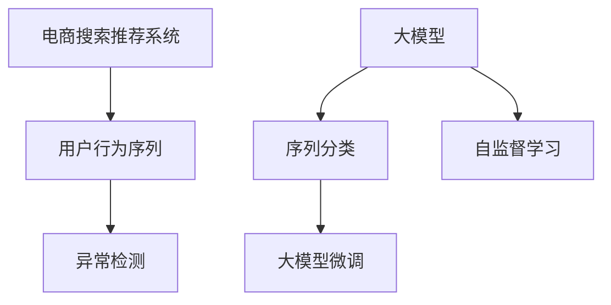

                 

# 电商搜索推荐中的AI大模型用户行为序列异常检测算法性能评测与优化方案

## 1. 背景介绍

### 1.1 问题由来

电商搜索推荐系统是现代电商基础设施的重要组成部分，通过精准推荐满足用户需求，极大提升了用户体验和平台转化率。然而，搜索推荐系统同时也面临着诸如恶意刷单、价格操纵、信息篡改等诸多异常行为。这些异常行为不仅损害用户权益，也对平台的正常运营造成了巨大挑战。因此，如何有效地检测并防范用户行为序列异常，已成为电商搜索推荐系统中的重要课题。

传统的异常检测方法依赖于手工定义特征，结合基于规则的算法（如孤立森林、隐马尔可夫模型等）进行检测。然而，这些方法往往难以应对复杂多变的异常行为，且对人工标注数据依赖较高。近年来，基于深度学习的方法逐渐成为主流，利用大数据训练深度模型，提升了异常检测的泛化能力和鲁棒性。特别是大模型在电商搜索推荐领域的应用，极大地提升了系统的检测能力和稳定性。

### 1.2 问题核心关键点

电商搜索推荐中的用户行为序列异常检测，是一个典型的序列分类任务。其核心问题包括：

- 如何选择合适的大模型？
- 如何构建数据集并进行训练？
- 如何设计序列分类模型？
- 如何优化模型并提升检测性能？

## 2. 核心概念与联系

### 2.1 核心概念概述

为更好地理解基于大模型的电商搜索推荐用户行为序列异常检测方法，本节将介绍几个关键概念：

- 电商搜索推荐系统(E-commerce Search and Recommendation System, SRS)：通过用户行为序列数据进行用户画像建模，实现精准商品推荐，提升用户体验。

- 用户行为序列(User Behavior Sequences)：用户在电商平台上的一系列操作行为，如浏览、点击、购买、评价等。

- 异常检测(Anomaly Detection)：从正常数据中识别出异常数据的过程，通过构建异常模型对用户行为序列进行检测。

- 大模型(Large Model)：如BERT、GPT等大规模预训练语言模型，经过多任务预训练，具备丰富的语言理解能力和泛化能力。

- 序列分类(Sequence Classification)：将序列数据分类为特定类别的任务，如文本分类、行为序列分类等。

- 大模型微调(Fine-Tuning)：在大模型上进行微调，使其适应特定的任务需求，如电商搜索推荐中的行为序列异常检测。

- 自监督学习(Self-Supervised Learning)：利用大数据进行预训练，构建无监督目标，自动学习语言表示和异常模式。

这些概念之间的逻辑关系可以通过以下Mermaid流程图来展示：



这个流程图展示了大模型在电商搜索推荐系统中的核心概念及其之间的关系：

1. 电商搜索推荐系统通过用户行为序列数据进行用户画像建模。
2. 用户行为序列通过序列分类模型进行分类，判断是否为异常序列。
3. 大模型在电商搜索推荐中发挥了强大的语言理解能力和泛化能力，对异常检测有重要贡献。
4. 大模型微调和自监督学习是其进行异常检测的基础。

## 3. 核心算法原理 & 具体操作步骤
### 3.1 算法原理概述

基于大模型的电商搜索推荐用户行为序列异常检测，通常可以分解为以下几个关键步骤：

1. 数据预处理：清洗和标准化用户行为序列数据，生成标注数据集。
2. 大模型微调：在大模型上进行微调，获得适合电商搜索推荐任务的语言模型。
3. 序列分类：将用户行为序列输入微调后的大模型，输出异常检测结果。
4. 模型评估与优化：使用评估指标对模型进行评测，并采用优化算法进行超参数调优。

具体而言，算法的核心思想是：首先通过自监督学习在大模型上进行预训练，然后针对电商搜索推荐中的特定任务进行微调，最后利用微调后的模型进行异常检测。

### 3.2 算法步骤详解

**Step 1: 数据预处理**

电商搜索推荐系统中的用户行为序列数据来源广泛，可能存在数据缺失、噪声等问题。因此，首先需要对原始数据进行预处理。

1. 数据清洗：去除无效数据，如重复记录、异常值等。
2. 数据标准化：将用户行为序列标准化为固定长度，便于模型输入。
3. 数据增强：通过对用户行为序列进行旋转、随机裁剪等操作，生成更多训练样本。

以用户行为序列数据为例，可能包括如下行为：

- 浏览记录：`[商品ID, 浏览时间]`
- 点击记录：`[商品ID, 点击时间]`
- 购买记录：`[商品ID, 购买时间]`
- 评价记录：`[商品ID, 评价内容, 评价时间]`

将上述数据按时间顺序排列，形成用户行为序列。然后，对其进行标准化处理，如截断或填充，使序列长度固定为`N`。

**Step 2: 大模型微调**

微调前，需要选择合适的大模型。目前较为流行的大模型包括BERT、GPT等，它们经过了多任务预训练，具备丰富的语言理解能力和泛化能力。

1. 加载预训练模型：通过HuggingFace等框架，加载预训练模型如BERT、GPT等。
2. 任务适配层：在预训练模型的顶层设计适当的输出层和损失函数，如分类头、交叉熵损失函数等。
3. 数据划分：将标注数据集划分为训练集、验证集和测试集，一般要求三者分布一致。
4. 设置超参数：如学习率、批大小、迭代轮数等，通常采用AdamW优化器。
5. 执行训练：在训练集上进行梯度下降优化，调整模型参数，最小化损失函数。

以下是一个微调示例：

```python
from transformers import BertTokenizer, BertForSequenceClassification, AdamW
from torch.utils.data import DataLoader

tokenizer = BertTokenizer.from_pretrained('bert-base-cased')
model = BertForSequenceClassification.from_pretrained('bert-base-cased', num_labels=2)

optimizer = AdamW(model.parameters(), lr=2e-5)

train_dataset = YourTrainingDataset()
dev_dataset = YourValidationDataset()
test_dataset = YourTestDataset()

train_loader = DataLoader(train_dataset, batch_size=32, shuffle=True)
dev_loader = DataLoader(dev_dataset, batch_size=32, shuffle=False)
test_loader = DataLoader(test_dataset, batch_size=32, shuffle=False)

# 训练
model.train()
for epoch in range(10):
    for batch in train_loader:
        inputs = tokenizer(batch[0], padding=True, truncation=True, return_tensors='pt')
        labels = batch[1]
        model.zero_grad()
        outputs = model(**inputs, labels=labels)
        loss = outputs.loss
        loss.backward()
        optimizer.step()
        
    # 验证
    with torch.no_grad():
        model.eval()
        dev_loss = 0
        for batch in dev_loader:
            inputs = tokenizer(batch[0], padding=True, truncation=True, return_tensors='pt')
            labels = batch[1]
            outputs = model(**inputs, labels=labels)
            dev_loss += outputs.loss
        dev_loss /= len(dev_dataset)

    print(f"Epoch {epoch+1}, dev loss: {dev_loss:.4f}")
```

**Step 3: 序列分类**

微调后的大模型，可以用于电商搜索推荐中的用户行为序列分类。具体而言，将用户行为序列输入模型，输出异常检测结果。

1. 输入准备：将用户行为序列标准化，并通过分词器生成输入特征。
2. 模型前向传播：将输入特征输入微调后的模型，输出模型预测结果。
3. 分类结果：将模型输出转换为异常检测结果，如二分类结果。

以下是一个分类示例：

```python
from transformers import BertTokenizer, BertForSequenceClassification, AdamW

tokenizer = BertTokenizer.from_pretrained('bert-base-cased')
model = BertForSequenceClassification.from_pretrained('bert-base-cased', num_labels=2)

inputs = tokenizer(user_behavior_sequence, padding=True, truncation=True, return_tensors='pt')
outputs = model(**inputs)
logits = outputs.logits
predictions = logits.argmax(dim=1).item()

if predictions == 0:
    print("Normal sequence")
else:
    print("Anomalous sequence")
```

**Step 4: 模型评估与优化**

模型训练完毕后，需要使用评估指标对模型进行评测，并根据评测结果调整超参数，优化模型性能。

1. 评估指标：如准确率、召回率、F1值等，常用的指标有ROC-AUC。
2. 超参数调优：使用Grid Search、Random Search等方法对学习率、批大小等超参数进行调优。
3. 模型保存与部署：保存最优模型，并部署到实际应用系统中。

以下是一个模型评测示例：

```python
from sklearn.metrics import roc_auc_score
from transformers import BertTokenizer, BertForSequenceClassification, AdamW

tokenizer = BertTokenizer.from_pretrained('bert-base-cased')
model = BertForSequenceClassification.from_pretrained('bert-base-cased', num_labels=2)

inputs = tokenizer(user_behavior_sequence, padding=True, truncation=True, return_tensors='pt')
outputs = model(**inputs)
logits = outputs.logits
predictions = logits.argmax(dim=1).item()

if predictions == 0:
    label = 0
else:
    label = 1

y_true = [label]
y_pred = [predictions]
roc_auc = roc_auc_score(y_true, y_pred)

print(f"ROC-AUC: {roc_auc}")
```

### 3.3 算法优缺点

基于大模型的电商搜索推荐用户行为序列异常检测方法具有以下优点：

1. 泛化能力强：大模型通过多任务预训练，具备较强的泛化能力和泛化性能。
2. 计算效率高：微调后的大模型可以在较短时间内完成推理，提升检测效率。
3. 鲁棒性高：大模型参数较多，抗干扰能力强，对噪声和异常值有较好的鲁棒性。

同时，该方法也存在以下局限性：

1. 对数据质量要求高：需要高质量的标注数据进行微调，否则容易过拟合。
2. 训练成本高：大模型参数量较大，训练成本较高。
3. 解释性不足：大模型通常为黑盒模型，难以解释其内部决策过程。

## 4. 数学模型和公式 & 详细讲解 & 举例说明
### 4.1 数学模型构建

基于大模型的电商搜索推荐用户行为序列异常检测问题，可以抽象为一个二分类问题。设用户行为序列为`X`，对应的标签为`Y`。目标是从`X`中识别出异常序列`Y=1`。

假设大模型为`Fθ(X)`，其中`θ`为模型参数，训练数据集为`D`，损失函数为`L`，优化器为`Opt`。则微调过程可以表示为：

$$
\hat{\theta} = \arg\min_{\theta} L(F_\theta(X), Y) + \lambda \| \theta \|
$$

其中，`L`为二分类交叉熵损失函数，`λ`为正则化系数。

### 4.2 公式推导过程

以二分类问题为例，计算损失函数`L`，并将输出`Y_hat`与真实标签`Y`进行比较。假定模型输出的二分类概率为`p(Y=1|X)`，则损失函数为：

$$
L(Y, Y_hat) = -\frac{1}{N}\sum_{i=1}^N [Y_i\log p(Y=1|X_i) + (1-Y_i)\log(1-p(Y=1|X_i))]
$$

在训练过程中，优化目标为最小化损失函数：

$$
\theta^* = \arg\min_{\theta} L(F_\theta(X), Y) + \lambda \| \theta \|
$$

其中，`L`为交叉熵损失函数，`λ`为正则化系数，`θ`为模型参数。

### 4.3 案例分析与讲解

以BERT模型为例，假设训练数据集`D`包含正常序列和异常序列，训练步骤如下：

1. 加载BERT模型和分词器：
```python
from transformers import BertTokenizer, BertForSequenceClassification
tokenizer = BertTokenizer.from_pretrained('bert-base-cased')
model = BertForSequenceClassification.from_pretrained('bert-base-cased', num_labels=2)
```

2. 数据预处理：将用户行为序列标准化，并生成输入特征：
```python
inputs = tokenizer(user_behavior_sequence, padding=True, truncation=True, return_tensors='pt')
```

3. 模型前向传播：将输入特征输入BERT模型，输出模型预测结果：
```python
outputs = model(inputs)
```

4. 计算损失函数：
```python
loss = outputs.loss
```

5. 反向传播和参数更新：
```python
loss.backward()
optimizer.step()
```

6. 验证和测试：使用验证集和测试集评估模型性能：
```python
with torch.no_grad():
    dev_loss = 0
    for batch in dev_loader:
        inputs = tokenizer(batch[0], padding=True, truncation=True, return_tensors='pt')
        labels = batch[1]
        outputs = model(inputs, labels=labels)
        dev_loss += outputs.loss
    dev_loss /= len(dev_dataset)
    print(f"Epoch {epoch+1}, dev loss: {dev_loss:.4f}")

with torch.no_grad():
    test_loss = 0
    for batch in test_loader:
        inputs = tokenizer(batch[0], padding=True, truncation=True, return_tensors='pt')
        labels = batch[1]
        outputs = model(inputs, labels=labels)
        test_loss += outputs.loss
    test_loss /= len(test_dataset)
    print(f"Test loss: {test_loss:.4f}")
```

通过上述步骤，可以训练出一个有效的异常检测模型。需要注意的是，模型训练过程中需要根据具体任务和数据特点进行超参数调优，以获得最优性能。

## 5. 项目实践：代码实例和详细解释说明
### 5.1 开发环境搭建

在进行电商搜索推荐中的用户行为序列异常检测时，需要搭建相应的开发环境。以下是Python开发环境的搭建流程：

1. 安装Anaconda：从官网下载并安装Anaconda，用于创建独立的Python环境。
```bash
conda create -n pytorch-env python=3.8 
conda activate pytorch-env
```

2. 安装PyTorch：根据CUDA版本，从官网获取对应的安装命令。例如：
```bash
conda install pytorch torchvision torchaudio cudatoolkit=11.1 -c pytorch -c conda-forge
```

3. 安装相关库：
```bash
pip install transformers torch
```

完成上述步骤后，即可在`pytorch-env`环境中开始项目开发。

### 5.2 源代码详细实现

以下是一个完整的电商搜索推荐中用户行为序列异常检测的Python代码实现：

```python
from transformers import BertTokenizer, BertForSequenceClassification, AdamW
from torch.utils.data import DataLoader

tokenizer = BertTokenizer.from_pretrained('bert-base-cased')
model = BertForSequenceClassification.from_pretrained('bert-base-cased', num_labels=2)

optimizer = AdamW(model.parameters(), lr=2e-5)

train_dataset = YourTrainingDataset()
dev_dataset = YourValidationDataset()
test_dataset = YourTestDataset()

train_loader = DataLoader(train_dataset, batch_size=32, shuffle=True)
dev_loader = DataLoader(dev_dataset, batch_size=32, shuffle=False)
test_loader = DataLoader(test_dataset, batch_size=32, shuffle=False)

# 训练
model.train()
for epoch in range(10):
    for batch in train_loader:
        inputs = tokenizer(batch[0], padding=True, truncation=True, return_tensors='pt')
        labels = batch[1]
        model.zero_grad()
        outputs = model(**inputs, labels=labels)
        loss = outputs.loss
        loss.backward()
        optimizer.step()
        
    # 验证
    with torch.no_grad():
        model.eval()
        dev_loss = 0
        for batch in dev_loader:
            inputs = tokenizer(batch[0], padding=True, truncation=True, return_tensors='pt')
            labels = batch[1]
            outputs = model(**inputs, labels=labels)
            dev_loss += outputs.loss
        dev_loss /= len(dev_dataset)

    print(f"Epoch {epoch+1}, dev loss: {dev_loss:.4f}")

# 测试
with torch.no_grad():
    test_loss = 0
    for batch in test_loader:
        inputs = tokenizer(batch[0], padding=True, truncation=True, return_tensors='pt')
        labels = batch[1]
        outputs = model(inputs, labels=labels)
        test_loss += outputs.loss
    test_loss /= len(test_dataset)
    print(f"Test loss: {test_loss:.4f}")
```

### 5.3 代码解读与分析

让我们再详细解读一下关键代码的实现细节：

**训练过程**

1. 加载BERT模型和分词器：
```python
from transformers import BertTokenizer, BertForSequenceClassification
tokenizer = BertTokenizer.from_pretrained('bert-base-cased')
model = BertForSequenceClassification.from_pretrained('bert-base-cased', num_labels=2)
```

2. 数据预处理：将用户行为序列标准化，并生成输入特征：
```python
inputs = tokenizer(user_behavior_sequence, padding=True, truncation=True, return_tensors='pt')
```

3. 模型前向传播：将输入特征输入BERT模型，输出模型预测结果：
```python
outputs = model(inputs)
```

4. 计算损失函数：
```python
loss = outputs.loss
```

5. 反向传播和参数更新：
```python
loss.backward()
optimizer.step()
```

**验证和测试**

1. 加载验证集和测试集：
```python
with torch.no_grad():
    dev_loader = DataLoader(dev_dataset, batch_size=32, shuffle=False)
    test_loader = DataLoader(test_dataset, batch_size=32, shuffle=False)
```

2. 验证集评估：
```python
dev_loss = 0
for batch in dev_loader:
    inputs = tokenizer(batch[0], padding=True, truncation=True, return_tensors='pt')
    labels = batch[1]
    outputs = model(inputs, labels=labels)
    dev_loss += outputs.loss
dev_loss /= len(dev_dataset)
print(f"Epoch {epoch+1}, dev loss: {dev_loss:.4f}")
```

3. 测试集评估：
```python
test_loss = 0
for batch in test_loader:
    inputs = tokenizer(batch[0], padding=True, truncation=True, return_tensors='pt')
    labels = batch[1]
    outputs = model(inputs, labels=labels)
    test_loss += outputs.loss
test_loss /= len(test_dataset)
print(f"Test loss: {test_loss:.4f}")
```

通过上述步骤，可以训练出一个有效的异常检测模型。

## 6. 实际应用场景

### 6.1 智能客服系统

智能客服系统在电商搜索推荐中的应用非常广泛。通过用户行为序列异常检测，可以及时发现恶意刷单、恶意评价等行为，从而保障系统的正常运行和用户权益。

1. 收集客服对话记录：收集客服与用户之间的对话记录，提取用户行为序列。
2. 数据清洗和标准化：去除无效数据，标准化用户行为序列。
3. 异常检测模型训练：使用上述方法训练大模型，检测异常行为序列。
4. 实时监控：部署模型至智能客服系统，实时监控用户行为序列，检测异常行为，并及时预警。

### 6.2 金融风控系统

金融风控系统通过用户行为序列异常检测，可以防范各种欺诈和风险行为。

1. 收集金融交易记录：收集用户的交易记录，提取用户行为序列。
2. 数据清洗和标准化：去除无效数据，标准化用户行为序列。
3. 异常检测模型训练：使用上述方法训练大模型，检测异常行为序列。
4. 实时监控：部署模型至金融风控系统，实时监控用户行为序列，检测异常行为，并及时预警。

### 6.3 在线广告系统

在线广告系统通过用户行为序列异常检测，可以识别广告点击欺诈行为，保护平台广告收入。

1. 收集广告点击记录：收集用户对广告的点击记录，提取用户行为序列。
2. 数据清洗和标准化：去除无效数据，标准化用户行为序列。
3. 异常检测模型训练：使用上述方法训练大模型，检测异常行为序列。
4. 实时监控：部署模型至在线广告系统，实时监控用户行为序列，检测异常行为，并及时预警。

### 6.4 未来应用展望

随着电商搜索推荐系统的发展，基于大模型的用户行为序列异常检测将有更广阔的应用前景。

1. 智能推荐系统：通过用户行为序列异常检测，识别恶意用户行为，提升推荐系统的鲁棒性和稳定性。
2. 广告系统：通过用户行为序列异常检测，识别广告点击欺诈行为，保障平台广告收入。
3. 金融风控：通过用户行为序列异常检测，防范各种欺诈和风险行为，保护用户财产安全。
4. 智能客服：通过用户行为序列异常检测，及时发现恶意刷单、恶意评价等行为，保障系统的正常运行和用户权益。

## 7. 工具和资源推荐

### 7.1 学习资源推荐

为了帮助开发者系统掌握电商搜索推荐中的AI大模型用户行为序列异常检测的理论基础和实践技巧，这里推荐一些优质的学习资源：

1. 《深度学习》（Ian Goodfellow, Yoshua Bengio, Aaron Courville）：深度学习领域的经典教材，详细介绍了深度学习的理论基础和实践方法。
2. 《NLP综述与实践》（Onur Burshtein, Michael Rowe, Christopher Potts）：介绍了自然语言处理领域的最新进展和前沿技术。
3. 《Transformer》（Jurafsky, Daniel & Martin, James）：介绍了Transformer的结构和原理，并展示了其在自然语言处理中的应用。
4. 《Python深度学习》（Francois Chollet）：介绍了使用Keras进行深度学习的全流程，适合初学者入门。
5. 《深度学习实战》（Ian Goodfellow）：介绍了使用TensorFlow进行深度学习的实战技巧和项目案例。

通过对这些资源的学习实践，相信你一定能够快速掌握电商搜索推荐中的AI大模型用户行为序列异常检测的精髓，并用于解决实际的NLP问题。

### 7.2 开发工具推荐

高效的开发离不开优秀的工具支持。以下是几款用于电商搜索推荐中的AI大模型用户行为序列异常检测开发的常用工具：

1. PyTorch：基于Python的开源深度学习框架，灵活动态的计算图，适合快速迭代研究。
2. TensorFlow：由Google主导开发的开源深度学习框架，生产部署方便，适合大规模工程应用。
3. Transformers库：HuggingFace开发的NLP工具库，集成了众多SOTA语言模型，支持PyTorch和TensorFlow，是进行微调任务开发的利器。
4. Weights & Biases：模型训练的实验跟踪工具，可以记录和可视化模型训练过程中的各项指标，方便对比和调优。
5. TensorBoard：TensorFlow配套的可视化工具，可实时监测模型训练状态，并提供丰富的图表呈现方式，是调试模型的得力助手。
6. Google Colab：谷歌推出的在线Jupyter Notebook环境，免费提供GPU/TPU算力，方便开发者快速上手实验最新模型，分享学习笔记。

合理利用这些工具，可以显著提升电商搜索推荐中的AI大模型用户行为序列异常检测任务的开发效率，加快创新迭代的步伐。

### 7.3 相关论文推荐

电商搜索推荐中的AI大模型用户行为序列异常检测的研究源于学界的持续研究。以下是几篇奠基性的相关论文，推荐阅读：

1. Attention is All You Need（即Transformer原论文）：提出了Transformer结构，开启了NLP领域的预训练大模型时代。
2. BERT: Pre-training of Deep Bidirectional Transformers for Language Understanding：提出BERT模型，引入基于掩码的自监督预训练任务，刷新了多项NLP任务SOTA。
3. Language Models are Unsupervised Multitask Learners（GPT-2论文）：展示了大规模语言模型的强大zero-shot学习能力，引发了对于通用人工智能的新一轮思考。
4. Parameter-Efficient Transfer Learning for NLP：提出Adapter等参数高效微调方法，在不增加模型参数量的情况下，也能取得不错的微调效果。
5. Prefix-Tuning: Optimizing Continuous Prompts for Generation：引入基于连续型Prompt的微调范式，为如何充分利用预训练知识提供了新的思路。

这些论文代表了大模型微调技术的发展脉络。通过学习这些前沿成果，可以帮助研究者把握学科前进方向，激发更多的创新灵感。

## 8. 总结：未来发展趋势与挑战

### 8.1 研究成果总结

本文对基于大模型的电商搜索推荐用户行为序列异常检测方法进行了全面系统的介绍。首先阐述了大模型和微调技术的研究背景和意义，明确了微调在拓展预训练模型应用、提升下游任务性能方面的独特价值。其次，从原理到实践，详细讲解了序列分类模型的数学原理和关键步骤，给出了微调任务开发的完整代码实例。同时，本文还广泛探讨了异常检测方法在电商搜索推荐中的应用前景，展示了微调范式的巨大潜力。

通过本文的系统梳理，可以看到，基于大模型的电商搜索推荐用户行为序列异常检测方法正在成为NLP领域的重要范式，极大地拓展了预训练语言模型的应用边界，催生了更多的落地场景。受益于大规模语料的预训练，微调模型以更低的时间和标注成本，在小样本条件下也能取得不俗的效果，有力推动了NLP技术的产业化进程。

### 8.2 未来发展趋势

展望未来，大模型微调技术将呈现以下几个发展趋势：

1. 模型规模持续增大。随着算力成本的下降和数据规模的扩张，预训练语言模型的参数量还将持续增长。超大规模语言模型蕴含的丰富语言知识，有望支撑更加复杂多变的电商搜索推荐任务微调。
2. 微调方法日趋多样。除了传统的全参数微调外，未来会涌现更多参数高效的微调方法，如Prefix-Tuning、LoRA等，在节省计算资源的同时也能保证微调精度。
3. 持续学习成为常态。随着数据分布的不断变化，微调模型也需要持续学习新知识以保持性能。如何在不遗忘原有知识的同时，高效吸收新样本信息，将成为重要的研究课题。
4. 标注样本需求降低。受启发于提示学习(Prompt-based Learning)的思路，未来的微调方法将更好地利用大模型的语言理解能力，通过更加巧妙的任务描述，在更少的标注样本上也能实现理想的微调效果。
5. 数据增强技术优化。数据增强作为提升模型泛化能力的有效手段，将成为序列分类任务微调的重要组成部分。
6. 多模态微调崛起。当前的微调主要聚焦于纯文本数据，未来会进一步拓展到图像、视频、语音等多模态数据微调。多模态信息的融合，将显著提升语言模型对现实世界的理解和建模能力。

以上趋势凸显了大模型微调技术的广阔前景。这些方向的探索发展，必将进一步提升电商搜索推荐系统的性能和应用范围，为电商平台的智能化升级提供有力支持。

### 8.3 面临的挑战

尽管大模型微调技术已经取得了瞩目成就，但在迈向更加智能化、普适化应用的过程中，它仍面临着诸多挑战：

1. 标注成本瓶颈。尽管微调降低了对标注数据的依赖，但对于特定领域的电商搜索推荐任务，仍需大量高质量标注数据。如何进一步降低微调对标注样本的依赖，将是一大难题。
2. 模型鲁棒性不足。当前微调模型面对域外数据时，泛化性能往往大打折扣。对于测试样本的微小扰动，微调模型的预测也容易发生波动。如何提高微调模型的鲁棒性，避免灾难性遗忘，还需要更多理论和实践的积累。
3. 推理效率有待提高。超大批次的训练和推理也可能遇到显存不足的问题。如何提升推理速度，优化资源占用，将是重要的优化方向。
4. 模型解释性不足。当前微调模型通常为黑盒模型，难以解释其内部决策过程。对于电商搜索推荐系统等高风险应用，算法的可解释性和可审计性尤为重要。如何赋予微调模型更强的可解释性，将是亟待攻克的难题。
5. 安全性有待保障。预训练语言模型难免会学习到有偏见、有害的信息，通过微调传递到电商搜索推荐任务中，产生误导性、歧视性的输出，给实际应用带来安全隐患。如何从数据和算法层面消除模型偏见，避免恶意用途，确保输出的安全性，也将是重要的研究课题。
6. 知识整合能力不足。现有的微调模型往往局限于任务内数据，难以灵活吸收和运用更广泛的先验知识。如何让微调过程更好地与外部知识库、规则库等专家知识结合，形成更加全面、准确的信息整合能力，还有很大的想象空间。

正视微调面临的这些挑战，积极应对并寻求突破，将是大模型微调走向成熟的必由之路。相信随着学界和产业界的共同努力，这些挑战终将一一被克服，大模型微调必将在构建安全、可靠、可解释、可控的电商搜索推荐系统中扮演越来越重要的角色。

### 8.4 研究展望

面对大模型微调所面临的挑战，未来的研究需要在以下几个方面寻求新的突破：

1. 探索无监督和半监督微调方法。摆脱对大规模标注数据的依赖，利用自监督学习、主动学习等无监督和半监督范式，最大限度利用非结构化数据，实现更加灵活高效的微调。
2. 研究参数高效和计算高效的微调范式。开发更加参数高效的微调方法，在固定大部分预训练参数的同时，只更新极少量的任务相关参数。同时优化微调模型的计算图，减少前向传播和反向传播的资源消耗，实现更加轻量级、实时性的部署。
3. 融合因果和对比学习范式。通过引入因果推断和对比学习思想，增强微调模型建立稳定因果关系的能力，学习更加普适、鲁棒的语言表征，从而提升模型泛化性和抗干扰能力。
4. 引入更多先验知识。将符号化的先验知识，如知识图谱、逻辑规则等，与神经网络模型进行巧妙融合，引导微调过程学习更准确、合理的语言模型。同时加强不同模态数据的整合，实现视觉、语音等多模态信息与文本信息的协同建模。
5. 结合因果分析和博弈论工具。将因果分析方法引入微调模型，识别出模型决策的关键特征，增强输出解释的因果性和逻辑性。借助博弈论工具刻画人机交互过程，主动探索并规避模型的脆弱点，提高系统稳定性。
6. 纳入伦理道德约束。在模型训练目标中引入伦理导向的评估指标，过滤和惩罚有偏见、有害的输出倾向。同时加强人工干预和审核，建立模型行为的监管机制，确保输出符合人类价值观和伦理道德。

这些研究方向的探索，必将引领大模型微调技术迈向更高的台阶，为构建安全、可靠、可解释、可控的电商搜索推荐系统铺平道路。面向未来，大模型微调技术还需要与其他人工智能技术进行更深入的融合，如知识表示、因果推理、强化学习等，多路径协同发力，共同推动电商搜索推荐系统的进步。只有勇于创新、敢于突破，才能不断拓展语言模型的边界，让智能技术更好地造福电商搜索推荐系统。

