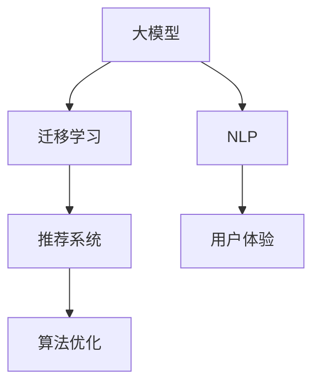

                 

# 电商搜索推荐中的AI大模型迁移学习方法探索

> 关键词：电商搜索推荐, 大模型, 迁移学习, 自然语言处理(NLP), 推荐系统, 用户体验, 算法优化

## 1. 背景介绍

### 1.1 问题由来
在电商领域，搜索推荐系统的优劣直接影响到用户体验和销售额。传统机器学习方法虽然在某些指标上表现出色，但在处理海量数据、个性化需求等方面存在明显不足。而近年来，基于预训练语言模型的大模型迁移学习方法，在电商搜索推荐中的应用逐渐受到重视。

大模型通过在海量数据上进行预训练，学习到通用的语言和语义知识。这些知识可以被迁移到特定电商搜索推荐场景中，用于提升推荐效果。例如，通过在电商产品描述和用户评论上预训练语言模型，可以更准确地理解产品特点和用户需求，进而生成更个性化的推荐结果。

### 1.2 问题核心关键点
大模型迁移学习方法的核心在于：
- 选择合适的大模型，利用其通用知识解决特定问题。
- 收集、标注电商领域的相关数据，构建适用于电商搜索推荐的训练集。
- 设计合适的迁移学习方案，在模型迁移时最大限度保留通用知识。
- 优化模型和算法，提升推荐系统的精度和速度。

大模型迁移学习方法已被广泛应用于电商搜索推荐中，显著提升了推荐效果，并逐步成为电商行业AI技术的重要支撑。

### 1.3 问题研究意义
电商搜索推荐中的大模型迁移学习方法，对于提升用户购物体验、优化电商运营效率、增强市场竞争力具有重要意义：

1. 提升用户体验。大模型能理解自然语言，生成个性化推荐，更好地满足用户需求，提高用户满意度。
2. 优化运营效率。通过推荐系统自动推荐商品，减轻客服工作负担，提高运营效率。
3. 增强市场竞争力。高质量推荐系统可提供更精准的商品匹配，提高转化率和复购率，增强电商企业的市场竞争力。
4. 赋能数字化转型。AI技术的应用，推动传统电商向智能化、数据化方向发展，为电商行业带来新机遇。

## 2. 核心概念与联系

### 2.1 核心概念概述

电商搜索推荐系统中的大模型迁移学习方法涉及多个关键概念，包括：

- **大模型(大规模预训练语言模型)**：通过在大规模无标签数据上自监督学习，学习通用语言和语义知识的模型，如GPT、BERT、RoBERTa等。
- **迁移学习(Transfer Learning)**：将预训练模型的通用知识迁移到特定任务中，如电商搜索推荐，以提升模型在该任务上的性能。
- **自然语言处理(NLP)**：涉及计算机理解和生成自然语言的技术，包括语言模型、文本分类、情感分析等。
- **推荐系统(Recommendation System)**：根据用户的历史行为和兴趣，推荐可能感兴趣的商品或内容，常见类型包括基于协同过滤、基于内容的推荐等。
- **用户体验(User Experience, UX)**：衡量用户对产品或服务的满意度，包括界面友好、功能易用性等。
- **算法优化(Algorithm Optimization)**：通过优化算法，提升推荐系统效率和性能的过程。

这些核心概念之间的关系可以通过以下Mermaid流程图来展示：



这个流程图展示了大模型迁移学习方法的核心概念及其之间的关系：

1. 大模型通过预训练学习通用知识。
2. 迁移学习将通用知识迁移到特定任务中。
3. NLP技术用于处理用户输入和商品描述。
4. 推荐系统根据输入生成推荐结果。
5. 用户体验反馈用于优化算法。

这些概念共同构成了电商搜索推荐系统中的AI技术框架，使得模型能够更好地适应电商领域的复杂任务。

## 3. 核心算法原理 & 具体操作步骤
### 3.1 算法原理概述

大模型迁移学习方法基于迁移学习范式，将预训练模型的通用知识应用于特定任务。具体流程如下：

1. **预训练阶段**：在无标签数据上训练大模型，学习通用语言和语义知识。
2. **迁移学习阶段**：利用电商领域的有标签数据，对大模型进行微调，使其能够更好地适应电商搜索推荐场景。
3. **推荐生成阶段**：使用微调后的模型，根据用户输入生成个性化推荐。

形式化地，假设预训练模型为 $M_{\theta}$，其中 $\theta$ 为预训练得到的模型参数。给定电商搜索推荐任务 $T$ 的标注数据集 $D=\{(x_i, y_i)\}_{i=1}^N$，迁移学习的目标是最小化经验风险，即找到最优参数：

$$
\hat{\theta}=\mathop{\arg\min}_{\theta} \mathcal{L}(M_{\theta},D)
$$

其中 $\mathcal{L}$ 为针对任务 $T$ 设计的损失函数，用于衡量模型预测输出与真实标签之间的差异。常见的损失函数包括交叉熵损失、均方误差损失等。

### 3.2 算法步骤详解

基于大模型迁移学习方法的具体操作流程如下：

**Step 1: 准备预训练模型和数据集**
- 选择合适的预训练语言模型 $M_{\theta}$ 作为初始化参数，如 BERT、GPT 等。
- 收集电商领域的相关数据，构建标注数据集 $D$，包含用户输入、商品描述和标签等。

**Step 2: 添加任务适配层**
- 根据电商搜索推荐任务的特点，在预训练模型顶层设计合适的输出层和损失函数。
- 对于分类任务，通常在顶层添加线性分类器和交叉熵损失函数。
- 对于生成任务，通常使用语言模型的解码器输出概率分布，并以负对数似然为损失函数。

**Step 3: 设置迁移学习超参数**
- 选择合适的优化算法及其参数，如 AdamW、SGD 等，设置学习率、批大小、迭代轮数等。
- 设置正则化技术及强度，包括权重衰减、Dropout、Early Stopping等。
- 确定冻结预训练参数的策略，如仅微调顶层，或全部参数都参与微调。

**Step 4: 执行迁移学习**
- 将标注数据集 $D$ 分批次输入模型，前向传播计算损失函数。
- 反向传播计算参数梯度，根据设定的优化算法和学习率更新模型参数。
- 周期性在验证集上评估模型性能，根据性能指标决定是否触发 Early Stopping。
- 重复上述步骤直到满足预设的迭代轮数或 Early Stopping 条件。

**Step 5: 生成推荐结果**
- 在测试集上评估迁移学习后模型 $M_{\hat{\theta}}$ 的性能，对比迁移前后的精度提升。
- 使用微调后的模型对新用户输入进行推理预测，生成推荐结果。

### 3.3 算法优缺点

大模型迁移学习方法具有以下优点：
1. 模型性能优越。预训练模型具备强大的通用知识，迁移学习能够显著提升推荐效果。
2. 泛化能力强。大模型能处理多种类型的数据，适用于不同类型的电商搜索推荐任务。
3. 适应性强。模型可以根据新场景进行微调，快速适应数据分布的变化。

同时，该方法也存在一些缺点：
1. 数据需求高。迁移学习依赖高质量标注数据，电商领域获取标注数据的成本较高。
2. 迁移效率低。预训练模型的通用知识可能与电商任务不兼容，导致微调效率低。
3. 模型复杂度高。大模型的参数量较大，推理和微调时的计算资源消耗较大。
4. 可解释性不足。大模型输出缺乏可解释性，难以解释推荐结果的逻辑依据。

尽管存在这些局限性，但就目前而言，大模型迁移学习方法仍是电商搜索推荐中较为有效的技术手段。未来相关研究的重点在于如何进一步降低数据需求，提高迁移效率，同时兼顾可解释性和伦理安全性等因素。

### 3.4 算法应用领域

大模型迁移学习方法在电商搜索推荐中的应用广泛，例如：

- **商品推荐**：根据用户历史浏览、购买记录，生成个性化商品推荐。
- **内容推荐**：推荐与用户兴趣相关的文章、视频、新闻等内容。
- **搜索排序**：对用户搜索输入进行排序，提高搜索结果的相关性。
- **广告推荐**：推荐用户可能感兴趣的产品广告。
- **用户行为预测**：预测用户未来可能的行为，如浏览、点击、购买等。

除了上述这些经典应用外，大模型迁移学习方法还被创新性地应用于更多场景中，如智能客服、个性化营销、商品评价分析等，为电商搜索推荐带来了新的突破。随着预训练语言模型和迁移学习方法的不断进步，相信电商搜索推荐技术将在更广阔的应用领域大放异彩。

## 4. 数学模型和公式 & 详细讲解  
### 4.1 数学模型构建

假设预训练语言模型为 $M_{\theta}$，其中 $\theta$ 为预训练得到的模型参数。给定电商搜索推荐任务 $T$ 的标注数据集 $D=\{(x_i, y_i)\}_{i=1}^N$，其中 $x_i$ 为用户输入，$y_i$ 为推荐结果标签。

定义模型 $M_{\theta}$ 在输入 $x$ 上的输出为 $\hat{y}=M_{\theta}(x) \in [0,1]$，表示商品被推荐的概率。真实标签 $y \in \{0,1\}$。则电商搜索推荐任务的损失函数定义为：

$$
\ell(M_{\theta}(x),y) = -[y\log \hat{y} + (1-y)\log (1-\hat{y})]
$$

将其代入经验风险公式，得：

$$
\mathcal{L}(\theta) = -\frac{1}{N}\sum_{i=1}^N [y_i\log M_{\theta}(x_i)+(1-y_i)\log(1-M_{\theta}(x_i))]
$$

在得到损失函数的梯度后，即可带入参数更新公式，完成模型的迭代优化。重复上述过程直至收敛，最终得到适应电商搜索推荐任务的最优模型参数 $\theta^*$。

### 4.2 公式推导过程

以下我们以电商商品推荐任务为例，推导交叉熵损失函数及其梯度的计算公式。

假设模型 $M_{\theta}$ 在输入 $x$ 上的输出为 $\hat{y}=M_{\theta}(x) \in [0,1]$，表示商品被推荐的概率。真实标签 $y \in \{0,1\}$。则二分类交叉熵损失函数定义为：

$$
\ell(M_{\theta}(x),y) = -[y\log \hat{y} + (1-y)\log (1-\hat{y})]
$$

将其代入经验风险公式，得：

$$
\mathcal{L}(\theta) = -\frac{1}{N}\sum_{i=1}^N [y_i\log M_{\theta}(x_i)+(1-y_i)\log(1-M_{\theta}(x_i))]
$$

根据链式法则，损失函数对参数 $\theta_k$ 的梯度为：

$$
\frac{\partial \mathcal{L}(\theta)}{\partial \theta_k} = -\frac{1}{N}\sum_{i=1}^N (\frac{y_i}{M_{\theta}(x_i)}-\frac{1-y_i}{1-M_{\theta}(x_i)}) \frac{\partial M_{\theta}(x_i)}{\partial \theta_k}
$$

其中 $\frac{\partial M_{\theta}(x_i)}{\partial \theta_k}$ 可进一步递归展开，利用自动微分技术完成计算。

在得到损失函数的梯度后，即可带入参数更新公式，完成模型的迭代优化。重复上述过程直至收敛，最终得到适应电商搜索推荐任务的最优模型参数 $\theta^*$。

## 5. 项目实践：代码实例和详细解释说明
### 5.1 开发环境搭建

在进行电商搜索推荐系统开发前，我们需要准备好开发环境。以下是使用Python进行PyTorch开发的环境配置流程：

1. 安装Anaconda：从官网下载并安装Anaconda，用于创建独立的Python环境。

2. 创建并激活虚拟环境：
```bash
conda create -n ecommerce-env python=3.8 
conda activate ecommerce-env
```

3. 安装PyTorch：根据CUDA版本，从官网获取对应的安装命令。例如：
```bash
conda install pytorch torchvision torchaudio cudatoolkit=11.1 -c pytorch -c conda-forge
```

4. 安装各类工具包：
```bash
pip install numpy pandas scikit-learn matplotlib tqdm jupyter notebook ipython
```

完成上述步骤后，即可在`ecommerce-env`环境中开始电商搜索推荐系统的开发。

### 5.2 源代码详细实现

下面我们以电商商品推荐任务为例，给出使用Transformers库对BERT模型进行迁移学习的PyTorch代码实现。

首先，定义商品推荐任务的数据处理函数：

```python
from transformers import BertTokenizer
from torch.utils.data import Dataset
import torch

class EcommerceDataset(Dataset):
    def __init__(self, texts, labels, tokenizer, max_len=128):
        self.texts = texts
        self.labels = labels
        self.tokenizer = tokenizer
        self.max_len = max_len
        
    def __len__(self):
        return len(self.texts)
    
    def __getitem__(self, item):
        text = self.texts[item]
        label = self.labels[item]
        
        encoding = self.tokenizer(text, return_tensors='pt', max_length=self.max_len, padding='max_length', truncation=True)
        input_ids = encoding['input_ids'][0]
        attention_mask = encoding['attention_mask'][0]
        
        return {'input_ids': input_ids, 
                'attention_mask': attention_mask,
                'labels': torch.tensor(label, dtype=torch.long)}
```

然后，定义模型和优化器：

```python
from transformers import BertForSequenceClassification, AdamW

model = BertForSequenceClassification.from_pretrained('bert-base-cased', num_labels=2)

optimizer = AdamW(model.parameters(), lr=2e-5)
```

接着，定义训练和评估函数：

```python
from torch.utils.data import DataLoader
from tqdm import tqdm
from sklearn.metrics import classification_report

device = torch.device('cuda') if torch.cuda.is_available() else torch.device('cpu')
model.to(device)

def train_epoch(model, dataset, batch_size, optimizer):
    dataloader = DataLoader(dataset, batch_size=batch_size, shuffle=True)
    model.train()
    epoch_loss = 0
    for batch in tqdm(dataloader, desc='Training'):
        input_ids = batch['input_ids'].to(device)
        attention_mask = batch['attention_mask'].to(device)
        labels = batch['labels'].to(device)
        model.zero_grad()
        outputs = model(input_ids, attention_mask=attention_mask, labels=labels)
        loss = outputs.loss
        epoch_loss += loss.item()
        loss.backward()
        optimizer.step()
    return epoch_loss / len(dataloader)

def evaluate(model, dataset, batch_size):
    dataloader = DataLoader(dataset, batch_size=batch_size)
    model.eval()
    preds, labels = [], []
    with torch.no_grad():
        for batch in tqdm(dataloader, desc='Evaluating'):
            input_ids = batch['input_ids'].to(device)
            attention_mask = batch['attention_mask'].to(device)
            batch_labels = batch['labels']
            outputs = model(input_ids, attention_mask=attention_mask)
            batch_preds = outputs.logits.argmax(dim=2).to('cpu').tolist()
            batch_labels = batch_labels.to('cpu').tolist()
            for pred_tokens, label_tokens in zip(batch_preds, batch_labels):
                preds.append(pred_tokens)
                labels.append(label_tokens)
                
    print(classification_report(labels, preds))
```

最后，启动训练流程并在测试集上评估：

```python
epochs = 5
batch_size = 16

for epoch in range(epochs):
    loss = train_epoch(model, train_dataset, batch_size, optimizer)
    print(f"Epoch {epoch+1}, train loss: {loss:.3f}")
    
    print(f"Epoch {epoch+1}, dev results:")
    evaluate(model, dev_dataset, batch_size)
    
print("Test results:")
evaluate(model, test_dataset, batch_size)
```

以上就是使用PyTorch对BERT进行电商商品推荐任务迁移学习的完整代码实现。可以看到，得益于Transformers库的强大封装，我们可以用相对简洁的代码完成BERT模型的迁移学习。

### 5.3 代码解读与分析

让我们再详细解读一下关键代码的实现细节：

**EcommerceDataset类**：
- `__init__`方法：初始化商品描述、标签、分词器等关键组件。
- `__len__`方法：返回数据集的样本数量。
- `__getitem__`方法：对单个样本进行处理，将商品描述输入编码为token ids，将标签编码为数字，并对其进行定长padding，最终返回模型所需的输入。

**标签与id的映射**：
- 定义了标签与数字id之间的映射关系，用于将token-wise的预测结果解码回真实的标签。

**训练和评估函数**：
- 使用PyTorch的DataLoader对数据集进行批次化加载，供模型训练和推理使用。
- 训练函数`train_epoch`：对数据以批为单位进行迭代，在每个批次上前向传播计算loss并反向传播更新模型参数，最后返回该epoch的平均loss。
- 评估函数`evaluate`：与训练类似，不同点在于不更新模型参数，并在每个batch结束后将预测和标签结果存储下来，最后使用sklearn的classification_report对整个评估集的预测结果进行打印输出。

**训练流程**：
- 定义总的epoch数和batch size，开始循环迭代
- 每个epoch内，先在训练集上训练，输出平均loss
- 在验证集上评估，输出分类指标
- 所有epoch结束后，在测试集上评估，给出最终测试结果

可以看到，PyTorch配合Transformers库使得BERT迁移学习的代码实现变得简洁高效。开发者可以将更多精力放在数据处理、模型改进等高层逻辑上，而不必过多关注底层的实现细节。

当然，工业级的系统实现还需考虑更多因素，如模型的保存和部署、超参数的自动搜索、更灵活的任务适配层等。但核心的迁移学习范式基本与此类似。

## 6. 实际应用场景
### 6.1 电商智能客服

基于大模型迁移学习的智能客服系统，可以处理大量的客户咨询，提升客户服务体验。传统客服往往需要配备大量人力，高峰期响应缓慢，且一致性和专业性难以保证。而使用迁移学习后的智能客服系统，可以7x24小时不间断服务，快速响应客户咨询，用自然流畅的语言解答各类常见问题。

在技术实现上，可以收集企业内部的历史客服对话记录，将问题和最佳答复构建成监督数据，在此基础上对预训练模型进行迁移学习。迁移学习后的智能客服系统能够自动理解用户意图，匹配最合适的答案模板进行回复。对于客户提出的新问题，还可以接入检索系统实时搜索相关内容，动态组织生成回答。如此构建的智能客服系统，能大幅提升客户咨询体验和问题解决效率。

### 6.2 电商个性化推荐

基于大模型迁移学习的个性化推荐系统，可以生成更符合用户需求的推荐结果。传统推荐系统往往只依赖用户的历史行为数据进行物品推荐，无法深入理解用户的真实兴趣偏好。通过在电商产品描述和用户评论上预训练语言模型，可以更准确地理解产品特点和用户需求，进而生成更个性化的推荐结果。

在实践中，可以收集用户浏览、点击、评论、分享等行为数据，提取和商品交互的物品标题、描述、标签等文本内容。将文本内容作为模型输入，用户的后续行为（如是否点击、购买等）作为监督信号，在此基础上迁移学习预训练语言模型。迁移学习后的模型能够从文本内容中准确把握用户的兴趣点。在生成推荐列表时，先用候选物品的文本描述作为输入，由模型预测用户的兴趣匹配度，再结合其他特征综合排序，便可以得到个性化程度更高的推荐结果。

### 6.3 电商情感分析

基于大模型迁移学习的情感分析系统，可以自动化地分析用户评论和反馈，评估商品质量和服务满意度。通过在电商评论语料上进行预训练，可以学习到商品评价的语义表示，进而用于情感分析。将迁移学习后的模型应用于新的评论数据，可以实时生成情感分析结果，帮助商家及时调整商品策略，提升用户满意度。

在实践中，可以将用户评论数据作为训练集，构建情感分析任务，训练迁移学习模型。迁移学习后的模型能够识别出评论中的正面、负面和中性情感倾向，对每条评论进行情感打分。商家可以结合情感分析结果，对商品质量进行评价和改进，提升整体的用户体验。

### 6.4 未来应用展望

随着大模型迁移学习方法的发展，其在电商领域的应用场景将不断拓展，为电商行业带来更多价值：

1. **电商市场预测**：基于大模型迁移学习，可以预测电商市场的趋势和变化，帮助商家制定更加精准的市场策略。
2. **商品属性抽取**：通过迁移学习，可以从商品描述中自动抽取商品属性，如尺寸、颜色、价格等，提升电商搜索的精准度。
3. **客户行为分析**：利用迁移学习，可以深入理解客户的浏览、购买行为，发现潜在需求，优化产品和服务。
4. **个性化广告推荐**：基于大模型迁移学习，可以生成更符合用户兴趣的广告推荐，提升广告效果和用户转化率。
5. **物流路径优化**：利用自然语言处理和迁移学习，可以优化物流配送路径，提升配送效率和客户满意度。

总之，基于大模型迁移学习的方法将在电商领域带来更加智能化、数据化的应用场景，推动电商行业向更加高效、精准的方向发展。相信随着技术的不断进步，大模型迁移学习将成为电商领域AI技术的重要支撑，推动行业迈向新高度。

## 7. 工具和资源推荐
### 7.1 学习资源推荐

为了帮助开发者系统掌握大模型迁移学习的理论基础和实践技巧，这里推荐一些优质的学习资源：

1. 《Transformer从原理到实践》系列博文：由大模型技术专家撰写，深入浅出地介绍了Transformer原理、BERT模型、迁移学习等前沿话题。

2. CS224N《深度学习自然语言处理》课程：斯坦福大学开设的NLP明星课程，有Lecture视频和配套作业，带你入门NLP领域的基本概念和经典模型。

3. 《Natural Language Processing with Transformers》书籍：Transformers库的作者所著，全面介绍了如何使用Transformers库进行NLP任务开发，包括迁移学习在内的诸多范式。

4. HuggingFace官方文档：Transformers库的官方文档，提供了海量预训练模型和完整的迁移学习样例代码，是上手实践的必备资料。

5. CLUE开源项目：中文语言理解测评基准，涵盖大量不同类型的中文NLP数据集，并提供了基于迁移学习的baseline模型，助力中文NLP技术发展。

通过对这些资源的学习实践，相信你一定能够快速掌握大模型迁移学习的精髓，并用于解决实际的电商问题。

### 7.2 开发工具推荐

高效的开发离不开优秀的工具支持。以下是几款用于大模型迁移学习开发的常用工具：

1. PyTorch：基于Python的开源深度学习框架，灵活动态的计算图，适合快速迭代研究。大部分预训练语言模型都有PyTorch版本的实现。

2. TensorFlow：由Google主导开发的开源深度学习框架，生产部署方便，适合大规模工程应用。同样有丰富的预训练语言模型资源。

3. Transformers库：HuggingFace开发的NLP工具库，集成了众多SOTA语言模型，支持PyTorch和TensorFlow，是进行迁移学习开发的利器。

4. Weights & Biases：模型训练的实验跟踪工具，可以记录和可视化模型训练过程中的各项指标，方便对比和调优。与主流深度学习框架无缝集成。

5. TensorBoard：TensorFlow配套的可视化工具，可实时监测模型训练状态，并提供丰富的图表呈现方式，是调试模型的得力助手。

6. Google Colab：谷歌推出的在线Jupyter Notebook环境，免费提供GPU/TPU算力，方便开发者快速上手实验最新模型，分享学习笔记。

合理利用这些工具，可以显著提升大模型迁移学习任务的开发效率，加快创新迭代的步伐。

### 7.3 相关论文推荐

大模型迁移学习方法的发展源于学界的持续研究。以下是几篇奠基性的相关论文，推荐阅读：

1. Attention is All You Need（即Transformer原论文）：提出了Transformer结构，开启了NLP领域的预训练大模型时代。

2. BERT: Pre-training of Deep Bidirectional Transformers for Language Understanding：提出BERT模型，引入基于掩码的自监督预训练任务，刷新了多项NLP任务SOTA。

3. Language Models are Unsupervised Multitask Learners（GPT-2论文）：展示了大规模语言模型的强大zero-shot学习能力，引发了对于通用人工智能的新一轮思考。

4. Parameter-Efficient Transfer Learning for NLP：提出Adapter等参数高效微调方法，在不增加模型参数量的情况下，也能取得不错的迁移学习效果。

5. Adaptation via Mixture-of-Experts for Parameter-Efficient Learning（AdaLoRA论文）：使用自适应低秩适应的迁移学习方法，在参数效率和精度之间取得了新的平衡。

这些论文代表了大模型迁移学习的发展脉络。通过学习这些前沿成果，可以帮助研究者把握学科前进方向，激发更多的创新灵感。

## 8. 总结：未来发展趋势与挑战

### 8.1 总结

本文对基于大模型迁移学习的电商搜索推荐方法进行了全面系统的介绍。首先阐述了大模型迁移学习的研究背景和意义，明确了迁移学习在电商搜索推荐场景中的应用价值。其次，从原理到实践，详细讲解了大模型迁移学习的数学原理和关键步骤，给出了迁移学习任务开发的完整代码实例。同时，本文还广泛探讨了大模型迁移学习方法在电商领域的应用前景，展示了迁移学习范式的巨大潜力。此外，本文精选了迁移学习的各类学习资源，力求为读者提供全方位的技术指引。

通过本文的系统梳理，可以看到，基于大模型的迁移学习方法正在成为电商搜索推荐的重要手段，极大地提升了推荐效果，并逐步成为电商行业AI技术的重要支撑。未来，伴随预训练语言模型和迁移学习方法的不断进步，相信电商搜索推荐技术将在更广阔的应用领域大放异彩。

### 8.2 未来发展趋势

展望未来，大模型迁移学习方法将呈现以下几个发展趋势：

1. **模型规模持续增大**。随着算力成本的下降和数据规模的扩张，预训练语言模型的参数量还将持续增长。超大规模语言模型蕴含的丰富语言知识，有望支撑更加复杂多变的电商搜索推荐任务。

2. **迁移学习范式多样化**。除了传统的全参数迁移学习外，未来会涌现更多参数高效的迁移学习范式，如Prefix-Tuning、LoRA等，在节省计算资源的同时也能保证迁移学习精度。

3. **跨领域迁移能力提升**。未来的迁移学习方法将更好地应对电商领域的多样性，通过跨领域迁移，提升模型在不同场景下的泛化能力。

4. **持续学习成为常态**。随着数据分布的不断变化，迁移学习模型也需要持续学习新知识以保持性能。如何在不遗忘原有知识的同时，高效吸收新样本信息，将成为重要的研究课题。

5. **多模态迁移学习崛起**。当前的迁移学习方法主要聚焦于文本数据，未来会进一步拓展到图像、视频、语音等多模态数据迁移。多模态信息的融合，将显著提升语言模型对现实世界的理解和建模能力。

6. **融合因果分析和博弈论工具**。将因果分析方法引入迁移学习模型，增强模型建立稳定因果关系的能力，学习更加普适、鲁棒的语言表征，从而提升模型泛化性和抗干扰能力。

以上趋势凸显了大模型迁移学习方法的前景，这些方向的探索发展，必将进一步提升电商搜索推荐系统的性能和应用范围，为电商行业带来新机遇。

### 8.3 面临的挑战

尽管大模型迁移学习方法已经取得了瞩目成就，但在迈向更加智能化、普适化应用的过程中，它仍面临着诸多挑战：

1. **数据需求高**。迁移学习依赖高质量标注数据，电商领域获取标注数据的成本较高。如何进一步降低迁移学习对标注样本的依赖，将是一大难题。

2. **迁移效率低**。预训练模型的通用知识可能与电商任务不兼容，导致迁移学习效率低。如何提高迁移学习效率，保留通用知识的同时适应电商任务，还需要更多理论和实践的积累。

3. **模型复杂度高**。大模型的参数量较大，推理和迁移学习的计算资源消耗较大。如何降低模型复杂度，提升迁移学习效率，优化资源占用，将是重要的优化方向。

4. **可解释性不足**。迁移学习模型输出缺乏可解释性，难以解释推荐结果的逻辑依据。如何赋予迁移学习模型更强的可解释性，将是亟待攻克的难题。

5. **安全性有待保障**。预训练语言模型难免会学习到有偏见、有害的信息，通过迁移学习传递到电商任务，产生误导性、歧视性的输出，给实际应用带来安全隐患。如何从数据和算法层面消除模型偏见，避免恶意用途，确保输出的安全性，也将是重要的研究课题。

6. **知识整合能力不足**。现有的迁移学习方法往往局限于任务内数据，难以灵活吸收和运用更广泛的先验知识。如何让迁移学习过程更好地与外部知识库、规则库等专家知识结合，形成更加全面、准确的信息整合能力，还有很大的想象空间。

正视迁移学习面临的这些挑战，积极应对并寻求突破，将是大模型迁移学习走向成熟的必由之路。相信随着学界和产业界的共同努力，这些挑战终将一一被克服，大模型迁移学习必将在构建智能电商搜索推荐系统方面发挥更大作用。

### 8.4 研究展望

面向未来，大模型迁移学习的研究需要在以下几个方面寻求新的突破：

1. **探索无监督和半监督迁移方法**。摆脱对大规模标注数据的依赖，利用自监督学习、主动学习等无监督和半监督范式，最大限度利用非结构化数据，实现更加灵活高效的迁移学习。

2. **研究参数高效和计算高效的迁移范式**。开发更加参数高效的迁移方法，在固定大部分预训练参数的情况下，只更新极少量的任务相关参数。同时优化迁移学习模型的计算图，减少前向传播和反向传播的资源消耗，实现更加轻量级、实时性的部署。

3. **融合因果分析和博弈论工具**。将因果分析方法引入迁移学习模型，识别出模型决策的关键特征，增强输出解释的因果性和逻辑性。借助博弈论工具刻画人机交互过程，主动探索并规避模型的脆弱点，提高系统稳定性。

4. **纳入伦理道德约束**。在迁移学习模型的训练目标中引入伦理导向的评估指标，过滤和惩罚有偏见、有害的输出倾向。同时加强人工干预和审核，建立模型行为的监管机制，确保输出符合人类价值观和伦理道德。

这些研究方向的探索，必将引领大模型迁移学习技术迈向更高的台阶，为构建安全、可靠、可解释、可控的智能电商搜索推荐系统铺平道路。面向未来，大模型迁移学习技术还需要与其他人工智能技术进行更深入的融合，如知识表示、因果推理、强化学习等，多路径协同发力，共同推动自然语言理解和智能交互系统的进步。只有勇于创新、敢于突破，才能不断拓展大模型迁移学习的应用边界，让智能技术更好地造福电商行业。

## 9. 附录：常见问题与解答

**Q1：电商搜索推荐中如何选择合适的预训练模型？**

A: 电商搜索推荐中应选择那些在大规模无标签数据上预训练的大模型，如BERT、GPT等。这些模型具有较强的通用语言和语义知识，能够提升推荐系统的性能。

**Q2：迁移学习中如何提高模型泛化能力？**

A: 提高模型泛化能力可以从以下几个方面入手：
1. 数据增强：通过数据增强技术扩充训练集，减少模型对单一数据分布的依赖。
2. 正则化：使用L2正则、Dropout等技术，防止模型过拟合。
3. 迁移学习范式多样化：尝试不同的迁移学习方法，如单任务、多任务迁移学习等，提升模型泛化能力。
4. 参数高效迁移：只更新任务相关参数，保留大部分预训练参数，提升模型的泛化能力。

**Q3：电商搜索推荐中如何平衡推荐效果和资源消耗？**

A: 平衡推荐效果和资源消耗可以从以下几个方面入手：
1. 模型裁剪：去除不必要的层和参数，减小模型尺寸，加快推理速度。
2. 量化加速：将浮点模型转为定点模型，压缩存储空间，提高计算效率。
3. 模型并行：利用多GPU/TPU等硬件设备，并行计算，提升模型训练和推理效率。
4. 算法优化：优化模型结构，减少计算复杂度，提升模型效率。

**Q4：电商搜索推荐中如何降低数据需求？**

A: 降低数据需求可以从以下几个方面入手：
1. 数据增强：利用数据增强技术，扩充训练集，减少对标注样本的依赖。
2. 无监督学习：利用无监督学习技术，利用非结构化数据，减少对标注数据的依赖。
3. 半监督学习：结合少量标注数据和大量无标注数据，提升模型性能。
4. 多模态迁移学习：利用多模态数据，提升模型的泛化能力和数据需求。

**Q5：电商搜索推荐中如何提升模型可解释性？**

A: 提升模型可解释性可以从以下几个方面入手：
1. 可解释模型：选择可解释性强的模型，如决策树、规则模型等。
2. 模型可视化：使用可视化工具，展示模型训练和推理过程中的关键参数变化。
3. 特征重要性分析：通过特征重要性分析，找出模型决策的关键特征。
4. 用户反馈：收集用户反馈，根据反馈优化模型，提升模型可解释性。

通过对这些问题的解答，相信你对大模型迁移学习方法有更深入的了解。大模型迁移学习方法正逐步成为电商搜索推荐领域的重要技术手段，相信随着技术的不断进步，将为电商行业带来更多价值和机遇。

