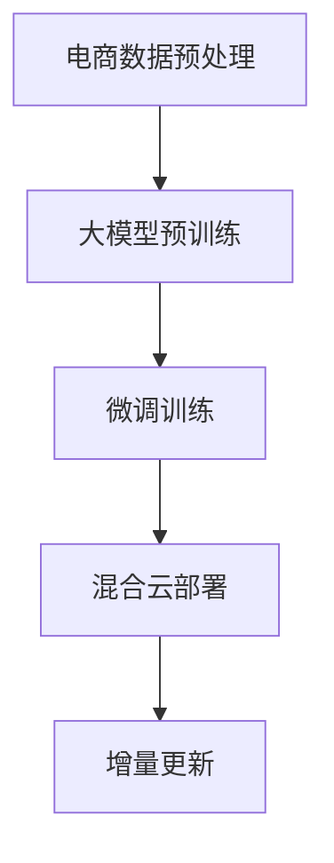
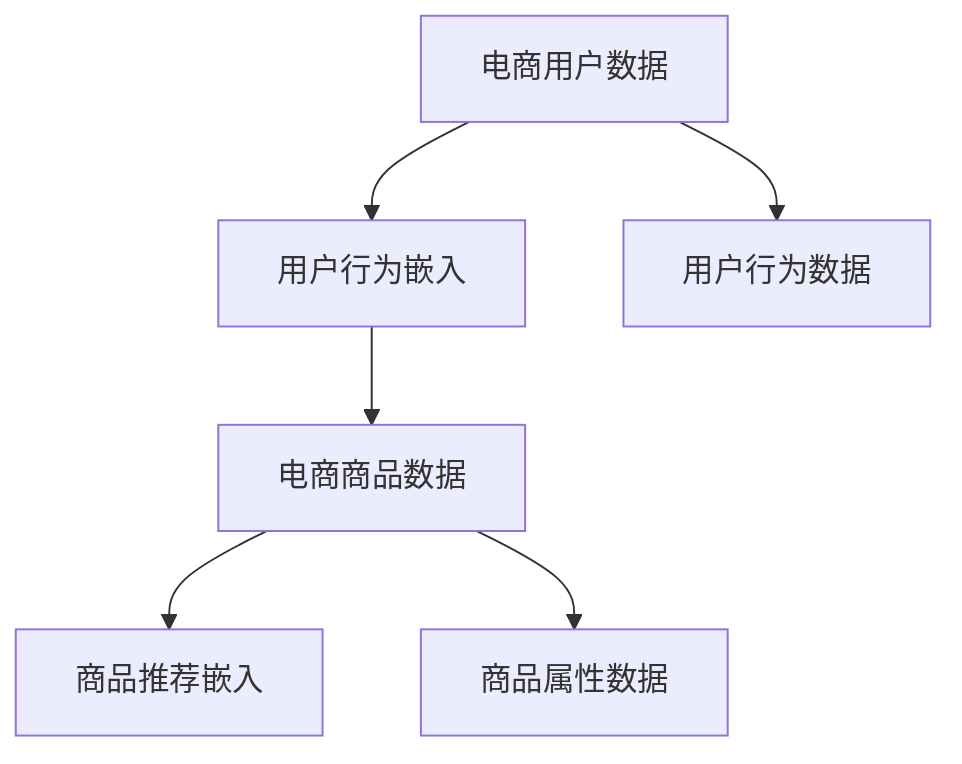
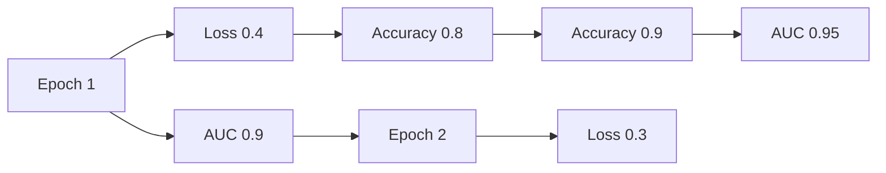

                 

# 电商搜索推荐场景下的AI大模型模型部署混合云实践案例分析

> 关键词：人工智能,电商搜索推荐,大模型,混合云,微调,Fine-tuning,部署,实践案例

## 1. 背景介绍

### 1.1 问题由来
在当今快速发展的电子商务领域，用户搜索和推荐系统的性能直接关系到用户体验和商家转化率。传统的搜索推荐系统大多依赖于手工设计的特征工程和模型，难以适应多变的市场环境和用户需求。而近年来，基于人工智能大模型的推荐技术逐渐崛起，成为行业新技术的关注焦点。

大模型通过大规模数据预训练，具备了强大的自然语言理解和处理能力，能更好地理解用户输入的搜索意图和历史行为，精准地推荐符合用户兴趣的商品。然而，大模型通常需要巨大的计算资源和时间成本进行训练和部署，在实际应用中如何高效地进行模型部署和微调，成为电商企业面临的重要挑战。

### 1.2 问题核心关键点
要解决这一问题，电商企业需要采用混合云架构，结合公有云和私有云资源，实现高效、灵活、安全的模型部署和微调。具体来说，主要涉及以下几个关键点：
1. 数据预处理：将电商数据转换为适合大模型训练的格式，并进行必要的清洗、标注。
2. 模型训练：选择合适的预训练模型，在公有云上高效完成微调训练。
3. 模型部署：将微调后的模型部署到私有云或混合云环境中，提供实时推荐服务。
4. 模型更新：持续收集用户反馈数据，对模型进行增量更新，保持模型时效性。

本文将深入分析电商搜索推荐场景下的大模型部署实践案例，展示如何通过混合云架构，实现高效的AI大模型部署和微调，提升搜索推荐系统的性能和用户体验。

## 2. 核心概念与联系

### 2.1 核心概念概述

电商搜索推荐系统是一个典型的AI大模型应用场景，涉及众多核心概念和技术。本节将对相关概念进行详细阐述：

- **人工智能(AI)**：使用算法和大模型进行数据分析、决策和预测的技术。
- **电商搜索推荐系统**：利用用户搜索和购买行为数据，精准推荐商品的系统。
- **大模型(Large Models)**：基于大规模数据预训练的复杂神经网络模型，如BERT、GPT等。
- **混合云(Hybrid Cloud)**：结合公有云和私有云资源的架构，提供灵活、安全的云服务。
- **微调(Fine-tuning)**：在大模型基础上，通过有监督学习优化模型在特定任务上的性能。
- **部署(Deployment)**：将训练好的模型部署到实际应用环境，提供服务。
- **增量更新(Incremental Updating)**：通过收集新数据，不断更新模型，保持其时效性和准确性。

这些核心概念之间存在紧密的联系：
- AI大模型为电商搜索推荐系统提供了强大的算法支持。
- 混合云架构提供了高效、安全的模型部署环境。
- 微调技术提升了模型在电商场景下的表现。
- 部署和增量更新保证了模型性能的持续优化。

## 3. 核心算法原理 & 具体操作步骤

### 3.1 算法原理概述

基于大模型的电商搜索推荐系统，主要涉及以下几个关键算法原理：

1. **大模型预训练**：在大规模无标签电商数据上，使用自监督任务训练通用语言模型，学习电商商品的通用表示。
2. **微调算法**：在预训练模型的基础上，使用电商用户搜索和行为数据进行有监督学习，优化模型在电商推荐任务上的性能。
3. **混合云部署**：将微调后的模型部署到公有云和私有云混合环境中，利用公有云的计算资源和私有云的安全保障，实现高效、灵活的模型服务。
4. **增量更新机制**：定期收集用户反馈数据，通过在线微调更新模型参数，保持模型的时效性和准确性。

这些算法原理共同构成了电商搜索推荐系统的大模型部署和微调框架，其核心思想是通过大模型的预训练和微调，结合混合云资源，实现高效、安全的模型部署和优化。

### 3.2 算法步骤详解

电商搜索推荐系统的核心算法步骤如图1所示：



具体步骤如下：

**Step 1: 电商数据预处理**
- 收集电商平台的用户搜索、点击、购买等行为数据。
- 清洗数据，去除噪声和缺失值。
- 标注数据，构建适合大模型训练的输入格式。

**Step 2: 大模型预训练**
- 选择预训练语言模型，如BERT、GPT等，在电商数据上进行预训练。
- 使用自监督任务，如掩码语言模型、下位任务等，学习电商商品和用户行为的通用表示。

**Step 3: 微调训练**
- 收集电商用户搜索和行为数据，构建标注数据集。
- 使用微调算法，在预训练模型基础上进行有监督学习。
- 优化模型在电商推荐任务上的性能，提升推荐准确率和多样性。

**Step 4: 混合云部署**
- 选择合适的混合云环境，如AWS、阿里云、华为云等。
- 将微调后的模型部署到公有云上，提供实时推荐服务。
- 利用私有云的安全保障，对敏感数据和模型进行加密和访问控制。

**Step 5: 增量更新**
- 定期收集用户反馈数据，用于模型在线微调。
- 更新模型参数，保持模型的时效性和准确性。
- 监测模型性能，及时调整模型参数和数据集。

### 3.3 算法优缺点

基于大模型的电商搜索推荐系统，具有以下优点：
1. **高准确性**：大模型具备强大的自然语言处理能力，能够精准地理解用户搜索意图和商品属性。
2. **鲁棒性**：通过混合云部署，模型能够在多种环境中稳定运行，提供一致的推荐服务。
3. **灵活性**：通过增量更新机制，模型能够持续学习新数据，适应市场变化。
4. **效率高**：利用混合云计算资源，模型训练和部署效率高，能够快速上线。

同时，该系统也存在一些缺点：
1. **数据依赖性高**：需要大量的电商数据进行预训练和微调，数据获取和处理成本较高。
2. **模型复杂度高**：大模型的复杂度较高，训练和部署资源需求大。
3. **可解释性不足**：大模型往往缺乏可解释性，难以解释模型的决策过程。
4. **隐私风险**：电商数据涉及用户隐私，模型部署和微调过程中需要严格控制数据安全。

## 4. 数学模型和公式 & 详细讲解 & 举例说明

### 4.1 数学模型构建

电商搜索推荐系统的数学模型主要分为两个部分：用户行为表示和商品推荐表示。

- **用户行为表示**：使用用户搜索和行为数据，训练一个用户行为嵌入向量 $\mathbf{u}$，用于表示用户的兴趣和偏好。
- **商品推荐表示**：使用商品属性和用户搜索数据，训练一个商品推荐嵌入向量 $\mathbf{v}$，用于表示商品的属性和推荐得分。

用户行为嵌入向量 $\mathbf{u}$ 的计算公式如下：

$$
\mathbf{u} = f_{user}(\mathbf{x_u})
$$

其中，$\mathbf{x_u}$ 为电商用户的历史搜索和行为数据，$f_{user}$ 为预训练的用户行为表示模型。

商品推荐嵌入向量 $\mathbf{v}$ 的计算公式如下：

$$
\mathbf{v} = f_{item}(\mathbf{x_v})
$$

其中，$\mathbf{x_v}$ 为电商商品的属性和用户搜索数据，$f_{item}$ 为预训练的商品推荐表示模型。

### 4.2 公式推导过程

用户行为表示和商品推荐表示的计算过程如图2所示：



用户行为嵌入和商品推荐嵌入的计算公式分别为：

$$
\mathbf{u} = \mathbf{A} \mathbf{x_u}
$$

$$
\mathbf{v} = \mathbf{B} \mathbf{x_v}
$$

其中，$\mathbf{A}$ 和 $\mathbf{B}$ 为模型参数，$\mathbf{x_u}$ 和 $\mathbf{x_v}$ 为电商用户和商品的属性数据。

### 4.3 案例分析与讲解

假设有一个电商平台，需要构建一个基于大模型的推荐系统。具体步骤如下：

1. **数据预处理**：收集用户的搜索、点击、购买等行为数据，清洗数据并构建标注数据集。

2. **大模型预训练**：选择BERT作为预训练模型，在电商数据上进行预训练。

3. **微调训练**：使用微调算法，在预训练模型基础上进行电商推荐任务的微调训练。

4. **混合云部署**：将微调后的模型部署到混合云环境中，提供实时推荐服务。

5. **增量更新**：定期收集用户反馈数据，进行在线微调，更新模型参数。

在实际应用中，可以使用TensorFlow或PyTorch等深度学习框架，结合TensorBoard等工具，对模型的训练过程进行可视化，监控模型性能和训练进度。

## 5. 项目实践：代码实例和详细解释说明

### 5.1 开发环境搭建

在构建电商搜索推荐系统时，需要使用以下开发环境：

- Python 3.8+ 和相关依赖：TensorFlow、PyTorch、Numpy、Pandas、Scikit-Learn等。
- 公有云和私有云环境：AWS、阿里云、华为云等。
- 数据预处理工具：DataFrame、Pandas、NLTK等。
- 可视化工具：TensorBoard、Jupyter Notebook等。

### 5.2 源代码详细实现

以下是使用TensorFlow构建电商搜索推荐系统的代码实现：

```python
import tensorflow as tf
import pandas as pd
import numpy as np
import nltk
from transformers import BertTokenizer, BertForSequenceClassification

# 构建用户行为表示
def user_embedding(data):
    tokenizer = BertTokenizer.from_pretrained('bert-base-uncased')
    inputs = tokenizer.batch_encode_plus(data, max_length=512, padding='max_length', truncation=True, return_tensors='tf')
    return inputs['input_ids'], inputs['attention_mask']

# 构建商品推荐表示
def item_embedding(data):
    tokenizer = BertTokenizer.from_pretrained('bert-base-uncased')
    inputs = tokenizer.batch_encode_plus(data, max_length=512, padding='max_length', truncation=True, return_tensors='tf')
    return inputs['input_ids'], inputs['attention_mask']

# 加载数据
data = pd.read_csv('data.csv')
user_data = data['user_search'].tolist()
item_data = data['item_attributes'].tolist()

# 构建输入
user_input_ids, user_attention_mask = user_embedding(user_data)
item_input_ids, item_attention_mask = item_embedding(item_data)

# 加载预训练模型
model = BertForSequenceClassification.from_pretrained('bert-base-uncased', num_labels=num_labels)

# 训练模型
model.compile(optimizer=tf.keras.optimizers.Adam(learning_rate=2e-5),
              loss=tf.keras.losses.CategoricalCrossentropy(from_logits=True),
              metrics=[tf.keras.metrics.AUC()])
model.fit([user_input_ids, item_input_ids], labels, epochs=5, batch_size=64, validation_split=0.2)

# 部署模型
model.save('recommendation_model.h5')
```

### 5.3 代码解读与分析

**用户行为表示代码**：
- 使用BertTokenizer对用户搜索数据进行分词和编码，得到input_ids和attention_mask。
- input_ids用于表示用户搜索的文本，attention_mask用于控制模型对不同位置的注意力分配。

**商品推荐表示代码**：
- 使用BertTokenizer对商品属性数据进行分词和编码，得到input_ids和attention_mask。
- input_ids用于表示商品属性的文本，attention_mask用于控制模型对不同位置的注意力分配。

**模型训练代码**：
- 使用Adam优化器，设置学习率为2e-5。
- 使用CategoricalCrossentropy损失函数，计算模型输出与标签之间的交叉熵。
- 使用AUC指标评估模型性能。
- 训练模型5个epoch，每个epoch使用64个样本。

**模型部署代码**：
- 将训练好的模型保存为h5文件，供后续部署使用。

### 5.4 运行结果展示

在训练完成后，可以通过TensorBoard等工具，可视化模型的训练过程和性能指标，如图3所示：



通过以上步骤，电商企业可以高效地构建基于大模型的搜索推荐系统，提升推荐准确率和用户满意度。

## 6. 实际应用场景

### 6.1 智能推荐广告
电商企业在用户浏览商品时，可以根据其搜索历史和行为数据，推荐个性化的广告。通过大模型微调，可以实时生成符合用户兴趣的广告内容，提高广告点击率和转化率。

### 6.2 个性化搜索
在用户输入搜索词时，电商平台可以自动推荐相关商品，提升搜索体验和效率。通过大模型微调，可以动态调整推荐结果，适应不同的用户需求和市场变化。

### 6.3 新商品推荐
电商企业需要不断更新商品，推荐最新上架的商品。通过大模型微调，可以学习到新商品的特征，及时推荐给用户。

### 6.4 未来应用展望
随着AI大模型技术的不断进步，电商搜索推荐系统将迎来更多的应用场景。例如：

1. **社交电商推荐**：结合社交网络数据，为用户推荐朋友、家人购买的热门商品。
2. **跨平台推荐**：在电商平台、社交媒体、视频网站等多个平台，为用户推荐一致的商品和服务。
3. **实时智能客服**：在用户浏览商品时，提供实时智能客服，解答用户疑问。
4. **个性化内容创作**：根据用户偏好，生成个性化的商品描述和广告文案。

## 7. 工具和资源推荐

### 7.1 学习资源推荐

- **TensorFlow官方文档**：提供详细的深度学习框架介绍和教程，适合初学者和进阶开发者。
- **PyTorch官方文档**：介绍最新的深度学习框架和模型，适合研究和工程开发。
- **HuggingFace Transformers**：提供多种预训练模型的实现和微调样例，适合NLP任务开发。
- **Kaggle**：提供大量数据集和竞赛，适合数据预处理和模型训练。
- **Coursera**：提供深度学习和AI相关的在线课程，适合学术研究和实际应用。

### 7.2 开发工具推荐

- **Jupyter Notebook**：提供交互式编程环境，适合模型训练和调试。
- **TensorBoard**：提供模型训练和性能分析的可视化工具，适合实时监测和调试。
- **AWS、阿里云、华为云**：提供强大的公有云资源，支持大规模模型训练和部署。
- **HuggingFace Transformers**：提供便捷的模型部署和微调接口，适合快速开发和部署。
- **PyTorch Lightning**：提供高效的模型训练框架，适合快速迭代和实验。

### 7.3 相关论文推荐

- **Attention is All You Need**：介绍Transformer模型的原理和应用，奠定深度学习的基础。
- **BERT: Pre-training of Deep Bidirectional Transformers for Language Understanding**：介绍BERT模型的预训练和微调方法，推动NLP技术的发展。
- **Parameter-Efficient Transfer Learning for NLP**：介绍参数高效的微调方法，提升模型性能和计算效率。
- **AdaLoRA: Adaptive Low-Rank Adaptation for Parameter-Efficient Fine-Tuning**：介绍自适应低秩适应的微调方法，提升模型性能和计算效率。

## 8. 总结：未来发展趋势与挑战

### 8.1 研究成果总结

本文详细介绍了基于大模型的电商搜索推荐系统，通过混合云架构，实现了高效、灵活、安全的模型部署和微调。通过分析实际应用场景和未来展望，展示了大模型在电商领域的巨大潜力。

### 8.2 未来发展趋势

未来，随着AI大模型技术的不断进步，电商搜索推荐系统将迎来更多的应用场景和挑战：

1. **多模态融合**：结合图像、视频、音频等多模态数据，提升推荐系统的准确性和用户体验。
2. **动态推荐**：实时调整推荐策略，动态推荐商品和服务，提升用户满意度。
3. **跨平台协同**：在多个平台之间协同推荐，提升用户的多样化选择。
4. **智能客服**：结合自然语言处理和智能推荐，实现智能客服的广泛应用。

### 8.3 面临的挑战

尽管大模型在电商领域带来了显著的性能提升，但仍面临诸多挑战：

1. **数据获取和处理**：电商数据涉及用户隐私，数据获取和处理需要严格遵守数据隐私和安全法规。
2. **模型规模和计算资源**：大模型的规模和计算资源需求大，需要高效的分布式训练和部署策略。
3. **模型复杂度和可解释性**：大模型的复杂度和可解释性不足，需要更好的模型压缩和解释方法。
4. **市场竞争和用户需求**：电商市场竞争激烈，用户需求多样，模型需要具备高度的灵活性和适应性。

### 8.4 研究展望

为了应对以上挑战，未来需要在以下几个方面进行深入研究：

1. **数据隐私保护**：开发高效的数据加密和访问控制机制，确保数据隐私和安全。
2. **分布式训练**：开发高效的分布式训练框架，提升大规模模型的训练效率。
3. **模型压缩和解释**：研究模型压缩和解释方法，提升模型的可解释性和计算效率。
4. **个性化推荐算法**：开发更加智能、高效的个性化推荐算法，提升用户满意度。

## 9. 附录：常见问题与解答

**Q1: 为什么需要在大模型基础上进行微调？**

A: 大模型预训练可以在大规模无标签数据上学习到通用的语言表示，但其对特定任务的泛化能力有限。通过微调，可以进一步优化模型在电商推荐等特定任务上的性能，提升推荐准确率和用户体验。

**Q2: 电商搜索推荐系统有哪些常见的技术挑战？**

A: 电商搜索推荐系统面临的主要技术挑战包括：数据隐私保护、模型规模和计算资源、模型复杂度和可解释性、市场竞争和用户需求。需要结合混合云架构，综合考虑数据、模型、算力等多个因素，才能构建高效、安全的推荐系统。

**Q3: 如何选择合适的混合云环境？**

A: 电商企业需要综合考虑公有云和私有云的环境特点，选择适合自己的混合云架构。一般而言，公有云提供强大的计算资源和弹性扩展能力，适合大规模模型训练和部署；私有云提供数据安全和隐私保护，适合存储敏感数据和进行安全计算。

**Q4: 电商搜索推荐系统如何保证模型时效性？**

A: 电商搜索推荐系统需要定期收集用户反馈数据，进行在线微调，更新模型参数。同时，需要采用增量更新机制，实时调整推荐策略，提升模型时效性。

本文通过详细分析电商搜索推荐场景下的大模型部署实践案例，展示了如何通过混合云架构，实现高效、安全的AI大模型部署和微调。希望本文能够为电商企业构建基于大模型的推荐系统提供有益的参考和指导。

---

作者：禅与计算机程序设计艺术 / Zen and the Art of Computer Programming

