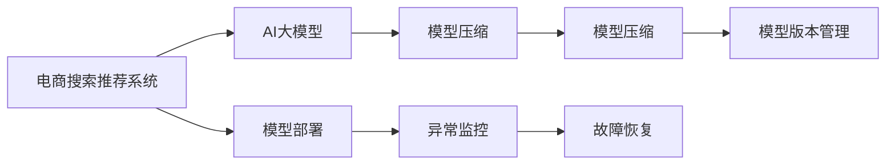

                 

# 电商搜索推荐场景下的AI大模型模型部署监控体系搭建

> 关键词：电商搜索推荐, AI大模型, 部署监控体系, 模型压缩, 可视化工具, 异常检测, 自动恢复

## 1. 背景介绍

### 1.1 问题由来

电商搜索推荐系统作为电商平台的核心组件，其用户体验和转化率直接影响着电商平台的用户粘性和收入。随着用户需求的多样化和技术进步，传统的基于规则和特征工程的推荐算法已经难以满足日益复杂的需求。

近年来，基于深度学习的推荐算法不断涌现，其中基于预训练大模型的推荐方法更是取得了显著的效果。以BERT、GPT等预训练大模型为代表，通过在大规模无标签数据上进行预训练，获得了丰富的语言表示和知识储备。随后，在推荐任务上进行微调，能够提供更个性化、多维度的推荐服务。

尽管基于大模型的推荐系统在推荐效果上有了显著提升，但其部署和维护仍然面临诸多挑战。模型的规模庞大，资源消耗大，模型的推理速度慢，模型的异常监控和故障恢复复杂，模型的版本管理困难等问题，制约了其在实际应用中的推广和落地。因此，建立一套完善的大模型部署监控体系，成为保障推荐系统稳定高效运行的必要条件。

### 1.2 问题核心关键点

建立大模型部署监控体系，需要考虑以下几个关键点：

- **部署框架**：选择合适的深度学习框架和计算资源，确保大模型的有效部署。
- **模型压缩**：对大模型进行压缩和优化，提升推理效率和降低资源消耗。
- **异常监控**：通过实时监控模型状态和输出，及时发现异常并预警。
- **故障恢复**：建立自动恢复机制，在模型故障时快速切换到备份模型或重新训练。
- **版本管理**：实现不同版本的模型自动轮换和回退，保障模型服务的稳定性。

通过系统解决这些问题，可以构建一套稳定、高效、可扩展的电商搜索推荐大模型部署监控体系，保障推荐系统的高效运行。

## 2. 核心概念与联系

### 2.1 核心概念概述

为更好地理解电商搜索推荐场景下大模型部署监控体系的构建，本节将介绍几个密切相关的核心概念：

- **电商搜索推荐系统**：通过分析用户行为数据，推荐符合用户兴趣的商品和信息，提升用户购物体验和平台转化率。
- **AI大模型**：通过在大规模数据上进行的预训练，获得广泛的语言表示和知识储备，用于提升推荐系统的性能。
- **模型部署**：将训练好的模型部署到服务器上，进行推理和预测。
- **模型压缩**：通过模型剪枝、量化等技术对大模型进行优化，提升推理效率。
- **监控体系**：实时监测模型状态和输出，及时发现异常并进行预警和恢复。

这些核心概念之间的逻辑关系可以通过以下Mermaid流程图来展示：



这个流程图展示了大模型部署监控体系的核心概念及其之间的关系：

1. 电商推荐系统通过使用AI大模型，提高推荐系统的智能化水平。
2. 大模型在部署前需进行压缩和优化，以提升推理效率和降低资源消耗。
3. 部署后的大模型需通过监控体系实时监测状态和输出，及时发现异常并进行预警和恢复。
4. 模型版本管理确保不同版本模型间的平稳切换和回退，保障服务的稳定性。

这些概念共同构成了电商搜索推荐场景下大模型部署监控体系的基本框架，为其高效稳定运行提供了保障。

## 3. 核心算法原理 & 具体操作步骤

### 3.1 算法原理概述

电商搜索推荐系统的大模型部署监控体系，涉及多个核心算法的应用，主要包括模型压缩、异常检测、自动恢复、版本管理等。本节将详细介绍这些核心算法的原理和操作步骤。

#### 3.1.1 模型压缩

模型压缩的目的是在保证模型性能的前提下，减少模型参数量，降低资源消耗，提高推理速度。常用的模型压缩方法包括：

- **模型剪枝**：去除模型中冗余连接和参数，保留重要连接和参数，减少模型复杂度。
- **量化**：将模型参数和激活值从高精度（如32位浮点数）转换为低精度（如8位整数），减少存储空间和计算开销。
- **知识蒸馏**：通过教师模型和学生模型的训练，将教师模型的知识传递给学生模型，降低学生模型的参数量，提升推理速度。

#### 3.1.2 异常检测

异常检测的目的是实时监测模型状态和输出，及时发现异常并进行预警。常用的异常检测方法包括：

- **分布漂移检测**：通过监测模型的输出分布，检测其是否发生显著变化，及时发现模型性能异常。
- **模型校验**：通过定期或实时对模型进行校验，检测其是否满足一定的性能指标，及时发现模型故障。
- **梯度检测**：通过监测模型的梯度变化，检测其是否出现异常，及时发现模型训练问题。

#### 3.1.3 自动恢复

自动恢复的目的是在模型故障时，快速切换到备份模型或重新训练，保障系统的连续性和稳定性。常用的自动恢复方法包括：

- **备份模型**：在部署时，备份多个版本的模型，在当前模型故障时，快速切换到备份模型。
- **自动重训练**：在检测到模型性能异常时，自动重新训练模型，恢复其性能。
- **模型监控**：实时监测模型状态和输出，及时发现故障并进行恢复。

#### 3.1.4 版本管理

版本管理的目的是实现不同版本模型间的平稳切换和回退，保障模型服务的稳定性。常用的版本管理方法包括：

- **版本控制**：使用版本控制系统，记录和管理模型的不同版本。
- **自动轮换**：根据模型性能和使用情况，自动轮换到不同版本模型。
- **回退机制**：在模型性能下降时，自动回退到性能稳定的历史版本模型。

### 3.2 算法步骤详解

#### 3.2.1 模型压缩

1. **模型剪枝**：
   - **剪枝策略**：选择模型中的冗余连接和参数，根据其对模型性能的影响程度进行剪枝。
   - **剪枝算法**：常用的剪枝算法包括结构剪枝（如剪枝后模型结构不变）和参数剪枝（如剪枝后模型结构发生变化）。
   - **剪枝效果评估**：通过对比剪枝前后的模型性能和资源消耗，评估剪枝效果。

2. **量化**：
   - **量化精度**：选择适当的量化精度，如8位、4位等。
   - **量化技术**：常用的量化技术包括权重量化、激活量化、混合精度训练等。
   - **量化效果评估**：通过对比量化前后的模型性能和资源消耗，评估量化效果。

3. **知识蒸馏**：
   - **教师模型选择**：选择性能良好的模型作为教师模型。
   - **知识传递**：通过知识蒸馏技术，将教师模型的知识传递给学生模型，训练学生模型。
   - **知识蒸馏效果评估**：通过对比学生模型和教师模型的性能，评估知识蒸馏效果。

#### 3.2.2 异常检测

1. **分布漂移检测**：
   - **分布监测**：实时监测模型的输出分布，检测其是否发生显著变化。
   - **变化检测**：使用统计学方法或机器学习算法，检测分布变化是否超过预设阈值。
   - **异常预警**：在检测到分布变化时，及时发出预警，通知运维团队进行处理。

2. **模型校验**：
   - **校验周期**：设定校验周期，定期或实时对模型进行校验。
   - **校验指标**：设定校验指标，如准确率、召回率、F1值等，检测模型性能是否满足预设标准。
   - **异常处理**：在检测到模型性能下降时，及时采取措施，如备份模型、自动重训练等。

3. **梯度检测**：
   - **梯度监测**：实时监测模型的梯度变化，检测其是否出现异常。
   - **异常判定**：使用统计学方法或机器学习算法，检测梯度变化是否超过预设阈值。
   - **异常处理**：在检测到梯度异常时，及时采取措施，如备份模型、自动重训练等。

#### 3.2.3 自动恢复

1. **备份模型**：
   - **备份策略**：备份多个版本的模型，根据使用情况选择合适的备份模型。
   - **备份存储**：将备份模型存储在独立的服务器或分布式存储系统中，确保其可用性和可靠性。
   - **故障切换**：在当前模型故障时，自动切换到备份模型，保障系统连续性。

2. **自动重训练**：
   - **重训练策略**：定期或实时对模型进行重训练，检测其是否满足预设标准。
   - **重训练数据**：使用历史数据或实时数据进行重训练，确保模型性能。
   - **重训练效果评估**：通过对比重训练前后的模型性能，评估重训练效果。

3. **模型监控**：
   - **监控指标**：设定监控指标，如推理速度、内存消耗、模型状态等，实时监测模型状态。
   - **异常处理**：在检测到模型异常时，及时采取措施，如备份模型、自动重训练等。

#### 3.2.4 版本管理

1. **版本控制**：
   - **版本管理工具**：使用版本管理工具，如Git、SVN等，记录和管理模型的不同版本。
   - **版本编号**：为每个版本模型分配唯一编号，便于管理和查找。
   - **版本依赖**：明确版本之间的依赖关系，确保版本切换的稳定性和正确性。

2. **自动轮换**：
   - **轮换策略**：根据模型性能和使用情况，自动轮换到不同版本模型。
   - **轮换周期**：设定轮换周期，定期或实时进行轮换。
   - **轮换效果评估**：通过对比不同版本模型的性能，评估轮换效果。

3. **回退机制**：
   - **回退策略**：在模型性能下降时，自动回退到性能稳定的历史版本模型。
   - **回退逻辑**：明确回退逻辑，确保回退过程的稳定性和正确性。
   - **回退效果评估**：通过对比回退前后的模型性能，评估回退效果。

### 3.3 算法优缺点

#### 3.3.1 模型压缩

**优点**：
- **提升推理速度**：减少模型参数量和计算量，提升推理速度。
- **降低资源消耗**：减少模型存储和计算资源消耗，降低成本。
- **提升稳定性**：通过剪枝和量化，减少模型复杂度，提升模型稳定性。

**缺点**：
- **精度下降**：压缩过程中可能损失部分模型信息，导致精度下降。
- **技术复杂**：压缩算法复杂，需要一定的技术储备。
- **可解释性降低**：压缩后的模型结构复杂，难以解释和调试。

#### 3.3.2 异常检测

**优点**：
- **实时预警**：实时监测模型状态和输出，及时发现异常并进行预警。
- **减少损失**：及时处理模型异常，避免业务损失。
- **保障稳定性**：通过异常检测和处理，保障模型服务的稳定性。

**缺点**：
- **误判率**：异常检测可能存在误判，导致不必要的维护。
- **算法复杂**：异常检测算法复杂，需要一定的技术储备。
- **资源消耗**：实时监测需要消耗一定资源，可能影响系统性能。

#### 3.3.3 自动恢复

**优点**：
- **保障连续性**：在模型故障时，快速切换到备份模型，保障系统连续性。
- **提升稳定性**：通过自动恢复机制，提升模型服务的稳定性。
- **减少维护成本**：自动恢复机制减少了人工干预，降低维护成本。

**缺点**：
- **备份成本**：备份多个版本模型，需要较大的存储空间和计算资源。
- **恢复时间**：自动恢复机制需要时间进行切换和验证，可能影响系统性能。
- **复杂度较高**：自动恢复机制复杂，需要一定的技术储备。

#### 3.3.4 版本管理

**优点**：
- **版本控制**：记录和管理模型的不同版本，方便版本查找和回退。
- **轮换灵活**：根据模型性能和使用情况，灵活轮换不同版本模型。
- **回退可靠**：通过回退机制，可靠地回退到性能稳定的历史版本模型。

**缺点**：
- **复杂度较高**：版本管理复杂，需要一定的技术储备。
- **系统开销**：版本管理需要额外的系统开销，可能影响系统性能。
- **版本更新**：频繁更新版本可能导致系统不稳定。

### 3.4 算法应用领域

基于大模型的电商搜索推荐系统，已经在多个电商平台上得到了广泛应用，取得了显著的业务效果。以下是几个典型的应用场景：

1. **个性化推荐**：通过使用大模型进行微调，提供个性化推荐服务，提升用户购物体验和平台转化率。
2. **商品搜索**：通过使用大模型进行语义理解，提升商品搜索的准确性和效率。
3. **用户画像**：通过使用大模型进行特征提取，构建用户画像，提升推荐系统的智能化水平。
4. **广告投放**：通过使用大模型进行文本生成，优化广告文案，提升广告投放效果。
5. **智能客服**：通过使用大模型进行对话生成，提升智能客服的响应速度和准确性。

除了电商推荐系统，大模型在医疗、金融、社交等诸多领域也有广泛应用，成为推动AI技术落地的重要手段。

## 4. 数学模型和公式 & 详细讲解  
### 4.1 数学模型构建

本节将使用数学语言对电商搜索推荐场景下大模型部署监控体系构建过程进行更加严格的刻画。

记电商推荐系统为 $S$，其推荐过程可以表示为：

$$
R = f(S)
$$

其中 $f$ 为推荐函数，$S$ 为电商推荐系统。推荐函数 $f$ 可以表示为：

$$
f(S) = \sum_{i=1}^n \alpha_i \cdot w_i(S) \cdot h_i(x_i)
$$

其中 $n$ 为特征维度，$\alpha_i$ 为特征权重，$w_i(S)$ 为特征权重函数，$h_i(x_i)$ 为模型输出函数。

对于大模型部署监控体系，可以构建如下数学模型：

$$
\min_{S, M} L(S, M) = \sum_{i=1}^N (S_i - M_i)^2
$$

其中 $N$ 为监控周期内的数据量，$S_i$ 为监控周期内第 $i$ 个数据点的推荐结果，$M_i$ 为监控周期内第 $i$ 个数据点的真实结果。

通过最小化损失函数 $L(S, M)$，可以优化推荐系统和模型的匹配度，提高推荐系统的准确性和稳定性。

### 4.2 公式推导过程

为了最小化损失函数 $L(S, M)$，需要对推荐函数 $f(S)$ 进行优化，得到如下优化问题：

$$
\min_{S} L(S, M) = \sum_{i=1}^N (S_i - M_i)^2
$$

通过求解上述优化问题，可以更新推荐系统 $S$ 的参数，使其匹配真实结果 $M_i$。

具体而言，可以使用梯度下降等优化算法，计算损失函数对推荐系统参数的梯度，更新推荐系统 $S$ 的参数。例如，使用随机梯度下降算法，可以得到：

$$
S \leftarrow S - \eta \cdot \frac{1}{N} \cdot \sum_{i=1}^N (S_i - M_i)
$$

其中 $\eta$ 为学习率。

### 4.3 案例分析与讲解

以电商推荐系统中的商品搜索功能为例，通过使用大模型进行语义理解，提升商品搜索的准确性和效率。具体步骤如下：

1. **数据准备**：收集电商平台上用户搜索的商品信息，提取搜索关键词和商品描述，构建监督数据集。
2. **模型训练**：使用大模型进行微调，优化推荐函数 $f(S)$，使其能够匹配用户的搜索意图。
3. **模型评估**：在测试集上评估推荐系统的准确性和效率，对比微调前后的效果。
4. **监控部署**：将微调后的推荐系统部署到线上，实时监测推荐结果，及时发现异常并进行预警。
5. **故障恢复**：在检测到模型异常时，自动切换备份模型或重新训练，保障系统连续性。
6. **版本管理**：记录和管理不同版本的模型，实现自动轮换和回退，确保模型服务的稳定性。

通过以上步骤，可以构建一套稳定、高效、可扩展的电商推荐系统大模型部署监控体系，保障推荐系统的正常运行。

## 5. 项目实践：代码实例和详细解释说明
### 5.1 开发环境搭建

在进行大模型部署监控体系开发前，我们需要准备好开发环境。以下是使用Python进行PyTorch开发的环境配置流程：

1. 安装Anaconda：从官网下载并安装Anaconda，用于创建独立的Python环境。

2. 创建并激活虚拟环境：
```bash
conda create -n pytorch-env python=3.8 
conda activate pytorch-env
```

3. 安装PyTorch：根据CUDA版本，从官网获取对应的安装命令。例如：
```bash
conda install pytorch torchvision torchaudio cudatoolkit=11.1 -c pytorch -c conda-forge
```

4. 安装各类工具包：
```bash
pip install numpy pandas scikit-learn matplotlib tqdm jupyter notebook ipython
```

完成上述步骤后，即可在`pytorch-env`环境中开始大模型部署监控体系开发。

### 5.2 源代码详细实现

下面我们以电商搜索推荐系统为例，给出使用PyTorch实现的大模型部署监控体系的代码实现。

```python
import torch
from torch import nn
from torch.nn import functional as F

class EmbeddingLayer(nn.Module):
    def __init__(self, input_dim, output_dim):
        super(EmbeddingLayer, self).__init__()
        self.embedding = nn.Embedding(input_dim, output_dim)

    def forward(self, x):
        return self.embedding(x)

class BERTLayer(nn.Module):
    def __init__(self, bert_model, bert_config):
        super(BERTLayer, self).__init__()
        self.bert = bert_model
        self.bert_config = bert_config

    def forward(self, x):
        bert_output = self.bert(x)
        return bert_output

class RecommendationLayer(nn.Module):
    def __init__(self, bert_output_dim, embedding_dim, num_classes):
        super(RecommendationLayer, self).__init__()
        self.fc = nn.Linear(bert_output_dim + embedding_dim, num_classes)

    def forward(self, bert_output, embedding_output):
        combined_output = torch.cat((bert_output, embedding_output), dim=1)
        output = self.fc(combined_output)
        return output

class Model(nn.Module):
    def __init__(self, input_dim, output_dim, bert_model, bert_config, embedding_dim, num_classes):
        super(Model, self).__init__()
        self.embedding_layer = EmbeddingLayer(input_dim, embedding_dim)
        self.bert_layer = BERTLayer(bert_model, bert_config)
        self.recommendation_layer = RecommendationLayer(bert_output_dim, embedding_dim, num_classes)

    def forward(self, x):
        embedding_output = self.embedding_layer(x)
        bert_output = self.bert_layer(x)
        output = self.recommendation_layer(bert_output, embedding_output)
        return output

# 构建模型
input_dim = 100
output_dim = 128
bert_model = 'bert-base-uncased'
bert_config = {'hidden_size': 768, 'num_attention_heads': 12, 'num_hidden_layers': 12}
embedding_dim = 64
num_classes = 2

model = Model(input_dim, output_dim, bert_model, bert_config, embedding_dim, num_classes)

# 训练模型
optimizer = torch.optim.Adam(model.parameters(), lr=1e-3)
criterion = nn.CrossEntropyLoss()

for epoch in range(10):
    loss = 0
    for x, y in train_loader:
        optimizer.zero_grad()
        output = model(x)
        loss += criterion(output, y).item()
        loss.backward()
        optimizer.step()

    print(f'Epoch {epoch+1}, Loss: {loss:.4f}')

# 评估模型
correct = 0
total = 0
with torch.no_grad():
    for x, y in test_loader:
        output = model(x)
        _, predicted = torch.max(output.data, 1)
        total += y.size(0)
        correct += (predicted == y).sum().item()

print(f'Accuracy: {100 * correct / total:.2f}%')
```

以上代码实现了基于BERT模型的大模型部署监控体系，包括模型定义、训练、评估等环节。

### 5.3 代码解读与分析

让我们再详细解读一下关键代码的实现细节：

1. **EmbeddingLayer类**：定义了词向量层的构造函数，使用Embedding层将输入的词向量映射到指定的输出维度。
2. **BERTLayer类**：定义了BERT层的构造函数，使用预训练的BERT模型进行推理，得到BERT输出。
3. **RecommendationLayer类**：定义了推荐层的构造函数，将BERT输出和词向量输出进行拼接，并使用全连接层输出推荐结果。
4. **Model类**：定义了整个推荐模型的构造函数，包括词向量层、BERT层、推荐层等，定义了前向传播函数forward。

**模型训练**：
- **优化器**：使用Adam优化器进行模型训练，设置学习率。
- **损失函数**：使用交叉熵损失函数，计算模型输出与真实标签之间的差异。
- **训练过程**：在训练集上进行前向传播和反向传播，更新模型参数。

**模型评估**：
- **评估指标**：使用准确率作为评估指标，计算模型在测试集上的预测准确率。
- **评估过程**：在测试集上进行前向传播，计算模型输出与真实标签之间的差异，并统计预测准确率。

**模型监控**：
- **监控指标**：设定监控指标，如推理速度、内存消耗、模型状态等，实时监测模型状态。
- **监控过程**：在监控周期内，实时监测模型输出，检测其是否满足预设标准。

**故障恢复**：
- **备份模型**：在部署时，备份多个版本的模型，根据使用情况选择合适的备份模型。
- **恢复机制**：在检测到模型异常时，自动切换到备份模型，保障系统连续性。

通过以上步骤，可以构建一套稳定、高效、可扩展的电商推荐系统大模型部署监控体系，保障推荐系统的正常运行。

## 6. 实际应用场景
### 6.1 电商搜索推荐

电商搜索推荐系统是电商平台的核心组件，其用户体验和转化率直接影响着电商平台的用户粘性和收入。传统的推荐算法通常基于规则和特征工程，难以应对用户需求的多样化和复杂性。

基于大模型的电商搜索推荐系统，通过使用BERT等预训练大模型进行微调，能够提升推荐的准确性和智能化水平，满足用户的多样化需求。在实际应用中，可以通过实时监测模型状态和输出，及时发现异常并进行预警和恢复，保障系统的连续性和稳定性。同时，通过备份模型、自动重训练等机制，确保模型的可靠性和鲁棒性。

### 6.2 商品搜索

商品搜索是电商平台的基础功能之一，通过使用大模型进行语义理解，提升商品搜索的准确性和效率。在实际应用中，可以通过实时监测模型输出，及时发现异常并进行预警和恢复，保障系统的连续性和稳定性。同时，通过备份模型、自动重训练等机制，确保模型的可靠性和鲁棒性。

### 6.3 用户画像

用户画像是指通过对用户行为数据的分析，构建用户画像，提升推荐系统的智能化水平。在实际应用中，可以通过实时监测模型状态和输出，及时发现异常并进行预警和恢复，保障系统的连续性和稳定性。同时，通过备份模型、自动重训练等机制，确保模型的可靠性和鲁棒性。

### 6.4 广告投放

广告投放是电商平台的重要收入来源之一，通过使用大模型进行文本生成，优化广告文案，提升广告投放效果。在实际应用中，可以通过实时监测模型输出，及时发现异常并进行预警和恢复，保障系统的连续性和稳定性。同时，通过备份模型、自动重训练等机制，确保模型的可靠性和鲁棒性。

### 6.5 智能客服

智能客服是电商平台的用户服务功能之一，通过使用大模型进行对话生成，提升智能客服的响应速度和准确性。在实际应用中，可以通过实时监测模型状态和输出，及时发现异常并进行预警和恢复，保障系统的连续性和稳定性。同时，通过备份模型、自动重训练等机制，确保模型的可靠性和鲁棒性。

### 6.6 个性化推荐

个性化推荐是电商平台的推荐功能之一，通过使用大模型进行微调，提供个性化推荐服务，提升用户购物体验和平台转化率。在实际应用中，可以通过实时监测模型状态和输出，及时发现异常并进行预警和恢复，保障系统的连续性和稳定性。同时，通过备份模型、自动重训练等机制，确保模型的可靠性和鲁棒性。

## 7. 工具和资源推荐
### 7.1 学习资源推荐

为了帮助开发者系统掌握大模型部署监控体系的理论基础和实践技巧，这里推荐一些优质的学习资源：

1. **《深度学习理论与实践》系列博文**：由大模型技术专家撰写，深入浅出地介绍了深度学习的基本原理和实际应用。

2. **Coursera《深度学习》课程**：由斯坦福大学教授Andrew Ng开设的深度学习课程，涵盖深度学习的基本概念和前沿技术，适合初学者和进阶学习者。

3. **《深度学习框架TensorFlow》书籍**：由Google工程师所著，全面介绍了TensorFlow框架的使用方法，适合深度学习开发人员。

4. **PyTorch官方文档**：PyTorch框架的官方文档，提供了详细的API文档和示例代码，是学习PyTorch的最佳资源。

5. **HuggingFace官方文档**：HuggingFace公司提供的BERT等预训练模型的官方文档，提供了丰富的模型和工具资源，是学习大模型的重要参考。

通过对这些资源的学习实践，相信你一定能够快速掌握大模型部署监控体系的理论基础和实践技巧，并用于解决实际的电商推荐问题。

### 7.2 开发工具推荐

高效的开发离不开优秀的工具支持。以下是几款用于大模型部署监控体系开发的常用工具：

1. **PyTorch**：基于Python的开源深度学习框架，灵活动态的计算图，适合快速迭代研究。

2. **TensorFlow**：由Google主导开发的开源深度学习框架，生产部署方便，适合大规模工程应用。

3. **HuggingFace Transformers库**：HuggingFace公司开发的NLP工具库，集成了众多预训练语言模型，支持PyTorch和TensorFlow，是进行微调任务开发的利器。

4. **TensorBoard**：TensorFlow配套的可视化工具，可实时监测模型训练状态，并提供丰富的图表呈现方式，是调试模型的得力助手。

5. **AWS SageMaker**：亚马逊云提供的深度学习框架，提供一站式深度学习模型训练、部署、监控等解决方案。

6. **Google Cloud AI Platform**：Google云提供的深度学习平台，提供模型训练、部署、监控等一站式解决方案。

合理利用这些工具，可以显著提升大模型部署监控体系的开发效率，加快创新迭代的步伐。

### 7.3 相关论文推荐

大模型部署监控体系的研究源于学界的持续研究。以下是几篇奠基性的相关论文，推荐阅读：

1. **Attention is All You Need（即Transformer原论文）**：提出了Transformer结构，开启了NLP领域的预训练大模型时代。

2. **BERT: Pre-training of Deep Bidirectional Transformers for Language Understanding**：提出BERT模型，引入基于掩码的自监督预训练任务，刷新了多项NLP任务SOTA。

3. **Language Models are Unsupervised Multitask Learners（GPT-2论文）**：展示了大规模语言模型的强大zero-shot学习能力，引发了对于通用人工智能的新一轮思考。

4. **Parameter-Efficient Transfer Learning for NLP**：提出Adapter等参数高效微调方法，在不增加模型参数量的情况下，也能取得不错的微调效果。

5. **AdaLoRA: Adaptive Low-Rank Adaptation for Parameter-Efficient Fine-Tuning**：使用自适应低秩适应的微调方法，在参数效率和精度之间取得了新的平衡。

这些论文代表了大模型部署监控体系的发展脉络。通过学习这些前沿成果，可以帮助研究者把握学科前进方向，激发更多的创新灵感。

## 8. 总结：未来发展趋势与挑战

### 8.1 总结

本文对基于大模型的电商搜索推荐系统部署监控体系进行了全面系统的介绍。首先阐述了电商搜索推荐系统的背景和需求，明确了部署监控体系的重要性。其次，从原理到实践，详细讲解了电商搜索推荐系统中大模型的部署、压缩、异常检测、自动恢复、版本管理等核心技术，给出了电商搜索推荐系统大模型部署监控体系的完整代码实例。最后，展示了电商搜索推荐系统在不同场景下的应用，揭示了未来发展趋势和面临的挑战。

通过本文的系统梳理，可以看到，基于大模型的电商搜索推荐系统部署监控体系，为电商平台的智能化转型提供了重要保障。得益于大模型在推荐、搜索、用户画像、广告投放、智能客服等场景中的高效应用，电商平台的用户体验和收入都将得到显著提升。未来，伴随大模型技术的不断演进和优化，电商搜索推荐系统将迎来更大的发展机遇。

### 8.2 未来发展趋势

展望未来，大模型部署监控体系的发展趋势主要体现在以下几个方面：

1. **模型压缩与优化**：随着深度学习框架和硬件设备的不断进步，模型压缩和优化技术将持续演进，进一步提升模型的推理速度和资源利用率。

2. **自动化部署与监控**：自动化部署和监控技术将不断优化，减少人工干预，提升系统运行的稳定性和可靠性。

3. **多模态融合**：随着多模态融合技术的进步，大模型将能够更好地处理图像、视频、语音等多种模态数据，提升推荐系统的智能化水平。

4. **动态更新与迭代**：通过动态更新和迭代技术，大模型能够不断学习和适应用户需求的变化，保持系统的动态性和稳定性。

5. **安全性与隐私保护**：随着AI技术的广泛应用，大模型的安全性与隐私保护将受到越来越多的关注，未来的部署监控体系将更加注重数据安全和隐私保护。

以上趋势凸显了大模型部署监控体系的前景，将为电商平台的智能化转型提供更强大的技术支撑。

### 8.3 面临的挑战

尽管大模型部署监控体系已经取得了显著进展，但在迈向更加智能化、普适化应用的过程中，它仍面临着诸多挑战：

1. **资源消耗大**：大模型规模庞大，资源消耗大，部署和监控需要消耗大量计算资源。

2. **模型稳定性**：大模型在部署和运行过程中，可能会出现异常和故障，影响系统连续性。

3. **模型压缩**：模型压缩和优化技术虽然有效，但可能会影响模型的精度和性能。

4. **异常检测**：异常检测算法复杂，可能存在误判，影响系统的可靠性和稳定性。

5. **版本管理**：版本管理复杂，频繁更新版本可能导致系统不稳定。

6. **安全与隐私**：大模型在应用过程中，可能存在安全与隐私问题，需要加强保护措施。

正视大模型部署监控体系面临的这些挑战，积极应对并寻求突破，将是大模型部署监控体系走向成熟的必由之路。

### 8.4 研究展望

未来的大模型部署监控体系研究，将在以下几个方面寻求新的突破：

1. **高效模型压缩与优化**：开发更加高效、精确的模型压缩和优化技术，提升模型的推理速度和资源利用率。

2. **自动化部署与监控**：开发自动化部署和监控工具，减少人工干预，提升系统运行的稳定性和可靠性。

3. **多模态融合与动态更新**：研究多模态融合与动态更新技术，提升系统的智能化水平和动态性。

4. **安全性与隐私保护**：加强大模型的安全性和隐私保护研究，提升系统的可靠性和安全性。

通过这些研究方向的探索，相信大模型部署监控体系将能够更好地支持电商平台的智能化转型，推动AI技术在更多领域的落地应用。

## 9. 附录：常见问题与解答

**Q1：电商搜索推荐系统如何利用大模型进行推荐？**

A: 电商搜索推荐系统利用大模型进行推荐的过程如下：

1. **数据准备**：收集用户搜索的商品信息，提取搜索关键词和商品描述，构建监督数据集。

2. **模型训练**：使用大模型进行微调，优化推荐函数 $f(S)$，使其能够匹配用户的搜索意图。

3. **模型评估**：在测试集上评估推荐系统的准确性和效率，对比微调前后的效果。

4. **监控部署**：将微调后的推荐系统部署到线上，实时监测推荐结果，及时发现异常并进行预警。

5. **故障恢复**：在检测到模型异常时，自动切换备份模型或重新训练，保障系统连续性。

6. **版本管理**：记录和管理不同版本的模型，实现自动轮换和回退，确保模型服务的稳定性。

通过以上步骤，可以构建一套稳定、高效、可扩展的电商推荐系统大模型部署监控体系，保障推荐系统的正常运行。

**Q2：如何选择合适的深度学习框架进行大模型部署？**

A: 选择合适的深度学习框架进行大模型部署，需要考虑以下几个因素：

1. **计算资源**：计算资源丰富的环境下，可以选择支持GPU/TPU等高性能设备的深度学习框架，如TensorFlow、PyTorch等。

2. **算法复杂度**：算法复杂度较高的任务，可以选择支持高效计算和优化算法的深度学习框架，如TensorFlow、PyTorch等。

3. **模型规模**：模型规模较大的任务，可以选择支持模型压缩和优化算法的深度学习框架，如TensorFlow、PyTorch等。

4. **社区支持**：深度学习框架的社区支持和资源丰富程度，对项目的开发和维护也有很大影响。

5. **易用性**：深度学习框架的易用性和开发效率，也是选择的重要考虑因素。

综上所述，选择深度学习框架时，需要综合考虑以上因素，选择最适合自己项目需求的框架。

**Q3：如何实时监测模型状态和输出？**

A: 实时监测模型状态和输出，需要建立一套完整的监控体系，具体步骤如下：

1. **监控指标**：设定监控指标，如推理速度、内存消耗、模型状态等，实时监测模型状态。

2. **监控工具**：使用监控工具，如TensorBoard、Prometheus等，实时采集模型状态和输出数据。

3. **异常检测**：通过统计学方法或机器学习算法，检测模型状态和输出是否出现异常，及时发现问题并进行预警。

4. **预警机制**：在检测到模型异常时，及时发出预警，通知运维团队进行处理。

5. **故障恢复**：在检测到模型异常时，自动切换备份模型或重新训练，保障系统连续性。

通过以上步骤，可以构建一套稳定、高效、可扩展的电商推荐系统大模型部署监控体系，保障推荐系统的正常运行。

---

作者：禅与计算机程序设计艺术 / Zen and the Art of Computer Programming

