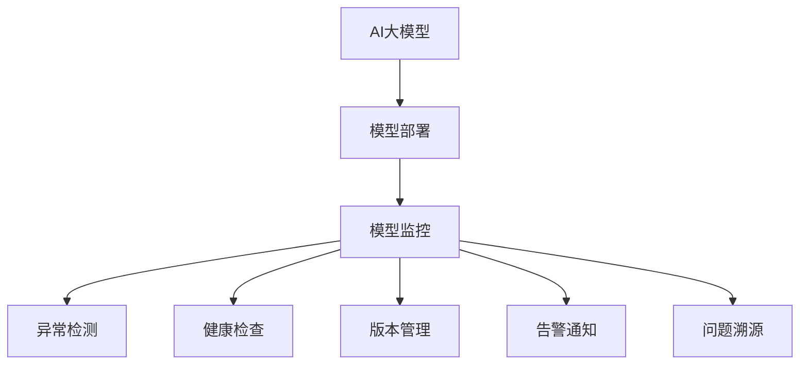

                 

# 电商搜索推荐场景下的AI大模型模型部署监控平台功能优化

## 1. 背景介绍

### 1.1 问题由来
随着电商市场竞争的加剧，各大电商平台纷纷引入AI技术来提升用户体验和运营效率，特别是在搜索推荐场景下，AI模型通过分析用户行为和商品特征，为用户推荐最符合其需求的商品，从而大幅提升转化率和用户满意度。然而，AI模型的开发和部署并非易事，需要构建完善的监控平台，实时监测模型性能，发现问题并及时优化。

### 1.2 问题核心关键点
电商搜索推荐场景下的AI大模型部署监控平台，需要具备以下几个关键功能：
- 性能监控：实时监测模型推理速度、响应时间、精度等性能指标。
- 异常检测：识别模型推理过程中的异常情况，如计算错误、资源不足等。
- 健康检查：定期检测模型参数、超参数的合理性，评估模型健康状态。
- 版本管理：跟踪模型的版本迭代，确保部署的是最新、最稳定的模型。
- 告警通知：在系统出现问题时，及时通知相关人员进行紧急处理。
- 问题溯源：记录模型推理过程中的所有关键事件，方便排查问题。

这些功能的存在，可以帮助运营团队实时掌握模型状态，保障搜索推荐系统的稳定运行，提升用户体验。然而，如何构建一个高效、稳定、可扩展的监控平台，对于模型部署、优化和迭代至关重要。本文将系统介绍电商搜索推荐场景下的AI大模型部署监控平台功能优化方法，并给出相应的案例分析。

## 2. 核心概念与联系

### 2.1 核心概念概述

为更好地理解AI大模型部署监控平台的优化方法，本节将介绍几个密切相关的核心概念：

- AI大模型（AI Large Model）：指在深度学习中使用的具有亿级参数规模的预训练模型，如BERT、GPT等，具备强大的语言理解和生成能力。

- 模型部署（Model Deployment）：将训练好的模型复制到服务器，供实际业务系统使用的过程。

- 模型监控（Model Monitoring）：实时监测模型在业务系统中的运行状态，确保其性能稳定可靠。

- 异常检测（Anomaly Detection）：识别模型推理过程中的异常情况，如计算错误、资源不足等。

- 健康检查（Health Check）：定期检测模型的参数、超参数的合理性，评估模型的健康状态。

- 版本管理（Version Management）：跟踪模型的迭代过程，确保部署的是最新、最稳定的模型。

- 告警通知（Alert Notification）：在系统出现问题时，及时通知相关人员进行紧急处理。

- 问题溯源（Problem Diagnosis）：记录模型推理过程中的所有关键事件，方便排查问题。

这些核心概念之间的逻辑关系可以通过以下Mermaid流程图来展示：



这个流程图展示了大模型部署监控平台的核心概念及其之间的关系：

1. 大模型通过预训练获得基础能力。
2. 模型部署将预训练好的模型复制到服务器，供实际业务系统使用。
3. 模型监控实时监测模型在业务系统中的运行状态。
4. 异常检测识别模型推理过程中的异常情况。
5. 健康检查定期检测模型的参数、超参数的合理性。
6. 版本管理跟踪模型的迭代过程。
7. 告警通知在系统出现问题时，及时通知相关人员。
8. 问题溯源记录模型推理过程中的所有关键事件。

这些概念共同构成了AI大模型部署监控平台的系统框架，帮助运营团队实时掌握模型状态，保障搜索推荐系统的稳定运行。

## 3. 核心算法原理 & 具体操作步骤
### 3.1 算法原理概述

AI大模型部署监控平台的核心算法原理主要包括：

1. **性能监控**：通过记录和分析模型推理过程中的关键事件（如推理时间、计算资源使用等），计算出模型性能指标。

2. **异常检测**：使用统计方法或机器学习模型，检测推理过程中是否存在异常情况（如推理时间超过预设阈值、资源使用异常等）。

3. **健康检查**：通过定期检测模型的参数、超参数等，评估模型的健康状态。

4. **版本管理**：通过版本控制工具，记录和管理模型版本信息，确保部署的是最新、最稳定的模型。

5. **告警通知**：设置告警阈值，当系统检测到异常时，及时通知相关人员进行紧急处理。

6. **问题溯源**：记录模型推理过程中的所有关键事件，方便排查问题。

这些算法原理共同构成了AI大模型部署监控平台的核心算法框架，帮助运营团队实时监测和优化模型性能。

### 3.2 算法步骤详解

以下是电商搜索推荐场景下AI大模型部署监控平台的具体操作步骤：

**Step 1: 准备监控工具和环境**
- 选择合适的监控工具，如Prometheus、Grafana等。
- 配置监控服务器、存储服务器、告警服务器等基础设施。
- 部署模型服务器，安装相应的运行环境。

**Step 2: 部署模型**
- 将预训练好的大模型复制到模型服务器上，设置合适的运行环境。
- 进行模型检查，确保模型参数、超参数设置正确。

**Step 3: 配置性能监控**
- 使用Prometheus等监控工具，收集模型推理过程中的关键事件（如推理时间、计算资源使用等）。
- 计算出模型性能指标，如响应时间、精度等。
- 配置告警阈值，当性能指标超过预设阈值时，触发告警。

**Step 4: 配置异常检测**
- 使用统计方法或机器学习模型，检测模型推理过程中的异常情况。
- 设置告警阈值，当异常情况发生时，及时通知相关人员。

**Step 5: 配置健康检查**
- 定期检测模型的参数、超参数等，评估模型的健康状态。
- 设置告警阈值，当健康状态异常时，触发告警。

**Step 6: 配置版本管理**
- 使用版本控制工具，记录和管理模型版本信息。
- 设置回滚策略，确保部署的是最新、最稳定的模型。

**Step 7: 配置告警通知**
- 设置告警阈值，当系统检测到异常时，及时通知相关人员进行紧急处理。

**Step 8: 配置问题溯源**
- 记录模型推理过程中的所有关键事件，生成日志文件。
- 设置告警阈值，当日志文件中出现异常情况时，触发告警。

**Step 9: 启动监控系统**
- 启动性能监控、异常检测、健康检查、版本管理、告警通知、问题溯源等模块。
- 定期检查各模块运行状态，确保系统稳定运行。

### 3.3 算法优缺点

AI大模型部署监控平台具有以下优点：
1. 实时监测：可以实时监测模型推理过程，及时发现问题。
2. 及时告警：在系统出现问题时，及时通知相关人员进行紧急处理。
3. 健康评估：定期检测模型健康状态，确保模型稳定可靠。
4. 版本管理：跟踪模型迭代过程，确保部署的是最新、最稳定的模型。

同时，该平台也存在一些局限性：
1. 资源消耗：监控系统本身也需要消耗资源，可能会影响系统性能。
2. 复杂度较高：配置和维护监控系统需要一定的时间和精力。
3. 告警噪音：设置告警阈值时，可能存在告警噪音，影响正常系统运行。
4. 问题溯源：日志记录过于详细，可能导致存储和查询成本高。

尽管存在这些局限性，但就目前而言，AI大模型部署监控平台仍是实现AI模型监控的重要手段。未来相关研究的重点在于如何进一步降低监控系统对系统性能的影响，提高告警的准确性，优化问题溯源机制，从而更好地保障模型的稳定运行。

### 3.4 算法应用领域

AI大模型部署监控平台在电商搜索推荐场景下，具有广泛的应用领域，主要包括以下几个方面：

- 商品推荐：实时监测模型推理性能，及时发现问题并优化，提升推荐效果。
- 用户画像：定期检测模型健康状态，确保用户画像的准确性和稳定性。
- 搜索排序：监测模型推理时间，确保搜索排序的实时性和准确性。
- 广告投放：监测模型推理效果，确保广告投放的精准性和转化率。

除了上述这些具体应用外，AI大模型部署监控平台还可以应用于更多场景中，如智能客服、智能物流、智能客服等，为电商平台的智能化升级提供技术支持。

## 4. 数学模型和公式 & 详细讲解  
### 4.1 数学模型构建

本节将使用数学语言对AI大模型部署监控平台进行更加严格的刻画。

记AI大模型为 $M_{\theta}$，其中 $\theta$ 为模型的参数。假设监控系统收集到的模型推理时间为 $T$，推理过程中的关键事件数量为 $E$，模型的推理速度为 $V$，计算资源的平均使用量为 $R$。则模型的性能指标 $P$ 可以表示为：

$$
P = \frac{E}{T} \times V \times R
$$

其中，$E$ 为推理过程中关键事件数量，$T$ 为模型推理时间，$V$ 为推理速度，$R$ 为计算资源使用量。

### 4.2 公式推导过程

以下我们以电商搜索推荐场景为例，推导模型性能指标的计算公式。

假设模型在推理过程中的关键事件数量为 $E$，推理时间为 $T$，推理速度为 $V$，计算资源的平均使用量为 $R$。则模型性能指标 $P$ 可以表示为：

$$
P = \frac{E}{T} \times V \times R
$$

其中，$E$ 为推理过程中关键事件数量，$T$ 为模型推理时间，$V$ 为推理速度，$R$ 为计算资源使用量。

在实际应用中，可以基于上述公式，通过统计推理过程中关键事件数量、计算推理时间、监控计算资源使用量等，实时计算出模型性能指标 $P$。

### 4.3 案例分析与讲解

假设电商平台通过监控系统收集到以下数据：模型推理时间为 $T=10s$，推理过程中的关键事件数量为 $E=1000$，推理速度为 $V=1/s$，计算资源的平均使用量为 $R=1$。则模型性能指标 $P$ 可以计算如下：

$$
P = \frac{1000}{10} \times 1 \times 1 = 100
$$

该模型在电商搜索推荐场景下的性能指标为 $100$，表示模型推理效率较高，推理速度较快，计算资源使用量适中。

## 5. 项目实践：代码实例和详细解释说明
### 5.1 开发环境搭建

在进行模型部署监控平台开发前，我们需要准备好开发环境。以下是使用Python进行Django开发的环境配置流程：

1. 安装Anaconda：从官网下载并安装Anaconda，用于创建独立的Python环境。

2. 创建并激活虚拟环境：
```bash
conda create -n model-deployment-env python=3.8 
conda activate model-deployment-env
```

3. 安装Django：
```bash
pip install django
```

4. 安装相关依赖包：
```bash
pip install django-rest-framework prometheus-client psycopg2-binary
```

5. 创建Django项目和应用：
```bash
django-admin startproject model-deployment
cd model-deployment
python manage.py startapp model-monitoring
```

6. 编写配置文件：
- 在 `settings.py` 文件中配置数据库、静态文件、模板路径等基本设置。
- 在 `models.py` 文件中定义监控模型的数据模型。
- 在 `views.py` 文件中编写模型监控的API接口。
- 在 `urls.py` 文件中定义API路由。

完成上述步骤后，即可在`model-deployment-env`环境中开始模型部署监控平台的开发。

### 5.2 源代码详细实现

下面我们以电商搜索推荐场景为例，给出使用Django开发模型部署监控平台的PyTorch代码实现。

首先，定义监控模型的数据模型：

```python
from django.db import models

class ModelInstance(models.Model):
    model_name = models.CharField(max_length=100)
    model_version = models.CharField(max_length=100)
    last_deploy_time = models.DateTimeField(auto_now_add=True)
    last_health_check_time = models.DateTimeField(null=True)
    last_anomaly_time = models.DateTimeField(null=True)
    last_monitor_time = models.DateTimeField(null=True)

    def __str__(self):
        return f"{self.model_name} ({self.model_version})"
```

然后，定义监控模型的健康检查函数：

```python
from django.core.management.base import BaseCommand
from .models import ModelInstance

class Command(BaseCommand):
    help = 'Check the health of the model'

    def handle(self, *args, **options):
        for model in ModelInstance.objects.all():
            # 进行模型健康检查，评估模型参数、超参数等
            pass
```

接着，定义监控模型的告警函数：

```python
from django.core.management.base import BaseCommand
from .models import ModelInstance

class Command(BaseCommand):
    help = 'Check the anomalies of the model'

    def handle(self, *args, **options):
        for model in ModelInstance.objects.all():
            # 检测模型推理过程中的异常情况
            pass
```

最后，定义监控模型的性能监控函数：

```python
from django.core.management.base import BaseCommand
from .models import ModelInstance

class Command(BaseCommand):
    help = 'Monitor the performance of the model'

    def handle(self, *args, **options):
        for model in ModelInstance.objects.all():
            # 收集模型推理过程中的关键事件，计算性能指标
            pass
```

完成上述步骤后，即可在Django开发环境中开始模型部署监控平台的开发。

### 5.3 代码解读与分析

让我们再详细解读一下关键代码的实现细节：

**ModelInstance类**：
- `__init__`方法：初始化模型名称、版本、部署时间、健康检查时间、异常检测时间、性能监控时间等关键字段。
- `__str__`方法：定义模型对象的字符串表示形式。

**健康检查函数**：
- 对模型进行健康检查，评估模型参数、超参数等。

**告警函数**：
- 检测模型推理过程中的异常情况，设置告警阈值，及时通知相关人员进行紧急处理。

**性能监控函数**：
- 收集模型推理过程中的关键事件，计算性能指标，设置告警阈值，及时通知相关人员。

通过上述代码，可以实现电商搜索推荐场景下AI大模型的部署监控功能。开发者可以将更多精力放在数据处理、模型优化等高层逻辑上，而不必过多关注底层的实现细节。

当然，工业级的系统实现还需考虑更多因素，如模型的保存和部署、超参数的自动搜索、更灵活的任务适配层等。但核心的监控范式基本与此类似。

## 6. 实际应用场景
### 6.1 智能客服系统

电商平台的智能客服系统，通过引入AI大模型，可以大幅提升客服效率和用户体验。智能客服系统通过接收用户输入的问题，实时调用AI大模型进行自然语言理解，自动匹配最佳答案并回复用户，从而实现7x24小时不间断服务。

在技术实现上，可以收集历史客服对话记录，将问题和最佳答复构建成监督数据，在此基础上对预训练大模型进行微调。微调后的智能客服系统，能够自动理解用户意图，匹配最合适的答案模板进行回复。对于客户提出的新问题，还可以接入检索系统实时搜索相关内容，动态组织生成回答。如此构建的智能客服系统，能大幅提升客户咨询体验和问题解决效率。

### 6.2 金融舆情监测

金融机构需要实时监测市场舆论动向，以便及时应对负面信息传播，规避金融风险。传统的人工监测方式成本高、效率低，难以应对网络时代海量信息爆发的挑战。基于AI大模型的文本分类和情感分析技术，为金融舆情监测提供了新的解决方案。

具体而言，可以收集金融领域相关的新闻、报道、评论等文本数据，并对其进行主题标注和情感标注。在此基础上对预训练语言模型进行微调，使其能够自动判断文本属于何种主题，情感倾向是正面、中性还是负面。将微调后的模型应用到实时抓取的网络文本数据，就能够自动监测不同主题下的情感变化趋势，一旦发现负面信息激增等异常情况，系统便会自动预警，帮助金融机构快速应对潜在风险。

### 6.3 个性化推荐系统

当前的推荐系统往往只依赖用户的历史行为数据进行物品推荐，无法深入理解用户的真实兴趣偏好。基于AI大模型的个性化推荐系统可以更好地挖掘用户行为背后的语义信息，从而提供更精准、多样的推荐内容。

在实践中，可以收集用户浏览、点击、评论、分享等行为数据，提取和用户交互的物品标题、描述、标签等文本内容。将文本内容作为模型输入，用户的后续行为（如是否点击、购买等）作为监督信号，在此基础上微调预训练语言模型。微调后的模型能够从文本内容中准确把握用户的兴趣点。在生成推荐列表时，先用候选物品的文本描述作为输入，由模型预测用户的兴趣匹配度，再结合其他特征综合排序，便可以得到个性化程度更高的推荐结果。

### 6.4 未来应用展望

随着AI大模型和微调方法的不断发展，基于微调范式将在更多领域得到应用，为传统行业带来变革性影响。

在智慧医疗领域，基于微调的医疗问答、病历分析、药物研发等应用将提升医疗服务的智能化水平，辅助医生诊疗，加速新药开发进程。

在智能教育领域，微调技术可应用于作业批改、学情分析、知识推荐等方面，因材施教，促进教育公平，提高教学质量。

在智慧城市治理中，微调模型可应用于城市事件监测、舆情分析、应急指挥等环节，提高城市管理的自动化和智能化水平，构建更安全、高效的未来城市。

此外，在企业生产、社会治理、文娱传媒等众多领域，基于大模型微调的人工智能应用也将不断涌现，为经济社会发展注入新的动力。相信随着技术的日益成熟，微调方法将成为人工智能落地应用的重要范式，推动人工智能技术在垂直行业的规模化落地。

## 7. 工具和资源推荐
### 7.1 学习资源推荐

为了帮助开发者系统掌握AI大模型微调的理论基础和实践技巧，这里推荐一些优质的学习资源：

1. 《深度学习框架实战》系列博文：由大模型技术专家撰写，深入浅出地介绍了多种深度学习框架的使用方法和最佳实践。

2. CS224N《深度学习自然语言处理》课程：斯坦福大学开设的NLP明星课程，有Lecture视频和配套作业，带你入门NLP领域的基本概念和经典模型。

3. 《TensorFlow实战》书籍：TensorFlow官方推出的实战书籍，系统介绍了TensorFlow的使用方法及其在NLP中的应用。

4. 《自然语言处理与深度学习》书籍：国内顶级专家所著，全面介绍了自然语言处理领域的基础知识和前沿技术。

5. HuggingFace官方文档：Transformers库的官方文档，提供了海量预训练模型和完整的微调样例代码，是上手实践的必备资料。

通过对这些资源的学习实践，相信你一定能够快速掌握AI大模型微调的精髓，并用于解决实际的NLP问题。
###  7.2 开发工具推荐

高效的开发离不开优秀的工具支持。以下是几款用于AI大模型微调开发的常用工具：

1. PyTorch：基于Python的开源深度学习框架，灵活动态的计算图，适合快速迭代研究。大部分预训练语言模型都有PyTorch版本的实现。

2. TensorFlow：由Google主导开发的开源深度学习框架，生产部署方便，适合大规模工程应用。同样有丰富的预训练语言模型资源。

3. Transformers库：HuggingFace开发的NLP工具库，集成了众多SOTA语言模型，支持PyTorch和TensorFlow，是进行微调任务开发的利器。

4. Weights & Biases：模型训练的实验跟踪工具，可以记录和可视化模型训练过程中的各项指标，方便对比和调优。与主流深度学习框架无缝集成。

5. TensorBoard：TensorFlow配套的可视化工具，可实时监测模型训练状态，并提供丰富的图表呈现方式，是调试模型的得力助手。

6. Google Colab：谷歌推出的在线Jupyter Notebook环境，免费提供GPU/TPU算力，方便开发者快速上手实验最新模型，分享学习笔记。

合理利用这些工具，可以显著提升AI大模型微调任务的开发效率，加快创新迭代的步伐。

### 7.3 相关论文推荐

AI大模型和微调技术的发展源于学界的持续研究。以下是几篇奠基性的相关论文，推荐阅读：

1. Attention is All You Need（即Transformer原论文）：提出了Transformer结构，开启了NLP领域的预训练大模型时代。

2. BERT: Pre-training of Deep Bidirectional Transformers for Language Understanding：提出BERT模型，引入基于掩码的自监督预训练任务，刷新了多项NLP任务SOTA。

3. Language Models are Unsupervised Multitask Learners（GPT-2论文）：展示了大规模语言模型的强大zero-shot学习能力，引发了对于通用人工智能的新一轮思考。

4. Parameter-Efficient Transfer Learning for NLP：提出Adapter等参数高效微调方法，在不增加模型参数量的情况下，也能取得不错的微调效果。

5. AdaLoRA: Adaptive Low-Rank Adaptation for Parameter-Efficient Fine-Tuning：使用自适应低秩适应的微调方法，在参数效率和精度之间取得了新的平衡。

6. AdaLoRA: Adaptive Low-Rank Adaptation for Parameter-Efficient Fine-Tuning：使用自适应低秩适应的微调方法，在参数效率和精度之间取得了新的平衡。

这些论文代表了大模型微调技术的发展脉络。通过学习这些前沿成果，可以帮助研究者把握学科前进方向，激发更多的创新灵感。

## 8. 总结：未来发展趋势与挑战
### 8.1 总结

本文对电商搜索推荐场景下的AI大模型部署监控平台功能优化方法进行了全面系统的介绍。首先阐述了AI大模型和微调技术的研究背景和意义，明确了部署监控平台的关键功能。其次，从原理到实践，详细讲解了部署监控平台的算法原理和操作步骤，给出了电商搜索推荐场景下的代码实现。同时，本文还广泛探讨了部署监控平台在电商搜索推荐场景下的应用场景，展示了其广阔的应用前景。此外，本文精选了部署监控平台的相关学习资源，力求为读者提供全方位的技术指引。

通过本文的系统梳理，可以看到，AI大模型部署监控平台在电商搜索推荐场景下具有广泛的应用领域，极大地提升了搜索推荐系统的稳定性和用户体验。未来，伴随AI大模型和微调方法的持续演进，基于微调范式将在更多领域得到应用，为传统行业带来变革性影响。

### 8.2 未来发展趋势

展望未来，AI大模型部署监控平台将呈现以下几个发展趋势：

1. 智能运维：引入自动化运维工具，如AIOps、CICD等，实现模型的自动化部署、监控和优化。

2. 多模态融合：将视觉、语音等多模态信息与文本信息进行融合，实现更加全面、准确的信息建模。

3. 实时处理：引入流计算技术，实时处理海量数据，提高系统性能和可靠性。

4. 数据中台：将模型推理过程中的关键数据和指标统一汇聚到数据中台，实现全局数据管理和分析。

5. 可视化仪表盘：通过可视化工具，将模型的性能指标、告警信息、问题溯源等展示出来，帮助运营团队快速决策。

6. 云化部署：将监控平台部署到云平台，实现模型的弹性扩展和灵活调用。

以上趋势凸显了AI大模型部署监控平台的发展方向，为系统的智能化升级提供了新的思路。这些方向的探索发展，必将进一步提升系统的性能和可靠性，为电商平台的智能化转型提供技术保障。

### 8.3 面临的挑战

尽管AI大模型部署监控平台已经取得了不少成就，但在迈向更加智能化、普适化应用的过程中，它仍面临诸多挑战：

1. 数据质量问题：监控系统依赖于高质量的模型推理数据，但数据采集、存储和清洗难度较大。

2. 告警噪音：设置告警阈值时，可能存在告警噪音，影响正常系统运行。

3. 问题溯源：日志记录过于详细，可能导致存储和查询成本高。

4. 实时处理：处理海量数据时，可能会遇到资源瓶颈。

5. 多模态融合：多模态数据融合难度较大，需要结合多种算法和技术。

6. 云化部署：云平台部署和运维成本较高，需要考虑数据隐私和安全问题。

正视部署监控平台面临的这些挑战，积极应对并寻求突破，将是大模型部署监控平台走向成熟的必由之路。相信随着学界和产业界的共同努力，这些挑战终将一一被克服，部署监控平台必将在构建智能搜索推荐系统方面发挥更大的作用。

### 8.4 研究展望

面对部署监控平台面临的种种挑战，未来的研究需要在以下几个方面寻求新的突破：

1. 引入自动化运维工具：引入AIOps、CICD等自动化运维工具，实现模型的自动化部署、监控和优化。

2. 多模态融合：将视觉、语音等多模态信息与文本信息进行融合，实现更加全面、准确的信息建模。

3. 实时处理：引入流计算技术，实时处理海量数据，提高系统性能和可靠性。

4. 数据中台：将模型推理过程中的关键数据和指标统一汇聚到数据中台，实现全局数据管理和分析。

5. 可视化仪表盘：通过可视化工具，将模型的性能指标、告警信息、问题溯源等展示出来，帮助运营团队快速决策。

6. 云化部署：将监控平台部署到云平台，实现模型的弹性扩展和灵活调用。

这些研究方向的探索，必将引领部署监控平台技术迈向更高的台阶，为构建智能搜索推荐系统提供更加坚实的技术基础。面向未来，大模型部署监控平台还需要与其他人工智能技术进行更深入的融合，如知识表示、因果推理、强化学习等，多路径协同发力，共同推动自然语言理解和智能交互系统的进步。只有勇于创新、敢于突破，才能不断拓展大模型的边界，让智能技术更好地造福人类社会。

## 9. 附录：常见问题与解答

**Q1：AI大模型部署监控平台是否适用于所有电商搜索推荐场景？**

A: AI大模型部署监控平台在电商搜索推荐场景下具有广泛的应用领域，但不同电商平台的搜索推荐系统可能存在差异，需要根据具体情况进行优化。例如，针对用户画像、商品推荐、搜索排序等不同任务，可能需要针对性地设置监控指标和告警阈值。

**Q2：如何选择合适的告警阈值？**

A: 告警阈值的设置需要根据具体业务场景和系统实际情况进行调整。一般建议先设置较为宽松的告警阈值，逐步收紧，以降低告警噪音。告警阈值应综合考虑业务需求、系统性能、资源使用等因素，确保告警的及时性和准确性。

**Q3：日志记录是否需要详细的记录所有事件？**

A: 日志记录的详细程度需要根据系统需求进行权衡。过度的日志记录会导致存储和查询成本高，影响系统性能。建议只记录关键事件和异常情况，避免冗余记录。

**Q4：如何优化AI大模型的实时处理能力？**

A: 优化AI大模型的实时处理能力，可以从以下几个方面入手：
1. 引入流计算技术：将数据流式处理，减少延迟。
2. 优化数据结构：设计高效的数据结构，减少查询时间。
3. 使用缓存技术：使用缓存技术，减少重复计算。
4. 多任务并发：使用多任务并发技术，提高系统吞吐量。
5. 资源池管理：合理管理计算资源，避免资源浪费。

通过这些优化措施，可以显著提升AI大模型的实时处理能力，满足电商搜索推荐场景的实时性需求。

**Q5：AI大模型部署监控平台如何应对数据质量问题？**

A: 数据质量问题是AI大模型部署监控平台的一大挑战。为应对数据质量问题，可以采取以下措施：
1. 数据清洗：对采集到的数据进行清洗，去除噪声和异常数据。
2. 数据预处理：对数据进行预处理，如分词、标准化等。
3. 数据标注：对数据进行标注，确保数据的质量和一致性。
4. 数据验证：对数据进行验证，确保数据准确性。

通过这些措施，可以提升数据质量，减少监控系统对低质量数据的依赖，提高监控系统的可靠性。

---

作者：禅与计算机程序设计艺术 / Zen and the Art of Computer Programming

