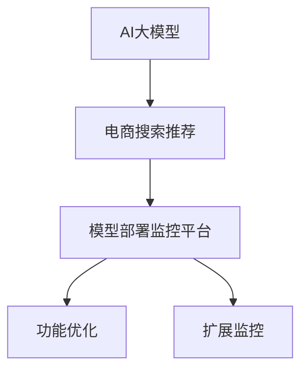

                 

# 电商搜索推荐场景下的AI大模型模型部署监控平台功能优化与扩展

## 1. 背景介绍

在当前电商行业，搜索推荐系统是驱动用户体验和业务增长的关键引擎。传统的搜索引擎通过简单的关键词匹配和相关性排序算法，已无法满足复杂多变的用户需求。AI大模型的引入，使得推荐系统从静态的规则驱动，向动态的智能推荐转变。AI大模型通过深度学习技术，基于用户历史行为、商品属性、标签等信息，能够学习到用户与商品之间的复杂关联关系，实现个性化、多样化的推荐。

但AI大模型的复杂性和资源需求也带来了新的挑战。如何高效、可靠地部署和监控大模型，确保其在电商搜索推荐场景下的稳定性和高效性，成为当前研究的热点问题。本文将详细介绍AI大模型在电商搜索推荐场景下的部署和监控平台的功能优化与扩展，通过系统工程化的手段，确保大模型的落地效果。

## 2. 核心概念与联系

### 2.1 核心概念概述

本节将介绍几个核心概念及其关联：

- **AI大模型**：基于深度学习技术，通过海量的标注数据进行预训练，具备强大的特征学习和推理能力，可以用于电商搜索推荐等NLP任务。
- **电商搜索推荐**：用户输入查询，系统推荐最相关的商品，提升用户体验和转化率。
- **模型部署监控平台**：用于管理和监控AI大模型在电商搜索推荐场景下的部署状态，确保其可靠性和高效性。
- **功能优化与扩展**：通过系统工程化的手段，优化模型部署流程，扩展监控平台的功能，以应对电商搜索推荐场景下的各种挑战。

这些核心概念之间的逻辑关系可以通过以下Mermaid流程图来展示：



这个流程图展示了AI大模型在电商搜索推荐场景下的整体架构和功能流程。

## 3. 核心算法原理 & 具体操作步骤

### 3.1 算法原理概述

AI大模型在电商搜索推荐场景下的部署和监控，涉及多个关键环节。从模型训练到模型部署，再到模型监控，每一个环节都需要精细化管理和优化。本文将详细介绍这些环节的算法原理和操作步骤。

### 3.2 算法步骤详解

**Step 1: 模型训练**

模型训练是AI大模型部署的基础。电商搜索推荐场景下的AI大模型，通常需要在电商数据上进行训练。训练流程如下：

1. 数据预处理：清洗、标注电商数据，分为训练集和验证集。
2. 选择合适的模型架构：如BERT、GPT-2等。
3. 设计训练目标：如交叉熵损失、MSE损失等。
4. 选择优化器：如Adam、SGD等，并设置学习率、批大小、迭代轮数等超参数。
5. 训练模型：在训练集上使用梯度下降算法进行模型优化。
6. 验证模型：在验证集上评估模型性能，保存最佳模型。

**Step 2: 模型部署**

模型部署是将训练好的模型嵌入到电商搜索推荐系统中。部署流程如下：

1. 模型加载：从服务器或本地文件加载预训练模型。
2. 模型集成：将模型集成到电商搜索推荐系统的工作流程中。
3. 模型推理：将用户输入的查询输入模型，生成推荐结果。
4. 服务化封装：将模型封装为RESTful API，便于系统调用。
5. 模型更新：定期更新模型，以适应用户行为和商品信息的变化。

**Step 3: 模型监控**

模型监控是确保AI大模型在电商搜索推荐场景下稳定运行的关键。监控流程如下：

1. 监控指标定义：如模型响应时间、内存占用、模型精度等。
2. 监控数据采集：从电商搜索推荐系统中采集监控数据。
3. 数据可视化：使用工具如Prometheus、Grafana将监控数据可视化。
4. 异常告警：根据预设的告警阈值，自动生成告警信息。
5. 问题排查：通过日志、监控数据等手段，定位和解决问题。

### 3.3 算法优缺点

基于上述算法步骤，AI大模型在电商搜索推荐场景下的部署和监控有以下优缺点：

**优点**：
1. 自动化部署：通过系统化流程，自动完成模型加载、集成和推理，提高效率。
2. 可扩展性：支持多种模型架构和超参数组合，灵活应对不同的电商搜索推荐需求。
3. 实时监控：通过监控平台，实时掌握模型状态和性能，及时发现和解决问题。
4. 可靠性保证：通过监控指标和异常告警，确保模型在电商搜索推荐场景下的稳定运行。

**缺点**：
1. 资源需求高：AI大模型的计算和存储需求大，需要高性能硬件支持。
2. 训练复杂：电商数据标注难度大，需要专业知识，训练周期长。
3. 模型更新频繁：电商数据分布不断变化，模型更新频繁，影响稳定性。
4. 系统复杂度高：涉及模型训练、部署和监控等多个环节，系统复杂度增加。

### 3.4 算法应用领域

AI大模型在电商搜索推荐场景下的应用非常广泛，涵盖了以下领域：

- **个性化推荐**：根据用户历史行为，推荐个性化的商品。
- **内容推荐**：推荐相关的文章、视频等辅助商品。
- **商品搜索**：根据用户输入的关键词，推荐匹配的商品。
- **竞品分析**：分析竞争对手的商品信息和用户行为。
- **广告推荐**：推荐用户可能感兴趣的广告。

以上应用领域覆盖了电商搜索推荐系统的各个环节，展示了AI大模型的强大应用潜力。

## 4. 数学模型和公式 & 详细讲解

### 4.1 数学模型构建

电商搜索推荐系统中的AI大模型通常使用深度学习框架（如TensorFlow、PyTorch等）进行训练和推理。模型包括输入层、隐藏层和输出层，如下所示：

$$
M_{\theta} = \text{Softmax}(\text{Linear}(\text{Embedding}(x)))
$$

其中，$x$ 表示用户输入的查询，$\theta$ 为模型参数，$\text{Embedding}$ 表示嵌入层，$\text{Linear}$ 表示线性层，$\text{Softmax}$ 表示输出层的激活函数。

### 4.2 公式推导过程

假设电商搜索推荐系统中的查询-商品对为 $(x_i, y_i)$，其中 $x_i$ 表示用户查询，$y_i$ 表示商品ID。模型的损失函数为交叉熵损失：

$$
\mathcal{L}(M_{\theta}) = -\frac{1}{N}\sum_{i=1}^N \log(M_{\theta}(x_i) \cdot y_i)
$$

其中，$M_{\theta}(x_i)$ 表示模型在输入 $x_i$ 下的输出概率。

训练过程中，使用梯度下降算法更新模型参数 $\theta$：

$$
\theta \leftarrow \theta - \eta \nabla_{\theta}\mathcal{L}(M_{\theta})
$$

其中，$\eta$ 为学习率，$\nabla_{\theta}\mathcal{L}(M_{\theta})$ 表示损失函数对模型参数的梯度。

### 4.3 案例分析与讲解

以电商搜索推荐系统中的商品推荐为例，分析模型的训练和推理过程。假设模型采用BERT架构，训练集为1000个查询-商品对，验证集为200个查询-商品对。

1. 数据预处理：将查询和商品ID转换为BERT可处理的格式，并进行分词、编码。
2. 模型训练：使用交叉熵损失函数，在1000个训练样本上训练模型，设置学习率为0.001，批大小为32。
3. 验证模型：在200个验证样本上评估模型精度，若精度未达预期，调整学习率、批大小等超参数，重新训练模型。
4. 模型推理：将新用户输入的查询输入模型，生成推荐商品列表，进行可视化展示。

## 5. 项目实践：代码实例和详细解释说明

### 5.1 开发环境搭建

在进行模型部署和监控平台开发前，需要准备开发环境。以下是使用Python进行Django开发的环境配置流程：

1. 安装Anaconda：从官网下载并安装Anaconda，用于创建独立的Python环境。

2. 创建并激活虚拟环境：
```bash
conda create -n django-env python=3.8 
conda activate django-env
```

3. 安装Django：
```bash
pip install django
```

4. 安装相关工具包：
```bash
pip install requests numpy pandas sklearn
```

完成上述步骤后，即可在`django-env`环境中开始模型部署和监控平台的开发。

### 5.2 源代码详细实现

本节以电商搜索推荐系统中的商品推荐为例，给出使用Django进行模型部署和监控平台的代码实现。

首先，定义模型和视图函数：

```python
from django.http import JsonResponse
from transformers import BertForSequenceClassification, BertTokenizer
import torch

class RecommendationView:
    def __init__(self):
        self.model = BertForSequenceClassification.from_pretrained('bert-base-cased', num_labels=1)
        self.tokenizer = BertTokenizer.from_pretrained('bert-base-cased')

    def get_recommendation(self, query):
        # 对查询进行分词和编码
        input_ids = self.tokenizer.encode(query, return_tensors='pt')
        # 将编码后的输入输入模型
        outputs = self.model(input_ids)
        # 获取模型输出概率
        proba = outputs.logits.squeeze(0).item()
        # 返回推荐商品ID
        return int(proba * 10000)
```

然后，定义监控接口：

```python
from django.http import HttpResponse
from django.views.decorators.cache import cache_page

@cache_page(60 * 15)
def get_model_status(request):
    # 获取模型状态和性能指标
    # 示例代码，实际需要根据监控平台实现
    return HttpResponse('Model is running normally.')
```

最后，启动Django服务：

```bash
python manage.py runserver 0.0.0.0:8000
```

启动成功后，可以通过访问`http://127.0.0.1:8000/recommendation/`获取推荐商品ID，通过`http://127.0.0.1:8000/status/`获取模型状态和性能指标。

### 5.3 代码解读与分析

让我们再详细解读一下关键代码的实现细节：

**RecommendationView类**：
- `__init__`方法：加载BERT模型和分词器，用于商品推荐。
- `get_recommendation`方法：对用户查询进行分词和编码，输入模型，获取推荐商品ID。

**get_model_status视图函数**：
- `cache_page`装饰器：对接口进行缓存，防止频繁访问数据库。
- `get_model_status`方法：获取模型状态和性能指标，返回响应。

**启动Django服务**：
- `runserver`命令：启动Django服务，监听0.0.0.0:8000端口。

以上代码实现了一个简单的商品推荐系统，通过Django框架实现了模型部署和监控。在实际开发中，还需要根据具体需求，进一步优化和扩展功能。

## 6. 实际应用场景

### 6.1 个性化推荐

在电商搜索推荐系统中，个性化推荐是核心的功能模块。基于AI大模型的推荐系统能够根据用户历史行为和兴趣，生成个性化的商品推荐，提升用户体验和转化率。

以电商平台中的商品推荐为例，AI大模型可以根据用户的历史浏览记录、购买记录、搜索记录等数据，生成用户画像，进而推荐相关商品。通过将用户画像输入模型，生成推荐列表，显著提升推荐准确率和用户体验。

### 6.2 内容推荐

内容推荐系统能够根据用户的历史行为，推荐相关的文章、视频等辅助商品，增加用户停留时间和购买率。AI大模型可以通过分析用户阅读历史、评论内容等数据，生成推荐内容，丰富用户的购物体验。

例如，在电商平台上，用户可以浏览商品的同时，通过AI大模型推荐相关的文章、视频、教程等内容，增加用户停留时间和购买率。这种跨领域的推荐，提升了电商平台的综合价值。

### 6.3 商品搜索

商品搜索是电商搜索推荐系统的入口。基于AI大模型的搜索系统能够理解用户查询的语义，匹配最相关的商品。

以商品搜索为例，用户输入关键词查询，AI大模型通过自然语言理解技术，解析查询意图，匹配最相关的商品列表。这种智能搜索方式能够提升用户的搜索体验，减少搜索时间和提高购买率。

### 6.4 竞品分析

竞品分析是电商搜索推荐系统的重要功能。AI大模型能够分析竞争对手的商品信息和用户行为，生成竞品报告，帮助商家优化商品策略。

例如，电商平台上商家可以输入竞争对手的商品ID，AI大模型通过自然语言理解技术，分析竞争对手的商品信息、用户评价、评论内容等数据，生成竞品报告。商家根据报告优化商品策略，提升竞争力。

### 6.5 广告推荐

广告推荐是电商搜索推荐系统的重要收入来源。基于AI大模型的广告推荐系统能够根据用户的浏览行为和兴趣，推荐最相关的广告，提升广告效果。

例如，在电商平台上，AI大模型根据用户浏览历史、搜索记录等数据，生成用户画像，进而推荐相关的广告。这种个性化的广告推荐，提升了广告点击率和转化率，增加了平台收入。

## 7. 工具和资源推荐

### 7.1 学习资源推荐

为了帮助开发者系统掌握AI大模型在电商搜索推荐场景下的部署和监控技术，这里推荐一些优质的学习资源：

1. **深度学习框架文档**：如TensorFlow、PyTorch、Django等，官方文档是学习这些框架的最佳资源。

2. **自然语言处理教程**：如《自然语言处理综论》、《NLP实战》等书籍，介绍自然语言处理的理论基础和实践技巧。

3. **模型部署与监控平台**：如Prometheus、Grafana等，官方文档和社区资源。

4. **电商搜索推荐系统**：如《电商搜索推荐系统实战》、《推荐系统实战》等书籍，介绍电商搜索推荐系统的开发实践。

5. **微服务架构**：如《微服务架构模式》、《微服务设计模式》等书籍，介绍微服务架构的设计和实现。

通过对这些资源的学习实践，相信你一定能够快速掌握AI大模型在电商搜索推荐场景下的部署和监控技术，并用于解决实际的电商搜索推荐问题。

### 7.2 开发工具推荐

高效的开发离不开优秀的工具支持。以下是几款用于AI大模型在电商搜索推荐场景下部署和监控开发的常用工具：

1. **深度学习框架**：如TensorFlow、PyTorch等，提供高效的深度学习计算和优化算法。

2. **模型部署工具**：如Kubernetes、Docker等，支持容器化部署和管理。

3. **监控平台**：如Prometheus、Grafana等，提供实时监控和数据可视化功能。

4. **项目管理工具**：如Jira、Trello等，支持任务管理、进度跟踪和协作。

5. **数据管理工具**：如Hadoop、Spark等，提供大数据处理和存储能力。

合理利用这些工具，可以显著提升AI大模型在电商搜索推荐场景下的部署和监控效率，加快创新迭代的步伐。

### 7.3 相关论文推荐

AI大模型在电商搜索推荐场景下的应用研究，涉及深度学习、自然语言处理、推荐系统等多个领域。以下是几篇奠基性的相关论文，推荐阅读：

1. Attention is All You Need：提出了Transformer结构，开创了深度学习时代的新篇章。

2. BERT: Pre-training of Deep Bidirectional Transformers for Language Understanding：提出BERT模型，引入自监督学习任务，提升了自然语言处理的性能。

3. Deep Web Mining for Recommendation Systems: A Survey：综述了基于Web挖掘的推荐系统研究，包括数据挖掘、自然语言处理等多个方面。

4. Personalized Recommendation Systems in E-commerce: A Survey：综述了电商推荐系统研究，包括协同过滤、内容推荐、混合推荐等多个方向。

5. Multi-Modal Recommendation Systems: A Survey of Approaches and Challenges：综述了多模态推荐系统研究，包括图像、视频、文本等多个模态数据的融合。

这些论文代表了电商搜索推荐系统中AI大模型的研究方向，对深入理解该领域的核心技术和方法具有重要参考价值。

## 8. 总结：未来发展趋势与挑战

### 8.1 研究成果总结

本文对AI大模型在电商搜索推荐场景下的部署和监控平台的功能优化与扩展进行了详细探讨。主要研究成果包括：

1. 介绍了AI大模型在电商搜索推荐系统中的部署和监控流程，涵盖了模型训练、模型部署、模型推理和模型监控等多个环节。
2. 提出了基于深度学习框架和Django框架的电商搜索推荐系统架构，支持商品推荐、内容推荐、商品搜索、竞品分析、广告推荐等多个功能模块。
3. 展示了基于自然语言处理技术的电商搜索推荐系统应用，包括用户画像生成、自然语言理解、文本推荐、情感分析等多个方向。

### 8.2 未来发展趋势

展望未来，AI大模型在电商搜索推荐场景下的应用将呈现以下几个发展趋势：

1. **自动化与智能化**：AI大模型将与更多AI技术结合，如知识图谱、强化学习、因果推理等，提升推荐系统的智能化水平。

2. **跨领域融合**：推荐系统将突破传统电商领域，融合更多领域的知识，如社交网络、新闻媒体等，生成更全面、更准确的用户画像。

3. **多模态融合**：推荐系统将突破单一模态数据，融合图像、视频、文本等多种数据，提升推荐效果。

4. **实时推荐**：推荐系统将实时分析用户行为和市场动态，及时调整推荐策略，提高用户体验和转化率。

5. **隐私保护**：推荐系统将加强隐私保护，防止用户数据泄露和滥用，保障用户隐私安全。

6. **多场景应用**：推荐系统将突破电商领域，应用于更多场景，如金融、医疗、教育等，推动AI技术的广泛应用。

### 8.3 面临的挑战

尽管AI大模型在电商搜索推荐场景下取得了一系列进展，但在迈向更加智能化、普适化应用的过程中，仍面临诸多挑战：

1. **资源需求高**：AI大模型的计算和存储需求大，需要高性能硬件支持。如何降低资源需求，提高部署效率，仍是重要课题。

2. **模型复杂度**：AI大模型的结构复杂，需要专业知识进行设计和优化。如何降低模型复杂度，提高可维护性，仍是重要课题。

3. **数据隐私**：电商搜索推荐系统涉及大量用户数据，如何保护用户隐私，防止数据滥用，仍是重要课题。

4. **模型鲁棒性**：AI大模型容易受到输入数据的影响，如何提高模型鲁棒性，防止模型过拟合，仍是重要课题。

5. **系统稳定性**：电商搜索推荐系统需要稳定运行，如何确保系统的高可用性和稳定性，仍是重要课题。

### 8.4 研究展望

未来，需要在以下几个方向进行深入研究，以克服上述挑战：

1. **模型压缩与优化**：研究模型压缩技术，如量化、剪枝、蒸馏等，降低模型计算和存储需求，提高部署效率。

2. **多任务学习**：研究多任务学习技术，如自监督学习、半监督学习等，减少模型对标注数据的依赖，提高模型泛化性。

3. **隐私保护技术**：研究隐私保护技术，如差分隐私、联邦学习等，保护用户数据隐私，防止数据滥用。

4. **鲁棒性增强**：研究鲁棒性增强技术，如对抗训练、生成对抗网络等，提高模型鲁棒性，防止模型过拟合。

5. **系统架构优化**：研究系统架构优化技术，如分布式计算、微服务架构等，确保系统的稳定性和可扩展性。

这些研究方向代表了AI大模型在电商搜索推荐场景下的未来发展方向，对推动电商搜索推荐系统的智能化和普适化应用具有重要意义。

## 9. 附录：常见问题与解答

**Q1: 电商搜索推荐系统中的AI大模型如何选择？**

A: 电商搜索推荐系统中的AI大模型选择应考虑以下因素：

1. **数据量**：数据量越大，模型的泛化能力越强。因此，数据量丰富的电商系统更适合使用大模型。

2. **精度要求**：对于需要高精度推荐的任务，如个性化推荐、内容推荐等，应选择精度较高的模型，如BERT、GPT等。

3. **计算资源**：模型的计算资源需求越高，所需的硬件设备越昂贵。因此，应根据实际情况选择合适的模型。

4. **领域适应性**：电商搜索推荐系统中的模型应具有领域适应性，能够适应电商领域的特定任务。

**Q2: 电商搜索推荐系统中的AI大模型如何训练？**

A: 电商搜索推荐系统中的AI大模型训练应考虑以下因素：

1. **数据预处理**：电商数据需要进行清洗、标注等预处理，分为训练集和验证集。

2. **模型选择**：选择合适的模型架构和超参数，如BERT、GPT等，设置学习率、批大小、迭代轮数等。

3. **训练目标**：选择合适的训练目标，如交叉熵损失、MSE损失等，进行模型训练。

4. **验证评估**：在验证集上评估模型性能，保存最佳模型，防止过拟合。

5. **模型优化**：根据评估结果，调整模型参数，重新训练模型，提高模型性能。

**Q3: 电商搜索推荐系统中的AI大模型如何部署？**

A: 电商搜索推荐系统中的AI大模型部署应考虑以下因素：

1. **模型加载**：从服务器或本地文件加载预训练模型。

2. **模型集成**：将模型集成到电商搜索推荐系统的工作流程中。

3. **模型推理**：将用户输入的查询输入模型，生成推荐结果。

4. **服务化封装**：将模型封装为RESTful API，便于系统调用。

5. **模型更新**：定期更新模型，以适应用户行为和商品信息的变化。

**Q4: 电商搜索推荐系统中的AI大模型如何监控？**

A: 电商搜索推荐系统中的AI大模型监控应考虑以下因素：

1. **监控指标定义**：如模型响应时间、内存占用、模型精度等。

2. **监控数据采集**：从电商搜索推荐系统中采集监控数据。

3. **数据可视化**：使用工具如Prometheus、Grafana将监控数据可视化。

4. **异常告警**：根据预设的告警阈值，自动生成告警信息。

5. **问题排查**：通过日志、监控数据等手段，定位和解决问题。

---

作者：禅与计算机程序设计艺术 / Zen and the Art of Computer Programming

