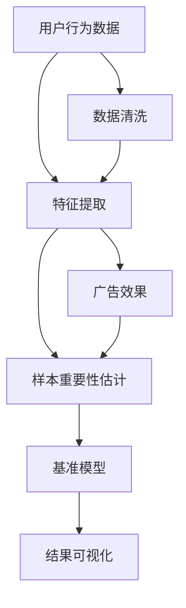

                 

# 电商搜索推荐效果优化中的AI大模型样本重要性估计benchmark

## 1. 背景介绍

### 1.1 问题由来

随着人工智能技术的飞速发展，电子商务平台的搜索推荐系统变得越来越智能和精准。然而，尽管搜索推荐系统在用户满意度上有所提升，但对于广告主而言，其点击率和转化率却往往不尽如人意。在电商平台，广告主投入大量预算以获得点击和购买，却由于推荐的商品与用户的实际需求不符，造成了巨大的资源浪费。

因此，如何更有效地衡量搜索推荐系统的广告效果，并提升广告转化率，是电商广告主和平台运营商共同面临的挑战。本文聚焦于使用AI大模型进行样本重要性估计（Sample Importance Estimation），旨在通过更精细化的用户行为分析，优化电商搜索推荐系统的广告投放效果。

### 1.2 问题核心关键点

在进行样本重要性估计时，关键在于准确衡量样本对总体效果的影响。在电商平台，样本通常指用户点击或浏览过的商品、广告或网页。通过建立样本与效果之间的数学模型，利用AI大模型对用户行为进行建模和预测，可以更有效地识别和优化影响效果的关键因素。

具体来说，样本重要性估计需要考虑以下关键点：
1. 用户行为的多样性：不同用户的行为模式、兴趣偏好和消费习惯各异。
2. 广告效果的动态性：广告效果随着时间、市场环境等因素的变化而变化。
3. 点击和转化的多维度因素：用户点击行为可能包含多种动机，如价格敏感、品牌偏好等，转化则涉及支付流程、商品可用性等复杂因素。
4. 模型的可解释性和可调性：样本重要性估计模型需要具备良好的可解释性和可调性，以便于业务人员理解和调整。

## 2. 核心概念与联系

### 2.1 核心概念概述

在电商搜索推荐系统中，样本重要性估计（Sample Importance Estimation, SIE）指的是评估不同样本（如广告展示、商品浏览、购买行为）对总体效果（如广告点击率、转化率）的影响程度。通过SIE，可以识别出对总体效果影响最大的样本，从而有针对性地优化广告投放策略，提升广告转化率。

为了实现SIE，本文将引入以下核心概念：
1. 用户行为数据（User Behavior Data）：包括用户点击、浏览、购买等行为数据。
2. 广告效果（Advertising Effect）：指用户点击或转化的行为数据。
3. AI大模型（AI Large Model）：如BERT、GPT等大规模预训练语言模型，用于从用户行为中提取特征和规律。
4. 样本重要性（Sample Importance）：指用户行为对广告效果的贡献程度。
5. 基准模型（Benchmark Model）：用于评估不同样本重要性的统计或机器学习模型。

### 2.2 核心概念原理和架构的 Mermaid 流程图



上述流程图中的各个节点含义如下：
- A: 用户行为数据，包括点击、浏览、购买等行为数据。
- B: 数据清洗，去除噪声数据和异常值，确保数据质量。
- C: 特征提取，利用AI大模型提取用户行为的关键特征。
- D: 广告效果，即用户点击或转化的行为数据。
- E: 样本重要性估计，评估用户行为对广告效果的贡献。
- F: 基准模型，用于评估样本重要性的统计或机器学习模型。
- G: 结果可视化，展示不同样本的重要性排序。

## 3. 核心算法原理 & 具体操作步骤

### 3.1 算法原理概述

样本重要性估计的核心算法基于机器学习和统计学原理，通过分析用户行为与广告效果之间的关系，建立模型预测不同样本对广告效果的影响。具体来说，可以采用以下几种算法：

1. 决策树（Decision Tree）：通过对用户行为和广告效果的特征进行分割，建立树状结构，从而预测不同样本的重要性。
2. 随机森林（Random Forest）：通过构建多棵决策树并取平均值，减少模型的方差，提高预测精度。
3. 梯度提升（Gradient Boosting）：通过迭代提升模型，逐步修正预测误差，优化模型性能。
4. 神经网络（Neural Network）：利用AI大模型进行特征提取和预测，进一步提升模型的泛化能力。

这些算法都可以用于样本重要性估计，根据实际应用场景和数据特点选择合适的算法进行建模和预测。

### 3.2 算法步骤详解

基于机器学习和统计学的样本重要性估计算法一般包括以下步骤：

**Step 1: 数据准备和预处理**

1. 收集用户行为数据和广告效果数据。
2. 对数据进行清洗，去除噪声数据和异常值。
3. 对用户行为数据进行特征提取，包括点击次数、浏览时间、购买金额等。

**Step 2: 模型训练**

1. 选择合适的算法（如决策树、随机森林、神经网络等）。
2. 将用户行为数据作为输入，广告效果数据作为输出，训练模型。
3. 对模型进行调参，确保模型能够良好泛化。

**Step 3: 样本重要性评估**

1. 利用训练好的模型，对新用户行为数据进行预测，得到样本重要性排序。
2. 对不同样本的重要性进行可视化，展示对广告效果的影响。
3. 根据样本重要性排序，调整广告投放策略，优化广告效果。

### 3.3 算法优缺点

基于机器学习和统计学的样本重要性估计算法具有以下优点：
1. 模型灵活：可以根据不同的业务场景和数据特点，选择合适的算法进行建模。
2. 泛化能力强：通过大量的训练数据，模型能够学习到用户行为和广告效果之间的复杂关系。
3. 可解释性强：模型中的决策路径和特征重要性可以解释为什么某个样本对广告效果有较大影响。

同时，该算法也存在以下缺点：
1. 需要大量标注数据：模型训练和调参需要大量的标注数据，成本较高。
2. 模型复杂度高：复杂算法（如神经网络）可能需要较长的训练时间和较高的计算资源。
3. 对数据质量敏感：数据清洗和特征提取需要较高的技术水平，数据质量不佳可能导致模型性能下降。

### 3.4 算法应用领域

基于样本重要性估计的算法在电商搜索推荐系统中具有广泛的应用，例如：

1. 广告投放优化：通过样本重要性评估，识别出对广告效果影响最大的样本，优化广告投放策略，提高广告点击率和转化率。
2. 用户行为分析：利用样本重要性估计，分析不同用户的行为模式和偏好，制定个性化的推荐策略。
3. 产品推荐优化：根据样本重要性评估，调整推荐算法中的样本权重，优化推荐效果。
4. 用户留存分析：通过样本重要性评估，分析用户流失的原因，优化用户留存策略。
5. 广告效果分析：评估不同广告素材和投放渠道的效果，优化广告投放策略。

## 4. 数学模型和公式 & 详细讲解 & 举例说明

### 4.1 数学模型构建

样本重要性估计的数学模型可以通过以下公式表示：

$$
I_i = \frac{E[Y|X_i]}{E[Y]}
$$

其中，$I_i$表示样本$i$对广告效果的贡献度，$Y$表示广告效果，$X_i$表示用户行为数据，$E[\cdot]$表示期望。

该公式表示，样本的重要性$I_i$等于该样本带来的广告效果$E[Y|X_i]$除以所有样本的平均广告效果$E[Y]$。

### 4.2 公式推导过程

为了更好地理解上述公式，我们以随机森林为例进行推导。

假设有一组用户行为数据$X$和对应的广告效果$Y$，我们可以将其表示为：

$$
X = \{X_1, X_2, \ldots, X_n\}, \quad Y = \{Y_1, Y_2, \ldots, Y_n\}
$$

其中$X_i$表示第$i$个样本的用户行为数据，$Y_i$表示该样本的广告效果。

通过随机森林算法，我们可以构建$M$棵决策树，并计算每棵树对广告效果的贡献度$I_{i,m}$，其中$m$表示第$m$棵树。

最终，样本$i$的重要性$I_i$可以表示为所有决策树对样本$i$贡献度的平均值：

$$
I_i = \frac{1}{M} \sum_{m=1}^M I_{i,m}
$$

### 4.3 案例分析与讲解

假设我们有一个电商平台，用户点击浏览了商品$X_1$、$X_2$、$X_3$，点击并购买了商品$X_1$和$X_2$。通过样本重要性估计，我们得知用户点击商品$X_1$的贡献度为0.6，点击商品$X_2$的贡献度为0.4，浏览商品$X_3$的贡献度为0.1。因此，我们可以调整广告投放策略，将更多的预算投入到对用户行为贡献度较大的商品上，提高广告效果。

## 5. 项目实践：代码实例和详细解释说明

### 5.1 开发环境搭建

在进行样本重要性估计的代码实践前，我们需要准备好开发环境。以下是使用Python进行Scikit-learn开发的环境配置流程：

1. 安装Anaconda：从官网下载并安装Anaconda，用于创建独立的Python环境。

2. 创建并激活虚拟环境：
```bash
conda create -n sk-env python=3.8 
conda activate sk-env
```

3. 安装Scikit-learn：
```bash
conda install scikit-learn
```

4. 安装相关依赖包：
```bash
pip install pandas numpy matplotlib seaborn
```

5. 安装Jupyter Notebook：
```bash
pip install jupyter notebook
```

完成上述步骤后，即可在`sk-env`环境中开始代码实践。

### 5.2 源代码详细实现

下面我们以决策树算法为例，给出使用Scikit-learn库对电商搜索推荐系统进行样本重要性估计的Python代码实现。

首先，定义数据集和样本重要性评估函数：

```python
import pandas as pd
from sklearn.ensemble import DecisionTreeRegressor
from sklearn.metrics import mean_squared_error

# 假设数据集为如下格式
data = pd.read_csv('data.csv', index_col='id')
X = data[['click_count', 'browsing_time', 'purchase_amount']]
y = data['conversion_rate']

# 定义样本重要性评估函数
def sample_importance(model, X, y):
    y_pred = model.predict(X)
    mse = mean_squared_error(y, y_pred)
    importance = model.feature_importances_
    return mse, importance
```

然后，训练决策树模型并评估样本重要性：

```python
# 训练决策树模型
model = DecisionTreeRegressor()
model.fit(X, y)

# 评估样本重要性
mse, importance = sample_importance(model, X, y)

# 输出结果
print(f"均方误差：{mse:.3f}")
print(f"样本重要性：{importance}")
```

最后，对样本重要性结果进行可视化：

```python
import matplotlib.pyplot as plt

# 可视化样本重要性
plt.bar(X.index, importance)
plt.title('样本重要性')
plt.xlabel('样本')
plt.ylabel('重要性')
plt.show()
```

以上代码实现了使用决策树算法对电商搜索推荐系统进行样本重要性估计的完整过程。可以看到，利用Scikit-learn库，我们可以轻松地构建和评估样本重要性模型。

### 5.3 代码解读与分析

让我们再详细解读一下关键代码的实现细节：

**数据准备**

- `data.read_csv()`：读取CSV格式的数据集，将其转换为Pandas DataFrame格式。
- `index_col='id'`：将数据集中的`id`列作为索引，方便后续处理。
- `X`和`y`：将用户行为数据作为特征，广告效果作为目标变量。

**模型训练**

- `DecisionTreeRegressor()`：初始化决策树回归器。
- `model.fit(X, y)`：训练模型，拟合数据集。

**样本重要性评估**

- `y_pred = model.predict(X)`：对用户行为数据进行预测，得到广告效果。
- `mean_squared_error(y, y_pred)`：计算预测值与真实值之间的均方误差。
- `model.feature_importances_`：获取模型中每个特征的重要性。

**结果可视化**

- `plt.bar()`：绘制柱状图，展示每个样本的重要性。
- `plt.title()`、`plt.xlabel()`、`plt.ylabel()`：设置图形的标题、横轴和纵轴标签。
- `plt.show()`：显示图形。

在实际应用中，我们可以根据具体任务选择合适的算法，并利用Scikit-learn等库进行模型构建和评估。代码实现相对简洁高效，适合初学者快速上手。

## 6. 实际应用场景

### 6.1 广告投放优化

广告投放优化是电商搜索推荐系统中最常见的应用场景之一。通过样本重要性估计，可以识别出对广告效果影响最大的用户行为，从而优化广告投放策略，提高点击率和转化率。

具体而言，可以收集用户对不同广告的点击和购买行为数据，将其作为样本，使用决策树、随机森林等算法进行训练和预测，得到样本的重要性排序。根据重要性排序，调整广告投放预算，将更多的预算投入到对广告效果影响较大的用户行为上，实现广告投放的最优化。

### 6.2 用户行为分析

用户行为分析旨在了解用户的兴趣偏好和行为模式，以便于制定个性化的推荐策略。通过样本重要性估计，可以识别出不同用户行为对广告效果的贡献程度，从而有针对性地调整推荐策略。

例如，对于新用户，可以重点关注其点击和浏览行为，逐步引导其形成购买习惯。对于老用户，可以关注其购买行为，推荐其感兴趣的商品，提高复购率。

### 6.3 产品推荐优化

产品推荐优化是通过对用户行为进行分析，推荐用户可能感兴趣的商品。通过样本重要性估计，可以识别出不同用户行为对推荐效果的影响，调整推荐算法中的样本权重，优化推荐策略。

例如，对于点击次数较多的商品，可以给予更高的推荐权重，提高点击率。对于浏览时间较长的商品，可以优化展示位置，提高用户停留时间。

### 6.4 用户留存分析

用户留存分析旨在提高用户的长期留存率，减少流失率。通过样本重要性估计，可以分析用户流失的原因，调整留存策略。

例如，对于流失用户，可以分析其最近的点击和购买行为，识别出流失的诱因，如价格敏感、商品质量等，采取相应的措施，挽回用户。

### 6.5 广告效果分析

广告效果分析旨在评估不同广告素材和投放渠道的效果，优化广告投放策略。通过样本重要性估计，可以识别出不同广告素材和渠道对广告效果的影响，调整广告投放策略。

例如，对于点击率较低的广告素材，可以调整其投放策略，优化广告文案和展示位置。对于转化率较高的投放渠道，可以加大投放预算，进一步提升广告效果。

## 7. 工具和资源推荐

### 7.1 学习资源推荐

为了帮助开发者系统掌握样本重要性估计的理论基础和实践技巧，这里推荐一些优质的学习资源：

1. 《机器学习实战》系列书籍：由机器学习专家撰写，系统介绍了机器学习算法的基本概念和实际应用。
2. Kaggle官方文档：Kaggle平台提供了大量的机器学习竞赛和数据集，是学习和实践样本重要性估计的好地方。
3. Coursera《机器学习》课程：由斯坦福大学开设，系统介绍了机器学习的基本原理和应用。
4. PyCon相关演讲和文章：PyCon是Python开发者大会，每年都会发布大量的机器学习和数据科学领域的论文和实践案例。
5. TensorFlow官方文档：TensorFlow提供了丰富的机器学习库，包括决策树、随机森林等算法。

通过对这些资源的学习实践，相信你一定能够快速掌握样本重要性估计的精髓，并用于解决实际的电商搜索推荐问题。

### 7.2 开发工具推荐

高效的开发离不开优秀的工具支持。以下是几款用于样本重要性估计开发的常用工具：

1. Python：Python是当前最流行的数据科学和机器学习语言，具有丰富的库和工具。
2. Scikit-learn：Scikit-learn是Python中最流行的机器学习库之一，提供了多种算法和工具，适用于各种数据科学任务。
3. Jupyter Notebook：Jupyter Notebook是Python中最流行的交互式开发环境，支持代码编写、数据处理和结果可视化。
4. TensorFlow：TensorFlow是Google开发的深度学习框架，适用于大规模机器学习任务。
5. H2O.ai：H2O.ai是一款开源的机器学习平台，提供了多种算法和工具，适用于企业级的机器学习任务。

合理利用这些工具，可以显著提升样本重要性估计任务的开发效率，加快创新迭代的步伐。

### 7.3 相关论文推荐

样本重要性估计的研究始于学界的持续研究。以下是几篇奠基性的相关论文，推荐阅读：

1. "Decision Trees for Learning"（J. H. Friedman，1974）：首次提出决策树算法，奠定了决策树算法的基础。
2. "Random Forests"（L. Breiman，2001）：提出随机森林算法，通过集成多棵决策树，提高预测精度和泛化能力。
3. "Gradient Boosting Machines"（T. Hastie，F. Franklin，G. Friedman，2001）：提出梯度提升算法，通过迭代提升模型，逐步修正预测误差，优化模型性能。
4. "Neural Networks and Deep Learning"（G. Hinton，2012）：介绍神经网络算法，展示了神经网络在机器学习中的强大应用。
5. "Deep Learning for Ad"（K. Adidharma，J. Venkatesan，C. Zhao，2017）：展示了大规模深度学习模型在广告推荐中的应用。

这些论文代表了大规模深度学习在电商搜索推荐系统中的实际应用，对于理解和学习样本重要性估计具有重要意义。

## 8. 总结：未来发展趋势与挑战

### 8.1 总结

本文对基于机器学习和统计学的样本重要性估计方法进行了全面系统的介绍。首先阐述了样本重要性估计在电商搜索推荐系统中的重要性，明确了样本重要性评估在广告投放优化、用户行为分析、产品推荐优化、用户留存分析、广告效果分析等多个环节的应用价值。其次，从原理到实践，详细讲解了样本重要性估计的数学模型和算法步骤，给出了样本重要性估计任务开发的完整代码实例。同时，本文还广泛探讨了样本重要性估计在电商搜索推荐系统中的实际应用场景，展示了样本重要性估计技术的广泛应用前景。

通过本文的系统梳理，可以看到，样本重要性估计方法在电商搜索推荐系统中具有重要的应用价值，能够显著提升广告投放效果，优化用户行为，提高产品推荐和用户留存率。未来，伴随深度学习技术的发展，样本重要性估计也将迎来新的突破，进一步提升电商搜索推荐系统的广告效果。

### 8.2 未来发展趋势

展望未来，样本重要性估计技术将呈现以下几个发展趋势：

1. 模型更加复杂：随着深度学习技术的不断发展，未来样本重要性估计将采用更加复杂的模型，如深度神经网络、卷积神经网络等，进一步提升模型的泛化能力和预测精度。
2. 数据更加多样化：未来样本重要性估计将利用多模态数据（如文本、图像、语音等）进行建模和预测，提高模型的多样化和灵活性。
3. 模型更加可解释：未来样本重要性估计将引入可解释性方法，如LIME、SHAP等，增强模型的可解释性和可理解性。
4. 模型更加可调：未来样本重要性估计将采用更灵活的模型调参策略，如自动化调参、超参数优化等，提升模型的性能和稳定性。
5. 模型更加高效：未来样本重要性估计将采用更高效的算法和工具，如GPU加速、分布式计算等，提高模型的计算效率和运行速度。

以上趋势凸显了样本重要性估计技术的广阔前景。这些方向的探索发展，必将进一步提升电商搜索推荐系统的广告效果，带来更加精准、高效的用户推荐体验。

### 8.3 面临的挑战

尽管样本重要性估计技术已经取得了瞩目成就，但在迈向更加智能化、普适化应用的过程中，它仍面临着诸多挑战：

1. 数据质量瓶颈：样本重要性估计依赖于高质量的数据，如何获取、清洗和处理大量的标注数据，是一个重要的挑战。
2. 模型复杂度高：复杂模型（如深度神经网络）的训练和调参需要较高的计算资源和时间，如何优化模型结构，降低计算复杂度，是一个重要的研究方向。
3. 模型泛化性不足：模型在不同数据集上的泛化能力较差，如何提高模型的泛化能力和鲁棒性，是一个重要的挑战。
4. 模型可解释性不足：复杂模型（如深度神经网络）的可解释性较差，如何增强模型的可解释性和可理解性，是一个重要的研究方向。
5. 模型鲁棒性不足：模型对异常数据和噪声数据较为敏感，如何提高模型的鲁棒性和抗干扰能力，是一个重要的研究方向。

### 8.4 研究展望

面对样本重要性估计所面临的挑战，未来的研究需要在以下几个方面寻求新的突破：

1. 探索基于深度学习的新算法：开发更加复杂、高效的样本重要性估计算法，如深度神经网络、卷积神经网络等，进一步提升模型的泛化能力和预测精度。
2. 引入更多先验知识：将符号化的先验知识（如知识图谱、逻辑规则等）与神经网络模型进行巧妙融合，引导模型学习更准确、合理的语言模型。
3. 引入因果推断方法：将因果推断方法引入样本重要性估计模型，识别出模型决策的关键特征，增强输出解释的因果性和逻辑性。
4. 开发多模态学习算法：将多模态学习算法引入样本重要性估计模型，学习不同模态数据之间的协同关系，提高模型的多样化和灵活性。
5. 引入分布式训练技术：将分布式训练技术引入样本重要性估计模型，提高模型的训练效率和计算速度。

这些研究方向的探索，必将引领样本重要性估计技术迈向更高的台阶，为构建高效、智能、可解释的电商搜索推荐系统提供新的技术支撑。

## 9. 附录：常见问题与解答

**Q1：样本重要性估计是否适用于所有电商搜索推荐系统？**

A: 样本重要性估计在大多数电商搜索推荐系统中都能取得不错的效果，特别是对于数据量较大的系统。但对于一些特定的应用场景，如小规模的电商平台，由于数据量不足，样本重要性估计的效果可能不如传统的方法。此外，对于一些需要时效性、个性化很强的任务，如实时推荐，样本重要性估计也需要针对性的改进优化。

**Q2：如何选择合适的样本重要性评估算法？**

A: 选择合适的样本重要性评估算法需要考虑多个因素，包括数据特点、模型复杂度、计算资源和时间等。一般来说，决策树、随机森林和梯度提升算法适用于中小规模数据集，神经网络算法适用于大规模数据集。此外，对于特定任务，可以考虑引入先验知识、多模态数据等方法，进一步优化算法性能。

**Q3：样本重要性估计的计算复杂度如何？**

A: 样本重要性估计的计算复杂度与算法和数据规模有关。复杂算法（如深度神经网络）的计算复杂度较高，训练时间较长，需要较多的计算资源。对于大规模数据集，可以采用分布式训练等技术，提高计算效率。对于中小规模数据集，可以采用决策树、随机森林等算法，降低计算复杂度，提升计算速度。

**Q4：样本重要性估计的输出结果是否可以解释？**

A: 样本重要性估计的输出结果可以通过模型特征重要性、可解释性方法（如LIME、SHAP等）进行解释。模型的特征重要性可以解释每个特征对广告效果的影响程度，可解释性方法可以进一步解释模型的决策逻辑，帮助业务人员理解和调整。

**Q5：样本重要性估计的模型是否可以持续学习？**

A: 样本重要性估计的模型可以通过不断收集新的数据进行持续学习，更新模型参数，提高模型的泛化能力和鲁棒性。持续学习是提升模型性能的重要手段，也是未来研究方向之一。

---

作者：禅与计算机程序设计艺术 / Zen and the Art of Computer Programming

