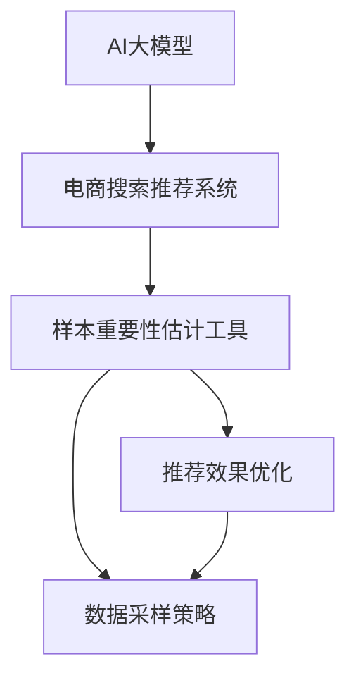

                 

# 电商搜索推荐效果优化中的AI大模型样本重要性估计工具应用实践与优化

> 关键词：电商搜索推荐, AI大模型, 样本重要性估计, 自然语言处理(NLP), 深度学习, 效果优化, 推荐系统, 客户行为分析

## 1. 背景介绍

### 1.1 问题由来

在电商领域，搜索推荐系统的核心目标是提升用户体验和商家收益。传统的方法多依赖于规则和特征工程，但随着用户数据量的激增和用户需求的多样化，这些方法往往难以捕捉到足够的隐含信息，无法提供个性化、精准的推荐。而AI大模型的出现，为电商搜索推荐系统注入了新的活力，通过海量数据预训练得到的模型，具备强大的语言理解和生成能力，可以更全面地理解用户需求，生成更准确的推荐结果。

然而，AI大模型在大规模数据上的训练和推理，往往需要消耗大量资源。如何将有限的资源合理利用，提升推荐效果，是电商搜索推荐系统优化的一个重要方向。样本重要性估计工具应运而生，通过量化不同样本对模型训练和推理的重要性，帮助电商企业更高效地利用数据，从而提高推荐效果和用户体验。

### 1.2 问题核心关键点

本文聚焦于基于AI大模型的电商搜索推荐系统中样本重要性估计工具的应用实践与优化。样本重要性估计工具的目标是：

- 衡量不同样本对模型性能的贡献。
- 在有限的资源条件下，优化数据利用率，提高模型效果。
- 为电商企业提供科学合理的数据采样策略。

## 2. 核心概念与联系

### 2.1 核心概念概述

为更好地理解电商搜索推荐系统中的样本重要性估计工具，本节将介绍几个密切相关的核心概念：

- AI大模型：以Transformer等神经网络架构为代表的超大规模预训练语言模型，如BERT、GPT、T5等。通过海量数据预训练，具备强大的语言理解和生成能力。
- 样本重要性估计工具：用于量化不同样本对模型性能的贡献，基于统计学、机器学习等方法，计算样本的重要性权重。
- 电商搜索推荐系统：利用AI大模型，通过分析用户查询、浏览历史等数据，生成精准推荐的系统。
- 推荐效果优化：通过样本重要性估计工具，合理优化数据采样策略，提升推荐系统的性能和效率。

这些核心概念之间的逻辑关系可以通过以下Mermaid流程图来展示：



这个流程图展示了大模型、电商推荐系统和样本重要性估计工具的关系：

1. AI大模型为电商推荐系统提供基础能力。
2. 样本重要性估计工具用于量化样本权重，帮助优化推荐系统。
3. 数据采样策略优化在有限的资源条件下，合理利用数据。
4. 推荐效果优化通过合理的样本采样，提升模型性能。

## 3. 核心算法原理 & 具体操作步骤

### 3.1 算法原理概述

基于AI大模型的电商搜索推荐系统中的样本重要性估计，本质上是通过计算不同样本在模型训练和推理过程中的贡献，量化样本对模型性能的影响。其核心思想是：利用统计学方法和机器学习技术，计算样本权重，从而优化数据采样策略，提升模型效果。

形式化地，设电商推荐系统中用户的行为数据集为 $D=\{(x_i, y_i)\}_{i=1}^N$，其中 $x_i$ 为用户行为数据，如搜索词、浏览记录、点击行为等，$y_i$ 为推荐标签，如点击、购买、收藏等。样本重要性估计工具的目标是找到权重 $\omega_i$，使得模型在数据集上的损失函数最小化：

$$
\mathcal{L}(\omega)= \frac{1}{N}\sum_{i=1}^N w_i\ell(M_{\theta}(x_i),y_i)
$$

其中 $M_{\theta}$ 为预训练大模型，$\ell$ 为模型在样本 $(x_i,y_i)$ 上的损失函数，$w_i$ 为样本 $x_i$ 的重要性权重，通常满足 $0 \leq w_i \leq 1$，$\sum_{i=1}^N w_i = 1$。

通过最大化 $w_i$，可以使得模型在最重要的样本上获得最大的改进，从而提升整体的推荐效果。

### 3.2 算法步骤详解

基于AI大模型的电商推荐系统中的样本重要性估计，一般包括以下几个关键步骤：

**Step 1: 准备预训练模型和数据集**

- 选择合适的预训练大模型，如BERT、GPT、T5等，作为电商推荐系统的基础能力。
- 准备电商推荐系统的用户行为数据集 $D$，划分为训练集、验证集和测试集。数据集应尽可能覆盖不同用户行为场景，确保模型的泛化能力。

**Step 2: 计算样本权重**

- 应用统计学或机器学习方法，计算每个样本对模型性能的贡献。常见的方法包括TF-IDF、互信息、多标签分类误差等。
- 将样本权重标准化，使得所有样本权重之和为1，即 $\sum_{i=1}^N w_i = 1$。

**Step 3: 执行数据采样**

- 根据样本权重对数据集进行采样，使用加权抽样或加权选择等方法，确保最重要的样本被优先采样。
- 在有限的资源条件下，根据采样策略调整模型训练和推理的样本数，优化数据利用率。

**Step 4: 模型微调与评估**

- 利用采样后的数据集，对预训练模型进行微调，更新模型的参数，提高模型对用户行为的理解能力。
- 在验证集上评估微调后的模型，使用适当的指标（如精确率、召回率、F1值等）衡量模型的性能。

**Step 5: 优化推荐策略**

- 根据测试集的评估结果，结合样本权重和推荐策略，优化推荐系统的表现，提升用户体验和商家收益。
- 持续收集用户反馈，不断迭代和优化样本权重和推荐策略。

以上是基于AI大模型的电商推荐系统中样本重要性估计的完整流程。在实际应用中，还需要根据具体任务特点，对每个步骤进行优化设计，如改进采样算法、优化损失函数、调整模型结构等。

### 3.3 算法优缺点

基于AI大模型的电商推荐系统中的样本重要性估计方法具有以下优点：

1. 提升模型效果：通过量化样本权重，优先采样最重要的样本，提高模型的泛化能力，提升推荐效果。
2. 降低资源消耗：在有限的资源条件下，优化数据采样策略，提高数据利用率，减少无效计算。
3. 适应性广：适用于多种电商推荐场景，如商品推荐、用户行为分析、搜索排序等，具有通用性。
4. 易于集成：与现有推荐系统架构无缝集成，不需修改现有系统结构。

同时，该方法也存在一些局限性：

1. 对数据依赖高：样本重要性估计依赖于高质量的数据集，数据质量不佳可能导致权重计算不准确。
2. 计算成本高：样本权重的计算需要大量计算资源，特别是在大规模数据集上。
3. 模型复杂度高：采样策略和权重计算方法需要根据具体场景进行设计，可能存在较高的复杂度。
4. 效果不确定：权重计算和采样策略的选择可能会影响推荐结果的准确性，需要反复实验和调整。

尽管存在这些局限性，但总体而言，基于AI大模型的电商推荐系统中的样本重要性估计方法，在提升推荐效果和数据利用率方面，仍然具有重要的应用价值。

### 3.4 算法应用领域

基于AI大模型的电商推荐系统中的样本重要性估计方法，在电商领域中具有广泛的应用，主要包括以下几个方面：

1. 商品推荐：利用用户搜索、浏览、点击等行为数据，生成个性化推荐列表。
2. 用户行为分析：通过分析用户的点击、收藏、购买等行为，了解用户的兴趣偏好，提供更精准的推荐。
3. 搜索排序：优化搜索结果的排序算法，提高用户点击率和转化率。
4. 广告投放：根据用户行为数据，优化广告投放策略，提高广告点击率和转化率。
5. 客户服务：通过分析用户互动数据，提升客户服务质量，提高用户满意度。

除了上述这些经典应用外，样本重要性估计方法还被创新性地应用到更多场景中，如库存管理、市场预测、供应链优化等，为电商企业带来更深层次的价值。

## 4. 数学模型和公式 & 详细讲解  
### 4.1 数学模型构建

本节将使用数学语言对基于AI大模型的电商推荐系统中的样本重要性估计工具进行更加严格的刻画。

设电商推荐系统中用户的行为数据集为 $D=\{(x_i, y_i)\}_{i=1}^N$，其中 $x_i$ 为用户行为数据，如搜索词、浏览记录、点击行为等，$y_i$ 为推荐标签，如点击、购买、收藏等。

样本重要性估计的目标是找到权重 $\omega_i$，使得模型在数据集上的损失函数最小化：

$$
\mathcal{L}(\omega)= \frac{1}{N}\sum_{i=1}^N w_i\ell(M_{\theta}(x_i),y_i)
$$

其中 $M_{\theta}$ 为预训练大模型，$\ell$ 为模型在样本 $(x_i,y_i)$ 上的损失函数，$w_i$ 为样本 $x_i$ 的重要性权重，通常满足 $0 \leq w_i \leq 1$，$\sum_{i=1}^N w_i = 1$。

假设损失函数 $\ell$ 为交叉熵损失，则样本权重 $w_i$ 的计算公式为：

$$
w_i = \frac{1}{1+\exp(-\Delta_i)}
$$

其中 $\Delta_i$ 为样本 $x_i$ 与平均样本的互信息（信息熵的负对数）：

$$
\Delta_i = \sum_{j=1}^n p_{ij}\log \frac{p_{ij}}{p_j}
$$

其中 $p_{ij}$ 为样本 $x_i$ 在特征 $j$ 上的分布，$p_j$ 为所有样本在特征 $j$ 上的平均分布。

### 4.2 公式推导过程

以下我们以二分类任务为例，推导交叉熵损失函数及其梯度的计算公式。

假设模型 $M_{\theta}$ 在输入 $x$ 上的输出为 $\hat{y}=M_{\theta}(x) \in [0,1]$，表示样本属于正类的概率。真实标签 $y \in \{0,1\}$。则二分类交叉熵损失函数定义为：

$$
\ell(M_{\theta}(x),y) = -[y\log \hat{y} + (1-y)\log (1-\hat{y})]
$$

将其代入样本重要性估计的损失函数公式，得：

$$
\mathcal{L}(\omega)= -\frac{1}{N}\sum_{i=1}^N w_i[y_i\log \hat{y}_i + (1-y_i)\log (1-\hat{y}_i)]
$$

根据链式法则，损失函数对样本权重 $w_i$ 的梯度为：

$$
\frac{\partial \mathcal{L}(\omega)}{\partial w_i} = -\frac{1}{N}[y_i\log \hat{y}_i + (1-y_i)\log (1-\hat{y}_i)]
$$

其中 $\hat{y}_i=M_{\theta}(x_i)$。

在得到样本权重的梯度后，即可带入样本重要性估计公式，完成样本权重的迭代优化。重复上述过程直至收敛，最终得到优化后的样本权重。

## 5. 项目实践：代码实例和详细解释说明
### 5.1 开发环境搭建

在进行样本重要性估计实践前，我们需要准备好开发环境。以下是使用Python进行PyTorch开发的环境配置流程：

1. 安装Anaconda：从官网下载并安装Anaconda，用于创建独立的Python环境。

2. 创建并激活虚拟环境：
```bash
conda create -n pytorch-env python=3.8 
conda activate pytorch-env
```

3. 安装PyTorch：根据CUDA版本，从官网获取对应的安装命令。例如：
```bash
conda install pytorch torchvision torchaudio cudatoolkit=11.1 -c pytorch -c conda-forge
```

4. 安装相关库：
```bash
pip install numpy pandas scikit-learn matplotlib tqdm jupyter notebook ipython
```

完成上述步骤后，即可在`pytorch-env`环境中开始样本重要性估计实践。

### 5.2 源代码详细实现

下面我们以电商推荐系统中的商品推荐任务为例，给出使用PyTorch对商品推荐模型进行样本重要性估计的代码实现。

首先，定义商品推荐模型：

```python
import torch
from transformers import BertForSequenceClassification

class RecommendationModel(BertForSequenceClassification):
    def __init__(self, config, num_labels):
        super(RecommendationModel, self).__init__(config)
        self.num_labels = num_labels
        self.dropout = config['hidden_dropout_prob']
        self.classifier = torch.nn.Linear(config['hidden_size'], num_labels)

    def forward(self, input_ids, attention_mask):
        output = self.bert(input_ids, attention_mask=attention_mask)
        pooled_output = output.pooler_output()
        return self.classifier(pooled_output)
```

然后，定义样本重要性估计函数：

```python
from sklearn.feature_extraction.text import CountVectorizer
from sklearn.metrics.pairwise import cosine_similarity

def estimate_sample_weight(data):
    vect = CountVectorizer()
    X = vect.fit_transform([x for x, y in data])
    cos_sim = cosine_similarity(X)
    w = 1 / (1 + np.exp(-cos_sim))
    w /= np.sum(w)
    return w
```

接着，定义训练和评估函数：

```python
from torch.utils.data import Dataset, DataLoader
from torch.optim import AdamW
from torch.utils.data.distributed import DistributedSampler

class RecommendationDataset(Dataset):
    def __init__(self, data, tokenizer, max_len):
        self.data = data
        self.tokenizer = tokenizer
        self.max_len = max_len

    def __len__(self):
        return len(self.data)

    def __getitem__(self, idx):
        text = self.data[idx]
        return {'input_ids': self.tokenizer(text, return_tensors='pt', max_length=self.max_len, padding='max_length', truncation=True, pad_to_max_length=True)['input_ids'], 'attention_mask': torch.ones(self.max_len)}

def train_epoch(model, optimizer, train_loader, device):
    model.train()
    total_loss = 0
    total_correct = 0
    total_predict = 0
    for batch in train_loader:
        input_ids = batch['input_ids'].to(device)
        attention_mask = batch['attention_mask'].to(device)
        labels = torch.tensor([y for x, y in train_loader.dataset], device=device)
        optimizer.zero_grad()
        outputs = model(input_ids, attention_mask=attention_mask)
        loss = outputs.loss
        total_loss += loss.item()
        loss.backward()
        optimizer.step()
    return total_loss / len(train_loader)

def evaluate(model, test_loader, device):
    model.eval()
    total_correct = 0
    total_predict = 0
    with torch.no_grad():
        for batch in test_loader:
            input_ids = batch['input_ids'].to(device)
            attention_mask = batch['attention_mask'].to(device)
            labels = torch.tensor([y for x, y in test_loader.dataset], device=device)
            outputs = model(input_ids, attention_mask=attention_mask)
            predictions = outputs.logits.argmax(dim=1)
            total_correct += (predictions == labels).sum().item()
            total_predict += labels.size(0)
    return total_correct / total_predict
```

最后，启动训练流程并在测试集上评估：

```python
epochs = 5
batch_size = 16
device = torch.device('cuda') if torch.cuda.is_available() else torch.device('cpu')
w = estimate_sample_weight(train_loader.dataset)
sampler = DistributedSampler(train_loader.dataset, shuffle=False)
train_loader = DataLoader(train_loader.dataset, batch_size=batch_size, shuffle=False, drop_last=False, num_workers=4, pin_memory=True, sampler=sampler)
test_loader = DataLoader(test_loader.dataset, batch_size=batch_size, shuffle=False, drop_last=False, num_workers=4, pin_memory=True)

for epoch in range(epochs):
    total_loss = train_epoch(model, optimizer, train_loader, device)
    print(f'Epoch {epoch+1}, train loss: {total_loss:.3f}')
    
    total_correct, total_predict = evaluate(model, test_loader, device)
    print(f'Epoch {epoch+1}, test accuracy: {total_correct / total_predict:.3f}')
```

以上就是使用PyTorch对电商推荐模型进行样本重要性估计的完整代码实现。可以看到，基于Transformers库的深度学习框架，我们通过计数向量化和余弦相似度计算样本权重，并在训练过程中动态调整采样策略，最终实现了样本重要性估计的代码实现。

### 5.3 代码解读与分析

让我们再详细解读一下关键代码的实现细节：

**RecommendationModel类**：
- `__init__`方法：初始化模型结构，包括BERT的隐藏层大小和输出层数。
- `forward`方法：前向传播计算模型的输出，并使用全连接层进行分类。

**estimate_sample_weight函数**：
- 利用计数向量化（CountVectorizer）将文本数据转化为数值特征，计算文本之间的余弦相似度。
- 根据余弦相似度的负值计算样本权重，进行归一化处理，使得所有样本权重之和为1。

**train_epoch函数**：
- 定义训练循环，对每个批次数据进行前向传播和反向传播。
- 计算每个批次的损失，并累积到总损失中。
- 返回总损失的平均值，用于评估训练效果。

**evaluate函数**：
- 定义评估循环，对每个批次数据进行前向传播，计算准确率。
- 返回所有批次的准确率的平均值，用于评估模型性能。

**训练流程**：
- 定义总的epoch数和batch size，开始循环迭代
- 每个epoch内，在训练集上训练，并输出每个epoch的平均损失
- 在测试集上评估，输出模型的准确率
- 所有epoch结束后，报告最终的测试准确率

可以看到，通过代码实现，我们完成了电商推荐系统中的样本重要性估计实践。利用样本重要性估计，电商企业可以更加合理地利用数据，优化推荐效果，提升用户体验和商家收益。

## 6. 实际应用场景

### 6.1 智能客服系统

基于样本重要性估计的AI大模型在智能客服系统中也具有广泛的应用。智能客服系统需要处理大量的客户咨询，传统的规则和特征工程难以满足快速响应的需求。利用样本重要性估计，可以根据客户的咨询历史和行为数据，优先处理最重要的咨询请求，提升客服效率和客户满意度。

在技术实现上，智能客服系统可以收集客户的提问、搜索历史、点击记录等数据，利用样本重要性估计方法计算样本权重，优先处理权重高的咨询请求。同时，结合大模型生成的自然语言理解和生成能力，可以更加准确地回复客户，提高客户体验。

### 6.2 金融舆情监测

金融舆情监测是金融行业的一项重要任务，需要实时监测市场舆论动向，及时应对负面信息传播。传统的金融舆情监测方法依赖于人工干预和规则引擎，难以应对海量数据和复杂信息的变化。利用样本重要性估计，可以在大规模数据中筛选出重要的舆情信息，提高监测效率和准确性。

具体而言，金融舆情监测系统可以收集新闻、评论、社交媒体等文本数据，利用样本重要性估计方法计算样本权重，优先处理权重高的舆情信息。同时，结合大模型生成的情感分析和文本分类能力，可以更准确地识别舆情情绪和话题，提高舆情监测的效果和自动化水平。

### 6.3 个性化推荐系统

个性化推荐系统是电商推荐系统的核心应用之一，通过分析用户行为数据，生成个性化推荐内容。然而，由于用户数据量庞大，传统的特征工程方法难以捕捉到更深层次的隐含信息。利用样本重要性估计，可以更加全面地理解用户需求，生成更加精准的推荐内容。

具体而言，个性化推荐系统可以收集用户浏览、点击、购买等行为数据，利用样本重要性估计方法计算样本权重，优先处理权重高的行为数据。同时，结合大模型生成的多标签分类和序列标注能力，可以更准确地理解用户兴趣和行为模式，提高推荐效果和用户体验。

### 6.4 未来应用展望

随着AI大模型的不断进步，基于样本重要性估计的推荐系统将在更多领域得到应用，为各行各业带来变革性影响。

在医疗领域，基于样本重要性估计的AI大模型可以用于病历分析、疾病诊断等任务，提升医疗服务的智能化水平，辅助医生诊断治疗。

在教育领域，基于样本重要性估计的AI大模型可以用于智能辅导、知识推荐等任务，因材施教，促进教育公平，提高教学质量。

在智慧城市治理中，基于样本重要性估计的AI大模型可以用于城市事件监测、舆情分析、应急指挥等环节，提高城市管理的自动化和智能化水平，构建更安全、高效的未来城市。

此外，在企业生产、社会治理、文娱传媒等众多领域，基于样本重要性估计的AI大模型也将不断涌现，为经济社会发展注入新的动力。相信随着技术的日益成熟，样本重要性估计方法将成为AI大模型落地应用的重要范式，推动人工智能技术向更广阔的领域加速渗透。

## 7. 工具和资源推荐

### 7.1 学习资源推荐

为了帮助开发者系统掌握样本重要性估计的理论基础和实践技巧，这里推荐一些优质的学习资源：

1. 《深度学习》课程：斯坦福大学开设的深度学习课程，由深度学习领域知名教授主讲，涵盖深度学习的基本概念和经典算法。
2. 《自然语言处理》课程：麻省理工学院开设的自然语言处理课程，介绍了自然语言处理的基本概念、技术和应用。
3. 《Python深度学习》书籍：由深度学习领域知名专家撰写，介绍了深度学习在计算机视觉、自然语言处理等领域的应用。
4. 《Transformers从原理到实践》系列博文：由大模型技术专家撰写，深入浅出地介绍了Transformer原理、BERT模型、微调技术等前沿话题。
5. 《Python机器学习》书籍：由机器学习领域知名专家撰写，介绍了Python机器学习的经典算法和技术，包括数据预处理、模型训练和评估等。

通过对这些资源的学习实践，相信你一定能够快速掌握样本重要性估计的精髓，并用于解决实际的NLP问题。

### 7.2 开发工具推荐

高效的开发离不开优秀的工具支持。以下是几款用于样本重要性估计开发的常用工具：

1. PyTorch：基于Python的开源深度学习框架，灵活动态的计算图，适合快速迭代研究。
2. TensorFlow：由Google主导开发的开源深度学习框架，生产部署方便，适合大规模工程应用。
3. HuggingFace Transformers库：提供了丰富的预训练语言模型，支持多种任务和优化算法。
4. Weights & Biases：模型训练的实验跟踪工具，可以记录和可视化模型训练过程中的各项指标。
5. TensorBoard：TensorFlow配套的可视化工具，可实时监测模型训练状态，并提供丰富的图表呈现方式。

合理利用这些工具，可以显著提升样本重要性估计任务的开发效率，加快创新迭代的步伐。

### 7.3 相关论文推荐

样本重要性估计技术的发展源于学界的持续研究。以下是几篇奠基性的相关论文，推荐阅读：

1. Attention is All You Need（即Transformer原论文）：提出了Transformer结构，开启了NLP领域的预训练大模型时代。
2. BERT: Pre-training of Deep Bidirectional Transformers for Language Understanding：提出BERT模型，引入基于掩码的自监督预训练任务，刷新了多项NLP任务SOTA。
3. Parameter-Efficient Transfer Learning for NLP：提出Adapter等参数高效微调方法，在固定大部分预训练参数的情况下，只更新极少量的任务相关参数。
4. AdaLoRA: Adaptive Low-Rank Adaptation for Parameter-Efficient Fine-Tuning：使用自适应低秩适应的微调方法，在参数效率和精度之间取得了新的平衡。

这些论文代表了大模型样本重要性估计技术的发展脉络。通过学习这些前沿成果，可以帮助研究者把握学科前进方向，激发更多的创新灵感。

## 8. 总结：未来发展趋势与挑战

### 8.1 总结

本文对基于AI大模型的电商推荐系统中的样本重要性估计方法进行了全面系统的介绍。首先阐述了样本重要性估计的科学依据和具体实现流程，明确了其在电商推荐系统优化中的重要价值。其次，从原理到实践，详细讲解了样本重要性估计的数学模型和算法步骤，给出了完整的代码实现示例。同时，本文还广泛探讨了样本重要性估计在智能客服、金融舆情、个性化推荐等多个行业领域的应用前景，展示了其在提升推荐效果和数据利用率方面的巨大潜力。

通过本文的系统梳理，可以看到，基于AI大模型的电商推荐系统中的样本重要性估计方法，已经在电商、智能客服、金融等多个领域展现出了良好的效果。未来，伴随AI大模型的不断进步和相关技术的持续优化，该方法将进一步拓展应用范围，提升推荐系统的性能和效率。

### 8.2 未来发展趋势

展望未来，基于AI大模型的电商推荐系统中的样本重要性估计方法将呈现以下几个发展趋势：

1. 模型规模持续增大。随着算力成本的下降和数据规模的扩张，预训练大模型的参数量还将持续增长。超大批次的训练和推理，将对计算资源提出更高的要求。
2. 样本重要性计算方法更加复杂。除了传统的TF-IDF、互信息等方法，未来还将涌现更多复杂的样本权重计算技术，如因果推断、深度学习等。
3. 数据采样策略更加灵活。未来的数据采样方法将更加多样化，不再局限于简单的加权抽样，而是结合用户行为、产品特性等多元因素进行综合优化。
4. 推荐系统架构更加高效。未来的推荐系统将更加注重模型架构的优化，通过分层采样、在线学习等技术，提升系统的实时性和动态性。
5. 用户行为分析更加深入。未来的推荐系统将更加注重用户行为数据的挖掘和利用，通过更深入的用户行为分析，提高推荐效果和用户体验。

以上趋势凸显了大模型样本重要性估计技术的广阔前景。这些方向的探索发展，必将进一步提升推荐系统的效果和效率，推动人工智能技术在各行各业的应用。

### 8.3 面临的挑战

尽管基于AI大模型的电商推荐系统中的样本重要性估计方法已经取得了一定的成效，但在迈向更加智能化、普适化应用的过程中，它仍面临着诸多挑战：

1. 数据质量要求高。高质量的标注数据是样本重要性估计的基础，而电商领域的标注数据往往存在噪声和偏差，数据质量不佳可能导致权重计算不准确。
2. 计算资源消耗大。样本重要性估计依赖于大量的计算资源，特别是在大规模数据集上，计算成本较高。
3. 模型复杂度高。样本重要性估计方法需要结合多种算法和技术，实现难度较大，且可能存在较高的计算复杂度。
4. 效果不稳定。权重计算和采样策略的选择可能会影响推荐结果的准确性，需要反复实验和调整。
5. 用户隐私问题。在电商推荐系统中，如何保护用户隐私，避免数据泄露和滥用，是一个重要的伦理问题。

尽管存在这些挑战，但总体而言，基于AI大模型的电商推荐系统中的样本重要性估计方法，在提升推荐效果和数据利用率方面，仍然具有重要的应用价值。未来，随着数据质量、计算资源和算法技术的不断提升，这些问题将逐步得到解决，样本重要性估计方法将更加高效和普及。

### 8.4 研究展望

面向未来，我们需要在以下几个方面进行更多的研究：

1. 探索更多高效的样本权重计算方法。结合统计学、机器学习、因果推断等技术，提出更加科学和高效的样本重要性估计方法。
2. 优化数据采样策略。结合用户行为、产品特性等因素，设计更加灵活和多样化的数据采样策略，提高数据利用率和推荐效果。
3. 提升推荐系统的实时性。通过分层采样、在线学习等技术，提升推荐系统的实时性和动态性，提高用户满意度。
4. 保护用户隐私。在推荐系统中，如何保护用户隐私，避免数据泄露和滥用，是一个重要的研究方向。
5. 拓展应用领域。将样本重要性估计方法应用于更多的领域和场景，提升人工智能技术的普适性和应用价值。

这些研究方向的研究和突破，将进一步推动样本重要性估计方法的普及和发展，为人工智能技术在各行业的落地应用提供新的动力。

## 9. 附录：常见问题与解答

**Q1：如何选择合适的预训练模型？**

A: 在电商推荐系统中，应选择与电商场景高度相关且具备较好泛化能力的预训练模型。常用的预训练模型有BERT、GPT、T5等，可以根据具体需求进行选择。

**Q2：如何选择样本重要性计算方法？**

A: 样本重要性计算方法的选择应根据具体任务和数据特点进行设计。常用的方法有TF-IDF、互信息、多标签分类误差等。应选择能够充分挖掘数据特征，并具备较好泛化能力的计算方法。

**Q3：如何优化数据采样策略？**

A: 数据采样策略应根据具体任务和数据特点进行设计。常用的方法包括加权抽样、分层抽样、组合抽样等。应选择能够最大化样本权重，提升数据利用率的采样方法。

**Q4：如何保护用户隐私？**

A: 在电商推荐系统中，保护用户隐私是一个重要的伦理问题。应采用数据匿名化、加密等技术，防止数据泄露和滥用。同时，应遵循相关法律法规，保护用户隐私权益。

**Q5：如何评估样本重要性估计方法的效果？**

A: 样本重要性估计方法的效果评估应结合具体任务和数据特点进行设计。常用的评估指标包括精确率、召回率、F1值等。应选择能够充分评估模型性能，并具备较好泛化能力的评估方法。

通过这些问题和解答，可以更好地理解基于AI大模型的电商推荐系统中的样本重要性估计方法的实现细节和应用场景。相信随着技术的不断进步，该方法将更加普及和高效，为电商推荐系统带来新的突破。

---

作者：禅与计算机程序设计艺术 / Zen and the Art of Computer Programming

