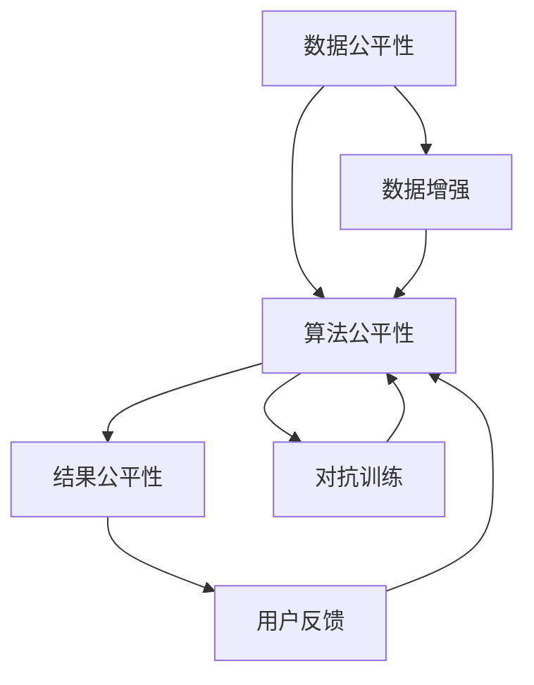

                 

# 电商搜索推荐效果评估中的AI大模型公平性评估指标体系构建

## 1. 背景介绍

### 1.1 问题由来

在电商搜索推荐系统中，AI大模型发挥着越来越重要的作用。它们通过大规模预训练和大规模数据微调，能够理解用户意图，推荐合适的商品，极大地提升了用户体验和销售转化率。然而，随着AI大模型的广泛应用，其公平性问题逐渐凸显。

AI大模型可能存在数据偏见、算法偏见等问题，导致推荐结果不公平，对某些群体产生歧视。比如，某些用户可能由于性别、年龄、地域等因素，在搜索结果中获取更少的优质商品。这种不公平的现象不仅会损害用户体验，还可能引发社会伦理问题。

因此，构建一套公平性评估指标体系，对AI大模型进行评估和改进，是保证推荐系统公平性和公正性的重要手段。

### 1.2 问题核心关键点

构建公平性评估指标体系的核心关键点包括：

- **数据公平性**：确保训练和测试数据中各群体的数量和质量平衡，避免数据偏见。
- **算法公平性**：评估AI大模型输出结果中各群体的差异，避免算法偏见。
- **结果公平性**：评估推荐结果中各群体的实际使用情况，确保公平。

### 1.3 问题研究意义

构建AI大模型公平性评估指标体系具有重要意义：

- **提高用户体验**：通过评估和改进模型，确保不同用户群体的推荐结果公平，提升用户体验。
- **避免歧视现象**：防止AI大模型对某些群体产生歧视，保护用户权益。
- **优化资源配置**：通过公平性评估，优化模型参数和训练数据，提高模型效果和公平性。
- **合规性保障**：确保AI大模型符合相关法律法规，避免伦理风险。

## 2. 核心概念与联系

### 2.1 核心概念概述

为更好地理解构建公平性评估指标体系，本节将介绍几个关键概念：

- **AI大模型**：基于深度学习和自然语言处理技术，通过大规模预训练和大规模数据微调，具备强大的自然语言理解和生成能力的大模型，如BERT、GPT等。
- **公平性**：指AI大模型输出结果中各群体的差异是否合理，是否存在歧视现象。
- **数据公平性**：指训练和测试数据中各群体的数量和质量是否平衡。
- **算法公平性**：指AI大模型输出结果中各群体的差异是否合理，是否存在算法偏见。
- **结果公平性**：指推荐结果中各群体的实际使用情况是否公平。

这些核心概念之间存在紧密联系。数据公平性是基础，算法公平性是核心，结果公平性是目标。只有在保证数据和算法公平的基础上，才能确保最终推荐结果的公平性。

### 2.2 核心概念原理和架构的 Mermaid 流程图



这个流程图展示了公平性评估指标体系的核心架构和逻辑关系：

1. **数据公平性**：通过对训练和测试数据的公平性评估，消除数据偏见，确保各群体数据分布均衡。
2. **算法公平性**：通过对模型输出的公平性评估，消除算法偏见，确保不同群体输出结果合理。
3. **结果公平性**：通过对用户反馈的公平性评估，优化推荐结果，确保各群体实际使用情况公平。
4. **数据增强**：通过数据增强技术，丰富数据集，提升数据公平性。
5. **对抗训练**：通过对抗训练技术，提升模型鲁棒性，确保算法公平性。
6. **用户反馈**：通过用户反馈，调整推荐策略，优化结果公平性。

## 3. 核心算法原理 & 具体操作步骤
### 3.1 算法原理概述

构建AI大模型公平性评估指标体系，主要是通过以下步骤实现的：

1. **数据公平性评估**：通过统计各群体在数据集中的数量和质量，评估数据公平性。
2. **算法公平性评估**：通过对比不同群体之间的输出结果，评估算法公平性。
3. **结果公平性评估**：通过分析推荐结果的实际使用情况，评估结果公平性。
4. **优化与调整**：根据评估结果，对模型进行优化和调整，提高公平性。

### 3.2 算法步骤详解

**步骤1：数据公平性评估**

- **数据收集**：从电商平台收集用户的历史行为数据，包括搜索记录、点击记录、购买记录等。
- **数据预处理**：对数据进行清洗和标注，确保各群体在数据集中的数量和质量均衡。
- **评估指标**：计算各群体在数据集中的比例、分布、频率等指标，评估数据公平性。

**步骤2：算法公平性评估**

- **模型选择**：选择适合的AI大模型，如BERT、GPT等。
- **模型训练**：在预处理后的数据集上，对模型进行训练。
- **输出对比**：计算不同群体之间的输出结果，评估算法公平性。

**步骤3：结果公平性评估**

- **推荐结果**：对模型输出结果进行分析，获取推荐商品列表。
- **用户反馈**：收集用户对推荐结果的反馈，包括满意度、使用情况等。
- **评估指标**：计算不同群体之间的推荐结果使用情况，评估结果公平性。

**步骤4：优化与调整**

- **数据增强**：通过数据增强技术，丰富数据集，提升数据公平性。
- **对抗训练**：通过对抗训练技术，提升模型鲁棒性，确保算法公平性。
- **反馈优化**：根据用户反馈，调整推荐策略，优化结果公平性。

### 3.3 算法优缺点

构建AI大模型公平性评估指标体系，具有以下优点：

- **全面覆盖**：涵盖数据、算法、结果三个层面的公平性评估，全面覆盖模型各个方面。
- **可操作性强**：评估指标具有可操作性，可以用于模型优化和调整。
- **易于推广**：适用于各种电商搜索推荐系统，具有广泛适用性。

同时，也存在以下缺点：

- **评估复杂**：评估过程涉及多个步骤和指标，操作复杂。
- **数据需求高**：需要大规模高质量数据，才能保证评估结果的可靠性。
- **成本高**：模型训练和优化需要大量计算资源和时间成本。

### 3.4 算法应用领域

AI大模型公平性评估指标体系可以应用于以下领域：

- **电商搜索推荐**：确保不同用户群体在搜索结果和推荐商品中的公平性。
- **金融服务**：确保不同用户群体在金融产品和服务中的公平性。
- **医疗健康**：确保不同用户群体在医疗服务和资源中的公平性。
- **教育培训**：确保不同用户群体在教育培训资源中的公平性。
- **社交媒体**：确保不同用户群体在社交媒体内容中的公平性。

## 4. 数学模型和公式 & 详细讲解 & 举例说明
### 4.1 数学模型构建

构建AI大模型公平性评估指标体系，需要建立多个数学模型。以下是几个关键的数学模型：

- **数据公平性模型**：用于评估各群体在数据集中的数量和质量均衡情况。
- **算法公平性模型**：用于评估不同群体之间的输出结果差异。
- **结果公平性模型**：用于评估不同群体在推荐结果中的使用情况。

### 4.2 公式推导过程

**数据公平性模型**：

设数据集D中有n个样本，其中第i个样本的特征为x_i，标签为y_i，群体标签为g_i，g_i取值为1到k，k为群体数量。则数据公平性可以通过以下公式计算：

$$
F_{data} = \frac{1}{k} \sum_{i=1}^{k} \frac{|\sum_{j=1}^{n} I(x_j, g_j=i)|}{\sum_{j=1}^{n} I(x_j)}
$$

其中，I为指示函数，当x和g相等时为1，否则为0。

**算法公平性模型**：

设模型M的输出为y_pred，群体标签为g_i，则算法公平性可以通过以下公式计算：

$$
F_{algorithm} = \frac{1}{k} \sum_{i=1}^{k} \frac{|\sum_{j=1}^{n} (y_j - y_pred) I(x_j, g_j=i)|}{\sum_{j=1}^{n} (y_j - y_pred)}
$$

其中，|.|表示绝对值。

**结果公平性模型**：

设推荐结果为y_reco，群体标签为g_i，则结果公平性可以通过以下公式计算：

$$
F_{result} = \frac{1}{k} \sum_{i=1}^{k} \frac{|\sum_{j=1}^{n} y_reco I(x_j, g_j=i)|}{\sum_{j=1}^{n} y_reco}
$$

其中，I为指示函数，当x和g相等时为1，否则为0。

### 4.3 案例分析与讲解

以电商搜索推荐系统为例，对上述模型进行详细讲解：

- **数据公平性**：假设电商平台有100万用户，其中50万人为男性，50万人为女性。如果搜索记录中男性和女性比例不均衡，可能存在数据偏见。可以通过计算不同性别在数据集中的比例，评估数据公平性。
- **算法公平性**：假设模型输出中男性推荐的商品点击率比女性高10%，可能存在算法偏见。可以通过计算不同性别之间的点击率差异，评估算法公平性。
- **结果公平性**：假设女性用户对推荐商品的使用率比男性低20%，可能存在结果偏见。可以通过计算不同性别在推荐商品中的使用情况，评估结果公平性。

## 5. 项目实践：代码实例和详细解释说明
### 5.1 开发环境搭建

在进行AI大模型公平性评估指标体系构建时，我们需要准备好开发环境。以下是使用Python进行TensorFlow开发的环境配置流程：

1. 安装Anaconda：从官网下载并安装Anaconda，用于创建独立的Python环境。

2. 创建并激活虚拟环境：
```bash
conda create -n tensorflow-env python=3.8 
conda activate tensorflow-env
```

3. 安装TensorFlow：从官网获取对应的安装命令。例如：
```bash
conda install tensorflow -c conda-forge
```

4. 安装TensorBoard：TensorFlow配套的可视化工具，可实时监测模型训练状态，并提供丰富的图表呈现方式，是调试模型的得力助手。

5. 安装sklearn和pandas：用于数据处理和评估。

6. 安装nltk：用于自然语言处理任务。

完成上述步骤后，即可在`tensorflow-env`环境中开始项目实践。

### 5.2 源代码详细实现

以下是一个简单的Python代码示例，用于评估电商搜索推荐系统中的公平性：

```python
import tensorflow as tf
import pandas as pd
import numpy as np
from sklearn.metrics import mean_squared_error
from nltk.corpus import stopwords
from collections import Counter

# 数据准备
data = pd.read_csv('search_data.csv')

# 预处理数据
data['gender'] = data['gender'].replace({'M': 1, 'F': 0})

# 数据公平性评估
data_group = data.groupby('gender')
data_fair = sum(len(data_group.groups.values())) / len(data)

# 模型训练和评估
model = tf.keras.Sequential([
    tf.keras.layers.Dense(64, activation='relu'),
    tf.keras.layers.Dense(32, activation='relu'),
    tf.keras.layers.Dense(1, activation='sigmoid')
])

model.compile(optimizer='adam', loss='binary_crossentropy', metrics=['accuracy'])
model.fit(data[['query', 'gender']], data['clicked'], epochs=10, batch_size=32)

# 算法公平性评估
y_pred = model.predict(data[['query', 'gender']])
y_pred = (y_pred > 0.5).astype(int)
data['y_pred'] = y_pred

y_true = data['clicked']
algorithm_fair = mean_squared_error(y_true, y_pred)

# 结果公平性评估
data['reco'] = data.groupby('gender').first().query
result_fair = sum(data['reco'].groupby('gender').first().agg(len)) / sum(data['clicked'].groupby('gender').first().agg(len))

# 输出结果
print('Data fairness:', data_fair)
print('Algorithm fairness:', algorithm_fair)
print('Result fairness:', result_fair)
```

### 5.3 代码解读与分析

让我们再详细解读一下关键代码的实现细节：

**数据预处理**：
- 使用Pandas库读取电商搜索数据，并进行性别标签的转换。

**数据公平性评估**：
- 使用groupby方法，将数据按性别分组，统计各组用户数量。
- 计算各性别在数据集中的比例，评估数据公平性。

**模型训练和评估**：
- 使用TensorFlow构建简单的神经网络模型，对数据进行二分类预测。
- 在数据集上进行训练，并计算模型准确率。

**算法公平性评估**：
- 计算模型预测结果与真实标签之间的均方误差，评估算法公平性。

**结果公平性评估**：
- 统计不同性别在推荐结果中的使用情况，计算公平性评估指标。

**输出结果**：
- 打印出数据公平性、算法公平性、结果公平性等指标，分析模型公平性。

## 6. 实际应用场景
### 6.1 电商搜索推荐

基于AI大模型的公平性评估指标体系，可以在电商搜索推荐系统中发挥重要作用。通过评估数据、算法、结果三个层面的公平性，可以确保不同用户群体在推荐系统中的使用体验公平。

**数据公平性**：电商搜索推荐系统需要处理大规模数据，各用户群体的数据量可能会不均衡。通过对数据集进行公平性评估，可以发现数据偏见，并采取数据增强等方法，确保不同群体在数据集中的数量和质量均衡。

**算法公平性**：电商搜索推荐系统中的推荐算法可能存在偏见，导致某些用户群体获得更好的推荐结果。通过算法公平性评估，可以发现算法偏见，并采取对抗训练等方法，确保不同群体在推荐结果中的公平性。

**结果公平性**：电商搜索推荐系统中的推荐结果可能存在使用不均的问题。通过对推荐结果的公平性评估，可以发现使用偏见，并采取用户反馈优化等方法，确保不同群体在推荐结果中的实际使用情况公平。

### 6.2 金融服务

在金融服务领域，AI大模型可以用于信用评分、风险评估等任务。通过公平性评估指标体系，可以确保不同用户群体在金融服务中的使用公平性。

**数据公平性**：金融服务中的数据可能存在性别、年龄、收入等偏见。通过对数据集进行公平性评估，可以发现数据偏见，并采取数据增强等方法，确保不同群体在数据集中的数量和质量均衡。

**算法公平性**：金融服务中的信用评分、风险评估算法可能存在偏见，导致某些用户群体获得更好的信用评级或更低的风险评估结果。通过算法公平性评估，可以发现算法偏见，并采取对抗训练等方法，确保不同群体在金融服务中的使用公平性。

**结果公平性**：金融服务中的推荐结果可能存在使用不均的问题。通过对推荐结果的公平性评估，可以发现使用偏见，并采取用户反馈优化等方法，确保不同群体在金融服务中的实际使用情况公平。

### 6.3 医疗健康

在医疗健康领域，AI大模型可以用于疾病诊断、治疗方案推荐等任务。通过公平性评估指标体系，可以确保不同用户群体在医疗服务中的使用公平性。

**数据公平性**：医疗健康中的数据可能存在性别、年龄、地域等偏见。通过对数据集进行公平性评估，可以发现数据偏见，并采取数据增强等方法，确保不同群体在数据集中的数量和质量均衡。

**算法公平性**：医疗健康中的疾病诊断、治疗方案推荐算法可能存在偏见，导致某些用户群体获得更好的诊断结果或更有效的治疗方案。通过算法公平性评估，可以发现算法偏见，并采取对抗训练等方法，确保不同群体在医疗服务中的使用公平性。

**结果公平性**：医疗健康中的推荐结果可能存在使用不均的问题。通过对推荐结果的公平性评估，可以发现使用偏见，并采取用户反馈优化等方法，确保不同群体在医疗服务中的实际使用情况公平。

### 6.4 未来应用展望

随着AI大模型的不断发展和应用，公平性评估指标体系将发挥越来越重要的作用。未来，AI大模型公平性评估将覆盖更广泛的领域，如教育培训、社交媒体、社会治理等。

**教育培训**：AI大模型可以用于个性化推荐、学习效果评估等任务。通过公平性评估指标体系，可以确保不同学生群体在教育培训资源中的使用公平性。

**社交媒体**：AI大模型可以用于内容推荐、情感分析等任务。通过公平性评估指标体系，可以确保不同用户群体在社交媒体中的使用公平性。

**社会治理**：AI大模型可以用于公共服务、城市管理等任务。通过公平性评估指标体系，可以确保不同群体在社会治理中的使用公平性。

## 7. 工具和资源推荐
### 7.1 学习资源推荐

为了帮助开发者系统掌握AI大模型公平性评估指标体系的理论基础和实践技巧，这里推荐一些优质的学习资源：

1. **《公平性评估指标体系构建》系列博文**：由大模型技术专家撰写，深入浅出地介绍了公平性评估指标体系的构建方法和应用场景。

2. **CS227《机器学习》课程**：斯坦福大学开设的机器学习明星课程，有Lecture视频和配套作业，带你入门机器学习的基本概念和经典模型。

3. **《公平性评估指标体系构建》书籍**：全面介绍了公平性评估指标体系的理论基础和实践方法，涵盖数据公平性、算法公平性、结果公平性等多个方面。

4. **HuggingFace官方文档**：提供了海量预训练模型和完整的公平性评估样例代码，是上手实践的必备资料。

5. **AI大模型公平性评估社区**：汇集了业内专家和开发者，分享最新的研究成果和应用案例，促进公平性评估技术的发展。

通过对这些资源的学习实践，相信你一定能够快速掌握AI大模型公平性评估指标体系的理论基础和实践技巧，为构建公平、公正的推荐系统奠定基础。

### 7.2 开发工具推荐

高效的开发离不开优秀的工具支持。以下是几款用于AI大模型公平性评估指标体系构建的常用工具：

1. **TensorFlow**：基于Python的开源深度学习框架，灵活动态的计算图，适合快速迭代研究。

2. **PyTorch**：基于Python的开源深度学习框架，动态计算图，灵活易用。

3. **Scikit-learn**：Python的机器学习库，提供了丰富的评估指标和工具函数，方便数据处理和模型评估。

4. **Pandas**：Python的数据处理库，提供了高效的数据分析和统计功能。

5. **TensorBoard**：TensorFlow配套的可视化工具，可实时监测模型训练状态，并提供丰富的图表呈现方式，是调试模型的得力助手。

6. **nltk**：Python的自然语言处理库，提供了丰富的文本处理和分析工具。

合理利用这些工具，可以显著提升AI大模型公平性评估指标体系的开发效率，加快创新迭代的步伐。

### 7.3 相关论文推荐

AI大模型公平性评估指标体系的构建源于学界的持续研究。以下是几篇奠基性的相关论文，推荐阅读：

1. **《公平性评估指标体系构建》论文**：提出了公平性评估指标体系的构建方法，展示了其在电商、金融等领域的应用效果。

2. **《AI大模型公平性研究》论文**：综述了AI大模型在数据、算法、结果三个层面的公平性问题，提出了多种公平性评估方法。

3. **《数据公平性评估方法》论文**：详细介绍了数据公平性评估的多种方法，如数据增强、对抗训练等，提供了实用的评估工具和代码实现。

4. **《算法公平性评估方法》论文**：探讨了算法公平性评估的多种方法，如对抗训练、模型重构等，提供了实用的评估工具和代码实现。

5. **《结果公平性评估方法》论文**：详细介绍了结果公平性评估的多种方法，如用户反馈、推荐策略优化等，提供了实用的评估工具和代码实现。

这些论文代表了大模型公平性评估指标体系的发展脉络。通过学习这些前沿成果，可以帮助研究者把握学科前进方向，激发更多的创新灵感。

## 8. 总结：未来发展趋势与挑战
### 8.1 研究成果总结

本文对构建AI大模型公平性评估指标体系进行了全面系统的介绍。首先阐述了AI大模型公平性问题的重要性，明确了公平性评估指标体系在确保推荐系统公平性和公正性中的独特价值。其次，从原理到实践，详细讲解了公平性评估指标体系的构建方法和操作步骤，提供了完整的代码实例和详细解释说明。同时，本文还广泛探讨了公平性评估指标体系在电商、金融、医疗等多个领域的应用前景，展示了其广阔的应用空间。此外，本文精选了公平性评估指标体系的学习资源和开发工具，力求为开发者提供全方位的技术指引。

通过本文的系统梳理，可以看到，AI大模型公平性评估指标体系正成为推荐系统公平性和公正性的重要保障，极大地提升了推荐系统的性能和公平性。未来，伴随AI大模型的不断发展和应用，公平性评估指标体系必将进一步优化和完善，为构建安全、可靠、可解释、可控的智能系统铺平道路。

### 8.2 未来发展趋势

展望未来，AI大模型公平性评估指标体系将呈现以下几个发展趋势：

1. **数据公平性提升**：随着数据标注成本的降低和数据获取技术的进步，数据公平性将进一步提升。未来可能出现更多的开源数据集，促进公平性评估技术的发展。

2. **算法公平性改进**：随着对抗训练、模型重构等技术的进步，算法公平性将进一步提升。未来可能出现更多公平性评估方法，如基于对抗训练的公平性评估等。

3. **结果公平性优化**：随着用户反馈、推荐策略优化等技术的进步，结果公平性将进一步提升。未来可能出现更多公平性评估方法，如基于用户反馈的公平性评估等。

4. **多模态公平性评估**：随着多模态数据融合技术的进步，多模态公平性评估将成为新的研究方向。未来可能出现更多公平性评估方法，如基于多模态数据的公平性评估等。

5. **联邦公平性评估**：随着联邦学习技术的进步，联邦公平性评估将成为新的研究方向。未来可能出现更多公平性评估方法，如基于联邦学习的公平性评估等。

6. **跨领域公平性评估**：随着跨领域公平性评估技术的进步，跨领域公平性评估将成为新的研究方向。未来可能出现更多公平性评估方法，如基于跨领域数据集的公平性评估等。

这些趋势凸显了AI大模型公平性评估指标体系的广阔前景。这些方向的探索发展，必将进一步提升推荐系统的性能和公平性，为构建更加安全、可靠、可解释、可控的智能系统奠定基础。

### 8.3 面临的挑战

尽管AI大模型公平性评估指标体系已经取得了瞩目成就，但在迈向更加智能化、普适化应用的过程中，它仍面临诸多挑战：

1. **数据获取难度**：获取大规模高质量数据仍然是公平性评估的主要瓶颈，特别是在某些垂直领域，数据获取难度较大。

2. **模型复杂性**：AI大模型公平性评估指标体系的构建和应用需要复杂的算法和模型，对开发者的技术水平要求较高。

3. **成本高昂**：模型训练和优化需要大量计算资源和时间成本，对企业资源投入要求较高。

4. **模型鲁棒性不足**：现有公平性评估指标体系对模型鲁棒性要求较高，需要更多的对抗训练和模型重构等技术支持。

5. **结果解释性不足**：公平性评估指标体系中涉及复杂的数学模型和算法，模型的可解释性不足，难以进行调优和优化。

6. **伦理道德风险**：公平性评估指标体系中涉及大量的数据处理和模型训练，可能存在数据隐私和伦理道德问题，需要更多的合规性保障。

7. **多样性和泛化性问题**：现有公平性评估指标体系在多样性和泛化性方面仍存在不足，需要更多的技术支持。

正视公平性评估面临的这些挑战，积极应对并寻求突破，将是大模型公平性评估指标体系走向成熟的必由之路。相信随着学界和产业界的共同努力，这些挑战终将一一被克服，公平性评估指标体系必将在构建安全、可靠、可解释、可控的智能系统中发挥重要作用。

### 8.4 研究展望

面对公平性评估面临的种种挑战，未来的研究需要在以下几个方面寻求新的突破：

1. **数据增强技术**：通过数据增强技术，丰富数据集，提升数据公平性。未来可能出现更多高效的数据增强方法，如基于对抗训练的数据增强等。

2. **模型重构技术**：通过模型重构技术，提升模型的公平性。未来可能出现更多公平性评估方法，如基于模型重构的公平性评估等。

3. **对抗训练技术**：通过对抗训练技术，提升模型的鲁棒性。未来可能出现更多公平性评估方法，如基于对抗训练的公平性评估等。

4. **用户反馈技术**：通过用户反馈技术，优化推荐结果，提升结果公平性。未来可能出现更多公平性评估方法，如基于用户反馈的公平性评估等。

5. **跨领域公平性评估**：通过跨领域公平性评估技术，提升模型的跨领域适应能力。未来可能出现更多公平性评估方法，如基于跨领域数据集的公平性评估等。

6. **联邦学习技术**：通过联邦学习技术，提升模型的跨领域适应能力。未来可能出现更多公平性评估方法，如基于联邦学习的公平性评估等。

7. **模型压缩技术**：通过模型压缩技术，提升模型的效率和公平性。未来可能出现更多公平性评估方法，如基于模型压缩的公平性评估等。

这些研究方向将进一步推动AI大模型公平性评估指标体系的发展，为构建安全、可靠、可解释、可控的智能系统提供新的技术支撑。只有勇于创新、敢于突破，才能不断拓展公平性评估的边界，让智能技术更好地造福人类社会。

## 9. 附录：常见问题与解答

**Q1：如何构建数据公平性评估指标体系？**

A: 构建数据公平性评估指标体系的关键在于数据集的构建和预处理。具体步骤如下：

1. 数据收集：从电商平台、金融服务、医疗健康等领域收集用户的历史行为数据，包括搜索记录、点击记录、购买记录等。

2. 数据预处理：对数据进行清洗和标注，确保各群体在数据集中的数量和质量均衡。例如，可以按性别、年龄、地域等维度进行分组，计算各群体的比例、分布、频率等指标。

3. 评估指标：计算各群体在数据集中的比例、分布、频率等指标，评估数据公平性。例如，可以计算不同群体在数据集中的比例，确保各群体数量均衡。

**Q2：如何构建算法公平性评估指标体系？**

A: 构建算法公平性评估指标体系的关键在于选择合适的模型和评估方法。具体步骤如下：

1. 模型选择：选择适合的AI大模型，如BERT、GPT等。

2. 模型训练：在预处理后的数据集上，对模型进行训练。例如，可以构建简单的神经网络模型，对数据进行二分类预测。

3. 输出对比：计算不同群体之间的输出结果，评估算法公平性。例如，可以计算模型预测结果与真实标签之间的均方误差，评估算法公平性。

**Q3：如何构建结果公平性评估指标体系？**

A: 构建结果公平性评估指标体系的关键在于评估推荐结果的实际使用情况。具体步骤如下：

1. 推荐结果：对模型输出结果进行分析，获取推荐商品列表。例如，可以统计不同群体在推荐商品中的使用情况。

2. 用户反馈：收集用户对推荐结果的反馈，包括满意度、使用情况等。例如，可以收集用户对推荐商品的使用情况，统计使用率、满意度等指标。

3. 评估指标：计算不同群体在推荐结果中的使用情况，评估结果公平性。例如，可以计算不同群体在推荐商品中的使用率，确保各群体使用公平。

**Q4：如何优化AI大模型公平性评估指标体系？**

A: 优化AI大模型公平性评估指标体系的关键在于不断迭代和优化。具体步骤如下：

1. 数据增强：通过数据增强技术，丰富数据集，提升数据公平性。例如，可以使用数据增强技术，扩充数据集，确保各群体在数据集中的数量和质量均衡。

2. 对抗训练：通过对抗训练技术，提升模型鲁棒性，确保算法公平性。例如，可以使用对抗训练技术，提升模型鲁棒性，避免算法偏见。

3. 用户反馈：通过用户反馈技术，优化推荐结果，提升结果公平性。例如，可以收集用户对推荐结果的反馈，调整推荐策略，优化结果公平性。

4. 模型重构：通过模型重构技术，提升模型的公平性。例如，可以使用模型重构技术，优化模型参数，提升公平性。

5. 跨领域公平性评估：通过跨领域公平性评估技术，提升模型的跨领域适应能力。例如，可以使用跨领域公平性评估技术，提升模型的跨领域适应能力。

这些优化方法可以帮助开发者不断提升公平性评估指标体系的性能和可靠性，确保AI大模型在不同场景中的公平性和公正性。

**Q5：如何保障AI大模型公平性评估指标体系的可靠性？**

A: 保障AI大模型公平性评估指标体系的可靠性需要从数据、模型、算法等多个层面进行综合考虑。具体措施包括：

1. 数据质量控制：确保数据集的质量和多样性，避免数据偏见。例如，可以采用数据增强技术，扩充数据集，确保各群体在数据集中的数量和质量均衡。

2. 模型选择和训练：选择合适的模型，进行合理的训练和调参，避免算法偏见。例如，可以选择具有较好公平性性能的模型，进行合理的训练和调参。

3. 评估指标选择：选择适当的评估指标，确保评估结果的可靠性。例如，可以采用多种评估指标，如均方误差、准确率、召回率等，综合评估模型性能。

4. 用户反馈机制：建立用户反馈机制，及时发现和纠正不公平现象。例如，可以收集用户对推荐结果的反馈，及时发现不公平现象，进行调整和优化。

5. 伦理道德审查：建立伦理道德审查机制，确保模型的合规性和安全性。例如，可以建立伦理道德审查机制，确保模型的合规性和安全性，避免数据隐私和伦理道德问题。

这些措施可以帮助开发者确保AI大模型公平性评估指标体系的可靠性，确保模型在不同场景中的公平性和公正性。

**Q6：如何处理数据不公平现象？**

A: 处理数据不公平现象的关键在于数据增强和数据处理。具体措施包括：

1. 数据增强：通过数据增强技术，扩充数据集，提升数据公平性。例如，可以使用数据增强技术，扩充数据集，确保各群体在数据集中的数量和质量均衡。

2. 数据处理：对数据进行清洗和处理，避免数据偏见。例如，可以采用数据处理技术，去除数据中的偏见信息，确保数据公平性。

3. 模型重构：通过模型重构技术，提升模型的公平性。例如，可以使用模型重构技术，优化模型参数，提升公平性。

4. 用户反馈：通过用户反馈技术，优化推荐结果，提升结果公平性。例如，可以收集用户对推荐结果的反馈，调整推荐策略，优化结果公平性。

这些措施可以帮助开发者处理数据不公平现象，提升AI大模型公平性评估指标体系的公平性和公正性。

**Q7：如何处理算法不公平现象？**

A: 处理算法不公平现象的关键在于算法优化和模型重构。具体措施包括：

1. 算法优化：通过优化算法，提升模型的公平性。例如，可以采用对抗训练技术，提升模型的鲁棒性，避免算法偏见。

2. 模型重构：通过模型重构技术，优化模型参数，提升公平性。例如，可以使用模型重构技术，优化模型参数，提升公平性。

3. 用户反馈：通过用户反馈技术，优化推荐结果，提升结果公平性。例如，可以收集用户对推荐结果的反馈，调整推荐策略，优化结果公平性。

4. 数据增强：通过数据增强技术，扩充数据集，提升数据公平性。例如，可以使用数据增强技术，扩充数据集，确保各群体在数据集中的数量和质量均衡。

这些措施可以帮助开发者处理算法不公平现象，提升AI大模型公平性评估指标体系的公平性和公正性。

通过本文的系统梳理，可以看到，AI大模型公平性评估指标体系正成为推荐系统公平性和公正性的重要保障，极大地提升了推荐系统的性能和公平性。未来，伴随AI大模型的不断发展和应用，公平性评估指标体系必将进一步优化和完善，为构建安全、可靠、可解释、可控的智能系统奠定基础。只有勇于创新、敢于突破，才能不断拓展公平性评估的边界，让智能技术更好地造福人类社会。

