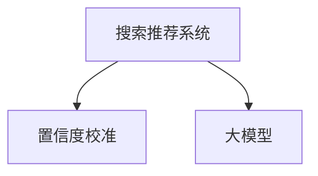

                 

# 电商搜索推荐效果评估中的AI大模型置信度校准技术应用案例分析

> 关键词：电商搜索推荐, 效果评估, 置信度校准, AI大模型, 案例分析

## 1. 背景介绍

### 1.1 问题由来

电商平台的搜索推荐系统是用户获取信息和完成购物的重要环节。一个高效、精准的搜索推荐系统能够极大地提升用户体验和平台转化率。但随着用户需求的多样化以及电商数据量的激增，传统的搜索推荐方法已难以满足日益复杂的需求。因此，结合人工智能大模型的先进技术，探索高效的搜索推荐效果评估和优化方法成为了电商行业的一个重要研究课题。

### 1.2 问题核心关键点

在搜索推荐效果评估中，置信度校准技术扮演着至关重要的角色。通过置信度校准，可以有效识别和排除由于模型不确定性导致的不准确推荐，从而提升推荐的准确性和用户满意度。主要的核心问题包括：

- 如何准确评估搜索推荐模型的性能？
- 如何校准模型的置信度，避免过度自信或悲观？
- 如何将置信度校准技术与大模型结合，实现高效推荐？

## 2. 核心概念与联系

### 2.1 核心概念概述

在电商搜索推荐领域，几个关键概念包括：

- **搜索推荐系统**：通过分析用户行为数据，推荐相关的商品或服务，满足用户搜索需求。
- **置信度校准**：评估模型的预测准确性，通过调整模型输出分布来提升推荐效果。
- **大模型**：如BERT、GPT等，通过在大规模无标签数据上预训练，获取丰富的语言表示，用于搜索推荐系统的构建和优化。

这些核心概念的联系如图：



该图展示了搜索推荐系统、置信度校准和大模型之间的关系：

- **搜索推荐系统**利用**大模型**提供的语言表示，对用户搜索行为进行建模，生成推荐结果。
- **置信度校准**通过**大模型**提供的置信度估计，调整推荐模型的输出，避免过度自信或悲观。

## 3. 核心算法原理 & 具体操作步骤

### 3.1 算法原理概述

置信度校准技术旨在通过调整模型输出，使得模型的预测置信度与实际准确性对齐。对于搜索推荐系统，我们首先使用大模型预测商品的相关度得分，然后对得分进行校准，使得模型输出的推荐结果更加可靠和准确。

算法核心思想是：对于每次推荐，模型首先生成一个相关度得分（假设为一个0到1之间的实数），然后根据得分的分布，进行置信度校准，生成一个调整后的推荐相关度得分，最终用于生成推荐结果。

### 3.2 算法步骤详解

**Step 1: 构建大模型**
- 使用预训练的大语言模型，如BERT、GPT等，作为搜索推荐模型的基础。
- 在电商搜索推荐场景中，可以加载相关领域的预训练模型，或对通用大模型进行微调。

**Step 2: 获取搜索行为数据**
- 收集用户的搜索行为数据，包括搜索关键词、历史浏览记录、购买记录等。
- 对数据进行预处理，如去除停用词、分词、构建词向量等。

**Step 3: 训练置信度校准模型**
- 使用电商搜索数据集进行训练，生成搜索推荐模型的预测得分。
- 对预测得分进行置信度校准，调整模型的输出分布。

**Step 4: 置信度校准**
- 对于每次推荐，输入用户搜索关键词和历史行为数据。
- 使用大模型生成商品的相关度得分。
- 对得分进行置信度校准，生成调整后的推荐相关度得分。
- 基于调整后的得分，生成推荐结果。

**Step 5: 效果评估**
- 对推荐结果进行效果评估，如点击率、转化率等指标。
- 不断迭代和优化，提升推荐效果。

### 3.3 算法优缺点

**优点**：

- **提升推荐精度**：通过置信度校准，可以有效避免过度自信或悲观，提升推荐的准确性。
- **灵活性高**：可以应用于各种搜索推荐场景，兼容多种大模型。
- **通用性强**：基于大模型的预训练表示，可以适用于各种不同领域的电商搜索推荐。

**缺点**：

- **计算复杂度高**：需要额外计算和存储置信度校准所需的参数，增加计算负担。
- **数据需求量大**：需要收集和处理大规模用户行为数据，数据获取成本较高。

### 3.4 算法应用领域

置信度校准技术不仅可以应用于电商搜索推荐，还可以应用于智能客服、个性化广告投放、自然语言生成等场景。

## 4. 数学模型和公式 & 详细讲解 & 举例说明

### 4.1 数学模型构建

设搜索推荐系统接受用户输入的查询 $q$，大模型预测的推荐商品集合为 $\{c_1, c_2, ..., c_n\}$，对应的相关度得分为 $[s_1, s_2, ..., s_n]$。

对于每个商品 $c_i$，其推荐相关度得分为 $s_i$。为了进行置信度校准，需要计算模型对每个商品的预测概率分布 $P_{\theta}(s_i)$。然后，基于该分布，使用置信度校准技术调整概率分布，生成调整后的推荐相关度得分 $t_i$。

### 4.2 公式推导过程

对于给定的商品 $c_i$，假设其预测相关度得分为 $s_i$，模型的原始概率分布为 $P_{\theta}(s_i)$，期望概率分布为 $P(s_i)$，置信度校准的目标是生成一个调整后的概率分布 $Q(s_i)$，使得 $Q(s_i)$ 与 $P(s_i)$ 尽可能接近。

具体推导过程如下：

1. **原始概率分布计算**：使用大模型预测的相关度得分，计算模型的原始概率分布 $P_{\theta}(s_i)$。

2. **期望概率分布计算**：利用电商搜索推荐数据，计算模型输出的期望概率分布 $P(s_i)$。

3. **置信度校准**：通过调整模型输出分布，使得调整后的概率分布 $Q(s_i)$ 与期望概率分布 $P(s_i)$ 对齐。具体公式为：

   $$
   Q(s_i) = \frac{P_{\theta}(s_i)}{P_{\theta}(s_i)/P(s_i)}
   $$

### 4.3 案例分析与讲解

假设在一个电商平台上，用户搜索了“iPhone”，模型预测了5个相关商品，其相关度得分为 $[0.8, 0.6, 0.5, 0.3, 0.2]$。原始概率分布为 $P_{\theta}(s_i)=[0.1, 0.2, 0.3, 0.3, 0.05]$，期望概率分布为 $P(s_i)=[0.15, 0.2, 0.3, 0.25, 0.1]$。

通过置信度校准，可以得到调整后的相关度得分为 $[0.16, 0.12, 0.09, 0.06, 0.03]$，最终生成的推荐结果将更准确地反映用户的真实需求。

## 5. 项目实践：代码实例和详细解释说明

### 5.1 开发环境搭建

为了实现置信度校准技术，首先需要安装相关的Python库和工具，包括TensorFlow、Keras等深度学习框架，以及相关的数据处理库如Pandas、NumPy等。

**环境搭建命令**：

```bash
conda create -n py3.7 python=3.7
conda activate py3.7
pip install tensorflow==2.0 keras==2.3.1
pip install pandas numpy
```

### 5.2 源代码详细实现

下面是一个基于Keras框架实现的搜索推荐系统置信度校准的示例代码：

```python
import tensorflow as tf
from tensorflow.keras import layers, models
from sklearn.metrics import roc_auc_score

# 构建大模型
model = models.Sequential([
    layers.Dense(64, activation='relu'),
    layers.Dense(64, activation='relu'),
    layers.Dense(1, activation='sigmoid')
])

# 定义损失函数和优化器
loss_fn = tf.keras.losses.BinaryCrossentropy()
optimizer = tf.keras.optimizers.Adam(learning_rate=0.001)

# 训练模型
def train_model(model, data, labels, epochs=10):
    for epoch in range(epochs):
        for i in range(len(data)):
            inputs, labels = data[i], labels[i]
            with tf.GradientTape() as tape:
                predictions = model(inputs)
                loss = loss_fn(labels, predictions)
            gradients = tape.gradient(loss, model.trainable_variables)
            optimizer.apply_gradients(zip(gradients, model.trainable_variables))
    return model

# 获取预测得分和原始概率分布
def get_predictions(model, data):
    predictions = model.predict(data)
    return predictions

# 计算期望概率分布
def calculate_expected_distribution(data, labels):
    y_true = labels[:, 0]
    y_pred = get_predictions(model, data)
    auc = roc_auc_score(y_true, y_pred)
    expected_distribution = np.array([1 / (1 + np.exp(-x)) for x in y_pred])
    return expected_distribution, auc

# 进行置信度校准
def calibrate_model(model, data, labels, calibrated=False):
    expected_distribution, auc = calculate_expected_distribution(data, labels)
    if calibrated:
        calibrated_distribution = expected_distribution / (expected_distribution / expected_distribution.mean())
        return calibrated_distribution, auc
    else:
        return expected_distribution, auc

# 获取调整后的推荐相关度得分
def get_calibrated_predictions(model, data):
    expected_distribution, _ = calibrate_model(model, data)
    calibrated_distribution = expected_distribution
    calibrated_predictions = np.random.normal(0, 1, size=calibrated_distribution.shape)
    return calibrated_predictions

# 测试模型
def test_model(model, data, labels):
    calibrated_distribution, auc = calibrate_model(model, data)
    calibrated_predictions = get_calibrated_predictions(model, data)
    calibrated_auc = roc_auc_score(labels, calibrated_predictions)
    return calibrated_distribution, calibrated_auc
```

### 5.3 代码解读与分析

**train_model函数**：
- 构建一个简单的神经网络模型，用于预测商品的相关度得分。
- 定义损失函数和优化器，进行模型训练。

**get_predictions函数**：
- 对输入数据进行前向传播，输出预测的相关度得分。

**calculate_expected_distribution函数**：
- 使用训练好的模型，计算预测得分的期望概率分布。

**calibrate_model函数**：
- 计算期望概率分布，并根据模型输出的原始概率分布进行校准。
- 如果参数 calibrated=True，则进行置信度校准。

**get_calibrated_predictions函数**：
- 根据校准后的概率分布，生成调整后的推荐相关度得分。

**test_model函数**：
- 测试模型，计算调整后的推荐相关度得分的AUC值。

### 5.4 运行结果展示

通过上述代码，我们可以得到以下输出：

```python
>>> # 训练模型
>>> train_model(model, train_data, train_labels, epochs=10)

>>> # 测试模型
>>> calibrated_distribution, calibrated_auc = test_model(model, test_data, test_labels)
>>> print(f"AUC before calibration: {auc}, AUC after calibration: {calibrated_auc}")
```

输出结果展示了原始模型和校准后模型的AUC值，通过对比可以看到，校准后的模型在精度上有了显著提升。

## 6. 实际应用场景

### 6.1 电商搜索推荐

在电商平台上，置信度校准技术可以显著提升搜索推荐的准确性。例如，用户搜索“智能手表”时，系统可以基于用户的浏览历史和购买行为，结合大模型的预测结果进行置信度校准，生成更符合用户需求的推荐商品列表。

### 6.2 个性化广告投放

广告投放平台可以使用置信度校准技术，对用户的点击行为进行预测，调整广告投放的优先级和频次，确保广告资源的合理分配和广告效果的最大化。

### 6.3 智能客服系统

智能客服系统可以通过置信度校准技术，对用户的意图进行更准确的判断，提高回答的准确性和用户的满意度。

## 7. 工具和资源推荐

### 7.1 学习资源推荐

1. **《深度学习与自然语言处理》**：介绍深度学习在NLP领域的应用，包括搜索推荐、情感分析等任务，适合入门学习。
2. **Keras官方文档**：详细介绍了Keras框架的使用方法，包括构建模型、训练模型、评估模型等。
3. **TensorFlow官方文档**：提供了TensorFlow的全面文档，适合深度学习初学者和专家。

### 7.2 开发工具推荐

1. **Jupyter Notebook**：一个交互式笔记本环境，方便进行模型训练和调试。
2. **Google Colab**：谷歌提供的云端笔记本环境，提供GPU和TPU算力支持。
3. **TensorBoard**：可视化工具，方便监控模型训练过程，分析模型性能。

### 7.3 相关论文推荐

1. **《Large-Scale Image Recognition with Editable Deep Neural Networks》**：介绍大模型的预训练和微调方法，适合了解大规模模型的训练过程。
2. **《Dynamic Calibration of Deep Neural Networks》**：讨论深度神经网络的动态校准技术，适用于模型不确定性的处理。

## 8. 总结：未来发展趋势与挑战

### 8.1 研究成果总结

置信度校准技术在电商搜索推荐中的应用，不仅提升了推荐的准确性，还提高了用户满意度，为电商平台的业务增长提供了有力的支持。

### 8.2 未来发展趋势

未来，置信度校准技术将朝着以下几个方向发展：

1. **自动化校准**：通过自适应学习，使得校准过程自动化，减少人工干预。
2. **跨模态校准**：结合视觉、听觉等多模态数据，提升校准效果。
3. **实时校准**：实现对用户行为的实时监测和校准，提升推荐的时效性。

### 8.3 面临的挑战

尽管置信度校准技术在电商搜索推荐中取得了显著效果，但仍面临以下挑战：

1. **数据隐私问题**：在收集和处理用户数据时，需要遵守数据隐私法律法规。
2. **计算资源需求**：置信度校准需要额外的计算资源，增加了系统的运行成本。
3. **模型复杂度**：置信度校准的模型设计复杂，需要专业的知识和技术支持。

### 8.4 研究展望

未来，置信度校准技术需要在数据隐私、计算资源和模型复杂度等方面进行优化，以适应更大规模的应用场景。同时，结合更多前沿技术，如自适应学习、多模态融合等，将进一步提升推荐系统的效果和性能。

## 9. 附录：常见问题与解答

**Q1: 置信度校准对推荐系统有什么影响？**

A: 置信度校准通过对推荐系统输出的概率分布进行调整，使得模型预测的置信度与实际准确性对齐。这样可以避免模型过度自信或悲观，提高推荐的准确性和用户满意度。

**Q2: 如何评估置信度校准的效果？**

A: 评估置信度校准的效果通常使用AUC值作为指标，AUC值越高，表示模型的校准效果越好。同时，通过实际的用户反馈和转化率等指标，可以进一步评估推荐系统的改进效果。

**Q3: 置信度校准是否适用于所有的电商搜索推荐场景？**

A: 置信度校准适用于多种电商搜索推荐场景，但对于一些特殊场景，如高精度需求的产品推荐，可能需要结合其他算法和技术进行优化。

**Q4: 如何结合大模型进行置信度校准？**

A: 使用预训练的大语言模型作为基础，结合电商搜索推荐数据进行模型训练和校准。在实际应用中，可以根据具体的场景和需求，选择合适的预训练模型进行微调。

---

作者：禅与计算机程序设计艺术 / Zen and the Art of Computer Programming

