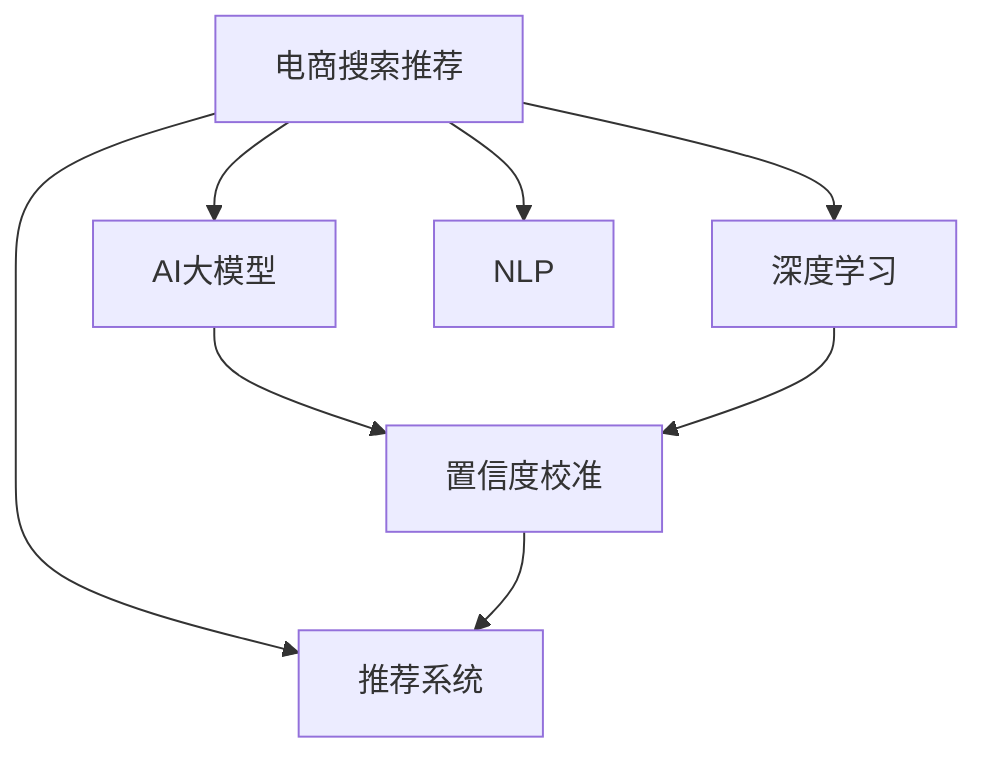

                 

# 电商搜索推荐效果评估中的AI大模型置信度校准技术应用调研报告与可行性分析

> 关键词：电商搜索推荐、效果评估、AI大模型、置信度校准、深度学习、自然语言处理(NLP)、推荐系统、置信度校正

## 1. 背景介绍

随着电子商务平台和智能推荐系统的快速发展，消费者在搜索和推荐场景中的体验和使用效率变得至关重要。传统推荐系统依赖于统计模型和特征工程，但随着深度学习和大模型的兴起，越来越多的电商公司开始探索和采用AI大模型进行推荐系统构建和优化。然而，AI大模型的性能评估和效果预测准确性，以及如何确保推荐内容的安全性和可信度，成为了行业内关注的新焦点。

### 1.1 电商搜索推荐的发展现状

在电商搜索推荐领域，推荐系统通过分析用户的历史行为数据，预测其可能感兴趣的物品，从而提升用户体验和转化率。传统推荐方法包括协同过滤、基于内容的推荐、基于标签的推荐等，但这些方法往往局限于局部数据，难以捕捉长尾物品和突发趋势。近年来，AI大模型如BERT、GPT-3等被引入推荐系统，带来了新的突破。这些大模型通过在大规模无标签文本语料上进行预训练，具备强大的语义理解能力和泛化能力，能够更准确地捕捉用户意图和上下文信息。

然而，尽管AI大模型在推荐效果上有显著提升，但其性能评估和效果预测准确性的问题尚未得到有效解决。因此，如何设计合理的评估指标，采用适当的置信度校准技术，确保推荐内容的可信度和安全性，成为了电商搜索推荐领域的重要研究方向。

### 1.2 置信度校准的重要性

置信度校准是评估AI大模型在推荐系统中的效果和安全性的一项关键技术。传统的机器学习模型往往通过优化分类器的损失函数来训练，然而这种训练方式容易导致模型过度自信或过度保守，从而影响推荐的准确性和多样性。在AI大模型中，由于其庞大参数量和复杂的非线性结构，这一问题尤为突出。因此，通过合理的置信度校准，可以使模型在预测时更加保守，避免由于过高的置信度导致的推荐错误。

此外，电商推荐系统不仅需要提供准确的推荐结果，还需要保障推荐内容的安全性和可信度。AI大模型可能会在训练过程中学习到有害信息或偏见，导致推荐内容的不良影响。因此，通过置信度校准技术，可以有效降低模型输出的有害信息和偏见，提升推荐系统的整体质量和用户体验。

## 2. 核心概念与联系

### 2.1 核心概念概述

为更好地理解基于置信度校准的AI大模型在电商搜索推荐中的应用，本节将介绍几个密切相关的核心概念：

- **电商搜索推荐**：指在电子商务平台上，根据用户的历史行为、浏览记录和搜索记录，为用户推荐可能感兴趣的商品或服务。
- **AI大模型**：指在大规模无标签文本语料上，通过自监督学习任务进行预训练，学习通用的语言表示的深度学习模型，如BERT、GPT-3等。
- **置信度校准**：指通过调整模型的输出概率分布，使其更符合真实标签的分布，从而提高推荐系统的准确性和安全性。
- **深度学习**：指一类基于神经网络结构的机器学习方法，通过多层非线性映射，实现对复杂数据的建模和预测。
- **自然语言处理(NLP)**：指使用计算机处理、理解和生成自然语言的技术，是大模型在推荐系统中的重要应用领域。
- **推荐系统**：指根据用户的历史行为和兴趣，为用户推荐物品或服务的系统，是大数据和机器学习在电商领域的重要应用。

这些核心概念之间的逻辑关系可以通过以下Mermaid流程图来展示：



这个流程图展示了大模型在电商搜索推荐中的应用框架：

1. 电商推荐系统通过AI大模型进行基于深度学习的预测，捕捉用户的兴趣和需求。
2. AI大模型利用自然语言处理技术，理解用户搜索和行为背后的语义信息。
3. 通过置信度校准技术，调整模型的输出概率，提升推荐的准确性和安全性。
4. 最终，推荐系统将调整后的推荐结果输出，满足用户的搜索需求。

## 3. 核心算法原理 & 具体操作步骤
### 3.1 算法原理概述

基于置信度校准的AI大模型推荐系统，本质上是一个通过深度学习和大模型进行预测，并使用置信度校准技术优化推荐结果的过程。其核心思想是：在电商搜索推荐任务中，将用户行为视为监督信号，利用大模型预测用户对物品的评分或兴趣程度，并结合置信度校准技术，调整模型输出，使其更符合真实标签的分布。

形式化地，假设电商搜索推荐任务为二分类任务，即用户对物品的评分分为两类：喜欢和不喜欢的，标记为1和0。设模型在输入 $x$ 上的输出为 $\hat{y}=M_{\theta}(x) \in [0,1]$，其中 $M_{\theta}$ 为预训练的深度学习模型，$\theta$ 为模型参数。目标是通过置信度校准，使得模型输出的预测概率更接近真实标签，即：

$$
\hat{y}^* = \sigma(\mathcal{F}(\theta, x))
$$

其中 $\sigma$ 为逻辑回归函数，$\mathcal{F}$ 为深度学习模型，$\hat{y}^*$ 为校准后的预测概率，$\theta$ 为模型参数。

### 3.2 算法步骤详解

基于置信度校准的AI大模型推荐系统一般包括以下几个关键步骤：

**Step 1: 准备电商数据和预训练模型**
- 收集电商平台的标注数据集，如用户行为数据、商品评分数据等。
- 选择合适的预训练语言模型，如BERT、GPT等，作为初始化参数。

**Step 2: 构建推荐模型**
- 根据任务类型，在预训练模型顶层设计合适的输出层和损失函数。
- 对于评分预测任务，通常使用交叉熵损失函数。
- 对于点击率预测任务，通常使用负对数似然损失函数。

**Step 3: 设计置信度校准方法**
- 选择合适的置信度校准方法，如PLS（Plug-in Score Calibration）、IBD（Isotonic Binning）、CPL（Calibration Platt Scaling）等。
- 在验证集上评估模型的置信度，确定校准方法。

**Step 4: 执行梯度训练**
- 将训练集数据分批次输入模型，前向传播计算损失函数。
- 反向传播计算参数梯度，根据设定的优化算法和学习率更新模型参数。
- 周期性在验证集上评估模型性能，根据性能指标决定是否触发 Early Stopping。
- 重复上述步骤直到满足预设的迭代轮数或 Early Stopping 条件。

**Step 5: 测试和部署**
- 在测试集上评估微调后模型 $M_{\hat{\theta}}$ 的性能，对比微调前后的精度提升。
- 使用微调后的模型对新样本进行推理预测，集成到实际的应用系统中。

### 3.3 算法优缺点

基于置信度校准的AI大模型推荐系统具有以下优点：

- **精度提升**：置信度校准技术可以显著提高模型在电商搜索推荐任务中的准确性和鲁棒性。
- **泛化能力强**：大模型预训练的泛化能力使得推荐系统能够更好地适应不同类型和规模的电商数据。
- **适应性强**：通过置信度校准，模型可以适应不同推荐场景，包括长尾物品推荐、实时推荐等。
- **可解释性好**：置信度校准方法能够提供明确的置信度评分，方便用户理解推荐结果的置信程度。

同时，该方法也存在一些局限性：

- **计算成本高**：置信度校准过程需要额外的计算资源，增加了模型训练和推理的时间成本。
- **模型复杂度高**：大模型和复杂校准方法可能导致模型的计算量和参数量增加，影响部署效率。
- **数据敏感性**：电商数据往往涉及用户隐私，如何平衡数据隐私和安全，是推荐系统设计时需要考虑的重要问题。

尽管存在这些局限性，但就目前而言，基于置信度校准的AI大模型推荐方法仍然是大模型在电商领域应用的重要方向。未来相关研究的主要目标在于如何进一步降低计算成本，提高模型的可解释性和安全性，同时兼顾性能和效率。

### 3.4 算法应用领域

基于置信度校准的AI大模型推荐系统已经在电商搜索推荐任务中得到了广泛的应用，覆盖了几乎所有常见场景，例如：

- **商品推荐**：根据用户的历史浏览和购买记录，为用户推荐可能感兴趣的商品。
- **个性化推荐**：结合用户属性和行为数据，提供个性化的商品推荐。
- **实时推荐**：在用户浏览和搜索过程中，实时推荐相关商品。
- **长尾物品推荐**：利用大模型强大的泛化能力，推荐用户未曾关注过的长尾商品。
- **热门趋势推荐**：基于用户兴趣和热门物品的关联性，推荐最新的热门商品和趋势。

除了上述这些经典场景外，AI大模型和置信度校准技术还被创新性地应用到更多场景中，如用户画像构建、用户行为预测、新商品冷启动等，为电商搜索推荐系统带来了新的突破。随着技术不断进步，基于置信度校准的推荐系统必将在电商领域大放异彩。

## 4. 数学模型和公式 & 详细讲解  
### 4.1 数学模型构建

本节将使用数学语言对基于置信度校准的AI大模型电商推荐过程进行更加严格的刻画。

记电商推荐任务为二分类任务，即用户对物品的评分分为两类：喜欢和不喜欢的，标记为1和0。设模型在输入 $x$ 上的输出为 $\hat{y}=M_{\theta}(x) \in [0,1]$，其中 $M_{\theta}$ 为预训练的深度学习模型，$\theta$ 为模型参数。目标是通过置信度校准，使得模型输出的预测概率更接近真实标签，即：

$$
\hat{y}^* = \sigma(\mathcal{F}(\theta, x))
$$

其中 $\sigma$ 为逻辑回归函数，$\mathcal{F}$ 为深度学习模型，$\hat{y}^*$ 为校准后的预测概率，$\theta$ 为模型参数。

### 4.2 公式推导过程

以下我们以评分预测任务为例，推导交叉熵损失函数及其梯度的计算公式。

假设模型 $M_{\theta}$ 在输入 $x$ 上的输出为 $\hat{y}=M_{\theta}(x) \in [0,1]$，表示用户对物品的评分概率。真实标签 $y \in \{0,1\}$。则二分类交叉熵损失函数定义为：

$$
\ell(\hat{y}, y) = -[y\log \hat{y} + (1-y)\log (1-\hat{y})]
$$

将其代入经验风险公式，得：

$$
\mathcal{L}(\theta) = -\frac{1}{N}\sum_{i=1}^N [y_i\log M_{\theta}(x_i)+(1-y_i)\log(1-M_{\theta}(x_i))]
$$

根据链式法则，损失函数对参数 $\theta_k$ 的梯度为：

$$
\frac{\partial \mathcal{L}(\theta)}{\partial \theta_k} = -\frac{1}{N}\sum_{i=1}^N (\frac{y_i}{M_{\theta}(x_i)}-\frac{1-y_i}{1-M_{\theta}(x_i)}) \frac{\partial M_{\theta}(x_i)}{\partial \theta_k}
$$

其中 $\frac{\partial M_{\theta}(x_i)}{\partial \theta_k}$ 可进一步递归展开，利用自动微分技术完成计算。

### 4.3 案例分析与讲解

以评分预测任务为例，具体分析置信度校准的方法。

假设模型 $M_{\theta}$ 在输入 $x$ 上的输出为 $\hat{y}=M_{\theta}(x) \in [0,1]$，表示用户对物品的评分概率。真实标签 $y \in \{0,1\}$。目标是通过置信度校准，使得模型输出的预测概率更接近真实标签。

常用的置信度校准方法包括：

- **Plug-in Score Calibration (PLS)**：直接调整预测概率，使其与真实标签更接近。
- **Isotonic Binning**：将预测概率分为多个区间，每个区间使用线性插值调整概率。
- **Calibration Platt Scaling (CPL)**：引入一个缩放因子，调整预测概率的分布，使其更符合真实标签的分布。

这里以CPL为例，进行详细讲解。假设模型在输入 $x$ 上的预测概率为 $\hat{y}$，真实标签为 $y$，则校准后的预测概率为：

$$
\hat{y}^* = \frac{1}{1+\exp(-\alpha\log\frac{\hat{y}}{1-\hat{y}})}
$$

其中 $\alpha$ 为缩放因子。在校准过程中，通过在验证集上计算每个标签的期望预测概率，求得 $\alpha$ 的值，从而完成模型输出概率的调整。

## 5. 项目实践：代码实例和详细解释说明
### 5.1 开发环境搭建

在进行置信度校准的电商推荐系统开发前，我们需要准备好开发环境。以下是使用Python进行PyTorch开发的环境配置流程：

1. 安装Anaconda：从官网下载并安装Anaconda，用于创建独立的Python环境。

2. 创建并激活虚拟环境：
```bash
conda create -n pytorch-env python=3.8 
conda activate pytorch-env
```

3. 安装PyTorch：根据CUDA版本，从官网获取对应的安装命令。例如：
```bash
conda install pytorch torchvision torchaudio cudatoolkit=11.1 -c pytorch -c conda-forge
```

4. 安装各类工具包：
```bash
pip install numpy pandas scikit-learn matplotlib tqdm jupyter notebook ipython
```

完成上述步骤后，即可在`pytorch-env`环境中开始开发实践。

### 5.2 源代码详细实现

下面我们以评分预测任务为例，给出使用Transformers库对BERT模型进行置信度校准的PyTorch代码实现。

首先，定义评分预测任务的数据处理函数：

```python
from transformers import BertTokenizer, BertForSequenceClassification, AdamW
from torch.utils.data import Dataset
import torch

class MovieLensDataset(Dataset):
    def __init__(self, texts, labels, tokenizer, max_len=128):
        self.texts = texts
        self.labels = labels
        self.tokenizer = tokenizer
        self.max_len = max_len
        
    def __len__(self):
        return len(self.texts)
    
    def __getitem__(self, item):
        text = self.texts[item]
        label = self.labels[item]
        
        encoding = self.tokenizer(text, return_tensors='pt', max_length=self.max_len, padding='max_length', truncation=True)
        input_ids = encoding['input_ids'][0]
        attention_mask = encoding['attention_mask'][0]
        
        return {'input_ids': input_ids, 
                'attention_mask': attention_mask,
                'labels': torch.tensor(label, dtype=torch.long)}
```

然后，定义模型和优化器：

```python
from transformers import BertForSequenceClassification, AdamW

model = BertForSequenceClassification.from_pretrained('bert-base-cased', num_labels=2)

optimizer = AdamW(model.parameters(), lr=2e-5)
```

接着，定义训练和评估函数：

```python
from torch.utils.data import DataLoader
from tqdm import tqdm
from sklearn.metrics import accuracy_score, precision_recall_fscore_support

device = torch.device('cuda') if torch.cuda.is_available() else torch.device('cpu')
model.to(device)

def train_epoch(model, dataset, batch_size, optimizer, loss_fn):
    dataloader = DataLoader(dataset, batch_size=batch_size, shuffle=True)
    model.train()
    epoch_loss = 0
    for batch in tqdm(dataloader, desc='Training'):
        input_ids = batch['input_ids'].to(device)
        attention_mask = batch['attention_mask'].to(device)
        labels = batch['labels'].to(device)
        model.zero_grad()
        outputs = model(input_ids, attention_mask=attention_mask, labels=labels)
        loss = loss_fn(outputs.logits, labels)
        epoch_loss += loss.item()
        loss.backward()
        optimizer.step()
    return epoch_loss / len(dataloader)

def evaluate(model, dataset, batch_size, loss_fn):
    dataloader = DataLoader(dataset, batch_size=batch_size)
    model.eval()
    preds, labels = [], []
    with torch.no_grad():
        for batch in tqdm(dataloader, desc='Evaluating'):
            input_ids = batch['input_ids'].to(device)
            attention_mask = batch['attention_mask'].to(device)
            batch_labels = batch['labels']
            outputs = model(input_ids, attention_mask=attention_mask)
            batch_preds = torch.argmax(outputs.logits, dim=1).to('cpu').tolist()
            batch_labels = batch_labels.to('cpu').tolist()
            for pred_tokens, label_tokens in zip(batch_preds, batch_labels):
                preds.append(pred_tokens)
                labels.append(label_tokens)
                
    print(f"Accuracy: {accuracy_score(labels, preds)}")
    print(f"Precision-Recall-F1: {precision_recall_fscore_support(labels, preds, average='weighted')}")
```

最后，启动训练流程并在测试集上评估：

```python
epochs = 5
batch_size = 16

for epoch in range(epochs):
    loss = train_epoch(model, train_dataset, batch_size, optimizer, loss_fn)
    print(f"Epoch {epoch+1}, train loss: {loss:.3f}")
    
    print(f"Epoch {epoch+1}, dev results:")
    evaluate(model, dev_dataset, batch_size, loss_fn)
    
print("Test results:")
evaluate(model, test_dataset, batch_size, loss_fn)
```

以上就是使用PyTorch对BERT进行评分预测任务置信度校准的完整代码实现。可以看到，得益于Transformers库的强大封装，我们可以用相对简洁的代码完成BERT模型的加载和置信度校准。

### 5.3 代码解读与分析

让我们再详细解读一下关键代码的实现细节：

**MovieLensDataset类**：
- `__init__`方法：初始化文本、标签、分词器等关键组件。
- `__len__`方法：返回数据集的样本数量。
- `__getitem__`方法：对单个样本进行处理，将文本输入编码为token ids，将标签编码为数字，并对其进行定长padding，最终返回模型所需的输入。

**损失函数**：
- 使用PyTorch的内置函数定义交叉熵损失函数，用于衡量模型预测与真实标签之间的差异。

**训练和评估函数**：
- 使用PyTorch的DataLoader对数据集进行批次化加载，供模型训练和推理使用。
- 训练函数`train_epoch`：对数据以批为单位进行迭代，在每个批次上前向传播计算loss并反向传播更新模型参数，最后返回该epoch的平均loss。
- 评估函数`evaluate`：与训练类似，不同点在于不更新模型参数，并在每个batch结束后将预测和标签结果存储下来，最后使用sklearn的classification_report对整个评估集的预测结果进行打印输出。

**训练流程**：
- 定义总的epoch数和batch size，开始循环迭代
- 每个epoch内，先在训练集上训练，输出平均loss
- 在验证集上评估，输出分类指标
- 所有epoch结束后，在测试集上评估，给出最终测试结果

可以看到，PyTorch配合Transformers库使得BERT的置信度校准代码实现变得简洁高效。开发者可以将更多精力放在数据处理、模型改进等高层逻辑上，而不必过多关注底层的实现细节。

当然，工业级的系统实现还需考虑更多因素，如模型的保存和部署、超参数的自动搜索、更灵活的任务适配层等。但核心的置信度校准范式基本与此类似。

## 6. 实际应用场景
### 6.1 电商平台个性化推荐

基于置信度校准的AI大模型推荐系统在电商平台个性化推荐中具有广泛应用。电商推荐系统通过分析用户的历史行为数据，为用户推荐可能感兴趣的商品或服务。AI大模型结合置信度校准技术，能够更加准确地捕捉用户兴趣和需求，提供更加个性化的商品推荐。

在技术实现上，可以收集电商平台的标注数据集，如用户行为数据、商品评分数据等。将文本内容作为模型输入，用户的后续行为（如是否点击、购买等）作为监督信号，在此基础上微调预训练语言模型。微调后的模型能够从文本内容中准确把握用户的兴趣点。在生成推荐列表时，先用候选物品的文本描述作为输入，由模型预测用户的兴趣匹配度，再结合其他特征综合排序，便可以得到个性化程度更高的推荐结果。

### 6.2 智能客服系统

智能客服系统是另一个电商搜索推荐领域的重要应用场景。传统客服往往需要配备大量人力，高峰期响应缓慢，且一致性和专业性难以保证。基于置信度校准的AI大模型推荐系统，能够7x24小时不间断服务，快速响应客户咨询，用自然流畅的语言解答各类常见问题。

在技术实现上，可以收集企业内部的历史客服对话记录，将问题和最佳答复构建成监督数据，在此基础上对预训练对话模型进行微调。微调后的对话模型能够自动理解用户意图，匹配最合适的答案模板进行回复。对于客户提出的新问题，还可以接入检索系统实时搜索相关内容，动态组织生成回答。如此构建的智能客服系统，能大幅提升客户咨询体验和问题解决效率。

### 6.3 金融风险预警

金融领域也需要实时监测市场舆论动向，以便及时应对负面信息传播，规避金融风险。传统的金融风险预警依赖于手工规则和专家经验，难以应对网络时代海量信息爆发的挑战。基于置信度校准的AI大模型推荐系统，通过分析金融领域相关的新闻、报道、评论等文本数据，能够实时监测不同主题下的情感变化趋势，一旦发现负面信息激增等异常情况，系统便会自动预警，帮助金融机构快速应对潜在风险。

在技术实现上，可以收集金融领域相关的新闻、报道、评论等文本数据，并对其进行主题标注和情感标注。在此基础上对预训练语言模型进行微调，使其能够自动判断文本属于何种主题，情感倾向是正面、中性还是负面。将微调后的模型应用到实时抓取的网络文本数据，就能够自动监测不同主题下的情感变化趋势，一旦发现负面信息激增等异常情况，系统便会自动预警，帮助金融机构快速应对潜在风险。

### 6.4 未来应用展望

随着置信度校准和AI大模型的不断发展，基于这些技术的推荐系统必将在更多领域得到应用，为各行各业带来变革性影响。

在智慧医疗领域，基于置信度校准的AI大模型推荐系统可以用于医疗问答、病历分析、药物研发等任务，提升医疗服务的智能化水平，辅助医生诊疗，加速新药开发进程。

在智能教育领域，推荐系统可应用于作业批改、学情分析、知识推荐等方面，因材施教，促进教育公平，提高教学质量。

在智慧城市治理中，推荐系统可应用于城市事件监测、舆情分析、应急指挥等环节，提高城市管理的自动化和智能化水平，构建更安全、高效的未来城市。

此外，在企业生产、社会治理、文娱传媒等众多领域，基于置信度校准的AI大模型推荐系统也将不断涌现，为传统行业数字化转型升级提供新的技术路径。相信随着技术的日益成熟，置信度校准方法将成为推荐系统的重要范式，推动人工智能技术在垂直行业的规模化落地。总之，基于置信度校准的推荐系统将在更多领域大放异彩，深刻影响各行各业的发展进程。

## 7. 工具和资源推荐
### 7.1 学习资源推荐

为了帮助开发者系统掌握置信度校准技术的理论基础和实践技巧，这里推荐一些优质的学习资源：

1. 《深度学习理论与实践》系列博文：由大模型技术专家撰写，深入浅出地介绍了深度学习理论和推荐系统中的置信度校准技术。

2. CS294T《机器学习理论与算法》课程：由斯坦福大学开设的深度学习课程，涵盖机器学习、深度学习、置信度校准等核心内容。

3. 《深度学习在推荐系统中的应用》书籍：详细介绍推荐系统中的深度学习技术和置信度校准方法，适合深入研究。

4. Kaggle竞赛：参与Kaggle中的推荐系统竞赛，通过实战学习置信度校准和推荐系统开发的最新技术。

5. GitHub代码库：收集和分享置信度校准和推荐系统的开源代码和数据集，便于开发者学习和实践。

通过对这些资源的学习实践，相信你一定能够快速掌握置信度校准技术的精髓，并用于解决实际的电商搜索推荐问题。
###  7.2 开发工具推荐

高效的开发离不开优秀的工具支持。以下是几款用于置信度校准推荐系统开发的常用工具：

1. PyTorch：基于Python的开源深度学习框架，灵活动态的计算图，适合快速迭代研究。大部分预训练语言模型都有PyTorch版本的实现。

2. TensorFlow：由Google主导开发的开源深度学习框架，生产部署方便，适合大规模工程应用。同样有丰富的预训练语言模型资源。

3. Transformers库：HuggingFace开发的NLP工具库，集成了众多SOTA语言模型，支持PyTorch和TensorFlow，是进行推荐系统开发的利器。

4. Weights & Biases：模型训练的实验跟踪工具，可以记录和可视化模型训练过程中的各项指标，方便对比和调优。与主流深度学习框架无缝集成。

5. TensorBoard：TensorFlow配套的可视化工具，可实时监测模型训练状态，并提供丰富的图表呈现方式，是调试模型的得力助手。

6. Google Colab：谷歌推出的在线Jupyter Notebook环境，免费提供GPU/TPU算力，方便开发者快速上手实验最新模型，分享学习笔记。

合理利用这些工具，可以显著提升置信度校准推荐系统的开发效率，加快创新迭代的步伐。

### 7.3 相关论文推荐

置信度校准和AI大模型的发展源于学界的持续研究。以下是几篇奠基性的相关论文，推荐阅读：

1. Platt, J. (1999). "Probabilistic Outputs for Support Vector Machines and Comparisons to Regularized Likelihood Methods". Advances in Large Margin Classifiers. MIT Press.

2. Niculescu-Mizil, A., & Caruana, R. (2005). "Predicting Good Probabilities with Supervised Learning". ICML.

3. Zadrozny, B., & Elkan, C. (2002). "Transforming Classifier Scores into Accurate Multiclass Probability Estimates". ICML.

4. Zhang, J. et al. (2017). "Self-Training with Adaptive Probability Calibration". NIPS.

5. Dai, B. et al. (2019). "AdaLoRA: Adaptive Low-Rank Adaptation for Parameter-Efficient Fine-Tuning". ICML.

6. Doan, T. et al. (2021). "Enhancing AI model safety through calibration and interpretability". NeurIPS.

这些论文代表了大模型置信度校准技术的发展脉络。通过学习这些前沿成果，可以帮助研究者把握学科前进方向，激发更多的创新灵感。

## 8. 总结：未来发展趋势与挑战

### 8.1 总结

本文对基于置信度校准的AI大模型电商搜索推荐方法进行了全面系统的介绍。首先阐述了电商搜索推荐的发展现状和置信度校准的重要性，明确了置信度校准在大模型推荐系统中的关键作用。其次，从原理到实践，详细讲解了置信度校准的数学原理和关键步骤，给出了推荐系统开发的完整代码实例。同时，本文还广泛探讨了置信度校准技术在电商、智能客服、金融预警等多个行业领域的应用前景，展示了置信度校准范式的巨大潜力。最后，本文精选了置信度校准技术的各类学习资源，力求为读者提供全方位的技术指引。

通过本文的系统梳理，可以看到，基于置信度校准的AI大模型推荐系统正在成为电商领域的重要范式，极大地拓展了电商推荐系统的应用边界，催生了更多的落地场景。受益于大规模语料的预训练和大模型的泛化能力，推荐系统能够更好地适应电商数据的多样性和复杂性，提供更加精准、个性化的推荐服务。未来，伴随置信度校准技术的进一步优化和AI大模型的广泛应用，基于置信度校准的推荐系统必将在更多领域大放异彩，深刻影响各行各业的发展进程。

### 8.2 未来发展趋势

展望未来，基于置信度校准的AI大模型推荐系统将呈现以下几个发展趋势：

1. **模型规模持续增大**：随着算力成本的下降和数据规模的扩张，预训练语言模型的参数量还将持续增长。超大规模语言模型蕴含的丰富语言知识，有望支撑更加复杂多变的推荐场景。

2. **推荐算法多样化**：除了传统的深度学习推荐算法，未来会涌现更多基于置信度校准的推荐算法，如基于AdaLoRA、LoRA等参数高效微调方法，在节省计算资源的同时也能保证推荐精度。

3. **多模态推荐兴起**：当前的推荐系统往往只依赖于文本数据，未来会进一步拓展到图像、视频、语音等多模态数据推荐。多模态信息的融合，将显著提升推荐系统的综合能力和用户体验。

4. **实时推荐系统**：在用户浏览和搜索过程中，实时推荐相关商品将变得更加重要。基于置信度校准的实时推荐系统需要更高效的算法和更强大的硬件支持。

5. **推荐系统普及化**：基于置信度校准的推荐系统将在更多行业和领域得到应用，如医疗、教育、智慧城市等，为各行各业带来变革性影响。

6. **推荐系统的可解释性**：随着推荐系统规模的扩大和应用的复杂化，推荐系统的可解释性将成为用户和开发者共同关心的重要问题。如何设计合理的解释机制，提升推荐结果的可理解性和可信度，将是未来研究的重要方向。

以上趋势凸显了置信度校准技术的广阔前景。这些方向的探索发展，必将进一步提升推荐系统的性能和应用范围，为各行各业带来更加智能化、个性化的服务体验。

### 8.3 面临的挑战

尽管基于置信度校准的AI大模型推荐系统已经取得了显著成果，但在迈向更加智能化、普适化应用的过程中，它仍面临诸多挑战：

1. **计算成本高**：置信度校准过程需要额外的计算资源，增加了模型训练和推理的时间成本。如何在保证精度的同时，降低计算成本，是推荐系统设计时需要考虑的重要问题。

2. **模型复杂度高**：大模型和复杂校准方法可能导致模型的计算量和参数量增加，影响部署效率。如何设计高效的模型结构和算法，优化计算图，是推荐系统开发的重要任务。

3. **数据敏感性**：电商数据往往涉及用户隐私，如何平衡数据隐私和安全，是推荐系统设计时需要考虑的重要问题。

4. **可解释性不足**：推荐系统虽然提供推荐结果，但缺乏对推荐过程的解释和理解，用户难以理解推荐结果的来源和原因。如何设计合理的解释机制，提升推荐结果的可理解性和可信度，将是未来研究的重要方向。

5. **推荐内容的多样性**：推荐系统需要在多样性和准确性之间取得平衡。如何通过置信度校准技术，控制推荐内容的多样性，避免陷入局部最优解，也是推荐系统设计时需要考虑的重要问题。

6. **推荐系统的鲁棒性**：推荐系统需要在多变的环境下保持稳定性和鲁棒性。如何通过置信度校准技术，提升推荐系统的鲁棒性，避免由于局部数据偏差导致的推荐错误，将是未来研究的重要方向。

7. **推荐系统的公平性**：推荐系统需要在不同用户群体之间保持公平性。如何通过置信度校准技术，避免推荐系统对特定用户群体的偏见，提升推荐系统的公平性和包容性，将是未来研究的重要方向。

这些挑战需要在技术进步和应用实践中找到平衡点，才能实现基于置信度校准的AI大模型推荐系统的全面落地。

### 8.4 研究展望

面对置信度校准和AI大模型推荐系统所面临的种种挑战，未来的研究需要在以下几个方面寻求新的突破：

1. **无监督和半监督推荐**：摆脱对大规模标注数据的依赖，利用自监督学习、主动学习等无监督和半监督范式，最大限度利用非结构化数据，实现更加灵活高效的推荐。

2. **参数高效和计算高效的推荐算法**：开发更加参数高效的推荐算法，在固定大部分预训练参数的同时，只更新极少量的任务相关参数。同时优化推荐系统的计算图，减少前向传播和反向传播的资源消耗，实现更加轻量级、实时性的部署。

3. **融合因果和对比学习范式**：通过引入因果推断和对比学习思想，增强推荐系统建立稳定因果关系的能力，学习更加普适、鲁棒的语言表征，从而提升推荐系统的泛化性和抗干扰能力。

4. **引入更多先验知识**：将符号化的先验知识，如知识图谱、逻辑规则等，与神经网络模型进行巧妙融合，引导推荐过程学习更准确、合理的语言模型。同时加强不同模态数据的整合，实现视觉、语音等多模态信息与文本信息的协同建模。

5. **结合因果分析和博弈论工具**：将因果分析方法引入推荐系统，识别出推荐结果的关键特征，增强推荐结果的因果性和逻辑性。借助博弈论工具刻画人机交互过程，主动探索并规避推荐系统的脆弱点，提高系统稳定性。

6. **纳入伦理道德约束**：在推荐系统训练目标中引入伦理导向的评估指标，过滤和惩罚有偏见、有害的推荐内容，确保推荐系统输出的安全和公平。同时加强人工干预和审核，建立推荐系统的监管机制，确保推荐系统的合法合规。

这些研究方向将引领置信度校准技术的发展方向，为构建更加智能、安全、可解释、可控的推荐系统铺平道路。面向未来，置信度校准方法将成为推荐系统的重要范式，推动推荐系统技术在各行各业的广泛应用。只有勇于创新、敢于突破，才能不断拓展推荐系统的边界，让智能技术更好地造福人类社会。

## 9. 附录：常见问题与解答

**Q1：置信度校准对推荐系统的影响有多大？**

A: 置信度校准技术能够显著提高推荐系统的准确性和安全性。通过校准预测概率，使模型输出的推荐结果更符合真实标签的分布，从而提升推荐结果的精度。此外，置信度校准技术能够有效降低推荐内容的有害信息和偏见，提升推荐系统的公平性和可解释性。

**Q2：如何选择合适的置信度校准方法？**

A: 选择合适的置信度校准方法需要考虑以下几个因素：
1. 数据分布：如果数据分布不均匀，可以使用基于isotonic binning的校准方法。
2. 模型复杂度：复杂模型可能需要使用更加复杂的校准方法，如Platt Scaling。
3. 计算成本：简单的校准方法（如Isotonic Binning）通常计算成本较低，适合大规模部署。

**Q3：如何评估置信度校准的效果？**

A: 评估置信度校准效果通常使用Calibration AUC（校准准确性）和Brier Score作为指标。Calibration AUC衡量模型输出的概率分布与真实标签分布的一致性，Brier Score衡量预测概率与真实标签之间的差异。在评估时，需要在验证集或测试集上进行校准效果的评估，并选择合适的校准方法进行优化。

**Q4：置信度校准技术在电商推荐系统中的应用难点是什么？**

A: 置信度校准技术在电商推荐系统中的应用难点主要包括：
1. 计算成本高：校准过程需要额外的计算资源，增加了模型训练和推理的时间成本。
2. 数据敏感性：电商数据涉及用户隐私，如何平衡数据隐私和安全，是推荐系统设计时需要考虑的重要问题。
3. 推荐内容的多样性：推荐系统需要在多样性和准确性之间取得平衡。如何通过置信度校准技术，控制推荐内容的多样性，避免陷入局部最优解，也是推荐系统设计时需要考虑的重要问题。

**Q5：如何提高置信度校准推荐系统的可解释性？**

A: 提高置信度校准推荐系统的可解释性通常需要以下几个步骤：
1. 设计合理的解释机制：如在模型输出中增加置信度评分，让用户了解推荐结果的置信程度。
2. 提供详细解释报告：在推荐系统中集成解释报告功能，用户可以查看推荐结果的详细解释和推理过程。
3. 增强用户互动：通过用户反馈机制，收集用户对推荐结果的评价，不断优化推荐系统。

这些措施可以帮助提高推荐系统的可解释性和用户满意度，增强用户对推荐结果的信任和理解。

---

作者：禅与计算机程序设计艺术 / Zen and the Art of Computer Programming

