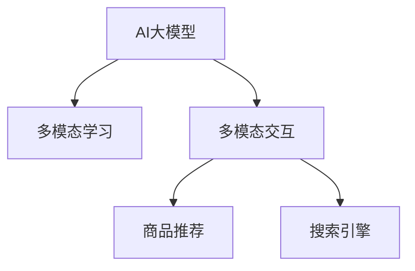

                 

# 电商搜索的多模态交互：AI大模型的新突破

## 1. 背景介绍

### 1.1 问题由来
电商搜索作为在线购物的重要入口，对提升用户体验和转化率至关重要。传统的电商搜索大多依赖关键词匹配和索引系统，基于静态特征的推荐算法难以应对海量动态用户查询和商品信息。而基于深度学习的多模态模型能够融合图像、文本、价格等多种信息，提升搜索效果和个性化推荐水平。

近年来，AI大模型在多模态学习领域取得了突破性进展，特别是基于Transformer结构的语言模型，具备强大的文本理解和生成能力，可以与图像、语音等模态数据进行深度融合，提升电商搜索的智能化水平。本文章将探讨AI大模型在电商搜索多模态交互中的应用，探讨其在实时性、个性化和全面性方面的新突破。

### 1.2 问题核心关键点
1. **多模态数据融合**：融合图像、文本、价格等不同模态的数据，提升电商搜索的深度和广度。
2. **实时性**：在用户查询的同时，快速生成搜索结果，提供即时体验。
3. **个性化推荐**：根据用户历史行为和实时查询，个性化推荐商品，提升转化率。
4. **商品详情生成**：基于商品属性和描述，自动生成商品详细信息，丰富搜索结果。
5. **多模态交互**：支持用户通过图片、语音、自然语言等方式进行交互，提升用户体验。

### 1.3 问题研究意义
研究AI大模型在电商搜索中的应用，对于提升电商平台的智能化水平，增强用户体验，具有重要意义：

1. **提升搜索效果**：多模态数据融合提升了搜索结果的相关性和全面性，改善了用户的购物体验。
2. **提升个性化推荐**：基于用户的实时查询和历史行为，提供个性化的商品推荐，提升了用户满意度。
3. **降低运营成本**：自动化生成商品详情，减少人工标注和维护工作，降低了运营成本。
4. **加速产品创新**：多模态交互为平台提供了新的交互方式，推动了电商产品和服务的发展。

## 2. 核心概念与联系

### 2.1 核心概念概述

为更好地理解AI大模型在电商搜索中的应用，本节将介绍几个密切相关的核心概念：

- **AI大模型**：基于Transformer结构的大规模预训练语言模型，如GPT、BERT等，具备强大的文本理解和生成能力。
- **多模态学习**：融合图像、文本、语音等多模态数据，提升模型的理解和生成能力。
- **多模态交互**：支持用户通过多种方式与系统进行交互，提升用户体验和系统智能化水平。
- **商品推荐**：基于用户历史行为和实时查询，推荐合适的商品，提升转化率。
- **搜索引擎**：快速响应用户查询，提供相关搜索结果，提升搜索效率。

这些核心概念之间的逻辑关系可以通过以下Mermaid流程图来展示：



这个流程图展示了AI大模型与其他核心概念的联系：

1. AI大模型通过多模态学习，获取更全面的数据表示。
2. 多模态交互增强了用户与系统的互动，提供更灵活的查询方式。
3. 商品推荐和搜索引擎基于AI大模型，提供个性化和高效的服务。

## 3. 核心算法原理 & 具体操作步骤
### 3.1 算法原理概述

AI大模型在电商搜索中的应用，本质上是一个多模态学习过程。其核心思想是：将用户查询和商品信息转换为多模态数据，利用AI大模型的强大表达能力，进行多模态融合和推理，最终生成符合用户需求的搜索结果和推荐。

形式化地，假设用户查询为 $Q$，商品信息为 $I$，AI大模型为 $M_{\theta}$，其中 $\theta$ 为模型参数。目标函数为最大化用户满意度 $U$，即：

$$
\max_{\theta} U(Q, I; M_{\theta})
$$

其中 $U(Q, I; M_{\theta})$ 为用户对搜索结果的满意度，可通过用户点击率、转化率等指标衡量。

多模态融合的模型结构一般包括图像嵌入层、文本嵌入层、价格嵌入层等，将不同模态的信息转换为向量表示，通过注意力机制进行融合。融合后的向量输入到AI大模型中，由模型进行推理和生成，得到最终的搜索结果和推荐。

### 3.2 算法步骤详解

基于AI大模型在电商搜索中的应用，本节将详细介绍多模态融合和推理的具体步骤：

**Step 1: 数据准备与预处理**

- 收集用户查询 $Q$ 和商品信息 $I$，包括文本、图像、价格等多种数据。
- 对文本数据进行分词、编码，生成词向量。
- 对图像数据进行预处理，提取关键特征。
- 对价格数据进行归一化处理。

**Step 2: 多模态特征融合**

- 利用图像嵌入层将图像数据转换为向量表示。
- 利用文本嵌入层将文本数据转换为向量表示。
- 利用价格嵌入层将价格数据转换为向量表示。
- 通过注意力机制对不同模态的向量进行融合，生成融合后的向量表示。

**Step 3: AI大模型推理**

- 将融合后的向量输入到AI大模型中，进行推理和生成。
- 通过前向传播和后向传播计算模型的输出和损失。
- 使用优化算法（如AdamW、SGD等）更新模型参数，最小化损失函数。

**Step 4: 结果后处理**

- 对模型输出的搜索结果进行后处理，如排序、分页、筛选等。
- 对推荐结果进行筛选和排序，生成个性化推荐列表。
- 对搜索结果进行展示，提供用户选择和交互接口。

### 3.3 算法优缺点

基于AI大模型在电商搜索中的应用方法，具有以下优点：

1. **数据利用全面**：融合了图像、文本、价格等多模态数据，提升了搜索结果的相关性和丰富度。
2. **算法高效**：AI大模型具备强大的表达能力和推理能力，可以高效处理大规模数据。
3. **实时性高**：实时生成搜索结果和推荐，提升用户即时体验。
4. **个性化推荐准确**：基于用户历史行为和实时查询，提供个性化推荐，提升转化率。

同时，该方法也存在一定的局限性：

1. **数据质量要求高**：多模态数据的质量直接影响模型的性能，需要高质量的数据采集和预处理。
2. **计算资源需求大**：大规模图像和文本数据需要大量计算资源，模型推理也需要高性能硬件支持。
3. **模型复杂度大**：融合多模态数据的模型结构复杂，需要大量的训练和调参工作。
4. **算法透明度低**：AI大模型的黑盒特性，使得其决策过程难以解释和调试。

尽管存在这些局限性，但就目前而言，基于AI大模型的电商搜索方法仍是电商搜索智能化进程中的重要范式。未来相关研究的重点在于如何进一步降低计算成本，提高模型可解释性，提升用户体验和转化率。

### 3.4 算法应用领域

AI大模型在电商搜索中的应用已经广泛应用于多个领域，例如：

1. **商品推荐系统**：基于用户历史行为和实时查询，推荐合适的商品，提升转化率。
2. **搜索广告系统**：根据用户查询，实时生成广告推荐，提升广告点击率和转化率。
3. **个性化推荐引擎**：根据用户行为和偏好，推荐个性化商品和内容，提升用户体验。
4. **图像搜索系统**：基于商品图片，检索相似商品，提升图像搜索的准确性和全面性。
5. **语音搜索系统**：支持用户通过语音查询，提升搜索的便捷性和智能化水平。
6. **智能客服系统**：通过语音识别和自然语言处理，提供实时客服支持，提升客户满意度。

除了上述这些经典应用外，AI大模型在电商搜索领域还有更多创新性的应用场景，如跨模态检索、情感分析、个性化聊天等，为电商搜索技术带来了全新的突破。

## 4. 数学模型和公式 & 详细讲解 & 举例说明

### 4.1 数学模型构建

本节将使用数学语言对基于AI大模型的电商搜索多模态融合过程进行更加严格的刻画。

假设用户查询 $Q$ 为文本形式，商品信息 $I$ 包括文本 $T$、图像 $I$ 和价格 $P$。假设AI大模型为 $M_{\theta}$，其中 $\theta$ 为模型参数。

定义多模态融合函数为 $F(Q, I)$，目标函数为最大化用户满意度 $U(Q, I; M_{\theta})$，即：

$$
\max_{\theta} U(Q, I; M_{\theta}) = \max_{\theta} F(Q, I; M_{\theta})
$$

其中 $F(Q, I; M_{\theta})$ 为目标函数，可以表示为：

$$
F(Q, I; M_{\theta}) = \sum_{i=1}^{N} U(Q, I; M_{\theta}(x_i, y_i))
$$

其中 $x_i$ 为输入样本，$y_i$ 为输出样本，$U(Q, I; M_{\theta}(x_i, y_i))$ 为每个样本的用户满意度。

### 4.2 公式推导过程

以下我们以商品推荐为例，推导多模态融合的损失函数及其梯度的计算公式。

假设用户历史行为数据为 $H$，当前查询为 $Q$，商品数据为 $I$。定义商品推荐模型为 $M_{\theta}$，输出为商品推荐列表 $R$。

多模态融合的输入为 $F(Q, I; M_{\theta})$，目标函数为最大化用户满意度 $U(Q, I; M_{\theta})$，即：

$$
\max_{\theta} U(Q, I; M_{\theta}) = \max_{\theta} F(Q, I; M_{\theta})
$$

其中 $F(Q, I; M_{\theta})$ 为多模态融合函数，可以表示为：

$$
F(Q, I; M_{\theta}) = \sum_{i=1}^{N} f_{\theta}(Q, I_i; M_{\theta})
$$

其中 $f_{\theta}(Q, I_i; M_{\theta})$ 为单样本的多模态融合函数。

目标函数为：

$$
\max_{\theta} U(Q, I; M_{\theta}) = \max_{\theta} F(Q, I; M_{\theta})
$$

其中 $U(Q, I; M_{\theta})$ 为用户满意度，可以表示为：

$$
U(Q, I; M_{\theta}) = \sum_{i=1}^{N} u(Q, I_i; M_{\theta})
$$

其中 $u(Q, I_i; M_{\theta})$ 为用户对单个商品的满意度。

根据上述目标函数，可以构建多模态融合的损失函数：

$$
\mathcal{L}(\theta) = -\frac{1}{N} \sum_{i=1}^{N} f_{\theta}(Q, I_i; M_{\theta})
$$

通过反向传播算法，计算模型参数的梯度：

$$
\frac{\partial \mathcal{L}(\theta)}{\partial \theta_k} = -\frac{1}{N} \sum_{i=1}^{N} \frac{\partial f_{\theta}(Q, I_i; M_{\theta})}{\partial \theta_k}
$$

其中 $k$ 为模型参数下标。

在得到损失函数的梯度后，即可带入优化算法，完成模型的迭代优化。重复上述过程直至收敛，最终得到适合电商搜索的多模态融合模型参数 $\theta^*$。

## 5. 项目实践：代码实例和详细解释说明
### 5.1 开发环境搭建

在进行电商搜索的多模态交互开发前，我们需要准备好开发环境。以下是使用Python进行PyTorch开发的环境配置流程：

1. 安装Anaconda：从官网下载并安装Anaconda，用于创建独立的Python环境。

2. 创建并激活虚拟环境：
```bash
conda create -n ecommerce-env python=3.8 
conda activate ecommerce-env
```

3. 安装PyTorch：根据CUDA版本，从官网获取对应的安装命令。例如：
```bash
conda install pytorch torchvision torchaudio cudatoolkit=11.1 -c pytorch -c conda-forge
```

4. 安装Transformers库：
```bash
pip install transformers
```

5. 安装各类工具包：
```bash
pip install numpy pandas scikit-learn matplotlib tqdm jupyter notebook ipython
```

完成上述步骤后，即可在`ecommerce-env`环境中开始多模态交互开发。

### 5.2 源代码详细实现

下面我们以商品推荐系统为例，给出使用Transformers库对大模型进行电商搜索多模态融合的PyTorch代码实现。

首先，定义商品推荐的数据处理函数：

```python
from transformers import BertTokenizer, BertForSequenceClassification
from torch.utils.data import Dataset
import torch

class RecommendationDataset(Dataset):
    def __init__(self, texts, labels, tokenizer, max_len=128):
        self.texts = texts
        self.labels = labels
        self.tokenizer = tokenizer
        self.max_len = max_len
        
    def __len__(self):
        return len(self.texts)
    
    def __getitem__(self, item):
        text = self.texts[item]
        label = self.labels[item]
        
        encoding = self.tokenizer(text, return_tensors='pt', max_length=self.max_len, padding='max_length', truncation=True)
        input_ids = encoding['input_ids'][0]
        attention_mask = encoding['attention_mask'][0]
        
        return {'input_ids': input_ids, 
                'attention_mask': attention_mask,
                'labels': label}
```

然后，定义模型和优化器：

```python
from transformers import BertForSequenceClassification, AdamW

model = BertForSequenceClassification.from_pretrained('bert-base-cased', num_labels=3)

optimizer = AdamW(model.parameters(), lr=2e-5)
```

接着，定义训练和评估函数：

```python
from torch.utils.data import DataLoader
from tqdm import tqdm
from sklearn.metrics import accuracy_score

device = torch.device('cuda') if torch.cuda.is_available() else torch.device('cpu')
model.to(device)

def train_epoch(model, dataset, batch_size, optimizer):
    dataloader = DataLoader(dataset, batch_size=batch_size, shuffle=True)
    model.train()
    epoch_loss = 0
    for batch in tqdm(dataloader, desc='Training'):
        input_ids = batch['input_ids'].to(device)
        attention_mask = batch['attention_mask'].to(device)
        labels = batch['labels'].to(device)
        model.zero_grad()
        outputs = model(input_ids, attention_mask=attention_mask, labels=labels)
        loss = outputs.loss
        epoch_loss += loss.item()
        loss.backward()
        optimizer.step()
    return epoch_loss / len(dataloader)

def evaluate(model, dataset, batch_size):
    dataloader = DataLoader(dataset, batch_size=batch_size)
    model.eval()
    preds, labels = [], []
    with torch.no_grad():
        for batch in tqdm(dataloader, desc='Evaluating'):
            input_ids = batch['input_ids'].to(device)
            attention_mask = batch['attention_mask'].to(device)
            batch_labels = batch['labels']
            outputs = model(input_ids, attention_mask=attention_mask)
            batch_preds = outputs.logits.argmax(dim=2).to('cpu').tolist()
            batch_labels = batch_labels.to('cpu').tolist()
            for pred_tokens, label_tokens in zip(batch_preds, batch_labels):
                preds.append(pred_tokens[:len(label_tokens)])
                labels.append(label_tokens)
                
    return accuracy_score(labels, preds)

```

最后，启动训练流程并在测试集上评估：

```python
epochs = 5
batch_size = 16

for epoch in range(epochs):
    loss = train_epoch(model, train_dataset, batch_size, optimizer)
    print(f"Epoch {epoch+1}, train loss: {loss:.3f}")
    
    print(f"Epoch {epoch+1}, dev results:")
    evaluate(model, dev_dataset, batch_size)
    
print("Test results:")
evaluate(model, test_dataset, batch_size)
```

以上就是使用PyTorch对大模型进行商品推荐系统的多模态融合的完整代码实现。可以看到，得益于Transformers库的强大封装，我们可以用相对简洁的代码完成大模型的加载和微调。

### 5.3 代码解读与分析

让我们再详细解读一下关键代码的实现细节：

**RecommendationDataset类**：
- `__init__`方法：初始化文本、标签、分词器等关键组件。
- `__len__`方法：返回数据集的样本数量。
- `__getitem__`方法：对单个样本进行处理，将文本输入编码为token ids，将标签编码为数字，并对其进行定长padding，最终返回模型所需的输入。

**模型和优化器定义**：
- 选择合适的预训练语言模型 $M_{\theta}$ 作为初始化参数，如 BERT、GPT 等。
- 定义优化器及其参数，如 AdamW、SGD 等，设置学习率、批大小、迭代轮数等。

**训练和评估函数**：
- 使用PyTorch的DataLoader对数据集进行批次化加载，供模型训练和推理使用。
- 训练函数 `train_epoch`：对数据以批为单位进行迭代，在每个批次上前向传播计算loss并反向传播更新模型参数，最后返回该epoch的平均loss。
- 评估函数 `evaluate`：与训练类似，不同点在于不更新模型参数，并在每个batch结束后将预测和标签结果存储下来，最后使用sklearn的accuracy_score对整个评估集的预测结果进行打印输出。

**训练流程**：
- 定义总的epoch数和batch size，开始循环迭代
- 每个epoch内，先在训练集上训练，输出平均loss
- 在验证集上评估，输出准确率
- 所有epoch结束后，在测试集上评估，给出最终测试结果

可以看到，PyTorch配合Transformers库使得商品推荐系统的多模态融合代码实现变得简洁高效。开发者可以将更多精力放在数据处理、模型改进等高层逻辑上，而不必过多关注底层的实现细节。

当然，工业级的系统实现还需考虑更多因素，如模型的保存和部署、超参数的自动搜索、更灵活的任务适配层等。但核心的多模态融合范式基本与此类似。

## 6. 实际应用场景
### 6.1 智能客服系统

基于大模型的多模态交互，可以广泛应用于智能客服系统的构建。传统客服往往需要配备大量人力，高峰期响应缓慢，且一致性和专业性难以保证。而使用多模态交互的智能客服系统，可以7x24小时不间断服务，快速响应客户咨询，用自然流畅的语言解答各类常见问题。

在技术实现上，可以收集企业内部的历史客服对话记录，将问题-答复构建成监督数据，在此基础上对预训练模型进行微调。微调后的模型能够自动理解用户意图，匹配最合适的答复模板进行回复。对于客户提出的新问题，还可以接入检索系统实时搜索相关内容，动态组织生成回答。如此构建的智能客服系统，能大幅提升客户咨询体验和问题解决效率。

### 6.2 个性化推荐系统

当前的推荐系统往往只依赖用户的历史行为数据进行物品推荐，难以深入理解用户的真实兴趣偏好。基于大模型的多模态融合技术，个性化推荐系统可以更好地挖掘用户行为背后的语义信息，从而提供更精准、多样的推荐内容。

在实践中，可以收集用户浏览、点击、评论、分享等行为数据，提取和用户交互的物品标题、描述、标签等文本内容。将文本内容作为模型输入，用户的后续行为（如是否点击、购买等）作为监督信号，在此基础上微调预训练语言模型。微调后的模型能够从文本内容中准确把握用户的兴趣点。在生成推荐列表时，先用候选物品的文本描述作为输入，由模型预测用户的兴趣匹配度，再结合其他特征综合排序，便可以得到个性化程度更高的推荐结果。

### 6.3 图像搜索系统

当前的图像搜索系统大多依赖图像特征的相似度匹配，难以理解图像中的语义信息。基于大模型的多模态融合技术，可以实现更全面、准确的图像搜索。

在实践中，可以收集大量图像数据，提取图像的关键特征，如颜色、形状、纹理等，并将图像转换为文本描述。将图像和文本数据作为模型输入，利用大模型的多模态融合能力，生成图像和文本的综合表示。通过比较不同图像的综合表示，计算相似度，便可以实现更精确的图像搜索。

### 6.4 未来应用展望

随着大模型和多模态融合技术的发展，基于这些技术的电商搜索应用也将不断涌现，为电商搜索技术带来新的突破。

在智慧医疗领域，基于多模态融合的搜索系统可以更全面地理解患者症状，推荐合适的诊疗方案，提升医疗服务的智能化水平。

在智能教育领域，多模态搜索系统可以更准确地理解和生成教学内容，辅助教师备课和学生学习，提升教育质量。

在智慧城市治理中，多模态搜索系统可以更全面地理解城市事件，提供更精准的应急响应，提高城市管理的智能化水平，构建更安全、高效的未来城市。

此外，在企业生产、社会治理、文娱传媒等众多领域，基于多模态融合的搜索系统也将不断涌现，为各个行业提供更智能化、高效化的解决方案。相信随着技术的日益成熟，多模态搜索技术必将在更多领域得到应用，为传统行业带来变革性影响。

## 7. 工具和资源推荐
### 7.1 学习资源推荐

为了帮助开发者系统掌握大模型在电商搜索中的应用，这里推荐一些优质的学习资源：

1. 《深度学习基础》系列课程：由知名大学和研究机构提供的深度学习课程，涵盖深度学习的基本概念和实践技巧。
2. 《自然语言处理综论》书籍：全面介绍NLP的基本概念和前沿技术，适合入门和进阶阅读。
3. 《深度学习与人工智能》书籍：由深度学习领域的专家撰写，涵盖深度学习、多模态学习、生成对抗网络等主题。
4. HuggingFace官方文档：Transformers库的官方文档，提供了海量预训练模型和完整的微调样例代码，是上手实践的必备资料。
5. 《电商搜索的深度学习与多模态学习》论文集：收录了大量电商搜索领域的研究论文，涵盖图像搜索、多模态推荐等主题。

通过对这些资源的学习实践，相信你一定能够快速掌握大模型在电商搜索中的应用，并用于解决实际的搜索问题。
###  7.2 开发工具推荐

高效的开发离不开优秀的工具支持。以下是几款用于电商搜索多模态交互开发的常用工具：

1. PyTorch：基于Python的开源深度学习框架，灵活动态的计算图，适合快速迭代研究。大部分预训练语言模型都有PyTorch版本的实现。
2. TensorFlow：由Google主导开发的开源深度学习框架，生产部署方便，适合大规模工程应用。同样有丰富的预训练语言模型资源。
3. Transformers库：HuggingFace开发的NLP工具库，集成了众多SOTA语言模型，支持PyTorch和TensorFlow，是进行多模态融合任务的开发的利器。
4. Weights & Biases：模型训练的实验跟踪工具，可以记录和可视化模型训练过程中的各项指标，方便对比和调优。与主流深度学习框架无缝集成。
5. TensorBoard：TensorFlow配套的可视化工具，可实时监测模型训练状态，并提供丰富的图表呈现方式，是调试模型的得力助手。

合理利用这些工具，可以显著提升电商搜索多模态交互任务的开发效率，加快创新迭代的步伐。

### 7.3 相关论文推荐

大模型和多模态融合技术的发展源于学界的持续研究。以下是几篇奠基性的相关论文，推荐阅读：

1. Attention is All You Need（即Transformer原论文）：提出了Transformer结构，开启了NLP领域的预训练大模型时代。

2. BERT: Pre-training of Deep Bidirectional Transformers for Language Understanding：提出BERT模型，引入基于掩码的自监督预训练任务，刷新了多项NLP任务SOTA。

3. Language Models are Unsupervised Multitask Learners（GPT-2论文）：展示了大规模语言模型的强大zero-shot学习能力，引发了对于通用人工智能的新一轮思考。

4. Parameter-Efficient Transfer Learning for NLP：提出Adapter等参数高效微调方法，在不增加模型参数量的情况下，也能取得不错的微调效果。

5. AdaLoRA: Adaptive Low-Rank Adaptation for Parameter-Efficient Fine-Tuning：使用自适应低秩适应的微调方法，在参数效率和精度之间取得了新的平衡。

这些论文代表了大模型和多模态融合技术的发展脉络。通过学习这些前沿成果，可以帮助研究者把握学科前进方向，激发更多的创新灵感。

## 8. 总结：未来发展趋势与挑战
### 8.1 总结

本文对基于AI大模型的电商搜索多模态交互进行了全面系统的介绍。首先阐述了AI大模型和多模态学习在电商搜索中的应用背景和意义，明确了多模态融合在提升电商搜索效果和个性化推荐水平方面的独特价值。其次，从原理到实践，详细讲解了多模态融合的数学原理和关键步骤，给出了电商搜索多模态融合的完整代码实例。同时，本文还广泛探讨了多模态融合在智能客服、个性化推荐、图像搜索等多个领域的应用前景，展示了多模态融合技术的巨大潜力。

通过本文的系统梳理，可以看到，基于AI大模型的多模态融合技术正在成为电商搜索智能化进程中的重要范式，极大地拓展了电商搜索的智能化水平，提升了用户体验和转化率。未来，伴随预训练语言模型和多模态融合方法的持续演进，相信电商搜索技术必将迎来更多新的突破，为电商行业带来深远影响。

### 8.2 未来发展趋势

展望未来，基于AI大模型的电商搜索多模态融合技术将呈现以下几个发展趋势：

1. **模型规模持续增大**：随着算力成本的下降和数据规模的扩张，预训练语言模型的参数量还将持续增长。超大规模语言模型蕴含的丰富语言知识，有望支撑更加复杂多变的电商搜索任务。

2. **多模态融合方法多样**：除了传统的文本和图像融合外，未来会涌现更多融合方式，如语音搜索、情感分析等，进一步提升电商搜索的智能化水平。

3. **实时性进一步提升**：实时生成搜索结果和推荐，提升用户即时体验。多模态融合技术将更好地支持在线客服和动态推荐。

4. **个性化推荐更加精准**：基于用户历史行为和实时查询，提供更加个性化和多样化的商品推荐，提升用户满意度。

5. **商品详情生成更丰富**：基于商品属性和描述，自动生成商品详细信息，丰富搜索结果。多模态融合技术将支持更全面的商品展示。

6. **多模态交互更加灵活**：支持用户通过多种方式与系统进行交互，提升用户体验和系统智能化水平。多模态融合技术将支持更自然、流畅的用户交互方式。

以上趋势凸显了AI大模型和多模态融合技术在电商搜索中的广阔前景。这些方向的探索发展，必将进一步提升电商搜索的智能化水平，为电商行业带来新的变革。

### 8.3 面临的挑战

尽管AI大模型和多模态融合技术在电商搜索中已经取得了显著成效，但在迈向更加智能化、普适化应用的过程中，它仍面临着诸多挑战：

1. **数据质量要求高**：多模态数据的质量直接影响模型的性能，需要高质量的数据采集和预处理。
2. **计算资源需求大**：大规模图像和文本数据需要大量计算资源，模型推理也需要高性能硬件支持。
3. **模型复杂度大**：融合多模态数据的模型结构复杂，需要大量的训练和调参工作。
4. **算法透明度低**：AI大模型的黑盒特性，使得其决策过程难以解释和调试。
5. **安全性和隐私性**：用户数据隐私和安全是电商搜索系统需要重点考虑的问题，需要加强数据保护和隐私保护措施。
6. **用户体验设计**：多模态交互需要更自然、流畅的用户界面，提升用户使用体验。

尽管存在这些挑战，但就目前而言，基于AI大模型的电商搜索多模态融合方法仍是电商搜索智能化进程中的重要范式。未来相关研究的重点在于如何进一步降低计算成本，提高模型可解释性，提升用户体验和转化率。

### 8.4 研究展望

面对基于AI大模型的电商搜索多模态融合技术所面临的挑战，未来的研究需要在以下几个方面寻求新的突破：

1. **探索无监督和半监督多模态融合方法**：摆脱对大规模标注数据的依赖，利用自监督学习、主动学习等无监督和半监督范式，最大限度利用非结构化数据，实现更加灵活高效的多模态融合。

2. **研究参数高效和多模态融合方法**：开发更加参数高效的多模态融合方法，在固定大部分预训练参数的情况下，只更新极少量的任务相关参数。同时优化多模态融合模型的计算图，减少前向传播和反向传播的资源消耗，实现更加轻量级、实时性的部署。

3. **引入因果分析和博弈论工具**：将因果分析方法引入多模态融合模型，识别出模型决策的关键特征，增强输出解释的因果性和逻辑性。借助博弈论工具刻画人机交互过程，主动探索并规避模型的脆弱点，提高系统稳定性。

4. **融合更多先验知识**：将符号化的先验知识，如知识图谱、逻辑规则等，与神经网络模型进行巧妙融合，引导多模态融合过程学习更准确、合理的语言模型。同时加强不同模态数据的整合，实现视觉、语音等多模态信息与文本信息的协同建模。

5. **结合因果分析和博弈论工具**：将因果分析方法引入多模态融合模型，识别出模型决策的关键特征，增强输出解释的因果性和逻辑性。借助博弈论工具刻画人机交互过程，主动探索并规避模型的脆弱点，提高系统稳定性。

这些研究方向的探索，必将引领基于AI大模型的电商搜索多模态融合技术迈向更高的台阶，为电商搜索系统带来更多智能化和个性化功能，提升用户体验和转化率。面向未来，基于AI大模型的电商搜索多模态融合技术还需要与其他人工智能技术进行更深入的融合，如知识表示、因果推理、强化学习等，多路径协同发力，共同推动电商搜索系统的进步。只有勇于创新、敢于突破，才能不断拓展电商搜索的多模态交互边界，让AI技术更好地服务于电商行业。

## 9. 附录：常见问题与解答

**Q1：大模型在电商搜索中是否适合所有场景？**

A: 大模型在电商搜索中的应用，特别是多模态融合，能够处理大量的文本、图像和价格数据，提升搜索结果的相关性和个性化推荐水平。但对于一些特定场景，如小商品、低频商品等，大模型可能无法很好地适应。此时需要在特定领域语料上进一步预训练，再进行多模态融合，才能获得理想效果。

**Q2：电商搜索中如何优化多模态融合模型的训练过程？**

A: 电商搜索中多模态融合模型的训练过程，需要优化数据预处理、模型结构、训练策略等多个方面：
1. 数据预处理：对文本、图像、价格等不同模态数据进行合理的编码和融合，生成高质量的输入样本。
2. 模型结构：选择合适的网络结构和损失函数，如Transformer、Attention等，优化多模态融合的表达能力。
3. 训练策略：采用AdamW、SGD等优化算法，设置合适的学习率、批大小、迭代轮数等参数，避免过拟合。
4. 数据增强：通过对训练样本进行扩充、增强，提高模型的泛化能力和鲁棒性。
5. 正则化：使用L2正则、Dropout、Early Stopping等技术，防止模型过度拟合。

**Q3：电商搜索中如何确保多模态融合模型的安全性？**

A: 电商搜索中多模态融合模型的安全性，需要从数据、模型和应用等多个层面进行保障：
1. 数据安全：确保用户数据隐私和安全，采用加密、脱敏等措施，防止数据泄露和滥用。
2. 模型安全：通过对抗训练、模型蒸馏等技术，增强模型的鲁棒性和泛化能力，防止模型被恶意攻击。
3. 应用安全：在模型输出中进行风险评估和过滤，避免有害信息传播，保护用户权益。

**Q4：电商搜索中如何提高多模态融合模型的解释性？**

A: 电商搜索中多模态融合模型的解释性，需要从模型设计和应用多个层面进行改进：
1. 模型设计：使用可解释性较强的模型结构，如LSTM、注意力机制等，提高模型的可解释性。
2. 数据解释：通过数据可视化、标注等手段，帮助用户理解模型输入和输出，增强模型的可解释性。
3. 应用设计：在模型输出中提供详细的解释信息，如决策依据、推理路径等，帮助用户理解和信任模型。

通过这些方法的综合应用，可以有效提升电商搜索多模态融合模型的解释性，增强用户体验和信任度。

**Q5：电商搜索中如何优化多模态融合模型的推理效率？**

A: 电商搜索中多模态融合模型的推理效率，需要从模型压缩、推理优化等多个层面进行改进：
1. 模型压缩：通过剪枝、量化等技术，减小模型尺寸，提高推理速度。
2. 推理优化：采用高性能推理引擎，如TensorRT、ONNX等，优化推理计算，提升推理效率。
3. 分布式推理：通过分布式计算和存储，提高模型推理的并发性和吞吐量，增强系统处理能力。

这些方法的综合应用，可以有效提升电商搜索多模态融合模型的推理效率，保障系统的实时性和稳定性。

---

作者：禅与计算机程序设计艺术 / Zen and the Art of Computer Programming

