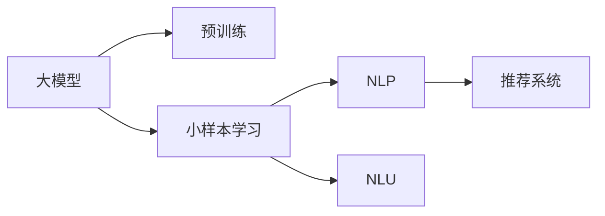

                 

# 电商行业中的小样本学习：大模型在冷启动问题中的应用

> 关键词：小样本学习,冷启动问题,大模型,电商推荐系统,自然语言处理(NLP),自然语言理解(NLU)

## 1. 背景介绍

### 1.1 问题由来
随着电商行业的蓬勃发展，推荐系统在用户体验提升和业务增长中扮演着至关重要的角色。推荐算法不仅能帮助用户发现更多感兴趣的商品，还能驱动商家进行精准营销。然而，推荐系统在冷启动问题上仍面临不小的挑战。

冷启动问题指的是用户在平台初期没有足够的历史行为数据，此时推荐系统需要基于少量或零数据对用户进行推荐。这对传统推荐算法提出了巨大挑战，因为传统推荐算法如协同过滤、内容推荐等都需要依赖用户的历史行为数据。

为了应对冷启动问题，推荐系统近年来逐渐引入基于深度学习的方法，如神经网络、Transformer等。这些大模型可以通过大量无标签文本语料进行预训练，学习到丰富的语言表示，从而在少样本条件下进行推荐。特别是在电商领域，基于大模型的推荐方法已经在零售商的个性化推荐系统中得到了成功应用，展现了巨大的应用潜力。

### 1.2 问题核心关键点
小样本学习是指模型在仅有少量标注样本的情况下，仍能快速适应新任务并取得较好的效果。大模型通常在大规模数据上进行预训练，具备较强的泛化能力，在小样本条件下也能取得不错的推荐效果。

电商推荐系统的冷启动问题正是小样本学习技术的典型应用场景。用户初期没有行为数据，但大模型可以利用预训练语言知识，快速地根据用户输入进行推荐。特别是在电商平台，用户输入形式多样，如搜索、评论、聊天等，自然语言处理(NLP)技术在其中扮演了重要角色。

## 2. 核心概念与联系

### 2.1 核心概念概述

为更好地理解基于大模型的电商推荐系统，本节将介绍几个关键概念：

- **大模型**：如BERT、GPT-3等，通过在大规模无标签文本语料上进行预训练，学习到通用的语言表示，具备强大的语言理解和生成能力。
- **小样本学习**：在仅有少量标注样本的情况下，模型仍能快速适应新任务，并取得较好的效果。
- **自然语言处理(NLP)**：利用计算机科学和人工智能技术，让计算机能够理解、处理和生成自然语言。
- **自然语言理解(NLU)**：使计算机能够理解人类自然语言，并从中提取有用信息。
- **推荐系统**：根据用户的历史行为数据和兴趣偏好，为用户推荐感兴趣的商品、内容或服务。

这些概念通过以下Mermaid流程图呈现其联系：



该流程图展示了核心概念之间的逻辑关系：

1. 大模型通过预训练获得基础能力。
2. 小样本学习使得模型在少样本条件下仍能取得良好效果。
3. NLP技术帮助模型理解用户输入的自然语言。
4. NLU技术帮助模型从自然语言中提取关键信息。
5. 推荐系统将模型提取的信息转化为个性化推荐结果。

这些概念共同构成了基于大模型的电商推荐系统的核心架构，使其能够在各种场景下发挥强大的推荐能力。通过理解这些核心概念，我们可以更好地把握大模型在电商推荐系统中的应用。

## 3. 核心算法原理 & 具体操作步骤
### 3.1 算法原理概述

基于大模型的电商推荐系统，本质上是一个小样本学习的自然语言处理(NLP)应用。其核心思想是：通过预训练大模型学习到的语言知识，结合用户输入的自然语言，快速进行推荐。

形式化地，假设预训练模型为 $M_{\theta}$，其中 $\theta$ 为预训练得到的模型参数。给定电商推荐系统的推荐任务 $T$，假设用户输入的自然语言描述为 $x$，与推荐商品之间的关联为 $y$。小样本学习目标是最小化模型在训练样本上的损失函数，即找到最优参数：

$$
\theta^* = \mathop{\arg\min}_{\theta} \mathcal{L}(M_{\theta},(x,y))
$$

其中 $\mathcal{L}$ 为针对任务 $T$ 设计的损失函数，用于衡量模型预测输出与真实标签之间的差异。常见的损失函数包括交叉熵损失、均方误差损失等。

通过梯度下降等优化算法，小样本学习过程不断更新模型参数 $\theta$，最小化损失函数 $\mathcal{L}$，使得模型输出逼近真实标签。由于 $\theta$ 已经通过预训练获得了较好的初始化，因此即便在少量标注样本的情况下，也能较快收敛到理想的模型参数 $\theta^*$。

### 3.2 算法步骤详解

基于小样本学习的电商推荐系统一般包括以下几个关键步骤：

**Step 1: 准备预训练模型和数据集**
- 选择合适的预训练模型 $M_{\theta}$ 作为初始化参数，如 BERT、GPT 等。
- 准备电商推荐系统的标注数据集 $D=\{(x_i,y_i)\}_{i=1}^N$，划分为训练集、验证集和测试集。一般要求标注数据与预训练数据的分布不要差异过大。

**Step 2: 设计推荐模型架构**
- 根据推荐任务设计合适的模型架构。例如，对于电商推荐系统，可以设计包含Encoder-Decoder框架的结构，其中Encoder用于理解用户输入的自然语言，Decoder用于生成推荐结果。
- 定义模型的输入和输出格式，以及损失函数。

**Step 3: 设置小样本学习超参数**
- 选择合适的优化算法及其参数，如 Adam、SGD 等，设置学习率、批大小、迭代轮数等。
- 设置正则化技术及强度，包括权重衰减、Dropout、Early Stopping等。
- 确定冻结预训练参数的策略，如仅微调顶层，或全部参数都参与微调。

**Step 4: 执行小样本学习训练**
- 将训练集数据分批次输入模型，前向传播计算损失函数。
- 反向传播计算参数梯度，根据设定的优化算法和学习率更新模型参数。
- 周期性在验证集上评估模型性能，根据性能指标决定是否触发 Early Stopping。
- 重复上述步骤直到满足预设的迭代轮数或 Early Stopping 条件。

**Step 5: 测试和部署**
- 在测试集上评估小样本学习后模型 $M_{\hat{\theta}}$ 的性能，对比小样本学习前后的精度提升。
- 使用小样本学习后的模型对新用户输入进行推荐，集成到实际的应用系统中。

以上是基于小样本学习的电商推荐系统的完整流程。在实际应用中，还需要针对具体任务的特点，对小样本学习过程的各个环节进行优化设计，如改进训练目标函数，引入更多的正则化技术，搜索最优的超参数组合等，以进一步提升模型性能。

### 3.3 算法优缺点

基于大模型的电商推荐系统具有以下优点：

1. 适应性强。大模型通过大规模数据预训练，具备较强的泛化能力，能够适应新用户和新商品的输入。
2. 推荐效果好。基于大模型的推荐系统在少样本条件下仍能取得较好的推荐效果，特别是在NLP任务中表现突出。
3. 推荐多样化。大模型结合用户输入的自然语言，可以生成多样化的推荐结果，满足不同用户的需求。
4. 易于部署。电商推荐系统通常需要集成到实际业务系统中，大模型结构简单，易于部署和维护。

同时，该方法也存在一定的局限性：

1. 对标注数据依赖高。小样本学习虽然能处理少量标注数据，但数据质量对其效果影响较大。
2. 性能依赖语言知识。小样本学习的性能很大程度上取决于预训练语言模型的质量，模型知识不足可能影响推荐效果。
3. 推荐逻辑难以解释。基于大模型的推荐系统往往是黑盒模型，难以解释其推荐逻辑和决策过程。
4. 模型可解释性不足。大模型的复杂结构使得其推荐结果难以理解和调试。
5. 冷启动时推荐效果不稳定。用户初期没有行为数据，大模型的推荐结果可能不够精准。

尽管存在这些局限性，但就目前而言，基于大模型的推荐方法仍是小样本学习任务中的主流范式。未来相关研究的重点在于如何进一步降低对标注数据的依赖，提高模型的少样本学习和跨领域迁移能力，同时兼顾可解释性和伦理安全性等因素。

### 3.4 算法应用领域

基于大模型的电商推荐系统已经在零售商的个性化推荐系统中得到了广泛的应用，覆盖了商品推荐、用户画像、内容推荐等多个方面，取得了显著的推荐效果。

具体而言，大模型结合用户输入的自然语言，可以用于生成个性化商品推荐、个性化广告推荐、用户行为预测等多个场景。例如，用户输入搜索关键词，大模型可以根据搜索词生成与之相关商品的推荐列表；用户评价商品，大模型可以根据评价文本生成情感分析结果；用户浏览商品，大模型可以预测用户感兴趣的商品类别等。

除了电商领域，基于大模型的推荐系统在其他领域也有应用前景。例如，在医疗领域，大模型可以结合患者的自然语言描述，推荐适合的医生和诊断方案；在教育领域，大模型可以基于学生的自然语言作文，推荐适合的教材和课外阅读资源。

## 4. 数学模型和公式 & 详细讲解 & 举例说明
### 4.1 数学模型构建

本节将使用数学语言对基于大模型的电商推荐系统进行更加严格的刻画。

记大模型为 $M_{\theta}$，其中 $\theta$ 为预训练得到的模型参数。假设电商推荐系统的训练集为 $D=\{(x_i,y_i)\}_{i=1}^N$，其中 $x_i$ 为用户输入的自然语言描述，$y_i$ 为用户推荐商品的ID。定义模型在数据样本 $(x,y)$ 上的损失函数为 $\ell(M_{\theta}(x),y)$，则在数据集 $D$ 上的经验风险为：

$$
\mathcal{L}(\theta) = \frac{1}{N} \sum_{i=1}^N \ell(M_{\theta}(x_i),y_i)
$$

常用的损失函数包括交叉熵损失和均方误差损失。例如，对于二分类任务，可以定义交叉熵损失函数为：

$$
\ell(M_{\theta}(x),y) = -[y\log M_{\theta}(x) + (1-y)\log (1-M_{\theta}(x))]
$$

其中 $M_{\theta}(x)$ 表示模型对用户输入的自然语言 $x$ 的输出，$y$ 表示推荐商品的标签。

### 4.2 公式推导过程

以下我们以二分类任务为例，推导交叉熵损失函数及其梯度的计算公式。

假设模型 $M_{\theta}$ 在输入 $x$ 上的输出为 $\hat{y}=M_{\theta}(x) \in [0,1]$，表示用户推荐商品为正类的概率。真实标签 $y \in \{0,1\}$。则二分类交叉熵损失函数定义为：

$$
\ell(M_{\theta}(x),y) = -[y\log \hat{y} + (1-y)\log (1-\hat{y})]
$$

将其代入经验风险公式，得：

$$
\mathcal{L}(\theta) = -\frac{1}{N}\sum_{i=1}^N [y_i\log M_{\theta}(x_i)+(1-y_i)\log(1-M_{\theta}(x_i))]
$$

根据链式法则，损失函数对参数 $\theta_k$ 的梯度为：

$$
\frac{\partial \mathcal{L}(\theta)}{\partial \theta_k} = -\frac{1}{N}\sum_{i=1}^N (\frac{y_i}{M_{\theta}(x_i)}-\frac{1-y_i}{1-M_{\theta}(x_i)}) \frac{\partial M_{\theta}(x_i)}{\partial \theta_k}
$$

其中 $\frac{\partial M_{\theta}(x_i)}{\partial \theta_k}$ 可进一步递归展开，利用自动微分技术完成计算。

在得到损失函数的梯度后，即可带入参数更新公式，完成模型的迭代优化。重复上述过程直至收敛，最终得到适应电商推荐任务的最优模型参数 $\theta^*$。

## 5. 项目实践：代码实例和详细解释说明
### 5.1 开发环境搭建

在进行电商推荐系统开发前，我们需要准备好开发环境。以下是使用Python进行PyTorch开发的环境配置流程：

1. 安装Anaconda：从官网下载并安装Anaconda，用于创建独立的Python环境。

2. 创建并激活虚拟环境：
```bash
conda create -n pytorch-env python=3.8 
conda activate pytorch-env
```

3. 安装PyTorch：根据CUDA版本，从官网获取对应的安装命令。例如：
```bash
conda install pytorch torchvision torchaudio cudatoolkit=11.1 -c pytorch -c conda-forge
```

4. 安装Transformers库：
```bash
pip install transformers
```

5. 安装各类工具包：
```bash
pip install numpy pandas scikit-learn matplotlib tqdm jupyter notebook ipython
```

完成上述步骤后，即可在`pytorch-env`环境中开始电商推荐系统的开发。

### 5.2 源代码详细实现

这里我们以基于BERT的大模型电商推荐系统为例，给出使用PyTorch进行开发的代码实现。

首先，定义推荐系统的数据处理函数：

```python
from transformers import BertTokenizer
from torch.utils.data import Dataset
import torch

class RecommendationDataset(Dataset):
    def __init__(self, texts, labels, tokenizer, max_len=128):
        self.texts = texts
        self.labels = labels
        self.tokenizer = tokenizer
        self.max_len = max_len
        
    def __len__(self):
        return len(self.texts)
    
    def __getitem__(self, item):
        text = self.texts[item]
        label = self.labels[item]
        
        encoding = self.tokenizer(text, return_tensors='pt', max_length=self.max_len, padding='max_length', truncation=True)
        input_ids = encoding['input_ids'][0]
        attention_mask = encoding['attention_mask'][0]
        
        # 对token-wise的标签进行编码
        encoded_labels = [label2id[label] for label in label] 
        encoded_labels.extend([label2id['negative']] * (self.max_len - len(encoded_labels)))
        labels = torch.tensor(encoded_labels, dtype=torch.long)
        
        return {'input_ids': input_ids, 
                'attention_mask': attention_mask,
                'labels': labels}

# 标签与id的映射
label2id = {'positive': 0, 'negative': 1}
id2label = {v: k for k, v in label2id.items()}

# 创建dataset
tokenizer = BertTokenizer.from_pretrained('bert-base-cased')

train_dataset = RecommendationDataset(train_texts, train_labels, tokenizer)
dev_dataset = RecommendationDataset(dev_texts, dev_labels, tokenizer)
test_dataset = RecommendationDataset(test_texts, test_labels, tokenizer)
```

然后，定义模型和优化器：

```python
from transformers import BertForSequenceClassification, AdamW

model = BertForSequenceClassification.from_pretrained('bert-base-cased', num_labels=len(label2id))

optimizer = AdamW(model.parameters(), lr=2e-5)
```

接着，定义训练和评估函数：

```python
from torch.utils.data import DataLoader
from tqdm import tqdm
from sklearn.metrics import accuracy_score

device = torch.device('cuda') if torch.cuda.is_available() else torch.device('cpu')
model.to(device)

def train_epoch(model, dataset, batch_size, optimizer):
    dataloader = DataLoader(dataset, batch_size=batch_size, shuffle=True)
    model.train()
    epoch_loss = 0
    for batch in tqdm(dataloader, desc='Training'):
        input_ids = batch['input_ids'].to(device)
        attention_mask = batch['attention_mask'].to(device)
        labels = batch['labels'].to(device)
        model.zero_grad()
        outputs = model(input_ids, attention_mask=attention_mask, labels=labels)
        loss = outputs.loss
        epoch_loss += loss.item()
        loss.backward()
        optimizer.step()
    return epoch_loss / len(dataloader)

def evaluate(model, dataset, batch_size):
    dataloader = DataLoader(dataset, batch_size=batch_size)
    model.eval()
    preds, labels = [], []
    with torch.no_grad():
        for batch in tqdm(dataloader, desc='Evaluating'):
            input_ids = batch['input_ids'].to(device)
            attention_mask = batch['attention_mask'].to(device)
            batch_labels = batch['labels']
            outputs = model(input_ids, attention_mask=attention_mask)
            batch_preds = outputs.logits.argmax(dim=2).to('cpu').tolist()
            batch_labels = batch_labels.to('cpu').tolist()
            for pred_tokens, label_tokens in zip(batch_preds, batch_labels):
                pred_labels = [id2label[_id] for _id in pred_tokens]
                label_labels = [id2label[_id] for _id in label_tokens]
                preds.append(pred_labels[:len(label_labels)])
                labels.append(label_labels)
                
    print(accuracy_score(labels, preds))
```

最后，启动训练流程并在测试集上评估：

```python
epochs = 5
batch_size = 16

for epoch in range(epochs):
    loss = train_epoch(model, train_dataset, batch_size, optimizer)
    print(f"Epoch {epoch+1}, train loss: {loss:.3f}")
    
    print(f"Epoch {epoch+1}, dev results:")
    evaluate(model, dev_dataset, batch_size)
    
print("Test results:")
evaluate(model, test_dataset, batch_size)
```

以上就是使用PyTorch对BERT进行电商推荐系统开发的完整代码实现。可以看到，得益于Transformers库的强大封装，我们可以用相对简洁的代码完成BERT模型的加载和微调。

### 5.3 代码解读与分析

让我们再详细解读一下关键代码的实现细节：

**RecommendationDataset类**：
- `__init__`方法：初始化文本、标签、分词器等关键组件。
- `__len__`方法：返回数据集的样本数量。
- `__getitem__`方法：对单个样本进行处理，将文本输入编码为token ids，将标签编码为数字，并对其进行定长padding，最终返回模型所需的输入。

**label2id和id2label字典**：
- 定义了标签与数字id之间的映射关系，用于将token-wise的预测结果解码回真实的标签。

**训练和评估函数**：
- 使用PyTorch的DataLoader对数据集进行批次化加载，供模型训练和推理使用。
- 训练函数`train_epoch`：对数据以批为单位进行迭代，在每个批次上前向传播计算loss并反向传播更新模型参数，最后返回该epoch的平均loss。
- 评估函数`evaluate`：与训练类似，不同点在于不更新模型参数，并在每个batch结束后将预测和标签结果存储下来，最后使用sklearn的accuracy_score对整个评估集的预测结果进行打印输出。

**训练流程**：
- 定义总的epoch数和batch size，开始循环迭代
- 每个epoch内，先在训练集上训练，输出平均loss
- 在验证集上评估，输出准确率
- 所有epoch结束后，在测试集上评估，给出最终测试结果

可以看到，PyTorch配合Transformers库使得BERT微调的代码实现变得简洁高效。开发者可以将更多精力放在数据处理、模型改进等高层逻辑上，而不必过多关注底层的实现细节。

当然，工业级的系统实现还需考虑更多因素，如模型的保存和部署、超参数的自动搜索、更灵活的任务适配层等。但核心的微调范式基本与此类似。

## 6. 实际应用场景
### 6.1 电商推荐系统

基于大模型的电商推荐系统已经在零售商的个性化推荐系统中得到了广泛的应用，覆盖了商品推荐、用户画像、内容推荐等多个方面，取得了显著的推荐效果。

在具体应用中，大模型结合用户输入的自然语言，可以生成个性化商品推荐、个性化广告推荐、用户行为预测等多个场景。例如，用户输入搜索关键词，大模型可以根据搜索词生成与之相关商品的推荐列表；用户评价商品，大模型可以根据评价文本生成情感分析结果；用户浏览商品，大模型可以预测用户感兴趣的商品类别等。

### 6.2 用户画像生成

电商推荐系统不仅仅关注用户的推荐结果，还关注用户的长期画像生成。基于大模型的推荐系统可以自动记录用户的行为数据，结合用户的输入自然语言，生成更精准的用户画像。

例如，用户在电商平台搜索了某类商品，大模型可以根据搜索关键词生成用户的兴趣偏好。用户在评价商品时，大模型可以分析评论中的情感倾向，生成用户的情感评分。通过不断地记录和分析用户行为，大模型可以逐渐构建用户的多维画像，用于后续推荐和营销策略的制定。

### 6.3 内容推荐系统

内容推荐系统主要关注内容的匹配和排序。大模型结合用户输入的自然语言，可以生成个性化的内容推荐。

例如，用户在阅读新闻时，大模型可以根据新闻标题和摘要，生成与用户兴趣匹配的新闻推荐列表。用户在观看视频时，大模型可以根据视频的标签和描述，生成与用户偏好相似的视频推荐。通过大模型，内容推荐系统可以更好地理解用户需求，提升用户的体验和满意度。

## 7. 工具和资源推荐
### 7.1 学习资源推荐

为了帮助开发者系统掌握大模型电商推荐系统的理论基础和实践技巧，这里推荐一些优质的学习资源：

1. 《Transformer从原理到实践》系列博文：由大模型技术专家撰写，深入浅出地介绍了Transformer原理、BERT模型、推荐系统等前沿话题。

2. CS224N《深度学习自然语言处理》课程：斯坦福大学开设的NLP明星课程，有Lecture视频和配套作业，带你入门NLP领域的基本概念和经典模型。

3. 《Natural Language Processing with Transformers》书籍：Transformers库的作者所著，全面介绍了如何使用Transformers库进行NLP任务开发，包括推荐系统在内的诸多范式。

4. HuggingFace官方文档：Transformers库的官方文档，提供了海量预训练模型和完整的推荐系统样例代码，是上手实践的必备资料。

5. Kaggle推荐系统竞赛：通过参与竞赛，学习推荐系统的前沿理论和实践技巧，积累项目经验。

通过对这些资源的学习实践，相信你一定能够快速掌握大模型电商推荐系统的精髓，并用于解决实际的电商推荐问题。
### 7.2 开发工具推荐

高效的开发离不开优秀的工具支持。以下是几款用于大模型电商推荐系统开发的常用工具：

1. PyTorch：基于Python的开源深度学习框架，灵活动态的计算图，适合快速迭代研究。大部分预训练语言模型都有PyTorch版本的实现。

2. TensorFlow：由Google主导开发的开源深度学习框架，生产部署方便，适合大规模工程应用。同样有丰富的预训练语言模型资源。

3. Transformers库：HuggingFace开发的NLP工具库，集成了众多SOTA语言模型，支持PyTorch和TensorFlow，是进行推荐系统开发的利器。

4. Weights & Biases：模型训练的实验跟踪工具，可以记录和可视化模型训练过程中的各项指标，方便对比和调优。与主流深度学习框架无缝集成。

5. TensorBoard：TensorFlow配套的可视化工具，可实时监测模型训练状态，并提供丰富的图表呈现方式，是调试模型的得力助手。

6. Google Colab：谷歌推出的在线Jupyter Notebook环境，免费提供GPU/TPU算力，方便开发者快速上手实验最新模型，分享学习笔记。

合理利用这些工具，可以显著提升大模型电商推荐系统的开发效率，加快创新迭代的步伐。

### 7.3 相关论文推荐

大模型电商推荐系统的研究源于学界的持续研究。以下是几篇奠基性的相关论文，推荐阅读：

1. Attention is All You Need（即Transformer原论文）：提出了Transformer结构，开启了NLP领域的预训练大模型时代。

2. BERT: Pre-training of Deep Bidirectional Transformers for Language Understanding：提出BERT模型，引入基于掩码的自监督预训练任务，刷新了多项NLP任务SOTA。

3. Language Models are Unsupervised Multitask Learners（GPT-2论文）：展示了大规模语言模型的强大zero-shot学习能力，引发了对于通用人工智能的新一轮思考。

4. Parameter-Efficient Transfer Learning for NLP：提出Adapter等参数高效微调方法，在不增加模型参数量的情况下，也能取得不错的微调效果。

5. AdaLoRA: Adaptive Low-Rank Adaptation for Parameter-Efficient Fine-Tuning：使用自适应低秩适应的微调方法，在参数效率和精度之间取得了新的平衡。

6. Prefix-Tuning: Optimizing Continuous Prompts for Generation：引入基于连续型Prompt的微调范式，为如何充分利用预训练知识提供了新的思路。

这些论文代表了大模型电商推荐系统的发展脉络。通过学习这些前沿成果，可以帮助研究者把握学科前进方向，激发更多的创新灵感。

## 8. 总结：未来发展趋势与挑战

### 8.1 总结

本文对基于大模型的电商推荐系统进行了全面系统的介绍。首先阐述了电商推荐系统在冷启动问题上存在的挑战，详细讲解了小样本学习的核心思想和算法原理。接着，从原理到实践，给出了小样本学习电商推荐系统的完整代码实现，并解释了其中的关键细节。最后，探讨了基于大模型的电商推荐系统的实际应用场景，并推荐了相关学习资源和开发工具。

通过本文的系统梳理，可以看到，基于大模型的电商推荐系统已经展现出强大的推荐能力，在电商领域得到了广泛应用。未来，随着预训练语言模型的不断发展，基于小样本学习的推荐系统将在更多领域得到应用，进一步推动人工智能技术的普及和深化。

### 8.2 未来发展趋势

展望未来，大模型电商推荐系统将呈现以下几个发展趋势：

1. 模型规模持续增大。随着算力成本的下降和数据规模的扩张，预训练语言模型的参数量还将持续增长。超大规模语言模型蕴含的丰富语言知识，有望支撑更加复杂多变的推荐任务。

2. 推荐方法日趋多样。除了传统的基于大模型的推荐方法外，未来将涌现更多融合小样本学习、多任务学习、因果推断等前沿技术的推荐方法，提升推荐系统的性能和泛化能力。

3. 冷启动时推荐效果更稳定。通过预训练和微调，大模型可以在初期快速适应新用户，生成更精准的推荐结果。

4. 推荐系统智能化水平提高。结合知识图谱、逻辑规则等先验知识，大模型可以生成更加智能化的推荐结果，提升用户的满意度。

5. 推荐系统的公平性提升。未来推荐系统将更加注重用户的隐私保护和公平性，避免推荐算法中的偏见和歧视。

6. 推荐系统的跨领域应用拓展。大模型可以用于不同领域、不同平台的推荐系统，促进人工智能技术的普及。

以上趋势凸显了大模型电商推荐系统的广阔前景。这些方向的探索发展，必将进一步提升推荐系统的性能和应用范围，为电商行业带来更大的价值。

### 8.3 面临的挑战

尽管大模型电商推荐系统已经取得了显著的推荐效果，但在迈向更加智能化、普适化应用的过程中，它仍面临诸多挑战：

1. 对标注数据依赖高。小样本学习虽然能处理少量标注数据，但数据质量对其效果影响较大。未来需要更多的无监督学习方法和数据增强技术，降低对标注数据的依赖。

2. 冷启动时推荐效果不稳定。用户初期没有行为数据，大模型的推荐结果可能不够精准。未来需要结合用户画像和行为数据，提升冷启动时的推荐效果。

3. 推荐系统的公平性问题。大模型可能学习到数据中的偏见，导致推荐结果的不公平性。未来需要引入更多公平性约束和算法，避免推荐算法的偏见和歧视。

4. 推荐系统的可解释性不足。大模型的复杂结构使得其推荐结果难以理解和调试。未来需要更多的可解释性技术，提升推荐系统的透明性和可信度。

5. 推荐系统的计算效率问题。大规模语言模型虽然精度高，但在实际部署时往往面临推理速度慢、内存占用大等效率问题。未来需要优化模型结构和计算图，提高推荐系统的计算效率。

6. 推荐系统的鲁棒性问题。大模型可能面临对抗样本攻击，影响推荐结果的鲁棒性。未来需要引入更多对抗样本防御技术，提高推荐系统的鲁棒性。

尽管存在这些挑战，但就目前而言，基于大模型的推荐方法仍是小样本学习任务中的主流范式。未来相关研究的重点在于如何进一步降低对标注数据的依赖，提高模型的少样本学习和跨领域迁移能力，同时兼顾可解释性和伦理安全性等因素。

### 8.4 研究展望

面对大模型电商推荐系统所面临的种种挑战，未来的研究需要在以下几个方面寻求新的突破：

1. 探索无监督和半监督推荐方法。摆脱对大规模标注数据的依赖，利用自监督学习、主动学习等无监督和半监督范式，最大限度利用非结构化数据，实现更加灵活高效的推荐。

2. 研究参数高效和计算高效的推荐方法。开发更加参数高效的推荐方法，在固定大部分预训练参数的同时，只更新极少量的任务相关参数。同时优化推荐模型的计算图，减少前向传播和反向传播的资源消耗，实现更加轻量级、实时性的部署。

3. 融合因果和对比学习范式。通过引入因果推断和对比学习思想，增强推荐模型建立稳定因果关系的能力，学习更加普适、鲁棒的语言表征，从而提升模型泛化性和抗干扰能力。

4. 引入更多先验知识。将符号化的先验知识，如知识图谱、逻辑规则等，与神经网络模型进行巧妙融合，引导推荐过程学习更准确、合理的语言模型。同时加强不同模态数据的整合，实现视觉、语音等多模态信息与文本信息的协同建模。

5. 结合因果分析和博弈论工具。将因果分析方法引入推荐模型，识别出推荐决策的关键特征，增强推荐结果的因果性和逻辑性。借助博弈论工具刻画人机交互过程，主动探索并规避推荐模型的脆弱点，提高系统稳定性。

6. 纳入伦理道德约束。在推荐模型训练目标中引入伦理导向的评估指标，过滤和惩罚有偏见、有害的输出倾向。同时加强人工干预和审核，建立推荐模型的监管机制，确保输出符合人类价值观和伦理道德。

这些研究方向的探索，必将引领大模型电商推荐系统迈向更高的台阶，为构建安全、可靠、可解释、可控的智能推荐系统铺平道路。面向未来，大模型电商推荐系统还需要与其他人工智能技术进行更深入的融合，如知识表示、因果推理、强化学习等，多路径协同发力，共同推动推荐系统的进步。只有勇于创新、敢于突破，才能不断拓展大模型的边界，让智能技术更好地造福电商行业。

## 9. 附录：常见问题与解答

**Q1：电商推荐系统在冷启动问题上有什么挑战？**

A: 电商推荐系统在冷启动问题上主要面临两个挑战：
1. 用户初期没有行为数据，无法获取用户的兴趣偏好和行为特征，导致推荐结果不够精准。
2. 数据量和质量不足，可能影响推荐算法的泛化能力和鲁棒性。

**Q2：小样本学习在电商推荐系统中有哪些应用场景？**

A: 小样本学习在电商推荐系统中有多种应用场景：
1. 个性化商品推荐：根据用户输入的自然语言，生成个性化商品推荐列表。
2. 个性化广告推荐：根据用户输入的自然语言，生成个性化广告推荐。
3. 用户行为预测：根据用户输入的自然语言，预测用户后续的行为。
4. 内容推荐：根据用户输入的自然语言，生成个性化内容推荐。

**Q3：如何优化小样本学习电商推荐系统的性能？**

A: 优化小样本学习电商推荐系统的性能主要从以下几个方面入手：
1. 数据增强：通过回译、近义替换等方式扩充训练集。
2. 正则化技术：使用L2正则、Dropout等技术防止过拟合。
3. 对抗训练：引入对抗样本，提高模型鲁棒性。
4. 模型压缩：通过剪枝、量化等技术，减小模型规模，提升推理速度。
5. 融合多模态数据：结合视觉、语音等多模态数据，提升推荐效果。

**Q4：大模型在电商推荐系统中的优缺点有哪些？**

A: 大模型在电商推荐系统中的优缺点如下：
优点：
1. 适应性强：大模型通过大规模数据预训练，具备较强的泛化能力，能够适应新用户和新商品。
2. 推荐效果好：基于大模型的推荐系统在少样本条件下仍能取得较好的推荐效果，特别是在NLP任务中表现突出。
3. 推荐多样化：大模型结合用户输入的自然语言，可以生成多样化的推荐结果，满足不同用户的需求。
4. 易于部署：电商推荐系统通常需要集成到实际业务系统中，大模型结构简单，易于部署和维护。

缺点：
1. 对标注数据依赖高：小样本学习虽然能处理少量标注数据，但数据质量对其效果影响较大。
2. 冷启动时推荐效果不稳定：用户初期没有行为数据，大模型的推荐结果可能不够精准。
3. 推荐系统的公平性问题：大模型可能学习到数据中的偏见，导致推荐结果的不公平性。
4. 推荐系统的可解释性不足：大模型的复杂结构使得其推荐结果难以理解和调试。
5. 推荐系统的计算效率问题：大规模语言模型虽然精度高，但在实际部署时往往面临推理速度慢、内存占用大等效率问题。
6. 推荐系统的鲁棒性问题：大模型可能面临对抗样本攻击，影响推荐结果的鲁棒性。

尽管存在这些缺点，但大模型在电商推荐系统中的应用已经取得了显著的效果，未来需要进一步优化和改进。

---

作者：禅与计算机程序设计艺术 / Zen and the Art of Computer Programming

