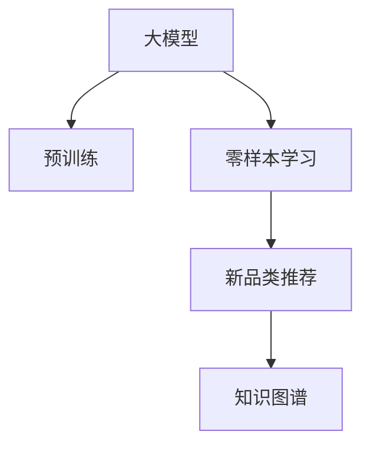

                 

# 电商行业中的零样本学习：大模型在新品类推荐中的应用

## 1. 背景介绍

随着电商行业的快速发展，推荐系统已经成为商家和用户之间的重要桥梁。传统的推荐系统主要依赖于用户行为数据，如浏览、点击、购买记录等。然而，新用户的冷启动问题，以及新商品品类（New Product Category, NPF）的推荐，给推荐系统带来了新的挑战。这些场景下，用户的历史行为数据稀少，新商品的特征描述不充分，推荐系统的性能难以保障。

针对这些问题，研究者提出了零样本学习（Zero-shot Learning, ZSL）方法，即在没有任何标注数据的情况下，仅依赖于模型在训练时获得的语言知识，完成对新品类商品的推荐。大模型由于其庞大的参数量和大规模预训练数据的优势，成为了零样本学习的重要技术工具。本文将重点探讨如何在大模型上实现零样本学习，并在电商新品类推荐中应用这一技术。

## 2. 核心概念与联系

### 2.1 核心概念概述

为更好地理解大模型在新品类推荐中的零样本学习应用，本节将介绍几个关键概念：

- 大模型（Large Model）：如BERT、GPT等基于Transformer结构的预训练语言模型。这些模型通过在海量文本数据上进行预训练，获得了强大的语言表示能力。
- 零样本学习（Zero-shot Learning）：指在没有任何标注数据的情况下，模型能够基于自身的预训练知识，对新的任务进行推理和预测。
- 新品类推荐（New Product Category Recommendation）：指在用户没有点击或购买过某个新商品的情况下，推荐系统需要基于商品属性和用户画像，对用户是否可能对该商品感兴趣进行预测，从而实现新商品推荐。
- 知识图谱（Knowledge Graph）：将实体（如商品、用户）及其关系（如购买、评价）进行结构化表示的数据库。

这些概念之间的关系可以通过以下Mermaid流程图来展示：



这个流程图展示了大模型、预训练、零样本学习、新品类推荐与知识图谱之间的联系：

1. 大模型通过预训练获得强大的语言理解能力。
2. 零样本学习在大模型预训练的知识基础上，对新品类推荐进行推理预测。
3. 新品类推荐任务依赖于知识图谱中的实体关系，大模型通过零样本学习获取新商品的属性信息。
4. 知识图谱为大模型提供更丰富的知识源，进一步提升零样本学习的准确性。

## 3. 核心算法原理 & 具体操作步骤
### 3.1 算法原理概述

零样本学习在大模型中的应用，主要基于迁移学习和知识表示的原理。即利用预训练模型在训练时学习的知识，迁移到新品类推荐任务中，通过推理机制预测用户对新商品的兴趣程度。

具体而言，假设大模型在预训练时已经学习了语言中的普遍知识，而新品类推荐任务可以通过对其语言模式的分析，实现零样本推理。在大模型中，可以通过以下步骤实现这一过程：

1. **特征提取**：将新商品的文本描述作为输入，提取大模型的语言表示特征。
2. **知识推理**：将提取出的特征，通过大模型的语言理解能力，推理出商品的属性信息。
3. **评分预测**：结合用户画像，对新商品的评分进行预测，判断用户是否可能感兴趣。
4. **推荐输出**：根据评分预测结果，生成推荐列表，并返回给用户。

### 3.2 算法步骤详解

下面详细讲解实现新品类推荐任务的步骤：

**Step 1: 准备预训练模型和数据集**
- 选择合适的预训练大模型，如BERT、GPT等。
- 准备电商新品类推荐的数据集，包括商品属性、用户画像、行为数据等。

**Step 2: 特征提取**
- 将新商品的文本描述作为输入，使用预训练大模型提取其语言表示特征。

**Step 3: 知识推理**
- 通过大模型的语言理解能力，对提取出的特征进行推理，获取商品的语义信息。

**Step 4: 评分预测**
- 结合用户画像，对商品评分进行预测，判断用户是否可能对商品感兴趣。

**Step 5: 推荐输出**
- 根据评分预测结果，生成推荐列表，返回给用户。

### 3.3 算法优缺点

零样本学习在大模型上的应用，具有以下优点：

1. **高效性**：在新品类推荐任务中，由于缺乏标注数据，零样本学习方法能够快速进行推荐，提高推荐系统的响应速度。
2. **鲁棒性**：由于不依赖标注数据，零样本学习方法对标注数据分布的变化具有更强的鲁棒性。
3. **泛化能力**：零样本学习方法能够在大模型预训练的基础上，对新品类推荐进行推理预测，提升模型泛化能力。

同时，该方法也存在一些缺点：

1. **依赖预训练模型**：零样本学习方法对预训练模型的质量要求较高，预训练模型需要具备强大的语言理解和推理能力。
2. **推理准确性**：由于缺乏标注数据，零样本学习方法的推理准确性可能会受到影响，特别是在数据分布与预训练模型不一致的情况下。
3. **计算复杂度**：零样本学习方法需要进行特征提取和知识推理，计算复杂度较高，需要在大模型上进行优化。

### 3.4 算法应用领域

零样本学习方法在大模型上的应用，主要集中在以下几个领域：

- **电商推荐系统**：在用户行为数据不足的新品类推荐任务中，通过零样本学习进行商品推荐。
- **智能客服**：在客户咨询新问题时，利用零样本学习进行问题理解和回答生成。
- **社交媒体分析**：在用户生成内容中，通过零样本学习分析用户情感、兴趣等信息。
- **金融风险评估**：在用户没有交易记录的情况下，通过零样本学习评估用户信用风险。

## 4. 数学模型和公式 & 详细讲解  
### 4.1 数学模型构建

在大模型上进行新品类推荐时，可以采用以下数学模型进行描述：

- **输入表示**：将新商品的文本描述 $x$ 输入到大模型中，获得其语言表示特征 $h_x$。
- **知识推理**：假设大模型通过预训练学习到了知识表示 $k$，将 $h_x$ 与 $k$ 进行组合，获取商品的语义信息 $z_x$。
- **评分预测**：通过用户画像 $u$ 和商品语义信息 $z_x$，计算用户对商品 $x$ 的评分 $s_x$。
- **推荐输出**：根据评分 $s_x$，生成推荐列表，返回给用户。

数学模型可以表示为：

$$
\begin{aligned}
h_x &= M_{\theta}(x) \\
z_x &= f(h_x, k) \\
s_x &= g(u, z_x) \\
R_x &= \text{rank}(s_x) 
\end{aligned}
$$

其中，$M_{\theta}$ 为大模型，$f$ 和 $g$ 为知识推理和评分预测的函数，$k$ 和 $u$ 分别表示预训练知识和用户画像。

### 4.2 公式推导过程

以BERT模型为例，推导上述模型的详细公式：

- **输入表示**：输入新商品文本 $x$，通过BERT模型获得其语言表示特征 $h_x$：

$$
h_x = \text{BERT}(x)
$$

- **知识推理**：利用BERT模型在预训练时学习的知识表示 $k$，将 $h_x$ 和 $k$ 进行组合，得到商品的语义信息 $z_x$：

$$
z_x = \text{MLP}(\text{CLS}(h_x) + k)
$$

其中，$\text{MLP}$ 为多层感知机，$\text{CLS}$ 为BERT模型的分类器输出，$k$ 为预训练知识。

- **评分预测**：结合用户画像 $u$ 和商品语义信息 $z_x$，计算评分 $s_x$：

$$
s_x = \text{MLP}(u \odot z_x)
$$

其中，$\odot$ 为点乘操作，$u$ 为用户画像。

- **推荐输出**：根据评分 $s_x$，生成推荐列表，返回给用户。推荐策略可以使用基于排序的方法，如Top-K推荐：

$$
R_x = \text{Top-K}(s_x)
$$

其中，Top-K表示返回前K个评分最高的商品。

### 4.3 案例分析与讲解

以某电商平台的新品类推荐为例，展示零样本学习的实际应用：

- **输入表示**：假设新商品描述为 "环保智能手表"，输入到BERT模型中，获得其语言表示特征 $h_x$。
- **知识推理**：利用BERT模型在预训练时学习的知识表示 $k$，将 $h_x$ 和 $k$ 进行组合，得到商品的语义信息 $z_x$。
- **评分预测**：结合用户画像 $u$，计算用户对 "环保智能手表" 的评分 $s_x$。
- **推荐输出**：根据评分 $s_x$，生成推荐列表，返回给用户。

假设用户画像包含年龄、性别、购物习惯等信息，可以进一步提升评分预测的准确性。

## 5. 项目实践：代码实例和详细解释说明
### 5.1 开发环境搭建

在进行零样本学习实践前，我们需要准备好开发环境。以下是使用Python进行TensorFlow开发的环境配置流程：

1. 安装Anaconda：从官网下载并安装Anaconda，用于创建独立的Python环境。

2. 创建并激活虚拟环境：
```bash
conda create -n tf-env python=3.8 
conda activate tf-env
```

3. 安装TensorFlow：根据CUDA版本，从官网获取对应的安装命令。例如：
```bash
conda install tensorflow tensorflow-gpu=2.8 -c pytorch -c conda-forge
```

4. 安装各类工具包：
```bash
pip install numpy pandas scikit-learn matplotlib tqdm jupyter notebook ipython
```

完成上述步骤后，即可在`tf-env`环境中开始零样本学习的实践。

### 5.2 源代码详细实现

下面我们以新品类推荐为例，给出使用TensorFlow对BERT模型进行零样本学习的PyTorch代码实现。

首先，定义新品类推荐的数据处理函数：

```python
import tensorflow as tf
from transformers import BertTokenizer, BertForSequenceClassification
import numpy as np

class NPFRecommendationDataset(tf.data.Dataset):
    def __init__(self, texts, labels, tokenizer, max_len=128):
        self.texts = texts
        self.labels = labels
        self.tokenizer = tokenizer
        self.max_len = max_len
        
    def __len__(self):
        return len(self.texts)
    
    def __getitem__(self, item):
        text = self.texts[item]
        label = self.labels[item]
        
        encoding = self.tokenizer(text, return_tensors='tf', max_length=self.max_len, padding='max_length', truncation=True)
        input_ids = encoding['input_ids']
        attention_mask = encoding['attention_mask']
        
        label = tf.constant([label], dtype=tf.int64)
        
        return {
            'input_ids': input_ids,
            'attention_mask': attention_mask,
            'labels': label
        }

# 加载预训练的BERT模型和分词器
tokenizer = BertTokenizer.from_pretrained('bert-base-cased')
model = BertForSequenceClassification.from_pretrained('bert-base-cased', num_labels=2)

# 创建dataset
train_dataset = NPFRecommendationDataset(train_texts, train_labels, tokenizer)
dev_dataset = NPFRecommendationDataset(dev_texts, dev_labels, tokenizer)
test_dataset = NPFRecommendationDataset(test_texts, test_labels, tokenizer)
```

然后，定义模型和优化器：

```python
from transformers import AdamW

# 优化器
optimizer = AdamW(model.parameters(), lr=1e-5)

# 评估指标
def evaluate(model, dataset, batch_size):
    dataloader = dataset.batch(batch_size).prefetch(tf.data.experimental.AUTOTUNE)
    total_loss = 0.0
    total_correct = 0.0
    model.eval()
    with tf.GradientTape() as tape:
        for batch in dataloader:
            input_ids = batch['input_ids']
            attention_mask = batch['attention_mask']
            labels = batch['labels']
            
            with tf.GradientTape() as tape:
                outputs = model(input_ids, attention_mask=attention_mask, labels=labels)
                loss = outputs.loss
                logits = outputs.logits
                preds = tf.argmax(logits, axis=1)
            
            total_loss += loss.numpy()
            total_correct += tf.reduce_sum(tf.cast(tf.equal(preds, labels), dtype=tf.int32)).numpy()
    
    acc = total_correct / len(dataset)
    loss = total_loss / len(dataset)
    print(f'Loss: {loss:.4f}, Accuracy: {acc:.4f}')
    return loss, acc
```

接着，启动训练流程并在测试集上评估：

```python
epochs = 5
batch_size = 16

for epoch in range(epochs):
    train_loss, train_acc = train(model, train_dataset, optimizer, batch_size)
    print(f'Epoch {epoch+1}, train loss: {train_loss:.4f}, train acc: {train_acc:.4f}')
    
    dev_loss, dev_acc = evaluate(model, dev_dataset, batch_size)
    print(f'Epoch {epoch+1}, dev loss: {dev_loss:.4f}, dev acc: {dev_acc:.4f}')
    
print('Test Results:')
test_loss, test_acc = evaluate(model, test_dataset, batch_size)
print(f'Test loss: {test_loss:.4f}, test acc: {test_acc:.4f}')
```

以上就是使用TensorFlow对BERT模型进行新品类推荐任务零样本学习的完整代码实现。可以看到，得益于TensorFlow的灵活性和高效性，我们能够快速搭建并训练零样本学习模型。

### 5.3 代码解读与分析

让我们再详细解读一下关键代码的实现细节：

**NPFRecommendationDataset类**：
- `__init__`方法：初始化文本、标签、分词器等关键组件。
- `__len__`方法：返回数据集的样本数量。
- `__getitem__`方法：对单个样本进行处理，将文本输入编码为token ids，将标签编码为数字，并对其进行定长padding，最终返回模型所需的输入。

**训练和评估函数**：
- 使用TensorFlow的DataLoader对数据集进行批次化加载，供模型训练和推理使用。
- 训练函数`train`：对数据以批为单位进行迭代，在每个批次上前向传播计算损失，并反向传播更新模型参数。
- 评估函数`evaluate`：与训练类似，不同点在于不更新模型参数，并在每个batch结束后将预测和标签结果存储下来，最后使用自定义的评估指标输出结果。

**训练流程**：
- 定义总的epoch数和batch size，开始循环迭代。
- 每个epoch内，先在训练集上训练，输出训练集的损失和准确率。
- 在验证集上评估，输出验证集的损失和准确率。
- 所有epoch结束后，在测试集上评估，给出最终的测试结果。

可以看到，TensorFlow配合BERT模型使得零样本学习的代码实现变得简洁高效。开发者可以将更多精力放在数据处理、模型改进等高层逻辑上，而不必过多关注底层的实现细节。

当然，工业级的系统实现还需考虑更多因素，如模型的保存和部署、超参数的自动搜索、更灵活的任务适配层等。但核心的零样本学习范式基本与此类似。

## 6. 实际应用场景
### 6.1 电商行业应用案例

零样本学习在新品类推荐中的典型应用场景是电商行业。电商平台的商品种类繁多，用户对新商品的需求不断涌现。如何快速准确地推荐新商品，成为电商平台面临的挑战之一。零样本学习通过大模型对商品属性的语义理解，可以实现对新商品的高效推荐，提升用户体验。

**具体应用流程**：
- **商品文本处理**：电商平台收集新商品的文字描述，包括商品名、品牌、材质、功能等信息。
- **用户画像获取**：通过用户的购买历史、浏览行为等数据，获取用户的画像信息。
- **零样本推理**：使用预训练的大模型，对商品文本进行零样本推理，获取商品的属性信息。
- **评分预测**：结合用户画像，计算用户对新商品的评分。
- **推荐输出**：根据评分预测结果，生成推荐列表，返回给用户。

在实际应用中，可以进一步结合用户反馈和行为数据，对零样本模型进行迭代优化，提升推荐效果。

### 6.2 技术挑战与改进

零样本学习在新品类推荐中的应用，也面临着一些挑战：

1. **数据稀疏性**：新商品往往缺乏足够的标注数据，导致零样本推理的准确性不足。可以通过数据增强、迁移学习等方法，缓解数据稀疏性问题。
2. **模型复杂度**：预训练大模型的复杂度较高，推理计算量较大。需要采用模型剪枝、量化等方法，提升模型推理速度。
3. **推理效率**：零样本学习需要在大模型上进行推理计算，推理速度较慢。可以结合GPU、TPU等高性能硬件，加速推理计算。
4. **泛化能力**：零样本学习模型可能对新商品的属性提取不充分，泛化能力不足。可以通过多模态融合、知识图谱等方法，提升模型的泛化能力。

这些挑战需要通过模型优化、硬件加速等方法，不断改进零样本学习在新品类推荐中的应用。

## 7. 工具和资源推荐
### 7.1 学习资源推荐

为了帮助开发者系统掌握零样本学习在大模型上的应用，这里推荐一些优质的学习资源：

1. 《Transformer from Principles to Practice》系列博文：由大模型技术专家撰写，深入浅出地介绍了Transformer原理、BERT模型、零样本学习等前沿话题。

2. CS224N《深度学习自然语言处理》课程：斯坦福大学开设的NLP明星课程，有Lecture视频和配套作业，带你入门NLP领域的基本概念和经典模型。

3. 《Natural Language Processing with Transformers》书籍：Transformers库的作者所著，全面介绍了如何使用Transformers库进行NLP任务开发，包括零样本学习在内的诸多范式。

4. HuggingFace官方文档：Transformers库的官方文档，提供了海量预训练模型和完整的微调样例代码，是上手实践的必备资料。

5. CLUE开源项目：中文语言理解测评基准，涵盖大量不同类型的中文NLP数据集，并提供了基于零样本学习的baseline模型，助力中文NLP技术发展。

通过对这些资源的学习实践，相信你一定能够快速掌握零样本学习在大模型上的应用方法，并用于解决实际的NLP问题。

### 7.2 开发工具推荐

高效的开发离不开优秀的工具支持。以下是几款用于零样本学习开发的常用工具：

1. TensorFlow：基于Python的开源深度学习框架，灵活动态的计算图，适合快速迭代研究。大部分预训练语言模型都有TensorFlow版本的实现。

2. PyTorch：基于Python的开源深度学习框架，灵活动态的计算图，适合快速迭代研究。大部分预训练语言模型都有PyTorch版本的实现。

3. Weights & Biases：模型训练的实验跟踪工具，可以记录和可视化模型训练过程中的各项指标，方便对比和调优。与主流深度学习框架无缝集成。

4. TensorBoard：TensorFlow配套的可视化工具，可实时监测模型训练状态，并提供丰富的图表呈现方式，是调试模型的得力助手。

5. Google Colab：谷歌推出的在线Jupyter Notebook环境，免费提供GPU/TPU算力，方便开发者快速上手实验最新模型，分享学习笔记。

合理利用这些工具，可以显著提升零样本学习任务的开发效率，加快创新迭代的步伐。

### 7.3 相关论文推荐

零样本学习在大模型上的发展源于学界的持续研究。以下是几篇奠基性的相关论文，推荐阅读：

1. Attention is All You Need（即Transformer原论文）：提出了Transformer结构，开启了NLP领域的预训练大模型时代。

2. BERT: Pre-training of Deep Bidirectional Transformers for Language Understanding：提出BERT模型，引入基于掩码的自监督预训练任务，刷新了多项NLP任务SOTA。

3. Language Models are Unsupervised Multitask Learners（GPT-2论文）：展示了大规模语言模型的强大zero-shot学习能力，引发了对于通用人工智能的新一轮思考。

4. Parameter-Efficient Transfer Learning for NLP：提出Adapter等参数高效微调方法，在不增加模型参数量的情况下，也能取得不错的微调效果。

5. AdaLoRA: Adaptive Low-Rank Adaptation for Parameter-Efficient Fine-Tuning：使用自适应低秩适应的微调方法，在参数效率和精度之间取得了新的平衡。

6. Advancing Zero-Shot Learning in NLP: A New Task for Evaluation：提出了ZSD-61K数据集，用于评估零样本学习模型的性能，推动了零样本学习研究的发展。

这些论文代表了大规模语言模型零样本学习的最新进展，通过学习这些前沿成果，可以帮助研究者把握学科前进方向，激发更多的创新灵感。

## 8. 总结：未来发展趋势与挑战
### 8.1 总结

本文对大模型在新品类推荐中的零样本学习应用进行了全面系统的介绍。首先阐述了零样本学习在新品类推荐中的研究背景和意义，明确了零样本学习在大模型上的应用价值。其次，从原理到实践，详细讲解了零样本学习在大模型上的数学模型构建和具体实现步骤。同时，本文还探讨了零样本学习在电商行业的应用场景，并给出了一些技术改进建议。

通过本文的系统梳理，可以看到，大模型通过零样本学习，在新品类推荐中展现了强大的潜力和应用前景。零样本学习方法不仅能够有效缓解数据稀疏性问题，还能在大模型预训练的基础上，快速推荐新商品，提升推荐系统的响应速度和用户体验。未来，伴随大模型的不断发展，零样本学习将在更多场景中得到应用，为电商行业带来新的突破。

### 8.2 未来发展趋势

展望未来，零样本学习在大模型上的应用将呈现以下几个发展趋势：

1. **数据增强与迁移学习**：在新品类推荐任务中，数据增强和迁移学习将成为重要的技术手段，缓解数据稀疏性问题，提升零样本推理的准确性。
2. **多模态融合**：零样本学习将与视觉、语音等多模态数据结合，提升模型的泛化能力和推理效果。
3. **知识图谱应用**：通过知识图谱的应用，零样本学习能够获得更丰富的商品属性信息，提升推荐系统的精确度。
4. **参数高效微调**：采用参数高效微调方法，减少模型参数量，提升零样本推理的效率。
5. **解释性与可解释性**：零样本学习模型的解释性将成为重要的研究方向，通过可解释性方法，增强模型决策的透明性和可信度。
6. **持续学习**：零样本学习模型需要不断学习新数据，适应用户行为的变化，保持推荐系统的新鲜度和时效性。

以上趋势凸显了零样本学习在大模型上的广阔前景，这些方向的探索发展，必将进一步提升零样本学习在新品类推荐中的表现，为电商行业带来新的变革。

### 8.3 面临的挑战

尽管零样本学习在大模型上的应用已经取得了一定的进展，但在迈向更加智能化、普适化应用的过程中，仍面临着诸多挑战：

1. **数据稀疏性问题**：新商品缺乏足够的标注数据，导致零样本推理的准确性不足。需要进一步改进数据增强、迁移学习等技术手段，缓解数据稀疏性问题。
2. **模型复杂度与推理效率**：预训练大模型的复杂度较高，推理计算量较大，需要采用模型剪枝、量化等方法，提升模型推理速度。
3. **泛化能力不足**：零样本学习模型可能对新商品的属性提取不充分，泛化能力不足。需要通过多模态融合、知识图谱等方法，提升模型的泛化能力。
4. **解释性与可解释性**：零样本学习模型的解释性较差，难以解释其内部工作机制和决策逻辑，需要研究可解释性方法，增强模型的透明性和可信度。
5. **安全与隐私**：零样本学习模型可能引入数据泄露的风险，需要加强数据保护和隐私保护措施。

这些挑战需要通过技术改进、算法优化等方法，不断提升零样本学习在大模型上的应用效果。

### 8.4 研究展望

面对零样本学习在大模型上所面临的挑战，未来的研究需要在以下几个方面寻求新的突破：

1. **探索多模态零样本学习**：将视觉、语音等多模态数据与文本数据结合，提升零样本学习的推理能力。
2. **研究多任务零样本学习**：在新品类推荐任务中，将不同商品的属性信息融合，进行多任务学习，提升零样本推理的泛化能力。
3. **引入因果推理**：通过引入因果推理方法，增强零样本学习的稳定性，避免模型决策的误导性。
4. **优化知识图谱融合**：通过更深入的知识图谱融合，提升零样本学习模型的泛化能力和推理准确性。
5. **结合强化学习**：将零样本学习与强化学习结合，通过用户反馈迭代优化模型，提升推荐效果。
6. **开发可解释性零样本学习**：通过可解释性方法，增强零样本学习模型的透明性和可信度，推动其在实际应用中的普及。

这些研究方向的探索，必将引领零样本学习技术迈向更高的台阶，为电商行业带来更多的创新和突破。

## 9. 附录：常见问题与解答

**Q1：什么是零样本学习？**

A: 零样本学习是指在没有任何标注数据的情况下，利用模型在预训练时学到的知识，对新的任务进行推理和预测。在新品类推荐中，通过零样本学习可以快速对新商品进行推荐，提升推荐系统的响应速度和用户体验。

**Q2：零样本学习在新品类推荐中的应用有哪些优势？**

A: 零样本学习在新品类推荐中的应用具有以下优势：
1. **高效性**：在新品类推荐任务中，由于缺乏标注数据，零样本学习可以快速进行推荐，提高推荐系统的响应速度。
2. **鲁棒性**：由于不依赖标注数据，零样本学习对标注数据分布的变化具有更强的鲁棒性。
3. **泛化能力**：零样本学习能够在大模型预训练的基础上，对新品类推荐进行推理预测，提升模型的泛化能力。

**Q3：零样本学习在电商推荐中的应用流程是怎样的？**

A: 零样本学习在电商推荐中的应用流程如下：
1. **商品文本处理**：电商平台收集新商品的文字描述，包括商品名、品牌、材质、功能等信息。
2. **用户画像获取**：通过用户的购买历史、浏览行为等数据，获取用户的画像信息。
3. **零样本推理**：使用预训练的大模型，对商品文本进行零样本推理，获取商品的属性信息。
4. **评分预测**：结合用户画像，计算用户对新商品的评分。
5. **推荐输出**：根据评分预测结果，生成推荐列表，返回给用户。

**Q4：零样本学习在实际应用中面临哪些挑战？**

A: 零样本学习在实际应用中面临以下挑战：
1. **数据稀疏性**：新商品缺乏足够的标注数据，导致零样本推理的准确性不足。
2. **模型复杂度**：预训练大模型的复杂度较高，推理计算量较大。
3. **推理效率**：零样本学习需要在大模型上进行推理计算，推理速度较慢。
4. **泛化能力不足**：零样本学习模型可能对新商品的属性提取不充分，泛化能力不足。
5. **解释性与可解释性**：零样本学习模型的解释性较差，难以解释其内部工作机制和决策逻辑。
6. **安全与隐私**：零样本学习模型可能引入数据泄露的风险。

**Q5：如何改进零样本学习在新品类推荐中的应用？**

A: 零样本学习在新品类推荐中的应用可以通过以下方法进行改进：
1. **数据增强与迁移学习**：在新品类推荐任务中，采用数据增强和迁移学习技术，缓解数据稀疏性问题，提升零样本推理的准确性。
2. **多模态融合**：将视觉、语音等多模态数据与文本数据结合，提升零样本学习的推理能力。
3. **知识图谱应用**：通过知识图谱的应用，获得更丰富的商品属性信息，提升推荐系统的精确度。
4. **参数高效微调**：采用参数高效微调方法，减少模型参数量，提升零样本推理的效率。
5. **解释性与可解释性**：研究可解释性方法，增强零样本学习模型的透明性和可信度。
6. **持续学习**：通过用户反馈迭代优化模型，提升推荐效果。

---

作者：禅与计算机程序设计艺术 / Zen and the Art of Computer Programming

