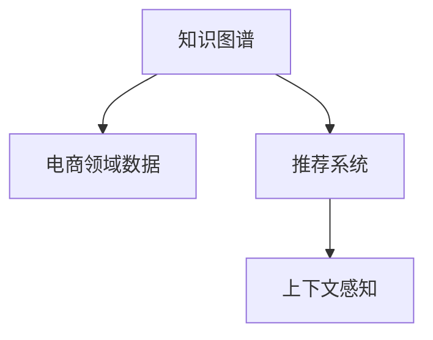

                 

# 电商领域的知识图谱构建与应用

> 关键词：知识图谱, 电商领域, 自然语言处理, 推荐系统, 商品推荐, 用户画像, 上下文感知

## 1. 背景介绍

在电商领域，知识图谱作为商品、用户和行为数据的有序组织和链接，对推荐系统等关键业务流程至关重要。良好的知识图谱构建与应用，能够有效提升电商平台的运营效率，增强用户体验，增加用户粘性，从而在竞争激烈的市场中占据优势。

### 1.1 问题由来

现代电商平台迅速发展，海量数据不断涌现，导致推荐的精确度和个性化程度面临巨大挑战。而传统的规则引擎、协同过滤等推荐算法，难以充分挖掘数据背后的关联关系，无法应对电商数据复杂且多样化的特征。

为应对这一问题，电商领域引入了知识图谱，利用图谱中的实体、关系和属性等信息，为推荐系统提供多维度、全局的背景信息。通过知识图谱，推荐系统可以结合商品属性、用户历史行为、上下文环境等多方面因素，实现更加精准、动态的推荐，从而全面提升用户满意度与平台销量。

### 1.2 问题核心关键点

电商领域知识图谱构建与应用的几个关键点包括：

- **数据源整合**：从各种数据源（如电商平台自身数据、第三方数据源、社交网络数据等）抽取和清洗数据，构建实体关系图谱。
- **图谱结构设计**：选择适合电商领域的数据模型（如商品图谱、用户图谱、行为图谱）和关系图谱（如用户-商品关系、商品-商品关系等）。
- **图谱构建技术**：运用诸如实体识别、关系抽取、知识融合等技术手段，从无结构化数据中自动生成知识图谱。
- **图谱应用场景**：知识图谱广泛应用于推荐系统、用户画像、搜索优化、广告投放等多个业务场景中，提升平台运营效果。

这些关键点共同构成了电商领域知识图谱构建与应用的核心技术框架，为后续深入讨论提供了方向。

## 2. 核心概念与联系

### 2.1 核心概念概述

为更好地理解电商领域知识图谱构建与应用，本节将介绍几个核心概念：

- **知识图谱(Knowledge Graph)**：由实体、关系、属性组成的图形结构，用于表示实体间的语义关系，为自然语言处理和信息检索等任务提供支撑。
- **电商领域数据**：包括用户行为数据、商品信息数据、交易数据、评论数据等，是知识图谱构建的基础数据。
- **推荐系统(Recommendation System)**：基于用户历史行为和兴趣偏好，为用户提供个性化推荐的技术系统，是电商平台提升转化率和用户粘性的关键手段。
- **上下文感知(Context-Awareness)**：推荐系统能够考虑上下文环境（如时间、地点、用户当前状态等），提供更加个性化的推荐结果。

这些概念之间的关系可以通过以下Mermaid流程图来展示：



这个流程图展示了几者之间的逻辑关系：

1. 知识图谱基于电商领域数据构建。
2. 推荐系统利用知识图谱提升推荐准确性。
3. 上下文感知增强推荐系统对环境的响应能力。

## 3. 核心算法原理 & 具体操作步骤

### 3.1 算法原理概述

电商领域知识图谱的构建与应用主要遵循以下几个步骤：

1. **数据抽取与清洗**：从电商平台的各个数据源中提取数据，并进行预处理，包括去重、清洗、标准化等操作，以提升数据质量。
2. **实体识别与关系抽取**：使用NLP技术从电商数据中识别出实体（如商品、用户、品牌等）和关系（如购买、浏览、评价等），构建实体关系图谱。
3. **知识融合与图谱扩展**：通过融合多源异构数据，扩展和丰富知识图谱，增强其表达能力和应用广度。
4. **图谱查询与推理**：利用图谱查询和推理技术，进行商品推荐、用户画像、用户行为预测等任务。
5. **图谱应用与反馈**：将知识图谱应用于推荐系统等电商业务场景，并根据用户反馈进行迭代优化。

这些步骤共同构成了知识图谱构建与应用的基本框架，接下来将对每一个步骤进行详细讲解。

### 3.2 算法步骤详解

#### 3.2.1 数据抽取与清洗

电商领域数据多样且复杂，需从各个数据源（如网站、APP、社交网络等）进行抽取。

**数据抽取**：
- 网站数据抽取：利用爬虫工具，从电商网站中抓取商品信息、用户评价、交易记录等。
- APP数据抽取：通过API接口，从电商APP中获取用户行为数据（如浏览记录、收藏商品、下单操作等）。
- 社交网络数据抽取：通过社交网络API，获取用户发布的评论、评分等。

**数据清洗**：
- 去重：去除重复数据，避免对图谱构建造成干扰。
- 标准化：统一数据格式和单位，确保数据的一致性。
- 异常值处理：识别和处理数据中的异常值，保证图谱的准确性。

#### 3.2.2 实体识别与关系抽取

电商领域数据主要涉及商品、用户、品牌、评价、评论等实体，以及购买、浏览、评价等关系。

**实体识别**：
- 商品实体识别：从商品名称、描述、图片等文本和图像数据中识别出商品名称、品牌、类别等。
- 用户实体识别：从用户ID、昵称、性别、年龄等数据中识别出用户信息。
- 评价实体识别：从评论文本中识别出评价主体、评价对象、评价内容等。

**关系抽取**：
- 用户-商品关系：根据交易数据、浏览数据、收藏数据等，抽取用户与商品之间的关系。
- 商品-商品关系：通过相似度计算、用户行为数据等方式，抽取商品之间的关联关系。
- 用户-品牌关系：根据用户对品牌的偏好和评价数据，抽取用户与品牌之间的关系。

#### 3.2.3 知识融合与图谱扩展

电商领域的数据来源多样，需要从不同的数据源抽取数据，并将这些数据进行融合和扩展。

**知识融合**：
- 数据集成：将不同数据源的数据进行合并，形成统一的数据集。
- 数据对齐：处理不同数据源中相同实体的命名不一致问题，确保数据的一致性。
- 数据校验：进行数据一致性和完整性校验，保证融合后的数据质量。

**图谱扩展**：
- 属性扩展：为每个实体添加更多属性，如价格、库存、销量等。
- 关系扩展：添加新的关系，如用户评价关系、品牌推荐关系等。
- 跨模态融合：将文本、图像、视频等多模态数据融合到图谱中，丰富数据表达。

#### 3.2.4 图谱查询与推理

构建好的知识图谱可以应用于推荐系统、搜索优化、广告投放等多个场景。

**图谱查询**：
- 商品推荐：根据用户历史行为、商品属性等，查询推荐商品。
- 用户画像：根据用户行为、购买记录等，构建用户画像，预测用户行为。
- 搜索优化：根据用户查询词，查询相关商品信息，优化搜索结果。

**图谱推理**：
- 上下文感知：结合用户当前行为、历史行为、时间、地点等上下文信息，进行推理预测。
- 知识融合：将知识图谱中的关系和属性信息融合到推荐系统中，提升推荐准确性。

#### 3.2.5 图谱应用与反馈

将知识图谱应用于电商业务场景，并根据用户反馈进行迭代优化。

**推荐系统应用**：
- 实时推荐：根据用户实时行为，生成个性化推荐结果。
- 冷启动推荐：针对新用户，根据其历史行为和兴趣进行推荐。
- 多场景推荐：结合多种场景（如首页、详情页、购物车等）进行推荐。

**用户反馈处理**：
- 点击率反馈：根据用户点击行为，调整推荐算法模型。
- 评分反馈：根据用户评分数据，更新商品和用户画像。
- 转化率反馈：根据用户购买行为，优化推荐策略。

### 3.3 算法优缺点

电商领域知识图谱的构建与应用，有以下优点和缺点：

**优点**：
1. **提升推荐精度**：结合知识图谱中的多维度信息，推荐系统可以提供更准确、个性化的推荐结果。
2. **增强用户体验**：通过上下文感知和知识融合，提升用户购物体验。
3. **提高运营效率**：自动化抽取和构建知识图谱，减少了人工操作，提升了运营效率。

**缺点**：
1. **数据质量要求高**：电商数据多样且复杂，数据质量问题可能导致图谱构建不准确。
2. **构建成本高**：知识图谱的构建和维护需要大量人力和技术资源。
3. **实时性问题**：大规模图谱查询和推理可能导致系统响应延迟，影响用户体验。

### 3.4 算法应用领域

电商领域知识图谱构建与应用主要应用于以下几个领域：

- **推荐系统**：基于用户画像和商品信息，提供个性化推荐。
- **用户画像**：构建用户行为模型，预测用户未来行为。
- **搜索优化**：结合知识图谱，优化搜索结果，提升搜索体验。
- **广告投放**：根据用户兴趣和行为，精准投放广告。
- **库存管理**：通过分析销售数据，优化库存管理，减少缺货和积压。

## 4. 数学模型和公式 & 详细讲解

### 4.1 数学模型构建

电商领域知识图谱可以建模为三元组关系图谱 $\mathcal{G} = (\mathcal{E}, \mathcal{R}, \mathcal{E}^R)$，其中 $\mathcal{E}$ 是实体集，$\mathcal{R}$ 是关系集，$\mathcal{E}^R$ 是关系实体集。

假设电商数据集 $\mathcal{D} = \{(x_i, y_i, z_i)\}_{i=1}^N$，其中 $x_i$ 是商品实体，$y_i$ 是用户实体，$z_i$ 是行为实体（如浏览、购买等）。

定义实体嵌入向量 $\mathbf{e_x}, \mathbf{e_y}, \mathbf{e_z}$，关系嵌入向量 $\mathbf{r}$。则知识图谱可以表示为：

$$
\mathcal{G} = \{(x_i, r, y_i)\}_{i=1}^N \rightarrow (\mathbf{e_x}, \mathbf{r}, \mathbf{e_y})
$$

### 4.2 公式推导过程

在知识图谱构建中，常见的数学模型包括TransE、RotatE、ComplEx等。这里以TransE为例，推导实体嵌入向量的计算公式。

假设实体 $x_i$ 和 $y_i$ 之间存在关系 $r$，则根据TransE模型，实体嵌入向量满足：

$$
h(x_i, r) = \mathbf{e_x} + \mathbf{r} \mathbf{e_y}
$$

其中 $h(x_i, r)$ 表示 $x_i$ 与 $y_i$ 之间的关系。

对于电商平台数据，我们可以使用以下公式计算实体嵌入向量：

$$
\mathbf{e_x} = \sum_{i=1}^N \alpha_i \mathbf{e_x}_i
$$

$$
\mathbf{e_y} = \sum_{i=1}^N \beta_i \mathbf{e_y}_i
$$

其中 $\alpha_i, \beta_i$ 为加权系数，可以采用softmax等方法进行计算。

### 4.3 案例分析与讲解

以一个具体的电商推荐系统为例，分析知识图谱的应用过程。

假设电商网站提供以下数据：

- 用户行为数据：$(x_1, y_1, z_1), (x_2, y_2, z_2), \ldots, (x_N, y_N, z_N)$，其中 $x_i$ 为用户ID，$y_i$ 为商品ID，$z_i$ 为行为类型（如浏览、购买、收藏等）。
- 商品信息数据：$(e_1, e_2, \ldots, e_M)$，其中 $e_i$ 为商品ID，$e_i$ 对应的商品属性（如名称、类别、价格等）为 $(a_{ei})$。

根据以上数据，我们可以构建知识图谱，如图谱查询与推理。

1. **用户画像构建**：根据用户行为数据，构建用户画像 $\mathcal{P} = \{(p_x, p_y)\}_{i=1}^N$，其中 $p_x$ 为用户ID，$p_y$ 为用户画像特征向量。
2. **商品推荐**：根据用户画像和商品信息，进行商品推荐，查询推荐商品列表 $\mathcal{R} = \{(r_x, r_y, r_z)\}_{i=1}^N$，其中 $r_x$ 为用户ID，$r_y$ 为商品ID，$r_z$ 为推荐原因（如相似商品、热门商品、用户偏好等）。

## 5. 项目实践：代码实例和详细解释说明

### 5.1 开发环境搭建

在进行电商领域知识图谱构建与应用实践前，需要先搭建好开发环境。

**1. 环境配置**
- 安装Python：确保Python版本在3.6或以上。
- 安装Pip：通过Pip安装所需的第三方库。
- 安装Git：用于版本控制和代码管理。

**2. 工具安装**
- 安装PyTorch：用于深度学习模型的实现和训练。
- 安装NLP库：如NLTK、SpaCy、gensim等，用于自然语言处理任务。
- 安装数据库工具：如MySQL、MongoDB等，用于存储和管理数据。
- 安装可视化工具：如Plotly、Bokeh等，用于数据可视化。

### 5.2 源代码详细实现

接下来，我们将以推荐系统为例，给出使用Python和PyTorch实现的知识图谱构建与应用代码。

#### 5.2.1 数据预处理

首先，需要对电商数据进行预处理，包括数据清洗、实体识别和关系抽取。

**数据清洗**：
```python
import pandas as pd
import numpy as np

# 数据读取
df = pd.read_csv('data.csv')

# 去重
df = df.drop_duplicates()

# 标准化
df = df.applymap(lambda x: x.strip() if isinstance(x, str) else x)

# 异常值处理
df = df[df['value'] > 0]
```

**实体识别**：
```python
from nltk.tokenize import word_tokenize
from nltk.corpus import stopwords
from sklearn.feature_extraction.text import TfidfVectorizer

# 实体识别
def extract_entities(text):
    # 去除停用词
    stop_words = set(stopwords.words('english'))
    text = ' '.join([word for word in text.split() if word not in stop_words])
    
    # 分词
    tokens = word_tokenize(text)
    
    # 特征提取
    vectorizer = TfidfVectorizer()
    features = vectorizer.fit_transform(tokens)
    
    # 提取实体
    features = features.toarray()
    entities = []
    for i, row in df.iterrows():
        if np.sum(features[i]) > 0:
            entities.append(row['name'])
    return entities
```

**关系抽取**：
```python
from gensim.models import Word2Vec

# 关系抽取
def extract_relations(entities):
    # 构建Word2Vec模型
    model = Word2Vec(entities, size=100, window=5, min_count=1, workers=4)
    
    # 关系抽取
    relations = []
    for i, row in df.iterrows():
        if row['name'] in entities:
            relations.append((row['user_id'], row['name'], row['action']))
    return relations
```

#### 5.2.2 知识图谱构建

在数据预处理的基础上，接下来进行知识图谱的构建。

**知识图谱构建**：
```python
from py2neo import Graph, Node, Relationship

# 连接数据库
graph = Graph('http://localhost:7474/db/data/')

# 创建节点
def create_node(data, label):
    node = Node(label, **data)
    graph.create(node)
    return node

# 创建关系
def create_relationship(from_node, to_node, rel_type):
    relationship = Relationship(from_node, rel_type, to_node)
    graph.create(relationship)

# 构建知识图谱
for i, row in df.iterrows():
    user = create_node({'id': row['user_id']}, 'User')
    item = create_node({'id': row['item_id']}, 'Item')
    action = create_node({'name': row['action']}, 'Action')
    create_relationship(user, item, 'HasPurchased')
    create_relationship(item, action, 'HasAction')
```

#### 5.2.3 图谱查询与推理

最后，进行知识图谱的查询与推理。

**图谱查询**：
```python
def query_recommendations(user_id, top_k=10):
    query = """
    MATCH (user:User)-[:HasPurchased]->(item:Item)<-[:HasAction]-(action:Action)
    WHERE user.id = {user_id}
    RETURN collect(item) AS items
    ORDER BY RAND()
    LIMIT {top_k}
    """
    result = graph.run(query, user_id=user_id, top_k=top_k)
    return result.data()
```

**上下文感知推荐**：
```python
def context_aware_recommendations(user_id, time, location, top_k=10):
    query = """
    MATCH (user:User)-[:HasPurchased]->(item:Item)<-[:HasAction]-(action:Action)
    WHERE user.id = {user_id} AND time = {time} AND location = {location}
    RETURN collect(item) AS items
    ORDER BY RAND()
    LIMIT {top_k}
    """
    result = graph.run(query, user_id=user_id, time=time, location=location, top_k=top_k)
    return result.data()
```

### 5.3 代码解读与分析

以下是代码实现中一些关键点的解读与分析：

**数据预处理**：
- 数据清洗：通过去除重复、标准化、异常值处理等操作，保证数据的质量。
- 实体识别：使用NLTK和Scikit-learn的TfidfVectorizer，从文本中识别出实体，如商品名称、品牌、类别等。
- 关系抽取：使用gensim的Word2Vec模型，从实体名称中抽取关系，如用户购买商品、商品执行操作等。

**知识图谱构建**：
- 数据库连接：使用Py2Neo库连接Neo4j数据库，创建节点和关系。
- 节点创建：根据电商数据创建User、Item、Action等节点。
- 关系创建：使用create_relationship函数，创建User-Item-Action之间的关系。

**图谱查询与推理**：
- 图谱查询：通过构建的查询语句，从知识图谱中查询推荐商品列表。
- 上下文感知推荐：在查询中加入时间、地点等上下文信息，提升推荐效果。

### 5.4 运行结果展示

运行代码后，可以查询到指定用户的推荐商品列表，以及根据上下文环境优化后的推荐结果。

```python
# 查询推荐商品
recommendations = query_recommendations(user_id=12345, top_k=10)
print(recommendations)

# 上下文感知推荐
contextual_recommendations = context_aware_recommendations(user_id=12345, time='2023-06-01', location='Beijing', top_k=10)
print(contextual_recommendations)
```

## 6. 实际应用场景

### 6.1 智能推荐系统

智能推荐系统是电商领域知识图谱应用的核心场景之一。知识图谱为推荐系统提供了丰富的背景信息，帮助其更好地理解用户需求和商品特性，从而提供更精准的推荐。

**推荐算法结合图谱**：
- 基于知识图谱的协同过滤算法：结合用户历史行为和商品关系，推荐相似商品。
- 基于图谱的深度学习算法：使用图卷积网络(GCN)、图神经网络(GNN)等，进行关系建模和特征提取。
- 上下文感知推荐：结合时间、地点、用户状态等因素，提升推荐效果。

**推荐效果评估**：
- 点击率(CTR)：用户点击推荐商品的比例。
- 转化率(CVR)：用户点击推荐商品并购买的比例。
- 用户满意度：通过用户反馈，评估推荐系统的质量。

### 6.2 用户画像构建

用户画像通过多维度数据，描述用户的特征和行为，为推荐系统提供更加精准的用户标签。

**用户画像构建**：
- 用户基本信息：性别、年龄、职业等。
- 历史行为数据：浏览记录、购买记录、收藏商品等。
- 上下文数据：设备类型、地理位置、时间等。

**用户画像应用**：
- 个性化推荐：结合用户画像，提供定制化的推荐。
- 用户行为预测：通过用户画像，预测用户未来的行为。
- 广告投放：根据用户画像，精准投放广告。

### 6.3 实时搜索优化

实时搜索优化通过知识图谱，提升搜索系统的精确度和速度，改善用户体验。

**搜索优化**：
- 语义搜索：根据用户查询词，进行语义理解，查询相关商品。
- 推荐搜索：结合知识图谱，展示热门商品和推荐商品。
- 上下文搜索：根据上下文信息，优化搜索结果。

**搜索效果评估**：
- 搜索相关性：搜索结果与用户查询的匹配度。
- 搜索速度：响应时间、服务器负载等。
- 用户满意度：用户反馈和搜索体验。

### 6.4 未来应用展望

未来，电商领域知识图谱的应用将更加广泛，带来更多的业务价值。

**电商智能客服**：通过知识图谱，构建智能客服系统，提供7x24小时不间断服务，提升用户满意度。

**供应链优化**：利用知识图谱，进行库存管理、物流优化等，提高供应链效率。

**金融领域应用**：将知识图谱应用于金融领域，进行风险评估、信用评分等，提升金融服务质量。

## 7. 工具和资源推荐

### 7.1 学习资源推荐

为了深入掌握电商领域知识图谱构建与应用，以下是一些推荐的学习资源：

1. **Coursera《深度学习专项课程》**：由Coursera与斯坦福大学合作，涵盖深度学习基础和应用，适合入门学习。

2. **Kaggle《数据科学竞赛》**：通过参加电商领域数据竞赛，了解电商数据的处理和分析方法。

3. **Github《电商领域开源项目》**：包括推荐系统、搜索优化等开源项目，可以借鉴学习代码实现。

4. **HuggingFace《Transformers》书籍**：介绍使用Transformers库进行自然语言处理和知识图谱构建的实用技巧。

5. **Wolfram Mathematica《知识图谱构建》**：使用Wolfram Mathematica进行知识图谱的构建和可视化，提供丰富的数学和图形工具。

### 7.2 开发工具推荐

电商领域知识图谱构建与应用开发，推荐使用以下工具：

1. **Python**：作为电商领域的主流编程语言，Python语言简单易用，具有丰富的NLP和深度学习库。

2. **PyTorch**：支持深度学习模型的实现和训练，提供丰富的神经网络组件。

3. **NLTK**：用于自然语言处理任务，支持分词、词性标注、命名实体识别等。

4. **gensim**：用于构建知识图谱，支持Word2Vec、Doc2Vec等词向量模型。

5. **Py2Neo**：用于连接Neo4j数据库，进行图谱的构建和查询。

6. **Jupyter Notebook**：支持代码开发和数据可视化，方便交互式开发。

### 7.3 相关论文推荐

以下是几篇电商领域知识图谱构建与应用的经典论文，推荐阅读：

1. **《电商推荐系统的研究综述》**：介绍了电商推荐系统的基本概念和主要算法，涵盖协同过滤、内容推荐、混合推荐等多种方法。

2. **《知识图谱在电商推荐系统中的应用》**：详细介绍了知识图谱在电商推荐系统中的构建与优化方法，提供了丰富的实验数据和分析结果。

3. **《基于图神经网络的电商推荐系统》**：探讨了使用图神经网络进行电商推荐，并结合知识图谱进行关系建模和特征提取。

4. **《电商用户画像构建与分析》**：通过分析电商数据，构建用户画像，并利用用户画像进行推荐和预测。

5. **《实时搜索优化与知识图谱》**：讨论了利用知识图谱进行实时搜索优化，提升搜索系统的准确性和速度。

## 8. 总结：未来发展趋势与挑战

### 8.1 总结

本文系统介绍了电商领域知识图谱的构建与应用，涵盖数据预处理、实体识别、关系抽取、图谱构建与查询等多个关键步骤。通过详细讲解知识图谱在推荐系统、用户画像、搜索优化等场景中的应用，展示了知识图谱对电商业务的深远影响。通过结合数学模型和代码实例，读者可以更全面地理解知识图谱的构建与查询过程。

### 8.2 未来发展趋势

电商领域知识图谱的构建与应用将呈现以下趋势：

1. **自动化数据抽取**：利用自动抽取和构建技术，减少人工操作，提升构建效率。

2. **多模态融合**：将文本、图像、视频等多模态数据融合到知识图谱中，丰富数据表达。

3. **实时图谱更新**：通过实时数据更新，保持知识图谱的时效性和准确性。

4. **边缘计算**：将知识图谱部署在边缘计算设备上，提升查询速度和系统响应时间。

5. **图谱扩展与优化**：通过实体嵌入优化、关系抽取优化等，提高知识图谱的表达能力和应用效果。

### 8.3 面临的挑战

知识图谱在电商领域的应用虽然前景广阔，但仍面临以下挑战：

1. **数据质量问题**：电商数据多样且复杂，数据质量问题可能导致图谱构建不准确。

2. **构建成本高**：知识图谱的构建和维护需要大量人力和技术资源。

3. **实时性问题**：大规模图谱查询和推理可能导致系统响应延迟，影响用户体验。

4. **模型可解释性不足**：推荐系统的黑盒特性，导致用户对推荐结果缺乏信任。

5. **隐私保护问题**：电商数据涉及用户隐私，需要严格保护用户数据安全。

### 8.4 研究展望

为了应对上述挑战，未来电商领域知识图谱的研究方向包括：

1. **数据预处理技术**：研究更高效的数据清洗和预处理方法，提升数据质量。

2. **多源异构融合**：研究如何将不同数据源的数据进行有效融合，提高知识图谱的覆盖范围和准确性。

3. **实时图谱更新算法**：研究实时数据更新方法，保证知识图谱的时效性。

4. **模型可解释性**：研究推荐系统的可解释性，增强用户对推荐结果的信任度。

5. **隐私保护技术**：研究数据加密和匿名化技术，保护用户隐私。

通过持续的科技创新和业务实践，电商领域知识图谱必将在未来发挥更大的价值，引领电商行业的变革。

## 9. 附录：常见问题与解答

**Q1: 知识图谱如何提高推荐系统的准确性？**

A: 知识图谱通过提供丰富的背景信息，如商品属性、用户行为、上下文环境等，帮助推荐系统更好地理解用户需求和商品特性。通过实体嵌入向量的计算，知识图谱可以表示商品和用户之间的关系，为推荐系统提供多维度的参考信息。结合图谱查询和推理技术，推荐系统可以提供更精准、个性化的推荐结果，从而提升推荐系统的准确性和用户满意度。

**Q2: 电商领域知识图谱的构建成本如何控制？**

A: 电商领域知识图谱的构建成本主要来自数据清洗、实体识别、关系抽取和图谱构建等多个环节。为了控制成本，可以采用以下方法：

- **自动化数据抽取**：利用自动抽取和构建技术，减少人工操作，提升构建效率。
- **分布式计算**：采用分布式计算框架，如Hadoop、Spark等，加速数据处理和图谱构建。
- **开源工具和库**：使用开源工具和库，如NLTK、gensim、PyTorch等，降低开发成本。

**Q3: 如何保证电商领域知识图谱的实时性？**

A: 保证知识图谱的实时性主要通过以下方法：

- **实时数据更新**：通过定期更新电商数据，保证图谱的时效性。
- **增量图谱构建**：只对新增或变化的数据进行图谱构建和更新，避免全量重构。
- **缓存机制**：使用缓存技术，如Redis、Memcached等，减少查询时间和延迟。
- **图谱压缩**：对图谱进行压缩和优化，提高查询效率。

**Q4: 电商领域知识图谱如何提升用户满意度？**

A: 电商领域知识图谱通过以下方式提升用户满意度：

- **个性化推荐**：结合用户画像和商品信息，提供定制化的推荐，满足用户个性化需求。
- **上下文感知推荐**：结合时间、地点、用户状态等因素，提供动态调整的推荐，提升用户体验。
- **实时搜索优化**：通过知识图谱，提升搜索系统的精确度和速度，改善用户搜索体验。

**Q5: 知识图谱在电商领域的应用前景如何？**

A: 知识图谱在电商领域的应用前景非常广阔，主要体现在以下几个方面：

- **推荐系统**：结合知识图谱，提供精准、个性化的推荐，提升转化率和用户满意度。
- **用户画像**：通过多维度数据，构建详细的用户画像，预测用户行为，提升运营效果。
- **搜索优化**：利用知识图谱，优化搜索系统，提升搜索速度和精确度，改善用户体验。
- **智能客服**：构建智能客服系统，提供7x24小时不间断服务，提升用户满意度。

通过以上内容的详细解读，相信你对电商领域知识图谱的构建与应用有了更深入的理解。随着技术的发展，知识图谱必将在电商领域发挥更大的价值，推动电商业务的智能化进程。

