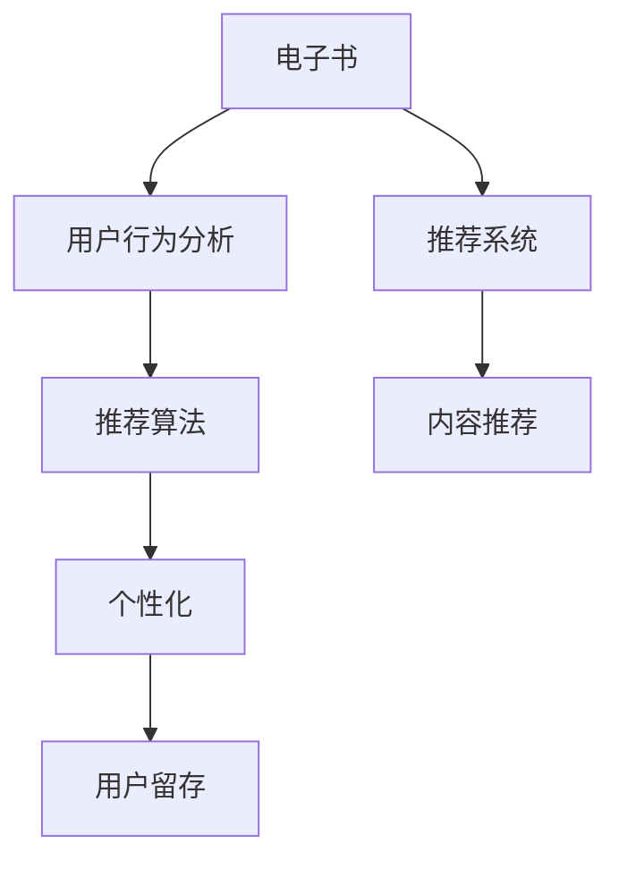

                 

# 电子书市场在注意力经济中的变革

> 关键词：电子书, 注意力经济, 推荐系统, 用户行为分析, 内容推荐, 数据驱动, 个性化, 用户留存, 阅读偏好, 算法优化, 应用案例

## 1. 背景介绍

### 1.1 问题由来

随着互联网的普及和数字技术的不断发展，电子书市场正经历着深刻的变化。传统的纸质书籍销售逐渐被电子书所取代，读者可以随时随地通过电子设备阅读，极大地提升了阅读的便利性和灵活性。然而，由于海量内容的泛滥，电子书市场的竞争也变得愈发激烈。如何在众多电子书中选择出满足用户需求的作品，成为电子书运营商的首要难题。

在这一背景下，注意力经济应运而生。注意力经济（Attention Economy），指的是在信息爆炸的时代，如何吸引和保持用户的注意力，从而实现商业价值的最大化。随着互联网、社交媒体、推荐系统等技术的发展，注意力经济在各行各业得到了广泛应用。在电子书市场中，基于注意力的推荐算法成为实现精准推荐的利器，深刻影响着电子书市场的运营策略和用户行为。

### 1.2 问题核心关键点

注意力经济与电子书市场紧密相关，其核心关键点主要包括以下几点：

1. **用户注意力**：用户注意力是电子书运营商最大的资产。如何精准捕捉用户的注意力，成为提升用户留存和购买率的关键。
2. **推荐算法**：推荐算法是注意力经济的核心技术，其优劣直接决定了用户体验和转化率。
3. **数据驱动**：数据的收集、分析和应用是推荐算法的基础，高质量的数据是提升推荐精度的重要保障。
4. **个性化**：用户需求具有高度的个性化，推荐系统需要根据不同用户的需求进行定制化推荐。
5. **用户留存**：用户留存率是电子书运营商的核心指标，优秀的推荐系统能够有效提升用户留存率。
6. **算法优化**：推荐算法的不断优化是提升推荐精度的必由之路，算法创新和迭代是电子书运营商的重要任务。

## 2. 核心概念与联系

### 2.1 核心概念概述

为更好地理解电子书市场在注意力经济中的变革，本节将介绍几个密切相关的核心概念：

- **电子书**：以电子形式存储的书籍，可以通过各种电子设备阅读，如手机、平板电脑、电子阅读器等。
- **注意力经济**：指在信息过载的时代，如何通过吸引和保持用户的注意力，实现商业价值的最大化。
- **推荐系统**：根据用户的历史行为和偏好，推荐可能感兴趣的内容。广泛应用于电子商务、新闻、音乐等领域，极大地提升了用户体验。
- **用户行为分析**：通过数据分析手段，理解用户的行为模式和需求，为推荐算法提供数据支持。
- **内容推荐**：根据用户的行为和偏好，推荐合适的电子书内容，提升用户满意度。
- **数据驱动**：以数据为基础，通过算法和技术手段，实现决策和推荐的自动化。
- **个性化**：根据用户的个性化需求，提供量身定制的内容推荐，提升用户体验。
- **用户留存**：提高用户的活跃度和使用时间，增加用户对平台的粘性。

这些核心概念之间的逻辑关系可以通过以下Mermaid流程图来展示：



这个流程图展示了大语言模型的核心概念及其之间的关系：

1. 电子书通过用户行为分析获得数据支持。
2. 推荐系统使用推荐算法对数据进行处理，输出个性化内容推荐。
3. 个性化算法根据用户需求进行定制化推荐，提高用户满意度。
4. 用户留存率是衡量推荐系统效果的最终指标，优秀的推荐系统能提升用户留存。

这些概念共同构成了电子书市场在注意力经济中的变革框架，使得电子书运营商能够更好地理解用户需求，优化推荐系统，提升用户留存率。

## 3. 核心算法原理 & 具体操作步骤
### 3.1 算法原理概述

电子书市场中的推荐算法主要基于用户的浏览行为、购买历史、评分数据等，通过用户-物品关联矩阵计算用户对不同书籍的兴趣，从而推荐可能感兴趣的内容。推荐算法的核心原理包括：

1. **协同过滤**：根据用户-物品的协同行为进行推荐。基于用户历史行为或物品相似性进行推荐，适用于用户与物品的隐式评分数据。
2. **内容推荐**：根据书籍的元数据（如作者、出版年份、主题等）进行推荐。通过分析书籍内容特征，推荐与用户兴趣相关的内容。
3. **混合推荐**：综合使用协同过滤和内容推荐，通过加权或集成算法，提升推荐精度。

在电子书市场中，推荐算法主要解决以下问题：

- 用户画像构建：通过分析用户的行为数据，建立用户画像，理解用户的兴趣和需求。
- 内容过滤和召回：从大量的书籍中筛选出符合用户兴趣的内容。
- 用户满意度提升：根据用户反馈和行为，不断优化推荐算法，提升用户满意度。

### 3.2 算法步骤详解

电子书市场中的推荐算法步骤主要包括：

**Step 1: 数据收集与处理**

1. 收集用户的数据：用户浏览历史、购买历史、评分数据等。
2. 数据清洗和预处理：处理缺失值、异常值，对数据进行归一化和标准化处理。
3. 数据划分：将数据分为训练集、验证集和测试集。

**Step 2: 用户画像构建**

1. 特征提取：从用户数据中提取特征，如浏览历史、购买历史、评分数据等。
2. 用户聚类：使用聚类算法（如K-Means）将用户分为不同群体，理解不同群体的兴趣偏好。
3. 用户画像表示：将用户特征和聚类结果表示为用户向量。

**Step 3: 推荐模型训练**

1. 协同过滤模型：使用基于矩阵分解或基于用户-物品共现图的方法，计算用户对不同书籍的兴趣。
2. 内容推荐模型：使用基于书籍元数据的方法，如TF-IDF、主题模型等，计算书籍与用户兴趣的相关度。
3. 混合推荐模型：结合协同过滤和内容推荐模型，使用加权或集成算法，提升推荐精度。

**Step 4: 推荐结果生成**

1. 根据训练好的模型，计算用户对不同书籍的兴趣得分。
2. 选择得分最高的书籍，生成推荐结果。
3. 根据用户的反馈和行为，不断优化模型参数，提升推荐精度。

**Step 5: 评估与优化**

1. 使用AUC、PR曲线、F1-score等指标，评估推荐结果的质量。
2. 分析推荐结果，找出问题和改进方向。
3. 进行模型优化和调整，提升推荐精度和用户满意度。

### 3.3 算法优缺点

电子书市场中的推荐算法具有以下优点：

1. **个性化推荐**：能够根据用户的个性化需求，提供量身定制的推荐，提升用户体验。
2. **高效性**：推荐算法能够实时处理用户的查询，提供即时反馈，提升用户满意度。
3. **广泛适用性**：适用于各种类型的电子书推荐，如小说、学术书籍、技术书籍等。
4. **提升用户留存**：优秀的推荐系统能够提升用户留存率，增加用户粘性。

同时，这些算法也存在一些缺点：

1. **数据依赖**：推荐算法依赖于大量的用户数据，数据收集和处理成本较高。
2. **冷启动问题**：对于新用户或新书籍，缺乏足够的数据进行推荐，需要解决冷启动问题。
3. **过拟合问题**：推荐算法容易过拟合，需要定期对模型进行优化和调整。
4. **计算复杂度**：大规模的推荐系统计算复杂度较高，需要高效的计算和存储技术支持。

尽管存在这些缺点，但推荐算法仍然是电子书市场中的重要技术手段，通过持续优化和迭代，可以不断提升推荐效果。

### 3.4 算法应用领域

电子书市场中的推荐算法已经在多个领域得到了广泛应用，例如：

- **个性化推荐**：根据用户的历史行为和偏好，推荐个性化电子书。
- **内容筛选**：从海量书籍中筛选出符合用户兴趣的书籍，提升用户浏览体验。
- **新书推广**：通过推荐算法，推广新书，增加用户对新书的兴趣和购买率。
- **用户留存**：通过推荐算法，提升用户活跃度和留存率，增加用户对平台的粘性。
- **智能客服**：使用推荐算法，为用户提供智能客服服务，解答用户疑问，提升用户体验。

除了这些常见的应用外，推荐算法还被创新性地应用于电子书市场中的更多场景中，如情感分析、用户行为预测、阅读模式分析等，为电子书运营商带来了新的应用场景和价值。

## 4. 数学模型和公式 & 详细讲解 & 举例说明
### 4.1 数学模型构建

电子书市场中的推荐算法主要基于协同过滤和内容推荐，其数学模型可以表示为：

1. **协同过滤模型**：
   - 用户-物品关联矩阵 $\mathbf{U} \in \mathbb{R}^{m \times n}$，其中 $m$ 为用户的数量，$n$ 为物品（书籍）的数量。
   - 用户特征矩阵 $\mathbf{A} \in \mathbb{R}^{m \times k}$，其中 $k$ 为用户特征的维度。
   - 物品特征矩阵 $\mathbf{V} \in \mathbb{R}^{n \times k}$，其中 $k$ 为物品特征的维度。
   - 用户画像表示 $\mathbf{U}_a = \mathbf{UA} \mathbf{A}^{-1}$，其中 $\mathbf{A}^{-1}$ 为 $\mathbf{A}$ 的逆矩阵。
   - 物品画像表示 $\mathbf{V}_a = \mathbf{VV}^T$。
   - 用户对物品的兴趣得分 $s = \mathbf{U}_a \mathbf{V}_a$。

2. **内容推荐模型**：
   - 书籍元数据矩阵 $\mathbf{C} \in \mathbb{R}^{n \times d}$，其中 $d$ 为书籍元数据的维度。
   - 用户特征矩阵 $\mathbf{A} \in \mathbb{R}^{m \times k}$，其中 $k$ 为用户特征的维度。
   - 用户画像表示 $\mathbf{U}_c = \mathbf{CA} \mathbf{A}^{-1}$，其中 $\mathbf{A}^{-1}$ 为 $\mathbf{A}$ 的逆矩阵。
   - 书籍内容特征 $s = \mathbf{U}_c \mathbf{C}$。

### 4.2 公式推导过程

以下我们以协同过滤模型为例，推导用户对物品兴趣得分的计算公式。

协同过滤模型中的用户画像表示可以表示为：

$$
\mathbf{U}_a = \mathbf{UA} \mathbf{A}^{-1}
$$

其中 $\mathbf{A}$ 为用户的特征矩阵，$\mathbf{A}^{-1}$ 为 $\mathbf{A}$ 的逆矩阵。因此，用户对物品的兴趣得分可以表示为：

$$
s = \mathbf{U}_a \mathbf{V}_a = (\mathbf{UA} \mathbf{A}^{-1}) \mathbf{V}_a
$$

在得到用户对物品的兴趣得分后，可以将其作为推荐结果。

### 4.3 案例分析与讲解

假设有一个包含1000个用户和1000本电子书的用户-物品关联矩阵 $\mathbf{U}$，其中每个元素表示用户对物品的评分。通过协同过滤模型计算每个用户对每本书籍的兴趣得分，并将得分较高的书籍推荐给用户。

具体实现步骤如下：

1. 收集用户对每本书籍的评分数据，构建用户-物品关联矩阵 $\mathbf{U}$。
2. 从用户-物品关联矩阵 $\mathbf{U}$ 中提取用户特征矩阵 $\mathbf{A}$ 和物品特征矩阵 $\mathbf{V}$。
3. 计算用户画像表示 $\mathbf{U}_a = \mathbf{UA} \mathbf{A}^{-1}$ 和物品画像表示 $\mathbf{V}_a = \mathbf{VV}^T$。
4. 计算用户对每本书籍的兴趣得分 $s = \mathbf{U}_a \mathbf{V}_a$。
5. 根据兴趣得分，选择得分最高的书籍进行推荐。

## 5. 项目实践：代码实例和详细解释说明
### 5.1 开发环境搭建

在进行推荐算法实践前，我们需要准备好开发环境。以下是使用Python进行推荐系统开发的常用环境配置流程：

1. 安装Python和Anaconda：从官网下载并安装Python和Anaconda，用于创建独立的Python环境。

2. 创建并激活虚拟环境：
```bash
conda create -n recommender-env python=3.8
conda activate recommender-env
```

3. 安装必要的Python包：
```bash
pip install pandas numpy scikit-learn scipy matplotlib seaborn
```

4. 安装推荐系统框架：
```bash
pip install Surprise
```

5. 安装数据处理和可视化工具：
```bash
pip install numpy scipy matplotlib seaborn
```

完成上述步骤后，即可在`recommender-env`环境中开始推荐系统开发。

### 5.2 源代码详细实现

这里我们以协同过滤算法为例，给出使用Surprise库对用户-物品关联矩阵进行协同过滤的Python代码实现。

首先，定义协同过滤算法的参数和训练数据：

```python
from surprise import Reader, Dataset, SVD
from surprise.model_selection import cross_validate

reader = Reader(rating_scale=(1, 5))
data = Dataset.load_from_file('ratings.csv', reader=reader)

svd = SVD()
```

然后，定义推荐算法和评估指标：

```python
algo = svd
evaluator = SpearmanCorrelation()
k_folds = 10
folds = list(data.build_folds(k_folds=k_folds))
```

接着，训练模型并在验证集上评估：

```python
trainset, testset = data.split_with_folds(folds)
cross_validate(algo, trainset, testset, measures=['RMSE', 'MAE'], cv=folds, verbose=True, n_runs=1)
```

最后，使用训练好的模型进行推荐：

```python
algo.fit(trainset)
test_preds = algo.test(testset)
top_n = 10
for uid, iid, est, true_r in test_preds:
    for j in range(top_n):
        if j < true_r:
            item_iid = iid[j]
            print(f"User {uid} predicted {item_iid} with score {est[j]}")
```

以上就是使用Surprise库对用户-物品关联矩阵进行协同过滤的完整代码实现。可以看到，利用Surprise库，开发者可以很方便地实现协同过滤算法的训练和推荐。

### 5.3 代码解读与分析

让我们再详细解读一下关键代码的实现细节：

**Surprise库**：
- 是Python中常用的推荐系统库，提供了多种推荐算法，包括协同过滤、基于矩阵分解的算法等。
- 提供了简单易用的API，方便开发者实现推荐系统的训练和评估。

**协同过滤算法**：
- 使用SVD算法对用户-物品关联矩阵进行协同过滤，得到用户对物品的兴趣得分。
- 在训练过程中，通过交叉验证评估模型性能，选择最优的模型参数。
- 在推荐时，使用训练好的模型对新用户进行预测，输出用户可能感兴趣的物品。

**代码实现**：
- 使用Surprise库中的SVD算法实现协同过滤。
- 通过reader读取数据，使用交叉验证评估模型性能，选择合适的参数。
- 训练好的模型输出用户对物品的兴趣得分，推荐得分最高的物品给用户。

通过上述代码实现，可以看出推荐系统在电子书市场中的应用非常广泛，开发者可以根据具体需求选择不同的算法，进行模型训练和推荐。

## 6. 实际应用场景

### 6.1 电子书推荐系统

电子书推荐系统是电子书市场中的核心应用之一，通过推荐算法帮助用户发现感兴趣的电子书。基于推荐算法的电子书推荐系统能够提升用户的阅读体验，增加用户留存率，提升用户满意度。

在实际应用中，推荐系统可以根据用户的浏览历史、购买历史、评分数据等，生成个性化的电子书推荐列表。通过不断地学习和优化，推荐系统能够更好地理解用户的兴趣和需求，提供更加精准的推荐结果。

### 6.2 新书推广

电子书市场中的新书推广也是一个重要的应用场景。通过推荐算法，平台可以识别出具有潜力的新书，并将其推荐给目标用户。优质的新书推广能够提升新书曝光度，增加用户对新书的兴趣和购买率。

在实际操作中，推荐系统可以根据书籍的元数据（如作者、出版年份、主题等），结合用户的历史行为数据，生成适合用户兴趣的新书推荐。通过不断地优化推荐算法，平台可以更好地把握用户的兴趣点，提升新书推广的效果。

### 6.3 用户行为预测

预测用户行为是电子书市场中的重要应用之一，通过预测用户的行为，平台可以提前采取措施，提升用户满意度和留存率。

在实际应用中，推荐系统可以根据用户的浏览历史、购买历史、评分数据等，预测用户是否会购买某本书籍。通过不断地学习和优化，推荐系统能够更准确地预测用户行为，帮助平台优化运营策略。

## 7. 工具和资源推荐
### 7.1 学习资源推荐

为了帮助开发者系统掌握电子书推荐系统的理论基础和实践技巧，这里推荐一些优质的学习资源：

1. 《推荐系统实战》系列博文：由Recommender System专家撰写，深入浅出地介绍了推荐系统的基本概念和经典算法。

2. Coursera《推荐系统》课程：斯坦福大学开设的推荐系统课程，涵盖了推荐系统的基本概念、算法和实践技巧。

3. 《推荐系统》书籍：由Wang Jifeng等专家撰写，全面介绍了推荐系统的理论和实践，适合深入学习推荐系统。

4. Surprise官方文档：Surprise库的官方文档，提供了丰富的推荐系统算法和案例，适合快速上手实践。

5. Kaggle推荐系统竞赛：Kaggle平台上举办的多项推荐系统竞赛，适合通过实际竞赛提升算法实践能力。

通过对这些资源的学习实践，相信你一定能够快速掌握电子书推荐系统的精髓，并用于解决实际的电子书推荐问题。

### 7.2 开发工具推荐

高效的开发离不开优秀的工具支持。以下是几款用于推荐系统开发的常用工具：

1. Python：Python语言简单易用，是推荐系统开发的主流语言。

2. NumPy：Python的科学计算库，适合处理大规模矩阵运算和数据处理。

3. Pandas：Python的数据处理库，适合进行数据的读取、清洗和预处理。

4. Scikit-learn：Python的机器学习库，适合进行推荐算法和模型评估。

5. PyTorch：基于Python的深度学习框架，适合实现基于深度学习的推荐系统。

6. Surprise：Python的推荐系统库，适合实现常见的推荐算法。

7. TensorFlow：由Google主导的深度学习框架，适合实现基于深度学习的推荐系统。

合理利用这些工具，可以显著提升推荐系统开发的效率，加快创新迭代的步伐。

### 7.3 相关论文推荐

电子书推荐系统的发展得益于学界的持续研究。以下是几篇奠基性的相关论文，推荐阅读：

1. Koren Y.《Factorization Machines with Side Information》：提出了基于矩阵分解的推荐算法，对推荐系统的发展产生了深远影响。

2. He X. et al.《A Personalized PageRank Algorithm for Recommender Systems》：提出基于PageRank的推荐算法，有效地解决了冷启动问题。

3. McAuley J. et al.《Scalable Semantic Representations for Recommender Systems》：提出基于语义表示的推荐算法，提升推荐系统的效果。

4. Yang Q. et al.《Neural Collaborative Filtering》：提出基于深度学习的推荐算法，提升了推荐系统的精度和效果。

这些论文代表了大语言模型推荐系统的发展脉络。通过学习这些前沿成果，可以帮助研究者把握学科前进方向，激发更多的创新灵感。

## 8. 总结：未来发展趋势与挑战

### 8.1 总结

本文对电子书市场在注意力经济中的变革进行了全面系统的介绍。首先阐述了注意力经济与电子书市场的紧密关系，明确了推荐算法在提升用户留存和提升用户体验中的重要作用。其次，从原理到实践，详细讲解了推荐算法的数学模型和操作步骤，给出了推荐系统开发的完整代码实例。同时，本文还广泛探讨了推荐算法在电子书推荐、新书推广、用户行为预测等多个应用场景中的应用前景，展示了推荐算法的巨大潜力。此外，本文精选了推荐算法的各类学习资源，力求为读者提供全方位的技术指引。

通过本文的系统梳理，可以看到，推荐算法在电子书市场中的应用非常广泛，通过不断优化和迭代，可以显著提升用户满意度和留存率。未来，伴随推荐算法的持续演进，基于推荐算法的电子书市场必将在更大范围内得到应用，为出版商、读者和平台带来新的价值。

### 8.2 未来发展趋势

展望未来，电子书市场中的推荐算法将呈现以下几个发展趋势：

1. **个性化推荐**：推荐算法将更加注重用户的个性化需求，提供量身定制的推荐结果。通过深度学习和大数据分析，推荐算法能够更好地理解用户的兴趣和需求。
2. **实时推荐**：推荐系统将实现实时推荐，即在用户查询时即时生成推荐结果，提升用户体验。实时推荐需要高效的算法和存储技术支持。
3. **跨平台推荐**：推荐系统将实现跨平台推荐，即在不同设备（如手机、平板、PC等）间提供一致的推荐结果。跨平台推荐需要解决数据共享和同步问题。
4. **用户行为预测**：推荐系统将通过预测用户行为，提前采取措施，提升用户满意度和留存率。预测算法需要更多的数据和更高效的模型。
5. **多模态推荐**：推荐系统将结合文本、图像、视频等多模态数据，提供更加丰富和全面的推荐结果。多模态推荐需要解决数据融合和模型融合问题。
6. **情感分析和用户反馈**：推荐系统将通过情感分析和用户反馈，不断优化推荐结果。情感分析和用户反馈需要更多的自然语言处理技术支持。

以上趋势凸显了推荐算法的广阔前景。这些方向的探索发展，必将进一步提升电子书市场中的推荐效果，为出版商、读者和平台带来更多的价值。

### 8.3 面临的挑战

尽管推荐算法已经在电子书市场中得到了广泛应用，但在迈向更加智能化、普适化应用的过程中，它仍面临着诸多挑战：

1. **数据质量问题**：推荐算法依赖于高质量的数据，数据的缺失、异常和噪声将影响算法的性能。
2. **冷启动问题**：对于新用户或新书籍，推荐算法缺乏足够的数据进行推荐，需要解决冷启动问题。
3. **计算复杂度**：推荐算法需要处理大规模的数据，计算复杂度较高，需要高效的算法和存储技术支持。
4. **隐私保护**：推荐算法需要收集和分析用户的个人数据，如何保护用户的隐私，是一个重要问题。
5. **公平性和偏见**：推荐算法容易产生偏见，如何保证算法的公平性和公正性，是一个重要问题。
6. **动态变化**：用户的兴趣和需求是动态变化的，如何动态更新推荐算法，是一个重要问题。

正视推荐算法面临的这些挑战，积极应对并寻求突破，将推荐算法在电子书市场中进一步推广和应用。相信随着学界和产业界的共同努力，这些挑战终将一一被克服，推荐算法必将在电子书市场中发挥更大的作用。

### 8.4 研究展望

面向未来，推荐算法的持续优化和迭代将是提升电子书市场中的推荐效果的关键。以下是一些值得关注的研究方向：

1. **深度学习**：结合深度学习技术，提升推荐算法的精度和效果。深度学习能够更好地理解复杂的数据和模式。
2. **多模态融合**：结合多种数据类型，提升推荐算法的全面性和多样性。多模态融合需要解决数据融合和模型融合问题。
3. **联邦学习**：通过联邦学习技术，保护用户的隐私，提升推荐算法的公平性和公正性。
4. **动态推荐**：结合在线学习技术，实时更新推荐算法，提升推荐算法的动态性和适应性。
5. **推荐系统的伦理和法律问题**：研究推荐系统的伦理和法律问题，保障用户的隐私和安全。

这些研究方向的探索，将为推荐算法在电子书市场中的应用提供新的思路和方法，推动推荐算法的发展和应用。

## 9. 附录：常见问题与解答

**Q1：推荐算法是否适用于所有类型的电子书？**

A: 推荐算法适用于各种类型的电子书，包括小说、学术书籍、技术书籍等。不同类型的电子书，推荐算法需要针对其特点进行优化，才能得到更好的效果。

**Q2：推荐算法如何处理冷启动问题？**

A: 推荐算法可以通过以下方式处理冷启动问题：
1. 使用用户的历史行为和物品的历史评分，预测用户对物品的兴趣。
2. 使用协同过滤算法，通过用户和物品的共现关系，进行推荐。
3. 使用基于内容的推荐算法，结合物品的元数据进行推荐。
4. 使用混合推荐算法，结合多种推荐方式，提升推荐效果。

**Q3：推荐算法如何优化用户体验？**

A: 推荐算法可以通过以下方式优化用户体验：
1. 实时推荐，即在用户查询时即时生成推荐结果，提升用户体验。
2. 多设备推荐，即在不同设备间提供一致的推荐结果，提升用户体验。
3. 个性化推荐，即根据用户的个性化需求，提供量身定制的推荐结果，提升用户体验。
4. 动态推荐，即根据用户的实时行为和偏好，不断更新推荐结果，提升用户体验。

**Q4：推荐算法的计算复杂度如何降低？**

A: 推荐算法的计算复杂度可以通过以下方式降低：
1. 使用矩阵分解等高效的推荐算法，减少计算量。
2. 使用稀疏矩阵等数据结构，减少数据存储和计算的开销。
3. 使用分布式计算和并行计算，提升计算效率。
4. 使用模型压缩和剪枝技术，减小模型规模，提升推理速度。

通过上述优化措施，可以显著降低推荐算法的计算复杂度，提升推荐系统的效率和效果。

通过本文的系统梳理，可以看到，电子书市场中的推荐算法正在不断地发展和进步，为出版商、读者和平台带来了新的价值。相信随着推荐算法的持续优化和迭代，基于推荐算法的电子书市场必将在更大范围内得到应用，为出版商、读者和平台带来更多的价值。

