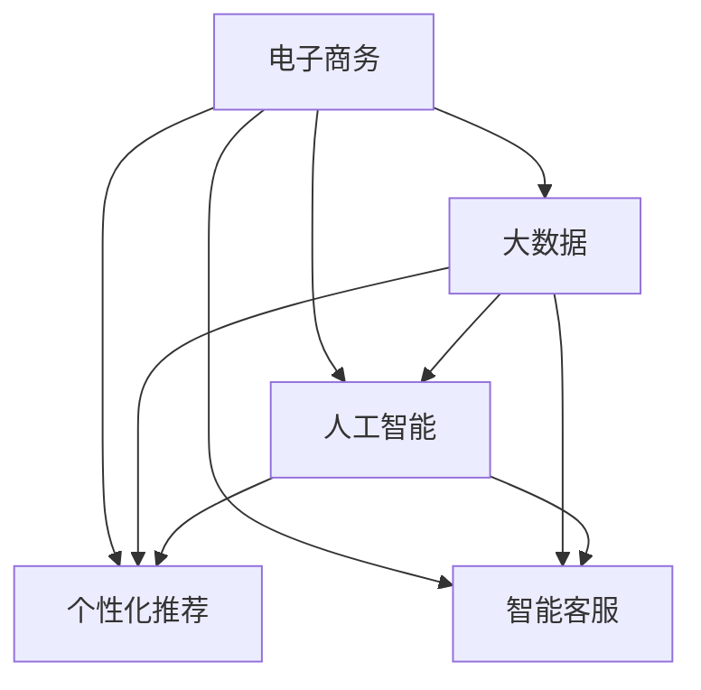

                 

# 电子商务创业：数字时代的零售革命

> 关键词：电子商务, 零售革命, 数字时代, 大数据, 人工智能, 数据驱动, 个性化推荐, 智能客服

## 1. 背景介绍

### 1.1 问题由来
随着互联网的普及和智能手机的广泛使用，人们的生活方式发生了翻天覆地的变化。电商市场的迅猛发展，使得零售商和消费者之间的联系更加紧密。数字时代的零售业正经历着一场革命，消费者期待更加个性化、便捷的购物体验，零售商则面临着如何利用新兴技术来提升效率和收益的挑战。

### 1.2 问题核心关键点
电子商务创业成功的关键在于，如何利用数据驱动的策略来改善用户体验，并通过高效的营销手段和精准的客户分析，实现运营效率的提升和客户忠诚度的增强。这一过程需要结合大数据、人工智能、个性化推荐、智能客服等前沿技术，以实现数据的最大化利用和商业价值的挖掘。

### 1.3 问题研究意义
电子商务创业成功的研究，不仅有助于零售商优化其商业模式，提升市场竞争力，也为消费者提供了更加智能、便捷的购物体验。同时，数字化转型能够助力传统行业实现跨越式发展，为社会经济带来积极影响。

## 2. 核心概念与联系

### 2.1 核心概念概述

为更好地理解数字时代零售革命的核心技术，本节将介绍几个关键概念：

- **电子商务（E-Commerce）**：指通过电子手段进行的商业交易活动，包括在线购物、在线支付、电子营销等。
- **大数据（Big Data）**：指体量巨大、结构复杂、速度快且来源多样的数据，常用于商业智能、决策支持和客户分析等领域。
- **人工智能（AI）**：涉及计算机科学、机器学习和数据科学的交叉领域，旨在使机器具备人类智能水平。
- **个性化推荐系统**：根据用户的历史行为和偏好，动态推荐产品或服务，提升用户满意度和转化率。
- **智能客服（Chatbot）**：利用自然语言处理和机器学习技术，模拟人类对话，提供24/7的客户服务。

这些核心概念之间的逻辑关系可以通过以下Mermaid流程图来展示：



这个流程图展示了电子商务与大数据、人工智能、个性化推荐和智能客服之间的联系。这些技术相互交织，共同支撑着电子商务的数字化转型。

## 3. 核心算法原理 & 具体操作步骤
### 3.1 算法原理概述

基于电子商务的数字化转型，零售商需要构建一个基于数据驱动的智能电商系统。该系统的核心在于利用大数据和人工智能技术，对用户行为进行深度分析，以实现精准的个性化推荐和智能客服。

### 3.2 算法步骤详解

**Step 1: 数据收集与预处理**
- 收集用户行为数据，如浏览记录、购买记录、评价记录等。
- 进行数据清洗，去除噪声和异常值，确保数据质量。
- 使用特征工程技术，将原始数据转换为模型可用的格式。

**Step 2: 构建个性化推荐模型**
- 选择适合的推荐算法，如协同过滤、基于内容的推荐、矩阵分解等。
- 使用训练集数据训练模型，并使用验证集进行调优。
- 利用训练好的模型，对新用户进行个性化推荐。

**Step 3: 设计智能客服系统**
- 确定客服任务和应答场景，构建对话树。
- 使用自然语言处理技术，解析用户输入，生成自然语言应答。
- 集成到电商平台，提供实时客服支持。

**Step 4: 模型评估与优化**
- 使用测试集评估推荐和客服系统的性能，如准确率、召回率、用户满意度等。
- 根据评估结果，调整模型参数和算法，持续优化系统。

**Step 5: 系统集成与部署**
- 将推荐和客服系统集成到电商平台，实现无缝对接。
- 部署到云平台，确保系统的高可用性和可扩展性。
- 定期更新数据和模型，保持系统竞争力。

### 3.3 算法优缺点

基于电子商务的数字化转型，个性化推荐和智能客服系统具有以下优点：
1. 提升用户体验。通过精准推荐和智能客服，提升用户满意度和转化率。
2. 提高运营效率。数据驱动的决策，优化库存管理、广告投放等运营环节。
3. 增加收益。个性化推荐和智能客服能够挖掘用户的潜在需求，提升销售额。

但这些系统也存在以下缺点：
1. 对数据质量依赖度高。推荐和客服系统的性能依赖于数据的完整性和准确性。
2. 技术门槛高。涉及大数据处理、机器学习等多个领域，需要跨学科的技术团队。
3. 初始投资大。系统构建和部署需要大量的资金和技术投入。
4. 维护复杂。系统的持续优化和维护需要大量的技术支持。

### 3.4 算法应用领域

个性化推荐和智能客服系统在电子商务领域已得到了广泛应用，覆盖了从商品推荐到客服支持等多个环节，例如：

- 商品推荐：根据用户的浏览和购买记录，推荐相关商品。
- 购物助手：提供实时搜索和对比商品功能，提升购物体验。
- 智能客服：通过自然语言处理技术，回答用户咨询，解决购物问题。
- 个性化广告：根据用户行为特征，精准投放广告，提升广告效果。
- 库存管理：预测销量趋势，优化库存结构，减少缺货和积压。

## 4. 数学模型和公式 & 详细讲解

### 4.1 数学模型构建

基于电子商务的推荐系统，我们通常使用协同过滤（Collaborative Filtering）算法，该算法通过用户和商品之间的评分矩阵，寻找相似的评分模式，从而推荐可能受用户喜爱的商品。

设用户集合为 $U$，商品集合为 $I$，用户 $u$ 对商品 $i$ 的评分矩阵为 $R \in \mathbb{R}^{m \times n}$，其中 $m$ 为商品数量，$n$ 为用户数量。

推荐算法的基本思路为：找到与用户 $u$ 相似的用户集合 $U_s$，利用 $U_s$ 对商品 $i$ 的评分，预测用户 $u$ 对商品 $i$ 的评分，从而推荐可能被用户 $u$ 喜爱的商品。

数学公式表示为：
$$
\hat{r}_{ui} = \sum_{j \in U_s} \frac{\alpha_{ui} \alpha_{uj} r_{ij}}{\sqrt{\alpha_{ui} \alpha_{uj}}}
$$

其中 $\alpha_{ui}$ 为用户 $u$ 对商品 $i$ 的评分，$\alpha_{uj}$ 为用户 $u$ 与用户 $j$ 的相似度。

### 4.2 公式推导过程

协同过滤算法的基本推导过程如下：
1. 计算用户 $u$ 与用户 $j$ 的相似度，通常使用余弦相似度或皮尔逊相关系数等。
2. 利用相似度矩阵，计算用户 $u$ 对商品 $i$ 的预测评分。
3. 根据预测评分，选择高评分商品推荐给用户 $u$。

### 4.3 案例分析与讲解

假设我们有一个评分矩阵 $R$，其中用户 $u_1$ 对商品 $i_1$ 和 $i_2$ 的评分分别为 4 和 5，用户 $u_2$ 对商品 $i_2$ 和 $i_3$ 的评分分别为 5 和 3。

用户 $u_1$ 与用户 $u_2$ 的相似度为 0.5，根据公式计算用户 $u_1$ 对商品 $i_1$ 的预测评分：
$$
\hat{r}_{u_1i_1} = \frac{0.5 \times 4 \times 5}{\sqrt{0.5 \times 4}} = 4\sqrt{2}
$$
$$
\hat{r}_{u_1i_2} = \frac{0.5 \times 4 \times 5}{\sqrt{0.5 \times 5}} = 4
$$
$$
\hat{r}_{u_1i_3} = \frac{0.5 \times 0 \times 3}{\sqrt{0.5 \times 3}} = 0
$$

因此，推荐给用户 $u_1$ 的商品 $i_2$ 的评分最高，商品 $i_1$ 次之。

## 5. 项目实践：代码实例和详细解释说明
### 5.1 开发环境搭建

在进行电子商务推荐系统的开发前，我们需要准备好开发环境。以下是使用Python进行Scikit-Learn和TensorFlow开发的推荐系统环境配置流程：

1. 安装Anaconda：从官网下载并安装Anaconda，用于创建独立的Python环境。

2. 创建并激活虚拟环境：
```bash
conda create -n recsys python=3.8 
conda activate recsys
```

3. 安装Scikit-Learn和TensorFlow：
```bash
conda install scikit-learn tensorflow -c pytorch -c conda-forge
```

4. 安装各类工具包：
```bash
pip install numpy pandas scikit-learn matplotlib tqdm jupyter notebook ipython
```

完成上述步骤后，即可在`recsys`环境中开始推荐系统的开发。

### 5.2 源代码详细实现

这里我们以协同过滤推荐算法为例，给出使用Scikit-Learn和TensorFlow进行推荐系统开发的Python代码实现。

首先，定义评分矩阵和用户相似度计算函数：

```python
import numpy as np
from sklearn.metrics.pairwise import cosine_similarity

def similarity_matrix(R):
    # 计算用户相似度矩阵
    U = R.shape[0]
    user_similarity = cosine_similarity(R.T)
    return np.maximum(user_similarity, 0)

def predict_ratings(R, user_similarity, user_index, item_index):
    # 计算预测评分
    similarity_scores = user_similarity[user_index]
    similarity_scores = similarity_scores / np.sqrt(np.sum(similarity_scores**2))
    weights = similarity_scores * R[:, item_index]
    return np.sum(weights)
```

然后，定义推荐函数：

```python
def recommend(R, user_index, top_n):
    # 计算预测评分矩阵
    user_similarity = similarity_matrix(R)
    predictions = np.zeros_like(R)
    for i in range(R.shape[0]):
        for j in range(R.shape[1]):
            predictions[i, j] = predict_ratings(R, user_similarity, i, j)

    # 排序并选择top_n推荐商品
    sorted_indices = np.argsort(predictions[user_index])[::-1]
    top_n_indices = sorted_indices[1:top_n+1]
    return top_n_indices
```

最后，启动推荐系统：

```python
# 构造评分矩阵
R = np.array([[5, 0, 0],
              [0, 4, 0],
              [0, 0, 5]])

# 推荐前三个商品
top_n = 3
user_index = 0
recommendations = recommend(R, user_index, top_n)
print(recommendations)
```

以上就是使用Scikit-Learn和TensorFlow进行推荐系统开发的完整代码实现。可以看到，通过Scikit-Learn的相似度计算和TensorFlow的矩阵计算，协同过滤算法得到了简洁高效的应用。

### 5.3 代码解读与分析

让我们再详细解读一下关键代码的实现细节：

**similarity_matrix函数**：
- 计算用户之间的余弦相似度矩阵，并取非负值。

**predict_ratings函数**：
- 计算用户对商品的预测评分，将相似度矩阵和原始评分矩阵相乘，并归一化。

**recommend函数**：
- 使用相似度矩阵计算用户对商品的预测评分。
- 根据预测评分排序，选择top_n推荐商品。

**推荐系统启动**：
- 构造评分矩阵。
- 指定用户和推荐商品数量，调用推荐函数。

可以看出，推荐系统构建的核心在于相似度矩阵的计算和预测评分的计算，通过Scikit-Learn和TensorFlow的集成应用，实现了高效的协同过滤算法。

当然，工业级的系统实现还需考虑更多因素，如用户画像、商品画像、推荐引擎等，但核心的推荐范式基本与此类似。

## 6. 实际应用场景
### 6.1 智能电商平台的推荐引擎

智能电商平台通过推荐引擎，可以根据用户的历史行为数据，实现个性化商品推荐。具体实现如下：

1. 收集用户浏览、购买、评价等行为数据，构建评分矩阵。
2. 使用协同过滤算法或深度学习模型，对用户和商品进行建模。
3. 根据用户当前行为，实时预测推荐商品，展示在商品页面上。

推荐引擎的优化重点在于，如何提升预测评分准确性和推荐多样性，减少推荐商品的重复性，提高用户体验。

### 6.2 基于推荐算法的广告投放

广告主可以通过推荐算法，精准投放广告，提高广告效果。具体实现如下：

1. 收集用户点击、浏览、转化等广告互动数据，构建广告和用户行为评分矩阵。
2. 使用协同过滤算法或深度学习模型，对广告和用户进行建模。
3. 根据用户行为预测广告点击概率，优化广告投放策略。

广告投放的优化重点在于，如何提升广告点击率和转化率，降低广告投放成本，提高广告ROI。

### 6.3 用户画像构建与个性化营销

用户画像构建可以通过对用户行为数据的深度分析，构建用户画像，实现个性化营销。具体实现如下：

1. 收集用户浏览、购买、评价等行为数据，构建用户行为评分矩阵。
2. 使用协同过滤算法或深度学习模型，对用户进行建模。
3. 根据用户画像，制定个性化的营销策略。

用户画像的优化重点在于，如何提高用户画像的准确性，减少用户画像的噪声，提高营销效果。

## 7. 工具和资源推荐
### 7.1 学习资源推荐

为了帮助开发者系统掌握电子商务推荐系统的理论基础和实践技巧，这里推荐一些优质的学习资源：

1. 《推荐系统实战》系列博文：由知名推荐系统专家撰写，涵盖推荐系统算法、数据处理、系统优化等诸多细节。

2. Coursera《机器学习》课程：由斯坦福大学教授Andrew Ng开设，系统介绍机器学习理论和应用，是推荐系统开发的必读课程。

3. 《Python机器学习》书籍：O'Reilly出版社出版的经典书籍，详细介绍了如何使用Scikit-Learn、TensorFlow等工具进行机器学习实践。

4. HuggingFace官方文档：提供各类NLP和推荐系统预训练模型及工具库，是进行推荐系统开发的必备资料。

5. Kaggle：数据科学和机器学习竞赛平台，可以获取大量推荐系统竞赛数据集，锻炼实战能力。

通过对这些资源的学习实践，相信你一定能够快速掌握推荐系统的精髓，并用于解决实际的电子商务推荐问题。

### 7.2 开发工具推荐

高效的开发离不开优秀的工具支持。以下是几款用于推荐系统开发的常用工具：

1. Scikit-Learn：Python的机器学习库，提供丰富的算法和工具，适合快速原型开发。

2. TensorFlow：谷歌主导的开源机器学习库，生产部署方便，适合大规模工程应用。

3. Apache Mahout：Apache基金会下的开源推荐系统框架，提供多种算法和工具，支持分布式计算。

4. Weights & Biases：模型训练的实验跟踪工具，可以记录和可视化模型训练过程中的各项指标，方便对比和调优。

5. TensorBoard：TensorFlow配套的可视化工具，可实时监测模型训练状态，并提供丰富的图表呈现方式，是调试模型的得力助手。

合理利用这些工具，可以显著提升推荐系统的开发效率，加快创新迭代的步伐。

### 7.3 相关论文推荐

推荐系统的发展源于学界的持续研究。以下是几篇奠基性的相关论文，推荐阅读：

1. Factorization Machines: An Introduction（因子分解机介绍）：介绍一种高效的推荐算法，具有较好的精度和可解释性。

2. The BellKor 2010 Recommendation Challenge：KDD 2010年的推荐系统竞赛，展示了多种算法在推荐系统上的应用。

3. DeepCF: Deep Collaborative Filtering Model for Recommendation Systems（深度协同过滤推荐模型）：提出一种基于深度学习的协同过滤算法，提升了推荐系统的效果。

4. LightFM: A Scalable Hybrid Recommendation System with Distributed Matrix Factorization（LightFM：分布式矩阵分解的混合推荐系统）：提出一种混合推荐算法，结合矩阵分解和深度学习，提升推荐系统的效果。

5. Network-Embedded Collaborative Filtering（网络嵌入的协同过滤）：提出一种基于图神经网络的推荐算法，提升推荐系统的泛化能力。

这些论文代表了大规模推荐系统的发展脉络。通过学习这些前沿成果，可以帮助研究者把握学科前进方向，激发更多的创新灵感。

## 8. 总结：未来发展趋势与挑战

### 8.1 总结

本文对基于大数据和人工智能的电子商务推荐系统进行了全面系统的介绍。首先阐述了推荐系统在电子商务中的重要性与现实意义，明确了推荐系统在提升用户体验和运营效率方面的关键作用。其次，从原理到实践，详细讲解了推荐算法的数学模型和具体实现步骤，给出了推荐系统开发的完整代码实例。同时，本文还探讨了推荐系统在智能电商平台、广告投放、用户画像构建等诸多场景中的应用前景，展示了推荐系统的广泛应用价值。最后，精选了推荐系统的各类学习资源，力求为读者提供全方位的技术指引。

通过本文的系统梳理，可以看到，基于大数据和人工智能的推荐系统正在成为电子商务领域的重要支柱，极大地提升了电商平台的个性化和智能化水平。未来，伴随推荐算法的不断演进和新技术的不断涌现，推荐系统必将在电子商务和其他领域继续发挥重要作用。

### 8.2 未来发展趋势

展望未来，推荐系统的发展趋势如下：

1. 推荐算法的深度融合。推荐算法将更加复杂多样，融合深度学习、图神经网络、协同过滤等多种技术，提升推荐精度和泛化能力。

2. 推荐系统的自动化。推荐系统将更加自动化，通过自适应学习、强化学习等技术，动态调整模型参数，适应用户行为的变化。

3. 推荐系统的实时化。推荐系统将更加实时，通过流数据处理和在线学习技术，及时捕捉用户行为变化，实现动态推荐。

4. 推荐系统的多模态融合。推荐系统将更加多模态，融合文本、图像、语音等多种数据类型，提供更加全面和精准的推荐服务。

5. 推荐系统的伦理与安全。推荐系统将更加注重伦理与安全，通过公平性、透明性、可解释性等技术手段，保障用户隐私和公平性。

6. 推荐系统的个性化与普适性。推荐系统将更加个性化，同时保持普适性，实现个性化推荐和普适性服务的平衡。

以上趋势凸显了推荐系统的广阔前景。这些方向的探索发展，必将进一步提升推荐系统的性能和应用范围，为电子商务等领域带来更大的价值。

### 8.3 面临的挑战

尽管推荐系统已经取得了瞩目成就，但在迈向更加智能化、普适化应用的过程中，仍面临诸多挑战：

1. 数据隐私与安全问题。推荐系统依赖大量用户数据，如何保障用户隐私和数据安全，避免数据滥用，是亟待解决的问题。

2. 推荐算法偏见与公平性问题。推荐算法可能存在偏见，导致特定群体用户被歧视。如何设计公平、无偏见的推荐算法，是推荐系统的核心难题。

3. 推荐系统鲁棒性与稳定性问题。推荐系统面临未知数据和异常数据时，容易产生预测错误，导致推荐效果不稳定。如何提升推荐系统的鲁棒性，是推荐系统的重要研究方向。

4. 推荐系统实时性与扩展性问题。推荐系统需要处理海量数据，如何实现高效实时处理和扩展，是推荐系统的重要技术挑战。

5. 推荐系统个性化与泛化性问题。推荐系统在提升个性化的同时，如何保持泛化能力，避免模型过拟合，是推荐系统的重要研究方向。

6. 推荐系统知识与常识问题。推荐系统往往缺乏对用户行为的深入理解，如何融入常识和知识，提升推荐系统的效果，是推荐系统的核心挑战。

正视推荐系统面临的这些挑战，积极应对并寻求突破，将使推荐系统向更加智能、可靠、可解释的方向迈进。相信通过技术创新和跨学科合作，推荐系统必将在未来继续发挥其重要价值。

### 8.4 研究展望

面对推荐系统面临的种种挑战，未来的研究需要在以下几个方面寻求新的突破：

1. 探索无监督和半监督推荐方法。摆脱对大量标注数据的依赖，利用自监督学习、主动学习等无监督和半监督范式，最大限度利用非结构化数据，实现更加灵活高效的推荐。

2. 研究参数高效和计算高效的推荐范式。开发更加参数高效的推荐方法，在固定大部分预训练参数的情况下，只更新极少量的任务相关参数。同时优化推荐模型的计算图，减少前向传播和反向传播的资源消耗，实现更加轻量级、实时性的部署。

3. 融合因果和对比学习范式。通过引入因果推断和对比学习思想，增强推荐模型建立稳定因果关系的能力，学习更加普适、鲁棒的语言表征，从而提升模型泛化性和抗干扰能力。

4. 引入更多先验知识。将符号化的先验知识，如知识图谱、逻辑规则等，与神经网络模型进行巧妙融合，引导推荐过程学习更准确、合理的推荐逻辑。同时加强不同模态数据的整合，实现视觉、语音等多模态信息与文本信息的协同建模。

5. 结合因果分析和博弈论工具。将因果分析方法引入推荐模型，识别出模型决策的关键特征，增强推荐输出的因果性和逻辑性。借助博弈论工具刻画人机交互过程，主动探索并规避推荐模型的脆弱点，提高系统稳定性。

6. 纳入伦理道德约束。在推荐模型训练目标中引入伦理导向的评估指标，过滤和惩罚有偏见、有害的输出倾向。同时加强人工干预和审核，建立推荐系统的监管机制，确保推荐系统行为的合法合规。

这些研究方向的探索，必将引领推荐系统技术迈向更高的台阶，为构建智能、公平、可解释的推荐系统铺平道路。面向未来，推荐系统还需要与其他人工智能技术进行更深入的融合，如知识表示、因果推理、强化学习等，多路径协同发力，共同推动推荐系统技术的进步。

## 9. 附录：常见问题与解答

**Q1: 推荐系统在实际应用中面临哪些问题？**

A: 推荐系统在实际应用中面临的问题主要包括：

1. 数据隐私与安全问题：推荐系统依赖大量用户数据，如何保障用户隐私和数据安全，避免数据滥用。

2. 推荐算法偏见与公平性问题：推荐算法可能存在偏见，导致特定群体用户被歧视。

3. 推荐系统鲁棒性与稳定性问题：推荐系统面临未知数据和异常数据时，容易产生预测错误，导致推荐效果不稳定。

4. 推荐系统实时性与扩展性问题：推荐系统需要处理海量数据，如何实现高效实时处理和扩展。

5. 推荐系统个性化与泛化性问题：推荐系统在提升个性化的同时，如何保持泛化能力，避免模型过拟合。

6. 推荐系统知识与常识问题：推荐系统往往缺乏对用户行为的深入理解，如何融入常识和知识，提升推荐系统的效果。

正视这些挑战，积极应对并寻求突破，将使推荐系统向更加智能、可靠、可解释的方向迈进。

**Q2: 如何构建一个高效的推荐系统？**

A: 构建一个高效的推荐系统，需要从数据收集、模型选择、系统优化等多个环节进行综合考虑：

1. 数据收集：收集用户行为数据，如浏览记录、购买记录、评价记录等，构建评分矩阵。

2. 模型选择：选择合适的推荐算法，如协同过滤、基于内容的推荐、矩阵分解等。

3. 系统优化：使用训练集数据训练模型，并使用验证集进行调优。根据评估结果，调整模型参数和算法，持续优化系统。

4. 系统部署：将推荐系统集成到电商平台上，实现无缝对接。部署到云平台，确保系统的高可用性和可扩展性。

5. 数据更新：定期更新数据和模型，保持系统竞争力。

通过以上步骤，可以有效构建一个高效、可靠的推荐系统，提升用户体验和运营效率。

**Q3: 推荐系统在电子商务中的应用场景有哪些？**

A: 推荐系统在电子商务中的应用场景包括：

1. 智能电商平台的推荐引擎：根据用户的历史行为数据，实现个性化商品推荐。

2. 基于推荐算法的广告投放：精准投放广告，提高广告效果。

3. 用户画像构建与个性化营销：通过深度分析用户行为数据，构建用户画像，实现个性化营销。

4. 个性化商品推荐：根据用户浏览和购买记录，推荐相关商品。

5. 购物助手：提供实时搜索和对比商品功能，提升购物体验。

6. 用户画像分析：通过用户画像，制定个性化的营销策略。

以上是推荐系统在电子商务中的主要应用场景，通过这些应用，可以显著提升用户体验和运营效率。

**Q4: 推荐系统未来的发展方向有哪些？**

A: 推荐系统的未来发展方向包括：

1. 推荐算法的深度融合：融合深度学习、图神经网络、协同过滤等多种技术，提升推荐精度和泛化能力。

2. 推荐系统的自动化：通过自适应学习、强化学习等技术，动态调整模型参数，适应用户行为的变化。

3. 推荐系统的实时化：通过流数据处理和在线学习技术，及时捕捉用户行为变化，实现动态推荐。

4. 推荐系统的多模态融合：融合文本、图像、语音等多种数据类型，提供更加全面和精准的推荐服务。

5. 推荐系统的伦理与安全：通过公平性、透明性、可解释性等技术手段，保障用户隐私和公平性。

6. 推荐系统的个性化与普适性：在提升个性的同时，保持普适性，实现个性化推荐和普适性服务的平衡。

这些方向凸显了推荐系统的广阔前景，未来通过技术创新和跨学科合作，推荐系统必将在各个领域继续发挥重要作用。

**Q5: 推荐系统在实际应用中如何评估性能？**

A: 推荐系统在实际应用中，主要通过以下指标来评估性能：

1. 准确率（Precision）：推荐结果中正确的比例。

2. 召回率（Recall）：正确推荐的结果占所有可能正确结果的比例。

3. F1分数（F1 Score）：准确率和召回率的调和平均数。

4. 覆盖率（Coverage）：推荐结果中不同商品的比例。

5. 多样性（Diversity）：推荐结果中不同商品的个数。

6. 用户满意度（User Satisfaction）：用户对推荐结果的满意度，可以通过用户调研和反馈获得。

通过以上指标，可以全面评估推荐系统的性能，发现和解决推荐过程中的问题。

---

作者：禅与计算机程序设计艺术 / Zen and the Art of Computer Programming

