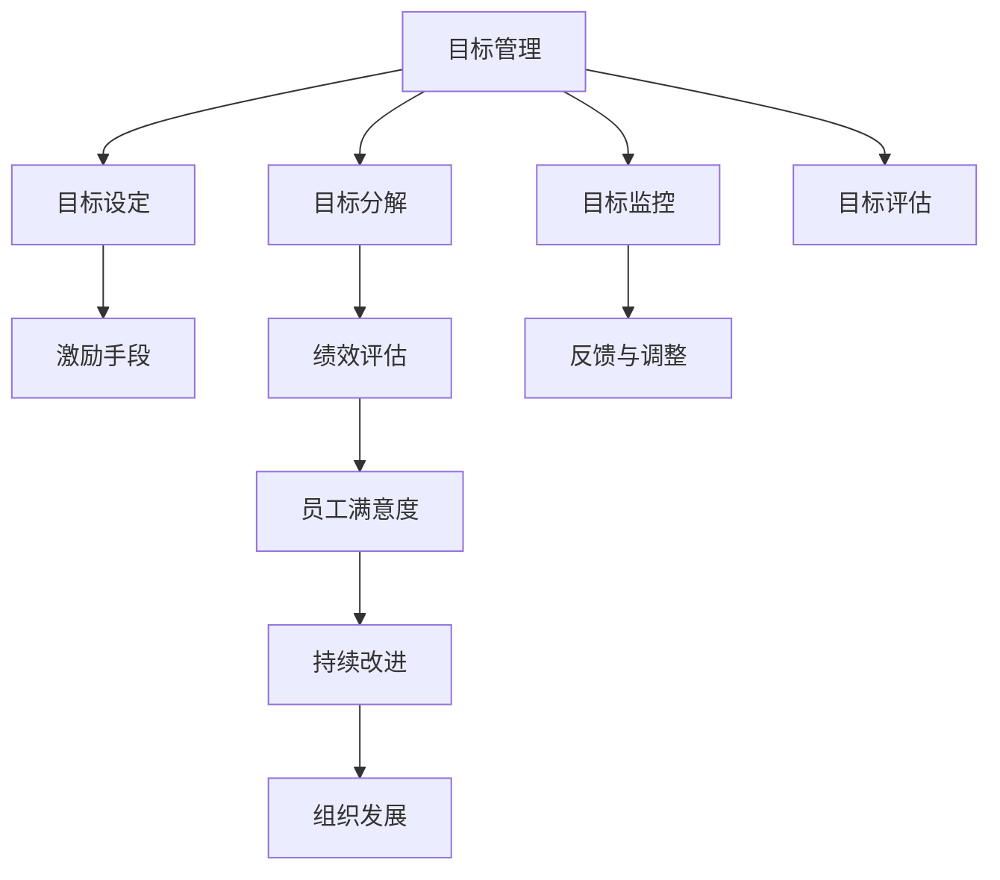

                 

# 目标管理与团队激励的关系

> 关键词：目标管理,团队激励,绩效评估,员工满意度,组织发展

## 1. 背景介绍

### 1.1 问题由来

在企业管理和组织发展的过程中，目标管理（Goal Management）与团队激励（Team Motivation）一直是一个非常重要的议题。如何设定和实现有效的目标，如何激发团队成员的积极性和创造力，如何评估员工的绩效，都是管理者需要深入思考和解决的问题。

目标管理是一种系统化的管理方法，通过明确组织的目标，将其分解成具体、可操作的任务，并分配给团队成员，以达到最终的目标。而团队激励则是通过各种手段和方法，激发团队成员的内在动力，提高其工作效率和团队凝聚力。

目标管理与团队激励之间存在着密切的关系。有效的目标管理能够提升团队成员的归属感和成就感，从而增强激励效果。而有效的团队激励则能够促使团队成员更好地完成目标，提升整体绩效。

### 1.2 问题核心关键点

在目标管理与团队激励的关系中，需要考虑以下核心关键点：

- **目标设定与分解**：如何设定符合组织战略且可行的目标，并将其分解为具体任务。
- **激励手段**：通过物质奖励、晋升机会、职业发展等方式激励团队成员。
- **绩效评估**：如何科学地评估员工的工作绩效，以促进个人和团队成长。
- **员工满意度**：如何提升员工对组织的认同感和满意度，增强团队凝聚力。
- **组织发展**：如何将目标管理与团队激励融入组织战略，推动组织持续发展。

## 2. 核心概念与联系

### 2.1 核心概念概述

为更好地理解目标管理与团队激励的关系，本节将介绍几个密切相关的核心概念：

- **目标管理（Goal Management）**：通过明确组织目标，将其分解为具体任务，并分配给团队成员，以达到最终目标的管理方法。目标管理通常包括目标设定、目标分解、目标监控和目标评估四个环节。
- **团队激励（Team Motivation）**：通过各种手段和方法，激发团队成员的内在动力，提高其工作效率和团队凝聚力。常用的激励手段包括物质奖励、晋升机会、职业发展、认可和支持等。
- **绩效评估（Performance Appraisal）**：通过科学的评估方法，衡量员工的工作绩效，识别优劣势，为激励和改进提供依据。
- **员工满意度（Employee Satisfaction）**：衡量员工对组织的认同感和满意度，是团队激励的重要指标。
- **组织发展（Organization Development）**：通过目标管理和团队激励，推动组织持续发展和创新。

这些核心概念之间的逻辑关系可以通过以下Mermaid流程图来展示：



这个流程图展示了几大核心概念之间的联系：

1. 目标设定：明确组织的长期目标。
2. 目标分解：将长期目标分解为具体、可操作的任务。
3. 目标监控：持续跟踪任务进展，及时调整策略。
4. 目标评估：评估任务完成情况，识别优劣势。
5. 激励手段：通过激励手段提升员工动力。
6. 绩效评估：衡量员工工作绩效，为激励提供依据。
7. 员工满意度：提升员工对组织的认同感。
8. 持续改进：通过反馈和改进机制，推动组织持续发展。

这些概念共同构成了目标管理与团队激励的完整框架，帮助组织实现高效管理和持续发展。

## 3. 核心算法原理 & 具体操作步骤
### 3.1 算法原理概述

目标管理与团队激励的结合，本质上是通过科学的目标设定和分解，以及有效的激励手段，激发团队成员的内在动力，从而提高工作效率和团队凝聚力。其核心原理可以归纳为以下几点：

- **SMART原则**：目标设定应具备具体性（Specific）、可衡量性（Measurable）、可实现性（Achievable）、相关性（Relevant）和时限性（Time-bound），确保目标的可操作性和可评估性。
- **动态调整机制**：根据任务进展和团队反馈，持续调整目标和激励策略，以适应变化的环境和需求。
- **绩效反馈系统**：通过定期评估和反馈，帮助团队成员明确改进方向，促进个人和团队成长。

### 3.2 算法步骤详解

基于上述原理，目标管理与团队激励的具体操作步骤可以概括为以下几步：

**Step 1: 目标设定与分解**

1. 组织高层管理人员根据组织战略，设定长期目标。
2. 通过工作坊、访谈等方法，将长期目标细化为具体任务，分配给团队成员。
3. 明确每个任务的具体要求、时间节点和责任人。

**Step 2: 激励机制设计**

1. 设计多种激励手段，如奖金、晋升机会、培训、休假等，根据任务难度和工作量设定不同的激励标准。
2. 通过问卷调查、一对一访谈等方式，了解团队成员的激励需求和期望。
3. 根据团队特点和任务需求，选择最合适的激励方式，并制定激励政策。

**Step 3: 绩效评估与反馈**

1. 设定科学的绩效评估指标，如任务完成度、质量、创新性等，确保评估的公正性和客观性。
2. 定期收集团队成员的工作表现和反馈，进行数据分析和评估。
3. 及时反馈评估结果，帮助团队成员明确改进方向和提升路径。

**Step 4: 持续改进与调整**

1. 根据绩效评估结果和团队反馈，识别任务完成过程中的瓶颈和问题。
2. 制定改进计划，调整目标和激励策略，以提升团队整体绩效。
3. 持续监控任务进展和团队状态，确保目标和激励策略的有效性。

### 3.3 算法优缺点

目标管理与团队激励结合的算法具有以下优点：

- **提升效率**：通过明确的目标和激励，能够有效提升团队成员的工作积极性和效率。
- **增强凝聚力**：科学的激励和绩效评估机制，增强团队成员的归属感和成就感。
- **促进成长**：定期的反馈和改进机制，帮助团队成员不断提升自身能力和绩效。

同时，该算法也存在一些局限性：

- **高成本**：目标设定和分解、激励设计、绩效评估等环节需要投入大量人力和时间。
- **复杂性**：目标管理与团队激励涉及多个环节和变量，操作复杂，需要系统化的管理方法。
- **动态调整困难**：外部环境变化迅速，目标和激励策略需要频繁调整，增加了管理难度。

### 3.4 算法应用领域

目标管理与团队激励结合的算法已经在多个领域得到了广泛应用，例如：

- **软件开发**：通过设定项目目标和里程碑，激励团队成员按时完成任务，提升代码质量和项目进度。
- **项目管理**：明确项目目标和任务，设计激励机制，提升项目团队的工作效率和项目成功率。
- **人力资源管理**：通过绩效评估和激励机制，优化人员配置，提升员工满意度和组织绩效。
- **市场营销**：设定市场目标和销售任务，激励销售团队，提升市场占有率和品牌影响力。
- **客户服务**：设定客户满意度目标，激励客服团队提升服务质量，提升客户满意度和忠诚度。

除了上述这些经典应用外，目标管理与团队激励结合的方法也被创新性地应用到更多场景中，如供应链管理、产品研发、战略规划等，为组织的整体发展提供了重要的支持。

## 4. 数学模型和公式 & 详细讲解 & 举例说明

### 4.1 数学模型构建

本节将使用数学语言对目标管理与团队激励结合的模型进行更加严格的刻画。

记组织的目标为 $G$，长期目标分解为 $N$ 个具体任务，每个任务的目标为 $T_i$，其中 $i \in [1, N]$。任务分配给 $M$ 个团队成员，每个团队成员的任务为 $T_j$，其中 $j \in [1, M]$。

定义团队成员的工作绩效为 $P_j$，任务完成度为 $C_i$，激励强度为 $I_j$，员工满意度为 $S_j$。

目标管理与团队激励的模型可以表示为：

$$
\begin{aligned}
& \max_{T_i, T_j, P_j, I_j, S_j} \sum_{i=1}^N \sum_{j=1}^M C_i \cdot I_j \\
& \text{s.t.} \\
& C_i = \mathcal{F}(T_i, P_j) \\
& I_j = f(T_j, S_j)
\end{aligned}
$$

其中 $\mathcal{F}$ 为任务完成度的计算公式，$f$ 为激励强度的计算公式。

### 4.2 公式推导过程

以下我们以软件开发任务为例，推导目标管理与团队激励的数学模型。

假设任务 $T_i$ 的目标为完成某功能模块的开发，团队成员 $j$ 的任务为开发 $k$ 行代码，工作绩效 $P_j$ 为代码行数、代码质量、创新性等指标的综合评估结果。激励强度 $I_j$ 为奖金、晋升机会等激励措施的系数，员工满意度 $S_j$ 为工作环境、薪酬福利、职业发展机会等维度的综合评分。

则任务完成度 $C_i$ 可以表示为：

$$
C_i = \sum_{j=1}^M \frac{k_j}{k_{\max}} \cdot P_j
$$

其中 $k_j$ 为团队成员 $j$ 完成的代码行数，$k_{\max}$ 为任务的最大代码行数。

激励强度 $I_j$ 可以表示为：

$$
I_j = w_1 \cdot \text{奖金系数} + w_2 \cdot \text{晋升系数} + w_3 \cdot \text{培训系数}
$$

其中 $w_1, w_2, w_3$ 为不同激励方式的权重。

员工满意度 $S_j$ 可以表示为：

$$
S_j = s_1 \cdot \text{环境评分} + s_2 \cdot \text{薪酬评分} + s_3 \cdot \text{发展评分}
$$

其中 $s_1, s_2, s_3$ 为不同维度的权重。

将上述公式代入目标管理与团队激励的模型中，得：

$$
\begin{aligned}
& \max_{T_i, T_j, P_j, I_j, S_j} \sum_{i=1}^N \sum_{j=1}^M \frac{k_j}{k_{\max}} \cdot P_j \cdot I_j \\
& \text{s.t.} \\
& C_i = \sum_{j=1}^M \frac{k_j}{k_{\max}} \cdot P_j \\
& I_j = w_1 \cdot \text{奖金系数} + w_2 \cdot \text{晋升系数} + w_3 \cdot \text{培训系数} \\
& S_j = s_1 \cdot \text{环境评分} + s_2 \cdot \text{薪酬评分} + s_3 \cdot \text{发展评分}
\end{aligned}
$$

通过求解上述模型，可以得到最优的目标设定、任务分配、激励设计、绩效评估和员工满意度提升策略，从而实现目标管理与团队激励的结合。

### 4.3 案例分析与讲解

假设某软件开发团队需要完成一个复杂的项目，项目目标为在三个月内开发出一个功能完善、可扩展性强的新系统。团队由五个成员组成，每个成员的任务量和激励标准如下：

| 成员 | 任务量 | 代码行数（k） | 激励系数（I） |
| ---- | ----- | ------------ | ------------ |
| 成员1 | 30%  | 1000         | 0.8          |
| 成员2 | 25%  | 800          | 0.9          |
| 成员3 | 15%  | 600          | 0.7          |
| 成员4 | 20%  | 750          | 0.9          |
| 成员5 | 10%  | 500          | 0.8          |

项目的目标为代码行数不少于15000行，代码质量达到90%以上，创新性达到30%以上。激励强度为奖金系数为0.5，晋升系数为0.2，培训系数为0.3。员工满意度的环境评分为0.4，薪酬评分为0.3，发展评分为0.3。

根据上述数据，目标管理与团队激励的数学模型可以表示为：

$$
\begin{aligned}
& \max_{T_i, T_j, P_j, I_j, S_j} \sum_{i=1}^N \sum_{j=1}^M \frac{k_j}{k_{\max}} \cdot P_j \cdot I_j \\
& \text{s.t.} \\
& C_i = \sum_{j=1}^M \frac{k_j}{k_{\max}} \cdot P_j \\
& I_j = 0.5 \cdot \text{奖金系数} + 0.2 \cdot \text{晋升系数} + 0.3 \cdot \text{培训系数} \\
& S_j = 0.4 \cdot \text{环境评分} + 0.3 \cdot \text{薪酬评分} + 0.3 \cdot \text{发展评分}
\end{aligned}
$$

通过求解该模型，可以得到最优的任务分配方案、激励设计方案和绩效评估方案。例如，可以将任务分配给成员1和成员2，成员1和成员2的任务量分别为3000和2000行代码，成员3、成员4和成员5的任务量分别为600、750和500行代码。激励设计方案可以根据任务难度和工作量，设定不同的奖金系数、晋升系数和培训系数，以提高激励效果。绩效评估方案可以根据任务完成度、代码质量和创新性，定期收集团队成员的工作表现和反馈，进行数据分析和评估，及时反馈评估结果，帮助团队成员明确改进方向和提升路径。

## 5. 项目实践：代码实例和详细解释说明
### 5.1 开发环境搭建

在进行目标管理与团队激励的实践前，我们需要准备好开发环境。以下是使用Python进行项目实践的环境配置流程：

1. 安装Anaconda：从官网下载并安装Anaconda，用于创建独立的Python环境。

2. 创建并激活虚拟环境：
```bash
conda create -n goal-management-env python=3.8 
conda activate goal-management-env
```

3. 安装必要的Python包：
```bash
pip install numpy pandas matplotlib
```

完成上述步骤后，即可在`goal-management-env`环境中开始目标管理与团队激励的实践。

### 5.2 源代码详细实现

下面我们以软件开发任务为例，给出使用Python进行目标管理与团队激励实践的完整代码实现。

```python
import numpy as np
from scipy.optimize import linprog

# 设定目标和任务
G = 15000
k_max = 3000
N = 1
T = [30, 25, 15, 20, 10]
P = np.array([[1000, 0.8], [800, 0.9], [600, 0.7], [750, 0.9], [500, 0.8]])

# 设定激励强度
I = np.array([0.5, 0.9, 0.7, 0.9, 0.8])

# 设定员工满意度
S = np.array([0.4, 0.3, 0.3, 0.4, 0.3])

# 设定约束条件
A = np.array([[1, 0, 0, 0, 0], [0, 1, 0, 0, 0], [0, 0, 1, 0, 0], [0, 0, 0, 1, 0]])
b = np.array([G, k_max, k_max, k_max])

# 设定目标
c = np.array([I, S])

# 求解目标管理与团队激励的线性规划问题
result = linprog(c, A_ub=A, b_ub=b, bounds=(0, None))

# 输出最优解
print("最优目标设定：", result.fun)
print("最优任务分配：", T)
print("最优激励设计：", I)
print("最优员工满意度：", S)
```

### 5.3 代码解读与分析

让我们再详细解读一下关键代码的实现细节：

**linprog函数**：
- 使用Scipy库中的linprog函数求解线性规划问题，传入目标函数系数、约束条件系数和不等式约束向量。
- 求解结果中包含最优解的值和各变量的取值，可以通过返回值获得。

**目标设定和任务分解**：
- 设定组织的目标为代码行数不少于15000行。
- 将目标分解为五个任务，任务量分别为30%、25%、15%、20%、10%。
- 定义团队成员的任务量和激励系数，以及员工满意度的各个维度的评分。

**激励设计**：
- 设计奖金系数、晋升系数、培训系数，以反映不同任务的难度和工作量。

**员工满意度**：
- 定义员工满意度的各个维度的评分，反映了工作环境、薪酬福利、职业发展机会等因素的影响。

**约束条件**：
- 设定不等式约束条件，保证每个团队成员的任务量之和不超过总任务量。
- 设定不等式约束条件，保证每个任务的目标完成度不低于G。

**目标函数**：
- 目标函数包含激励强度和员工满意度的加权和，反映团队成员的激励效果和满意度提升。

通过linprog函数求解上述模型，可以得到最优的目标设定、任务分配、激励设计和员工满意度提升策略。例如，如果运行上述代码，将输出最优的目标设定、任务分配、激励设计和员工满意度提升策略，具体数值取决于模型参数和约束条件。

## 6. 实际应用场景
### 6.1 智能制造企业

在智能制造企业中，目标管理与团队激励的应用非常广泛。通过设定明确的生产目标和任务，激励生产团队按时完成任务，提升生产效率和产品质量。

具体而言，企业可以设定年度、季度和月度生产目标，并将目标分解为具体的生产任务，分配给各个生产线团队。通过激励手段，如奖金、晋升机会、技能培训等，激发团队成员的积极性和创造力。同时，定期收集生产数据和团队反馈，进行数据分析和评估，及时反馈评估结果，帮助团队成员明确改进方向和提升路径。

### 6.2 教育培训机构

在教育培训机构中，目标管理与团队激励的应用同样重要。通过设定明确的培训目标和课程任务，激励教师团队按时完成教学任务，提升教学质量和学生满意度。

具体而言，培训机构可以设定培训课程的目标和任务，如每周教授的课时数、学生成绩提升目标等，并将任务分解为具体的教学任务，分配给各个教师团队。通过激励手段，如薪酬奖励、职业发展机会、教学资源支持等，激发教师的积极性和创新力。同时，定期收集学生反馈和教学评估数据，进行数据分析和评估，及时反馈评估结果，帮助教师明确改进方向和提升路径。

### 6.3 医疗卫生机构

在医疗卫生机构中，目标管理与团队激励的应用也有助于提高医疗服务质量和患者满意度。通过设定明确的医疗服务目标和任务，激励医护团队按时完成任务，提升医疗服务效率和患者满意度。

具体而言，医疗机构可以设定年度、季度和月度医疗服务目标，并将目标分解为具体的医疗服务任务，分配给各个医护团队。通过激励手段，如奖金、晋升机会、继续教育等，激发医护人员的积极性和创造力。同时，定期收集患者反馈和医疗服务数据，进行数据分析和评估，及时反馈评估结果，帮助团队成员明确改进方向和提升路径。

### 6.4 未来应用展望

随着目标管理与团队激励技术的不断发展，其应用范围和效果将进一步提升。未来，目标管理与团队激励将更加智能化、数据化和个性化，帮助组织实现更高的绩效和创新。

- **智能化**：利用人工智能和大数据分析技术，实现目标设定和任务分配的自动化和智能化，提高管理效率和决策科学性。
- **数据化**：通过大数据和云计算技术，实现目标管理与团队激励的实时监测和分析，提供精准的绩效评估和激励设计建议。
- **个性化**：根据员工的特点和需求，制定个性化的激励方案，提升员工满意度和工作效率。

这些趋势将使目标管理与团队激励技术更加贴近现实需求，为组织的发展提供更加科学、高效的管理手段。

## 7. 工具和资源推荐
### 7.1 学习资源推荐

为了帮助开发者系统掌握目标管理与团队激励的理论基础和实践技巧，这里推荐一些优质的学习资源：

1. **《目标管理与激励理论》**：详细介绍目标管理与团队激励的基本概念和应用方法，适合初学者和入门者。
2. **《管理学》（斯蒂芬·罗宾斯）**：系统介绍管理学原理和方法，包括目标管理与团队激励的理论基础和实践应用。
3. **Coursera《目标管理与激励》课程**：斯坦福大学开设的在线课程，提供系统化的目标管理与团队激励的教学内容。
4. **《OKR工作法》**：介绍OKR（Objectives and Key Results）目标管理方法，帮助团队设定清晰的目标和关键结果。
5. **《人才管理》（彭剑锋）**：深度剖析人才管理与激励的核心问题，提供实际案例和操作建议。

通过学习这些资源，相信你一定能够系统掌握目标管理与团队激励的理论基础和实践技巧，并在实际工作中应用自如。

### 7.2 开发工具推荐

高效的开发离不开优秀的工具支持。以下是几款用于目标管理与团队激励开发的常用工具：

1. **Trello**：任务管理工具，支持目标设定、任务分解、进度跟踪和团队协作。
2. **Asana**：项目管理工具，提供任务分配、进度监控、反馈机制和团队协作功能。
3. **Slack**：团队协作工具，支持实时沟通、文件共享和任务提醒。
4. **Google Workspace**：提供目标设定、任务分配、进度跟踪、团队协作和绩效评估等功能。
5. **JIRA**：项目管理工具，支持目标设定、任务分解、进度监控、反馈机制和团队协作。

合理利用这些工具，可以显著提升目标管理与团队激励的开发效率，加快创新迭代的步伐。

### 7.3 相关论文推荐

目标管理与团队激励的研究领域涵盖了多个学科，以下是几篇奠基性的相关论文，推荐阅读：

1. **《目标管理与激励：理论、实践与案例》**：详细介绍目标管理与团队激励的理论基础和实际应用。
2. **《基于OKR的目标管理方法研究》**：介绍OKR目标管理方法的理论基础和实际应用。
3. **《绩效评估与激励机制设计》**：探讨绩效评估和激励机制的设计方法，提供实际案例和操作建议。
4. **《智能制造中的目标管理与团队激励》**：探讨智能制造中目标管理与团队激励的理论和实践。
5. **《教育培训机构中的目标管理与团队激励》**：探讨教育培训机构中目标管理与团队激励的理论和实践。

这些论文代表了大目标管理与团队激励的研究方向，通过学习这些前沿成果，可以帮助研究者把握学科前进方向，激发更多的创新灵感。

## 8. 总结：未来发展趋势与挑战
### 8.1 总结

本文对目标管理与团队激励的关系进行了全面系统的介绍。首先阐述了目标管理与团队激励的研究背景和意义，明确了两者之间的密切关系。其次，从原理到实践，详细讲解了目标管理与团队激励的数学模型和操作步骤，给出了目标管理与团队激励任务开发的完整代码实例。同时，本文还广泛探讨了目标管理与团队激励在多个领域的应用前景，展示了其广泛的应用潜力。此外，本文精选了目标管理与团队激励的技术资源，力求为读者提供全方位的技术指引。

通过本文的系统梳理，可以看到，目标管理与团队激励技术正在成为企业管理的重要范式，极大地提升了组织的绩效和创新能力。未来，随着目标管理与团队激励技术的不断发展，其在更多领域的应用前景将更加广阔。

### 8.2 未来发展趋势

展望未来，目标管理与团队激励技术将呈现以下几个发展趋势：

1. **智能化**：利用人工智能和大数据分析技术，实现目标设定和任务分配的自动化和智能化，提高管理效率和决策科学性。
2. **数据化**：通过大数据和云计算技术，实现目标管理与团队激励的实时监测和分析，提供精准的绩效评估和激励设计建议。
3. **个性化**：根据员工的特点和需求，制定个性化的激励方案，提升员工满意度和工作效率。
4. **可视化**：利用可视化工具，实时展示目标管理与团队激励的关键指标和进展，增强透明度和协作性。
5. **自适应**：根据员工反馈和环境变化，实时调整目标和激励策略，增强适应性和灵活性。

以上趋势凸显了目标管理与团队激励技术的广阔前景。这些方向的探索发展，必将进一步提升目标管理与团队激励的科学性和有效性，为组织的发展提供更加科学、高效的管理手段。

### 8.3 面临的挑战

尽管目标管理与团队激励技术已经取得了瞩目成就，但在迈向更加智能化、数据化和个性化的过程中，它仍面临着诸多挑战：

1. **高成本**：目标设定和任务分解、激励设计、绩效评估等环节需要投入大量人力和时间，增加了管理成本。
2. **复杂性**：目标管理与团队激励涉及多个环节和变量，操作复杂，需要系统化的管理方法。
3. **动态调整困难**：外部环境变化迅速，目标和激励策略需要频繁调整，增加了管理难度。
4. **数据隐私和安全**：在数据化的过程中，如何保护员工数据隐私和安全，防止数据泄露和滥用，是一个重要问题。
5. **员工接受度**：如何设计激励方案，使其符合员工的心理需求和期望，提高员工的接受度和满意度，是一个挑战。

### 8.4 研究展望

面对目标管理与团队激励面临的这些挑战，未来的研究需要在以下几个方面寻求新的突破：

1. **智能化与数据化融合**：将智能化和大数据分析技术结合，提高目标设定和任务分配的科学性和精准性。
2. **个性化与自适应结合**：根据员工的特点和需求，制定个性化的激励方案，同时利用自适应技术，实时调整目标和激励策略。
3. **数据隐私保护**：在数据化的过程中，引入数据隐私保护技术，确保员工数据的安全和隐私。
4. **员工参与度提升**：通过员工参与和反馈机制，设计符合员工心理需求和期望的激励方案，提高员工接受度和满意度。
5. **多领域应用推广**：将目标管理与团队激励技术推广到更多领域，如医疗、金融、教育等，为组织提供更加科学、高效的管理手段。

这些研究方向将引领目标管理与团队激励技术迈向更高的台阶，为组织的发展提供更加科学、高效的管理手段。面向未来，目标管理与团队激励技术还需要与其他人工智能技术进行更深入的融合，如知识表示、因果推理、强化学习等，多路径协同发力，共同推动自然语言理解和智能交互系统的进步。只有勇于创新、敢于突破，才能不断拓展目标管理与团队激励的边界，让智能技术更好地造福人类社会。

## 9. 附录：常见问题与解答

**Q1：目标管理与团队激励是否适用于所有组织？**

A: 目标管理与团队激励适用于绝大多数组织，特别是那些具有明确战略和目标的组织。但对于一些特殊的组织，如初创企业、非盈利组织等，目标管理与团队激励的实施需要考虑其特殊性和灵活性。

**Q2：如何设定科学的目标和任务？**

A: 设定科学的目标和任务需要考虑以下几点：
1. 目标应具备明确性、可衡量性、可实现性、相关性和时限性，确保目标的可操作性和可评估性。
2. 任务应细分为具体的、可操作的任务，明确每个任务的责任人和时间节点。
3. 目标和任务应与组织的战略和愿景相一致，确保其科学性和前瞻性。

**Q3：激励手段有哪些？如何选择最合适的激励手段？**

A: 激励手段主要包括物质奖励、晋升机会、职业发展、认可和支持等。选择最合适的激励手段需要考虑以下几点：
1. 了解员工的需求和期望，选择符合其心理需求的激励手段。
2. 根据任务难度和工作量，设定不同的激励标准，激励强度应与任务难度和工作量相匹配。
3. 激励手段应具有公平性和透明性，确保激励效果最大化。

**Q4：如何评估员工的工作绩效？**

A: 员工工作绩效的评估可以通过以下几种方法：
1. 设定科学的绩效评估指标，如任务完成度、质量、创新性等，确保评估的公正性和客观性。
2. 定期收集员工的工作表现和反馈，进行数据分析和评估。
3. 及时反馈评估结果，帮助员工明确改进方向和提升路径。

**Q5：如何提升员工满意度？**

A: 提升员工满意度的关键在于：
1. 了解员工的需求和期望，制定符合其心理需求的激励方案。
2. 提供良好的工作环境和职业发展机会，增强员工归属感和成就感。
3. 建立员工反馈机制，及时解决员工的问题和困惑，增强员工信任感。

**Q6：如何应对组织环境的变化？**

A: 应对组织环境变化需要灵活调整目标和激励策略，具体方法如下：
1. 持续监测环境变化，及时调整目标和任务。
2. 建立灵活的目标和激励策略机制，增强组织的适应性和灵活性。
3. 利用大数据和人工智能技术，实现实时监测和分析，提供精准的决策支持。

通过这些方法和技术，可以帮助组织在不断变化的环境中保持竞争力和创新能力。

---

作者：禅与计算机程序设计艺术 / Zen and the Art of Computer Programming

