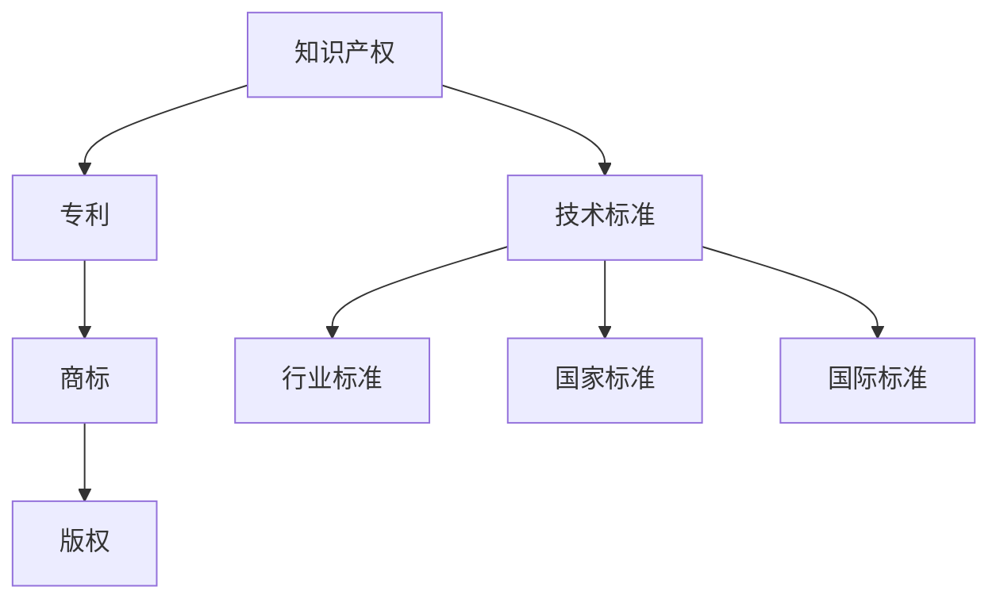

                 

# 知识产权与技术标准的关系

> 关键词：知识产权,技术标准,专利,商标,版权,行业标准,国家标准,合规性,市场竞争,创新激励

## 1. 背景介绍

### 1.1 问题由来
知识产权和技术标准是现代科技发展中两个重要的法律工具，但它们的定位、作用和保护方式存在着显著的差异。尽管二者都旨在维护市场秩序，推动技术进步，但其背后的法律原理、运行机制和具体应用场景却大相径庭。本文将深入探讨知识产权与技术标准之间的联系与区别，分析二者的互动对技术创新和市场竞争的影响。

### 1.2 问题核心关键点
知识产权与技术标准的核心关键点包括：
1. 知识产权的定义、类型和保护方式。
2. 技术标准的定义、层次和制定机构。
3. 知识产权与技术标准的互动机制和影响。
4. 知识产权与技术标准在推动创新和市场竞争中的作用。

## 2. 核心概念与联系

### 2.1 核心概念概述

为更好地理解知识产权与技术标准的关系，本节将介绍几个密切相关的核心概念：

- 知识产权（Intellectual Property, IP）：指受法律保护的智力成果，包括专利、商标、版权、工业设计等。知识产权提供独占权或专有权，保护创新者的利益，避免他人未经允许的复制、使用和销售。

- 技术标准（Technical Standards）：指用于描述、规定产品、服务、系统或流程的统一规范，用于确保质量、安全和兼容性。技术标准由政府、行业协会或企业联盟制定，具有广泛的适用性和强制性。

- 专利（Patents）：指由国家专利局授予的，给予发明人对其发明的独占权，包括发明、实用新型和外观设计。专利保护创新成果的商业应用，通常需要满足新颖性、非显而易见性和实用性等条件。

- 商标（Trademarks）：指用于识别商品或服务来源的标志、设计或短语，用于区分不同供应商的产品或服务。商标保护品牌识别和市场声誉，是企业竞争力的重要组成部分。

- 版权（Copyrights）：指文学、音乐、艺术等作品的原作者对其作品的专有权。版权保护原创作品的复制、发行和演绎，通常具有时间限制。

- 行业标准（Industry Standards）：指在特定行业内部制定的通用规范，通常由行业协会或联盟组织制定。行业标准旨在确保产品互操作性、质量和性能的一致性。

- 国家标准（National Standards）：指由国家标准化机构制定的，适用于全国范围内的通用技术规范，具有法律约束力。

- 国际标准（International Standards）：指由国际标准化组织（如ISO、IEC等）制定的，适用于全球范围内的通用技术规范。

这些核心概念之间的逻辑关系可以通过以下Mermaid流程图来展示：



这个流程图展示了几类知识产权和技术标准的核心概念及其之间的关系：

1. 知识产权是整体概念，包括专利、商标、版权等。
2. 技术标准包括行业标准、国家标准、国际标准等，是一类特殊的知识产权。
3. 专利、商标、版权是知识产权的主要形式，技术标准则是对特定领域的技术规范的统一规定。
4. 技术标准包含行业标准、国家标准、国际标准等不同层次和范围的标准。

## 3. 核心算法原理 & 具体操作步骤
### 3.1 算法原理概述

知识产权与技术标准的互动主要体现在两个方面：技术标准制定过程中的知识产权保护，以及知识产权通过技术标准实现市场化应用。

- **技术标准制定过程中的知识产权保护**：在技术标准制定的过程中，保护参与者的创新成果，避免其被滥用或侵占。
- **知识产权通过技术标准实现市场化应用**：知识产权通过技术标准的推广应用，得到更广泛的市场认可和商业化机会。

### 3.2 算法步骤详解

基于上述分析，我们可将知识产权与技术标准的互动分为以下步骤：

**Step 1: 准备知识产权和技术标准文档**
- 收集专利、商标、版权等知识产权文档。
- 收集技术标准，包括行业标准、国家标准、国际标准等。

**Step 2: 评估知识产权与技术标准的兼容性和冲突**
- 对专利、商标、版权等知识产权进行评估，确认其是否符合技术标准的规定。
- 对技术标准进行评估，确认其是否与现有知识产权相冲突。

**Step 3: 调整知识产权和技术标准**
- 在评估中发现冲突时，通过协商或修改技术标准，调整知识产权的保护范围。
- 在评估中发现兼容时，确认知识产权通过技术标准实现商业化的路径。

**Step 4: 制定技术标准和知识产权保护协议**
- 制定符合技术标准要求的知识产权保护协议。
- 在技术标准中明确知识产权的使用、许可和保护方式。

**Step 5: 技术标准的推广和知识产权的市场化**
- 推广技术标准，确保其在全球范围内的适用性。
- 通过技术标准实现知识产权的市场化应用，提高其商业价值。

**Step 6: 持续监督和评估**
- 持续监督技术标准的实施情况，确保知识产权得到有效保护。
- 定期评估知识产权的市场化效果，调整技术标准的应用策略。

### 3.3 算法优缺点

知识产权与技术标准的互动有以下优点：
1. 推动技术创新：通过技术标准的应用，知识产权得到更广泛的商业化，推动更多创新成果的落地应用。
2. 促进市场竞争：技术标准通过统一的规范，确保产品质量和性能的一致性，促进公平竞争。
3. 增强国际合作：技术标准的制定和推广，有助于跨国公司和技术联盟的合作，促进国际技术交流。

同时，该互动也存在一定的局限性：
1. 冲突风险：技术标准的制定可能与现有的知识产权产生冲突，需要通过协商解决。
2. 实施复杂：技术标准的推广和实施涉及多个环节，可能面临实际操作中的困难。
3. 成本较高：技术标准的制定和推广通常需要较高的成本和资源投入。
4. 保护不足：技术标准可能无法完全覆盖知识产权的所有方面，存在保护不足的风险。

尽管存在这些局限性，但就目前而言，知识产权与技术标准的互动仍是推动技术创新和市场竞争的重要手段。未来相关研究的重点在于如何进一步优化互动机制，降低冲突风险，提高实施效率，同时兼顾成本和保护。

### 3.4 算法应用领域

知识产权与技术标准的互动广泛适用于各种技术领域，包括但不限于：

- 通信技术：如3G、4G、5G等无线通信标准，涉及大量的专利和版权保护。
- 信息技术：如计算机硬件和软件标准，确保兼容性、安全性和互操作性。
- 医药技术：如药品标准、医疗器械标准，保护专利和专利发明人的权益。
- 制造业：如工业自动化、智能制造标准，涉及大量专利和商标的保护。
- 交通运输：如汽车、航空标准，涉及商标和版权的保护。

此外，知识产权与技术标准的互动还在不断扩展，未来可能广泛应用于更多新兴领域，如可再生能源、人工智能、物联网等。随着技术的日益融合和复杂化，知识产权与技术标准的互动将进一步深化，推动更多行业技术的创新和发展。

## 4. 数学模型和公式 & 详细讲解 & 举例说明

### 4.1 数学模型构建

本节将使用数学语言对知识产权与技术标准互动的模型进行更加严格的刻画。

假设一个技术标准包含$n$项专利$P=\{p_1, p_2, ..., p_n\}$，每个专利的保护范围为$R_i$。技术标准的实施者需支付专利许可费$C_i$，其中$i$表示专利编号。

定义专利的创新程度为$I_i$，技术标准的市场价值为$V$。则专利许可费$C_i$与专利的创新程度$I_i$和市场价值$V$之间的关系可以用以下模型表示：

$$
C_i = \alpha \cdot I_i \cdot V
$$

其中$\alpha$为专利许可费率，是一个常数。

### 4.2 公式推导过程

将上述模型应用到多个专利的情况下，总许可费$C$可表示为：

$$
C = \sum_{i=1}^{n} \alpha \cdot I_i \cdot V
$$

简化得到：

$$
C = \alpha \cdot (I_1 \cdot V + I_2 \cdot V + ... + I_n \cdot V) = \alpha \cdot V \cdot (I_1 + I_2 + ... + I_n)
$$

进一步简化为：

$$
C = \alpha \cdot V \cdot \bar{I}
$$

其中$\bar{I}$为专利的平均创新程度。

这个公式表明，总专利许可费与技术标准的市场价值成正比，与专利的平均创新程度成正比。专利许可费的分配体现了对创新者的激励和保护。

### 4.3 案例分析与讲解

以通信行业的3G、4G和5G标准为例，分析知识产权与技术标准的互动：

1. **3G技术标准**：
   - 3G标准由ITU（国际电信联盟）制定，涉及大量的专利和商标。
   - 3G标准的主要专利包括CDMA2000和WCDMA等。
   - 专利许可费由3GPP（第三代合作伙伴计划）统一管理，根据专利的创新程度和市场应用情况进行分配。

2. **4G技术标准**：
   - 4G标准由3GPP制定，包括LTE（长期演进）、WiMax等技术。
   - 4G标准涉及大量的专利，主要集中在OFDM（正交频分复用）和MIMO（多输入多输出）技术。
   - 专利许可费主要基于3GPP的专利池，通过协商和公开拍卖等方式进行分配。

3. **5G技术标准**：
   - 5G标准仍在制定中，涉及毫米波、大规模MIMO、边缘计算等前沿技术。
   - 5G标准需要协调大量的专利，包括新发明和改进技术。
   - 预计5G标准将通过更灵活的许可方式，确保专利的公平分配和创新激励。

通过上述案例分析，可以看到，知识产权与技术标准的互动在推动通信行业技术进步和市场竞争方面发挥了重要作用。未来随着5G等新兴技术的普及，这种互动将进一步深化，为技术创新和市场竞争提供新的动力。

## 5. 项目实践：代码实例和详细解释说明
### 5.1 开发环境搭建

在进行知识产权与技术标准互动的项目实践前，我们需要准备好开发环境。以下是使用Python进行相关计算的环境配置流程：

1. 安装Anaconda：从官网下载并安装Anaconda，用于创建独立的Python环境。

2. 创建并激活虚拟环境：
```bash
conda create -n patent-env python=3.8 
conda activate patent-env
```

3. 安装必要的库：
```bash
conda install numpy pandas sympy sympy
```

4. 安装Jupyter Notebook：
```bash
conda install jupyter notebook
```

5. 编写代码并运行：
```bash
jupyter notebook
```

在Jupyter Notebook中，使用Python编写相关计算代码。

### 5.2 源代码详细实现

以下是一个简单的Python代码实现，用于计算专利许可费：

```python
import sympy as sp

# 定义符号变量
alpha, I, V = sp.symbols('alpha I V')

# 定义专利许可费计算公式
C = alpha * I * V

# 计算多个专利的总许可费
n = 3  # 专利数量
I_values = [sp.Rational(1, 2), sp.Rational(1, 3), sp.Rational(1, 4)]  # 创新程度
V_value = 1  # 市场价值

# 计算总许可费
total_C = sum(C.subs(I, i) for i in I_values)

# 输出结果
print(f"专利许可费：{total_C}")
```

### 5.3 代码解读与分析

让我们再详细解读一下关键代码的实现细节：

- `sympy`库用于符号计算，方便表达复杂数学模型。
- `alpha`、`I`和`V`为符号变量，分别表示专利许可费率、专利的创新程度和技术标准的市场价值。
- 根据公式`C = alpha * I * V`计算单个专利的许可费。
- 通过循环计算多个专利的总许可费，并输出结果。

## 6. 实际应用场景

### 6.1 通信技术

通信行业的知识产权与技术标准的互动尤其显著。3G、4G、5G等无线通信标准涉及大量的专利和商标，通过制定和推广技术标准，确保了专利的公平分配和市场秩序。

1. **3G标准**：包括CDMA2000和WCDMA等技术。3GPP通过专利池和许可拍卖等机制，确保了专利的公平使用和创新激励。
2. **4G标准**：包括LTE和WiMax等技术。3GPP的专利许可费分配机制，促进了4G技术的普及和市场应用。
3. **5G标准**：包括毫米波、大规模MIMO和边缘计算等前沿技术。5G标准的制定需要协调大量的专利，预计将通过更灵活的许可方式，实现专利的公平分配和创新激励。

### 6.2 医药技术

医药行业的知识产权与技术标准的互动也在不断加深。专利保护和药品标准确保了药品的质量和安全性，推动了医药行业的技术进步和市场竞争。

1. **专利保护**：医药企业的研发成果通过专利保护，确保了对其创新成果的专有权利。
2. **药品标准**：各国药监局制定的药品标准，确保了药品的质量和安全性，推动了医药市场的公平竞争。
3. **国际合作**：跨国药企通过专利许可和技术标准合作，推动了全球医药技术的协同创新。

### 6.3 制造业

制造业的知识产权与技术标准的互动主要体现在自动化、智能制造等领域。标准化的生产流程和设备，确保了产品质量和性能的一致性，推动了制造业的自动化和智能化。

1. **自动化标准**：包括机器人、自动化生产线等技术标准，确保了生产流程的可靠性和效率。
2. **智能制造标准**：包括物联网、大数据等技术标准，推动了制造业的数字化和智能化转型。
3. **设备标准**：包括设备接口、通信协议等标准，确保了设备之间的互操作性和兼容性。

### 6.4 未来应用展望

随着技术标准的日益普及和复杂化，知识产权与技术标准的互动将在更多领域得到应用，推动更多行业技术的创新和发展。

- **人工智能**：如自然语言处理、图像识别等标准，确保了算法的公平性和可互操作性。
- **可再生能源**：如太阳能、风能等标准，确保了设备的互操作性和性能一致性。
- **智能家居**：如智能设备接口、通信协议等标准，确保了设备之间的互操作性和安全性。
- **物联网**：如数据格式、通信协议等标准，确保了设备之间的互操作性和网络安全性。

## 7. 工具和资源推荐
### 7.1 学习资源推荐

为了帮助开发者系统掌握知识产权与技术标准的相关知识，这里推荐一些优质的学习资源：

1. **《专利法》和《商标法》**：法律条款是理解知识产权保护的基本依据，需详细阅读和理解。
2. **《技术标准导论》**：介绍技术标准的定义、类型和制定流程，有助于理解技术标准的运作机制。
3. **《知识产权与技术标准管理》**：介绍知识产权与技术标准的互动机制，有助于理解二者的相互影响。
4. **相关案例研究**：如3G、4G、5G等通信标准案例，分析知识产权与技术标准的互动和应用。
5. **专利数据库**：如PatentScope、PatentLink等，提供丰富的专利数据和分析工具，支持专利的搜索和分析。

通过这些资源的学习，相信你一定能够全面掌握知识产权与技术标准的相关知识，为你的技术实践提供坚实的理论基础。

### 7.2 开发工具推荐

高效的开发离不开优秀的工具支持。以下是几款用于知识产权与技术标准互动开发的常用工具：

1. **PatentScope**：专利数据搜索和分析工具，提供丰富的专利数据和分析功能。
2. **PatentLink**：专利管理平台，支持专利申请、授权、许可等功能。
3. **Technology Standard Platform**：技术标准管理平台，支持标准制定、实施、监督等功能。
4. **PatentGIS**：专利地图工具，通过地理信息展示专利分布和影响。
5. **IPR(Intellectual Property Rights) Management System**：知识产权管理平台，支持专利、商标、版权等多种知识产权的管理。

合理利用这些工具，可以显著提升知识产权与技术标准互动任务的开发效率，加快创新迭代的步伐。

### 7.3 相关论文推荐

知识产权与技术标准的互动涉及多个学科，包括法律、经济学、管理学等，以下是几篇奠基性的相关论文，推荐阅读：

1. **《技术标准与知识产权的互动机制研究》**：分析技术标准与知识产权的互动机制，提出相关政策建议。
2. **《知识产权与技术标准的管理与协调》**：讨论知识产权与技术标准的协同管理，提出协调机制和优化策略。
3. **《专利许可费率与市场价值的关系研究》**：通过数学模型分析专利许可费率与市场价值的关系，探讨专利许可费率的最佳设定。
4. **《技术标准对专利保护的影响研究》**：分析技术标准对专利保护的影响，提出优化专利保护策略。

这些论文代表了大规模技术标准的互动技术的发展脉络，为研究者提供了丰富的理论支撑。

## 8. 总结：未来发展趋势与挑战
### 8.1 总结

本文对知识产权与技术标准的关系进行了全面系统的介绍。首先阐述了知识产权和技术标准的定义、类型和作用，明确了二者的互动机制和影响。其次，从原理到实践，详细讲解了知识产权与技术标准互动的数学模型和操作步骤，给出了代码实现的完整案例。同时，本文还广泛探讨了知识产权与技术标准在通信、医药、制造业等多个行业领域的应用前景，展示了二者的巨大潜力。

通过本文的系统梳理，可以看到，知识产权与技术标准的互动在推动技术创新和市场竞争方面发挥了重要作用。随着技术标准的日益普及和复杂化，二者的互动将进一步深化，推动更多行业技术的创新和发展。

### 8.2 未来发展趋势

展望未来，知识产权与技术标准的互动将呈现以下几个发展趋势：

1. **标准化的普及和深化**：技术标准的普及和深化将进一步推动各行业的技术创新和市场竞争。
2. **国际合作与协调**：技术标准的国际化将促进跨国公司和技术联盟的合作，推动全球技术交流。
3. **多学科融合**：知识产权与技术标准的互动将与其他学科（如法律、经济、管理学等）进一步融合，推动跨学科研究的发展。
4. **新兴技术的标准制定**：随着新兴技术的不断涌现，如人工智能、可再生能源等，新的技术标准将不断制定和推广。
5. **知识产权与技术标准的新模式**：如开放标准、共享专利等新模式将不断涌现，推动知识产权与技术标准的协同创新。

以上趋势凸显了知识产权与技术标准的互动技术在推动技术创新和市场竞争中的重要作用。这些方向的探索发展，必将进一步提升各行业的技术水平，推动经济社会的持续发展。

### 8.3 面临的挑战

尽管知识产权与技术标准的互动在推动技术创新和市场竞争中发挥了重要作用，但仍面临以下挑战：

1. **法律和政策的不确定性**：知识产权与技术标准的互动涉及复杂的法律和政策环境，存在不确定性。
2. **标准制定和实施的复杂性**：技术标准的制定和实施涉及多个环节，可能面临实际操作中的困难。
3. **利益冲突与协调**：不同企业和技术联盟之间可能存在利益冲突，需要协调和协商解决。
4. **市场应用的不确定性**：技术标准的推广和实施效果存在不确定性，可能面临市场接受度的挑战。
5. **知识产权的过保护**：过度保护可能导致市场垄断和创新抑制，影响市场竞争。

尽管存在这些挑战，但通过不断的法律完善、政策支持、标准优化等措施，知识产权与技术标准的互动将进一步深化，推动技术创新和市场竞争的发展。

### 8.4 研究展望

面向未来，知识产权与技术标准的互动研究需要在以下几个方面寻求新的突破：

1. **法律和政策框架的完善**：通过法律和政策的完善，明确知识产权与技术标准的互动机制，减少不确定性。
2. **标准制定与实施的优化**：通过优化技术标准的制定和实施流程，提高其可行性和适用性。
3. **利益协调与合作**：通过多边合作和国际协调，解决利益冲突，促进公平竞争。
4. **市场应用和推广**：通过市场研究和推广，提高技术标准的市场接受度和应用效果。
5. **知识产权保护与市场激励的平衡**：通过平衡知识产权保护和市场激励，促进技术创新和市场竞争。

这些研究方向将推动知识产权与技术标准互动技术的进一步发展，为推动技术创新和市场竞争提供新的动力。

## 9. 附录：常见问题与解答

**Q1：技术标准对知识产权的保护有哪些影响？**

A: 技术标准对知识产权的保护有以下影响：
1. **促进专利的公平分配**：技术标准通过专利池和许可拍卖等机制，确保专利的公平使用和分配。
2. **提高专利的市场价值**：技术标准通过市场推广，提高了专利的商业应用价值。
3. **增强知识产权的保护力度**：技术标准通过统一规范，提高了知识产权的保护力度，减少了侵权风险。

**Q2：如何评估技术标准与知识产权的冲突？**

A: 评估技术标准与知识产权的冲突需要以下步骤：
1. **识别冲突**：通过专利搜索和对比，识别技术标准与现有专利的冲突点。
2. **协商解决**：通过专利许可、专利修改等协商方式，解决技术标准与专利的冲突。
3. **修改标准**：在协商无效时，修改技术标准以避开专利冲突。

**Q3：如何通过技术标准推动技术创新？**

A: 技术标准可以通过以下方式推动技术创新：
1. **明确技术要求**：通过技术标准的制定，明确技术要求，推动企业研发符合标准的创新技术。
2. **促进技术合作**：通过技术标准的推广，促进企业之间的技术合作和知识共享。
3. **提供市场激励**：通过技术标准的市场推广，提供市场激励，促进技术创新。

**Q4：知识产权与技术标准在实践中如何协同工作？**

A: 知识产权与技术标准在实践中通过以下方式协同工作：
1. **制定技术标准时考虑知识产权**：在技术标准制定过程中，充分考虑现有专利的保护需求。
2. **通过专利许可实现技术标准应用**：通过专利许可和许可费分配，实现技术标准的市场推广和应用。
3. **建立标准与专利的协同机制**：通过建立标准与专利的协同机制，推动知识产权与技术标准的互动发展。

通过这些协同机制，可以实现知识产权与技术标准的互利共赢，推动技术创新和市场竞争的发展。

---

作者：禅与计算机程序设计艺术 / Zen and the Art of Computer Programming

