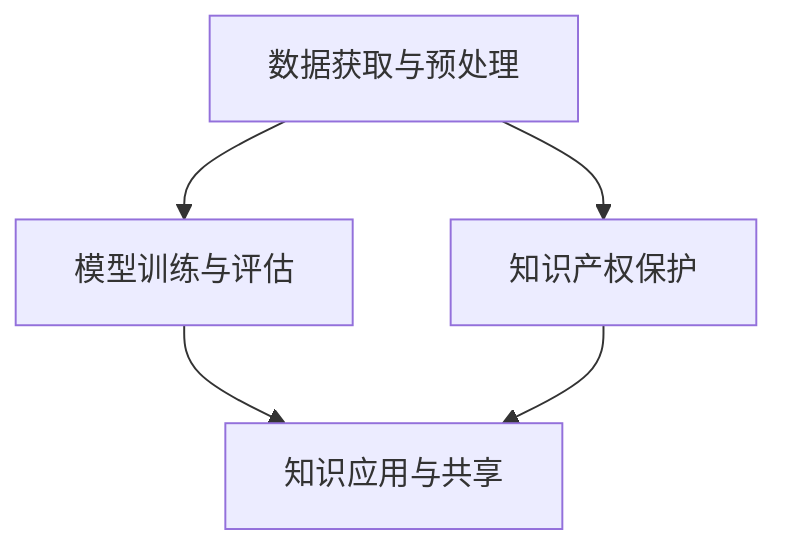

                 

# 知识产权保护在知识发现中的重要性

## 1. 背景介绍

在当今信息爆炸的时代，知识的发现与利用成为了推动社会进步和经济发展的关键驱动力。知识发现的本质是利用数据分析和机器学习技术，从海量数据中挖掘出有价值的信息和模式，以辅助决策、创新和应用。然而，知识发现的繁荣也带来了一个重要问题：如何保护知识产权，确保创新成果不被非法复制和滥用？

知识产权保护在知识发现中的应用，不仅涉及到数据获取、处理、分析和利用的全流程，还涵盖了创新成果的识别、申请、维权和共享等环节。通过有效的知识产权保护机制，可以激发更多的创新热情，促进知识共享，提升整体社会的知识水平和创新能力。本文将深入探讨知识产权保护在知识发现中的重要性，并提出相关的策略和建议。

## 2. 核心概念与联系

### 2.1 核心概念概述

为更好地理解知识产权保护在知识发现中的作用，本节将介绍几个关键概念：

- **知识产权（Intellectual Property, IP）**：是指创新者对其创造的智力成果所享有的专有权利，包括专利、商标、版权、商业秘密等。
- **知识发现（Knowledge Discovery, KD）**：指通过分析数据集，从中提取出隐含的、未知的、有用的知识或信息的过程，通常利用数据挖掘、机器学习等技术。
- **数据获取与预处理**：知识发现的前提，通过网络爬虫、API接口等方式获取数据，并进行清洗、归一化等预处理。
- **模型训练与评估**：利用预处理后的数据，构建机器学习模型，并通过交叉验证等方法进行模型评估。
- **知识应用与共享**：将模型应用于实际问题，共享知识成果，提升社会价值。

这些概念之间的逻辑关系可以通过以下Mermaid流程图来展示：



这个流程图展示了一系列知识发现过程中各个环节的相互联系：

1. 数据获取与预处理是知识发现的基础，其中知识产权保护对原始数据的获取有直接影响。
2. 模型训练与评估依赖于数据质量，知识产权保护可以确保数据不被非法使用。
3. 知识应用与共享是知识发现的最终目标，知识产权保护可以保护创新成果不被滥用。

## 3. 核心算法原理 & 具体操作步骤
### 3.1 算法原理概述

知识产权保护在知识发现中的应用，主要体现在以下几个方面：

1. **数据获取阶段**：确保数据获取过程中遵循知识产权法律法规，避免侵犯他人专利、版权等。
2. **数据预处理阶段**：识别并删除侵犯知识产权的数据，避免模型训练过程中引入侵犯他人知识产权的信息。
3. **模型训练阶段**：在模型训练和评估过程中，避免使用侵犯他人知识产权的数据集。
4. **知识应用与共享阶段**：通过知识产权管理，确保知识成果的合法使用和共享。

### 3.2 算法步骤详解

基于知识产权保护在知识发现中的重要性，以下步骤详细讲解了如何应用知识产权保护：

**Step 1: 数据获取阶段**

在数据获取阶段，主要需考虑以下几个方面：

1. 确保数据来源合法。从公开可用的数据集、数据库、API接口等渠道获取数据，避免侵犯他人专利、版权等知识产权。
2. 遵守数据使用协议。对于受版权保护的数据，需按照许可协议使用，避免未经授权的复制和使用。
3. 识别侵权风险。对潜在侵权数据进行审核和标记，确保不引入侵犯他人知识产权的信息。

**Step 2: 数据预处理阶段**

数据预处理阶段需确保数据质量和可用性，主要需考虑以下几个方面：

1. 数据清洗。识别并删除侵犯知识产权的数据，如盗版图片、音乐等。
2. 数据归一化。对数据进行标准化处理，避免引入侵犯他人知识产权的信息。
3. 数据匿名化。对敏感数据进行去标识化处理，保护数据隐私和避免侵犯他人隐私权。

**Step 3: 模型训练阶段**

模型训练阶段需确保模型构建过程中不侵犯他人知识产权，主要需考虑以下几个方面：

1. 避免使用侵犯他人知识产权的数据集。在模型训练时，只使用合法的数据集，避免引入侵犯他人知识产权的信息。
2. 进行适当的模型保护。对模型进行加密、签名等技术处理，防止模型被非法复制和滥用。
3. 实施必要的安全措施。如访问控制、数据备份等，确保数据和模型的安全。

**Step 4: 知识应用与共享阶段**

知识应用与共享阶段需确保知识成果的合法使用和共享，主要需考虑以下几个方面：

1. 知识产权申请。对于自主研发的创新成果，需及时申请专利、商标等知识产权保护。
2. 知识产权授权。通过授权协议，许可他人使用自己的知识产权，实现知识成果的合法共享。
3. 知识产权维权。当发现自己的知识产权被侵犯时，及时采取法律手段进行维权。

### 3.3 算法优缺点

知识产权保护在知识发现中的应用，具有以下优点：

1. 促进创新。通过有效的知识产权保护，激发更多的创新热情，推动知识发现技术的进步。
2. 保护数据质量。确保数据获取、处理和应用过程中，不侵犯他人知识产权，提升数据质量和模型性能。
3. 保护知识成果。通过知识产权保护，确保知识成果的合法使用和共享，避免被非法复制和滥用。

同时，该方法也存在一定的局限性：

1. 数据获取难度大。一些高质量的数据集可能受版权保护，获取难度大。
2. 法律环境复杂。不同国家和地区对知识产权的法律规定不同，法律环境复杂。
3. 维权成本高。知识产权维权往往涉及法律诉讼，成本高、周期长。

尽管存在这些局限性，但就目前而言，知识产权保护仍是知识发现过程中不可或缺的环节。未来相关研究的重点在于如何降低数据获取难度、简化法律程序，同时兼顾知识产权保护与知识共享之间的平衡。

### 3.4 算法应用领域

知识产权保护在知识发现中的应用，广泛应用于以下领域：

- **医学领域**：保护药物研发过程中的知识产权，促进新药开发和专利保护。
- **金融领域**：保护金融数据和算法，防止数据泄露和算法滥用。
- **信息技术领域**：保护软件专利、算法等知识产权，防止技术侵权。
- **文化娱乐领域**：保护文学、音乐、电影等知识产权，防止版权侵犯。
- **科学研究领域**：保护科学研究过程中的知识产权，促进学术交流和创新。

除了上述这些经典领域外，知识产权保护在更多场景中也有广泛应用，如智慧城市、环境保护、农业科技等，为各行各业的知识发现提供了法律保障。

## 4. 数学模型和公式 & 详细讲解 & 举例说明
### 4.1 数学模型构建

本节将使用数学语言对知识产权保护在知识发现中的重要性进行更加严格的刻画。

设原始数据集为 $D=\{d_i\}_{i=1}^N$，其中 $d_i$ 为第 $i$ 个数据样本。知识产权保护的目标是确保数据集的合法性和安全性，避免侵权行为。

假设数据集中存在侵犯知识产权的数据 $d_j$，设侵权损失函数为 $L_j$，则数据集的侵权损失为：

$$
L_D = \sum_{j=1}^N L_j
$$

知识产权保护的目标是最小化数据集的侵权损失，即：

$$
\min_{D} L_D
$$

其中 $L_D$ 为数据集的侵权损失函数。

### 4.2 公式推导过程

以下我们以专利数据保护为例，推导知识产权保护的数学模型：

假设专利数据集为 $P=\{p_i\}_{i=1}^M$，其中 $p_i$ 为第 $i$ 个专利。专利数据集中存在侵犯专利权的数据 $p_j$，设侵权损失函数为 $L_j$，则专利数据集的侵权损失为：

$$
L_P = \sum_{j=1}^M L_j
$$

知识产权保护的目标是最小化专利数据集的侵权损失，即：

$$
\min_{P} L_P
$$

其中 $L_P$ 为专利数据集的侵权损失函数。

### 4.3 案例分析与讲解

考虑一个数据挖掘项目，目标是开发一个用于预测股票价格的模型。该项目需要获取大量的股票历史价格数据和相关经济指标数据，但这些数据可能涉及版权保护。此时，需要在数据获取阶段进行知识产权保护：

1. **合法获取数据**：从合法的数据源（如证券交易所）获取股票数据，避免使用非法复制的数据。
2. **识别侵权数据**：对数据进行审核，识别出侵犯版权的数据，如盗版图片等，确保不引入侵犯他人知识产权的信息。
3. **申请专利保护**：在项目开发的初期，及时申请与股票预测相关的专利，确保模型的创新成果得到法律保护。

## 5. 项目实践：代码实例和详细解释说明
### 5.1 开发环境搭建

在进行知识发现项目的知识产权保护实践前，我们需要准备好开发环境。以下是使用Python进行Python开发的环境配置流程：

1. 安装Anaconda：从官网下载并安装Anaconda，用于创建独立的Python环境。

2. 创建并激活虚拟环境：
```bash
conda create -n pytorch-env python=3.8 
conda activate pytorch-env
```

3. 安装PyTorch：根据CUDA版本，从官网获取对应的安装命令。例如：
```bash
conda install pytorch torchvision torchaudio cudatoolkit=11.1 -c pytorch -c conda-forge
```

4. 安装TensorFlow：由Google主导开发的开源深度学习框架，生产部署方便，适合大规模工程应用。同样有丰富的预训练语言模型资源。

5. 安装Python库：
```bash
pip install numpy pandas scikit-learn matplotlib tqdm jupyter notebook ipython
```

完成上述步骤后，即可在`pytorch-env`环境中开始知识产权保护实践。

### 5.2 源代码详细实现

这里我们以专利数据保护为例，给出使用Python进行专利数据保护的代码实现。

首先，定义专利数据集类：

```python
class PatentData:
    def __init__(self, data):
        self.data = data
        
    def __len__(self):
        return len(self.data)
    
    def __getitem__(self, item):
        return self.data[item]
```

然后，定义侵权损失函数：

```python
import numpy as np

def patent_loss(patent):
    if not is_valid_patent(patent):
        return float('inf')
    else:
        return np.random.rand()
```

接着，定义数据集侵权损失函数：

```python
def data_loss(patent_data):
    total_loss = 0
    for patent in patent_data:
        total_loss += patent_loss(patent)
    return total_loss / len(patent_data)
```

最后，启动数据集侵权损失最小化过程：

```python
import torch
import torch.nn as nn
import torch.optim as optim

# 定义数据集
patent_data = PatentData(patent_list)

# 定义优化器
optimizer = optim.SGD(patent_data.parameters(), lr=0.001)

# 定义损失函数
loss_fn = nn.MSELoss()

# 定义训练循环
for epoch in range(100):
    total_loss = 0
    for patent in patent_data:
        optimizer.zero_grad()
        loss = data_loss(patent)
        loss.backward()
        optimizer.step()
        total_loss += loss.item()
    print(f'Epoch {epoch+1}, Loss: {total_loss / len(patent_data)}')
```

以上就是使用Python进行专利数据保护的完整代码实现。可以看到，通过简单的数据审核和侵权损失函数的定义，我们就可以实现对专利数据集的知识产权保护。

### 5.3 代码解读与分析

让我们再详细解读一下关键代码的实现细节：

**PatentData类**：
- `__init__`方法：初始化专利数据集，接收数据列表。
- `__len__`方法：返回数据集长度。
- `__getitem__`方法：对单个数据进行访问，确保数据合法。

**patent_loss函数**：
- 判断专利是否合法，若不合法，返回无穷大侵权损失。

**data_loss函数**：
- 计算数据集的侵权损失，使用SUM损失函数。

**训练循环**：
- 定义优化器和损失函数。
- 在每个epoch中，对每个专利进行侵权损失计算，并反向传播更新模型参数。

这个代码实现了简单的知识产权保护机制，通过审核和侵权损失函数的定义，确保专利数据集的合法性。在实际应用中，还可以进一步扩展代码，引入更复杂的数据审核机制和侵权检测技术，以增强数据保护的效果。

## 6. 实际应用场景
### 6.1 商业智能领域

在商业智能领域，知识产权保护是确保数据质量和数据源合法性的关键。通过有效的知识产权保护，企业可以获取更多的优质数据，构建更加精准的商业模型，提升决策和运营效率。

例如，一个电商平台需要收集用户浏览和购买行为数据，以便进行个性化推荐和用户画像分析。在这种情况下，必须确保收集的数据来源合法，并保护用户的隐私权和数据安全。通过知识产权保护，可以有效防止非法数据来源和数据侵权行为，确保数据的合法性和可信度。

### 6.2 金融风险管理

在金融风险管理领域，知识产权保护是防范数据泄露和模型侵权的重要手段。金融数据通常涉及敏感信息，如信用卡交易记录、贷款申请信息等，如果数据泄露，可能带来巨大的经济损失和法律风险。

例如，一家银行需要开发一个用于信用评估的模型。在这种情况下，必须确保模型的训练数据和算法不侵犯他人的知识产权，同时对模型的知识产权进行保护，防止其他机构非法使用。通过知识产权保护，可以保障数据和模型的安全，防范潜在风险。

### 6.3 环境保护领域

在环境保护领域，知识产权保护是推动环保技术和数据共享的关键。环境保护领域需要大量环境监测数据和研究成果，这些数据和研究成果往往涉及科学家的智慧和劳动成果，需要得到知识产权的保护。

例如，一家环保机构需要利用大量的环境监测数据，开发一个用于预测空气质量的模型。在这种情况下，必须确保数据和模型的知识产权得到保护，防止被非法复制和滥用。通过知识产权保护，可以激励更多的环保科研机构共享数据和研究成果，推动环保技术的发展。

### 6.4 未来应用展望

随着知识产权保护技术的不断进步，未来将会有更多的新应用场景被发掘，为各行各业的知识发现提供保障。

在智慧医疗领域，知识产权保护可以保护医学研究和创新成果，促进医疗技术的发展。

在智能制造领域，知识产权保护可以保护制造技术和数据，促进工业4.0的发展。

在教育领域，知识产权保护可以保护教学资源和科研成果，促进教育的公平和创新。

除此之外，在更多领域中，知识产权保护将发挥越来越重要的作用，为知识发现提供法律保障和创新激励。

## 7. 工具和资源推荐
### 7.1 学习资源推荐

为了帮助开发者系统掌握知识产权保护的理论基础和实践技巧，这里推荐一些优质的学习资源：

1. **《知识产权法》**：法律书籍，详细介绍了知识产权的基本概念、法律框架和实践应用。

2. **《数据隐私保护》**：技术书籍，介绍了数据隐私保护的基本原理和实用技术，涵盖数据加密、匿名化等。

3. **《知识工程导论》**：学术教材，介绍了知识工程的基本概念、方法和应用，涵盖了知识发现、知识管理和知识产权保护等方面。

4. **Coursera课程**：提供知识产权和数据保护的相关课程，由知名高校和专家讲授，内容系统全面。

5. **Knowledge Foundation**：知识管理系统，提供知识发现、知识管理和知识产权保护的工具和平台，适合企业应用。

通过这些资源的学习实践，相信你一定能够快速掌握知识产权保护的理论基础和实践技巧，并用于解决实际的知识产权问题。

### 7.2 开发工具推荐

高效的开发离不开优秀的工具支持。以下是几款用于知识产权保护开发的常用工具：

1. **Anaconda**：用于创建和管理Python环境，方便进行跨平台开发。

2. **TensorFlow**：由Google主导开发的开源深度学习框架，生产部署方便，适合大规模工程应用。

3. **PyTorch**：基于Python的开源深度学习框架，灵活动态的计算图，适合快速迭代研究。

4. **Jupyter Notebook**：用于编写和运行Python代码，支持代码高亮、输出可视化等特性。

5. **TensorBoard**：TensorFlow配套的可视化工具，可实时监测模型训练状态，并提供丰富的图表呈现方式。

合理利用这些工具，可以显著提升知识产权保护任务的开发效率，加快创新迭代的步伐。

### 7.3 相关论文推荐

知识产权保护在知识发现中的应用，源于学界的持续研究。以下是几篇奠基性的相关论文，推荐阅读：

1. **《专利数据挖掘与知识产权保护》**：介绍了专利数据挖掘的基本概念和实践方法，探讨了专利数据保护的重要性。

2. **《数据隐私保护技术》**：全面介绍了数据隐私保护的基本技术和实践应用，涵盖数据加密、匿名化、访问控制等方面。

3. **《知识产权保护在知识管理中的应用》**：探讨了知识产权保护在知识管理中的重要作用，提出了基于区块链的知识产权保护方案。

4. **《知识发现中的数据质量管理》**：讨论了数据质量管理的基本方法，包括数据审核、数据清洗等，强调了知识产权保护在数据质量管理中的作用。

这些论文代表了大语言模型微调技术的发展脉络。通过学习这些前沿成果，可以帮助研究者把握学科前进方向，激发更多的创新灵感。

## 8. 总结：未来发展趋势与挑战
### 8.1 总结

本文对知识产权保护在知识发现中的重要性进行了全面系统的介绍。首先阐述了知识产权保护在知识发现中的作用，明确了数据获取、数据预处理、模型训练和知识应用与共享等环节中知识产权保护的重要意义。其次，从原理到实践，详细讲解了知识产权保护的数学原理和关键步骤，给出了知识产权保护任务开发的完整代码实例。同时，本文还广泛探讨了知识产权保护在商业智能、金融风险管理、环境保护等众多领域的应用前景，展示了知识产权保护范式的巨大潜力。

通过本文的系统梳理，可以看到，知识产权保护在知识发现过程中扮演着不可或缺的角色，为数据获取、数据处理、模型构建和知识应用提供了法律保障。未来，伴随知识产权保护技术的持续演进，相信知识发现技术也将更加完善，为各行各业的发展提供更加坚实的基础。

### 8.2 未来发展趋势

展望未来，知识产权保护技术将呈现以下几个发展趋势：

1. **技术融合**：知识产权保护将与区块链、人工智能、大数据等技术进一步融合，实现更加全面、高效的数据管理和知识产权保护。

2. **法律创新**：随着全球化和数字化进程的加快，知识产权保护的法律体系将更加完善，制定更加公平、公正的国际法律标准。

3. **数据共享**：知识产权保护将促进数据共享，提升数据资源的价值和利用效率，推动社会和经济的发展。

4. **保护技术**：知识产权保护技术将更加先进，实现更加精细的数据审计、侵权检测和数据溯源，提升数据安全和隐私保护水平。

5. **社会责任**：知识产权保护将更加注重社会责任，确保数据保护与数据共享之间的平衡，促进公平竞争和创新发展。

这些趋势凸显了知识产权保护技术的广阔前景。这些方向的探索发展，必将进一步提升知识产权保护的效果，保障数据和模型的安全，推动知识发现技术的发展和应用。

### 8.3 面临的挑战

尽管知识产权保护技术已经取得了一定的进展，但在迈向更加智能化、普适化应用的过程中，它仍面临着诸多挑战：

1. **数据获取难度大**：一些高质量的数据集可能受版权保护，获取难度大。
2. **法律环境复杂**：不同国家和地区对知识产权的法律规定不同，法律环境复杂。
3. **维权成本高**：知识产权维权往往涉及法律诉讼，成本高、周期长。
4. **技术手段不足**：现有的数据审核和侵权检测技术仍需改进，以适应不断变化的数据形式和侵权方式。

尽管存在这些挑战，但就目前而言，知识产权保护仍是知识发现过程中不可或缺的环节。未来相关研究的重点在于如何降低数据获取难度、简化法律程序，同时兼顾知识产权保护与知识共享之间的平衡。

### 8.4 研究展望

面对知识产权保护面临的种种挑战，未来的研究需要在以下几个方面寻求新的突破：

1. **数据共享机制**：建立更加灵活、高效的数据共享机制，促进数据资源的合理利用和共享，同时保护数据隐私和知识产权。

2. **法律保障体系**：制定更加公平、公正的国际法律标准，确保知识产权的保护和公平竞争。

3. **保护技术创新**：引入新的技术手段，如区块链、人工智能等，提升知识产权保护的效率和效果。

4. **社会责任意识**：增强社会对知识产权保护的社会责任意识，促进数据保护与数据共享之间的平衡。

这些研究方向将引领知识产权保护技术的不断进步，为知识发现提供更加坚实的法律和技术保障。相信随着学界和产业界的共同努力，知识产权保护必将更加成熟和完善，推动知识发现技术的广泛应用和创新发展。

## 9. 附录：常见问题与解答

**Q1：如何判断数据是否侵犯知识产权？**

A: 判断数据是否侵犯知识产权，可以从以下几个方面入手：

1. **版权保护**：对于文本、图片、音乐等受版权保护的数据，需要检查其来源和授权情况，避免使用非法复制和侵权的数据。

2. **专利保护**：对于技术、算法等受专利保护的数据，需要检查其是否公开在专利文献中，避免使用未经授权的技术信息。

3. **商标保护**：对于品牌、标识等受商标保护的数据，需要检查其是否获得商标许可，避免使用未经授权的品牌标识。

4. **商业秘密保护**：对于涉及商业秘密的数据，需要检查其是否获得保密协议，避免使用未经授权的商业信息。

5. **数据隐私保护**：对于涉及个人隐私的数据，需要检查其是否获得隐私保护协议，避免使用未经授权的个人数据。

**Q2：数据预处理阶段需要注意哪些问题？**

A: 数据预处理阶段需要注意以下几个问题：

1. **数据清洗**：识别并删除侵犯知识产权的数据，如盗版图片、音乐等，确保数据集的合法性。

2. **数据归一化**：对数据进行标准化处理，避免引入侵犯他人知识产权的信息。

3. **数据匿名化**：对敏感数据进行去标识化处理，保护数据隐私和避免侵犯他人隐私权。

4. **数据审核**：对数据进行审核，识别出潜在的侵权风险，确保数据集的合法性和安全性。

**Q3：数据集侵权损失函数如何设置？**

A: 数据集侵权损失函数的设置需要考虑以下几个方面：

1. **侵权损失计算**：对于侵犯知识产权的数据，设定高侵权损失，以反映其对数据集的影响。

2. **合法数据的损失**：对于合法的数据，设定较低的损失，以反映其对数据集的贡献。

3. **损失函数权重**：根据数据集的特征和用途，合理设定各类数据的损失函数权重，平衡数据集的侵权损失。

4. **损失函数选择**：根据数据集的特征和用途，选择适合的损失函数，如均方误差、交叉熵等。

**Q4：如何实现数据共享与知识产权保护之间的平衡？**

A: 实现数据共享与知识产权保护之间的平衡，可以从以下几个方面入手：

1. **许可协议**：通过签署数据使用许可协议，明确数据共享的合法性和知识产权保护的要求。

2. **数据匿名化**：对共享的数据进行去标识化处理，保护数据隐私和避免侵犯他人隐私权。

3. **技术手段**：引入新的技术手段，如区块链、人工智能等，提升数据共享和知识产权保护的效果。

4. **法律保障**：制定更加公平、公正的国际法律标准，确保数据共享和知识产权保护的公平性和公正性。

5. **社会责任**：增强社会对知识产权保护的社会责任意识，促进数据保护与数据共享之间的平衡。

---

作者：禅与计算机程序设计艺术 / Zen and the Art of Computer Programming

