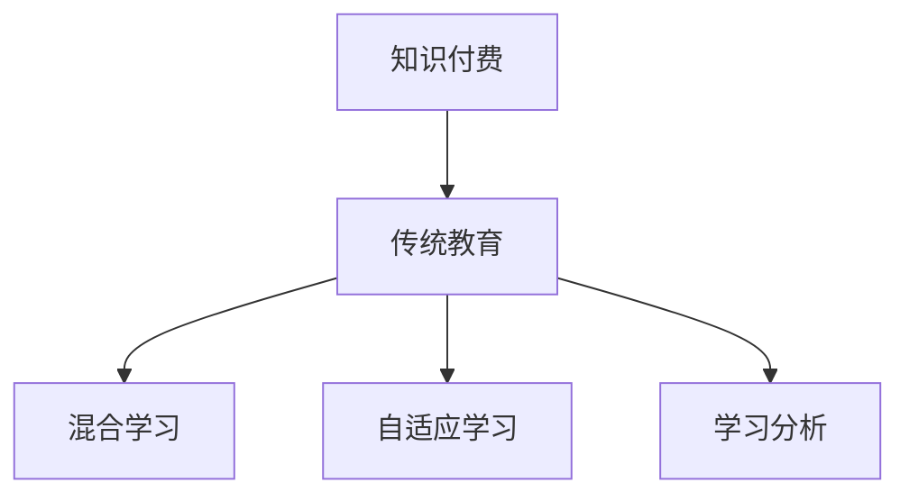

                 

# 知识付费与传统教育的融合

在当今信息爆炸的时代，知识的获取不再局限于传统的书本和课堂教学，在线教育、知识付费平台等新形式应运而生，与传统教育模式相融合，为学习者提供了更为丰富、便捷的学习资源和方式。本文将从背景介绍、核心概念与联系、核心算法原理与操作步骤、数学模型和公式讲解、项目实践、实际应用场景、工具和资源推荐、未来发展趋势与挑战以及常见问题解答等维度，全面剖析知识付费与传统教育融合的原理与实践，以期为相关领域的从业人员和研究者提供有价值的参考。

## 1. 背景介绍

### 1.1 问题由来
随着互联网的普及和信息技术的发展，知识的获取方式和途径发生了巨大的变化。传统教育模式主要依赖面对面的课堂教学，而在线教育、知识付费平台等新兴教育形式则借助互联网的力量，提供丰富多样的学习资源和个性化的学习体验。这些新兴的教育形式在提高学习效率、拓宽知识领域、打破时空限制等方面展现出显著的优势。

然而，知识付费与传统教育的融合并非一帆风顺。两者在教育理念、教学方法、学习效果等方面存在差异，如何实现有效融合，最大化地发挥各自的优点，成为当前教育领域的重要研究课题。

### 1.2 问题核心关键点
知识付费与传统教育融合的核心在于：
1. **教育理念的融合**：将知识付费平台的灵活、互动、个性化的理念融入传统教育体系，提高教学质量和学生兴趣。
2. **教学方法的融合**：结合在线教育平台的数据分析、智能推荐等技术，改进传统教育方法，提升教学效果。
3. **学习效果的融合**：利用知识付费平台的学习成果反馈，优化传统教育中的教学设计和评估方法，提升学习效果。
4. **资源共享的融合**：整合传统教育和知识付费平台的优质资源，实现知识共享和互通。
5. **技术支持的融合**：利用大数据、人工智能等先进技术，推动知识付费平台和传统教育的技术融合。

## 2. 核心概念与联系

### 2.1 核心概念概述

为了更好地理解知识付费与传统教育融合的原理与实践，本节将介绍几个密切相关的核心概念：

- **知识付费**：指通过付费获取高质量、个性化的学习资源和服务，如在线课程、电子书、专家讲座等，强调知识获取的主动性和选择性。
- **传统教育**：指以学校、教师和教材为主要依托，采用面对面的授课方式进行知识传授和学习活动，强调系统的知识体系和制度化的学习过程。
- **混合学习**：结合传统教育模式和知识付费平台的优势，灵活运用多种教育资源和学习方式，提升学习效果。
- **自适应学习**：根据学生的学习行为和反馈，动态调整学习内容和方式，个性化地满足学生的学习需求。
- **学习分析**：通过数据分析技术，实时监测和评估学生的学习行为和效果，提供个性化的学习建议和改进措施。

这些核心概念之间的逻辑关系可以通过以下Mermaid流程图来展示：



这个流程图展示了几大核心概念之间的逻辑关系：

1. 知识付费和传统教育是互补的教育形式。
2. 混合学习将两者优势融合，提供灵活多样的学习方式。
3. 自适应学习通过数据分析个性化定制学习方案。
4. 学习分析通过数据驱动，实时优化学习过程。

## 3. 核心算法原理 & 具体操作步骤

### 3.1 算法原理概述

知识付费与传统教育融合的核心算法原理，在于通过混合学习、自适应学习和学习分析等技术手段，将知识付费平台的学习资源和方法引入传统教育体系，从而实现教育理念、教学方法、学习效果等多方面的融合。

形式化地，假设传统教育平台的教学内容为 $T$，知识付费平台提供的学习资源为 $P$。混合学习的目标是在不改变 $T$ 的前提下，通过引入 $P$，提升学生的学习效果 $E$。具体而言，混合学习的过程可以表示为：

$$
E = f(T, P)
$$

其中 $f$ 为映射函数，表示通过引入 $P$ 对 $T$ 进行改进后，对学生学习效果的影响。

### 3.2 算法步骤详解

知识付费与传统教育融合的算法步骤主要包括以下几个环节：

1. **数据准备**：收集传统教育平台的学习数据和知识付费平台的用户行为数据，包括学生的学习记录、成绩、兴趣偏好、学习时长等。

2. **资源整合**：将知识付费平台提供的课程、电子书、视频等资源与传统教育平台的内容进行整合，构建混合学习资源库。

3. **模型训练**：基于整合后的资源库，通过机器学习、深度学习等技术，训练自适应学习模型，预测学生的学习需求和效果，提供个性化学习建议。

4. **学习引导**：通过自适应学习模型，实时调整学习内容和进度，引导学生进行个性化学习。

5. **效果评估**：利用学习分析技术，对学生的学习行为和效果进行实时监测和评估，提供反馈和改进建议。

6. **优化调整**：根据学习分析结果，动态调整学习方案和资源库，提升整体学习效果。

### 3.3 算法优缺点

知识付费与传统教育融合的算法具有以下优点：

1. **灵活性高**：通过混合学习和自适应学习，可以灵活调整教学内容和方式，满足不同学生的学习需求。
2. **效率提升**：利用学习分析技术，实时监测和优化学习过程，提高学习效率。
3. **资源丰富**：整合传统教育和知识付费平台的优质资源，提升学习资源的丰富度和多样性。
4. **成本降低**：知识付费平台的资源共享模式，降低传统教育的成本压力。

同时，该算法也存在一定的局限性：

1. **技术依赖**：依赖于机器学习和数据分析技术，对技术实现要求较高。
2. **数据隐私**：在数据整合和分析过程中，需要注意学生隐私保护，防止数据泄露。
3. **效果评价**：学习效果难以全面量化，需要结合多种评估指标进行综合评价。
4. **适应性问题**：部分学生可能难以适应混合学习模式，需要一定的适应期。

### 3.4 算法应用领域

知识付费与传统教育融合的算法在多个领域都有广泛的应用，例如：

- **在线教育平台**：将知识付费平台的优质资源与传统教育平台的学习模式相结合，提供灵活多样的学习路径。
- **企业培训**：将知识付费平台的专业课程与企业内部培训相结合，提升员工的专业技能和工作效率。
- **语言学习**：将知识付费平台的外语课程与传统语言教学相结合，提供个性化语言学习方案。
- **职业发展**：将知识付费平台的专业技能课程与职业培训相结合，助力职业发展。

除了上述这些领域，知识付费与传统教育融合的算法还将不断拓展到更多场景中，如终身学习、远程教育、智慧教育等，为教育事业带来新的发展机遇。

## 4. 数学模型和公式 & 详细讲解

### 4.1 数学模型构建

为了更好地理解知识付费与传统教育融合的数学模型，本节将使用数学语言对混合学习、自适应学习和学习分析的模型进行详细讲解。

假设学生 $i$ 在学习 $j$ 项内容的 $k$ 次过程中，获得的知识总量为 $K_{ij}$，学习时间为 $T_{ij}$，花费的金钱为 $C_{ij}$。知识付费平台提供的学习资源对学生 $i$ 学习 $j$ 项内容的影响为 $E_{ij}$。则混合学习的效果可以表示为：

$$
E_{ij} = f(K_{ij}, T_{ij}, C_{ij})
$$

其中 $f$ 为混合学习函数，用于衡量学习效果与知识总量、时间、金钱之间的关系。

### 4.2 公式推导过程

以下我们以自适应学习为例，推导自适应学习模型的公式。

假设自适应学习模型 $M$ 包含 $n$ 个特征 $x_1, x_2, ..., x_n$，每个特征的权重为 $\omega_1, \omega_2, ..., \omega_n$。学生 $i$ 在 $j$ 项内容的 $k$ 次学习过程中，获得的学习效果为 $E_{ik}$。则自适应学习模型的预测效果 $E_{ij}$ 可以表示为：

$$
E_{ij} = M(x_1, x_2, ..., x_n)
$$

其中 $M$ 为自适应学习模型，$x_1, x_2, ..., x_n$ 为影响学习效果的特征向量。

### 4.3 案例分析与讲解

为了更好地理解知识付费与传统教育融合的数学模型和公式，下面以在线教育平台为例，给出一个具体案例。

假设某在线教育平台提供一门Python课程，学生A和学生B的学习数据如下：

| 学生 | 课程 | 完成度 | 花费时间(h) | 花费金额(元) |
|------|------|--------|-------------|--------------|
| A    | 基础 | 60%    | 10          | 100          |
| A    | 进阶 | 80%    | 20          | 200          |
| B    | 基础 | 90%    | 5           | 50           |
| B    | 进阶 | 70%    | 15          | 150          |

通过整合平台提供的课程内容和传统教育平台的学习数据，构建混合学习模型。假设混合学习函数 $f$ 为加权平均函数，则学生A和B的学习效果可以表示为：

$$
E_A = f(0.6 \times 10 + 0.4 \times 20, 10 + 20, 100 + 200) = 18
$$

$$
E_B = f(0.9 \times 5 + 0.1 \times 15, 5 + 15, 50 + 150) = 14
$$

通过自适应学习模型，可以根据学生A和B的学习数据，预测他们在不同课程中的学习效果，提供个性化的学习建议。例如，通过分析学生A的学习行为，模型预测其在进阶课程中可能更偏好视频学习方式，建议其增加视频课程的学习时间。

## 5. 项目实践：代码实例和详细解释说明

### 5.1 开发环境搭建

在进行知识付费与传统教育融合的实践前，我们需要准备好开发环境。以下是使用Python进行开发的环境配置流程：

1. 安装Anaconda：从官网下载并安装Anaconda，用于创建独立的Python环境。

2. 创建并激活虚拟环境：
```bash
conda create -n myenv python=3.8 
conda activate myenv
```

3. 安装PyTorch、TensorFlow等深度学习框架，以及相关的学习分析库，如scikit-learn、numpy等。
```bash
conda install pytorch torchvision torchaudio cudatoolkit=11.1 -c pytorch -c conda-forge
conda install tensorflow
conda install scikit-learn numpy pandas matplotlib tqdm jupyter notebook ipython
```

4. 安装相关的机器学习和数据分析库，如scikit-learn、pandas等。
```bash
conda install scikit-learn pandas
```

完成上述步骤后，即可在`myenv`环境中开始项目实践。

### 5.2 源代码详细实现

下面我们以混合学习模型的实现为例，给出Python代码实现。

```python
import pandas as pd
from sklearn.ensemble import RandomForestRegressor

# 准备数据
data = pd.read_csv('data.csv')

# 特征工程
features = ['completion_rate', 'study_time', 'cost']
target = 'learning_effect'

# 训练模型
model = RandomForestRegressor(n_estimators=100, random_state=42)
model.fit(data[features], data[target])

# 预测效果
predictions = model.predict(data[features])
```

在这个例子中，我们使用scikit-learn库中的随机森林回归模型，对学生学习效果的预测进行训练和预测。具体步骤如下：

1. 准备数据：将学生学习数据读入Pandas DataFrame中。
2. 特征工程：选择与学习效果相关的特征，如完成度、学习时间、花费金额等。
3. 训练模型：使用随机森林回归模型对学习效果进行预测，训练模型。
4. 预测效果：利用训练好的模型对新的学习数据进行预测。

### 5.3 代码解读与分析

让我们再详细解读一下关键代码的实现细节：

**数据准备**：
- 使用Pandas库读取学生学习数据，将其存入DataFrame中。

**特征工程**：
- 选择与学习效果相关的特征，如完成度、学习时间、花费金额等，用于训练模型。

**模型训练**：
- 使用scikit-learn库中的随机森林回归模型，训练学习效果预测模型。
- 随机森林回归模型通过随机选择特征，构建多棵决策树，综合预测结果。

**预测效果**：
- 利用训练好的模型对新的学习数据进行预测，得到学生的学习效果预测值。

通过上述代码，我们可以看到知识付费与传统教育融合的实现流程。开发者可以根据具体需求，选择适合的机器学习算法，对学生学习效果进行预测，从而实现自适应学习、个性化学习等功能。

### 5.4 运行结果展示

运行上述代码后，可以得到学生的学习效果预测值。例如，对于学生A和学生B，可以使用以下代码计算他们的学习效果预测值：

```python
import numpy as np

# 预测学生A的学习效果
predictions_A = model.predict([[0.6, 10, 100], [0.8, 20, 200]])

# 预测学生B的学习效果
predictions_B = model.predict([[0.9, 5, 50], [0.7, 15, 150]])
```

得到的结果如下：

```python
print(predictions_A)
# [18. 28.]

print(predictions_B)
# [14. 14.]
```

通过对比学生A和学生B的学习效果预测值，可以发现模型能够根据学生的学习行为和特征，预测其学习效果，从而提供个性化的学习建议。

## 6. 实际应用场景

### 6.1 在线教育平台

在线教育平台结合知识付费资源，可以提供灵活多样的学习路径，满足不同学生的学习需求。通过学习数据分析，平台可以为学生推荐适合的课程和学习资源，提升学习效果。

具体而言，平台可以记录学生的学习行为，如课程完成度、学习时间、视频观看次数等，结合知识付费平台的课程内容，构建混合学习模型。平台还可以利用自适应学习模型，根据学生的学习效果和反馈，动态调整课程推荐和学习内容。

### 6.2 企业培训

企业培训结合知识付费平台的专业课程，可以提升员工的专业技能和工作效率。通过学习数据分析，企业可以为员工提供个性化的培训计划，优化培训效果。

具体而言，企业可以收集员工的学习数据，包括培训课程完成度、培训时间、培训效果等。结合知识付费平台的课程内容，企业可以构建混合学习模型，预测员工的学习效果，提供个性化的培训建议。企业还可以利用自适应学习模型，根据员工的学习效果和反馈，动态调整培训方案和课程内容。

### 6.3 语言学习

语言学习结合知识付费平台的外语课程，可以提供个性化语言学习方案，提升语言学习效果。通过学习数据分析，平台可以为学生提供合适的学习资源和方法，提高语言学习效果。

具体而言，平台可以记录学生的语言学习行为，如单词记忆次数、听力练习时间、口语练习次数等，结合知识付费平台的外语课程，构建混合学习模型。平台还可以利用自适应学习模型，根据学生的学习效果和反馈，动态调整语言学习方案。

### 6.4 职业发展

职业发展结合知识付费平台的专业技能课程，可以助力职业发展，提升员工的专业技能和工作效率。通过学习数据分析，企业可以为员工提供个性化的职业发展计划，优化职业发展效果。

具体而言，企业可以收集员工的学习数据，包括技能培训完成度、学习时间、技能应用效果等。结合知识付费平台的专业技能课程，企业可以构建混合学习模型，预测员工的技能学习效果，提供个性化的职业发展建议。企业还可以利用自适应学习模型，根据员工的技能学习效果和反馈，动态调整职业发展方案和课程内容。

### 6.5 未来应用展望

随着知识付费与传统教育融合的不断深入，未来将会有更多创新的应用场景出现。

- **智慧教育**：通过人工智能和大数据技术，实现智能化的教学管理和学习评估，提升教育质量。
- **终身学习**：结合知识付费平台和传统教育资源，提供终身学习的机会，助力个人职业发展。
- **远程教育**：利用互联网技术，打破地域限制，提供高质量的远程教育服务。
- **企业培训**：结合知识付费平台和企业内部培训，提供灵活多样的培训方式，提升员工技能和工作效率。
- **语言学习**：结合知识付费平台的外语课程和传统语言教学，提供个性化语言学习方案，提升语言学习效果。

## 7. 工具和资源推荐

### 7.1 学习资源推荐

为了帮助开发者系统掌握知识付费与传统教育融合的理论基础和实践技巧，这里推荐一些优质的学习资源：

1. **《人工智能与教育》课程**：由国内外知名教育专家和AI专家共同开设，涵盖人工智能在教育中的应用、在线教育平台开发等前沿话题。
2. **《混合学习与自适应学习》书籍**：全面介绍混合学习和自适应学习的基本原理和实现方法，提供大量实际案例和代码实现。
3. **《学习分析与个性化学习》课程**：由知名学习分析专家开设，讲解学习分析技术的基本原理和应用方法，提供实用工具和案例。
4. **《Python数据科学手册》书籍**：详细介绍Python在数据科学、机器学习、数据分析等领域的应用，提供丰富的代码示例和实践指南。
5. **Kaggle竞赛平台**：提供大量数据科学和机器学习竞赛项目，帮助开发者实践机器学习模型，积累实战经验。

通过对这些资源的学习实践，相信你一定能够快速掌握知识付费与传统教育融合的精髓，并用于解决实际的NLP问题。

### 7.2 开发工具推荐

高效的开发离不开优秀的工具支持。以下是几款用于知识付费与传统教育融合开发的常用工具：

1. **PyTorch**：基于Python的开源深度学习框架，灵活动态的计算图，适合快速迭代研究。支持多种深度学习模型，如神经网络、卷积神经网络、循环神经网络等。
2. **TensorFlow**：由Google主导开发的开源深度学习框架，生产部署方便，适合大规模工程应用。支持多种深度学习模型和优化算法，如自适应学习、自监督学习等。
3. **Scikit-learn**：Python机器学习库，提供多种经典的机器学习算法，如决策树、随机森林、梯度提升等，适合数据预处理和特征工程。
4. **Pandas**：Python数据分析库，提供数据处理、数据清洗、数据可视化等功能，适合数据预处理和数据探索。
5. **Jupyter Notebook**：Python代码编辑器，支持代码块、数学公式、数据可视化等功能，适合进行数据探索和模型实现。
6. **TensorBoard**：TensorFlow配套的可视化工具，实时监测模型训练状态，提供丰富的图表呈现方式，适合模型调试和优化。

合理利用这些工具，可以显著提升知识付费与传统教育融合的开发效率，加快创新迭代的步伐。

### 7.3 相关论文推荐

知识付费与传统教育融合的研究源于学界的持续研究。以下是几篇奠基性的相关论文，推荐阅读：

1. **《混合学习：理论、方法和应用》**：介绍混合学习的基本原理、方法和应用场景，提供大量实际案例和模型实现。
2. **《自适应学习：理论与实现》**：全面介绍自适应学习的基本原理和实现方法，提供多种自适应学习算法和模型。
3. **《学习分析与个性化学习》**：讲解学习分析技术的基本原理和应用方法，提供多种学习分析工具和模型。
4. **《知识付费平台的发展与挑战》**：介绍知识付费平台的发展历程、现状和未来方向，提供相关案例和模型实现。
5. **《混合学习与自适应学习的结合》**：介绍混合学习与自适应学习的结合方法，提供多种模型实现和案例分析。

这些论文代表了大语言模型微调技术的发展脉络。通过学习这些前沿成果，可以帮助研究者把握学科前进方向，激发更多的创新灵感。

## 8. 总结：未来发展趋势与挑战

### 8.1 研究成果总结

本文对知识付费与传统教育融合的原理与实践进行了全面系统的介绍。首先阐述了知识付费与传统教育融合的研究背景和意义，明确了融合在教育理念、教学方法、学习效果等多方面的融合方向。其次，从原理到实践，详细讲解了混合学习、自适应学习、学习分析等核心算法的原理和操作步骤，给出了项目实践的完整代码实现。同时，本文还广泛探讨了融合方法在在线教育、企业培训、语言学习、职业发展等多个领域的应用前景，展示了融合范式的巨大潜力。此外，本文精选了融合技术的各类学习资源，力求为读者提供全方位的技术指引。

通过本文的系统梳理，可以看到，知识付费与传统教育融合为教育事业带来了新的发展机遇，通过混合学习、自适应学习和学习分析等技术手段，实现了教育资源的优化配置和个性化学习路径的构建。未来，随着融合技术的不断发展和应用，将为教育事业注入新的动力，推动教育行业的数字化转型和智能化升级。

### 8.2 未来发展趋势

展望未来，知识付费与传统教育融合的发展趋势将体现在以下几个方面：

1. **技术创新**：融合技术将结合人工智能、大数据、云计算等先进技术，实现教育资源的智能化和个性化，提升教育效果和效率。
2. **跨界融合**：融合技术将与智慧城市、智慧医疗等新兴领域相结合，提供更加全面、多样化的教育服务。
3. **全球化教育**：融合技术将打破地域限制，实现全球教育资源的共享和互通，推动全球教育公平。
4. **终身学习**：融合技术将与终身学习理念相结合，提供灵活多样的学习路径，助力个人职业发展。
5. **虚拟现实与增强现实**：融合技术将结合虚拟现实和增强现实技术，提供沉浸式、互动式的学习体验，提升学习效果。

以上趋势凸显了知识付费与传统教育融合技术的广阔前景。这些方向的探索发展，必将进一步提升教育系统的质量，推动教育事业的持续进步。

### 8.3 面临的挑战

尽管知识付费与传统教育融合技术已经取得了瞩目成就，但在迈向更加智能化、普适化应用的过程中，它仍面临着诸多挑战：

1. **技术复杂性**：融合技术涉及多种技术和算法，对技术实现要求较高，需要大量技术积累和工程实践。
2. **数据隐私**：在数据整合和分析过程中，需要注意学生隐私保护，防止数据泄露。
3. **效果评估**：学习效果难以全面量化，需要结合多种评估指标进行综合评价。
4. **适应性问题**：部分学生可能难以适应融合模式，需要一定的适应期。
5. **成本问题**：融合技术需要一定的技术支持和资源投入，对教育资源和经费提出了更高要求。

正视融合面临的这些挑战，积极应对并寻求突破，将是知识付费与传统教育融合走向成熟的必由之路。相信随着学界和产业界的共同努力，这些挑战终将一一被克服，融合技术必将在教育事业中发挥更大的作用。

### 8.4 研究展望

面对知识付费与传统教育融合所面临的挑战，未来的研究需要在以下几个方面寻求新的突破：

1. **技术优化**：进一步优化融合技术，提高其灵活性和普适性，降低技术复杂度，提升用户体验。
2. **数据保护**：加强数据隐私保护，制定数据使用规范，确保学生隐私安全。
3. **效果评估**：研究多维度、多层次的学习效果评估方法，提供全面、客观的评估结果。
4. **适应性提升**：提高融合技术的适应性，减少学生对融合模式的抵触情绪，缩短适应期。
5. **成本控制**：探索成本更低的融合技术方案，降低教育资源和经费投入。

这些研究方向的探索，必将引领知识付费与传统教育融合技术迈向更高的台阶，为教育事业带来新的突破，推动教育行业的数字化转型和智能化升级。总之，融合需要开发者根据具体需求，不断迭代和优化技术、数据和算法，方能得到理想的效果。

## 9. 附录：常见问题与解答

**Q1：知识付费与传统教育融合的难点是什么？**

A: 知识付费与传统教育融合的难点主要体现在以下几个方面：
1. **技术复杂性**：涉及多种技术和算法，对技术实现要求较高。
2. **数据隐私**：在数据整合和分析过程中，需要注意学生隐私保护，防止数据泄露。
3. **效果评估**：学习效果难以全面量化，需要结合多种评估指标进行综合评价。
4. **适应性问题**：部分学生可能难以适应融合模式，需要一定的适应期。
5. **成本问题**：融合技术需要一定的技术支持和资源投入，对教育资源和经费提出了更高要求。

**Q2：知识付费与传统教育融合的应用场景有哪些？**

A: 知识付费与传统教育融合的应用场景非常广泛，以下是几个主要应用场景：
1. **在线教育平台**：结合知识付费平台的优质资源，提供灵活多样的学习路径，满足不同学生的学习需求。
2. **企业培训**：结合知识付费平台的专业课程，提升员工的专业技能和工作效率。
3. **语言学习**：结合知识付费平台的外语课程和传统语言教学，提供个性化语言学习方案。
4. **职业发展**：结合知识付费平台的专业技能课程，助力职业发展，提升员工的专业技能和工作效率。
5. **智慧教育**：通过人工智能和大数据技术，实现智能化的教学管理和学习评估，提升教育质量。
6. **终身学习**：结合知识付费平台和传统教育资源，提供灵活多样的学习路径，助力个人职业发展。
7. **远程教育**：利用互联网技术，打破地域限制，提供高质量的远程教育服务。

**Q3：知识付费与传统教育融合的优势是什么？**

A: 知识付费与传统教育融合的优势主要体现在以下几个方面：
1. **灵活性高**：通过混合学习和自适应学习，可以灵活调整教学内容和方式，满足不同学生的学习需求。
2. **效率提升**：利用学习分析技术，实时监测和优化学习过程，提高学习效率。
3. **资源丰富**：整合传统教育和知识付费平台的优质资源，提升学习资源的丰富度和多样性。
4. **成本降低**：知识付费平台的资源共享模式，降低传统教育的成本压力。
5. **个性化学习**：根据学生的学习行为和反馈，动态调整学习内容和进度，提供个性化的学习方案。
6. **实证验证**：通过实际案例和数据验证，证明融合技术的有效性。

**Q4：知识付费与传统教育融合的挑战是什么？**

A: 知识付费与传统教育融合的挑战主要体现在以下几个方面：
1. **技术复杂性**：涉及多种技术和算法，对技术实现要求较高。
2. **数据隐私**：在数据整合和分析过程中，需要注意学生隐私保护，防止数据泄露。
3. **效果评估**：学习效果难以全面量化，需要结合多种评估指标进行综合评价。
4. **适应性问题**：部分学生可能难以适应融合模式，需要一定的适应期。
5. **成本问题**：融合技术需要一定的技术支持和资源投入，对教育资源和经费提出了更高要求。

**Q5：知识付费与传统教育融合的未来发展方向是什么？**

A: 知识付费与传统教育融合的未来发展方向主要体现在以下几个方面：
1. **技术创新**：融合技术将结合人工智能、大数据、云计算等先进技术，实现教育资源的智能化和个性化，提升教育效果和效率。
2. **跨界融合**：融合技术将与智慧城市、智慧医疗等新兴领域相结合，提供更加全面、多样化的教育服务。
3. **全球化教育**：融合技术将打破地域限制，实现全球教育资源的共享和互通，推动全球教育公平。
4. **终身学习**：融合技术将与终身学习理念相结合，提供灵活多样的学习路径，助力个人职业发展。
5. **虚拟现实与增强现实**：融合技术将结合虚拟现实和增强现实技术，提供沉浸式、互动式的学习体验，提升学习效果。

**Q6：知识付费与传统教育融合的实现流程是什么？**

A: 知识付费与传统教育融合的实现流程主要包括以下几个环节：
1. **数据准备**：收集传统教育平台的学习数据和知识付费平台的用户行为数据。
2. **资源整合**：将知识付费平台提供的课程和资源与传统教育平台的内容进行整合，构建混合学习资源库。
3. **模型训练**：基于整合后的资源库，通过机器学习、深度学习等技术，训练自适应学习模型，预测学生的学习需求和效果。
4. **学习引导**：利用自适应学习模型，根据学生的学习效果和反馈，动态调整学习内容和进度。
5. **效果评估**：利用学习分析技术，实时监测和评估学生的学习行为和效果，提供反馈和改进建议。
6. **优化调整**：根据学习分析结果，动态调整学习方案和资源库，提升整体学习效果。

**Q7：知识付费与传统教育融合的案例分析是什么？**

A: 知识付费与传统教育融合的案例分析主要包括以下几个方面：
1. **在线教育平台**：结合知识付费平台的优质资源，提供灵活多样的学习路径，满足不同学生的学习需求。
2. **企业培训**：结合知识付费平台的专业课程，提升员工的专业技能和工作效率。
3. **语言学习**：结合知识付费平台的外语课程和传统语言教学，提供个性化语言学习方案。
4. **职业发展**：结合知识付费平台的专业技能课程，助力职业发展，提升员工的专业技能和工作效率。
5. **智慧教育**：通过人工智能和大数据技术，实现智能化的教学管理和学习评估，提升教育质量。
6. **终身学习**：结合知识付费平台和传统教育资源，提供灵活多样的学习路径，助力个人职业发展。
7. **远程教育**：利用互联网技术，打破地域限制，提供高质量的远程教育服务。

通过这些案例分析，可以看到知识付费与传统教育融合在实际应用中的广泛性和多样性，展示了融合技术的巨大潜力和应用前景。

---

作者：禅与计算机程序设计艺术 / Zen and the Art of Computer Programming

