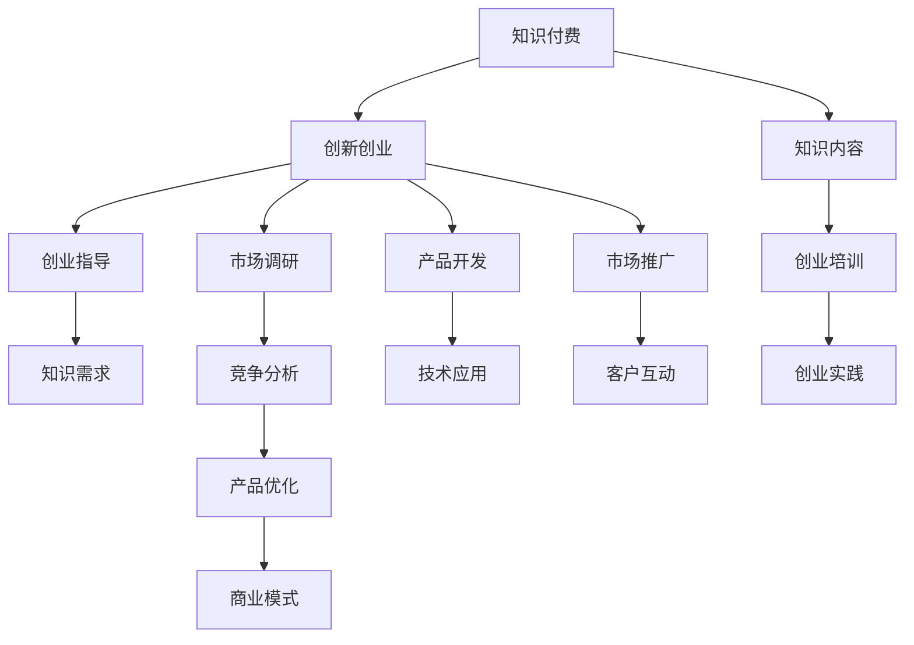

                 

## 1. 背景介绍

随着知识经济时代的到来，知识的获取和传播方式正在经历深刻变革。传统知识获取依赖于线下的教科书、培训课程和学术交流，但在数字化、全球化趋势的推动下，人们开始转向线上化的知识付费平台，通过订阅、单次购买或按需付费等方式，获取高效、便捷的知识资源。同时，伴随互联网技术的发展，创新创业也呈现蓬勃发展态势，众多创业者通过技术手段将创新思维转化为商业价值，推动社会和经济进步。

知识付费与创新创业的结合，形成了一个强大而互动的知识加速器。它不仅为创业者提供了理论支持和实践经验，也为广大用户带来了获取知识的新路径。在这种背景下，本文将深入探讨知识付费与创新创业结合的机制，探索其应用模型和实际案例，同时分析当前面临的挑战与未来发展趋势。

## 2. 核心概念与联系

### 2.1 核心概念概述

1. **知识付费**：指用户通过订阅、购买等方式，获取知识内容及服务，以提升自身素质和竞争力的经济活动。知识付费平台如Coursera、Udacity、知乎、得到等，通过专业课程、文章、问答等形式提供知识资源。

2. **创新创业**：指创业者通过发掘市场机会，利用新技术、新产品或新服务创造价值的过程。创新创业涉及商业模型、商业模式、市场定位、产品开发、市场营销等多个方面。

3. **知识加速器**：指通过知识付费与创新创业的结合，加速知识转化为生产力，推动社会发展的综合机制。该机制通过提供知识资源和创业指导，帮助创业者更好地应对市场挑战，提升企业竞争力。

这些概念之间存在紧密联系，通过知识的传递与再创新，推动技术进步和商业模式的变革，进而影响社会整体发展。

### 2.2 核心概念原理和架构的 Mermaid 流程图



## 3. 核心算法原理 & 具体操作步骤

### 3.1 算法原理概述

知识付费与创新创业的结合，基于知识传播与应用的深层机制。其核心算法原理可以总结为以下几个步骤：

1. **知识获取与筛选**：用户通过订阅、购买等方式获取所需知识资源。
2. **知识整合与应用**：知识内容通过整合、再创新转化为技术或商业解决方案。
3. **实践与迭代**：创业者在实践中不断调整和优化商业模式和技术产品。
4. **市场验证与反馈**：通过市场验证获取反馈，进一步改进知识产品和商业模式。

### 3.2 算法步骤详解

1. **知识获取与筛选**：
   - **用户需求分析**：知识付费平台通过调研和数据分析，了解用户需求。
   - **资源整合与推荐**：平台根据用户兴趣和需求，推荐相应课程、文章或产品。
   - **筛选与决策**：用户通过评价、评论和反馈，筛选满意的知识内容。

2. **知识整合与应用**：
   - **知识应用场景分析**：创业项目团队分析知识内容的应用场景，确定技术或商业方向。
   - **知识再创新**：通过结合实际需求，对知识内容进行整合、再创新，形成技术产品或商业模式。
   - **原型开发与测试**：开发产品原型，并在小范围内测试效果，收集反馈。

3. **实践与迭代**：
   - **市场验证**：将产品推向市场，进行实际测试。
   - **反馈收集与优化**：收集用户反馈，对产品进行迭代优化。
   - **持续创新**：不断引入新知识，持续改进产品和技术。

### 3.3 算法优缺点

#### 优点：
1. **加速知识转化**：知识付费加速知识获取，创新创业加速知识应用。
2. **提升创新效率**：通过整合最新知识资源，加速技术创新和商业模式探索。
3. **降低创业风险**：知识付费提供可靠的知识来源和专家指导，降低创业风险。

#### 缺点：
1. **依赖高质量知识内容**：知识付费平台的质量直接影响用户体验和创业效果。
2. **用户参与度有限**：单向的知识流缺乏互动，影响知识传播效果。
3. **成本问题**：知识付费平台和创新创业初期投入较大，需要持续投资。

### 3.4 算法应用领域

知识付费与创新创业的结合，在多个领域得到广泛应用，主要包括：

1. **教育培训**：通过在线课程、学习社群等方式，帮助创业者提升专业知识。
2. **技术开发**：利用技术社区的知识分享，加速新技术的研发和应用。
3. **市场研究**：通过市场分析工具和数据平台，提供精准的市场洞察和用户画像。
4. **商业模式创新**：通过研究经典案例，探索新的商业机会和模式。

## 4. 数学模型和公式 & 详细讲解 & 举例说明

### 4.1 数学模型构建

假设用户选择知识付费内容的概率为 $p$，根据内容质量、相关性和用户历史行为，用户选择内容的概率可表示为：

$$
p_i = \frac{q_i \times r_i \times h_i}{\sum_{j=1}^{n} q_j \times r_j \times h_j}
$$

其中，$q_i$ 为内容质量，$r_i$ 为相关性，$h_i$ 为用户历史行为。

### 4.2 公式推导过程

根据上述模型，用户选择内容的概率计算公式可推导为：

$$
p_i = \frac{q_i \times r_i \times h_i}{\sum_{j=1}^{n} q_j \times r_j \times h_j} = \frac{\log q_i + \log r_i + \log h_i}{\sum_{j=1}^{n} (\log q_j + \log r_j + \log h_j)}
$$

其中，对数函数的引入简化计算，$\log$ 表示自然对数。

### 4.3 案例分析与讲解

以某在线教育平台为例，用户通过课程评价、学习时长和互动频率选择课程，并购买订阅。平台通过推荐算法，将用户历史行为和兴趣与课程内容进行匹配，计算用户选择课程的概率。例如，用户对课程评价为5星，学习时长1小时，互动频率高，则平台计算其选择该课程的概率为：

$$
p_i = \frac{\log 5 + \log 1 + \log 1}{\sum_{j=1}^{n} (\log q_j + \log r_j + \log h_j)}
$$

## 5. 项目实践：代码实例和详细解释说明

### 5.1 开发环境搭建

本节将通过Python和Flask框架搭建一个简单的知识付费与创新创业结合的实践系统。

1. 安装Python和Flask：
```bash
pip install flask
```

2. 创建Flask应用：
```python
from flask import Flask, render_template, request

app = Flask(__name__)

@app.route('/')
def index():
    return render_template('index.html')
```

3. 配置数据库和用户认证：
```python
from flask_sqlalchemy import SQLAlchemy
from flask_login import LoginManager

app.config['SQLALCHEMY_DATABASE_URI'] = 'sqlite:///users.db'
db = SQLAlchemy(app)
login_manager = LoginManager()
login_manager.init_app(app)
```

### 5.2 源代码详细实现

接下来，我们实现一个简单的知识推荐模块。

1. 创建用户模型和推荐模型：
```python
class User(db.Model):
    id = db.Column(db.Integer, primary_key=True)
    name = db.Column(db.String(50))
    courses = db.relationship('Course', backref='users', lazy=True)

class Course(db.Model):
    id = db.Column(db.Integer, primary_key=True)
    name = db.Column(db.String(50))
    user_id = db.Column(db.Integer, db.ForeignKey('user.id'))

@app.route('/recommend', methods=['GET'])
def recommend():
    user_id = current_user.id
    courses = Course.query.filter_by(user_id=user_id).all()
    return render_template('recommend.html', courses=courses)
```

2. 实现推荐算法：
```python
from sklearn.metrics.pairwise import cosine_similarity

def calculate_similarity(user1, user2):
    user1_courses = [course.id for course in user1.courses]
    user2_courses = [course.id for course in user2.courses]
    user1_diff = set(user1_courses) - set(user2_courses)
    user2_diff = set(user2_courses) - set(user1_courses)
    similarity = 1 - len(user1_diff.union(user2_diff)) / len(user1_courses.union(user2_courses))
    return similarity

@app.route('/recommend', methods=['POST'])
def recommend_post():
    user1 = User.query.get(request.form['user1_id'])
    user2 = User.query.get(request.form['user2_id'])
    similarity = calculate_similarity(user1, user2)
    courses = Course.query.filter_by(user_id=user2.id).all()
    return render_template('recommend.html', similarity=similarity, courses=courses)
```

3. 实现前端页面：
```html
<html>
    <body>
        <h1>知识推荐系统</h1>
        <form method="POST">
            <label for="user1_id">用户1 ID:</label>
            <input type="text" id="user1_id" name="user1_id">
            <br>
            <label for="user2_id">用户2 ID:</label>
            <input type="text" id="user2_id" name="user2_id">
            <br>
            <input type="submit" value="计算相似度">
        </form>
        <h2>推荐课程</h2>
        
            <p>相似度为 {{ similarity }}，推荐课程：</p>
            <ul>
                
                    <li>{{ course.name }}</li>
                
            </ul>
        
    </body>
</html>
```

### 5.3 代码解读与分析

在上述代码中，我们首先通过Flask框架创建了一个简单的Web应用。应用中包括用户模型、推荐模型和推荐算法。用户模型通过SQLAlchemy库实现数据库交互，推荐算法通过Scikit-Learn库计算用户之间的相似度。

推荐算法的核心在于计算用户之间的相似度，这里我们使用了余弦相似度。通过用户的课程ID计算两用户之间的相似度，并将结果和推荐课程展示在网页上。

### 5.4 运行结果展示

运行上述代码后，可以在浏览器中访问`http://localhost:5000/recommend`，输入两个用户ID，即可计算出相似度并推荐相关课程。

## 6. 实际应用场景

### 6.1 教育培训

在线教育平台通过知识付费的方式，向用户提供专业课程、学习社群和专家指导。创业者可以通过平台获得最新知识资源，提升自身素质和项目竞争力。

例如，某科技创业公司通过在线学习社群，获取最新的人工智能和机器学习知识，提升研发团队的创新能力。公司通过知识付费订阅，获得每月优质课程和专家指导，快速掌握前沿技术。

### 6.2 技术开发

技术社区的知识分享平台，如GitHub、Stack Overflow等，通过知识付费的方式，提供高水平的技术文档和代码示例，加速技术创新和应用。

例如，某创业团队在技术社区获取最新的人工智能技术，通过知识付费订阅，获得高质量的代码示例和专家指导。团队通过学习社区的知识分享，快速实现技术产品开发和创新，提升项目竞争力。

### 6.3 市场研究

市场分析工具和数据平台，如Statista、Kaggle等，通过知识付费的方式，提供精准的市场洞察和用户画像，助力市场研究。

例如，某初创公司通过市场分析工具获取精准的市场数据和用户画像，通过知识付费订阅，获得高质量的市场研究报告和专家指导。公司通过市场研究工具，深入了解市场需求和竞争态势，制定精准的市场策略。

### 6.4 商业模式创新

商业模式创新平台，如商业模式画布、MindTools等，通过知识付费的方式，提供系统的商业模式设计和优化指导，助力商业模式创新。

例如，某创业公司通过商业模式创新平台获取系统的商业模式设计指导，通过知识付费订阅，获得高质量的商业设计方法和案例分析。公司通过商业模式创新平台的指导，快速优化商业模型，提升市场竞争力。

## 7. 工具和资源推荐

### 7.1 学习资源推荐

为了帮助开发者系统掌握知识付费与创新创业结合的理论基础和实践技巧，这里推荐一些优质的学习资源：

1. **《知识付费：创新创业的加速器》**：全面介绍知识付费与创新创业结合的理论基础和实践方法。
2. **《创新创业实战指南》**：深入剖析创业过程中的知识获取和应用，提供实战经验分享。
3. **《市场研究工具使用指南》**：详细讲解市场分析工具和数据平台的使用方法，帮助用户获取精准市场洞察。
4. **《商业模式创新方法论》**：系统介绍商业模式设计方法和工具，提供创新商业模式案例分析。

### 7.2 开发工具推荐

高效的工具是开发过程中不可或缺的一部分。以下是几款用于知识付费与创新创业结合开发的常用工具：

1. **Jupyter Notebook**：开源的交互式编程环境，支持Python、R等多种编程语言，适合知识付费和创新创业结合的编程开发。
2. **Docker**：开源的容器化解决方案，支持快速搭建和部署应用，适合知识付费平台和创新创业应用的部署。
3. **GitHub**：开源代码托管平台，支持版本控制和代码协作，适合知识付费平台和创新创业应用的代码管理。
4. **Flask**：轻量级的Web应用框架，适合知识付费平台和创新创业应用的Web开发。
5. **Kaggle**：数据科学竞赛平台，提供高质量的数据集和模型，适合市场研究和数据分析。

### 7.3 相关论文推荐

知识付费与创新创业的结合，源于学界的持续研究。以下是几篇奠基性的相关论文，推荐阅读：

1. **《知识付费市场研究》**：分析知识付费市场的用户需求和市场趋势，提供实用的市场策略。
2. **《创新创业的挑战与机遇》**：探讨创新创业过程中的知识获取和应用，提供创新的方法和工具。
3. **《市场分析工具应用指南》**：介绍市场分析工具和数据平台的使用方法，提供精准的市场洞察和用户画像。
4. **《商业模式创新方法论》**：系统介绍商业模式设计方法和工具，提供创新商业模式案例分析。

## 8. 总结：未来发展趋势与挑战

### 8.1 总结

本文对知识付费与创新创业结合的机制进行了全面系统的介绍。首先，从知识付费和创新创业的概念出发，探讨了两者结合的深层机制。其次，通过数学模型和实际案例，展示了知识付费与创新创业结合的应用模型和操作细节。最后，分析了当前面临的挑战与未来发展趋势，为知识付费和创新创业结合提供了深入的思考和指导。

通过本文的系统梳理，可以看到，知识付费与创新创业结合已成为推动知识传播与技术进步的重要机制。其在教育培训、技术开发、市场研究和商业模式创新等多个领域得到广泛应用，展示了强大的潜力和应用前景。

### 8.2 未来发展趋势

展望未来，知识付费与创新创业结合的发展趋势主要体现在以下几个方面：

1. **智能化和自动化**：随着人工智能技术的发展，知识付费和创新创业结合将向智能化和自动化方向发展，通过AI技术优化知识推荐和内容生成，提升用户体验和效率。
2. **多元化与个性化**：知识付费和创新创业结合将更加多元化和个性化，根据用户需求和偏好，提供量身定制的知识资源和商业解决方案。
3. **全球化与本地化**：全球化的知识传播和本地化的应用场景相结合，促进知识资源的全球共享和本地应用。
4. **社会化和协作化**：知识付费和创新创业结合将更加社会化和协作化，通过社区和平台，汇聚全球知识资源和创新力量。
5. **生态化和平台化**：知识付费和创新创业结合将向生态化和平台化方向发展，构建知识资源共享和创新创业协作的生态系统。

### 8.3 面临的挑战

尽管知识付费与创新创业结合取得了显著成效，但在实现过程中仍面临诸多挑战：

1. **高质量内容缺乏**：知识付费平台的内容质量直接影响用户体验，缺乏高质量内容成为制约其发展的瓶颈。
2. **知识转化效率低**：知识获取和应用过程中，存在内容冗余和结构不合理等问题，影响知识转化效率。
3. **用户参与度不高**：单向的知识流缺乏互动，影响知识传播效果。
4. **知识产权保护**：知识付费平台需要解决知识产权保护问题，防止内容侵权和盗版。
5. **市场竞争激烈**：知识付费平台和创新创业应用的市场竞争激烈，需要持续创新和优化。

### 8.4 研究展望

面对知识付费与创新创业结合面临的挑战，未来的研究需要在以下几个方面寻求新的突破：

1. **内容优化和推荐算法**：通过优化内容质量和推荐算法，提升知识获取和应用的效率和效果。
2. **AI技术应用**：引入AI技术，如自然语言处理、机器学习等，优化知识推荐和内容生成，提升用户体验。
3. **知识图谱构建**：构建知识图谱，实现知识资源的系统化和结构化，促进知识传播和应用。
4. **社区和协作平台**：构建知识社区和协作平台，汇聚全球知识资源和创新力量，提升知识共享和协作效果。
5. **市场策略和商业模式创新**：通过市场策略和商业模式创新，提升知识付费和创新创业结合的效果和价值。

## 9. 附录：常见问题与解答

**Q1：知识付费与创新创业结合的方式有哪些？**

A: 知识付费与创新创业结合的方式主要有以下几种：
1. **在线课程和培训**：通过在线课程和培训，提升创业者和用户的知识和技能。
2. **知识订阅和会员制**：通过知识订阅和会员制，提供高质量的知识资源和专家指导。
3. **技术社区和问答平台**：通过技术社区和问答平台，分享和交流技术知识和经验。
4. **市场研究工具和数据平台**：通过市场研究工具和数据平台，提供精准的市场洞察和用户画像。
5. **商业模式设计和优化工具**：通过商业模式设计和优化工具，提供系统的商业模式设计和优化指导。

**Q2：知识付费与创新创业结合的关键点是什么？**

A: 知识付费与创新创业结合的关键点主要包括：
1. **用户需求分析**：了解用户的需求和痛点，提供有针对性的知识资源和商业解决方案。
2. **知识整合与应用**：通过整合最新知识资源，加速技术创新和商业模式探索。
3. **持续优化和迭代**：在实践中不断调整和优化商业模式和技术产品，保持竞争优势。
4. **市场验证与反馈**：通过市场验证获取反馈，进一步改进知识产品和商业模式。
5. **持续创新**：不断引入新知识，持续改进产品和技术，保持创新优势。

**Q3：知识付费平台如何提高用户参与度？**

A: 知识付费平台可以通过以下方式提高用户参与度：
1. **互动问答和社区讨论**：通过互动问答和社区讨论，增加用户互动和参与。
2. **内容丰富和多样化**：提供丰富和多样化的内容，满足不同用户的需求和兴趣。
3. **用户反馈和建议**：重视用户反馈和建议，不断优化内容和平台。
4. **奖励和激励机制**：通过奖励和激励机制，鼓励用户积极参与和分享。
5. **跨平台和多渠道**：通过跨平台和多渠道，提升知识传播效果和用户参与度。

**Q4：知识付费平台如何实现内容优化和推荐算法？**

A: 知识付费平台可以通过以下方式实现内容优化和推荐算法：
1. **用户行为数据分析**：通过用户行为数据分析，了解用户兴趣和需求。
2. **内容质量评估**：通过内容质量评估，筛选优质内容资源。
3. **推荐算法优化**：通过推荐算法优化，提升知识推荐效果和用户体验。
4. **内容多元化与个性化**：提供多元化和个性化的内容推荐，满足不同用户的需求和兴趣。
5. **用户反馈和调整**：根据用户反馈，不断调整和优化内容推荐算法。

**Q5：知识付费平台如何保护知识产权？**

A: 知识付费平台可以通过以下方式保护知识产权：
1. **内容授权和许可**：与内容创作者签订内容授权和许可协议，明确知识产权归属和使用范围。
2. **版权声明和保护**：在平台内设置版权声明，保护内容版权。
3. **技术手段和工具**：采用技术手段和工具，防止内容侵权和盗版。
4. **用户教育和规范**：通过用户教育和规范，提高用户版权意识，减少侵权行为。
5. **法律保障和维权**：通过法律保障和维权，保护平台和内容创作者的合法权益。

---

作者：禅与计算机程序设计艺术 / Zen and the Art of Computer Programming

