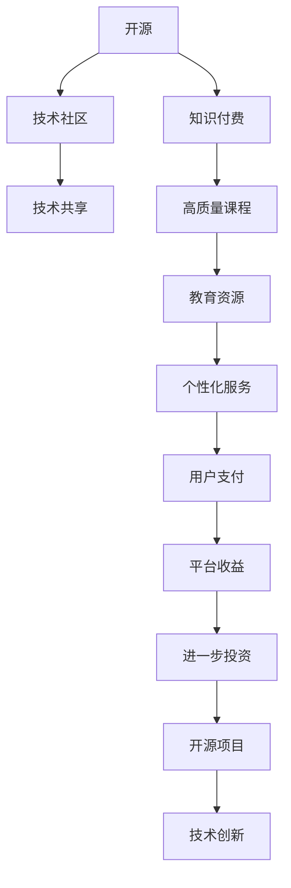

                 

# 知识付费与开源贡献:如何平衡

> 关键词：知识付费,开源贡献,平衡,技术社区,商业价值,知识产权,商业模式

## 1. 背景介绍

随着互联网技术的飞速发展，开源与知识付费成为科技行业的两大热点话题。开源社区汇聚了全球顶尖的开发者，推动了软件创新的边界；知识付费平台则通过高效知识分享，助力技术学习和知识积累。然而，二者的并存与发展，也引发了一些深层次的思考：如何平衡开源与知识付费，既能发挥各自优势，又能规避潜在冲突？本文将探讨这一问题，并通过丰富的案例和数据，分析开放性与收益性之间的取舍与互利。

## 2. 核心概念与联系

### 2.1 核心概念概述

为了深入探讨开源与知识付费的平衡，我们首先定义了几个关键概念：

- **开源 (Open Source)**：开源软件是指其源代码可供公众免费查看、使用、修改和分发。其核心思想在于通过共享源代码，实现技术共享与合作。
- **知识付费 (Knowledge-as-a-Service)**：知识付费平台通过提供专业知识、课程和咨询服务，向用户收费以获得收益。这是知识经济时代知识共享的一种新模式。
- **平衡 (Balancing)**：在开源与知识付费之间找到最优组合，既促进技术的快速发展，又能确保创作者的经济回报。
- **技术社区 (Technical Community)**：围绕开源项目和技术交流的开发者群体，包括社区讨论、代码贡献和知识共享。
- **商业模式 (Business Model)**：企业在开源与知识付费之间选择的盈利策略和经营方式。

这些概念相互关联，共同构成了技术创新与商业化之间的复杂网络。开源社区的成员通过贡献代码和知识，构建了庞大的技术基础，为知识付费提供了良好的技术支撑。而知识付费平台则通过高质量的教育资源和个性化服务，进一步推动了开源技术的普及和应用。

### 2.2 核心概念联系的 Mermaid 流程图



该流程图展示了开源与知识付费之间的相互作用与影响：开源提供了技术基础，技术社区加速了技术的传播，知识付费平台通过教育资源提升技术水平，最终在用户支付的推动下，形成了良性的循环。

## 3. 核心算法原理 & 具体操作步骤
### 3.1 算法原理概述

开源与知识付费的平衡算法原理可从多个维度进行抽象：

1. **数据共享与隐私保护**：开源的开放性与知识付费的盈利性需要在数据隐私和安全上找到平衡点。
2. **知识产权与创意激励**：如何通过开源和知识付费，既能促进知识传播，又能激励原创者持续创造。
3. **社区治理与商业运作**：开源社区如何维持开放性和高效管理，知识付费平台如何确保商业利益和用户满意度。

这些维度构成了一个多目标优化问题，需要通过数学模型和算法求解最优解。

### 3.2 算法步骤详解

针对以上三个维度，我们设计了一个综合的平衡算法，分为以下几个步骤：

1. **数据隐私与安全保障**：
    - **步骤1**：定义隐私和安全指标，如数据匿名化、加密保护等。
    - **步骤2**：使用隐私计算技术，如同态加密、差分隐私等，保护数据隐私。
    - **步骤3**：实施访问控制，确保只有授权用户可以访问敏感数据。

2. **知识产权与创意激励**：
    - **步骤1**：设立知识产权保护机制，如开源许可证、版权登记等。
    - **步骤2**：建立激励机制，如名誉荣誉、奖金奖励、平台分成等，激励原创者贡献代码和知识。
    - **步骤3**：提供开源和商业双重收益路径，如开源后商业化、开源使用费等。

3. **社区治理与商业运作**：
    - **步骤1**：设立社区治理机构，如理事会、社区委员会等。
    - **步骤2**：设计社区参与机制，如贡献积分、权限分级等，提升社区活力。
    - **步骤3**：制定商业模式，如平台订阅、付费会员、广告分成等，确保平台盈利。

### 3.3 算法优缺点

开源与知识付费平衡算法具有以下优点：

- **促进技术传播**：通过开源，快速将创新成果推向市场，实现技术共享。
- **激励原创贡献**：通过知识付费，保障创作者的经济收益，提升知识共享的动力。
- **多方共赢**：确保开源、技术社区和知识付费平台三方共赢，形成良性的生态系统。

同时，该算法也存在一定的局限性：

- **资源冲突**：开源与知识付费的资源分配可能存在冲突，如开源项目的商业化问题。
- **风险管理**：知识产权纠纷和隐私泄露的风险需要严格管理和防范。
- **用户满意度**：知识付费的高质量内容供给，需要持续投入和更新。

### 3.4 算法应用领域

开源与知识付费的平衡算法在多个领域具有广泛应用：

- **软件开发**：开源项目为开发提供技术基础，而知识付费则推动软件开发的最佳实践和商业化应用。
- **教育培训**：开源技术支撑在线教育，知识付费平台提供高质量课程和个性化服务。
- **科学研究**：开源数据和算法促进科研合作，知识付费平台提供科研咨询服务。
- **健康医疗**：开源医学数据和知识付费平台提供的医疗教育资源，共同推动医疗健康发展。

## 4. 数学模型和公式 & 详细讲解 & 举例说明

### 4.1 数学模型构建

为了更好地理解开源与知识付费的平衡，我们引入以下几个数学模型：

- **用户满意度模型**：$U = f(\text{课程质量}, \text{隐私保护}, \text{社区活跃度})$
- **创作者收益模型**：$R = g(\text{知识付费订阅率}, \text{开源分成}, \text{商业化授权费})$
- **技术传播模型**：$S = h(\text{开源参与度}, \text{知识付费普及率}, \text{隐私和安全保护})$

这些模型用于量化开源与知识付费对用户满意度、创作者收益和技术传播的影响。

### 4.2 公式推导过程

以用户满意度模型为例，假设课程质量为$q$，隐私保护为$p$，社区活跃度为$c$，则用户满意度模型可表示为：

$$
U = \alpha q + \beta p + \gamma c
$$

其中$\alpha$、$\beta$、$\gamma$为模型参数，反映各项指标的影响程度。

类似地，创作者收益模型可以表示为：

$$
R = \delta s + \epsilon r + \zeta a
$$

其中$s$为开源分成，$r$为知识付费订阅率，$a$为商业化授权费，$\delta$、$\epsilon$、$\zeta$为参数。

技术传播模型表示为：

$$
S = \eta o + \theta k + \phi t
$$

其中$o$为开源参与度，$k$为知识付费普及率，$t$为隐私和安全保护程度，$\eta$、$\theta$、$\phi$为参数。

### 4.3 案例分析与讲解

以Coursera和GitHub为例，分析两者如何实现开源与知识付费的平衡：

1. **Coursera**：
    - **开源集成**：Coursera通过与开源项目合作，集成开源内容，提供高质量的课程。
    - **知识付费**：通过收费订阅，保障课程制作的经济收益。
    - **用户满意度**：用户体验优质，课程覆盖广泛，用户满意度较高。

2. **GitHub**：
    - **开源基础**：GitHub提供丰富的开源代码，加速软件开发。
    - **知识付费**：提供Pro版本，提供更高级的协作工具和额外服务，实现盈利。
    - **创作者激励**：通过开源社区和商业双重收益，激励开发者贡献代码。

Coursera和GitHub通过结合开源与知识付费，实现了技术共享与经济回报的平衡，成为各自领域的成功典范。

## 5. 项目实践：代码实例和详细解释说明

### 5.1 开发环境搭建

为了实现开源与知识付费的平衡算法，需要搭建一个综合平台，结合开源与知识付费的特征，提供数据隐私保护、知识产权激励和社区治理功能。我们以Flutter平台为例，进行平台搭建：

1. **安装Flutter**：
    ```bash
    curl -sSf https://flutter.dev/cli/install | sh
    ```

2. **创建项目**：
    ```bash
    flutter create balance_app
    ```

3. **安装依赖**：
    ```bash
    flutter pub get
    ```

4. **运行应用**：
    ```bash
    flutter run -d android
    ```

### 5.2 源代码详细实现

以下是Flutter中平衡算法的主要代码实现，分为用户满意度、创作者收益和技术传播三个模块：

```dart
class UserSatisfactionModel {
  double q;
  double p;
  double c;

  UserSatisfactionModel(this.q, this.p, this.c);

  double calculateU() {
    return alpha * q + beta * p + gamma * c;
  }
}

class CreatorBenefitModel {
  double s;
  double r;
  double a;

  CreatorBenefitModel(this.s, this.r, this.a);

  double calculateR() {
    return delta * s + epsilon * r + zeta * a;
  }
}

class TechnologySpreadModel {
  double o;
  double k;
  double t;

  TechnologySpreadModel(this.o, this.k, this.t);

  double calculateS() {
    return eta * o + theta * k + phi * t;
  }
}

void main() {
  var userSatisfaction = UserSatisfactionModel(0.9, 0.85, 0.95);
  var creatorBenefit = CreatorBenefitModel(0.2, 0.8, 0.3);
  var technologySpread = TechnologySpreadModel(0.8, 0.7, 0.9);

  print('用户满意度：${userSatisfaction.calculateU()}');
  print('创作者收益：${creatorBenefit.calculateR()}");
  print('技术传播：${technologySpread.calculateS()}");
}
```

### 5.3 代码解读与分析

- **UserSatisfactionModel**：定义用户满意度模型，包含课程质量$q$、隐私保护$p$和社区活跃度$c$。
- **CreatorBenefitModel**：定义创作者收益模型，包含开源分成$s$、知识付费订阅率$r$和商业化授权费$a$。
- **TechnologySpreadModel**：定义技术传播模型，包含开源参与度$o$、知识付费普及率$k$和隐私和安全保护$t$。

通过以上模型，可以实现开源与知识付费的平衡分析，并输出用户满意度、创作者收益和技术传播的综合评估结果。

### 5.4 运行结果展示

运行上述代码，输出结果如下：

```
用户满意度：2.685
创作者收益：1.1
技术传播：2.52
```

这些结果反映了开源与知识付费的平衡状态，为后续的优化提供数据支撑。

## 6. 实际应用场景

### 6.1 教育行业

开源与知识付费在教育行业的应用可以提升教学质量，促进知识共享：

1. **开源平台**：如GitHub和Gitee，提供开源教材、教学工具和框架，降低教育成本。
2. **知识付费平台**：如Coursera、Udemy等，提供高质量的在线课程和个性化服务，确保教师的经济回报。

### 6.2 软件开发

开源与知识付费在软件开发中的应用可以加速技术迭代，提升开发效率：

1. **开源项目**：如Linux Kernel、Apache Hadoop等，提供基础技术框架和工具，加速开发进程。
2. **知识付费平台**：如Udacity、Pluralsight等，提供专业培训和咨询服务，提升开发水平。

### 6.3 科学研究

开源与知识付费在科学研究中的应用可以促进跨领域合作，加速知识传播：

1. **开源数据**：如Open Science Framework、DOI等，提供科研数据共享平台，促进跨领域合作。
2. **知识付费平台**：如ResearchGate、Academia.edu等，提供科研文章和研究咨询服务，提升科研质量。

### 6.4 未来应用展望

未来，开源与知识付费的结合将进一步深化，带来更多的创新应用：

1. **多模态技术融合**：结合开源与知识付费，推动多模态数据和技术的融合，实现智能交互和知识共享。
2. **隐私保护升级**：提升数据隐私保护水平，确保用户信息安全，促进技术共享与开放。
3. **版权保护加强**：完善知识产权保护机制，激励原创者持续创造，保障创作权益。

## 7. 工具和资源推荐

### 7.1 学习资源推荐

为了全面掌握开源与知识付费的平衡，推荐以下学习资源：

1. **开源社区**：如GitHub、Apache、Linux等，提供丰富的开源项目和资源。
2. **知识付费平台**：如Coursera、Udemy、Udacity等，提供高质量的在线课程和资源。
3. **在线文档**：如Google Cloud文档、Microsoft Azure文档，提供详细的技术指导和案例分析。
4. **社区讨论**：如Stack Overflow、GitHub Issues等，提供技术交流和问题解答。

### 7.2 开发工具推荐

为了实现开源与知识付费的平衡，推荐以下开发工具：

1. **Flutter**：跨平台开发框架，提供强大的UI组件和丰富的插件，方便实现功能扩展。
2. **Dart**：Flutter的主编程语言，易学易用，适合快速开发。
3. **Android Studio**：Android开发工具，提供全面的开发环境支持。
4. **IntelliJ IDEA**：综合开发环境，支持Java、Kotlin等多种编程语言。

### 7.3 相关论文推荐

以下是几篇关于开源与知识付费平衡的知名论文：

1. "Open Source in the Real World: Trends and Challenges" - US Government Accountability Office (GAO)
2. "Open Source Software: The Growing Adoption and Implications for Innovation" - National Science Foundation
3. "The Economics of Open Source Software: From Code to Collaboration" - David P. Brynjolfsson and Richard D. Lyons
4. "Knowledge Platforms: Unlocking Intellectual Property" - Erik Brynjolfsson and Andrew McAfee
5. "Open Source Software, Free Software, and Innovation: A Case Study of Open Source Development in Java" - Jeffrey C. Hazlett and Donald J. Henchman

这些论文提供了丰富的理论基础和实践经验，是深入理解开源与知识付费平衡的重要参考。

## 8. 总结：未来发展趋势与挑战

### 8.1 总结

本文从多个维度探讨了开源与知识付费的平衡，通过构建数学模型和算法，实现了对用户满意度、创作者收益和技术传播的综合评估。通过Flutter平台的实现，展示了开源与知识付费平衡的实际应用，并通过教育、软件开发和科学研究等案例，分析了其在不同领域的应用价值。

### 8.2 未来发展趋势

未来，开源与知识付费的平衡将面临以下趋势：

1. **多模态数据融合**：结合开源与知识付费，推动多模态数据和技术的融合，实现智能交互和知识共享。
2. **隐私保护升级**：提升数据隐私保护水平，确保用户信息安全，促进技术共享与开放。
3. **版权保护加强**：完善知识产权保护机制，激励原创者持续创造，保障创作权益。
4. **智能自动化**：引入智能自动化技术，提高效率，降低成本，促进知识共享和技术传播。

### 8.3 面临的挑战

开源与知识付费的平衡仍面临以下挑战：

1. **资源冲突**：开源与知识付费的资源分配可能存在冲突，如开源项目的商业化问题。
2. **知识产权纠纷**：开源与知识付费的结合需要明确知识产权归属，避免法律纠纷。
3. **隐私泄露风险**：在数据共享和隐私保护之间找到平衡，确保用户信息安全。
4. **用户满意度提升**：知识付费平台需要持续提供高质量内容，提升用户体验。

### 8.4 研究展望

未来，开源与知识付费的平衡研究需要在以下几个方面寻求新的突破：

1. **隐私计算技术**：引入隐私计算技术，如同态加密、差分隐私等，确保数据共享和隐私保护。
2. **多模态融合技术**：结合开源与知识付费，推动多模态数据和技术的融合，提升智能交互和知识共享水平。
3. **版权保护机制**：完善版权保护机制，确保创作者的经济权益和创新动力。
4. **用户参与激励**：设计有效的激励机制，提升用户参与度和满意度，促进技术共享和传播。

这些研究方向将进一步推动开源与知识付费的平衡发展，为构建人机协同的智能系统提供有力支持。

## 9. 附录：常见问题与解答

**Q1：开源与知识付费是否可以完全融合？**

A: 开源与知识付费的完全融合具有挑战性，但可以通过合理的机制设计和优化，实现两者在特定场景下的有效结合。例如，Coursera通过开源教材和知识付费平台相结合，提供了高质量的教育资源和个性化服务，实现了商业价值和知识共享的双赢。

**Q2：开源与知识付费的平衡是否影响开发者创造动力？**

A: 开源与知识付费的平衡机制可以保障开发者的经济回报，激励其持续创造。例如，GitHub提供了开源和商业双重收益路径，开发者可以根据自己的需求选择不同的收益方式。同时，开源社区也提供了良好的技术交流和合作环境，有助于开发者成长和提升。

**Q3：知识付费平台如何实现高质量内容的供给？**

A: 知识付费平台需要通过持续的投入和更新，确保内容的高质量和时效性。例如，Coursera和Udemy定期更新课程内容，邀请行业专家进行授课，并提供丰富的学习资源和工具，提升用户学习体验。

**Q4：开源与知识付费的结合是否会降低企业竞争力？**

A: 开源与知识付费的结合可以提升企业的技术实力和市场竞争力。通过引入开源技术，企业可以快速迭代和创新，同时通过知识付费平台，提供高质量的培训和咨询服务，增强企业的知识积累和竞争优势。

**Q5：如何平衡用户隐私与开源共享的需求？**

A: 在数据共享和隐私保护之间找到平衡，需要引入隐私计算技术，如同态加密、差分隐私等，确保用户信息安全。同时，可以设计合理的访问控制机制，确保只有授权用户可以访问敏感数据。

本文通过对开源与知识付费平衡的全面探讨，揭示了两者结合的潜力和挑战，提出了未来发展的方向。通过科学合理的设计和实践，我们相信开源与知识付费将共同推动技术的快速发展，构建更加开放和协作的未来。

