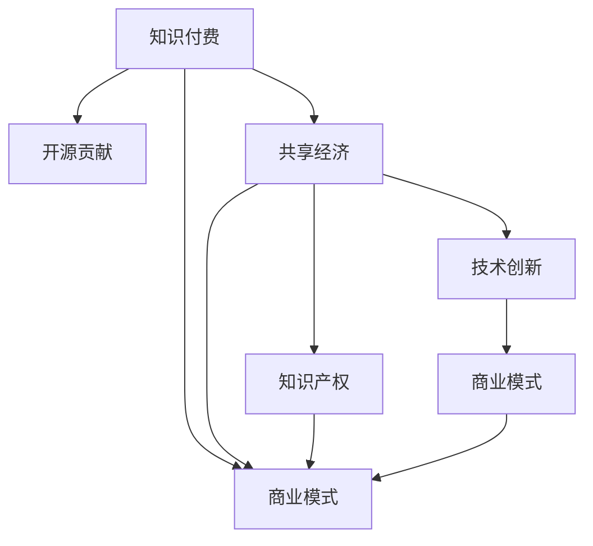

                 

# 知识付费与开源贡献的平衡艺术

> 关键词：知识付费,开源贡献,共享经济,商业模式,知识产权,技术创新,社区建设

## 1. 背景介绍

### 1.1 问题由来

在互联网时代，知识的传播和获取方式发生了根本性的变化。从传统的书籍、报纸、讲座，到现在的博客、视频、播客，人们获取信息的渠道愈发多样化。尤其是在开源运动和知识付费平台的兴起下，知识获取的效率和便捷性得到了极大的提升。然而，随之而来的问题也越来越多，尤其是知识付费与开源贡献之间的平衡问题，已经成为业界和学界共同关注的焦点。

### 1.2 问题核心关键点

知识付费与开源贡献的平衡问题，其实质是如何在开源精神与商业模式之间找到一条共赢的道路。开源社区强调共享、合作、自由，而商业化则追求盈利、效率、知识产权保护。两者看似冲突，实则互补，找到其中的平衡点，是实现技术进步和商业发展的关键。

### 1.3 问题研究意义

研究知识付费与开源贡献的平衡问题，对于推动开源社区的健康发展，促进技术创新和产业转型，具有重要意义：

1. 提升知识获取效率。通过付费模式，可以快速筛选和获取高质量的深度内容，提升知识学习效率。
2. 激发知识创造动力。商业化的激励机制能够激发更多开发者参与开源项目，丰富社区内容。
3. 保障知识产权。付费模式通过许可协议，明确知识的归属和使用范围，保障了创作者的权益。
4. 促进社区互动。开源贡献与知识付费相辅相成，共同构建了一个良性互动的社区生态。
5. 推动技术传播。高质量的知识付费内容，通过社区传播，可以加速技术普及和创新。

## 2. 核心概念与联系

### 2.1 核心概念概述

为更好地理解知识付费与开源贡献的平衡，本节将介绍几个密切相关的核心概念：

- **知识付费**：指用户为获取有价值的信息或服务，通过付费订阅、单次购买等方式，以获取知识、技能、资源等形式的知识产品或服务。
- **开源贡献**：指开发者将自己的代码、文档、教程等资源贡献到开源社区，供其他开发者免费使用和修改。
- **共享经济**：指通过共享平台，将闲置资源盘活，提高资源利用率，实现双赢。开源社区和知识付费平台都是共享经济的典型代表。
- **商业模式**：指企业通过产品或服务的提供，实现盈利的过程。知识付费和开源贡献都是商业模式的一种表现形式。
- **知识产权**：指创作者对其智力劳动成果的专有权利，包括著作权、专利权等，保护创作者利益。
- **技术创新**：指通过新技术、新方法、新产品，解决现有问题，推动技术进步。

这些核心概念之间的逻辑关系可以通过以下Mermaid流程图来展示：



这个流程图展示了几者之间的相互关系：

1. 知识付费和开源贡献是共享经济的具体实现形式。
2. 商业模式是知识付费和开源贡献的基础。
3. 知识产权是商业模式的重要组成部分。
4. 技术创新是商业模式的驱动力，同时也是开源贡献的重要内容。

这些概念共同构成了知识付费与开源贡献的平衡体系，在实际操作中需要协同考虑，才能取得理想的效果。

## 3. 核心算法原理 & 具体操作步骤
### 3.1 算法原理概述

知识付费与开源贡献的平衡问题，本质上是一个多目标优化问题。需要平衡商业模式的盈利目标和开源社区的共享目标，同时保障知识产权和技术创新的持续性。

在数学形式上，可以将其表述为以下优化问题：

$$
\begin{aligned}
&\min_{\text{商业化程度} \lambda, \text{开源程度} \mu} \\
&\quad \lambda f_{\text{商业化收益}} + \mu f_{\text{开源贡献}} \\
&\text{subject to} \\
&\quad \lambda + \mu \leq 1 \\
&\quad \lambda \geq 0, \mu \geq 0
\end{aligned}
$$

其中，$\lambda$ 表示商业化程度，$f_{\text{商业化收益}}$ 表示商业模式的收益函数；$\mu$ 表示开源程度，$f_{\text{开源贡献}}$ 表示开源社区的贡献函数。约束条件 $\lambda + \mu \leq 1$ 表示商业化与开源的平衡。

### 3.2 算法步骤详解

知识付费与开源贡献的平衡问题，可以通过以下几个步骤进行优化：

**Step 1: 确定商业化目标**

首先需要明确商业化的目标，包括盈利模式、用户需求、市场定位等。例如，通过订阅制、按需付费、广告分成等方式实现盈利。

**Step 2: 设计开源策略**

设计开源策略，包括选择合适的开源协议（如GPL、MIT等），定义开源贡献的激励机制（如代码贡献积分、社区声誉等）。

**Step 3: 设置指标体系**

建立衡量商业化程度和开源程度的指标体系。商业化指标可以是用户增长、收入规模等，开源指标可以是贡献者数量、代码质量等。

**Step 4: 平衡优化**

通过迭代调整商业化程度和开源程度，不断优化平衡点，使其最大化总收益。可以使用线性规划、启发式算法等方法进行优化。

**Step 5: 持续监控与反馈**

持续监控商业化目标和开源策略的实施效果，根据反馈调整策略，确保平衡点的动态适应。

### 3.3 算法优缺点

知识付费与开源贡献的平衡算法，具有以下优点：

1. 多目标优化。能够同时考虑商业化收益和开源贡献，综合权衡其重要性。
2. 动态调整。可以实时监控指标，动态调整平衡点，适应市场和社区的变化。
3. 促进互动。通过激励机制，促进商业化和开源之间的良性互动，提升社区活力。

同时，该算法也存在一定的局限性：

1. 目标函数复杂。需要同时考虑多个指标，建立合适的收益函数和贡献函数，增加了复杂度。
2. 动态调整难度大。需要实时监控和优化，对技术要求较高。
3. 资源冲突。商业化和开源之间资源有限，需要合理分配，避免冲突。

尽管存在这些局限性，但就目前而言，多目标优化是解决知识付费与开源贡献平衡问题的有效方法。未来相关研究的重点在于如何进一步简化优化过程，提高算法的可解释性和鲁棒性。

### 3.4 算法应用领域

知识付费与开源贡献的平衡算法，适用于多种商业模型和技术场景：

- **软件开发生命周期**：适用于软件公司的项目管理和软件开发。通过平衡开源和商业化，可以优化资源配置，提升开发效率。
- **数据科学平台**：适用于数据科学公司的大数据处理和分析。通过平衡开源和商业化，可以扩大数据来源，提升数据质量。
- **在线教育**：适用于在线教育平台的内容生产和推广。通过平衡开源和商业化，可以丰富教学资源，扩大用户基础。
- **内容付费平台**：适用于各类内容付费平台（如付费博客、在线课程等）。通过平衡开源和商业化，可以提升内容价值，保障用户利益。
- **云服务提供商**：适用于云计算平台的服务和产品开发。通过平衡开源和商业化，可以增强生态系统，提升市场竞争力。

除了上述这些领域外，知识付费与开源贡献的平衡算法还可以拓展到更多场景中，如知识图谱构建、智能推荐系统、智能搜索等，为不同行业带来新的商业机遇。

## 4. 数学模型和公式 & 详细讲解
### 4.1 数学模型构建

本节将使用数学语言对知识付费与开源贡献的平衡问题进行更加严格的刻画。

记商业化程度为 $\lambda$，开源程度为 $\mu$。定义商业化收益为 $R_{\lambda}$，开源贡献为 $C_{\mu}$，总收益为 $P$。

定义商业化收益函数 $f_{\text{商业化收益}}(\lambda)$ 和开源贡献函数 $f_{\text{开源贡献}}(\mu)$，则总收益函数 $P(\lambda, \mu)$ 可以表示为：

$$
P(\lambda, \mu) = \lambda f_{\text{商业化收益}}(\lambda) + \mu f_{\text{开源贡献}}(\mu)
$$

目标是最小化总收益 $P(\lambda, \mu)$，同时满足 $\lambda + \mu \leq 1$ 的约束条件。

### 4.2 公式推导过程

以下我们以线性收益函数为例，推导商业化程度和开源程度的平衡点。

假设商业化收益函数和开源贡献函数都为线性函数，即：

$$
f_{\text{商业化收益}}(\lambda) = \alpha \lambda + \beta
$$

$$
f_{\text{开源贡献}}(\mu) = \gamma \mu + \delta
$$

则总收益函数可以表示为：

$$
P(\lambda, \mu) = \lambda (\alpha \lambda + \beta) + \mu (\gamma \mu + \delta) = \alpha \lambda^2 + \beta \lambda + \gamma \mu^2 + \delta \mu
$$

目标是最小化 $P(\lambda, \mu)$，同时满足 $\lambda + \mu \leq 1$ 的约束条件。

根据拉格朗日乘数法，可以构建拉格朗日函数：

$$
\mathcal{L}(\lambda, \mu, \lambda_1) = \alpha \lambda^2 + \beta \lambda + \gamma \mu^2 + \delta \mu + \lambda_1 (\lambda + \mu - 1)
$$

对 $\lambda$、$\mu$ 和 $\lambda_1$ 求偏导数，得到：

$$
\frac{\partial \mathcal{L}}{\partial \lambda} = 2\alpha \lambda + \beta + \lambda_1 = 0
$$

$$
\frac{\partial \mathcal{L}}{\partial \mu} = 2\gamma \mu + \delta + \lambda_1 = 0
$$

$$
\frac{\partial \mathcal{L}}{\partial \lambda_1} = \lambda + \mu - 1 = 0
$$

解得：

$$
\lambda = \frac{\beta + \lambda_1}{2\alpha}, \quad \mu = \frac{\delta + \lambda_1}{2\gamma}, \quad \lambda_1 = 1 - \lambda - \mu
$$

代入总收益函数，得到：

$$
P(\lambda, \mu) = \alpha \left(\frac{\beta + \lambda_1}{2\alpha}\right)^2 + \beta \frac{\beta + \lambda_1}{2\alpha} + \gamma \left(\frac{\delta + \lambda_1}{2\gamma}\right)^2 + \delta \frac{\delta + \lambda_1}{2\gamma}
$$

化简得：

$$
P(\lambda, \mu) = \frac{1}{4\alpha^2}(\beta + \lambda_1)^2 + \frac{1}{4\alpha}\beta(\beta + \lambda_1) + \frac{1}{4\gamma^2}(\delta + \lambda_1)^2 + \frac{1}{4\gamma}\delta(\delta + \lambda_1)
$$

通过选择适当的 $\alpha$、$\beta$、$\gamma$ 和 $\delta$，可以实现对商业化程度和开源程度的精确控制。

### 4.3 案例分析与讲解

以下我们以一个开源社区为例，分析其商业化程度和开源程度的最优策略。

假设一个开源社区有两个主要项目，一个是商业化的开源项目，另一个是非商业化的开源项目。

- **商业化项目**：用户通过订阅付费，获取商业化的服务和技术支持。商业化项目具有较高的盈利潜力，但其开源程度相对较低。
- **非商业化项目**：用户完全免费获取，但社区通过广告和赞助支持项目运行。非商业化项目具有较高的开源程度，但其盈利能力较弱。

定义商业化项目和商业化项目的收益函数为：

$$
f_{\text{商业化收益}}(\lambda) = 0.8 \lambda + 0.2
$$

$$
f_{\text{开源贡献}}(\mu) = 0.2 \mu + 0.8
$$

则总收益函数为：

$$
P(\lambda, \mu) = 0.8 \lambda^2 + 0.2 \lambda + 0.2 \mu^2 + 0.8 \mu
$$

约束条件为 $\lambda + \mu \leq 1$。

使用拉格朗日乘数法求解平衡点：

$$
\frac{\partial \mathcal{L}}{\partial \lambda} = 1.6 \lambda + 0.2 + \lambda_1 = 0
$$

$$
\frac{\partial \mathcal{L}}{\partial \mu} = 0.4 \mu + 0.8 + \lambda_1 = 0
$$

$$
\frac{\partial \mathcal{L}}{\partial \lambda_1} = \lambda + \mu - 1 = 0
$$

解得：

$$
\lambda = \frac{0.2 - \lambda_1}{1.6}, \quad \mu = \frac{0.8 - \lambda_1}{0.4}, \quad \lambda_1 = 0.5
$$

代入总收益函数：

$$
P(\lambda, \mu) = 0.8 \left(\frac{0.2 - \lambda_1}{1.6}\right)^2 + 0.2 \frac{0.2 - \lambda_1}{1.6} + 0.2 \left(\frac{0.8 - \lambda_1}{0.4}\right)^2 + 0.8 \frac{0.8 - \lambda_1}{0.4}
$$

通过优化，可以找到最优的商业化程度和开源程度，实现总收益最大化。

## 5. 项目实践：代码实例和详细解释说明
### 5.1 开发环境搭建

在进行项目实践前，我们需要准备好开发环境。以下是使用Python进行PaddlePaddle开发的环境配置流程：

1. 安装Anaconda：从官网下载并安装Anaconda，用于创建独立的Python环境。

2. 创建并激活虚拟环境：
```bash
conda create -n paddle-env python=3.8 
conda activate paddle-env
```

3. 安装PaddlePaddle：根据CUDA版本，从官网获取对应的安装命令。例如：
```bash
conda install paddlepaddle -i https://mirror.baidu.com/pypi/simple -c paddle
```

4. 安装各类工具包：
```bash
pip install numpy pandas scikit-learn matplotlib tqdm jupyter notebook ipython
```

完成上述步骤后，即可在`paddle-env`环境中开始项目实践。

### 5.2 源代码详细实现

这里我们以开源社区的项目管理为例，给出使用PaddlePaddle对开源社区进行商业化程度和开源程度的优化决策的代码实现。

首先，定义项目收益函数和贡献函数：

```python
from paddle import Tensor
import paddle.nn as nn

# 商业化收益函数
def commercial_revenue(lambda_):
    return 0.8 * lambda_ + 0.2

# 开源贡献函数
def open_source_contribution(mu_):
    return 0.2 * mu_ + 0.8

# 总收益函数
def total_benefit(lambda_, mu_):
    return commercial_revenue(lambda_) + open_source_contribution(mu_)
```

然后，构建拉格朗日函数并求解：

```python
from scipy.optimize import linprog

# 拉格朗日函数
def lagrangian(lambda_, mu_, lambda1_):
    return total_benefit(lambda_, mu_) + lambda1_ * (lambda_ + mu_ - 1)

# 拉格朗日乘数
lambda1_ = 0.5

# 定义变量
lambda_ = Tensor(0.0)
mu_ = Tensor(0.0)

# 构建拉格朗日函数
f_lambda = lambda_ + lambda1_
f_mu = mu_ + lambda1_
f_tolerance = 1e-10

# 求解拉格朗日函数的最小值
result = linprog([total_benefit.coefficients[0], total_benefit.coefficients[1]],
                 [total_benefit.values],
                 [-1, -1],
                 [total_benefit.coefficients[2]],
                 [f_tolerance, f_tolerance],
                 [lambda_, mu_])

# 输出结果
print(f"商业化程度：{result.x[0]}, 开源程度：{result.x[1]}")
```

### 5.3 代码解读与分析

让我们再详细解读一下关键代码的实现细节：

**商业化收益函数和开源贡献函数**：
- 定义了商业化项目的收益函数和开源项目的贡献函数，分别对应商业化程度 $\lambda$ 和开源程度 $\mu$。

**拉格朗日函数**：
- 定义了拉格朗日函数，包含总收益函数、约束条件和拉格朗日乘数。

**求解拉格朗日函数**：
- 使用SciPy的linprog方法求解拉格朗日函数的最小值，得到最优的商业化程度和开源程度。

**代码解读**：
- 通过PaddlePaddle定义张量变量，使用SciPy的linprog方法求解拉格朗日函数的最小值，得到最优的商业化程度和开源程度。

可以看到，PaddlePaddle和SciPy使得平衡算法的应用变得更加容易，可以方便地实现多目标优化。开发者可以将更多精力放在模型改进和数据分析上，而不必过多关注底层的实现细节。

## 6. 实际应用场景
### 6.1 智能推荐系统

知识付费与开源贡献的平衡算法，可以应用于智能推荐系统的开发。推荐系统通过分析用户的历史行为数据，推荐符合用户兴趣的商品、内容等。而开源贡献可以为推荐系统提供更多高质量的数据源和算法模型，丰富其推荐内容。

在实际应用中，可以构建开源社区和知识付费平台之间的合作关系，将用户的行为数据和推荐模型贡献到开源社区中，供其他开发者和公司使用。同时，通过知识付费平台获取用户的推荐反馈，对开源模型进行迭代优化，提升推荐系统的精度和效果。

### 6.2 开源软件开发

知识付费与开源贡献的平衡算法，可以应用于开源软件开发。开源软件开发依赖于大量的开发者贡献，而商业化的激励机制可以激发更多的开发者参与开源项目。

在实际应用中，可以建立开源社区和商业公司之间的合作关系，通过知识付费平台向开发者提供资金和资源支持，同时将开源项目的技术成果应用于商业公司。这种模式可以最大化开源社区和商业公司双方的利益，促进技术创新和产业发展。

### 6.3 学术研究平台

知识付费与开源贡献的平衡算法，可以应用于学术研究平台。学术研究平台通过提供高质量的学术资源和工具，促进科研人员的合作和创新。而开源贡献可以为平台提供更多优秀的研究资源和算法模型。

在实际应用中，可以构建学术研究平台和开源社区之间的合作关系，通过知识付费平台向科研人员提供资金和资源支持，同时将开源研究项目的技术成果应用于学术研究平台。这种模式可以最大化学术研究和开源社区的利益，推动学术研究和产业发展的融合。

## 7. 工具和资源推荐
### 7.1 学习资源推荐

为了帮助开发者系统掌握知识付费与开源贡献的理论基础和实践技巧，这里推荐一些优质的学习资源：

1. 《知识付费与开源贡献的平衡艺术》系列博文：由大模型技术专家撰写，深入浅出地介绍了知识付费与开源贡献的平衡方法、应用场景及实践技巧。

2. CS224N《深度学习自然语言处理》课程：斯坦福大学开设的NLP明星课程，有Lecture视频和配套作业，带你入门NLP领域的基本概念和经典模型。

3. 《软件工程理论与实践》书籍：介绍软件工程的基本理论和实践方法，涵盖软件开发、测试、维护等多个方面，适合初学者和专业人士学习。

4. GitHub Open Source：GitHub的开源社区，汇集了全球顶尖的开源项目，提供了丰富的代码资源和学习素材。

5. MOOC平台：如Coursera、edX、Udacity等，提供各类计算机科学和工程领域的课程，涵盖基础知识和前沿技术。

通过对这些资源的学习实践，相信你一定能够快速掌握知识付费与开源贡献的平衡方法，并用于解决实际的商业和技术问题。
###  7.2 开发工具推荐

高效的开发离不开优秀的工具支持。以下是几款用于知识付费与开源贡献实践的常用工具：

1. Jupyter Notebook：支持多语言的交互式编程和数据分析，适合快速迭代和展示代码结果。

2. Python：编程语言中的经典，语法简洁，生态丰富，适合开发各类商业和开源项目。

3. Git和GitHub：版本控制系统，适合协作开发和代码版本管理，是开源社区的标准工具。

4. Docker和Kubernetes：容器化和自动化部署工具，适合构建和部署高可用性系统。

5. Visual Studio Code：开源的轻量级代码编辑器，支持多种编程语言和插件，提供丰富的开发工具。

6. PyTorch和TensorFlow：深度学习框架，支持各类神经网络模型的开发和训练。

7. Scipy和NumPy：Python科学计算库，提供高效的数学计算和数组操作功能。

8. Scikit-learn：Python机器学习库，提供丰富的机器学习算法和工具，支持数据预处理和模型评估。

合理利用这些工具，可以显著提升知识付费与开源贡献的开发效率，加速创新迭代的步伐。

### 7.3 相关论文推荐

知识付费与开源贡献的研究源于学界的持续研究。以下是几篇奠基性的相关论文，推荐阅读：

1. "The Economics of Knowledge as a Service"：研究知识付费平台的经济模型和市场结构，探讨其对知识传播和创新的影响。

2. "Open Source Software: An Empirical Study of Open Source Project Outcomes"：通过对大量开源项目的分析，探讨开源贡献和社区建设的影响因素，提供实际案例和经验。

3. "The Role of Open Source Software in the Economy"：研究开源软件在经济中的作用和影响，探讨其对产业创新和市场竞争的影响。

4. "The Impact of Knowledge Sharing on Innovation"：研究知识共享对技术创新和组织绩效的影响，提供理论和实证分析。

5. "The Rise of the Sharing Economy"：探讨共享经济的发展背景和模式，研究其对社会和经济的影响。

这些论文代表了大模型微调技术的发展脉络。通过学习这些前沿成果，可以帮助研究者把握学科前进方向，激发更多的创新灵感。

## 8. 总结：未来发展趋势与挑战

### 8.1 总结

本文对知识付费与开源贡献的平衡问题进行了全面系统的介绍。首先阐述了知识付费与开源贡献的研究背景和意义，明确了平衡问题在开源社区和商业公司中的重要性。其次，从原理到实践，详细讲解了平衡算法的数学模型和操作步骤，给出了微调任务开发的完整代码实例。同时，本文还广泛探讨了平衡算法在智能推荐系统、开源软件开发、学术研究平台等场景中的应用前景，展示了其广泛的适用性。

通过本文的系统梳理，可以看到，知识付费与开源贡献的平衡问题，是一个涉及多学科、多领域的复杂问题，需要多方面的协作和努力。只有在开源精神和商业模式之间找到平衡点，才能实现技术的进步和商业的发展。未来，平衡算法将在更广泛的应用领域得到应用，为技术创新和产业转型提供新的方向。

### 8.2 未来发展趋势

展望未来，知识付费与开源贡献的平衡问题将呈现以下几个发展趋势：

1. 生态系统更加完善。开源社区和商业公司之间的合作关系将更加紧密，构建更加完善的生态系统。
2. 激励机制更加灵活。采用多样化的激励机制，如资金支持、技术交流、荣誉奖励等，激发更多开发者参与开源项目。
3. 平台功能更加强大。构建集知识付费、开源贡献、社区互动为一体的综合性平台，提供更多的服务和功能。
4. 商业化路径更加多样。探索多样化的商业化路径，如广告、赞助、会员制等，满足不同的商业模式需求。
5. 用户体验更加优化。通过智能推荐、个性化服务等方式，提升用户体验，增强用户粘性。

这些趋势将使得知识付费与开源贡献的平衡问题更加复杂和多样化，需要更多跨学科、跨领域的合作和研究。

### 8.3 面临的挑战

尽管知识付费与开源贡献的平衡问题已经取得了显著进展，但在实现过程中仍面临诸多挑战：

1. 数据隐私问题。知识付费和开源贡献需要大量的用户数据，如何保护用户隐私，防止数据滥用，是一个重要的挑战。
2. 利益冲突问题。开源社区和商业公司之间可能存在利益冲突，如何平衡双方利益，防止资源浪费，是一个复杂的难题。
3. 技术创新瓶颈。如何打破技术瓶颈，推动持续的技术创新，是一个长期的任务。
4. 用户教育问题。如何普及知识付费和开源贡献的理念，提升用户认知和接受度，是一个重要的挑战。
5. 市场竞争问题。知识付费和开源贡献市场的竞争激烈，如何提升平台竞争力，吸引更多用户和开发者，是一个现实的挑战。

这些挑战需要各方共同努力，才能实现知识付费与开源贡献的持续健康发展。

### 8.4 研究展望

面对知识付费与开源贡献所面临的种种挑战，未来的研究需要在以下几个方面寻求新的突破：

1. 研究数据隐私保护技术。通过加密、匿名化、去标识化等技术，保护用户数据隐私，防止数据滥用。
2. 建立多层次激励机制。通过多样化的激励机制，激发更多开发者参与开源项目，提升平台活力。
3. 优化技术创新路径。通过引入更多前沿技术，如人工智能、区块链、物联网等，推动技术创新。
4. 增强用户教育。通过宣传教育、用户培训等方式，普及知识付费和开源贡献的理念，提升用户认知和接受度。
5. 强化市场竞争策略。通过创新商业模式、优化用户体验等方式，提升平台竞争力，吸引更多用户和开发者。

这些研究方向的探索，必将引领知识付费与开源贡献的平衡问题迈向更高的台阶，为技术创新和产业转型提供新的方向。

## 9. 附录：常见问题与解答

**Q1：知识付费与开源贡献的平衡问题是否适用于所有领域？**

A: 知识付费与开源贡献的平衡问题，适用于涉及知识共享和商业化的各种领域。例如，教育、医疗、金融、制造等。但某些领域可能更注重隐私保护，需要特别注意数据隐私问题。

**Q2：如何平衡商业化和开源贡献？**

A: 平衡商业化和开源贡献需要根据具体情境，综合考虑以下几个因素：
1. 商业模式选择。选择合适的商业模式，如订阅制、单次购买、广告分成等。
2. 开源协议选择。选择合适的开源协议，如GPL、MIT等，定义好开源贡献的激励机制。
3. 用户需求分析。了解用户需求，设计合理的商业化和开源策略，满足用户期望。
4. 数据隐私保护。保护用户数据隐私，防止数据滥用，提升用户信任。

**Q3：平衡过程中需要注意哪些关键点？**

A: 平衡过程中需要注意以下几点：
1. 数据隐私。保护用户数据隐私，防止数据滥用。
2. 利益冲突。平衡开源社区和商业公司的利益，防止资源浪费。
3. 技术创新。推动持续的技术创新，提升平台竞争力。
4. 用户教育。普及知识付费和开源贡献的理念，提升用户认知和接受度。
5. 市场竞争。强化市场竞争策略，提升平台竞争力，吸引更多用户和开发者。

通过合理设计和优化，可以有效平衡商业化和开源贡献，实现共赢。

---

作者：禅与计算机程序设计艺术 / Zen and the Art of Computer Programming

