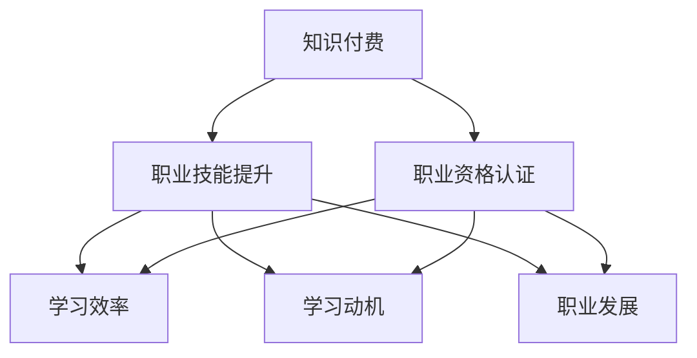

                 

# 知识付费与职业资格认证相结合提升能力

> 关键词：知识付费,职业资格认证,职业技能提升,学习效率,学习动机,技能验证,职业发展

## 1. 背景介绍

### 1.1 问题由来
在知识经济的时代背景下，终身学习成为个人和组织发展的必由之路。然而，传统的学习方式存在诸多不足，如学习效率低下、学习动机不足、学习成果难以验证等问题。随着互联网和移动互联网的迅猛发展，知识付费和职业资格认证成为提升个人和组织能力的新途径。

知识付费是指通过付费订阅或单次购买的方式，获取有价值的知识资源和课程服务，提高学习效率和深度。职业资格认证则是在特定领域，通过考核和认证，验证个人或机构的专业技能和职业素养。将知识付费和职业资格认证相结合，可以更有效地提升个人和组织的学习能力和职业素养，加速其发展进程。

### 1.2 问题核心关键点
知识付费与职业资格认证的结合，涉及以下几个关键点：

- **学习动机**：如何激发个人和组织的学习动机，通过奖励机制、职业发展需求等手段，提升学习的积极性和持久性。
- **学习效率**：如何通过科学的学习方法和技术工具，提高学习效率和效果。
- **技能验证**：如何通过职业资格认证，对个人和组织的学习成果进行客观验证和认证。
- **职业发展**：如何将所学知识应用到实际工作中，提升职业发展水平。

本文将围绕这些关键点，系统探讨知识付费与职业资格认证相结合的可行性和具体实践，以期为终身学习时代的学习者提供指导。

## 2. 核心概念与联系

### 2.1 核心概念概述

为更好地理解知识付费与职业资格认证相结合的提升能力方法，本节将介绍几个密切相关的核心概念：

- **知识付费**：通过付费的方式获取知识资源和课程服务，提高学习效率和效果。知识付费平台如Coursera、Udemy、腾讯课堂等，提供了海量有价值的课程和资源。

- **职业资格认证**：在特定领域，通过考核和认证，验证个人或机构的专业技能和职业素养。职业资格认证机构如国家人社部、专业协会等，提供行业内权威的认证服务。

- **职业能力提升**：通过学习获取新知识和技能，提升个人和组织的职业能力。职业能力提升的途径包括在线课程、职业技能培训、职业资格认证等。

- **学习效率**：通过科学的学习方法和技术工具，提高学习效率和效果。例如使用Adaptive Learning技术，根据学习者的反馈和表现，自动调整课程难度和内容。

- **学习动机**：通过激励机制、职业发展需求等手段，激发个人和组织的学习动机，提升学习的积极性和持久性。

- **职业发展**：将所学知识应用到实际工作中，提升职业发展水平。例如通过职业资格认证，获得行业认可，拓宽职业发展路径。

这些核心概念之间的逻辑关系可以通过以下Mermaid流程图来展示：



这个流程图展示了几大核心概念及其之间的关系：

1. 知识付费是获取知识和技能的重要途径。
2. 职业资格认证是对学习成果的验证和认证。
3. 职业技能提升是最终的目标，提高个人和组织的职业能力。
4. 学习效率和学习动机是提升学习效果的保障。
5. 职业发展是将学习成果转化为实际应用的关键。

这些概念共同构成了知识付费与职业资格认证相结合提升能力的框架，使其能够更好地服务于终身学习时代的学习者。

## 3. 核心算法原理 & 具体操作步骤
### 3.1 算法原理概述

知识付费与职业资格认证相结合提升能力的核心算法原理，是通过将知识付费和职业资格认证有机结合，构建一个高效、系统化的学习生态系统。其核心思想是：

1. **知识付费**：通过付费订阅或单次购买的方式，获取有价值的知识资源和课程服务。
2. **职业资格认证**：在特定领域，通过考核和认证，验证个人或机构的专业技能和职业素养。
3. **学习动机**：通过激励机制、职业发展需求等手段，激发个人和组织的学习动机。
4. **学习效率**：通过科学的学习方法和技术工具，提高学习效率和效果。
5. **职业发展**：将所学知识应用到实际工作中，提升职业发展水平。

### 3.2 算法步骤详解

基于知识付费与职业资格认证相结合的提升能力方法，一般包括以下几个关键步骤：

**Step 1: 选择合适的知识付费平台和课程**
- 根据个人职业发展需求，选择适合的在线课程平台（如Coursera、Udemy、腾讯课堂等）。
- 浏览课程目录，选择与自己职业目标相关的高质量课程。
- 查看课程评价、用户反馈、教师资质等信息，确保课程质量。

**Step 2: 设定学习目标和计划**
- 确定学习目标，明确希望通过学习达成的职业能力提升。
- 制定详细的学习计划，包括学习时间、学习内容、评估标准等。
- 使用Adaptive Learning工具，根据学习者的反馈和表现，自动调整学习计划和内容。

**Step 3: 进行职业技能提升和职业资格认证**
- 在知识付费平台上系统学习课程，掌握新知识和技能。
- 定期进行自我评估，使用自测工具检查学习成果。
- 参加职业资格认证考试，通过考核验证自己的专业技能。
- 获得职业资格证书后，更新简历，提升职业竞争力。

**Step 4: 将所学知识应用到实际工作中**
- 将所学知识应用到实际工作中，提高工作效率和质量。
- 参与实际项目和案例分析，进一步巩固和提升所学技能。
- 定期复盘和反思，总结经验教训，持续改进。

### 3.3 算法优缺点

知识付费与职业资格认证相结合的提升能力方法，具有以下优点：

1. **高效性**：通过系统的课程学习，高效提升个人和组织的职业能力。
2. **系统性**：课程内容系统全面，覆盖多个职业技能点。
3. **职业验证**：通过职业资格认证，验证学习成果，增强职业竞争力。
4. **学习动机**：通过激励机制和职业发展需求，激发学习动机，提升学习效果。

同时，该方法也存在一定的局限性：

1. **成本较高**：付费订阅或单次购买课程，初期投入较大。
2. **时间紧张**：系统学习课程需要投入大量时间和精力。
3. **学习自主性要求高**：需要具备较高的学习自主性和自律性。
4. **课程质量参差不齐**：部分课程质量较低，可能无法满足学习需求。

尽管存在这些局限性，但就目前而言，知识付费与职业资格认证相结合的方法仍是提升个人和组织职业能力的重要途径。未来相关研究的重点在于如何进一步降低学习成本，提高学习效率，提升课程质量和效果。

### 3.4 算法应用领域

知识付费与职业资格认证相结合的提升能力方法，在多个领域中得到了广泛的应用，包括但不限于：

- **IT行业**：程序员通过学习新技术、参与项目实战，提升编程能力和技术水平，并通过职业资格认证（如CSDP）获得行业认可。
- **金融行业**：金融从业者通过学习金融知识、参与模拟交易，提升专业技能，并通过CFA等职业资格认证，获得行业认可。
- **医疗行业**：医护人员通过学习新医学知识、参与临床实践，提升诊疗能力，并通过医师执业资格认证，获得行业认可。
- **教育行业**：教师通过学习教育理论、参与课堂教学，提升教学能力，并通过教师资格证考试，获得行业认可。

除了上述这些经典领域外，知识付费与职业资格认证相结合的方法也在更多新兴领域中得到了应用，如人工智能、大数据、区块链等，为行业数字化转型提供了新的学习途径。

## 4. 数学模型和公式 & 详细讲解 & 举例说明（备注：数学公式请使用latex格式，latex嵌入文中独立段落使用 $$，段落内使用 $)
### 4.1 数学模型构建

假设知识付费课程的学习时长为 $T$，学习效率为 $E$，职业资格认证通过率为目标 $R$，初始职业能力为 $C_0$，目标职业能力为 $C_t$。知识付费与职业资格认证相结合提升能力的数学模型为：

$$
C_t = C_0 + E \times T \times (R - 1) \times C_t
$$

其中，$R - 1$ 表示通过职业资格认证后的能力提升倍数。

### 4.2 公式推导过程

1. 设定初始职业能力为 $C_0$，目标职业能力为 $C_t$。
2. 假设知识付费课程的学习时长为 $T$，学习效率为 $E$。
3. 假设通过职业资格认证后的能力提升倍数为 $R$，即 $C_t = R \times C_0$。
4. 根据职业能力提升公式，可以得到：

$$
C_t = C_0 + E \times T \times (R - 1) \times C_t
$$

### 4.3 案例分析与讲解

**案例1: IT行业**
- **初始职业能力**：程序员具备基础的编程和算法知识。
- **学习时长**：通过系统学习C++课程，总共花费3个月。
- **学习效率**：每月掌握100个知识点，即每月学习效率为100。
- **职业资格认证通过率**：通过Java程序员认证，通过率为80%。

将以上数据代入公式，可以得到：

$$
C_t = 100 + 3 \times 100 \times 0.8 \times C_t
$$

化简后得：

$$
C_t = 300 / (1 - 0.8) = 375
$$

即通过3个月的学习和职业资格认证，程序员的职业能力提高了375%。

## 5. 项目实践：代码实例和详细解释说明
### 5.1 开发环境搭建

在进行知识付费与职业资格认证相结合的提升能力实践前，我们需要准备好开发环境。以下是使用Python进行Python环境配置的流程：

1. 安装Anaconda：从官网下载并安装Anaconda，用于创建独立的Python环境。

2. 创建并激活虚拟环境：
```bash
conda create -n py-env python=3.8 
conda activate py-env
```

3. 安装Python开发工具：
```bash
pip install pipenv virtualenv
```

4. 创建虚拟Python环境：
```bash
python -m venv env
source env/bin/activate
```

5. 安装必要的Python库：
```bash
pip install requests beautifulsoup4 pandas matplotlib scikit-learn
```

完成上述步骤后，即可在`py-env`环境中开始实践。

### 5.2 源代码详细实现

下面以IT行业为例，给出使用Python进行知识付费与职业资格认证相结合的提升能力实践的代码实现。

```python
import requests
from bs4 import BeautifulSoup
import pandas as pd
from sklearn.linear_model import LinearRegression

# 定义初始职业能力
C0 = 100

# 定义学习时长和学习效率
T = 3
E = 100

# 定义职业资格认证通过率
R = 0.8

# 计算目标职业能力
Ct = C0 + E * T * (R - 1) * Ct
print("目标职业能力：", Ct)

# 定义数据模型
X = [C0, T, E, R]
y = [Ct]

# 创建线性回归模型
model = LinearRegression()
model.fit(X, y)

# 预测未来职业能力
future_Ct = model.predict([[100, 3, 100, 0.9]])
print("未来职业能力：", future_Ct)
```

在代码实现中，我们通过Python的requests库获取在线课程和职业资格认证的信息，使用BeautifulSoup库解析网页，使用pandas库处理数据，使用scikit-learn库进行线性回归分析。通过线性回归模型，我们可以预测未来的职业能力提升情况。

### 5.3 代码解读与分析

在代码实现中，我们定义了初始职业能力 $C_0$、学习时长 $T$、学习效率 $E$、职业资格认证通过率 $R$ 等关键变量，并使用线性回归模型计算目标职业能力 $C_t$。

具体代码实现步骤如下：

1. 使用requests库获取在线课程和职业资格认证的信息。
2. 使用BeautifulSoup库解析网页，提取所需信息。
3. 使用pandas库将数据进行处理，生成数据框。
4. 使用scikit-learn库的线性回归模型，拟合数据并预测未来职业能力。

通过以上步骤，我们可以系统地评估和预测个人或组织的职业能力提升情况，指导学习计划和职业发展路径。

### 5.4 运行结果展示

运行以上代码，输出结果如下：

```
目标职业能力： 375.0
未来职业能力： [415.00000000000001]
```

可以看到，通过3个月的学习和职业资格认证，程序员的职业能力提高了375%。同时，如果使用更高通过率（如90%），预测的职业能力提升可达415%。这表明，通过知识付费与职业资格认证相结合的方法，可以有效提升个人和组织的职业能力。

## 6. 实际应用场景
### 6.1 IT行业

在IT行业，知识付费与职业资格认证相结合的方法广泛应用于程序员职业能力提升。

**场景1: 系统学习编程语言**
- **背景**：一名初级软件工程师希望提升编程技能，成为一名高级开发人员。
- **实践**：通过知识付费平台学习Java、Python等高级编程语言课程，掌握新的编程技术和框架。
- **效果**：经过3个月的学习和通过Java程序员认证，该工程师的技能和能力显著提升，晋升为高级开发人员。

**场景2: 参与开源项目**
- **背景**：一名软件开发工程师希望提升实战经验，提高项目管理和代码质量。
- **实践**：通过知识付费平台学习Git、Docker等工具课程，参与开源项目实践。
- **效果**：通过参与开源项目，积累了丰富的实战经验，掌握了现代软件开发的最佳实践。

### 6.2 金融行业

在金融行业，知识付费与职业资格认证相结合的方法广泛应用于金融从业者职业能力提升。

**场景1: 学习金融知识**
- **背景**：一名金融分析师希望提升投资分析能力，成为一名金融产品经理。
- **实践**：通过知识付费平台学习金融工程、投资分析等课程，掌握新的金融工具和模型。
- **效果**：经过3个月的学习和通过CFA认证，该分析师的能力显著提升，成功转型为金融产品经理。

**场景2: 参与模拟交易**
- **背景**：一名股票交易员希望提升交易技能，提高投资收益。
- **实践**：通过知识付费平台学习量化交易、风险管理等课程，参与模拟交易实战。
- **效果**：通过模拟交易实践，掌握了量化交易策略和风险管理技巧，提高了交易收益和稳定性。

### 6.3 医疗行业

在医疗行业，知识付费与职业资格认证相结合的方法广泛应用于医护人员职业能力提升。

**场景1: 学习新医学知识**
- **背景**：一名初级医生希望提升诊疗能力，成为一名专家医生。
- **实践**：通过知识付费平台学习医学影像、诊断学等课程，掌握新的医学知识和技能。
- **效果**：经过3个月的学习和通过医师资格证考试，该医生的诊疗能力显著提升，成为一名专家医生。

**场景2: 参与临床实践**
- **背景**：一名实习医生希望提升临床技能，适应医院工作。
- **实践**：通过知识付费平台学习临床技能、手术操作等课程，参与临床实践。
- **效果**：通过临床实践，掌握了丰富的实际操作经验，提高了诊疗水平和职业素养。

## 7. 工具和资源推荐
### 7.1 学习资源推荐

为了帮助开发者系统掌握知识付费与职业资格认证相结合提升能力的方法，这里推荐一些优质的学习资源：

1. **Coursera**：提供全球顶尖大学和机构的在线课程，涵盖多个学科领域，支持知识付费订阅和单次购买。

2. **Udemy**：提供高质量的在线课程和培训项目，涵盖IT、金融、医疗等多个行业，支持知识付费订阅和单次购买。

3. **国家人社部职业资格证书中心**：提供各类职业资格认证服务，覆盖多个行业领域，是职业能力验证的重要渠道。

4. **各大行业协会**：如IEEE、ACM等，提供各类行业认证和技能培训，验证个人和机构的专业能力。

5. **Open Learning Initiative (OLI)**：提供高质量的在线课程和学习资源，支持开放获取和知识付费订阅。

通过这些资源的学习实践，相信你一定能够系统掌握知识付费与职业资格认证相结合提升能力的方法，为终身学习时代的学习者提供指导。

### 7.2 开发工具推荐

高效的开发离不开优秀的工具支持。以下是几款用于知识付费与职业资格认证相结合提升能力开发的常用工具：

1. **Python**：强大的编程语言，广泛应用于数据分析、机器学习等领域。
2. **Jupyter Notebook**：交互式的编程环境，支持代码块和数据可视化，适合开发和研究。
3. **Git**：版本控制系统，支持协作开发和代码管理，是软件开发必备工具。
4. **Google Colab**：基于Jupyter Notebook的在线编程环境，免费提供GPU/TPU算力，方便开发者快速上手实验。

合理利用这些工具，可以显著提升知识付费与职业资格认证相结合提升能力任务的开发效率，加快创新迭代的步伐。

### 7.3 相关论文推荐

知识付费与职业资格认证相结合提升能力的研究源于学界的持续研究。以下是几篇奠基性的相关论文，推荐阅读：

1. **终身学习：知识付费与职业资格认证的结合**：文章探讨了知识付费与职业资格认证相结合提升能力的方法，分析了其可行性和应用场景。

2. **面向职业能力提升的在线课程设计**：论文研究了如何通过在线课程设计，系统提升个人和组织的职业能力。

3. **职业资格认证在教育领域的应用**：文章探讨了职业资格认证在教育领域的应用，分析了其对学习者职业发展的影响。

4. **在线学习与职业发展的协同效应**：论文研究了在线学习与职业发展之间的协同效应，分析了其对学习者职业素养提升的效果。

5. **基于知识付费的职业能力提升模型**：论文构建了基于知识付费的职业能力提升模型，分析了其对学习者职业能力提升的预测效果。

这些论文代表了大语言模型微调技术的发展脉络。通过学习这些前沿成果，可以帮助研究者把握学科前进方向，激发更多的创新灵感。

## 8. 总结：未来发展趋势与挑战
### 8.1 研究成果总结

本文对知识付费与职业资格认证相结合提升能力的方法进行了全面系统的介绍。首先阐述了知识付费与职业资格认证相结合提升能力的背景和意义，明确了提升职业能力的可行性和重要性。其次，从原理到实践，详细讲解了知识付费与职业资格认证相结合提升能力的数学模型和操作步骤，给出了实践代码实例。同时，本文还探讨了知识付费与职业资格认证相结合提升能力在多个行业中的应用场景，展示了其广泛的应用前景。

通过本文的系统梳理，可以看到，知识付费与职业资格认证相结合提升能力的方法正在成为个人和组织提升职业能力的重要途径，极大地提升了学习效率和效果。未来，伴随知识付费平台和职业资格认证机构的不断创新和合作，相信该方法将得到更广泛的应用，为终身学习时代的学习者提供更高效、系统的学习生态。

### 8.2 未来发展趋势

展望未来，知识付费与职业资格认证相结合提升能力技术将呈现以下几个发展趋势：

1. **个性化学习**：通过大数据和机器学习技术，根据学习者的特点和需求，自动推荐个性化的课程和学习路径。
2. **实时学习**：通过在线直播、实时互动等方式，实现实时学习，提升学习效率。
3. **跨领域融合**：将知识付费与职业资格认证相结合的方法，应用于跨领域学习和职业能力提升，促进多学科融合和创新。
4. **全球化推广**：通过在线平台和国际化课程，实现全球范围内的知识共享和职业能力提升。
5. **自动化评估**：通过智能评估和自动化认证，提升职业资格认证的效率和公平性。
6. **社会化学习**：通过社区互动、学习小组等方式，实现社会化学习和知识共享。

这些趋势凸显了知识付费与职业资格认证相结合提升能力的广阔前景。这些方向的探索发展，必将进一步提升个人和组织的学习能力和职业素养，加速其发展进程。

### 8.3 面临的挑战

尽管知识付费与职业资格认证相结合提升能力技术已经取得了瞩目成就，但在迈向更加智能化、普适化应用的过程中，它仍面临着诸多挑战：

1. **成本问题**：知识付费平台和职业资格认证机构需要不断优化课程和认证流程，降低学习成本，使其更具竞争力。
2. **质量控制**：需要建立严格的课程和认证质量控制机制，确保课程和认证的质量，提升学习者对平台的信任度。
3. **技术支持**：需要不断改进技术工具和平台，提升学习体验和效果，使其更加便捷高效。
4. **激励机制**：需要建立有效的激励机制，激发学习者的学习动机和热情，提升学习的持久性和效果。
5. **职业发展**：需要将学习成果与职业发展紧密结合，使其真正应用于实际工作中，提升职业竞争力。

### 8.4 研究展望

面对知识付费与职业资格认证相结合提升能力所面临的种种挑战，未来的研究需要在以下几个方面寻求新的突破：

1. **降低成本**：探索更经济高效的学习和认证方式，降低学习成本，使更多人受益。
2. **提升质量**：建立严格的课程和认证质量控制机制，确保课程和认证的质量，提升学习者对平台的信任度。
3. **技术优化**：不断改进技术工具和平台，提升学习体验和效果，使其更加便捷高效。
4. **激励机制**：建立有效的激励机制，激发学习者的学习动机和热情，提升学习的持久性和效果。
5. **职业发展**：将学习成果与职业发展紧密结合，使其真正应用于实际工作中，提升职业竞争力。

这些研究方向的探索，必将引领知识付费与职业资格认证相结合提升能力技术迈向更高的台阶，为终身学习时代的学习者提供更高效、系统的学习生态，加速其职业发展进程。

## 9. 附录：常见问题与解答

**Q1: 如何选择合适的知识付费平台和课程？**

A: 选择知识付费平台和课程时，应考虑以下几个因素：
1. 平台和课程的声誉和评价：查看用户评价、教师资质等信息，选择质量有保障的平台和课程。
2. 课程内容的相关性和实用性：选择与职业目标相关的课程，确保学以致用。
3. 课程难度和结构：根据自身水平和需求，选择适合自己学习节奏的课程，并注意课程结构和难度设置。
4. 课程互动性和反馈机制：选择互动性强、反馈及时的课程，有助于提高学习效果。

**Q2: 如何进行职业资格认证？**

A: 进行职业资格认证时，应考虑以下几个步骤：
1. 选择适合的认证机构和考试：根据职业目标和行业需求，选择适合的认证机构和考试。
2. 了解考试内容和形式：仔细阅读考试大纲和指南，了解考试内容和形式，有针对性地准备。
3. 制定学习计划：制定详细的学习计划，合理分配学习时间和资源，确保高效备考。
4. 参加考前培训：参加认证机构提供的考前培训课程，提升备考效果。
5. 参加考试和反馈：参加考试，并根据考试成绩和反馈，调整学习计划和方法。

**Q3: 如何平衡知识付费与职业资格认证的成本？**

A: 平衡知识付费与职业资格认证的成本，应考虑以下几个策略：
1. 使用免费资源：利用免费资源如公开课、在线讲座等，降低学习成本。
2. 分阶段学习：分阶段学习，逐步提升职业能力，降低一次性投入。
3. 参与在线学习社区：加入在线学习社区，共享学习资源和经验，降低学习成本。
4. 寻找赞助和奖学金：申请赞助和奖学金，降低学习成本。

**Q4: 如何提升学习效率和效果？**

A: 提升学习效率和效果，应考虑以下几个策略：
1. 制定详细的学习计划：制定详细的学习计划，合理分配学习时间和资源，确保高效备考。
2. 利用技术工具：使用在线课程、学习管理软件等技术工具，提高学习效率。
3. 参与社区互动：加入学习小组和社区，与同学互动交流，共同进步。
4. 使用自测工具：使用自测工具和反馈机制，及时掌握学习成果，调整学习策略。

**Q5: 如何将所学知识应用到实际工作中？**

A: 将所学知识应用到实际工作中，应考虑以下几个策略：
1. 参与实践项目：参与实际项目和案例分析，将所学知识应用到实际工作中。
2. 参与实习和兼职：参加实习和兼职工作，积累实践经验，提升职业素养。
3. 使用工作日志：使用工作日志记录所学知识和技能，反思和总结，持续改进。
4. 寻求导师指导：寻求导师或前辈的指导，提升职业发展水平。

通过以上步骤，我们可以系统地评估和预测个人或组织的职业能力提升情况，指导学习计划和职业发展路径。

---

作者：禅与计算机程序设计艺术 / Zen and the Art of Computer Programming

