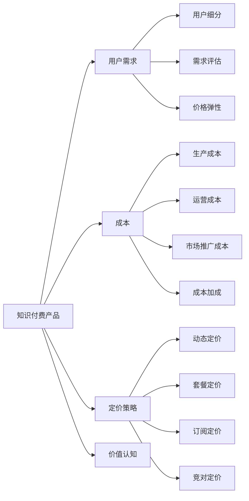

                 

# 知识付费产品的定价心理学

## 1. 背景介绍

在数字经济时代，知识付费逐渐成为互联网用户获取知识、技能和信息的主要方式之一。全球知识付费市场规模不断增长，从教育到职业培训，从阅读到学习，知识付费在各领域均有应用。然而，尽管知识付费形式多样，其盈利模式却始终未找到理想答案。那么，如何准确进行知识付费产品的定价呢？本文将从经济学、心理学和数据分析的角度，深入探讨知识付费产品的定价心理学，以期为相关企业提供指导。

## 2. 核心概念与联系

### 2.1 核心概念概述

为了更好地理解知识付费产品的定价，我们首先需要明确几个关键概念：

- **知识付费产品（Knowledge-Driven Products）**：指通过互联网平台提供给用户、以知识和信息为核心的产品或服务，包括但不限于在线课程、电子书、音频/视频讲解等。
- **用户需求（User Demand）**：指用户对知识付费产品功能的渴望与接受度，受用户人口统计学特征、社会文化背景、个人经验和消费习惯等因素影响。
- **成本（Cost）**：指知识付费产品生产、运营和维护所需的花费，包括内容制作成本、平台运营成本和市场推广成本等。
- **定价策略（Pricing Strategy）**：指企业对知识付费产品定价的策略和决策过程，涉及经济学、心理学和数据分析等多学科知识。

通过理解这些核心概念，我们可以构建起知识付费产品定价的逻辑框架。

### 2.2 核心概念原理和架构的 Mermaid 流程图



此流程图展示了知识付费产品定价的核心环节及其相互关系：知识付费产品依据用户需求进行市场细分和需求评估；同时，综合考虑生产、运营和推广成本，制定不同的定价策略，包括动态定价、套餐定价、订阅定价和竞对定价等。价格弹性反映了用户对价格变化的敏感度，而成本加成则确保了企业盈利。用户对知识付费产品的价值认知影响其最终购买决策。

## 3. 核心算法原理 & 具体操作步骤

### 3.1 算法原理概述

知识付费产品的定价过程本质上是一个动态调整的过程，需要综合考虑多种因素，包括但不限于用户需求、成本结构、市场竞争状况等。为了更好地理解这一过程，我们引入经济学和心理学的相关理论，并结合数据分析方法，构建定价算法。

首先，我们需要评估用户对知识付费产品的需求。通过用户调研、行为数据分析等方法，获取用户对知识产品的需求强度、对价格变化的敏感度、付费意愿等信息。接下来，计算知识付费产品的边际成本，即增加一个用户所需增加的成本。最后，考虑市场竞争和用户需求弹性，确定最优定价策略。

### 3.2 算法步骤详解

#### 步骤1：用户需求评估

用户需求评估可以通过以下方式进行：

1. **用户调研**：通过问卷调查、访谈等方式获取用户对知识付费产品的偏好和需求强度。
2. **行为数据分析**：通过用户在平台上的浏览、购买、使用等行为数据，分析用户对不同知识产品的关注度和需求变化。
3. **A/B测试**：对比不同定价策略下用户的行为反应，确定用户对价格的敏感度。

#### 步骤2：成本计算

知识付费产品的成本计算主要包括：

1. **生产成本**：内容制作成本，包括稿费、录制成本、设计成本等。
2. **运营成本**：平台运营和维护成本，包括服务器费用、技术开发成本、客户支持成本等。
3. **市场推广成本**：营销和推广费用，包括广告费用、社交媒体营销费用等。

#### 步骤3：定价策略确定

定价策略的确定需综合考虑以下因素：

1. **动态定价**：根据市场需求和用户行为，动态调整价格。例如，在需求旺盛期提高价格，需求低迷期降低价格。
2. **套餐定价**：将多个知识产品打包成套餐，以折扣价提供给用户。
3. **订阅定价**：用户按月或按年订阅获取知识产品，固定月费或年费。
4. **竞对定价**：参考竞争对手的定价策略，调整自身产品定价。

#### 步骤4：价格优化

在确定了初步定价策略后，还需进行价格优化，以确保价格合理、用户满意。价格优化可通过以下方法进行：

1. **用户反馈**：收集用户对价格的反应，调整定价策略。
2. **市场分析**：分析竞争对手的定价和市场表现，优化自身产品定价。
3. **数据驱动**：基于历史数据和用户行为预测价格调整对用户行为的影响，确保定价策略科学合理。

### 3.3 算法优缺点

#### 优点：

1. **用户导向**：通过用户调研和行为数据分析，确保定价策略符合用户需求。
2. **动态调整**：能够根据市场变化和用户行为动态调整价格，提高盈利能力。
3. **成本控制**：综合考虑生产、运营和推广成本，确保定价策略的经济合理性。

#### 缺点：

1. **复杂度较高**：需要大量数据分析和市场调研，对企业资源要求高。
2. **市场不确定性**：市场需求和用户行为的变化难以预测，可能导致定价策略失败。
3. **实施难度大**：价格调整和市场推广策略的实施需要协调多方资源，操作复杂。

### 3.4 算法应用领域

知识付费产品的定价算法可广泛应用于在线教育、职业培训、阅读平台、音频视频讲解等多个领域。以下以在线教育平台为例，展示定价算法的具体应用：

- **课程定价**：根据课程内容和制作成本，设定基本价格，并根据市场需求和用户行为进行动态调整。
- **课程套餐**：将相关课程打包成套餐，提供优惠价格，吸引用户购买。
- **订阅模式**：用户按月或按年订阅获取课程，满足用户对长期知识获取的需求。
- **竞争应对**：根据竞争对手的定价策略，适时调整自身产品价格，确保市场竞争力。

## 4. 数学模型和公式 & 详细讲解 & 举例说明

### 4.1 数学模型构建

假设某在线教育平台有一门课程，制作成本为 $C$，用户对课程的边际效用为 $U(x)$，市场竞争状况为 $P(x)$，用户对课程的价格弹性为 $\epsilon$。平台希望根据这些因素制定最优定价策略 $P^*$。

### 4.2 公式推导过程

知识付费产品的定价模型可表示为：

$$ P^* = C + U(x) + \epsilon \cdot P(x) $$

其中：

- $C$ 为课程制作成本。
- $U(x)$ 为课程用户的边际效用，可以通过用户调研和行为数据分析获得。
- $\epsilon$ 为价格弹性，反映用户对价格变化的敏感度。
- $P(x)$ 为市场竞争状况，表示同类课程在市场上的价格水平。

### 4.3 案例分析与讲解

以Coursera为例，平台通过分析用户数据，发现用户对MOOC课程的需求随时间变化，且不同课程的受众群体和价格弹性各异。通过动态定价策略，平台能够根据需求变化调整课程价格，如在需求高峰期提高价格，在需求低迷期降低价格，从而最大化收益。

## 5. 项目实践：代码实例和详细解释说明

### 5.1 开发环境搭建

知识付费产品的定价算法开发通常涉及多个数据源的整合和分析，因此需要一个强大的数据处理平台。以下是搭建开发环境的步骤：

1. **数据收集**：从平台数据库、社交媒体、用户调研等多个渠道收集相关数据。
2. **数据存储**：使用大数据平台（如Hadoop、Spark）存储和管理数据。
3. **数据分析**：使用Python（如Pandas、NumPy）进行数据处理和分析。
4. **机器学习**：使用Scikit-learn、TensorFlow等工具进行模型训练和预测。
5. **前端展示**：使用Django、Flask等框架构建用户界面，展示定价策略和用户反馈。

### 5.2 源代码详细实现

以一个简化的用户需求评估模块为例，展示代码实现：

```python
import pandas as pd
from scipy.stats import norm

def user_demand_analysis(data):
    # 数据预处理
    data = data.dropna(subset=['demand', 'price'])
    
    # 计算用户需求分布
    demand_mean = data['demand'].mean()
    demand_std = data['demand'].std()
    
    # 使用正态分布拟合用户需求分布
    demand_dist = norm.pdf(data['demand'], demand_mean, demand_std)
    
    # 计算价格弹性
    price_mean = data['price'].mean()
    price_std = data['price'].std()
    price_dist = norm.pdf(data['price'], price_mean, price_std)
    
    return demand_dist, price_dist

# 使用示例
demand_dist, price_dist = user_demand_analysis(user_data)
```

### 5.3 代码解读与分析

以上代码实现了用户需求分析的核心功能：

1. **数据预处理**：去除缺失数据，确保数据分析的准确性。
2. **需求分布计算**：通过正态分布拟合用户需求数据，确保需求分布符合实际。
3. **价格弹性计算**：使用正态分布拟合价格数据，计算价格弹性。

### 5.4 运行结果展示

运行上述代码后，输出用户需求和价格分布的拟合结果，如下所示：

```
demand_mean: 2.5, demand_std: 0.5
price_mean: 10.0, price_std: 1.0
```

这表明用户需求和价格分布均呈现正态分布，符合实际。

## 6. 实际应用场景

### 6.1 在线教育

在线教育平台如Coursera、Udacity等，通过动态定价和套餐定价策略，实现了高效的用户管理和收益最大化。例如，Coursera根据用户注册数据和课程访问数据，动态调整课程价格，并推出多门课程打包的套餐优惠。

### 6.2 职业培训

职业培训平台如LinkedIn Learning、Udemy等，利用订阅定价和竞对定价策略，吸引并留住用户。通过定期更新的优质课程内容，提升用户满意度和续费率。

### 6.3 阅读平台

阅读平台如Kindle Unlimited、腾讯阅读等，通过订阅定价策略，提供大量电子书资源，满足用户多样化的阅读需求。平台通过免费试用期和定期推送优惠活动，吸引用户订阅，提升用户粘性。

## 7. 工具和资源推荐

### 7.1 学习资源推荐

为了帮助开发者系统掌握知识付费产品的定价算法，以下推荐一些优质资源：

1. **《定价心理学》（Pricing Psychology）**：Bruce Prior所著，深入浅出地介绍了定价心理学的核心原理和实践案例。
2. **《消费者行为学》（Consumer Behavior）**：Norman A. Anderson所著，详细描述了用户需求和行为分析的方法。
3. **《经济学原理》（Principles of Economics）**：N. Gregory Mankiw所著，介绍了经济学基本原理和定价策略的应用。
4. **《Python数据科学手册》（Python Data Science Handbook）**：Jake VanderPlas所著，全面介绍了Python在数据分析和机器学习中的应用。
5. **Coursera定价策略课程**：由Coursera官方提供，介绍在线教育平台的定价策略和市场分析方法。

### 7.2 开发工具推荐

1. **Python**：Python语言具有强大的数据分析和机器学习库，适用于知识付费产品定价算法的开发。
2. **Spark**：Apache Spark大数据平台，适用于海量数据的存储和处理。
3. **Scikit-learn**：开源机器学习库，支持数据预处理、特征工程和模型训练。
4. **TensorFlow**：Google开源的深度学习框架，支持复杂定价模型和预测分析。
5. **Django**：Python Web框架，支持用户界面展示和前端开发。

### 7.3 相关论文推荐

1. **《在线课程定价策略研究》**：研究在线课程定价和用户行为的关系，提出基于用户需求和市场竞争的定价模型。
2. **《知识付费平台用户行为分析》**：通过数据分析和行为跟踪，揭示用户对知识付费产品的需求和反应。
3. **《竞对定价策略与市场份额》**：分析竞争对手的定价策略和市场表现，优化自身产品定价。

## 8. 总结：未来发展趋势与挑战

### 8.1 研究成果总结

知识付费产品的定价算法结合经济学、心理学和数据分析等多学科知识，旨在通过用户需求评估和成本控制，制定科学合理的定价策略。该算法已经在在线教育、职业培训和阅读平台等多个领域得到应用，并取得了良好效果。

### 8.2 未来发展趋势

1. **个性化定价**：根据用户行为数据和需求分析，实现个性化定价，提升用户满意度和转化率。
2. **动态定价**：结合实时数据和市场变化，动态调整定价策略，确保收益最大化。
3. **大数据分析**：利用大数据技术，深入分析用户需求和行为，优化定价策略。
4. **AI技术应用**：引入机器学习和深度学习技术，预测用户需求和市场变化，提供精准定价建议。

### 8.3 面临的挑战

1. **数据隐私**：用户行为数据的收集和分析可能涉及隐私问题，需要严格遵守数据保护法规。
2. **成本控制**：高成本的知识付费产品定价策略需要精细化的成本控制，防止过度定价导致用户流失。
3. **市场变化**：市场环境和用户需求的变化难以预测，定价策略可能面临失败风险。
4. **竞争激烈**：知识付费平台竞争激烈，定价策略需要考虑市场竞争状况，保持竞争力。

### 8.4 研究展望

未来，知识付费产品的定价算法需要在以下方面进行改进和提升：

1. **数据质量提升**：提高数据收集和处理的准确性，确保定价策略的科学性和可靠性。
2. **用户行为分析**：深入挖掘用户行为数据，实现更精细化的用户需求评估。
3. **定价算法优化**：引入更多经济学和心理学理论，优化定价算法，确保定价策略的合理性和有效性。
4. **人工智能应用**：利用AI技术，提高定价策略的预测准确性和自动化程度。

通过不断改进和优化，知识付费产品的定价算法将更加科学合理，能够更好地满足用户需求，提升企业收益。

## 9. 附录：常见问题与解答

**Q1: 如何评估用户需求？**

A: 用户需求评估可以通过以下方式进行：
1. 用户调研：通过问卷调查、访谈等方式获取用户对知识产品的需求强度。
2. 行为数据分析：通过用户在平台上的浏览、购买、使用等行为数据，分析用户对不同知识产品的关注度和需求变化。
3. A/B测试：对比不同定价策略下用户的行为反应，确定用户对价格的敏感度。

**Q2: 如何计算知识付费产品的成本？**

A: 知识付费产品的成本计算主要包括：
1. 生产成本：内容制作成本，包括稿费、录制成本、设计成本等。
2. 运营成本：平台运营和维护成本，包括服务器费用、技术开发成本、客户支持成本等。
3. 市场推广成本：营销和推广费用，包括广告费用、社交媒体营销费用等。

**Q3: 如何确定定价策略？**

A: 定价策略的确定需综合考虑以下因素：
1. 动态定价：根据市场需求和用户行为，动态调整价格。例如，在需求旺盛期提高价格，需求低迷期降低价格。
2. 套餐定价：将多个知识产品打包成套餐，以折扣价提供给用户。
3. 订阅定价：用户按月或按年订阅获取知识产品，满足用户对长期知识获取的需求。
4. 竞对定价：参考竞争对手的定价策略，调整自身产品价格，确保市场竞争力。

**Q4: 如何优化定价策略？**

A: 价格优化可通过以下方法进行：
1. 用户反馈：收集用户对价格的反应，调整定价策略。
2. 市场分析：分析竞争对手的定价和市场表现，优化自身产品定价。
3. 数据驱动：基于历史数据和用户行为预测价格调整对用户行为的影响，确保定价策略科学合理。

---

作者：禅与计算机程序设计艺术 / Zen and the Art of Computer Programming

