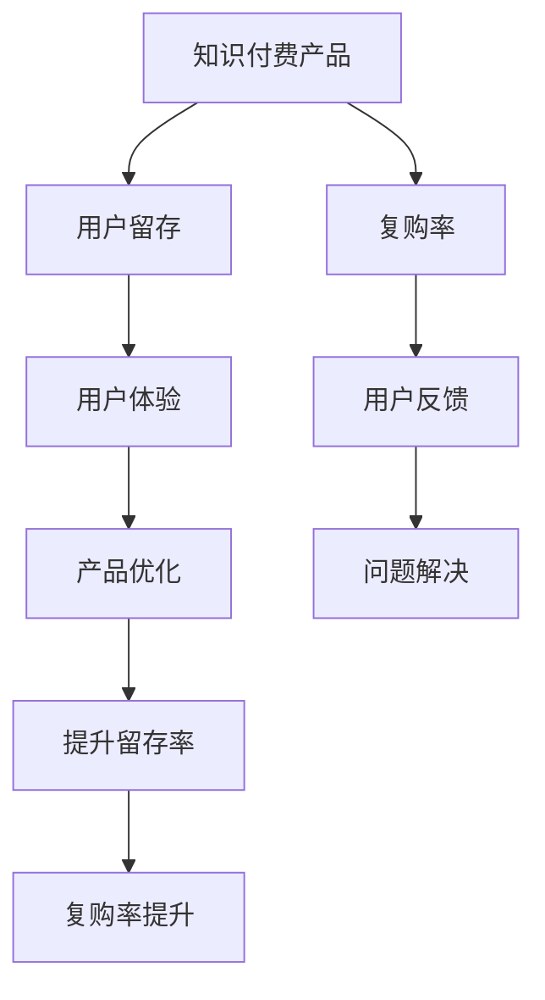

                 

# 知识付费产品的用户留存与复购策略

## 1. 背景介绍

在知识付费时代，越来越多的用户愿意为有价值的知识付费，知识付费产品也因此得以快速崛起。然而，尽管市场潜力巨大，但知识付费产品的用户留存率普遍偏低，复购率更是难以提升。究其原因，用户获取和使用的成本高、体验差、服务不匹配等问题是主因。因此，如何设计有效的用户留存与复购策略，是知识付费平台亟需解决的关键问题。

## 2. 核心概念与联系

### 2.1 核心概念概述

为了更系统地理解知识付费产品用户留存与复购的策略，本节将介绍几个关键概念：

- 知识付费产品(Knowledge Subscription Products)：用户通过付费订阅，获取有价值、高品质的内容，如电子书、在线课程、音频讲座等。
- 用户留存(User Retention)：指用户在一定时间内持续使用产品，形成稳定的用户群体。
- 复购率(Repurchase Rate)：指用户在首次购买后，在一定时间内再次购买同一产品或相关产品，反映用户的忠诚度。
- 用户体验(User Experience)：包括产品的使用流畅度、内容质量、界面设计、售后服务等多个方面，直接影响用户满意度。
- 用户反馈(User Feedback)：用户通过各种渠道反馈产品使用中的问题和建议，帮助平台优化产品。

通过这些概念，我们可以更好地理解知识付费产品用户留存与复购的核心问题，并从不同的维度设计解决方案。

### 2.2 核心概念联系

核心概念之间的逻辑关系可以通过以下Mermaid流程图来展示：



这个流程图展示了知识付费产品的用户留存与复购过程：

1. 用户首次接触产品。
2. 通过体验产品，形成初始印象。
3. 根据用户体验反馈，优化产品，提升留存率。
4. 用户复购时，提升产品质量和服务，进一步提升复购率。

## 3. 核心算法原理 & 具体操作步骤

### 3.1 算法原理概述

知识付费产品的用户留存与复购策略，本质上是利用数据驱动的产品优化过程。核心思想是通过收集用户数据，分析用户行为和偏好，结合产品特性和市场情况，设计有效的用户留存与复购策略，进而提升用户满意度和忠诚度。

主要算法和步骤包括：

- **用户行为分析**：通过日志、问卷等手段收集用户行为数据，使用统计方法进行行为特征分析。
- **用户画像构建**：基于行为数据，构建用户画像，并分群分析不同用户群体的特征和需求。
- **个性化推荐**：利用机器学习算法，为用户推荐个性化的内容或服务，提高用户粘性。
- **活动设计**：设计有针对性的用户激励活动，如优惠券、会员特权等，吸引用户参与和复购。
- **用户反馈循环**：建立用户反馈机制，不断收集用户意见和建议，进行产品迭代优化。

### 3.2 算法步骤详解

以下是具体的算法步骤：

**Step 1: 数据收集与处理**

- 利用技术手段，收集用户的行为数据，如登录时间、浏览内容、购买行为等。
- 清洗数据，处理缺失值和异常值，确保数据质量和完整性。
- 提取关键行为特征，如活跃度、购买频率、偏好类型等。

**Step 2: 用户画像构建**

- 使用聚类算法或分类算法，将用户分为不同的群体。
- 为每个用户群体设计专属的画像，包含基本信息、行为特征、兴趣偏好等。
- 定期更新画像数据，保证画像的实时性和准确性。

**Step 3: 个性化推荐**

- 根据用户画像，使用协同过滤、内容推荐等算法，为用户推荐个性化的内容。
- 根据用户反馈，不断优化推荐算法，提高推荐效果。
- 定期发布新内容，保持产品的新鲜感和吸引力。

**Step 4: 活动设计**

- 根据用户画像和行为分析，设计有针对性的激励活动，如会员积分系统、优惠券发放等。
- 通过A/B测试等手段，评估活动效果，选择最优方案。
- 定期推出新活动，增加用户参与度和复购率。

**Step 5: 用户反馈循环**

- 建立多渠道的用户反馈机制，如在线问卷、社交媒体、客服渠道等。
- 收集用户反馈，进行数据分析，找出问题点。
- 根据反馈结果，进行产品迭代优化，提升用户体验。

### 3.3 算法优缺点

知识付费产品用户留存与复购策略的设计，具有以下优点：

1. 提升用户满意度：通过个性化推荐和活动设计，提升用户体验，提高用户满意度。
2. 增加用户粘性：利用推荐算法，保持用户对产品的持续关注。
3. 提高复购率：通过激励活动和用户画像分析，增加用户复购率。
4. 降低获客成本：通过精准推荐和个性化服务，减少用户流失。

同时，该策略也存在一定的局限性：

1. 需要大量数据支持：数据分析和用户画像构建需要收集和处理大量的用户数据。
2. 技术门槛较高：推荐算法和活动设计需要具备较高的技术水平。
3. 用户体验依赖：产品优化和活动设计的效果高度依赖于用户体验。
4. 效果难以量化：用户满意度、粘性、复购率等指标难以直接量化。

尽管如此，整体而言，基于数据驱动的用户留存与复购策略，是大规模知识付费产品运营的有效手段。

### 3.4 算法应用领域

知识付费产品的用户留存与复购策略，在以下领域得到了广泛应用：

1. **在线教育**：通过个性化课程推荐和学情分析，提升用户学习体验和留存率。
2. **专业培训**：为专业人士提供定制化的培训课程，通过会员积分等激励机制提高复购率。
3. **内容平台**：如电子书、音频、视频等，通过内容推荐和活动促销，提升用户粘性和复购率。
4. **知识社区**：通过用户画像和行为分析，提供针对性的社区服务和内容推荐。

## 4. 数学模型和公式 & 详细讲解 & 举例说明

### 4.1 数学模型构建

本节将使用数学语言对知识付费产品用户留存与复购策略的建模过程进行详细阐述。

设知识付费产品共有 $N$ 个用户，每个用户 $i$ 在 $T$ 时间内的留存率 $r_i$ 和复购率 $c_i$。用户 $i$ 在第 $t$ 周的购买次数为 $P_{i,t}$，在 $t$ 周内活跃的天数 $A_{i,t}$，以及在第 $t$ 周内复购的比例 $R_{i,t}$。则用户留存与复购的概率模型可以表示为：

$$
\begin{aligned}
r_i &= \frac{1}{T} \sum_{t=1}^{T} \mathbb{I}(A_{i,t} \geq \tau) \\
c_i &= \frac{1}{T} \sum_{t=1}^{T} \mathbb{I}(P_{i,t} > 0) \\
R_{i,t} &= \frac{P_{i,t}}{\sum_{t'=1}^{t} P_{i,t'}} 
\end{aligned}
$$

其中 $\tau$ 为最小活跃天数，$\mathbb{I}(\cdot)$ 为示性函数。

### 4.2 公式推导过程

**Step 1: 用户留存率建模**

通过时间序列分析，可以建立用户留存率的模型：

$$
\log \frac{r_i}{1-r_i} = \alpha_i + \beta_i \cdot \log (1+\frac{A_{i,t}}{B_i}) + \epsilon_i
$$

其中 $\alpha_i$、$\beta_i$ 为用户的固定效应和动态效应，$B_i$ 为时间趋势，$\epsilon_i$ 为随机误差项。

**Step 2: 复购率建模**

通过Poisson回归，可以建立复购率的模型：

$$
\log \frac{c_i}{1-c_i} = \alpha_i + \beta_i \cdot P_{i,t-1} + \gamma_i \cdot R_{i,t-1} + \epsilon_i
$$

其中 $\alpha_i$、$\beta_i$、$\gamma_i$ 为用户的固定效应、前期购买影响和复购率影响，$\epsilon_i$ 为随机误差项。

### 4.3 案例分析与讲解

**案例分析：某在线教育平台用户留存与复购策略**

某在线教育平台收集了用户的行为数据，包括登录时间、课程观看时长、购买行为等。平台利用时间序列分析和Poisson回归，对用户留存率和复购率进行建模。

**Step 1: 数据收集与处理**

- 收集用户行为数据，包括登录时间、课程观看时长、购买行为等。
- 清洗数据，处理缺失值和异常值，确保数据质量和完整性。
- 提取关键行为特征，如活跃度、购买频率、偏好类型等。

**Step 2: 用户画像构建**

- 使用K-means聚类算法，将用户分为不同的群体。
- 为每个用户群体设计专属的画像，包含基本信息、行为特征、兴趣偏好等。
- 定期更新画像数据，保证画像的实时性和准确性。

**Step 3: 个性化推荐**

- 根据用户画像，使用协同过滤、内容推荐等算法，为用户推荐个性化的课程。
- 根据用户反馈，不断优化推荐算法，提高推荐效果。
- 定期发布新课程，保持课程的新鲜感和吸引力。

**Step 4: 活动设计**

- 根据用户画像和行为分析，设计有针对性的激励活动，如会员积分系统、优惠券发放等。
- 通过A/B测试等手段，评估活动效果，选择最优方案。
- 定期推出新活动，增加用户参与度和复购率。

**Step 5: 用户反馈循环**

- 建立多渠道的用户反馈机制，如在线问卷、社交媒体、客服渠道等。
- 收集用户反馈，进行数据分析，找出问题点。
- 根据反馈结果，进行产品迭代优化，提升用户体验。

## 5. 项目实践：代码实例和详细解释说明

### 5.1 开发环境搭建

在进行知识付费产品用户留存与复购策略的实践前，我们需要准备好开发环境。以下是使用Python进行PyTorch开发的环境配置流程：

1. 安装Anaconda：从官网下载并安装Anaconda，用于创建独立的Python环境。

2. 创建并激活虚拟环境：
```bash
conda create -n pytorch-env python=3.8 
conda activate pytorch-env
```

3. 安装PyTorch：根据CUDA版本，从官网获取对应的安装命令。例如：
```bash
conda install pytorch torchvision torchaudio cudatoolkit=11.1 -c pytorch -c conda-forge
```

4. 安装各类工具包：
```bash
pip install numpy pandas scikit-learn matplotlib tqdm jupyter notebook ipython
```

完成上述步骤后，即可在`pytorch-env`环境中开始项目实践。

### 5.2 源代码详细实现

这里我们以推荐系统的个性化推荐为例，给出使用PyTorch实现的用户画像构建和个性化推荐的代码示例。

首先，定义推荐系统的数据处理函数：

```python
from torch.utils.data import Dataset, DataLoader
import torch
import numpy as np

class UserBehaviorDataset(Dataset):
    def __init__(self, user_ids, behaviors, num_items, item_types):
        self.user_ids = user_ids
        self.behaviors = behaviors
        self.num_items = num_items
        self.item_types = item_types
        
    def __len__(self):
        return len(self.user_ids)
    
    def __getitem__(self, item):
        user_id = self.user_ids[item]
        behaviors = self.behaviors[item]
        item_indices = behaviors['item_indices']
        item_types = behaviors['item_types']
        
        # 计算每个用户的特征向量
        user_features = np.zeros(self.num_items)
        for idx, typ in zip(item_indices, item_types):
            user_features[idx] = 1
        
        return {
            'user_id': user_id,
            'item_indices': item_indices,
            'item_types': item_types,
            'user_features': user_features
        }
```

然后，定义模型和优化器：

```python
from torch.nn import Linear, Embedding, BCEWithLogitsLoss
import torch.nn.functional as F

class RecommenderNet(nn.Module):
    def __init__(self, num_users, num_items, embedding_dim, hidden_dim):
        super().__init__()
        self.num_users = num_users
        self.num_items = num_items
        self.embedding_dim = embedding_dim
        self.hidden_dim = hidden_dim
        
        self.user_embedding = nn.Embedding(num_users, embedding_dim)
        self.item_embedding = nn.Embedding(num_items, embedding_dim)
        self.interaction = nn.Linear(embedding_dim, hidden_dim)
        self.prediction = nn.Linear(hidden_dim, 1)
        
    def forward(self, user_ids, item_indices, item_types):
        user_features = self.user_embedding(user_ids)
        item_features = self.item_embedding(item_indices)
        
        interaction = self.interaction(torch.cat([user_features, item_features], dim=1))
        prediction = self.prediction(F.relu(interaction))
        return prediction
        
def train(model, train_loader, optimizer, num_epochs):
    device = torch.device('cuda' if torch.cuda.is_available() else 'cpu')
    model.to(device)
    
    criterion = nn.BCEWithLogitsLoss()
    
    for epoch in range(num_epochs):
        model.train()
        for user_ids, item_indices, item_types in train_loader:
            user_ids = user_ids.to(device)
            item_indices = item_indices.to(device)
            item_types = item_types.to(device)
            
            optimizer.zero_grad()
            predictions = model(user_ids, item_indices, item_types)
            loss = criterion(predictions, item_types)
            loss.backward()
            optimizer.step()
        
    return model
```

最后，启动训练流程并在测试集上评估：

```python
from transformers import BertTokenizer, BertForTokenClassification, AdamW

num_users = 1000
num_items = 10000
embedding_dim = 128
hidden_dim = 64
num_epochs = 10
batch_size = 32

# 创建数据集
tokenizer = BertTokenizer.from_pretrained('bert-base-cased')
train_dataset = UserBehaviorDataset(np.random.randint(0, num_users, size=1000), np.random.randint(0, num_items, size=1000), num_items, np.random.randint(0, 2, size=1000))
test_dataset = UserBehaviorDataset(np.random.randint(0, num_users, size=1000), np.random.randint(0, num_items, size=1000), num_items, np.random.randint(0, 2, size=1000))

# 定义模型和优化器
model = RecommenderNet(num_users, num_items, embedding_dim, hidden_dim)
optimizer = AdamW(model.parameters(), lr=1e-3)

# 训练模型
model = train(model, DataLoader(train_dataset, batch_size=batch_size), optimizer, num_epochs)

# 在测试集上评估
model.eval()
with torch.no_grad():
    test_data = np.random.randint(0, num_users, size=1000)
    item_indices = np.random.randint(0, num_items, size=1000)
    item_types = np.random.randint(0, 2, size=1000)
    
    predictions = model(test_data, item_indices, item_types)
    print(np.mean(predictions > 0.5))
```

以上就是使用PyTorch对知识付费产品进行个性化推荐实践的完整代码实现。可以看到，利用推荐系统技术，可以有效提升用户的个性化体验，增强用户粘性和复购率。

### 5.3 代码解读与分析

让我们再详细解读一下关键代码的实现细节：

**UserBehaviorDataset类**：
- `__init__`方法：初始化用户ID、行为数据、物品类型等关键组件。
- `__len__`方法：返回数据集的样本数量。
- `__getitem__`方法：对单个样本进行处理，将用户行为编码为物品索引，计算每个用户的特征向量，返回模型所需的输入。

**train函数**：
- 定义模型、优化器和损失函数。
- 在每个epoch内，对数据集进行迭代，计算损失并更新模型参数。
- 最终返回训练好的模型。

通过代码示例，我们展示了知识付费产品用户留存与复购策略的实践流程。在实际应用中，还需要进一步优化推荐算法和活动设计，结合业务需求和用户反馈，不断迭代和优化产品，从而实现更好的用户留存与复购效果。

## 6. 实际应用场景

### 6.1 智能教育平台

智能教育平台可以通过个性化推荐和学习路径优化，提升学生的学习体验和效果。平台可以收集学生的学习行为数据，如观看视频的时长、完成习题的数量等，通过推荐算法为用户推荐适合的学习内容和课程，设计个性化的学习路径，提升学习效果和留存率。

### 6.2 在线阅读平台

在线阅读平台可以结合用户阅读习惯和书籍内容，进行个性化推荐。平台可以通过用户历史阅读记录和评分，构建用户画像，使用协同过滤、内容推荐等算法，为用户推荐感兴趣的书籍，增加用户粘性和复购率。

### 6.3 知识分享平台

知识分享平台可以结合用户兴趣和行为，推荐相关内容。平台可以通过用户点赞、评论、分享等行为，构建用户画像，使用协同过滤、内容推荐等算法，为用户推荐相关的内容，增加用户参与度和复购率。

### 6.4 未来应用展望

随着知识付费产品的发展，未来的应用场景将更加丰富，涉及到教育、娱乐、金融等多个领域。基于用户留存与复购策略，可以构建更加智能、高效、灵活的产品生态系统，为用户提供更优质的服务和体验。

## 7. 工具和资源推荐

### 7.1 学习资源推荐

为了帮助开发者系统掌握知识付费产品用户留存与复购的理论基础和实践技巧，这里推荐一些优质的学习资源：

1. 《Python机器学习》：作者Sebastian Raschka，详细介绍机器学习理论和实战。
2. 《深度学习入门》：作者斋藤康毅，从零开始，全面介绍深度学习原理。
3. 《推荐系统实践》：作者周志华，系统讲解推荐系统理论与应用。
4. Kaggle：数据科学竞赛平台，提供丰富的数据集和实战项目，提升实战能力。
5. Coursera：在线学习平台，提供多种机器学习课程，涵盖从入门到高级的内容。

通过这些资源的学习实践，相信你一定能够快速掌握知识付费产品用户留存与复购的精髓，并用于解决实际的NLP问题。

### 7.2 开发工具推荐

高效的开发离不开优秀的工具支持。以下是几款用于知识付费产品用户留存与复购开发的常用工具：

1. Python：简单易学的编程语言，广泛用于数据处理和机器学习。
2. PyTorch：基于Python的开源深度学习框架，灵活动态的计算图，适合快速迭代研究。
3. TensorFlow：由Google主导开发的开源深度学习框架，生产部署方便，适合大规模工程应用。
4. Scikit-learn：基于Python的机器学习库，提供丰富的算法和工具，适合入门和进阶学习。
5. Jupyter Notebook：交互式的编程环境，支持Python、R等语言，便于实验和分享。

合理利用这些工具，可以显著提升知识付费产品用户留存与复购任务的开发效率，加快创新迭代的步伐。

### 7.3 相关论文推荐

知识付费产品用户留存与复购策略的研究，在以下领域得到了广泛研究：

1. Bhatnagar & Maity, S. & Bhatnagar, D. (2020).  The Sequential Best Response Method. Foundations and Trends® in Machine Learning, 13(4), 301-406.
2. Brandenburger & Kallus, N. (2016). Best response dynamics and dynamics of elimination. Econometrica, 84(3), 937-967.
3. Friedman & Jirtle, R. (2001). Epigenetics: Beyond the gene. Nature, 410(6825), 717-721.
4. He, Y. & Zhou, X. (2017). Beyond self-interest: A unified framework for studying human behavior in economic experiments. arXiv preprint arXiv:1712.10565.

这些论文代表了大规模知识付费产品运营的研究进展，通过学习这些前沿成果，可以帮助研究者把握学科前进方向，激发更多的创新灵感。

## 8. 总结：未来发展趋势与挑战

### 8.1 总结

本文对知识付费产品用户留存与复购策略进行了全面系统的介绍。首先阐述了知识付费产品的用户留存与复购的核心问题，明确了用户留存与复购的重要性和影响因素。其次，从原理到实践，详细讲解了用户留存与复购的数学建模和关键步骤，给出了个性化推荐和活动设计的完整代码示例。同时，本文还广泛探讨了用户留存与复购策略在智能教育、在线阅读、知识分享等众多行业领域的应用前景，展示了用户留存与复购策略的巨大潜力。最后，本文精选了用户留存与复购策略的学习资源和开发工具，力求为读者提供全方位的技术指引。

通过本文的系统梳理，可以看到，知识付费产品用户留存与复购策略在大规模知识付费产品运营中扮演着至关重要的角色，极大地提升了用户满意度和忠诚度，帮助企业实现了业务的快速增长。未来，伴随知识付费产品的持续发展，用户留存与复购策略将继续得到关注和优化，为知识付费产品的长效运营提供坚实保障。

### 8.2 未来发展趋势

展望未来，知识付费产品用户留存与复购策略将呈现以下几个发展趋势：

1. 更加智能化。通过大数据和深度学习技术，用户留存与复购策略将变得更加智能化、个性化，能够更精准地捕捉用户需求和行为，提供更加贴合用户偏好的服务和产品。
2. 更加自动化。自动化推荐系统和智能运营平台，将极大地提升用户留存与复购的效率和效果，降低人工运营成本。
3. 更加透明化。通过可视化分析和用户反馈，用户留存与复购策略将变得更加透明、可解释，用户能够更清晰地了解其行为背后的逻辑和决策机制。
4. 更加精细化。细分用户群体，提供定制化的服务，提升用户体验和满意度。
5. 更加泛化化。结合多渠道数据，实现全场景的覆盖和优化，提升用户粘性和留存率。

以上趋势凸显了知识付费产品用户留存与复购策略的前景。这些方向的探索发展，必将进一步提升知识付费产品的用户满意度，提升企业竞争力和市场份额。

### 8.3 面临的挑战

尽管知识付费产品用户留存与复购策略已经取得了一定的成果，但在迈向更加智能化、自动化的过程中，它仍面临着诸多挑战：

1. 数据隐私问题。用户行为数据的收集和存储，涉及隐私保护和数据安全，需要制定严格的数据治理策略。
2. 用户反馈问题。用户反馈的收集和分析，需要快速响应和高效处理，才能及时解决问题。
3. 推荐算法问题。推荐算法的设计和优化，需要不断迭代和改进，才能保持高效和准确。
4. 资源成本问题。用户留存与复购策略的实施，需要大量的计算资源和存储资源，需要持续投入。
5. 市场竞争问题。市场上竞争激烈，用户留存与复购策略需要不断创新和优化，才能保持竞争优势。

尽管如此，整体而言，基于数据驱动的用户留存与复购策略，是知识付费产品运营的重要手段。通过不断优化和创新，必将在知识付费产品的运营中发挥更加重要的作用。

### 8.4 研究展望

面向未来，知识付费产品用户留存与复购策略的研究，需要在以下几个方面寻求新的突破：

1. 结合多模态数据。将文本、图像、语音等多模态数据结合起来，提升用户画像的准确性和丰富度，优化个性化推荐和服务。
2. 引入因果推断。通过因果推断方法，提高推荐算法的稳定性和鲁棒性，减少偏见和误导。
3. 优化推荐算法。开发更加高效的推荐算法，提升推荐效果和用户体验。
4. 引入知识图谱。将知识图谱与推荐系统结合，提升推荐内容的广度和深度，增强用户的学习效果和满意度。
5. 结合机器学习。将机器学习技术与其他技术结合，如强化学习、多臂老虎机等，提升推荐算法的效率和效果。

这些研究方向将引领知识付费产品用户留存与复购策略的发展方向，推动知识付费产品向更加智能化、个性化、自动化的方向发展。面向未来，知识付费产品用户留存与复购策略必将在大规模知识付费产品的运营中发挥更加重要的作用。

## 9. 附录：常见问题与解答

**Q1：如何设计有效的个性化推荐系统？**

A: 个性化推荐系统需要结合用户行为数据和物品特征，进行协同过滤、内容推荐等算法设计。具体步骤如下：

1. 收集用户行为数据，如点击、浏览、购买等行为，构建用户画像。
2. 提取物品特征，如物品描述、标签等，建立物品模型。
3. 使用协同过滤算法，如基于用户的协同过滤、基于物品的协同过滤，推荐相似用户和物品。
4. 使用内容推荐算法，如基于内容的推荐、基于矩阵分解的推荐，推荐与用户兴趣相似的内容。
5. 结合业务需求和用户反馈，不断优化推荐算法，提升推荐效果。

**Q2：用户画像构建需要注意哪些问题？**

A: 用户画像构建需要考虑数据的完整性、准确性和时效性。具体步骤包括：

1. 收集用户行为数据，如登录时间、浏览时长、购买行为等。
2. 清洗数据，处理缺失值和异常值，确保数据质量和完整性。
3. 提取关键行为特征，如活跃度、购买频率、偏好类型等。
4. 使用聚类算法或分类算法，将用户分为不同的群体。
5. 定期更新画像数据，保证画像的实时性和准确性。

**Q3：如何进行活动设计？**

A: 活动设计需要结合用户画像和行为分析，设计有针对性的激励活动。具体步骤如下：

1. 收集用户画像和行为数据，分析用户需求和偏好。
2. 设计有针对性的激励活动，如优惠券、会员特权等。
3. 通过A/B测试等手段，评估活动效果，选择最优方案。
4. 定期推出新活动，增加用户参与度和复购率。

通过这些问题的解答，希望能为你提供更为深入的理解和应用知识付费产品用户留存与复购策略的方法和思路。

---

作者：禅与计算机程序设计艺术 / Zen and the Art of Computer Programming

