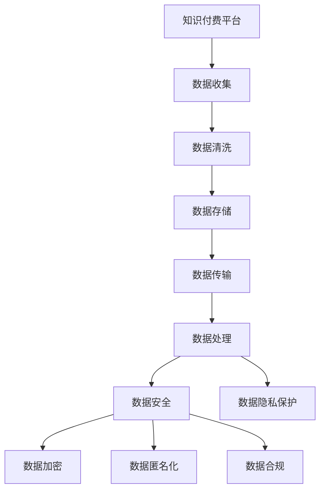

                 

# 知识付费内容的数据安全与隐私保护

> 关键词：知识付费,数据安全,隐私保护,人工智能,机器学习,数据加密,数据匿名化,数据合规

## 1. 背景介绍

### 1.1 问题由来
随着互联网和移动设备的普及，知识付费内容成为越来越多人的选择。这类内容不仅包含了学习提升的各类课程，还包括专家分享的行业见解、投资策略、心理健康咨询等。知识付费平台通过内容聚合、订阅推荐等方式，为消费者提供更加丰富、多元、个性化的知识获取途径，极大地丰富了学习资源。然而，伴随着知识付费内容需求的增加，其数据安全和隐私保护问题也日益凸显，甚至成为平台发展的瓶颈。

### 1.2 问题核心关键点
知识付费平台的核心业务依赖于丰富的知识资源库和个性化推荐算法。为了提供高质量的推荐服务，平台需要收集并分析用户的浏览、购买、搜索、互动等行为数据。但同时，数据安全和隐私保护问题也带来了巨大挑战。

数据安全和隐私保护的核心问题包括：
1. 如何防止数据泄露，避免用户隐私信息被非法获取和利用。
2. 如何在数据收集、存储、传输和处理等环节中，保证数据不被恶意篡改或破坏。
3. 如何规范数据使用，保证数据处理过程中的透明性和合法性。

数据安全和隐私保护是知识付费平台必须认真对待的重要问题。良好的数据管理和隐私保护措施，不仅能赢得用户的信任，也能为平台的长期健康发展奠定坚实基础。

## 2. 核心概念与联系

### 2.1 核心概念概述

为更好地理解知识付费内容的数据安全与隐私保护，本节将介绍几个密切相关的核心概念：

- 知识付费平台(Knowledge Subscription Platform, KSP)：提供在线课程、文章、讲座等付费内容的平台，如得到、喜马拉雅、网易云课堂等。
- 数据安全(Data Security)：防止数据被非法获取、使用、篡改和破坏的过程和措施。
- 数据隐私保护(Data Privacy Protection)：保护数据主体在数据处理中的知情权、选择权、控制权，确保数据处理透明和合法。
- 人工智能(Artificial Intelligence, AI)：通过机器学习、深度学习等技术，自动化分析和处理海量数据，为个性化推荐提供基础支持。
- 数据加密(Data Encryption)：通过对数据进行加密，确保数据在存储和传输过程中不被窃取或篡改。
- 数据匿名化(Data Anonymization)：通过技术手段去除数据中的个人标识信息，降低数据泄露的风险。
- 数据合规(Data Compliance)：在数据处理过程中，遵守相关法律法规和行业标准，确保数据处理透明和合法。

这些核心概念之间的逻辑关系可以通过以下Mermaid流程图来展示：



这个流程图展示了知识付费平台在数据管理和隐私保护的关键环节及其相关措施。

## 3. 核心算法原理 & 具体操作步骤
### 3.1 算法原理概述

知识付费平台的数据安全和隐私保护，本质上是数据管理和隐私保护问题的处理。其核心思想是：在数据收集、存储、传输和处理等各个环节，通过合理的技术和管理措施，确保数据的机密性、完整性和可用性。

数据安全和隐私保护的算法原理主要包括以下几个方面：

1. **数据加密**：通过加密算法，将数据转换为不可读的形式，确保数据在传输和存储过程中不被非法获取或篡改。

2. **数据匿名化**：通过对数据进行去标识处理，去除或掩盖个人身份信息，减少数据泄露风险。

3. **数据访问控制**：通过访问控制列表(ACL)、角色权限分配等手段，确保只有授权用户才能访问敏感数据。

4. **数据合规性检查**：在数据处理过程中，检查是否遵守相关法律法规和行业标准，如GDPR、CCPA等。

5. **安全审计**：定期进行安全审计，检查数据管理和隐私保护措施的有效性和完整性，及时发现和修复潜在的安全漏洞。

6. **数据备份与恢复**：定期备份关键数据，以防数据丢失或损坏，并保证在数据意外删除或被破坏时，能够迅速恢复数据。

### 3.2 算法步骤详解

基于上述核心算法原理，知识付费平台的数据安全和隐私保护通常包括以下关键步骤：

**Step 1: 数据收集与清洗**
- 收集用户行为数据，如浏览历史、购买记录、互动评论等。
- 对收集的数据进行清洗，去除无关或重复信息，减少噪音干扰。

**Step 2: 数据存储与备份**
- 对清洗后的数据进行加密和匿名化处理，确保数据在存储和备份过程中不泄露敏感信息。
- 定期备份关键数据，并采用冗余存储技术，以防数据丢失。

**Step 3: 数据传输与加密**
- 在数据传输过程中，采用SSL/TLS等协议进行加密，确保数据在传输过程中不被窃听或篡改。
- 对于存储在云平台的数据，采用端到端加密技术，确保数据即使被非法获取，也无法解密使用。

**Step 4: 数据访问控制与权限管理**
- 根据用户的角色和权限，分配不同的数据访问权限，确保只有授权用户才能访问敏感数据。
- 通过审计日志记录数据访问记录，及时发现和预防异常访问行为。

**Step 5: 数据处理与合规性检查**
- 在数据处理过程中，确保遵守相关法律法规和行业标准，如GDPR、CCPA等。
- 定期进行合规性检查，确保数据处理透明和合法。

**Step 6: 安全审计与漏洞修复**
- 定期进行安全审计，检查数据管理和隐私保护措施的有效性和完整性。
- 及时发现和修复潜在的安全漏洞，避免数据泄露和滥用。

### 3.3 算法优缺点

知识付费平台的数据安全和隐私保护算法，具有以下优点：
1. 保障用户数据安全。通过数据加密和匿名化处理，有效保护用户隐私，防止数据泄露和滥用。
2. 提升平台信任度。良好的数据管理和隐私保护措施，能赢得用户信任，提升平台的用户粘性和忠诚度。
3. 防范法律风险。遵守相关法律法规和行业标准，避免因数据处理不当引发的法律纠纷和处罚。

同时，该算法也存在一定的局限性：
1. 技术和资源投入大。实现上述数据安全和隐私保护措施，需要大量的技术和资源投入，增加了平台运营成本。
2. 难以应对新兴威胁。随着攻击手段和技术的不断更新，现有的数据安全和隐私保护措施可能无法有效应对新的安全威胁。
3. 数据合规难度高。不同国家和地区的法律法规和行业标准存在差异，平台需要在多个地区运营，保证数据处理符合各地法律法规，增加了合规难度。

尽管存在这些局限性，但目前这些数据安全和隐私保护措施仍是知识付费平台必须遵守的基础保障。未来相关研究的重点在于如何进一步提升数据安全和隐私保护的效果，同时降低技术和管理成本，提升数据使用的便利性和灵活性。

### 3.4 算法应用领域

知识付费平台的数据安全和隐私保护算法，主要应用于以下领域：

1. **用户行为分析**：通过收集和分析用户的浏览、购买、搜索、互动等行为数据，为用户提供个性化推荐服务。
2. **内容推荐系统**：根据用户的行为数据，推荐相关课程和文章，提升用户满意度和平台收入。
3. **客户服务与支持**：提供智能客服和支持系统，通过用户互动数据进行问题分析和解答，提升用户服务体验。
4. **内容版权保护**：通过加密和水印技术，保护课程内容不被非法复制和传播，维护平台知识产权。
5. **风险管理与防范**：检测和防范数据泄露、恶意攻击等风险，确保平台和用户数据安全。

## 4. 数学模型和公式 & 详细讲解 & 举例说明
### 4.1 数学模型构建

本节将使用数学语言对知识付费平台的数据安全和隐私保护过程进行更加严格的刻画。

设知识付费平台收集到的用户行为数据集为 $D=\{(x_i,y_i)\}_{i=1}^N$，其中 $x_i$ 为用户行为数据，$y_i$ 为行为标签（如购买、浏览等）。

定义加密函数为 $E(\cdot)$，匿名化函数为 $A(\cdot)$，访问控制函数为 $AC(\cdot)$，合规性检查函数为 $C(\cdot)$，安全审计函数为 $SA(\cdot)$，数据备份函数为 $B(\cdot)$。则知识付费平台的数据安全和隐私保护模型可以表示为：

$$
\begin{aligned}
D' &= A(E(D)) \\
D'' &= AC(D') \\
C(D'') &= \text{True} \\
SA(D'') &= \text{True} \\
B(D'') &= \text{True}
\end{aligned}
$$

其中 $D'$ 为加密和匿名化后的数据，$D''$ 为访问控制后的数据，$C(D'')$ 和 $SA(D'')$ 分别表示数据处理过程中是否符合合规性和安全审计要求，$B(D'')$ 表示数据备份是否成功。

### 4.2 公式推导过程

以下我们以用户行为数据加密为例，推导加密函数 $E(\cdot)$ 和解密函数 $D(\cdot)$ 的计算公式。

假设用户行为数据 $x$ 包含敏感信息 $s$，则加密函数定义为：

$$
E(x) = F_{enc}(x, k)
$$

其中 $F_{enc}$ 为加密算法，$k$ 为加密密钥。解密函数定义为：

$$
D(x) = F_{dec}(E(x), k) = x
$$

其中 $F_{dec}$ 为解密算法，$k$ 为解密密钥。

在实际应用中，可以使用AES、RSA等成熟的加密算法进行加密和解密，确保数据的机密性和完整性。

### 4.3 案例分析与讲解

**案例1: 用户行为数据加密**

假设某知识付费平台收集的用户浏览历史数据为 $x=[历史1, 历史2, ..., 历史N]$，其中 $历史i$ 表示用户第 $i$ 次浏览的课程ID和访问时间。

在加密过程中，可以采用AES算法对 $x$ 进行加密，得到加密后的数据 $x'$：

$$
x' = E(x, k) = F_{AES}(x, k)
$$

其中 $F_{AES}$ 为AES算法，$k$ 为AES加密密钥。

在解密过程中，可以通过解密函数 $D(x, k)$ 将 $x'$ 还原为 $x$：

$$
x = D(x', k) = F_{AES}^{-1}(x', k)
$$

其中 $F_{AES}^{-1}$ 为AES解密算法，$k$ 为AES解密密钥。

**案例2: 数据匿名化**

假设某知识付费平台收集的用户购买记录为 $x=[课程ID, 用户ID, 购买时间]$，其中 $用户ID$ 包含敏感信息。

在数据匿名化过程中，可以采用K-匿名化算法对 $x$ 进行处理，得到匿名化后的数据 $x'$：

$$
x' = A(x) = \{\text{购买ID}_1, \text{课程ID}_1, \text{购买时间}_1, \text{用户ID}_1, \text{购买ID}_2, \text{课程ID}_2, \text{购买时间}_2, \text{用户ID}_2, ..., \text{购买ID}_k, \text{课程ID}_k, \text{购买时间}_k, \text{用户ID}_k\}
$$

其中 $\text{购买ID}_i$ 表示第 $i$ 次购买的用户ID，$\text{用户ID}_i$ 替换为随机生成的用户ID，确保数据不可识别。

## 5. 项目实践：代码实例和详细解释说明
### 5.1 开发环境搭建

在进行数据安全和隐私保护实践前，我们需要准备好开发环境。以下是使用Python进行加密和匿名化处理的开发环境配置流程：

1. 安装Anaconda：从官网下载并安装Anaconda，用于创建独立的Python环境。

2. 创建并激活虚拟环境：
```bash
conda create -n security-env python=3.8 
conda activate security-env
```

3. 安装必要的Python包：
```bash
pip install pyaes cryptography pandas numpy
```

完成上述步骤后，即可在`security-env`环境中开始开发。

### 5.2 源代码详细实现

下面以用户行为数据加密和匿名化为例，给出使用Python进行数据处理和加密的代码实现。

```python
from Crypto.Cipher import AES
import base64
import random
from Crypto.Hash import HMAC, SHA256
import pandas as pd

# 定义加密函数
def encrypt_data(data, key):
    iv = b'16-byte-iv'
    cipher = AES.new(key, AES.MODE_CBC, iv)
    encrypted_data = cipher.encrypt(data)
    return base64.b64encode(encrypted_data).decode()

# 定义解密函数
def decrypt_data(encrypted_data, key):
    iv = b'16-byte-iv'
    cipher = AES.new(key, AES.MODE_CBC, iv)
    decrypted_data = cipher.decrypt(base64.b64decode(encrypted_data))
    return decrypted_data

# 定义数据匿名化函数
def anonymize_data(data, num_users):
    data['user_id'] = [random.randint(1, num_users) for _ in range(len(data))]
    return data

# 示例数据
data = {'user_id': [1, 2, 3, 4, 5],
        'course_id': ['C001', 'C002', 'C003', 'C004', 'C005'],
        'purchase_time': ['2022-01-01', '2022-01-02', '2022-01-03', '2022-01-04', '2022-01-05']}

# 数据加密
key = b'This is my secret key'
encrypted_data = encrypt_data(data, key)

# 数据匿名化
num_users = 10000
anonymized_data = anonymize_data(data, num_users)

# 输出加密和匿名化后的数据
print("原始数据：\n", data)
print("加密后的数据：\n", encrypted_data)
print("匿名化后的数据：\n", anonymized_data)
```

在这个代码示例中，我们首先定义了加密和解密函数，使用AES算法对用户行为数据进行加密和解密。然后，定义了数据匿名化函数，通过随机生成用户ID，对原始数据进行匿名化处理。最后，将原始数据、加密后的数据和匿名化后的数据输出，供后续验证和分析。

### 5.3 代码解读与分析

**加密函数解读**

加密函数使用了AES算法，是一种对称加密算法，支持128、192、256位密钥长度。在实际应用中，通常采用128位密钥长度。加密过程中，使用随机生成的IV（初始向量）和密钥进行加密，确保加密过程的安全性。

**数据匿名化函数解读**

数据匿名化函数使用了随机生成用户ID的方法，确保数据在去标识化处理后，无法通过用户ID反推出原始用户信息。这种方法基于K-匿名化思想，通过引入足够多的匿名数据，使得任何用户ID都不易被识别。

## 6. 实际应用场景
### 6.1 智能客服系统

在智能客服系统中，平台通过收集用户的咨询记录和反馈信息，进行分析和学习，提供更加精准和个性化的客服服务。但同时，用户数据的安全和隐私保护也面临重大挑战。

智能客服系统在数据安全和隐私保护方面，可以采取以下措施：

1. **数据加密**：对用户的咨询记录进行加密处理，确保数据在传输和存储过程中不被非法获取或篡改。
2. **数据匿名化**：对用户的个人信息进行匿名化处理，降低数据泄露风险。
3. **数据访问控制**：根据客服人员的角色和权限，分配不同的数据访问权限，确保只有授权人员才能访问敏感数据。
4. **安全审计**：定期进行安全审计，检查数据管理和隐私保护措施的有效性和完整性，及时发现和修复潜在的安全漏洞。

### 6.2 知识内容推荐

知识付费平台通过收集和分析用户的浏览、购买、搜索等行为数据，为用户提供个性化的内容推荐。但在数据安全和隐私保护方面，也需要采取以下措施：

1. **数据加密**：对用户的浏览和购买记录进行加密处理，确保数据在传输和存储过程中不被非法获取或篡改。
2. **数据匿名化**：对用户的个人信息进行匿名化处理，降低数据泄露风险。
3. **数据访问控制**：根据用户的角色和权限，分配不同的数据访问权限，确保只有授权用户才能访问敏感数据。
4. **合规性检查**：在数据处理过程中，确保遵守相关法律法规和行业标准，如GDPR、CCPA等。

### 6.3 内容版权保护

知识付费平台需要保护课程内容不被非法复制和传播，确保平台知识产权。但在数据安全和隐私保护方面，也需要采取以下措施：

1. **数据加密**：对课程内容进行加密处理，确保数据在传输和存储过程中不被非法获取或篡改。
2. **数字水印**：在课程内容中加入数字水印，确保内容来源的合法性和唯一性。
3. **内容比对**：定期检查用户上传的内容与原始课程内容进行比对，防止非法复制和传播。

## 7. 工具和资源推荐
### 7.1 学习资源推荐

为了帮助开发者系统掌握知识付费内容的数据安全和隐私保护理论基础和实践技巧，这里推荐一些优质的学习资源：

1. **《数据安全与隐私保护》课程**：由知名数据科学家和隐私保护专家授课，涵盖数据加密、数据匿名化、访问控制等核心内容，适合初学者入门。

2. **《人工智能安全与隐私》书籍**：详细介绍人工智能在数据安全和隐私保护中的应用，如数据加密、安全审计、隐私保护技术等。

3. **《数据合规与隐私保护》在线课程**：涵盖GDPR、CCPA等主要隐私保护法律法规，提供实战案例和项目实践，适合开发人员了解和学习。

4. **《数据安全最佳实践》白皮书**：提供数据安全管理、隐私保护、安全审计等方面的最佳实践，适合技术团队参考和学习。

5. **Kaggle数据安全与隐私保护竞赛**：参加数据安全和隐私保护领域的竞赛，通过实战项目积累经验，提升技能水平。

通过对这些资源的学习实践，相信你一定能够快速掌握知识付费内容的数据安全和隐私保护精髓，并用于解决实际的业务问题。

### 7.2 开发工具推荐

高效的数据安全和隐私保护开发离不开优秀的工具支持。以下是几款用于数据安全和隐私保护开发的常用工具：

1. **AES加密算法库**：支持AES算法进行数据加密和解密，适用于Python和Java等多种编程语言。

2. **Bcrypt库**：支持bcrypt算法进行密码加密和验证，适用于Python和C++等多种编程语言。

3. **PGP工具**：支持PGP加密和解密，适用于数据加密和电子邮件加密，保证数据传输和存储的安全性。

4. **Kaggle数据集**：提供各种数据安全和隐私保护领域的公开数据集，用于数据加密、数据匿名化等实践项目。

5. **AWS云服务**：提供多种数据安全和隐私保护服务，如加密存储、数据匿名化、访问控制等，适用于云平台开发和部署。

合理利用这些工具，可以显著提升数据安全和隐私保护任务的开发效率，加快创新迭代的步伐。

### 7.3 相关论文推荐

数据安全和隐私保护是数据科学和人工智能领域的重要研究方向。以下是几篇奠基性的相关论文，推荐阅读：

1. **《数据加密技术》论文**：详细介绍数据加密的基本原理和常用算法，如AES、RSA、PGP等。

2. **《数据匿名化方法》论文**：提出K-匿名化、L-多样性等数据匿名化算法，提高数据去标识化的效果。

3. **《访问控制技术》论文**：介绍RBAC、ABAC等访问控制模型，实现细粒度的数据权限管理。

4. **《隐私保护技术》论文**：涵盖隐私计算、差分隐私、多方安全计算等隐私保护技术，提升数据安全和隐私保护的效果。

这些论文代表了大数据安全和隐私保护技术的发展脉络。通过学习这些前沿成果，可以帮助研究者把握学科前进方向，激发更多的创新灵感。

## 8. 总结：未来发展趋势与挑战
### 8.1 总结

本文对知识付费内容的数据安全和隐私保护进行了全面系统的介绍。首先阐述了知识付费平台的数据安全和隐私保护问题的由来，明确了数据安全和隐私保护在平台运营中的重要性。其次，从原理到实践，详细讲解了数据安全和隐私保护的关键算法和技术步骤，给出了数据安全和隐私保护任务的完整代码实例。同时，本文还广泛探讨了数据安全和隐私保护在智能客服、内容推荐、内容版权保护等多个应用场景中的具体实现方法，展示了数据安全和隐私保护技术的广阔应用前景。此外，本文精选了数据安全和隐私保护的学习资源，力求为读者提供全方位的技术指引。

通过本文的系统梳理，可以看到，数据安全和隐私保护是大数据和人工智能技术发展的重要保障。良好的数据管理和隐私保护措施，不仅能确保平台和用户数据的安全，也能提升用户信任度和平台运营效率。未来，伴随数据安全和隐私保护技术的不断演进，知识付费平台的数据管理和隐私保护将迎来新的突破，为平台的持续健康发展奠定坚实基础。

### 8.2 未来发展趋势

展望未来，知识付费平台的数据安全和隐私保护技术将呈现以下几个发展趋势：

1. **数据加密技术的突破**：随着量子计算的不断发展，现有的对称加密算法将面临安全性威胁。未来将出现更加安全、高效的量子加密算法，确保数据在传输和存储过程中不被窃取或篡改。

2. **隐私计算技术的应用**：隐私计算技术能够在不泄露数据隐私的前提下，实现数据的联合计算和分析。未来将有更多的隐私计算技术应用于知识付费平台的数据处理中，提升数据安全和隐私保护的效果。

3. **合规性管理的智能化**：通过引入机器学习和自然语言处理技术，自动检测和监控数据处理过程中的合规性，确保平台在各个地区运营时都能遵守相关法律法规和行业标准。

4. **零信任架构的引入**：零信任架构要求数据处理过程严格控制访问权限，确保只有经过身份验证和授权的用户才能访问敏感数据。未来将有更多的知识付费平台采用零信任架构，提升数据安全和隐私保护的效果。

5. **数据安全和隐私保护的自动化**：通过引入自动化工具和算法，实现数据安全和隐私保护措施的自动部署和优化，提升平台运营效率和数据保护水平。

以上趋势凸显了数据安全和隐私保护技术的广阔前景。这些方向的探索发展，必将进一步提升知识付费平台的数据安全和隐私保护水平，为平台的健康发展提供坚实保障。

### 8.3 面临的挑战

尽管数据安全和隐私保护技术已经取得了一定进展，但在迈向更加智能化、普适化应用的过程中，仍面临诸多挑战：

1. **技术复杂度增加**：随着数据安全和隐私保护技术的复杂度增加，开发和维护成本也随之上升，需要更多的技术和管理投入。

2. **隐私保护和业务需求冲突**：数据安全和隐私保护措施的严格性可能会对业务的灵活性和效率产生一定影响，需要平衡两者之间的关系。

3. **法律法规的快速变化**：不同国家和地区的法律法规和行业标准存在差异，知识付费平台需要在多个地区运营，确保数据处理符合各地法律法规，增加了合规难度。

4. **恶意攻击手段的更新**：攻击者不断更新攻击手段，传统的安全保护措施可能无法有效应对新的安全威胁，需要不断升级和更新安全策略。

5. **数据安全和隐私保护的自动化**：尽管自动化技术可以提升数据安全和隐私保护的效果，但在实际应用中，仍需结合人工干预和监控，确保系统稳定性和安全性。

正视数据安全和隐私保护面临的这些挑战，积极应对并寻求突破，将是大数据和人工智能技术发展的重要保障。相信随着学界和产业界的共同努力，这些挑战终将一一被克服，数据安全和隐私保护技术将迎来新的突破。

### 8.4 研究展望

面对数据安全和隐私保护所面临的种种挑战，未来的研究需要在以下几个方面寻求新的突破：

1. **引入人工智能技术**：通过引入机器学习和深度学习技术，提升数据安全和隐私保护的效果，如自动检测和监控数据处理过程中的合规性。

2. **多技术融合**：将数据加密、隐私计算、安全审计等多种技术融合，实现更加全面、高效的数据安全和隐私保护。

3. **隐私计算框架的开发**：开发通用的隐私计算框架，支持多种隐私计算算法和协议，提升隐私计算技术的普适性和易用性。

4. **零信任架构的实现**：引入零信任架构，实现细粒度的数据权限管理，确保只有经过身份验证和授权的用户才能访问敏感数据。

5. **隐私保护的法律法规研究**：研究隐私保护相关的法律法规，推动相关标准的制定和实施，提升数据安全和隐私保护的法律保障。

这些研究方向的探索，必将引领数据安全和隐私保护技术迈向更高的台阶，为知识付费平台提供更加安全、可靠、高效的数据管理和隐私保护服务。面向未来，数据安全和隐私保护技术还需要与其他人工智能技术进行更深入的融合，共同推动人工智能技术在知识付费领域的应用。只有勇于创新、敢于突破，才能不断拓展数据安全和隐私保护技术的边界，让数据管理和隐私保护更好地服务于知识付费平台的发展。

## 9. 附录：常见问题与解答

**Q1：知识付费平台的数据安全和隐私保护与法律合规有何关系？**

A: 知识付费平台的数据安全和隐私保护，与法律合规密不可分。平台在收集、存储、传输和处理用户数据时，必须遵守相关法律法规和行业标准，如GDPR、CCPA等，确保数据处理过程透明和合法。

**Q2：如何平衡数据安全和隐私保护与业务需求？**

A: 在数据安全和隐私保护措施的制定和实施过程中，需要综合考虑业务需求和用户权益，找到两者之间的平衡点。可以通过引入隐私计算和差分隐私等技术，在保护用户隐私的同时，实现数据的联合计算和分析。

**Q3：知识付费平台如何确保数据备份和恢复的有效性？**

A: 知识付费平台需要定期备份关键数据，并采用冗余存储技术，以防数据丢失或损坏。同时，可以通过数据冗余和恢复机制，确保在数据意外删除或被破坏时，能够迅速恢复数据，保证业务的连续性和稳定性。

**Q4：知识付费平台如何应对新兴的安全威胁？**

A: 知识付费平台需要定期更新安全策略和算法，应对新兴的安全威胁。引入人工智能和安全审计技术，实时监测数据处理过程中的异常行为，及时发现和预防潜在的安全漏洞。

**Q5：知识付费平台如何确保数据处理过程中的合规性？**

A: 知识付费平台需要在数据处理过程中，遵守相关法律法规和行业标准，如GDPR、CCPA等。定期进行合规性检查，确保数据处理过程透明和合法。引入自动化的合规性检测工具，提升合规性检查的效率和准确性。

这些问题的解答，有助于知识付费平台更好地理解和应对数据安全和隐私保护问题，确保平台的健康发展。

