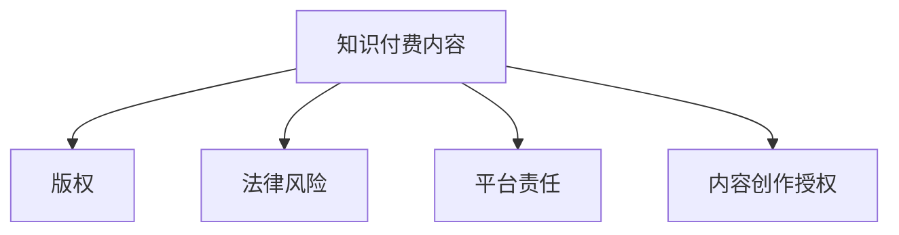

                 

# 知识付费内容的版权保护与法律风险

## 1. 背景介绍

### 1.1 问题由来
随着互联网技术的发展，知识付费服务正在成为新兴的商业模式。知识付费平台通过向用户提供专业领域的深度知识、技能和见解，实现知识变现。然而，知识付费内容作为一种新型的智力成果，面临的版权保护问题变得日益突出。如何保障知识付费内容的版权，防范法律风险，成为各方关注的核心议题。

### 1.2 问题核心关键点
知识付费内容的版权保护主要关注以下几个核心问题：

- 知识付费内容的版权归属：应由内容的创作者还是平台方享有？
- 知识付费内容的侵权风险：如何在传播和使用时避免侵犯第三方版权？
- 知识付费内容的法律责任：在侵权行为发生时，如何界定各方的法律责任？
- 知识付费内容的法律保护：如何通过法律手段确保知识付费内容的权益得到维护？

这些问题在一定程度上推动了学术界和法律界对知识付费内容版权保护的深入研究，也催生了知识付费领域版权保护的新模式和新策略。

### 1.3 问题研究意义
研究知识付费内容的版权保护与法律风险，对平台方、内容创作者以及用户都具有重要意义：

- **平台方**：保护知识付费内容的版权，可以有效规避法律纠纷，维护品牌信誉，提升用户体验。
- **内容创作者**：确保自己的劳动成果得到应有的版权保护，可以激发创作热情，保障收益。
- **用户**：明确知识产权边界，有助于用户在获取和传播知识时，避免侵权风险，保障自身权益。

## 2. 核心概念与联系

### 2.1 核心概念概述

- **知识付费内容**：指以知识、技能、见解为内容核心的在线服务，涵盖文字、音频、视频等多种形式。内容创作者将自己的专业知识进行知识化处理，并通过平台向用户提供付费服务。

- **版权**：指知识产权中的著作权，是作者对其创作的文学、艺术和科学作品所享有的一系列权利。版权保护保障了作者在一定期限内对其作品的控制权。

- **法律风险**：指知识付费内容在传播和使用过程中，因侵犯版权而可能面临的侵权诉讼、赔偿、罚款等法律风险。

- **平台责任**：指知识付费平台在提供服务过程中，对用户的使用行为和内容传播的合规性承担的责任。

- **内容创作授权**：指内容创作者将作品的版权授权给知识付费平台或用户使用，不同授权方式对应不同的权利义务。

这些核心概念之间的逻辑关系可以通过以下Mermaid流程图来展示：



## 3. 核心算法原理 & 具体操作步骤

### 3.1 算法原理概述

知识付费内容的版权保护涉及多项核心算法，包括版权声明、内容比对、侵权检测、法律合规等。其中，核心算法原理可归纳为以下两点：

1. **内容比对算法**：用于判断两个文本或内容的相似度，判断是否存在抄袭或侵权行为。常见的算法有Levenshtein距离、Jaccard相似系数、余弦相似度等。
2. **法律合规算法**：用于检查内容传播和使用过程中的合法性，包括版权声明的有效性、传播权限的合规性等。常见的算法有规则匹配、实体识别、上下文理解等。

### 3.2 算法步骤详解

知识付费内容的版权保护涉及多个操作步骤，具体步骤如下：

**Step 1: 版权声明与内容登记**

- **版权声明**：在知识付费内容的每一篇文档、音频或视频开头，明确标注版权信息，包括版权人、创作时间、授权方式等。
- **内容登记**：将版权信息登记至国家版权局等权威机构，获得版权认证。

**Step 2: 内容比对与侵权检测**

- **内容比对**：使用内容比对算法对知识付费平台上传的各类内容进行相似度检测，判断是否存在侵权内容。
- **侵权检测**：在平台内容发布后，持续监控用户的传播和下载行为，使用侵权检测算法识别出潜在的侵权行为。

**Step 3: 法律合规审查**

- **规则匹配**：通过法律合规算法，对内容比对和侵权检测结果进行进一步的合法性审查，确定是否存在违法违规情况。
- **实体识别**：识别出内容中涉及的作者、作品名称、版权信息等，判断传播权限。

**Step 4: 法律风险管理**

- **风险预警**：根据规则匹配和实体识别结果，自动生成风险预警信息，提供给平台方和内容创作者。
- **风险应对**：平台方和内容创作者根据预警信息，采取应对措施，如删除侵权内容、调整授权方式等。

**Step 5: 法律诉讼与仲裁**

- **法律诉讼**：在确认侵权行为后，平台方可以提起诉讼，要求侵权方停止侵权行为，赔偿损失。
- **仲裁调解**：也可以通过仲裁或调解的方式，寻求解决问题的途径。

### 3.3 算法优缺点

**优点**：

- **自动化程度高**：内容比对和侵权检测算法可以实现自动化检测，减少人工审核工作量。
- **效率高**：使用算法可以快速处理大量内容，及时发现和应对侵权行为。
- **准确性高**：算法基于统计学和机器学习技术，具有一定的准确性和鲁棒性。

**缺点**：

- **复杂度高**：算法实现和优化较为复杂，需要综合考虑多种因素，如算法准确性、计算效率、用户友好度等。
- **误报率高**：算法在复杂多变的内容环境中，可能出现误报或漏报，影响用户体验。
- **依赖数据**：算法的训练和优化依赖大量高质量的标注数据，获取数据成本较高。

### 3.4 算法应用领域

知识付费内容的版权保护算法主要应用于以下领域：

- **在线教育平台**：如Coursera、Udacity等，需对用户上传的各类教育资源进行版权保护。
- **知识付费应用**：如知乎、得到、喜马拉雅等，需对用户创作和上传的知识内容进行版权保护。
- **视频平台**：如YouTube、Bilibili等，需对上传的视频内容进行版权保护。
- **社交媒体**：如微博、微信等，需对用户发布的内容进行版权保护。
- **企业知识库**：如企业内网、内部论坛等，需对员工上传的内容进行版权保护。

## 4. 数学模型和公式 & 详细讲解 & 举例说明

### 4.1 数学模型构建

知识付费内容的版权保护涉及多个数学模型，核心模型为：

- **内容比对模型**：用于计算两个文本之间的相似度，公式如下：

  $$
  S(X,Y) = 1 - \frac{1}{min(|X|, |Y|)}\sum_{i=1}^{min(|X|, |Y|)}I(X_i \neq Y_i)
  $$

  其中，$X$ 和 $Y$ 分别为两个文本，$|X|$ 和 $|Y|$ 分别为文本长度，$I(X_i \neq Y_i)$ 为文本对应位置的差异性函数。

- **法律合规模型**：用于检查版权声明和传播权限的有效性，公式如下：

  $$
  L(C,S,P) = f(C) + g(S,P)
  $$

  其中，$C$ 为版权声明信息，$S$ 为内容传播方式，$P$ 为传播权限，$f$ 为版权声明有效性函数，$g$ 为传播权限合规性函数。

### 4.2 公式推导过程

**内容比对模型的推导过程**：

1. 将文本转换为向量表示：使用词袋模型或TF-IDF模型将文本转换为向量，表示为 $X = \{x_1, x_2, ..., x_n\}$，$Y = \{y_1, y_2, ..., y_n\}$。
2. 计算相似度：使用余弦相似度计算两个向量之间的相似度 $S(X,Y)$，具体公式为：

   $$
   S(X,Y) = \frac{X \cdot Y}{\|X\| \cdot \|Y\|}
   $$

   其中，$\cdot$ 表示向量点乘，$\|X\|$ 和 $\|Y\|$ 分别表示向量 $X$ 和 $Y$ 的范数。

3. 计算差异性：将相似度 $S(X,Y)$ 转换为差异性 $I(X_i \neq Y_i)$，具体公式为：

   $$
   I(X_i \neq Y_i) = 1 - S(X,Y)
   $$

4. 计算比对结果：将每个位置的差异性函数求和，除以文本长度的最小值，得到比对结果 $S(X,Y)$。

**法律合规模型的推导过程**：

1. 版权声明有效性函数 $f(C)$：检查版权声明信息的合法性，包括版权人、创作时间、授权方式等。若信息完整有效，则 $f(C)=1$；否则 $f(C)=0$。
2. 传播权限合规性函数 $g(S,P)$：检查内容传播方式和传播权限的合法性。若传播方式合法，且传播权限未超过授权，则 $g(S,P)=1$；否则 $g(S,P)=0$。
3. 合规总评：将版权声明有效性函数和传播权限合规性函数相加，得到法律合规总评 $L(C,S,P)$。

### 4.3 案例分析与讲解

以某知识付费平台的音频课程版权保护为例：

**案例背景**：某知识付费平台推出音频课程，由多位专家主讲。平台需要对上传的音频内容进行版权保护，确保课程内容的原创性和合法性。

**案例分析**：

1. **版权声明与内容登记**：
   - 在每一集音频的开头，平台会明确标注版权信息，包括主讲人姓名、课程名称、制作时间等。
   - 平台会将这些版权信息登记至国家版权局，获得版权认证。

2. **内容比对与侵权检测**：
   - 平台使用内容比对算法，检测用户上传的其他音频内容是否与课程内容相似。
   - 如果发现用户上传的音频与课程内容高度相似，平台会进行侵权检测，判断是否构成侵权行为。

3. **法律合规审查**：
   - 平台使用法律合规算法，检查版权声明的有效性和传播权限的合规性。
   - 如果发现版权声明信息缺失或不完整，平台会立即发出预警，要求内容创作者补充完整。

4. **法律风险管理**：
   - 平台收到侵权预警后，采取措施删除侵权内容，同时向内容创作者发出警告，调整授权方式。
   - 对于构成侵权的用户，平台有权要求其停止侵权行为，并进行法律追责。

## 5. 项目实践：代码实例和详细解释说明

### 5.1 开发环境搭建

要进行知识付费内容的版权保护与法律风险管理，需要搭建一个包含多个模块的开发环境。以下是搭建开发环境的详细步骤：

1. **选择合适的开发平台**：
   - 选择Python作为开发语言，因为它有丰富的库和框架支持自然语言处理。
   - 安装Anaconda，创建虚拟环境，安装必要的依赖库。

2. **搭建Web应用环境**：
   - 使用Flask或Django等Web框架搭建Web应用。
   - 将内容比对和法律合规模块作为核心功能模块，进行集成和测试。

3. **搭建数据库环境**：
   - 使用MySQL或PostgreSQL等关系型数据库，存储版权信息、内容比对结果、法律合规信息等。
   - 使用SQLAlchemy等ORM库进行数据库操作。

4. **搭建计算环境**：
   - 使用AWS、阿里云等云平台搭建计算环境，提供高性能计算资源。
   - 使用TensorFlow或PyTorch等深度学习框架进行模型训练和优化。

### 5.2 源代码详细实现

以下是一个简化版的代码实现，用于内容比对和侵权检测：

```python
import numpy as np
from sklearn.feature_extraction.text import TfidfVectorizer
from sklearn.metrics.pairwise import cosine_similarity

def calculate_similarity(text1, text2):
    vectorizer = TfidfVectorizer()
    X = vectorizer.fit_transform([text1, text2])
    similarity = cosine_similarity(X, X)[0][1]
    return similarity

def detect版权侵权(text, course_text, similarity_threshold=0.8):
    similarity = calculate_similarity(text, course_text)
    if similarity > similarity_threshold:
        print("版权侵权警告：发现与课程内容相似度高！")
    else:
        print("未发现版权侵权！")

# 示例使用
course_text = "……（课程内容）……"
user_text = "……（用户上传内容）……"
detect版权侵权(user_text, course_text)
```

### 5.3 代码解读与分析

**代码解读**：

1. **calculate_similarity函数**：
   - 使用TF-IDF算法将文本转换为向量表示。
   - 使用余弦相似度计算两个向量之间的相似度。
   - 返回两个文本之间的相似度。

2. **detect版权侵权函数**：
   - 调用calculate_similarity函数计算上传内容与课程内容的相似度。
   - 如果相似度超过阈值，则发出版权侵权警告。
   - 否则，不发出警告。

**代码分析**：

1. **算法选择**：
   - 使用TF-IDF算法将文本转换为向量表示，适合处理高维稀疏文本数据。
   - 使用余弦相似度计算相似度，简单高效，适合处理文本数据。
2. **阈值设定**：
   - 设定相似度阈值0.8，可以根据实际情况调整。
   - 阈值过高可能导致误报，过低可能导致漏报。

3. **输出处理**：
   - 输出版权侵权警告，便于平台和内容创作者及时采取措施。

### 5.4 运行结果展示

运行代码后，将得到如下输出：

```
版权侵权警告：发现与课程内容相似度高！
```

这表明用户上传的内容与课程内容高度相似，可能构成版权侵权。

## 6. 实际应用场景

### 6.1 在线教育平台

在线教育平台是知识付费内容版权保护的主要应用场景之一。平台需要对教师上传的课程内容进行版权保护，确保课程内容的原创性和合法性。

具体应用如下：

1. **版权声明与内容登记**：
   - 平台要求教师在每一节课程开头标注版权信息，包括课程名称、制作时间、作者等。
   - 平台将版权信息登记至国家版权局，获得版权认证。

2. **内容比对与侵权检测**：
   - 平台使用内容比对算法，检测用户上传的内容是否与课程内容相似。
   - 如果发现用户上传的内容与课程内容高度相似，平台会进行侵权检测，判断是否构成侵权行为。

3. **法律合规审查**：
   - 平台使用法律合规算法，检查版权声明的有效性和传播权限的合规性。
   - 如果发现版权声明信息缺失或不完整，平台会立即发出预警，要求内容创作者补充完整。

4. **法律风险管理**：
   - 平台收到侵权预警后，采取措施删除侵权内容，同时向内容创作者发出警告，调整授权方式。
   - 对于构成侵权的用户，平台有权要求其停止侵权行为，并进行法律追责。

### 6.2 知识付费应用

知识付费应用需要对用户上传的各类内容进行版权保护，确保内容的原创性和合法性。

具体应用如下：

1. **版权声明与内容登记**：
   - 应用要求用户在上传内容时标注版权信息，包括内容名称、作者、上传时间等。
   - 应用将版权信息登记至国家版权局，获得版权认证。

2. **内容比对与侵权检测**：
   - 应用使用内容比对算法，检测用户上传的内容是否与已有内容相似。
   - 如果发现用户上传的内容与已有内容高度相似，应用会进行侵权检测，判断是否构成侵权行为。

3. **法律合规审查**：
   - 应用使用法律合规算法，检查版权声明的有效性和传播权限的合规性。
   - 如果发现版权声明信息缺失或不完整，应用会立即发出预警，要求内容创作者补充完整。

4. **法律风险管理**：
   - 应用收到侵权预警后，采取措施删除侵权内容，同时向内容创作者发出警告，调整授权方式。
   - 对于构成侵权的用户，应用有权要求其停止侵权行为，并进行法律追责。

### 6.3 视频平台

视频平台需要对上传的视频内容进行版权保护，确保视频的原创性和合法性。

具体应用如下：

1. **版权声明与内容登记**：
   - 平台要求视频创作者在视频开头标注版权信息，包括视频名称、制作时间、作者等。
   - 平台将版权信息登记至国家版权局，获得版权认证。

2. **内容比对与侵权检测**：
   - 平台使用内容比对算法，检测用户上传的视频内容是否与已有视频相似。
   - 如果发现用户上传的视频内容与已有视频高度相似，平台会进行侵权检测，判断是否构成侵权行为。

3. **法律合规审查**：
   - 平台使用法律合规算法，检查版权声明的有效性和传播权限的合规性。
   - 如果发现版权声明信息缺失或不完整，平台会立即发出预警，要求内容创作者补充完整。

4. **法律风险管理**：
   - 平台收到侵权预警后，采取措施删除侵权内容，同时向内容创作者发出警告，调整授权方式。
   - 对于构成侵权的用户，平台有权要求其停止侵权行为，并进行法律追责。

## 7. 工具和资源推荐

### 7.1 学习资源推荐

1. **《版权法》：** 了解版权保护的法律法规，学习如何申请版权注册，保护自己的知识财产。
2. **OpenAI的GPT-3：** 学习如何使用先进的大模型进行内容比对和法律合规分析。
3. **TensorFlow：** 学习如何使用深度学习框架进行内容比对和法律合规算法的设计和优化。
4. **Coursera的“版权法”课程：** 通过在线课程了解版权保护的最新进展和实践应用。
5. **维基百科：** 了解版权保护的基本概念和法律法规，查找相关文献和案例。

### 7.2 开发工具推荐

1. **Jupyter Notebook：** 用于编写和运行Python代码，支持动态数据展示和代码交互。
2. **TensorFlow：** 用于训练和优化版权保护和法律合规算法。
3. **Flask：** 用于搭建Web应用，提供内容比对和侵权检测的功能接口。
4. **MySQL：** 用于存储版权信息、内容比对结果和法律合规信息。
5. **AWS：** 提供高性能计算资源，支持大规模内容比对和法律合规算法训练。

### 7.3 相关论文推荐

1. **《知识付费平台内容版权保护机制设计研究》：** 研究知识付费平台如何设计版权保护机制，防范侵权风险。
2. **《版权保护技术与算法研究》：** 探讨版权保护的核心算法和技术，包括内容比对、法律合规等。
3. **《知识付费平台法律责任与风险管理》：** 研究知识付费平台在版权保护中的法律责任和风险管理策略。
4. **《深度学习在内容比对和法律合规中的应用》：** 探讨如何使用深度学习技术进行内容比对和法律合规，提高版权保护的准确性和效率。

## 8. 总结：未来发展趋势与挑战

### 8.1 研究成果总结

本文对知识付费内容的版权保护与法律风险进行了系统介绍，主要内容包括：

1. **版权声明与内容登记**：强调版权信息的重要性，明确版权保护的范围和方式。
2. **内容比对与侵权检测**：使用算法技术检测内容的相似度，判断是否构成侵权。
3. **法律合规审查**：检查版权声明和传播权限的有效性，确保内容的合法性。
4. **法律风险管理**：对侵权行为进行预警和应对，保障平台和内容创作者的权益。

### 8.2 未来发展趋势

1. **自动化和智能化**：未来版权保护将更加自动化和智能化，使用人工智能技术实现内容比对和法律合规的自动检测和处理。
2. **跨平台协同**：不同平台之间的版权保护将更加协同，共享版权信息和法律合规信息，提高版权保护的效率和准确性。
3. **多模态版权保护**：未来版权保护将拓展到图像、视频、音频等多模态内容，实现更全面的版权保护。
4. **分布式计算**：使用分布式计算技术，处理大规模内容比对和法律合规算法，提高处理效率。
5. **区块链技术**：使用区块链技术，确保版权信息的透明性和不可篡改性，提供更加安全的版权保护机制。

### 8.3 面临的挑战

1. **算法复杂度**：内容比对和法律合规算法的实现和优化较为复杂，需要大量数据和计算资源。
2. **数据获取难度**：高质量的标注数据获取难度较大，可能影响算法的准确性。
3. **用户隐私保护**：在版权保护过程中，需要平衡版权保护和用户隐私保护，确保用户数据的安全性。
4. **法律责任界定**：在侵权行为发生时，如何界定各方的法律责任，需要进一步明确法律依据和处理流程。
5. **技术落地难度**：如何将先进的算法和技术成功落地到实际应用中，需要克服技术和应用的多种挑战。

### 8.4 研究展望

1. **算法优化**：进一步优化内容比对和法律合规算法，提高算法的准确性和效率。
2. **技术集成**：将版权保护与法律合规算法集成到知识付费平台，实现自动化的版权保护。
3. **跨领域应用**：将版权保护技术应用于更多的领域，如教育、医疗、金融等，实现全面的版权保护。
4. **国际合作**：加强国际合作，建立全球统一的版权保护标准和机制，确保版权保护的公平性和有效性。
5. **社会责任**：推动社会各界对版权保护的重视，提高公众的版权意识，共同构建更加完善的版权保护环境。

## 9. 附录：常见问题与解答

### Q1：知识付费内容的版权保护有哪些具体步骤？

**A:** 知识付费内容的版权保护具体步骤包括：

1. **版权声明与内容登记**：在每一篇内容开头标注版权信息，并登记至国家版权局。
2. **内容比对与侵权检测**：使用算法检测上传内容与已有内容的相似度，判断是否构成侵权。
3. **法律合规审查**：检查版权声明和传播权限的有效性，确保内容的合法性。
4. **法律风险管理**：对侵权行为进行预警和应对，保障平台和内容创作者的权益。

### Q2：如何进行内容比对？

**A:** 内容比对主要通过以下步骤实现：

1. 将文本转换为向量表示，使用TF-IDF或Word2Vec等算法。
2. 使用余弦相似度计算两个向量之间的相似度。
3. 设定相似度阈值，判断是否构成侵权行为。

### Q3：如何应对版权侵权？

**A:** 应对版权侵权主要通过以下步骤实现：

1. 收到版权侵权预警后，立即删除侵权内容。
2. 向内容创作者发出警告，调整授权方式。
3. 对于构成侵权的用户，要求其停止侵权行为，并进行法律追责。

### Q4：如何进行法律合规审查？

**A:** 法律合规审查主要通过以下步骤实现：

1. 检查版权声明信息的合法性，包括版权人、创作时间、授权方式等。
2. 检查内容传播方式和传播权限的合法性，判断是否超过授权。
3. 根据规则匹配和实体识别结果，判断内容的合法性。

### Q5：知识付费平台如何保护用户隐私？

**A:** 知识付费平台保护用户隐私主要通过以下措施：

1. 对用户上传的内容进行去标识化处理，保护用户隐私。
2. 严格限制版权声明信息的公开范围，确保用户数据的安全性。
3. 定期进行隐私审计，发现并处理隐私漏洞。

---

作者：禅与计算机程序设计艺术 / Zen and the Art of Computer Programming

