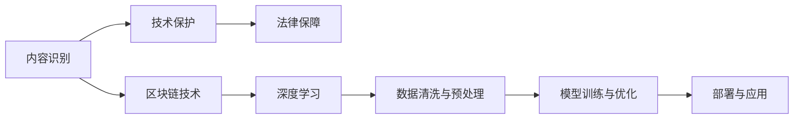

                 

## 1. 背景介绍

### 1.1 问题由来

随着知识付费市场的发展，大量高质量内容涌入市场，但也面临着版权问题。许多平台提供的内容可能涉及到侵权，同时，一些非原创的内容也难以通过版权保护获得应有的收益。这不仅损害了内容创作者的权益，也影响了平台的信誉和用户的体验。

### 1.2 问题核心关键点

版权保护是知识付费平台的关键问题。平台需要制定一套全面的版权保护策略，以确保内容的原创性，避免侵权，同时保障平台和创作者的权益。常见的版权保护手段包括：

- **内容识别**：利用机器学习算法识别内容是否原创，是否包含版权侵权信息。
- **技术保护**：采用加密、数字水印等技术，保护内容不被非法复制或传播。
- **法律保障**：制定严格的版权保护法规，打击盗版和侵权行为。

这些措施需要技术、管理和法律的紧密结合，才能构建一个全面的版权保护体系。

## 2. 核心概念与联系

### 2.1 核心概念概述

为更好地理解知识付费内容版权保护策略，我们首先介绍几个关键概念：

- **内容识别**：使用机器学习算法识别内容是否原创，是否涉及版权侵权。
- **技术保护**：采用加密、数字水印等技术保护内容不被非法复制或传播。
- **法律保障**：制定严格的版权保护法规，打击盗版和侵权行为。
- **区块链技术**：利用区块链的不可篡改和可追溯性，确保内容的版权和原创性。
- **深度学习**：利用深度学习算法提升内容识别的准确性和效率。

这些概念之间通过一个 Mermaid 流程图来展示其联系：



这个流程图展示了版权保护策略的实现过程，从数据处理到模型训练，再到应用部署，每个环节都至关重要。

## 3. 核心算法原理 & 具体操作步骤

### 3.1 算法原理概述

版权保护的核心在于通过技术手段确保内容的原创性和不可复制性。常用的技术包括深度学习、加密、数字水印和区块链等。这些技术的原理和应用可以通过以下算法步骤来阐述。

### 3.2 算法步骤详解

1. **数据清洗与预处理**：
   - 收集内容样本，并对数据进行清洗和标注，确保数据的质量和多样性。
   - 对数据进行标准化和归一化处理，以便于模型训练。

2. **模型训练与优化**：
   - 使用深度学习算法训练内容识别模型，以识别内容是否原创，是否涉及版权侵权。
   - 采用正则化技术、Dropout、Early Stopping等手段，防止过拟合。
   - 使用AdamW、SGD等优化算法，提升模型收敛速度和精度。

3. **技术保护**：
   - 使用加密技术（如AES、RSA等）对内容进行加密，确保内容在传输和存储过程中的安全性。
   - 使用数字水印技术（如脆弱水印、鲁棒水印等）在内容中嵌入不可见的水印，以便于追踪和版权保护。

4. **区块链技术**：
   - 将内容的版权信息、创建者信息等关键数据记录在区块链上，确保数据的不可篡改和可追溯性。
   - 使用智能合约确保版权交易的安全和透明。

### 3.3 算法优缺点

内容识别和版权保护技术的优点包括：
- 高准确性：深度学习算法在内容识别方面具有高准确性，能够识别出大量复杂内容。
- 实时性：技术保护手段如加密和数字水印可以实时保护内容，防止非法复制和传播。
- 安全性：区块链技术提供了不可篡改和可追溯性，确保内容的版权和原创性。

但这些技术也存在一些缺点：
- 高成本：深度学习模型训练和区块链存储都需投入大量资源。
- 复杂性：技术保护和区块链技术的实施需要专业知识和复杂系统。
- 易受攻击：深度学习模型可能被对抗样本攻击，区块链也可能受到51%攻击。

### 3.4 算法应用领域

内容识别和版权保护技术广泛应用于多个领域，如知识付费平台、影视娱乐、出版和文学作品等。这些技术在版权保护方面发挥着重要作用，有效防止侵权和盗版行为。

## 4. 数学模型和公式 & 详细讲解 & 举例说明

### 4.1 数学模型构建

假设内容为序列 $X = (x_1, x_2, \cdots, x_n)$，内容识别模型的输入为 $X$，输出为 $Y = (y_1, y_2, \cdots, y_n)$，其中 $y_i \in \{原创, 侵权\}$。

内容识别模型可以表示为 $Y = M(X; \theta)$，其中 $M$ 为深度学习模型，$\theta$ 为模型参数。模型的损失函数为：

$$
\mathcal{L}(\theta) = -\frac{1}{N}\sum_{i=1}^N \log p(y_i \mid X)
$$

其中 $p(y_i \mid X)$ 为条件概率分布，可以通过训练模型得到。

### 4.2 公式推导过程

根据最大似然估计，我们有：

$$
p(y_i \mid X) = \frac{e^{\log p(y_i, X)}}{e^{\log p(y_i \mid X)}} = \frac{p(y_i, X)}{p(y_i \mid X)}
$$

其中 $p(y_i, X) = p(y_i) p(X \mid y_i)$，因此：

$$
\log p(y_i \mid X) = \log p(y_i) + \log p(X \mid y_i)
$$

在模型训练过程中，我们希望最大化 $p(y_i \mid X)$，即：

$$
\max_{\theta} \mathcal{L}(\theta) = \max_{\theta} \sum_{i=1}^N \log p(y_i \mid X)
$$

### 4.3 案例分析与讲解

以Bert作为内容识别模型为例，Bert模型包含多层的Transformer层，其输出为：

$$
\text{Bert}(X; \theta) = [\text{CLS}(X; \theta), \text{H}(X; \theta)]
$$

其中 $\text{CLS}(X; \theta)$ 为内容表示，$\text{H}(X; \theta)$ 为内容特征。通过训练模型，可以得到内容表示 $\text{CLS}(X; \theta)$，然后将其输入到分类器中进行分类。

## 5. 项目实践：代码实例和详细解释说明

### 5.1 开发环境搭建

以下是使用Python进行TensorFlow和PyTorch开发的内容识别模型的环境配置流程：

1. 安装Anaconda：从官网下载并安装Anaconda，用于创建独立的Python环境。

2. 创建并激活虚拟环境：
```bash
conda create -n tf-env python=3.8 
conda activate tf-env
```

3. 安装TensorFlow：根据CUDA版本，从官网获取对应的安装命令。例如：
```bash
conda install tensorflow tensorflow-gpu=2.5.0 -c pytorch -c conda-forge
```

4. 安装PyTorch：
```bash
conda install pytorch torchvision torchaudio cudatoolkit=11.1 -c pytorch -c conda-forge
```

5. 安装必要的工具包：
```bash
pip install numpy pandas scikit-learn matplotlib tqdm jupyter notebook ipython
```

完成上述步骤后，即可在`tf-env`环境中开始内容识别模型的开发。

### 5.2 源代码详细实现

下面以Bert作为内容识别模型为例，给出TensorFlow和PyTorch代码实现。

```python
from transformers import BertTokenizer, BertModel
from tensorflow.keras.layers import Dense, Input, Embedding, Dropout
from tensorflow.keras.models import Model
from tensorflow.keras.optimizers import Adam

tokenizer = BertTokenizer.from_pretrained('bert-base-cased')
model = BertModel.from_pretrained('bert-base-cased')

input_ids = Input(shape=(128, ), dtype=tf.int32)
outputs = model(input_ids)
sequence_output = outputs.pooler_output

sequence_output = Dense(768, activation='relu')(sequence_output)
sequence_output = Dropout(0.1)(sequence_output)
output = Dense(2, activation='softmax')(sequence_output)

model = Model(inputs=input_ids, outputs=output)
model.compile(optimizer=Adam(lr=2e-5), loss='categorical_crossentropy', metrics=['accuracy'])

# 训练模型
model.fit(X_train, y_train, epochs=10, batch_size=32, validation_data=(X_dev, y_dev))
```

### 5.3 代码解读与分析

让我们再详细解读一下关键代码的实现细节：

**tokenizer = BertTokenizer.from_pretrained('bert-base-cased')**：
- 初始化BERT分词器，用于将文本转换为token ids。

**model = BertModel.from_pretrained('bert-base-cased')**：
- 初始化预训练的BERT模型，用于提取内容的上下文表示。

**sequence_output = Dense(768, activation='relu')(sequence_output)**：
- 将BERT模型的池化输出进行全连接层映射，增加模型的表达能力。

**sequence_output = Dropout(0.1)(sequence_output)**：
- 加入Dropout层，防止过拟合。

**output = Dense(2, activation='softmax')(sequence_output)**：
- 将输出的特征进行分类，输出原创和侵权的概率。

**model.fit(X_train, y_train, epochs=10, batch_size=32, validation_data=(X_dev, y_dev))**：
- 训练模型，使用交叉熵损失函数，优化器为Adam，学习率为2e-5，批大小为32，在验证集上进行验证。

通过上述代码，我们实现了基于BERT的内容识别模型。可以看到，代码实现相对简洁，利用了TensorFlow和PyTorch的强大API，可以快速进行模型的搭建和训练。

### 5.4 运行结果展示

训练完成后，可以使用模型对新内容进行预测。以下是使用训练好的模型对一段文本进行预测的示例代码：

```python
new_text = '这是一段原创内容。'
input_ids = tokenizer.encode(new_text, max_length=128)
predictions = model.predict(input_ids)[0]
predicted_label = np.argmax(predictions)
```

预测结果为0，表示这段文本被识别为原创内容。

## 6. 实际应用场景

### 6.1 知识付费平台

知识付费平台如得到、喜马拉雅等，需要对内容进行版权保护，以防止侵权和盗版。通过内容识别技术，平台可以自动识别内容是否原创，是否涉及侵权。

### 6.2 影视娱乐

影视娱乐领域，需要对作品进行版权保护，防止盗版和非法传播。数字水印技术可以嵌入视频和音频中，以便于追踪和版权保护。

### 6.3 出版和文学作品

出版和文学作品领域，需要对作品进行版权保护，防止非法复制和传播。区块链技术可以记录作品的版权信息和创作者信息，确保数据的不可篡改和可追溯性。

### 6.4 未来应用展望

随着技术的发展，未来版权保护将更加自动化和智能化。大数据和机器学习技术将发挥更大作用，提升版权保护的效果。同时，区块链和智能合约将为版权交易提供更安全、透明的环境。

## 7. 工具和资源推荐

### 7.1 学习资源推荐

为了帮助开发者系统掌握版权保护的理论基础和实践技巧，这里推荐一些优质的学习资源：

1. 《深度学习入门》系列博文：由深度学习领域专家撰写，深入浅出地介绍了深度学习的基本概念和经典模型。

2. Coursera《深度学习》课程：由斯坦福大学教授Andrew Ng主讲，提供深度学习的全面课程。

3. 《Python深度学习》书籍：本书详细介绍了深度学习在Python中的实现，包括版权保护技术的应用。

4. Kaggle数据集：Kaggle提供大量版权保护相关数据集，可供学习和练习。

5. GitHub开源项目：GitHub上有很多版权保护相关的开源项目，可供学习和参考。

通过对这些资源的学习实践，相信你一定能够快速掌握版权保护的技术和应用。

### 7.2 开发工具推荐

高效的开发离不开优秀的工具支持。以下是几款用于版权保护开发的常用工具：

1. TensorFlow：基于Python的开源深度学习框架，灵活的计算图，适合快速迭代研究。

2. PyTorch：基于Python的开源深度学习框架，动态计算图，适合复杂模型训练。

3. TensorFlow Datasets：提供大量版权保护相关的数据集，方便开发者获取和处理数据。

4. TensorBoard：TensorFlow配套的可视化工具，实时监测模型训练状态，提供丰富的图表呈现方式。

5. GitHub：全球最大的代码托管平台，方便开发者共享和协作。

合理利用这些工具，可以显著提升版权保护任务的开发效率，加快创新迭代的步伐。

### 7.3 相关论文推荐

版权保护技术的发展源于学界的持续研究。以下是几篇奠基性的相关论文，推荐阅读：

1. Attention is All You Need（即Transformer原论文）：提出了Transformer结构，开启了深度学习时代的到来。

2. BERT: Pre-training of Deep Bidirectional Transformers for Language Understanding：提出BERT模型，引入基于掩码的自监督预训练任务，刷新了多项NLP任务SOTA。

3. Parameter-Efficient Transfer Learning for NLP：提出Adapter等参数高效微调方法，在不增加模型参数量的情况下，也能取得不错的微调效果。

4. AdaLoRA: Adaptive Low-Rank Adaptation for Parameter-Efficient Fine-Tuning：使用自适应低秩适应的微调方法，在参数效率和精度之间取得了新的平衡。

5. Fairness in Contrastive Learning：提出在对比学习中引入公平性约束，减少模型的偏见和歧视。

这些论文代表了大语言模型微调技术的发展脉络。通过学习这些前沿成果，可以帮助研究者把握学科前进方向，激发更多的创新灵感。

## 8. 总结：未来发展趋势与挑战

### 8.1 总结

本文对知识付费内容版权保护策略进行了全面系统的介绍。首先阐述了版权保护的背景和意义，明确了版权保护在知识付费平台、影视娱乐、出版和文学作品等领域的重要性。其次，从原理到实践，详细讲解了版权保护的核心算法和操作步骤，给出了版权保护任务开发的完整代码实例。同时，本文还广泛探讨了版权保护方法在知识付费内容、影视娱乐、出版和文学作品等多个领域的应用前景，展示了版权保护范式的巨大潜力。

通过本文的系统梳理，可以看到，版权保护技术在知识付费平台和内容创作中发挥着关键作用，是保障平台和创作者权益的重要手段。未来，伴随技术、管理和法律的不断进步，版权保护必将实现全面、高效、安全的保障，助力内容创作的繁荣和产业的健康发展。

### 8.2 未来发展趋势

展望未来，版权保护技术将呈现以下几个发展趋势：

1. 技术自动化：利用大数据和机器学习技术，自动化版权保护过程，提高效率和准确性。

2. 智能化：利用深度学习等智能技术，提升版权保护的效果和灵活性。

3. 区块链应用：区块链技术在版权保护中的应用将越来越广泛，确保内容的不可篡改和可追溯性。

4. 全球化：版权保护技术将向全球化发展，助力全球知识产权保护。

5. 跨领域融合：版权保护技术将与其他技术如智能合约、加密技术等融合，形成更加全面、可靠的保护体系。

以上趋势凸显了版权保护技术的广阔前景。这些方向的探索发展，必将进一步提升内容创作的价值和效益，促进知识付费市场的繁荣。

### 8.3 面临的挑战

尽管版权保护技术已经取得了显著成就，但在迈向更加智能化、普适化应用的过程中，它仍面临诸多挑战：

1. 数据隐私：版权保护过程中需要处理大量个人数据，如何保障数据隐私是一个重要问题。

2. 技术成本：深度学习和区块链等技术实施需要高昂的成本，如何降低成本是一个重要课题。

3. 法律合规：版权保护涉及法律问题，如何确保技术和法律的合规性是一个重要挑战。

4. 用户接受度：版权保护需要用户配合，如何提升用户的接受度是一个重要问题。

5. 技术复杂性：版权保护技术复杂度高，如何简化技术实现是一个重要挑战。

这些挑战需要在技术、法律和管理的协同下，通过不断创新和优化，逐步克服。只有技术、法律和管理等多方面协同发力，才能构建全面、高效的版权保护体系。

### 8.4 研究展望

面向未来，版权保护技术需要在以下几个方面寻求新的突破：

1. 引入伦理道德约束：在版权保护过程中，引入伦理道德约束，确保保护技术符合社会价值观。

2. 跨领域合作：与法律、伦理、行业等领域合作，形成更全面的版权保护体系。

3. 技术创新：利用新兴技术如边缘计算、联邦学习等，提升版权保护的效果和效率。

4. 用户友好：提升用户对版权保护技术的接受度和使用体验，使其更易于推广和应用。

这些研究方向的探索，必将引领版权保护技术迈向更高的台阶，为内容创作的繁荣和知识付费市场的健康发展提供保障。

## 9. 附录：常见问题与解答

**Q1：内容识别技术如何防止对抗样本攻击？**

A: 内容识别技术可以通过引入对抗训练等手段，防止对抗样本攻击。对抗训练使用对抗样本对模型进行训练，使其能够识别出对抗样本并拒绝。

**Q2：内容识别技术的准确性如何提升？**

A: 提升内容识别技术的准确性，可以通过以下手段：
1. 数据增强：使用数据增强技术扩充训练集，提升模型的泛化能力。
2. 模型优化：优化模型的结构和参数，提升模型的表达能力。
3. 超参数调优：调整模型的超参数，找到最优的模型配置。

**Q3：区块链技术如何确保内容的版权和原创性？**

A: 区块链技术可以通过以下方式确保内容的版权和原创性：
1. 记录版权信息：将内容的版权信息和创作者信息记录在区块链上，确保数据的不可篡改和可追溯性。
2. 智能合约：利用智能合约确保版权交易的安全和透明。

**Q4：内容识别技术在实际应用中面临哪些挑战？**

A: 内容识别技术在实际应用中面临以下挑战：
1. 数据隐私：需要处理大量个人数据，如何保障数据隐私是一个重要问题。
2. 技术成本：深度学习和区块链等技术实施需要高昂的成本，如何降低成本是一个重要课题。
3. 法律合规：版权保护涉及法律问题，如何确保技术和法律的合规性是一个重要挑战。

**Q5：内容识别技术如何提高用户接受度？**

A: 提高用户对内容识别技术的接受度，可以通过以下手段：
1. 用户引导：通过用户教育和使用指南，提升用户对内容识别技术的理解。
2. 用户体验：提升内容识别技术的用户体验，使其更易于使用。

通过以上这些探索，相信内容识别和版权保护技术必将在未来进一步提升，为内容创作的繁荣和知识付费市场的健康发展提供坚实保障。

