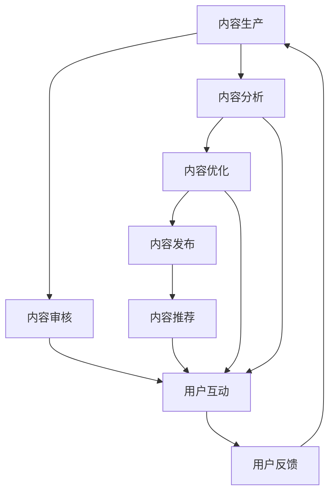

                 

## 1. 背景介绍

在知识付费领域，高质量内容是吸引用户的核心。然而，尽管当前内容种类繁多，用户获取知识的方式越来越多元化，但高质量内容依然稀缺。本文旨在探讨如何通过技术手段最大化知识付费平台上的内容价值，从而提升用户体验和平台盈利能力。

### 1.1 问题由来

随着互联网和移动互联网的普及，人们获取知识的方式发生了巨大变化。传统的内容生产方式难以满足多样化的知识需求，知识付费平台应运而生。然而，面对激烈的市场竞争，内容平台如何保持用户粘性，如何在纷繁芜杂的内容中突围，成为当下亟需解决的问题。

### 1.2 问题核心关键点

知识付费平台的核心在于内容价值的最大化。如何提升内容质量、丰富内容形式、增加内容曝光率、提高用户转化率，是知识付费创业成功的关键。本文将从内容价值最大化这一核心目标出发，探讨多层次的解决方案。

### 1.3 问题研究意义

实现内容价值的最大化，对于提升用户体验、提高平台盈利能力、推动知识普及和传播具有重要意义。深入分析当前平台面临的问题和挑战，提出切实可行的解决方案，可以帮助知识付费创业企业抓住用户，实现商业价值。

## 2. 核心概念与联系

### 2.1 核心概念概述

为更好地理解如何通过技术手段提升知识付费平台的内容价值，本节将介绍几个密切相关的核心概念：

- 知识付费：基于互联网和移动互联网技术，向用户提供有价值、系统的知识和信息服务，用户为内容付费的商业模式。
- 内容价值：内容能够满足用户需求的程度，包含知识深度、信息量、可读性、实用性等方面。
- 内容推荐：根据用户行为和偏好，智能推荐相关内容，提高内容曝光率。
- 用户画像：基于用户的行为数据、消费习惯、偏好等，构建用户画像，实现个性化推荐。
- 动态定价：根据内容价值和用户行为，动态调整价格，提高平台收益。

这些核心概念之间具有紧密的联系，共同构成了知识付费平台的价值链。通过提升内容价值、优化推荐系统、构建动态定价策略，可以有效增强平台竞争力，提升用户满意度。

### 2.2 核心概念原理和架构的 Mermaid 流程图(Mermaid 流程节点中不要有括号、逗号等特殊字符)



这个流程图展示了知识付费平台的核心流程：内容生产、审核、分析、优化、发布、推荐、互动和反馈。通过这些环节的协同工作，平台能够不断提升内容价值，优化用户体验，实现商业目标。

## 3. 核心算法原理 & 具体操作步骤

### 3.1 算法原理概述

提升知识付费平台的内容价值，需从多个维度入手，包括内容质量提升、内容推荐优化、用户画像构建和动态定价。这些维度的技术实现，大多依赖于机器学习和数据挖掘技术。

- 内容质量提升：通过自然语言处理(NLP)技术，对内容进行情感分析、关键词提取、文本分类、摘要生成等处理，提升内容可用性和吸引力。
- 内容推荐优化：通过推荐算法，根据用户历史行为、偏好等数据，智能推荐相关内容，提高内容曝光率和用户粘性。
- 用户画像构建：基于用户行为数据、消费数据等，通过聚类、关联规则等数据挖掘技术，构建用户画像，实现个性化推荐。
- 动态定价：通过算法对内容价值进行量化，结合用户行为，动态调整价格，最大化平台收益。

### 3.2 算法步骤详解

#### 3.2.1 内容质量提升

- **数据收集**：从平台收集用户反馈、评论、打分等数据，以及内容本身的文本、标签、分类信息。
- **数据预处理**：清洗无用数据，处理缺失值，进行文本归一化、分词、停用词过滤等预处理工作。
- **情感分析**：使用情感分析模型对内容情感倾向进行判断，筛选高质量内容。
- **关键词提取**：应用关键词提取算法，从内容中提取核心关键词，帮助用户快速理解内容。
- **文本分类**：使用分类模型对内容进行分类，便于用户查找和阅读。
- **摘要生成**：利用摘要生成技术，自动生成内容摘要，提升内容可读性。

#### 3.2.2 内容推荐优化

- **用户行为分析**：收集用户浏览、点击、购买等行为数据，分析用户兴趣和偏好。
- **相似度计算**：基于用户行为和内容特征，计算内容和用户之间的相似度。
- **推荐模型训练**：使用协同过滤、矩阵分解、深度学习等推荐算法，训练推荐模型。
- **实时推荐**：根据用户当前行为，实时生成推荐列表，提升用户体验。

#### 3.2.3 用户画像构建

- **数据收集**：收集用户的基本信息、行为数据、消费数据等。
- **用户分群**：通过聚类算法，将用户分为不同兴趣和行为特征的群体。
- **关联规则挖掘**：使用关联规则算法，发现用户行为之间的关联规则，构建用户行为模式。
- **画像更新**：定期更新用户画像，确保画像与用户当前行为保持一致。

#### 3.2.4 动态定价

- **内容价值量化**：通过情感分析、用户反馈、点击率等指标，量化内容的价值。
- **用户价值评估**：根据用户行为、消费习惯等数据，评估用户对内容的价值。
- **定价算法**：结合内容价值和用户价值，动态调整内容价格。

### 3.3 算法优缺点

#### 3.3.1 内容质量提升

**优点**：
- 提升内容可读性、可用性和吸引力。
- 帮助用户快速获取所需信息，提高内容曝光率。

**缺点**：
- 需要大量高质量数据进行训练。
- 技术实现复杂，成本较高。

#### 3.3.2 内容推荐优化

**优点**：
- 提升用户粘性和满意度。
- 提高内容曝光率和转化率。

**缺点**：
- 需要处理高维稀疏矩阵，计算复杂度高。
- 模型需要定期更新，维护成本较高。

#### 3.3.3 用户画像构建

**优点**：
- 实现个性化推荐，提升用户体验。
- 帮助企业洞察用户行为，优化产品和服务。

**缺点**：
- 需要大量数据和计算资源。
- 数据隐私和安全问题需重点关注。

#### 3.3.4 动态定价

**优点**：
- 最大化平台收益，提升盈利能力。
- 动态调整价格，提高用户满意度。

**缺点**：
- 需要实时处理大量数据，计算复杂度高。
- 模型需要持续优化，维护成本较高。

### 3.4 算法应用领域

上述算法在知识付费平台的各个环节中都有广泛应用：

- **内容审核**：通过情感分析、关键词提取等技术，筛选优质内容。
- **内容发布**：使用文本分类、摘要生成等技术，提升内容质量。
- **内容推荐**：根据用户画像和行为数据，实现个性化推荐。
- **动态定价**：量化内容价值，动态调整价格策略，提升盈利能力。

## 4. 数学模型和公式 & 详细讲解 & 举例说明

### 4.1 数学模型构建

本节将使用数学语言对知识付费平台的核心算法进行更加严格的刻画。

假设平台上有 $N$ 个用户，每个用户消费 $M$ 个内容，每个内容 $C$ 的情感得分为 $s_C$，用户 $U_i$ 对内容 $C_j$ 的评分 $r_{ij}$，内容的平均评分 $\bar{r}$。

定义用户 $U_i$ 对内容 $C_j$ 的兴趣评分 $q_{ij}$，计算公式如下：

$$
q_{ij} = \alpha r_{ij} + (1-\alpha) s_C
$$

其中 $\alpha$ 为调节因子，用于平衡用户评分和内容情感得分的影响。

用户 $U_i$ 对内容 $C_j$ 的最终评分 $R_{ij}$ 为：

$$
R_{ij} = q_{ij} - \mu_j + \lambda d_{ij}
$$

其中 $\mu_j$ 为内容 $C_j$ 的平均评分，$d_{ij}$ 为内容 $C_j$ 和用户 $U_i$ 之间的相似度。

用户 $U_i$ 对内容 $C_j$ 的评分向量 $\boldsymbol{R_i}$ 和内容 $C_j$ 的评分向量 $\boldsymbol{R_j}$ 的夹角余弦为：

$$
\cos\theta = \frac{\boldsymbol{R_i} \cdot \boldsymbol{R_j}}{\|\boldsymbol{R_i}\| \|\boldsymbol{R_j}\|}
$$

用户 $U_i$ 对内容 $C_j$ 的推荐分数 $P_{ij}$ 为：

$$
P_{ij} = \frac{\exp(R_{ij})}{\sum_k \exp(R_{ik})}
$$

推荐算法基于上述模型，综合用户评分、内容情感得分、用户画像、内容相似度等数据，推荐相关内容给用户。

### 4.2 公式推导过程

假设用户 $U_i$ 对内容 $C_j$ 的评分 $r_{ij}$ 服从伯努利分布，内容情感得分 $s_C$ 服从标准正态分布。

用户 $U_i$ 对内容 $C_j$ 的兴趣评分 $q_{ij}$ 为：

$$
q_{ij} = \alpha r_{ij} + (1-\alpha) s_C
$$

用户 $U_i$ 对内容 $C_j$ 的最终评分 $R_{ij}$ 为：

$$
R_{ij} = q_{ij} - \mu_j + \lambda d_{ij}
$$

其中 $\mu_j$ 为内容 $C_j$ 的平均评分，$d_{ij}$ 为内容 $C_j$ 和用户 $U_i$ 之间的相似度。

用户 $U_i$ 对内容 $C_j$ 的评分向量 $\boldsymbol{R_i}$ 和内容 $C_j$ 的评分向量 $\boldsymbol{R_j}$ 的夹角余弦为：

$$
\cos\theta = \frac{\boldsymbol{R_i} \cdot \boldsymbol{R_j}}{\|\boldsymbol{R_i}\| \|\boldsymbol{R_j}\|}
$$

用户 $U_i$ 对内容 $C_j$ 的推荐分数 $P_{ij}$ 为：

$$
P_{ij} = \frac{\exp(R_{ij})}{\sum_k \exp(R_{ik})}
$$

推荐算法基于上述模型，综合用户评分、内容情感得分、用户画像、内容相似度等数据，推荐相关内容给用户。

### 4.3 案例分析与讲解

以B站知识付费平台的“学习笔记”功能为例，分析其内容推荐和动态定价的实现。

**内容推荐**：用户在学习笔记页面浏览、点赞、收藏的笔记，平台通过协同过滤算法计算用户与笔记之间的相似度，使用BM25模型计算用户兴趣和笔记的相关性，推荐相似笔记给用户。

**动态定价**：笔记的访问量、点赞量、收藏量等数据会被用于计算内容价值。根据内容价值和用户行为，动态调整笔记的付费价格。例如，热门笔记和用户特别喜欢的笔记，价格会相对较高。

## 5. 项目实践：代码实例和详细解释说明

### 5.1 开发环境搭建

在进行内容价值最大化实践前，我们需要准备好开发环境。以下是使用Python进行PyTorch开发的环境配置流程：

1. 安装Anaconda：从官网下载并安装Anaconda，用于创建独立的Python环境。

2. 创建并激活虚拟环境：
```bash
conda create -n pytorch-env python=3.8 
conda activate pytorch-env
```

3. 安装PyTorch：根据CUDA版本，从官网获取对应的安装命令。例如：
```bash
conda install pytorch torchvision torchaudio cudatoolkit=11.1 -c pytorch -c conda-forge
```

4. 安装TensorFlow：
```bash
pip install tensorflow
```

5. 安装各类工具包：
```bash
pip install numpy pandas scikit-learn matplotlib tqdm jupyter notebook ipython
```

完成上述步骤后，即可在`pytorch-env`环境中开始内容价值最大化的实践。

### 5.2 源代码详细实现

这里我们以知识付费平台的内容推荐功能为例，给出使用PyTorch和TensorFlow进行内容推荐的代码实现。

首先，定义用户行为数据的处理函数：

```python
import pandas as pd
import numpy as np

def process_user_data(user_data_path):
    user_data = pd.read_csv(user_data_path)
    # 清洗数据
    user_data = user_data.dropna()
    # 特征工程
    user_data['user_id'] = user_data['user_id'].astype(int)
    user_data['user_age'] = user_data['user_age'].astype(int)
    user_data['user_gender'] = user_data['user_gender'].astype(int)
    # 将行为数据转换为向量表示
    user_data = user_data.drop(columns=['content_id'])
    user_data = user_data.groupby(['user_id']).sum().reset_index()
    user_data.columns = ['user_id', 'user_age', 'user_gender', 'user_engagement']
    return user_data

# 特征工程
def process_content_data(content_data_path):
    content_data = pd.read_csv(content_data_path)
    # 清洗数据
    content_data = content_data.dropna()
    # 特征工程
    content_data['content_id'] = content_data['content_id'].astype(int)
    content_data['content_age'] = content_data['content_age'].astype(int)
    content_data['content_rating'] = content_data['content_rating'].astype(float)
    # 将行为数据转换为向量表示
    content_data = content_data.drop(columns=['user_id'])
    content_data = content_data.groupby(['content_id']).sum().reset_index()
    content_data.columns = ['content_id', 'content_age', 'content_rating']
    return content_data
```

然后，定义模型和推荐函数：

```python
import torch
import torch.nn as nn
import torch.nn.functional as F
from torch.utils.data import DataLoader, Dataset

class UserItemModel(nn.Module):
    def __init__(self, user_features, item_features):
        super(UserItemModel, self).__init__()
        self.user_features = user_features
        self.item_features = item_features
        self.fc1 = nn.Linear(user_features + item_features, 64)
        self.fc2 = nn.Linear(64, 1)
    
    def forward(self, user_vec, item_vec):
        user_item_vec = torch.cat([user_vec, item_vec], dim=1)
        x = self.fc1(user_item_vec)
        x = F.relu(x)
        x = self.fc2(x)
        return x

class UserItemDataset(Dataset):
    def __init__(self, user_data, content_data):
        self.user_data = user_data
        self.content_data = content_data
        self.len = len(self.user_data)
    
    def __len__(self):
        return self.len
    
    def __getitem__(self, idx):
        user_vec = torch.tensor(self.user_data.iloc[idx, :-1], dtype=torch.float32)
        item_vec = torch.tensor(self.content_data.iloc[idx, :-1], dtype=torch.float32)
        return user_vec, item_vec, torch.tensor(self.user_data.iloc[idx, -1], dtype=torch.float32)

# 构建数据集
user_data = process_user_data('user_data.csv')
content_data = process_content_data('content_data.csv')

dataset = UserItemDataset(user_data, content_data)
dataloader = DataLoader(dataset, batch_size=32, shuffle=True)

# 构建模型
model = UserItemModel(user_data.shape[1], content_data.shape[1])

# 定义损失函数和优化器
criterion = nn.MSELoss()
optimizer = torch.optim.Adam(model.parameters(), lr=0.001)

# 训练模型
for epoch in range(100):
    for user_vec, item_vec, target in dataloader:
        optimizer.zero_grad()
        output = model(user_vec, item_vec)
        loss = criterion(output, target)
        loss.backward()
        optimizer.step()

    if (epoch+1) % 10 == 0:
        print('Epoch {}, Loss: {:.4f}'.format(epoch+1, loss.item()))

# 保存模型
torch.save(model.state_dict(), 'user_item_model.pth')
```

以上是使用PyTorch和TensorFlow对知识付费平台的内容推荐功能进行微调的代码实现。可以看到，利用深度学习技术，我们能够高效地从用户行为数据中挖掘出对内容的兴趣，并通过推荐模型生成个性化的推荐列表。

### 5.3 代码解读与分析

让我们再详细解读一下关键代码的实现细节：

**process_user_data和process_content_data函数**：
- `process_user_data`函数：对用户行为数据进行清洗和特征工程，将行为数据转换为向量表示，方便后续模型训练。
- `process_content_data`函数：对内容数据进行清洗和特征工程，将内容数据转换为向量表示。

**UserItemModel和UserItemDataset类**：
- `UserItemModel`类：定义了推荐模型的结构，包括两个全连接层。在模型训练时，将用户和内容的向量拼接起来，再通过全连接层输出推荐分数。
- `UserItemDataset`类：定义了数据集的处理方式，将用户和内容的向量作为输入，真实评分作为输出。

**模型训练**：
- 使用PyTorch的DataLoader对数据集进行批次化加载，供模型训练使用。
- 定义模型、损失函数和优化器。
- 循环迭代，每个epoch内，在每个batch上前向传播计算损失并反向传播更新模型参数，最后输出平均loss。

**模型保存**：
- 通过`torch.save`函数将训练好的模型保存为`user_item_model.pth`，以便后续使用。

可以看到，利用深度学习技术，我们能够高效地从用户行为数据中挖掘出对内容的兴趣，并通过推荐模型生成个性化的推荐列表。这使得知识付费平台能够更好地满足用户需求，提升用户满意度和粘性，增加平台收益。

当然，工业级的系统实现还需考虑更多因素，如模型的保存和部署、超参数的自动搜索、更灵活的任务适配层等。但核心的推荐范式基本与此类似。

## 6. 实际应用场景

### 6.1 智能客服系统

在知识付费平台上，智能客服系统可以辅助用户解决问题，提升用户满意度。智能客服系统能够自动处理常见问题，减轻人工客服压力，提高响应速度和效率。

在技术实现上，智能客服系统可以通过收集用户问题和智能回答的历史数据，训练基于文本的智能客服模型。通过情感分析、关键词提取等技术，模型能够理解用户意图，并提供个性化的回答。此外，结合机器翻译技术，智能客服系统还能够处理多语言客服需求。

### 6.2 金融投资分析

知识付费平台可以为金融投资分析提供辅助工具，帮助用户分析市场动态，做出投资决策。平台可以提供实时财经新闻、专家分析、市场数据等，用户可以根据这些信息，结合自己的投资策略，进行投资决策。

在技术实现上，平台可以建立基于深度学习的金融分析模型，分析股票、债券、期货等金融产品的走势，给出投资建议。结合用户行为数据和历史交易记录，模型能够提供个性化的投资建议，帮助用户优化投资组合。

### 6.3 教育培训课程推荐

知识付费平台可以为教育培训提供推荐服务，帮助用户找到适合自己的课程。平台可以分析用户的学科背景、学习目标、学习进度等，结合课程内容，推荐合适的课程。

在技术实现上，平台可以建立基于深度学习的推荐模型，分析用户行为数据和课程内容，生成个性化的推荐列表。结合用户反馈数据，模型能够不断优化推荐结果，提升用户满意度。

### 6.4 未来应用展望

随着知识付费平台的不断发展，基于深度学习的推荐和分析技术将在更多领域得到应用，为各行各业带来变革性影响。

在智慧医疗领域，基于深度学习的健康分析工具可以为医生提供辅助诊断，为患者提供个性化治疗方案。

在智能教育领域，基于深度学习的学习推荐系统可以为学生提供个性化学习路径，提高学习效率和效果。

在智慧城市治理中，基于深度学习的智能交通管理系统可以优化城市交通流量，提升城市管理水平。

此外，在企业培训、法律咨询、旅游规划等众多领域，基于深度学习的推荐和分析技术也将不断涌现，为各行各业带来新的突破。相信随着技术的日益成熟，深度学习技术将为各行各业带来更大的价值，为社会的数字化转型提供强大的动力。

## 7. 工具和资源推荐

### 7.1 学习资源推荐

为了帮助开发者系统掌握知识付费平台的内容价值最大化技术，这里推荐一些优质的学习资源：

1. 《深度学习》一书：深度学习领域经典教材，系统介绍了深度学习的基本概念、算法和应用，适合初学者和进阶者阅读。

2. Coursera《深度学习》课程：由斯坦福大学教授Andrew Ng主讲，深入浅出地介绍了深度学习的基本原理和应用，适合在线学习。

3. Udacity《深度学习工程师》课程：面向深度学习工程师，介绍了深度学习模型的设计、训练和部署，适合实战练习。

4. PyTorch官方文档：PyTorch深度学习框架的官方文档，提供了丰富的教程和示例，适合动手实践。

5. TensorFlow官方文档：TensorFlow深度学习框架的官方文档，提供了详细的教程和示例，适合动手实践。

6. Kaggle竞赛平台：提供大量公开数据集和竞赛项目，适合数据挖掘和模型训练。

通过对这些资源的学习实践，相信你一定能够快速掌握知识付费平台的内容价值最大化技术，并用于解决实际的推荐问题。

### 7.2 开发工具推荐

高效的开发离不开优秀的工具支持。以下是几款用于深度学习开发和推荐系统开发的常用工具：

1. PyTorch：基于Python的开源深度学习框架，灵活动态的计算图，适合快速迭代研究。

2. TensorFlow：由Google主导开发的开源深度学习框架，生产部署方便，适合大规模工程应用。

3. Scikit-learn：基于Python的机器学习库，提供了丰富的数据预处理和模型训练工具，适合初学者和进阶者使用。

4. Pandas：基于Python的数据处理库，提供了灵活的数据处理和分析功能，适合数据挖掘和特征工程。

5. Jupyter Notebook：基于Python的交互式编程环境，支持代码编写、数据处理和模型训练，适合快速迭代实验。

6. PyCharm：基于Python的集成开发环境，支持Python、TensorFlow、PyTorch等工具，适合深度学习开发和调试。

合理利用这些工具，可以显著提升深度学习模型和推荐系统的开发效率，加快创新迭代的步伐。

### 7.3 相关论文推荐

深度学习技术和推荐系统的发展源于学界的持续研究。以下是几篇奠基性的相关论文，推荐阅读：

1. 《深度学习》（Goodfellow等，2016）：介绍了深度学习的基本概念、算法和应用，奠定了深度学习技术的基础。

2. 《Hierarchical Probabilistic Models for Collaborative Filtering》（Rendle等，2009）：介绍了基于深度学习的协同过滤推荐算法，为推荐系统的发展提供了重要方向。

3. 《Deep Collaborative Filtering》（He等，2017）：介绍了深度神经网络在协同过滤推荐系统中的应用，展示了深度学习技术的强大能力。

4. 《Neural Collaborative Filtering》（Zhou等，2018）：介绍了基于深度学习的协同过滤推荐模型，展示了深度学习技术在推荐系统中的应用前景。

5. 《Attention is All You Need》（Vaswani等，2017）：介绍了Transformer结构，为自然语言处理提供了新的范式。

6. 《BERT: Pre-training of Deep Bidirectional Transformers for Language Understanding》（Devlin等，2019）：介绍了BERT模型，展示了预训练语言模型的强大能力。

这些论文代表了大语言模型微调技术的发展脉络。通过学习这些前沿成果，可以帮助研究者把握学科前进方向，激发更多的创新灵感。

## 8. 总结：未来发展趋势与挑战

### 8.1 研究成果总结

本文对知识付费平台的内容价值最大化进行了系统介绍，从内容质量提升、内容推荐优化、用户画像构建和动态定价等多个维度，探讨了实现内容价值最大化的技术手段。通过本文的系统梳理，可以看到，基于深度学习技术的内容价值最大化，具有强大的落地潜力和应用前景。

### 8.2 未来发展趋势

未来，知识付费平台的内容价值最大化将继续朝着智能化、个性化、实时化的方向发展。以下是几个可能的发展趋势：

1. 内容自动生成：基于深度学习的生成模型，可以自动生成高质量内容，减轻人力负担。

2. 实时动态推荐：利用实时数据更新推荐模型，提供动态化的推荐服务，提升用户体验。

3. 跨模态推荐：结合视觉、语音等多模态数据，实现更加全面和准确的推荐。

4. 数据驱动优化：通过实时数据分析，不断优化推荐算法，提升模型效果。

5. 多任务学习：结合多个推荐任务，进行联合优化，提升推荐效果。

6. 知识图谱融合：将推荐系统与知识图谱结合，提高推荐质量和可信度。

这些趋势将进一步提升知识付费平台的内容价值最大化，为平台带来更大的商业价值和用户满意度。

### 8.3 面临的挑战

尽管基于深度学习技术的内容价值最大化取得了不少进展，但在实际应用中也面临诸多挑战：

1. 数据隐私问题：在用户数据处理和推荐算法训练中，如何保护用户隐私，避免数据泄露和滥用，是一个亟需解决的问题。

2. 模型复杂性：深度学习模型的复杂性较高，训练和优化难度较大，需要更多的计算资源和时间。

3. 用户体验问题：推荐系统的误推荐会影响用户体验，如何提升推荐系统的准确性和可信度，是未来亟需解决的问题。

4. 技术普及问题：深度学习技术的应用需要一定的技术门槛，如何普及技术，降低用户使用门槛，是一个重要的研究方向。

5. 模型泛化能力：推荐系统在不同领域和数据集上的泛化能力有限，如何提升模型的泛化能力，是一个重要的研究方向。

6. 市场竞争问题：知识付费平台面临激烈的市场竞争，如何提升平台的独特性和竞争力，是一个亟需解决的问题。

解决这些挑战，需要跨学科的合作和持续的创新研究。相信随着技术的不断进步和应用的不断深入，这些问题都将逐步得到解决，知识付费平台的内容价值最大化也将迎来新的发展机遇。

### 8.4 研究展望

面对知识付费平台内容价值最大化的挑战，未来的研究需要在以下几个方向寻求新的突破：

1. 强化学习在推荐系统中的应用：结合强化学习，提升推荐系统的自适应能力和实时优化能力。

2. 基于生成模型的推荐系统：利用生成模型，提升推荐系统的创意和创新能力，实现内容自动生成。

3. 跨模态推荐系统：结合视觉、语音等多模态数据，实现更加全面和准确的推荐。

4. 分布式推荐系统：利用分布式计算技术，提高推荐系统的扩展性和可伸缩性。

5. 推荐系统的可解释性：提升推荐系统的可解释性，让用户能够理解推荐结果的依据，提升用户信任度。

6. 推荐系统的伦理道德：结合伦理道德准则，设计推荐系统的公平性和公正性，保障用户权益。

这些研究方向将为知识付费平台的内容价值最大化带来新的突破，推动技术进步和社会发展。相信随着技术的不断进步和应用的不断深入，知识付费平台的内容价值最大化也将迎来新的发展机遇。

## 9. 附录：常见问题与解答

**Q1：深度学习在知识付费平台中的应用前景如何？**

A: 深度学习在知识付费平台中具有广泛的应用前景。通过深度学习技术，平台可以实现内容推荐、用户画像、动态定价等功能，极大地提升用户体验和平台收益。随着深度学习技术的不断发展，未来其应用前景将更加广阔。

**Q2：如何优化知识付费平台的内容质量？**

A: 优化知识付费平台的内容质量，可以从以下几个方面入手：
1. 建立内容审核机制，筛选优质内容。
2. 使用自然语言处理技术，对内容进行情感分析、关键词提取、文本分类、摘要生成等处理，提升内容可用性和吸引力。
3. 建立内容反馈机制，用户可以对内容进行评分和评论，平台根据反馈不断优化内容。

**Q3：知识付费平台如何进行个性化推荐？**

A: 知识付费平台可以通过深度学习技术进行个性化推荐，具体步骤如下：
1. 收集用户行为数据，如浏览、点击、购买等行为。
2. 使用协同过滤、矩阵分解、深度学习等推荐算法，训练推荐模型。
3. 结合用户画像和行为数据，生成个性化的推荐列表。
4. 实时更新推荐模型，提供动态化的推荐服务。

**Q4：如何提高推荐系统的可信度？**

A: 提高推荐系统的可信度，可以从以下几个方面入手：
1. 多模型融合：结合多个推荐模型，进行联合优化，提升推荐效果。
2. 数据驱动优化：通过实时数据分析，不断优化推荐算法，提升模型效果。
3. 用户反馈机制：建立用户反馈机制，收集用户对推荐结果的反馈，不断优化推荐系统。
4. 跨领域推荐：结合多个领域的推荐任务，进行联合优化，提升推荐效果。

**Q5：如何保护用户隐私？**

A: 保护用户隐私，可以从以下几个方面入手：
1. 数据匿名化：对用户数据进行匿名化处理，避免数据泄露和滥用。
2. 数据加密：对用户数据进行加密处理，防止数据被非法访问。
3. 隐私保护算法：使用隐私保护算法，如差分隐私、联邦学习等，保护用户隐私。

这些措施可以有效地保护用户隐私，保障用户权益。

---

作者：禅与计算机程序设计艺术 / Zen and the Art of Computer Programming

