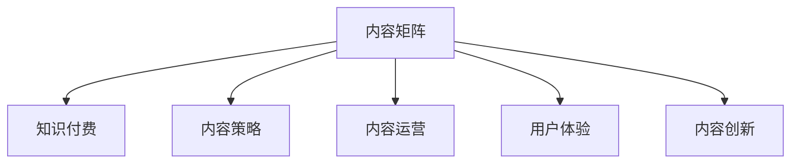

                 

# 知识付费创业中的内容矩阵搭建

## 1. 背景介绍

在知识付费的浪潮中，内容是王道。然而，内容矩阵的搭建并非易事，尤其是对于刚刚起步的知识付费创业者。本文旨在为有志于此领域的朋友们提供一套系统化、结构化的内容矩阵搭建方法，助力大家快速构建起自己的知识付费平台，为读者和用户提供丰富、高质量的内容。

## 2. 核心概念与联系

### 2.1 核心概念概述

- **内容矩阵**：指的是在知识付费平台上，根据不同类型和需求，组织、分类并呈现的内容集合。内容矩阵的搭建，不仅要考虑内容的多样性和深度，还要考虑用户获取内容的便捷性。

- **知识付费**：指通过付费方式获取知识、技能、信息等内容的商业模式。知识付费平台作为知识变现的重要渠道，需要提供高质量、有价值的内容，吸引用户付费订阅。

- **内容策略**：指制定内容矩阵的总体规划和策略，包括内容的来源、类型、分发渠道、推广方式等，是搭建内容矩阵的重要依据。

- **内容运营**：指通过内容策划、内容生产、内容推广等手段，提高内容矩阵的活跃度和用户粘性。

- **用户体验**：指用户在使用知识付费平台时的整体感受和满意度，包括内容的可访问性、易用性、个性化等。

- **内容创新**：指在内容矩阵搭建中引入新颖、独特的内容形式、主题和呈现方式，以吸引和留住用户。

这些核心概念通过如下Mermaid流程图来联系起来：



### 2.2 核心概念原理和架构

内容矩阵的搭建，涉及到内容的创建、组织、呈现和迭代等多个环节，构成了一个完整的生态系统。每个环节都依赖于其他环节，形成一个闭环。

#### A. 内容创建

内容创建是内容矩阵的起点，包括内容选题、内容策划、内容制作等。内容选题需要结合市场需求、用户兴趣和平台定位，确保内容有吸引力、有价值。内容策划则需考虑内容的深度、广度、时效性等，制定详细的内容大纲和生产计划。内容制作则需高质量的文案、视频、音频等形式，以提升用户体验。

#### B. 内容组织

内容组织指的是对内容进行分类、标签和结构化处理，使其易于用户查找和访问。内容分类可根据内容类型（如课程、文章、视频等）、学科领域（如IT、金融、健康等）、难度等级（如初级、中级、高级）等进行划分。标签则需基于关键词、主题、人物等属性进行标记，方便用户筛选。结构化处理则通过目录、标签云、推荐引擎等形式，提高内容浏览的便利性。

#### C. 内容呈现

内容呈现指的是将内容以用户易于理解和消化的形式展示在平台上。这包括内容的排版、布局、交互设计等，以提升用户的使用体验。例如，文章需要分段、加图、添加互动问答等，视频需要提供高清、弹幕、字幕等，音频需要提供多种播放模式和场景优化等。

#### D. 内容迭代

内容迭代是内容矩阵持续优化和创新的重要环节。通过用户反馈、数据分析、市场变化等，不断调整和优化内容，确保内容矩阵的时效性和相关性。例如，根据用户反馈调整内容发布节奏，根据市场趋势调整课程设置，根据数据分析优化推荐算法等。

## 3. 核心算法原理 & 具体操作步骤

### 3.1 算法原理概述

内容矩阵的搭建，可以采用多种算法和策略，主要包括以下几种：

- **聚类算法**：用于对内容进行自动分类和聚类，如K-means聚类、层次聚类等。通过算法对内容进行分组，提高内容的组织和检索效率。
- **推荐算法**：用于根据用户兴趣和行为，推荐相关内容，如协同过滤、基于内容的推荐、混合推荐等。推荐算法可提升内容的可发现性，提高用户粘性。
- **情感分析**：用于分析用户对内容的评价和反馈，如文本情感分析、用户画像分析等。情感分析可帮助了解用户需求和偏好，优化内容策略。
- **流量预测**：用于预测内容发布后的流量和效果，如时间序列分析、机器学习模型等。流量预测可帮助合理规划内容发布，提升平台流量。

### 3.2 算法步骤详解

#### 步骤1：内容选题和策划

内容选题和策划是内容矩阵搭建的基础。需要结合市场需求、用户兴趣、平台定位等多方面因素进行综合考虑。

1. **市场调研**：通过问卷调查、数据分析、竞争对手分析等手段，了解市场和用户需求，确定内容选题。
2. **内容大纲**：制定详细的内容大纲和生产计划，包括内容类型、发布时间、制作周期等，确保内容有序产出。
3. **专家咨询**：邀请行业专家、学者、意见领袖参与内容策划，提供专业指导和意见，提升内容权威性和专业性。

#### 步骤2：内容制作和采集

内容制作和采集是内容矩阵的执行环节，需要确保内容的高质量和多样化。

1. **内容制作**：包括文案、视频、音频等内容的创作和制作。需聘请专业作者、编剧、导演等，确保内容的专业性和吸引力。
2. **内容采集**：通过合作伙伴、第三方平台、用户投稿等方式，获取有价值的内容。需建立严格的内容审核机制，确保内容质量和合规性。

#### 步骤3：内容组织和结构化

内容组织和结构化是内容矩阵的核心环节，需对内容进行分类、标签和结构化处理。

1. **内容分类**：根据内容类型、学科领域、难度等级等因素，将内容进行分类。确保分类科学合理，便于用户查找和访问。
2. **内容标签**：基于关键词、主题、人物等属性，对内容进行标记。确保标签准确全面，提升内容的检索效率。
3. **结构化处理**：通过目录、标签云、推荐引擎等形式，优化内容的展示和交互设计。确保结构化处理方式直观易懂，提升用户体验。

#### 步骤4：内容呈现和迭代

内容呈现和迭代是内容矩阵的优化环节，需不断调整和优化内容，提升内容的活跃度和用户粘性。

1. **内容呈现**：通过排版、布局、交互设计等手段，提高内容的可访问性和可读性。确保内容呈现形式多样，满足不同用户需求。
2. **内容迭代**：通过用户反馈、数据分析、市场变化等手段，不断调整和优化内容。确保内容矩阵的持续优化和创新。

### 3.3 算法优缺点

内容矩阵的搭建，虽然能够提升内容的质量和用户粘性，但也存在以下缺点：

- **成本较高**：内容制作和采集需投入大量人力物力，且需聘请专业作者、专家等，成本较高。
- **内容同质化**：如果内容矩阵构建不合理，可能会导致内容同质化严重，影响用户体验。
- **市场反应滞后**：内容迭代周期较长，市场反应滞后，可能错失机会。

### 3.4 算法应用领域

内容矩阵的搭建，广泛应用于知识付费、在线教育、企业培训等多个领域。例如：

- **知识付费平台**：通过内容矩阵，提供丰富的课程、文章、视频等，满足用户多样化需求，提升平台流量和用户粘性。
- **在线教育平台**：通过内容矩阵，提供系统的课程体系和丰富的学习资源，提升用户学习体验和效果。
- **企业培训平台**：通过内容矩阵，提供专业化的培训课程和实战案例，提升员工技能和职业素养。

## 4. 数学模型和公式 & 详细讲解

### 4.1 数学模型构建

内容矩阵的搭建，涉及多个环节的数学模型构建。以推荐系统为例，常见的数学模型包括协同过滤、基于内容的推荐、混合推荐等。

#### 4.2 公式推导过程

以协同过滤推荐算法为例，其基本思想是通过用户和内容的相似度，推荐相关内容。公式如下：

$$
R_{ui} = \sum_{j \neq i} \alpha_{uj} \times I_{ji} \times P_{uj}
$$

其中，$R_{ui}$为用户$u$对内容$i$的评分，$\alpha_{uj}$为用户$u$对内容$j$的评分，$I_{ji}$为内容$j$和内容$i$的相似度，$P_{uj}$为用户$u$的偏好权重。

#### 4.3 案例分析与讲解

假设某知识付费平台有1000名用户，提供5000门课程。根据用户历史评分和课程相似度，构建协同过滤推荐模型，推荐用户感兴趣的新课程。

通过聚类算法将用户分为不同群组，分别进行推荐。例如，将用户分为技术类用户和商业类用户，分别推荐相关课程。

## 5. 项目实践：代码实例和详细解释说明

### 5.1 开发环境搭建

内容矩阵的搭建，需要开发环境支持。以下是在Python环境下搭建内容矩阵平台的步骤：

1. **安装Python**：选择Python 3.x版本，安装pip包管理工具。
2. **安装Flask**：使用pip安装Flask框架，用于搭建Web平台。
3. **安装Jupyter Notebook**：用于进行数据处理和模型训练。
4. **安装TensorFlow和PyTorch**：用于构建推荐模型。
5. **安装Pandas和NumPy**：用于数据处理和分析。

### 5.2 源代码详细实现

以下是一个简单的内容推荐系统的代码实现：

```python
import pandas as pd
import numpy as np
import tensorflow as tf
import tensorflow_hub as hub
from sklearn.decomposition import TruncatedSVD

# 读取用户评分数据
df = pd.read_csv('user_ratings.csv')

# 构建用户-内容评分矩阵
user_id = df['user_id']
content_id = df['content_id']
rating = df['rating']
user_content_matrix = pd.pivot_table(df, values='rating', index='user_id', columns='content_id', fill_value=0)

# 对评分矩阵进行奇异值分解
svd = TruncatedSVD(n_components=50, random_state=42)
svd.fit(user_content_matrix)

# 构建推荐模型
model = hub.KerasLayer('https://tfhub.dev/google/tensorflow-models/official/bert/bert_en_uncased_L-12_H-768_A-12')

# 预测推荐结果
predictions = model.predict(user_content_matrix)

# 根据预测结果推荐内容
recommendations = []

for i, user_id in enumerate(user_id):
    user_predictions = predictions[i]
    sorted_predictions = np.argsort(user_predictions)[-5:]
    recommendations.append([content_id.iloc[j] for j in sorted_predictions])

# 输出推荐内容
print(recommendations)
```

### 5.3 代码解读与分析

上述代码实现了基于奇异值分解和BERT模型的协同过滤推荐系统。具体分析如下：

1. **数据读取**：从CSV文件中读取用户评分数据。
2. **评分矩阵构建**：将用户评分数据转换为用户-内容评分矩阵，用0填充缺失值。
3. **奇异值分解**：使用TruncatedSVD算法对评分矩阵进行奇异值分解，提取50个主成分。
4. **推荐模型构建**：使用BERT模型进行内容表示，用于计算相似度。
5. **推荐结果预测**：根据用户评分矩阵和内容表示矩阵，预测推荐结果。
6. **推荐内容输出**：根据预测结果，推荐用户最感兴趣的内容。

## 6. 实际应用场景

### 6.1 知识付费平台

知识付费平台是内容矩阵搭建的主要应用场景。例如，某知识付费平台提供多种课程和文章，通过内容矩阵构建，实现个性化推荐，提升用户体验和平台流量。

### 6.2 在线教育平台

在线教育平台通过内容矩阵搭建，提供系统化的课程体系和丰富的学习资源。例如，某在线教育平台提供数学、英语、编程等多种课程，通过内容矩阵推荐，提高用户学习效果和满意度。

### 6.3 企业培训平台

企业培训平台通过内容矩阵搭建，提供专业化的培训课程和实战案例。例如，某企业培训平台提供人力资源管理、市场营销、项目管理等多种课程，通过内容矩阵推荐，提升员工技能和职业素养。

### 6.4 未来应用展望

未来，内容矩阵搭建将进一步向智能化、个性化、社交化方向发展。

1. **智能化**：通过引入AI技术，实现内容生成和推荐算法的自动化，提升内容矩阵的动态性和智能化。
2. **个性化**：通过用户行为数据和反馈，实现内容推荐和内容生成的个性化，提升用户满意度和平台粘性。
3. **社交化**：通过社交网络和互动功能，实现内容的社交化传播和用户互动，增强平台活力和用户参与度。

## 7. 工具和资源推荐

### 7.1 学习资源推荐

1. **《知识付费白皮书》**：由知识付费行业协会发布，系统总结了知识付费行业的发展现状、趋势和挑战。
2. **《内容营销实战手册》**：详细介绍内容矩阵搭建和内容运营的实战技巧和方法。
3. **《用户体验设计》**：讲解如何通过内容呈现和交互设计，提升用户的使用体验。
4. **《机器学习与推荐系统》**：介绍机器学习算法和推荐系统原理，为内容推荐提供技术支持。

### 7.2 开发工具推荐

1. **Flask**：轻量级Web框架，易于搭建和扩展。
2. **Jupyter Notebook**：交互式编程环境，支持数据分析和模型训练。
3. **TensorFlow和PyTorch**：强大的深度学习框架，支持多种模型构建和优化。
4. **Pandas和NumPy**：数据处理和分析工具，支持高效的数据操作和分析。

### 7.3 相关论文推荐

1. **《协同过滤推荐算法》**：详细介绍了协同过滤算法的原理和实现方法，是内容推荐的基础。
2. **《基于内容的推荐系统》**：介绍基于内容的推荐算法，适用于内容矩阵的搭建。
3. **《用户画像和个性化推荐》**：研究用户画像和个性化推荐技术，提升内容推荐的效果。

## 8. 总结：未来发展趋势与挑战

### 8.1 研究成果总结

内容矩阵的搭建，已经成为知识付费和在线教育行业的重要方向。通过系统化的内容策划、生产、组织和推荐，可以实现内容的自动化、个性化、智能化，提升用户体验和平台流量。

### 8.2 未来发展趋势

未来，内容矩阵的搭建将呈现以下几个趋势：

1. **智能化**：引入AI技术，实现内容生成和推荐算法的自动化。
2. **个性化**：通过用户行为数据和反馈，实现内容推荐和内容生成的个性化。
3. **社交化**：通过社交网络和互动功能，实现内容的社交化传播和用户互动。

### 8.3 面临的挑战

内容矩阵的搭建，虽然带来了诸多机遇，但也面临以下挑战：

1. **内容同质化**：内容矩阵构建不合理，可能导致内容同质化严重，影响用户体验。
2. **用户需求变化**：用户需求快速变化，内容矩阵需不断调整和优化。
3. **平台流量获取**：平台流量获取成本较高，需寻找有效的推广和引流手段。

### 8.4 研究展望

未来，内容矩阵的搭建需要进一步优化和创新，以应对不断变化的市场需求和用户期望。研究内容包括：

1. **内容创新**：引入新颖的内容形式和主题，提升内容的吸引力和价值。
2. **用户参与**：通过用户互动和反馈，实现内容矩阵的动态优化和创新。
3. **跨平台推广**：利用多平台资源，扩大内容矩阵的影响力和覆盖面。

## 9. 附录：常见问题与解答

**Q1：内容矩阵搭建的流程和方法是什么？**

A: 内容矩阵的搭建流程包括内容选题和策划、内容制作和采集、内容组织和结构化、内容呈现和迭代等步骤。方法包括聚类算法、推荐算法、情感分析、流量预测等，需根据具体需求进行选择。

**Q2：内容矩阵如何提高用户粘性？**

A: 内容矩阵可以通过个性化推荐、内容创新、互动设计等方式，提升用户粘性。个性化推荐需通过用户行为数据和反馈，实现内容推荐和内容生成的个性化。内容创新需引入新颖的内容形式和主题，提升内容的吸引力和价值。互动设计需通过社交网络和互动功能，实现内容的社交化传播和用户互动。

**Q3：内容矩阵的优缺点是什么？**

A: 内容矩阵的优点包括提升内容的质量和用户粘性，提供多样化和高质量的内容。缺点包括成本较高、内容同质化、市场反应滞后等。

**Q4：内容矩阵在知识付费平台中的应用案例是什么？**

A: 某知识付费平台提供多种课程和文章，通过内容矩阵构建，实现个性化推荐，提升用户体验和平台流量。

**Q5：内容矩阵的未来发展方向是什么？**

A: 内容矩阵的未来发展方向包括智能化、个性化、社交化。智能化需引入AI技术，实现内容生成和推荐算法的自动化。个性化需通过用户行为数据和反馈，实现内容推荐和内容生成的个性化。社交化需通过社交网络和互动功能，实现内容的社交化传播和用户互动。

---

作者：禅与计算机程序设计艺术 / Zen and the Art of Computer Programming

