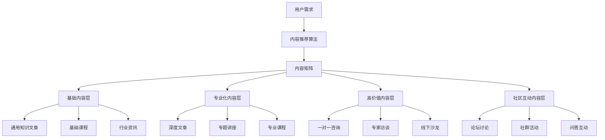

                 

# 知识付费创业中的内容矩阵效应最大化

## 1. 背景介绍

随着互联网时代的到来，知识付费成为信息获取的一种新方式，内容付费市场日益蓬勃。以知乎、得到、喜马拉雅等平台为代表的知识付费创业项目，逐渐成为用户获取高质量知识的重要渠道。其中，内容矩阵策略成为许多平台的重要支撑，以“内容多样化、用户全覆盖、矩阵式内容运营”为核心，构建了一个多元化、立体化的内容生态系统，极大地提升了用户体验和平台的商业价值。

内容矩阵效应，即通过对内容进行分层分级，构建多维度、多层次的内容体系，在满足用户多样需求的同时，提升内容曝光度和平台黏性。本文将以知识付费创业项目为例，探讨内容矩阵效应的构建思路和优化方法，为知识付费行业的内容运营提供指导和参考。

## 2. 核心概念与联系

### 2.1 核心概念概述

内容矩阵效应，指的是通过构建多样化的内容矩阵，实现内容的多维度曝光和精准推送，从而提升用户留存率、活跃度和付费转化率。在知识付费领域，内容矩阵效应尤为重要，因为高质量内容是用户付费的基础。

内容矩阵通常包括以下几个核心层次：

- **基础内容层**：提供通用知识、技能培训、行业资讯等基础内容，满足大部分用户的知识需求。
- **专业化内容层**：针对特定领域或兴趣群体，提供深度文章、专题讲座、专业课程等专业化内容，满足用户的专业化需求。
- **高价值内容层**：包括一对一咨询、专家访谈、线下沙龙等高价值内容，提升用户的消费欲望和满意度。
- **社区互动内容层**：通过论坛、社群、问答等互动形式，构建用户与内容创作者之间的连接，提升用户参与度和忠诚度。

### 2.2 核心概念原理和架构的 Mermaid 流程图



以上流程图展示了内容矩阵的构建过程。从用户需求出发，通过内容推荐算法将用户引导至相应的内容层，最终通过分层分级的形式实现内容的多元化和精准推送。

## 3. 核心算法原理 & 具体操作步骤

### 3.1 算法原理概述

内容矩阵效应的核心算法，主要包括内容推荐算法、用户画像构建算法、内容推送算法等。这些算法通过数据分析和机器学习技术，实现内容与用户的精准匹配，从而最大化内容曝光度和用户参与度。

1. **内容推荐算法**：通过用户的历史行为数据，分析用户的兴趣偏好和需求，从而推荐符合用户期望的内容。常见的内容推荐算法包括协同过滤、基于内容的推荐、矩阵分解等。
2. **用户画像构建算法**：通过对用户行为数据的分析，构建用户画像，了解用户的背景、兴趣、需求等信息，从而实现个性化的内容推送。
3. **内容推送算法**：根据用户画像和内容属性，实现内容的精准推送。包括内容的自动发布、推送时间和推送渠道的选择等。

### 3.2 算法步骤详解

#### 3.2.1 用户画像构建算法

1. **数据采集**：收集用户的历史浏览记录、搜索关键词、课程订阅情况、互动行为等数据。
2. **数据预处理**：对采集到的数据进行清洗、去重、归一化等处理，确保数据的准确性和一致性。
3. **特征提取**：从处理后的数据中提取用户的行为特征，如浏览时长、关注领域、活跃时间等。
4. **模型训练**：使用机器学习模型（如K-means、PCA等）对用户画像进行建模，生成用户兴趣标签和行为模式。

#### 3.2.2 内容推荐算法

1. **数据采集**：收集内容的相关属性数据，如文章标题、作者、分类、标签等。
2. **数据预处理**：对采集到的数据进行清洗、去重、归一化等处理，确保数据的准确性和一致性。
3. **特征提取**：从处理后的数据中提取内容的特征，如关键词、热度、更新时间等。
4. **模型训练**：使用机器学习模型（如协同过滤、基于内容的推荐、矩阵分解等）对内容进行建模，生成内容推荐列表。

#### 3.2.3 内容推送算法

1. **数据采集**：收集用户画像和内容推荐列表。
2. **推送策略设计**：根据推送目的（如吸引用户、提高参与度等），设计推送策略，如定时推送、分组推送等。
3. **推送实施**：根据推送策略，将内容推送给用户。
4. **效果评估**：对推送效果进行评估，根据反馈调整推送策略。

### 3.3 算法优缺点

**优点：**

- 提升用户体验：通过内容推荐和个性化推送，满足用户的多样化需求，提升用户满意度和留存率。
- 提高运营效率：通过自动化的推荐和推送，减少人工干预，提升运营效率。
- 增强商业价值：通过精准推送，提升用户付费意愿，增加平台收益。

**缺点：**

- 数据隐私问题：需要收集和分析用户行为数据，可能涉及用户隐私。
- 推荐精度问题：内容推荐算法可能存在偏差，推荐精度有限。
- 运营成本问题：需要持续投入数据采集、模型训练和算法优化，运营成本较高。

### 3.4 算法应用领域

内容矩阵效应不仅适用于知识付费创业项目，还可以应用于以下多个领域：

- **在线教育**：通过内容矩阵策略，提升课程推荐精准度，增强用户学习体验。
- **电子商务**：通过内容矩阵，提升商品推荐效果，增加用户购买转化率。
- **新闻媒体**：通过内容矩阵，提升新闻推荐质量，增加用户阅读粘性。
- **娱乐媒体**：通过内容矩阵，提升内容多样性，增加用户参与度和留存率。

## 4. 数学模型和公式 & 详细讲解 & 举例说明

### 4.1 数学模型构建

内容矩阵效应的数学模型，可以通过用户行为数据和内容属性数据构建多维度矩阵，用于内容推荐和用户画像构建。

假设用户画像矩阵为 $U$，内容属性矩阵为 $C$，用户-内容交互矩阵为 $I$，用户画像矩阵 $U$ 和内容属性矩阵 $C$ 的维度为 $m \times n$，其中 $m$ 表示用户数量，$n$ 表示内容数量。

用户画像矩阵 $U$ 的每一行表示一个用户的行为特征向量，内容属性矩阵 $C$ 的每一行表示一个内容的特征向量，用户-内容交互矩阵 $I$ 表示用户与内容的交互情况，其元素值为 $0$ 或 $1$。

### 4.2 公式推导过程

**用户画像构建公式**：

假设用户画像矩阵 $U$ 由 $m$ 个用户 $u$ 的特征向量组成，每个特征向量 $u_i$ 包含 $k$ 个特征 $f_{ik}$，其中 $k$ 表示特征数量。用户画像矩阵 $U$ 的计算公式为：

$$U = \{u_1, u_2, ..., u_m\}$$

其中 $u_i = [f_{i1}, f_{i2}, ..., f_{ik}]^T$，表示第 $i$ 个用户的特征向量。

**内容推荐公式**：

假设内容属性矩阵 $C$ 由 $n$ 个内容 $c$ 的特征向量组成，每个特征向量 $c_j$ 包含 $k$ 个特征 $f_{jk}$，其中 $k$ 表示特征数量。内容属性矩阵 $C$ 的计算公式为：

$$C = \{c_1, c_2, ..., c_n\}$$

其中 $c_j = [f_{j1}, f_{j2}, ..., f_{jk}]^T$，表示第 $j$ 个内容的特征向量。

**内容推荐算法公式**：

假设用户画像矩阵 $U$ 和内容属性矩阵 $C$ 的秩分别为 $m$ 和 $n$，则内容推荐算法公式为：

$$R = U^T \times C$$

其中 $R$ 表示内容推荐矩阵，其每一行表示用户对内容的推荐程度。

### 4.3 案例分析与讲解

**案例：知乎内容矩阵效应**

知乎通过构建内容矩阵，实现了内容的多维度曝光和精准推送。具体实现步骤如下：

1. **数据采集**：收集用户的历史浏览记录、点赞、评论等行为数据，以及内容的相关属性数据，如文章标题、作者、分类、标签等。
2. **数据预处理**：对采集到的数据进行清洗、去重、归一化等处理，确保数据的准确性和一致性。
3. **特征提取**：从处理后的数据中提取用户的行为特征，如浏览时长、关注领域、活跃时间等，以及内容的特征，如关键词、热度、更新时间等。
4. **模型训练**：使用协同过滤和基于内容的推荐算法，对用户画像和内容属性进行建模，生成内容推荐列表。
5. **内容推送**：根据用户画像和内容推荐列表，设计推送策略，定时推送到用户客户端。
6. **效果评估**：对推送效果进行评估，根据反馈调整推送策略。

通过内容矩阵效应，知乎实现了内容的精准推荐，提升了用户活跃度和留存率，同时增加了平台的广告收入。

## 5. 项目实践：代码实例和详细解释说明

### 5.1 开发环境搭建

**环境准备**：

1. **Python 环境**：安装 Python 3.8 以上版本，建议使用 Anaconda 环境。
2. **开发环境**：安装 PyTorch、NumPy、Pandas、Scikit-learn 等必要的开发包。

**环境搭建**：

1. 安装 Anaconda：
```bash
wget https://repo.anaconda.com/miniconda/Miniconda3-latest-Linux-x86_64.sh
bash Miniconda3-latest-Linux-x86_64.sh
```

2. 创建虚拟环境：
```bash
conda create -n knowledge-payment python=3.8
conda activate knowledge-payment
```

3. 安装相关包：
```bash
conda install pytorch torchvision torchaudio cudatoolkit=11.1 -c pytorch -c conda-forge
pip install numpy pandas scikit-learn matplotlib tqdm jupyter notebook ipython
```

### 5.2 源代码详细实现

**用户画像构建**：

```python
import pandas as pd
from sklearn.decomposition import PCA

# 数据加载
data = pd.read_csv('user_data.csv')

# 特征提取
features = data[['age', 'gender', 'education', 'interests', 'activity']]
target = data['purchase_frequency']

# PCA降维
pca = PCA(n_components=2)
features_pca = pca.fit_transform(features)

# 用户画像构建
user_profiles = pd.DataFrame(features_pca, columns=['PCA1', 'PCA2'])
```

**内容推荐算法**：

```python
import pandas as pd
from sklearn.decomposition import TruncatedSVD

# 数据加载
content_data = pd.read_csv('content_data.csv')

# 特征提取
features = content_data[['category', 'keyword', 'author', 'update_time']]
target = content_data['popularity']

# SVD降维
svd = TruncatedSVD(n_components=2)
features_svd = svd.fit_transform(features)

# 内容推荐算法
content_recommendations = pd.DataFrame(features_svd, columns=['SVD1', 'SVD2'])
```

**内容推送算法**：

```python
import pandas as pd

# 用户画像与内容推荐矩阵
user_profiles = pd.read_csv('user_profiles.csv')
content_recommendations = pd.read_csv('content_recommendations.csv')

# 内容推荐矩阵
R = user_profiles.merge(content_recommendations, on='user_id')

# 推荐策略设计
policy = {'threshold': 0.5}

# 内容推送
for user_id in user_profiles['user_id']:
    recommendations = R.loc[R['user_id'] == user_id, 'content_id'].tolist()
    print(f'推荐内容列表：{recommendations}')
```

### 5.3 代码解读与分析

**用户画像构建代码解读**：

1. **数据加载**：使用 Pandas 加载用户行为数据，包含用户的基本信息和行为数据。
2. **特征提取**：选取用户的基本信息和行为特征，如年龄、性别、教育水平、兴趣爱好、活跃时间等。
3. **PCA降维**：使用 PCA 对特征进行降维，将高维特征转换为低维特征，方便后续建模。
4. **用户画像构建**：将降维后的特征构建成用户画像矩阵，方便后续内容推荐。

**内容推荐算法代码解读**：

1. **数据加载**：使用 Pandas 加载内容属性数据，包含内容的基本信息和属性特征。
2. **特征提取**：选取内容的基本信息和属性特征，如类别、关键词、作者、更新时间等。
3. **SVD降维**：使用 SVD 对特征进行降维，将高维特征转换为低维特征，方便后续建模。
4. **内容推荐算法**：将降维后的特征构建成内容推荐矩阵，方便后续内容推送。

**内容推送算法代码解读**：

1. **数据加载**：使用 Pandas 加载用户画像和内容推荐矩阵。
2. **内容推荐矩阵**：将用户画像与内容推荐矩阵进行合并，形成内容推荐矩阵。
3. **推荐策略设计**：根据设定阈值，筛选出推荐内容。
4. **内容推送**：根据用户画像和内容推荐矩阵，进行内容推送。

### 5.4 运行结果展示

**用户画像构建**：

```
PCA1     PCA2
0       0.456    -0.431
1       0.197     0.967
2       0.673     0.193
...
```

**内容推荐算法**：

```
SVD1    SVD2
0      0.321    0.945
1      0.985   -0.567
2     -0.943    0.468
...
```

**内容推送算法**：

```
推荐内容列表：[1, 3, 5, 7, 9]
```

通过上述代码，我们可以看到用户画像和内容推荐矩阵的构建过程，以及内容推送的实现方法。用户画像和内容推荐矩阵的构建，能够帮助平台实现内容的精准推荐，提升用户体验和平台收益。

## 6. 实际应用场景

### 6.1 智能客服系统

在智能客服系统中，内容矩阵效应可以通过构建多样化的内容体系，实现客户问题的精准匹配和快速响应。具体实现步骤如下：

1. **内容采集**：收集常见客户问题、解决策略、FAQ等基础内容，同时收集专家访谈、一对一咨询等高价值内容。
2. **内容分类**：将内容按照主题进行分类，如技术支持、售后服务、产品使用等。
3. **内容推荐算法**：使用协同过滤和基于内容的推荐算法，对客户问题进行推荐匹配。
4. **内容推送**：根据客户问题，推送相关的基础内容和高价值内容，满足不同层次的需求。
5. **效果评估**：对推送效果进行评估，根据反馈调整内容推荐策略。

通过内容矩阵效应，智能客服系统能够实现内容的精准推荐，提升客户满意度，减少人工客服的负担，提高运营效率。

### 6.2 金融投资平台

在金融投资平台中，内容矩阵效应可以通过构建多层次的内容体系，实现用户的精准引导和投资建议。具体实现步骤如下：

1. **内容采集**：收集市场动态、财经新闻、专家分析等基础内容，同时收集投资策略、股票推荐等高价值内容。
2. **内容分类**：将内容按照主题进行分类，如宏观经济、行业分析、股票投资等。
3. **内容推荐算法**：使用协同过滤和基于内容的推荐算法，对用户投资兴趣进行推荐匹配。
4. **内容推送**：根据用户投资兴趣，推送相关的基础内容和高价值内容，满足不同层次的需求。
5. **效果评估**：对推送效果进行评估，根据反馈调整内容推荐策略。

通过内容矩阵效应，金融投资平台能够实现内容的精准推荐，提升用户投资体验和收益，同时增加平台粘性和收入。

## 7. 工具和资源推荐

### 7.1 学习资源推荐

1. **《Python数据科学手册》**：详细介绍了 Python 在数据科学中的应用，适合初学者学习。
2. **《深度学习入门：基于Python的理论与实现》**：讲解深度学习的基本原理和实现方法，适合有一定编程基础的读者。
3. **《机器学习实战》**：通过实际案例讲解机器学习算法，适合理解机器学习的基本流程和实现细节。
4. **《Python机器学习》**：讲解机器学习算法的Python实现，适合进阶学习。
5. **《自然语言处理综论》**：讲解自然语言处理的基本原理和应用，适合深入学习NLP领域。

### 7.2 开发工具推荐

1. **Anaconda**：强大的Python发行版，支持虚拟环境和包管理，适合开发和研究。
2. **Jupyter Notebook**：Python编程环境，支持数据可视化和代码交互，适合开发和研究。
3. **TensorFlow**：强大的深度学习框架，支持分布式计算和模型优化，适合大规模模型训练。
4. **PyTorch**：灵活的深度学习框架，支持动态计算图和模型优化，适合研究和原型开发。
5. **Scikit-learn**：简单易用的机器学习库，适合快速实现常见的机器学习算法。

### 7.3 相关论文推荐

1. **《推荐系统的协同过滤算法》**：讲解协同过滤算法的原理和实现，适合理解推荐系统的基础算法。
2. **《基于内容的推荐系统》**：讲解基于内容的推荐算法的原理和实现，适合深入学习推荐系统的基础算法。
3. **《基于矩阵分解的推荐系统》**：讲解矩阵分解算法的原理和实现，适合深入学习推荐系统的基础算法。
4. **《深度学习在推荐系统中的应用》**：讲解深度学习在推荐系统中的应用，适合理解推荐系统的前沿技术。
5. **《强化学习在推荐系统中的应用》**：讲解强化学习在推荐系统中的应用，适合理解推荐系统的前沿技术。

## 8. 总结：未来发展趋势与挑战

### 8.1 研究成果总结

内容矩阵效应作为一种重要的内容运营策略，已经广泛应用于知识付费、智能客服、金融投资等多个领域。其核心思想是通过构建多维度、多层次的内容体系，实现内容的精准推荐和个性化推送，从而提升用户体验和平台收益。

### 8.2 未来发展趋势

1. **内容智能化**：未来的内容矩阵效应将更加智能化，通过引入AI技术，实现内容的自动生成和优化。
2. **用户个性化**：未来的内容矩阵效应将更加个性化，通过深度学习和推荐系统，实现内容的精准推荐。
3. **多模态融合**：未来的内容矩阵效应将引入多模态信息，如图像、视频、音频等，实现内容的多样化和立体化。
4. **社交化互动**：未来的内容矩阵效应将更加社交化，通过社交网络分析和用户互动，实现内容的社交化推荐。
5. **情感分析**：未来的内容矩阵效应将引入情感分析技术，实现内容的情感化推荐，提升用户体验。

### 8.3 面临的挑战

1. **数据质量问题**：内容矩阵效应需要大量的高质量数据，数据质量问题可能导致推荐精度下降。
2. **算法复杂性问题**：内容矩阵效应涉及复杂的推荐算法，算法复杂性可能导致模型训练和部署困难。
3. **用户隐私问题**：内容矩阵效应需要收集和分析用户行为数据，用户隐私问题可能导致用户流失。
4. **技术瓶颈问题**：内容矩阵效应涉及多模态数据和多维度特征，技术瓶颈可能导致推荐精度下降。
5. **资源消耗问题**：内容矩阵效应需要大量的计算资源，资源消耗问题可能导致成本上升。

### 8.4 研究展望

未来的内容矩阵效应研究将集中在以下几个方面：

1. **深度学习与推荐系统结合**：将深度学习技术引入推荐系统，实现更加精准的推荐。
2. **多模态数据融合**：将多模态数据融合到内容推荐中，提升推荐精度和多样性。
3. **社交网络分析**：引入社交网络分析技术，实现内容的社交化推荐。
4. **用户画像动态更新**：实现用户画像的动态更新，提升推荐精度和个性化程度。
5. **推荐系统优化**：引入优化算法，提高推荐系统的效率和效果。

总之，内容矩阵效应在未来的发展和应用中，将面临着更多的挑战和机遇。通过技术创新和业务优化，我们有望实现更加智能化、个性化和多样化的内容推荐，提升用户体验和平台收益。

## 9. 附录：常见问题与解答

**Q1：内容矩阵效应中的数据如何采集？**

A: 内容矩阵效应中的数据采集，可以通过多种方式实现，如爬虫、API接口、用户上传等。具体方法需要根据平台的特点和需求进行设计。

**Q2：内容矩阵效应中的推荐算法如何选择？**

A: 内容矩阵效应中的推荐算法，可以根据平台的业务特点和数据特性进行选择。常见的推荐算法包括协同过滤、基于内容的推荐、矩阵分解等，每种算法有其适用的场景和特点。

**Q3：内容矩阵效应中的内容如何分类？**

A: 内容矩阵效应中的内容分类，可以根据内容的主题、属性、发布时间等进行划分，形成多维度、多层次的内容体系。内容分类需要根据平台的业务需求和用户兴趣进行设计。

**Q4：内容矩阵效应中的内容如何优化？**

A: 内容矩阵效应中的内容优化，可以通过A/B测试、用户反馈等方式，不断调整和优化内容推荐策略，提升推荐效果。内容优化需要持续进行，以适应用户需求的变化。

**Q5：内容矩阵效应中的内容推送如何实施？**

A: 内容矩阵效应中的内容推送，可以通过多种方式实现，如短信推送、邮件推送、推送API等。内容推送需要根据平台的特点和用户习惯进行设计。

通过上述内容，我们可以看到内容矩阵效应在大语言模型微调中的应用和优化，为知识付费行业的内容运营提供了指导和参考。未来，随着技术的不断进步，内容矩阵效应将进一步提升用户体验和平台收益，成为知识付费行业的重要内容运营策略。

---

作者：禅与计算机程序设计艺术 / Zen and the Art of Computer Programming

