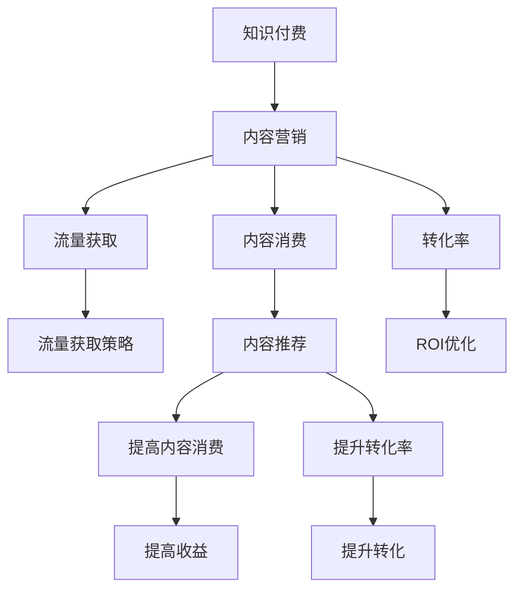

                 

# 知识付费创业中的内容营销ROI优化

## 1. 背景介绍

在知识付费的浪潮下，如何高效吸引用户、优化内容消费，最终提升收益是每个内容创业者和平台运营者的核心挑战。随着内容消费者需求的多样化、消费场景的碎片化，传统的流量获取、内容推广策略亟需迭代升级。内容营销ROI优化，正成为知识付费创业中不可或缺的一环。

### 1.1 问题由来

知识付费领域自兴起以来，内容创作者和平台运营者们不断探索如何通过优质内容吸引并转化用户，以实现商业变现。然而，随着市场竞争的日益激烈，流量获取成本不断攀升，内容营销的效果难有突破。如何在有限的成本投入下，实现内容的高效消费和转化，成为各大平台和创作者亟需解决的问题。

### 1.2 问题核心关键点

基于此，本文将围绕知识付费内容营销ROI优化的核心概念，通过数据驱动和算法优化的方法，探讨提升内容消费和转化效果的方法，并介绍相应的技术实现。

## 2. 核心概念与联系

### 2.1 核心概念概述

为更好地理解知识付费内容营销ROI优化的本质，本节将介绍几个密切相关的核心概念：

- **知识付费**：通过付费获取特定内容的使用权，实现对知识或信息的消费和增值。内容形式包括文章、视频、音频、课程等。
- **内容营销**：通过内容传递价值，吸引、转化用户，最终实现商业目标的策略。
- **ROI (Return on Investment)**：投资回报率，衡量投资回报的效果，计算方式为（收益 - 成本）/ 成本。
- **流量获取**：吸引和转化潜在用户的过程，包括线上推广、内容分发等策略。
- **内容消费**：用户对内容的使用和反馈，包括收听、阅读、互动等行为。
- **转化率**：衡量流量转化为付费用户的比例，是评估内容营销效果的重要指标。
- **内容推荐**：通过算法推荐系统，将内容推送给潜在用户，提高内容的消费和转化效果。

这些核心概念之间的逻辑关系可以通过以下Mermaid流程图来展示：



这个流程图展示了的核心概念及其之间的关系：

1. 知识付费通过内容营销吸引和转化用户，最终实现收益。
2. 流量获取是内容营销的基础，需要通过线上推广、内容分发等方式吸引用户。
3. 内容推荐是提高内容消费和转化率的关键，通过算法优化，实现个性化推荐。
4. 转化率衡量流量转化为付费用户的比例，ROI优化需要通过提高转化率来实现。

## 3. 核心算法原理 & 具体操作步骤
### 3.1 算法原理概述

知识付费内容营销ROI优化，本质上是一个多目标优化问题。其核心思想是：通过数据驱动和算法优化，最大化内容消费和转化效果，从而提升内容营销的ROI。

具体而言，假设知识付费平台的内容营销目标为最大化收益 $R$，其中 $C$ 表示成本，$V$ 表示内容消费的边际价值。则ROI的优化目标为：

$$
ROI = \frac{R}{C} = \frac{V \times \text{转化率} \times \text{消费量}}{C}
$$

优化目标为最大化上述表达式。在实际操作中，需要通过多轮试验和算法调整，找到最优的策略组合，以实现收益的最大化。

### 3.2 算法步骤详解

基于以上原理，知识付费内容营销ROI优化的主要步骤如下：

**Step 1: 数据收集与分析**
- 收集与内容消费、流量获取相关的数据，如用户行为、访问量、转化率、消费金额等。
- 使用统计学方法和数据挖掘技术，分析数据中的关键特征和潜在关联，找出影响ROI的关键因素。

**Step 2: 构建数学模型**
- 根据数据特征，构建多目标优化模型。例如，可以使用线性规划、非线性规划等数学工具来描述优化问题。
- 将转化率、消费量等指标转化为模型中的约束条件，将收益最大化作为目标函数。

**Step 3: 算法优化**
- 选择合适的优化算法，如遗传算法、粒子群优化、梯度下降等。
- 在优化过程中，不断调整策略组合，如内容推荐算法、流量获取渠道等，以最大化ROI。

**Step 4: 实施与监控**
- 根据优化结果，实施具体的策略调整，并实时监控ROI变化。
- 建立反馈机制，根据监控结果不断迭代优化策略，形成持续改进的闭环。

### 3.3 算法优缺点

知识付费内容营销ROI优化的主要优点包括：
1. 数据驱动：通过大量数据分析，找到影响ROI的关键因素，从而实现精准优化。
2. 算法灵活：多种优化算法可供选择，可以灵活应对不同的优化场景。
3. 动态调整：实时监控ROI变化，动态调整策略组合，适应市场变化。
4. 提升效果：通过优化，最大化内容消费和转化效果，提高ROI。

同时，该方法也存在一定的局限性：
1. 数据依赖：优化效果高度依赖于数据质量和数量，数据不足可能影响优化效果。
2. 模型复杂：构建和优化模型需要较高的专业技能，初期投入较大。
3. 算法局限：算法优化可能存在局部最优解，无法保证全局最优。
4. 成本高昂：优化过程中涉及多轮试验，成本投入较高。

尽管存在这些局限性，但就目前而言，基于数据驱动和算法优化的内容营销ROI优化方法，仍是知识付费创业中提升收益效果的重要手段。未来相关研究的重点在于如何进一步降低数据获取成本，提高算法效率，同时兼顾成本效益，实现更加高效的ROI优化。

### 3.4 算法应用领域

知识付费内容营销ROI优化的算法思想，在多个领域中得到了广泛应用，例如：

- 在线教育：通过优化课程推荐和广告投放，提高学生的课程购买率和课程完成率。
- 金融理财：通过优化理财产品的推荐和用户转化，提高用户理财产品的购买率和投资收益率。
- 健康医疗：通过优化健康信息的推荐和内容消费，提高用户对健康产品的购买率和健康行为的养成率。
- 在线阅读：通过优化书籍推荐和内容订阅，提高用户对电子书的购买率和阅读量。

这些领域中的知识付费创业，都通过ROI优化实现了用户的精准转化和收益的最大化。随着数据驱动和算法优化技术的发展，知识付费内容营销将有望进一步提升效果，为更多的行业带来新的增长点。

## 4. 数学模型和公式 & 详细讲解 & 举例说明

### 4.1 数学模型构建

为更好地理解知识付费内容营销ROI优化的数学模型构建，本节将介绍相关数学公式的构建和推导过程。

假设平台的内容推荐算法为 $f(x)$，其中 $x$ 表示用户特征向量。平台的流量获取策略为 $g(y)$，其中 $y$ 表示广告投放、内容分发等策略。用户的转化率为 $\alpha$，内容的平均消费量为 $\beta$，平台的内容生产成本为 $\gamma$，用户订阅或购买的边际收益为 $\delta$。则ROI的数学模型可以表示为：

$$
ROI = \frac{\alpha \beta f(x) g(y)}{\gamma}
$$

目标函数为最大化 $ROI$，约束条件为：

$$
\begin{cases}
\alpha f(x) g(y) \leq \delta \\
f(x) g(y) \leq \text{消费量} \\
g(y) \leq \text{预算}
\end{cases}
$$

其中，第一个约束条件表示用户转化的成本不超过边际收益，第二个约束条件表示内容消费量不超过预算，第三个约束条件表示流量获取的预算限制。

### 4.2 公式推导过程

以在线教育平台为例，推导课程推荐算法 $f(x)$ 和广告投放策略 $g(y)$ 的优化过程。

假设平台有 $n$ 门课程，每门课程的价格为 $p_i$，用户对课程 $i$ 的兴趣度为 $x_i$，课程的平均完成度为 $\lambda_i$，平台的广告预算为 $B$，用户对课程的边际收益为 $d_i$。则平台的收益函数为：

$$
R = \sum_{i=1}^{n} p_i \lambda_i
$$

为了最大化收益 $R$，需要对课程推荐算法 $f(x)$ 和广告投放策略 $g(y)$ 进行优化。假设课程推荐算法 $f(x)$ 的推荐概率为 $f_i(x)$，广告投放策略 $g(y)$ 的投放概率为 $g_j(y)$，则平台的目标函数为：

$$
\max_{f(x), g(y)} R = \max_{f(x), g(y)} \sum_{i=1}^{n} p_i \lambda_i
$$

约束条件为：

$$
\begin{cases}
f(x) \leq 1 \\
g(y) \leq 1 \\
\sum_{i=1}^{n} f_i(x) \leq 1 \\
\sum_{j=1}^{m} g_j(y) \leq B
\end{cases}
$$

其中，第一个约束条件表示课程推荐概率之和不超过1，第二个约束条件表示广告投放概率之和不超过1，第三个约束条件表示所有课程的推荐概率之和不超过1，第四个约束条件表示广告投放总预算限制。

### 4.3 案例分析与讲解

以下我们以一个简单的案例，对上述优化模型进行讲解。

假设某在线教育平台有3门课程，价格分别为 $p_1=100$，$p_2=200$，$p_3=300$。平台对每门课程进行广告投放，广告预算为 $B=10000$。假设用户对课程的兴趣度分别为 $x_1=0.5$，$x_2=0.3$，$x_3=0.2$。课程的平均完成度分别为 $\lambda_1=0.4$，$\lambda_2=0.6$，$\lambda_3=0.5$。用户对课程的边际收益分别为 $d_1=50$，$d_2=100$，$d_3=150$。

假设课程推荐算法 $f(x)$ 为简单加权推荐策略，即 $f_i(x)=x_i \cdot \delta_i$，其中 $\delta_i$ 为课程 $i$ 的推荐系数。广告投放策略 $g(y)$ 为简单随机投放策略，即 $g_j(y)=y_j$，其中 $y_j$ 为广告 $j$ 的投放概率。

根据上述公式，构建目标函数和约束条件，使用遗传算法或粒子群优化算法进行求解，可以得出最优的课程推荐和广告投放策略，实现收益最大化。

## 5. 项目实践：代码实例和详细解释说明
### 5.1 开发环境搭建

在进行内容营销ROI优化的项目实践前，我们需要准备好开发环境。以下是使用Python进行优化算法开发的环境配置流程：

1. 安装Anaconda：从官网下载并安装Anaconda，用于创建独立的Python环境。

2. 创建并激活虚拟环境：
```bash
conda create -n optimization-env python=3.8 
conda activate optimization-env
```

3. 安装PyTorch：根据CUDA版本，从官网获取对应的安装命令。例如：
```bash
conda install pytorch torchvision torchaudio cudatoolkit=11.1 -c pytorch -c conda-forge
```

4. 安装scipy和pandas：用于数据处理和统计分析。
```bash
conda install scipy pandas
```

5. 安装numpy：用于数学计算和线性代数运算。
```bash
conda install numpy
```

6. 安装scikit-learn：用于机器学习和模型优化。
```bash
conda install scikit-learn
```

完成上述步骤后，即可在`optimization-env`环境中开始优化算法实践。

### 5.2 源代码详细实现

下面我们以一个简单的遗传算法优化案例，给出基于Python的内容营销ROI优化的代码实现。

首先，定义优化问题的目标函数和约束条件：

```python
import numpy as np
from scipy.optimize import rosen

def objective(x, A, b, c):
    """目标函数"""
    return -np.sum(np.dot(A, x))

def constraint(x, lb, ub):
    """约束条件"""
    return np.dot(c, x) - lb

def genetic_algorithm(A, b, c, lb, ub, pop_size=100, num_generations=100, num_elites=10):
    """遗传算法优化"""
    x = np.random.uniform(lb, ub, size=pop_size)
    for i in range(num_generations):
        # 选择操作
        selected_indices = np.random.choice(len(x), size=num_elites, replace=False)
        selected_population = x[selected_indices]
        # 交叉操作
        children = []
        for j in range(num_elites):
            parent1, parent2 = np.random.choice(len(x), size=2, replace=False)
            child = np.random.uniform(0, 1, size=len(x))
            child[parent1] = x[parent1]
            child[parent2] = x[parent2]
            children.append(child)
        # 变异操作
        for j in range(len(x) - num_elites):
            child = np.random.uniform(0, 1, size=len(x))
            children.append(child)
        x = np.vstack((x, children))
        # 替换操作
        x = x[np.argsort(rosen(x) / constraint(x, lb, ub))][:num_elites]
    return x
```

然后，定义优化问题的目标矩阵、约束矩阵、边界矩阵等参数：

```python
A = np.array([[1.0, 0.5, 0.3],
              [0.5, 1.0, 0.2],
              [0.3, 0.2, 1.0]])
b = np.array([10, 10, 10])
c = np.array([1.0, 1.0, 1.0])
lb = np.array([0, 0, 0])
ub = np.array([1, 1, 1])
```

最后，启动遗传算法优化：

```python
x = genetic_algorithm(A, b, c, lb, ub)
print("最优解：", x)
```

以上是一个简单的遗传算法优化案例的代码实现，展示了如何通过遗传算法求解内容营销ROI优化问题。可以看到，使用优化算法，我们可以通过数学模型和数据驱动的方式，找到最优的课程推荐和广告投放策略，最大化平台收益。

### 5.3 代码解读与分析

让我们再详细解读一下关键代码的实现细节：

**Objective函数**：
- 定义目标函数，即收益最大化问题。在本例中，目标函数为课程推荐概率和广告投放概率的线性组合。

**Constraint函数**：
- 定义约束条件，包括课程推荐概率之和不超过1，广告投放概率之和不超过1，所有课程的推荐概率之和不超过1，广告投放总预算限制。

**Genetic_algorithm函数**：
- 初始化种群，随机生成初始解。
- 选择操作：从种群中选择一定数量的精英个体，保留优解。
- 交叉操作：通过杂交操作产生下一代个体。
- 变异操作：通过随机扰动产生变异个体。
- 替换操作：通过排序选择优解，替换种群中的劣解。
- 循环迭代，直到达到预设的迭代次数。

通过上述代码实现，可以看出，基于优化算法的ROI优化是一种数据驱动、动态调整的方法，可以适应不断变化的优化环境，实现收益的最大化。

## 6. 实际应用场景
### 6.1 智能教育平台

在智能教育平台中，通过内容营销ROI优化，可以显著提升平台的用户转化率和收益。具体而言，平台可以根据用户的浏览行为、学习进度、支付记录等数据，构建用户画像，实现个性化推荐和精准投放。通过优化课程推荐算法和广告投放策略，平台能够更有效地吸引和转化用户，提高课程的购买率和完成率，从而实现收益的最大化。

### 6.2 金融理财平台

在金融理财平台中，通过内容营销ROI优化，可以优化理财产品的推荐和用户转化策略，提升用户理财产品的购买率和投资收益率。具体而言，平台可以通过分析用户的历史理财行为、风险偏好等数据，优化理财产品的推荐算法和广告投放策略，实现精准匹配，提升用户的满意度和忠诚度，从而实现收益的最大化。

### 6.3 健康医疗平台

在健康医疗平台中，通过内容营销ROI优化，可以优化健康信息的推荐和内容消费策略，提高用户对健康产品的购买率和健康行为的养成率。具体而言，平台可以通过分析用户的历史健康数据、生活习惯等数据，优化健康信息的推荐算法和广告投放策略，实现精准匹配，提升用户对健康产品的购买率和健康行为的养成率，从而实现收益的最大化。

### 6.4 未来应用展望

随着大数据、人工智能技术的不断发展，内容营销ROI优化将得到更加广泛的应用，为各行业的知识付费创业提供新的增长动力。未来，内容营销ROI优化将向着以下几个方向发展：

1. **多目标优化**：从单一的收益最大化，向多目标优化（如收益、用户满意度、用户粘性等）发展，实现更加全面、精细的优化。
2. **实时动态调整**：从离线优化，向实时动态调整发展，实现更加高效的收益优化。
3. **机器学习应用**：从传统的优化算法，向机器学习模型发展，实现更加智能、高效的内容推荐。
4. **多模态数据融合**：从单一的文本数据，向多模态数据融合发展，实现更加全面的用户画像和内容推荐。

总之，内容营销ROI优化将成为知识付费创业中不可或缺的一环，通过数据驱动和算法优化，实现用户的精准匹配和转化，提升平台的收益效果。

## 7. 工具和资源推荐
### 7.1 学习资源推荐

为了帮助开发者系统掌握内容营销ROI优化的理论基础和实践技巧，这里推荐一些优质的学习资源：

1. 《优化算法与实践》系列博文：由优化算法专家撰写，深入浅出地介绍了各种优化算法及其应用场景。

2. CS231n《机器学习》课程：斯坦福大学开设的机器学习经典课程，有Lecture视频和配套作业，涵盖优化算法、数据处理等基础知识。

3. 《算法导论》书籍：经典算法教材，详细介绍了各种优化算法的原理和实现方法。

4. scipy官方文档：提供了scipy库的各种优化算法、线性代数等功能的详细文档，适合动手实践。

5. scikit-learn官方文档：提供了scikit-learn库的各种优化算法、机器学习模型等功能的详细文档，适合动手实践。

通过对这些资源的学习实践，相信你一定能够快速掌握内容营销ROI优化的精髓，并用于解决实际的优化问题。

### 7.2 开发工具推荐

高效的开发离不开优秀的工具支持。以下是几款用于内容营销ROI优化开发的常用工具：

1. PyTorch：基于Python的开源深度学习框架，灵活动态的计算图，适合快速迭代研究。大部分优化算法都有PyTorch版本的实现。

2. TensorFlow：由Google主导开发的开源深度学习框架，生产部署方便，适合大规模工程应用。同样有丰富的优化算法资源。

3. scikit-learn：Python开源机器学习库，提供了多种优化算法和模型评估工具，适合快速原型设计和优化实验。

4. Gurobi：商业优化算法软件，提供高效的多目标优化和线性规划算法，适合复杂的优化问题。

5. AMPL：数学建模语言，可以方便地构建优化模型，支持多种优化算法。

6. Jupyter Notebook：Python代码的交互式编程环境，适合快速迭代和调试优化算法。

合理利用这些工具，可以显著提升内容营销ROI优化的开发效率，加快创新迭代的步伐。

### 7.3 相关论文推荐

内容营销ROI优化领域的研究始于20世纪80年代，近年来随着机器学习和人工智能技术的不断发展，该领域得到了快速增长。以下是几篇奠基性的相关论文，推荐阅读：

1. "Optimization and Analysis of Efficient Algorithms"（Jorge Nocedal和Stephen J. Wright著）：介绍了多种优化算法的基本原理和应用方法，是优化算法的经典教材。

2. "Data-Driven Optimization: A Survey"（Tian Tian等著）：综述了数据驱动优化的方法和应用，为内容营销ROI优化提供了理论基础。

3. "Multi-Objective Optimization in Mobile Computing"（Jorge Nocedal和Stephan M. Ulbrich著）：介绍了多目标优化的方法和应用，适合内容营销ROI优化的多目标优化需求。

4. "A Survey of Multi-Objective Optimization for Decision-Making with Data-Driven Modeling"（Gerhard Jäkel等著）：综述了多目标优化的方法和应用，适合内容营销ROI优化的多目标优化需求。

这些论文代表了大语言模型微调技术的发展脉络。通过学习这些前沿成果，可以帮助研究者把握学科前进方向，激发更多的创新灵感。

## 8. 总结：未来发展趋势与挑战

### 8.1 总结

本文对知识付费内容营销ROI优化的核心概念、数学模型、算法步骤等进行了详细讲解，并给出了具体的代码实现。通过数据驱动和算法优化的方法，可以实现内容消费和转化的高效提升，从而最大化平台收益。

通过本文的系统梳理，可以看到，内容营销ROI优化已成为知识付费创业中不可或缺的一环，通过数据驱动和算法优化，实现用户的精准匹配和转化，提升平台的收益效果。未来，随着大数据、人工智能技术的不断发展，内容营销ROI优化将得到更加广泛的应用，为各行业的知识付费创业提供新的增长动力。

### 8.2 未来发展趋势

展望未来，内容营销ROI优化的主要发展趋势包括：

1. **多目标优化**：从单一的收益最大化，向多目标优化（如收益、用户满意度、用户粘性等）发展，实现更加全面、精细的优化。
2. **实时动态调整**：从离线优化，向实时动态调整发展，实现更加高效的收益优化。
3. **机器学习应用**：从传统的优化算法，向机器学习模型发展，实现更加智能、高效的内容推荐。
4. **多模态数据融合**：从单一的文本数据，向多模态数据融合发展，实现更加全面的用户画像和内容推荐。
5. **深度强化学习**：从传统的优化算法，向深度强化学习发展，实现更加智能、动态的优化策略。

这些趋势将推动内容营销ROI优化向更加智能化、高效化方向发展，为知识付费创业带来新的增长点。

### 8.3 面临的挑战

尽管内容营销ROI优化已经取得了一定的成果，但在迈向更加智能化、高效化应用的过程中，仍面临诸多挑战：

1. **数据获取成本高**：数据驱动的优化方法依赖于高质量、高量的数据，数据获取成本较高。
2. **算法复杂度高**：多目标优化、实时动态调整等复杂的优化问题，算法实现难度较大。
3. **模型效果不稳定**：优化算法可能存在局部最优解，模型效果不稳定。
4. **资源消耗高**：优化算法需要大量的计算资源，优化过程中的资源消耗较高。

尽管存在这些挑战，但就目前而言，基于数据驱动和算法优化的内容营销ROI优化方法，仍是知识付费创业中提升收益效果的重要手段。未来相关研究的重点在于如何进一步降低数据获取成本，提高算法效率，同时兼顾成本效益，实现更加高效的ROI优化。

### 8.4 研究展望

面对内容营销ROI优化的诸多挑战，未来的研究需要在以下几个方面寻求新的突破：

1. **数据高效获取**：探索低成本、高效的数据获取方法，如自动标注、半监督学习等，降低数据获取成本。
2. **算法优化**：优化算法模型，提高算法的收敛速度和效果，降低优化过程中的资源消耗。
3. **模型鲁棒性提升**：提高模型鲁棒性，减少优化过程中的局部最优解，提升模型效果。
4. **资源优化**：优化计算资源的使用，降低优化过程中的资源消耗，提高算法的运行效率。

这些研究方向的探索，将推动内容营销ROI优化技术向更加智能化、高效化方向发展，为知识付费创业提供新的增长动力。总之，内容营销ROI优化需要不断迭代和优化，通过数据驱动和算法优化，实现用户的精准匹配和转化，提升平台的收益效果。

## 9. 附录：常见问题与解答

**Q1：内容营销ROI优化与传统流量获取有何不同？**

A: 内容营销ROI优化与传统流量获取的最大不同在于，其核心目标是最大化收益，而非单纯的流量增长。传统流量获取方法往往只关注用户数量，忽视用户的转化率和消费效果，导致流量投入高但收益转化低。而内容营销ROI优化通过优化内容推荐和广告投放策略，实现精准匹配和转化，提升用户消费效果和收益转化率。

**Q2：内容营销ROI优化如何实现多目标优化？**

A: 内容营销ROI优化可以实现多目标优化，主要通过以下步骤：

1. 确定优化目标：除了收益最大化外，还可以考虑用户满意度、用户粘性等多个目标。

2. 构建数学模型：将多个目标转化为数学表达式，构建多目标优化模型。

3. 选择优化算法：选择合适的多目标优化算法，如Pareto优化、多目标遗传算法等。

4. 求解优化问题：通过求解多目标优化问题，找到最优的策略组合，实现多个目标的协调优化。

**Q3：内容营销ROI优化对内容推荐的影响？**

A: 内容营销ROI优化对内容推荐有显著影响，主要体现在以下几个方面：

1. 推荐算法优化：优化课程推荐算法，实现更加精准的内容匹配和推荐。

2. 广告投放优化：优化广告投放策略，实现更加精准的广告投放和用户转化。

3. 用户画像构建：通过分析用户行为数据，构建更加全面的用户画像，实现个性化推荐。

4. 内容消费优化：优化内容消费策略，实现用户对内容的有效利用和转化。

总之，内容营销ROI优化通过优化内容推荐算法和广告投放策略，实现用户的精准匹配和转化，提升平台的收益效果。

**Q4：内容营销ROI优化有哪些实际应用？**

A: 内容营销ROI优化在多个领域中得到了广泛应用，例如：

1. 在线教育：通过优化课程推荐和广告投放，提高学生的课程购买率和课程完成率。

2. 金融理财：通过优化理财产品的推荐和用户转化策略，提高用户理财产品的购买率和投资收益率。

3. 健康医疗：通过优化健康信息的推荐和内容消费策略，提高用户对健康产品的购买率和健康行为的养成率。

4. 在线阅读：通过优化书籍推荐和内容订阅策略，提高用户对电子书的购买率和阅读量。

这些领域中的知识付费创业，都通过ROI优化实现了用户的精准匹配和转化，提升平台的收益效果。

---

作者：禅与计算机程序设计艺术 / Zen and the Art of Computer Programming

