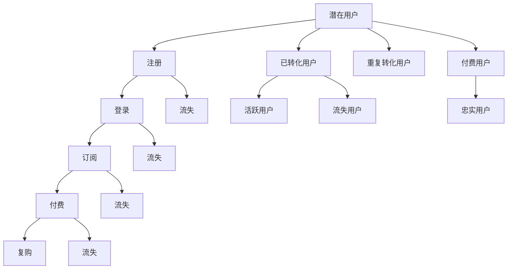

                 

# 知识付费创业中的用户激活策略

## 1. 背景介绍

在知识付费的浪潮中，越来越多的内容创作者和企业希望能够通过在线平台获得商业化收入。然而，面对激烈的市场竞争和众多用户需求，如何高效地将潜在用户转化为忠实订阅者，成为知识付费创业中的关键问题。本文将从用户激活策略的多个维度，系统探讨如何制定有效的策略，提升平台的订阅用户数量和用户粘性。

## 2. 核心概念与联系

### 2.1 核心概念概述

- **用户激活(User Acquisition)**：指将潜在用户转化为平台订阅者的过程。用户激活的核心目标是提高新用户的注册和订阅转化率，从而提升平台的活跃用户数和收入。

- **漏斗模型(Funnel Model)**：以用户行为为依据，将用户转化过程拆分为多个阶段，如“注册-登录-订阅-付费-复购”等。通过监测各个阶段的用户流失率，识别瓶颈并进行优化。

- **A/B测试(A/B Testing)**：通过将用户随机分为两组，分别进行不同的策略实验，比较各组之间的转化效果，以科学的方式选择最佳策略。

- **用户细分(User Segmentation)**：根据用户特征或行为，将用户划分为不同的细分群体，针对不同群体设计定制化激活策略。

- **用户生命周期管理(Lifecycle Management)**：通过监测用户生命周期各阶段的关键行为，预测用户流失风险，并采取措施促进用户续订和忠诚度提升。

### 2.2 核心概念原理和架构的 Mermaid 流程图



这个流程图展示了从潜在用户到忠实用户的全生命周期，并标识了每个阶段可能出现的流失节点。通过漏斗模型，我们可以明确各个阶段的用户转化率，进而针对性优化用户激活策略。

## 3. 核心算法原理 & 具体操作步骤

### 3.1 算法原理概述

用户激活策略的核心在于通过多渠道、多策略的综合运用，提升用户注册和订阅转化率。核心算法原理包括：

- **用户特征分析**：通过数据分析工具，挖掘用户行为、兴趣、地理位置等特征，构建用户画像。
- **个性化推荐**：基于用户画像，推荐个性化的内容或优惠，提高用户的体验和转化率。
- **用户细分策略**：根据用户行为特征，将用户划分为不同的细分群体，制定定制化的激活策略。
- **A/B测试**：通过多版本测试，选择最佳策略，优化用户激活效果。

### 3.2 算法步骤详解

#### 3.2.1 用户特征分析

1. **数据采集**：
   - **行为数据**：包括用户在平台上的浏览记录、搜索行为、点击率等。
   - **交易数据**：如用户的支付记录、订阅记录等。
   - **用户输入**：用户在注册和登录时的信息，如年龄、性别、兴趣等。

2. **数据清洗**：去除噪声数据，填补缺失值，保证数据的质量和一致性。

3. **特征工程**：
   - **特征提取**：从采集到的数据中提取有用的特征，如用户活跃时间、内容消费频率等。
   - **特征选择**：通过特征重要性评估，选择对用户激活有显著影响的关键特征。

4. **用户画像构建**：
   - **用户聚类**：使用聚类算法将用户划分为不同的群体，如“高活跃用户”、“潜在用户”等。
   - **用户分群**：根据用户特征进行分层，如“付费用户”、“免费用户”、“流失用户”等。

#### 3.2.2 个性化推荐

1. **推荐算法**：
   - **协同过滤**：基于用户行为数据，推荐相似用户可能感兴趣的内容。
   - **内容推荐**：基于内容标签，推荐相关主题或文章。
   - **混合推荐**：结合多种算法，提高推荐的准确性和多样性。

2. **推荐策略**：
   - **内容前置**：在用户登录或浏览界面，推荐热门或相关内容。
   - **优惠推送**：根据用户行为和付费历史，推送个性化优惠券或优惠活动。
   - **个性化营销**：针对不同用户群体，设计定制化推广文案和广告。

#### 3.2.3 用户细分策略

1. **细分维度**：
   - **行为维度**：如用户的活跃时间、访问频率等。
   - **人口统计维度**：如年龄、性别、职业等。
   - **付费维度**：如用户的付费历史、订阅时长等。

2. **细分方法**：
   - **基于规则**：根据预先设定的规则进行用户分类，如购买金额达到一定阈值的用户。
   - **基于模型**：使用聚类算法、决策树等机器学习模型，自动识别用户细分。

3. **策略定制**：
   - **针对新用户**：提供注册引导、试用优惠等策略。
   - **针对潜在用户**：通过邮件、短信等方式进行激活提醒。
   - **针对流失用户**：发送关怀邮件、个性化内容推荐等策略。

#### 3.2.4 A/B测试

1. **实验设计**：
   - **控制组和实验组**：将用户随机分为两组，一组为控制组，另一组为实验组。
   - **指标选择**：如注册转化率、订阅转化率等关键指标。

2. **实验执行**：
   - **策略实施**：在实验组中实施新的激活策略，如优化页面布局、调整推荐算法等。
   - **数据收集**：持续监测两组用户的指标变化，记录实验结果。

3. **结果分析**：
   - **效果评估**：统计实验组和控制组的关键指标差异，判断新策略的效果。
   - **最佳选择**：选择表现最佳的新策略，进行全面推广。

### 3.3 算法优缺点

#### 3.3.1 优点

1. **数据驱动决策**：通过用户行为数据分析，能够更科学地制定激活策略，避免盲目推广。
2. **精准定位用户**：用户细分和个性化推荐能够更精准地定位目标用户，提高转化率。
3. **持续优化**：A/B测试能够持续监测新策略的效果，快速迭代优化。

#### 3.3.2 缺点

1. **数据隐私问题**：用户特征分析需要采集大量用户数据，存在隐私泄露风险。
2. **高昂成本**：构建详细的用户画像和实施复杂的策略，需要投入大量资源和时间。
3. **复杂度提升**：用户分群和个性化推荐增加了系统的复杂度，维护成本较高。

### 3.4 算法应用领域

用户激活策略在知识付费平台、在线教育、企业CRM等领域均有广泛应用。以知识付费平台为例，以下场景中该策略尤为关键：

1. **内容推荐**：
   - **推荐策略**：通过个性化推荐，提高用户粘性，降低流失率。
   - **推荐内容**：根据用户兴趣和历史行为，推荐高质量内容。

2. **优惠活动**：
   - **优惠设计**：提供限时优惠、会员专属优惠等，吸引用户注册和订阅。
   - **活动执行**：通过邮件、APP推送等方式，通知用户参与优惠活动。

3. **用户关怀**：
   - **关怀邮件**：定期向用户发送关怀邮件，提醒用户续费和参加活动。
   - **个性化内容**：根据用户行为和兴趣，推送相关内容和活动。

## 4. 数学模型和公式 & 详细讲解 & 举例说明

### 4.1 数学模型构建

用户激活的核心模型包括用户行为模型和推荐模型。以用户行为模型为例，假设平台用户总数为$N$，注册用户数为$N_1$，活跃用户数为$N_2$，流失用户数为$N_3$，则用户激活率$A$可以表示为：

$$
A = \frac{N_2}{N} = \frac{N_2 - N_3}{N} + \frac{N_3}{N}
$$

其中，$N_2 - N_3$表示从新用户中成功转化的活跃用户数，$N_3$表示流失用户数。

### 4.2 公式推导过程

以用户流失模型为例，设用户流失率$R$，第$i$天流失的概率为$p_i$，则第$i$天存活概率为$1-p_i$。根据马尔科夫链的原理，第$T$天存活的概率为：

$$
P(T) = (1-p_1)(1-p_2)\cdots(1-p_T)
$$

流失用户数$N_3$则可以通过当前存活用户数$N_2$和未来流失概率计算得到：

$$
N_3 = N_2 \times (1 - P(T))
$$

通过上述公式，可以预测未来流失用户数，从而制定有效的用户关怀和复购策略。

### 4.3 案例分析与讲解

**案例：某知识付费平台用户激活策略**

1. **用户特征分析**：
   - **数据采集**：收集用户注册、登录、浏览、购买等行为数据。
   - **数据清洗**：去除异常数据，填补缺失值。
   - **特征提取**：提取用户活跃时间、浏览时长、付费频率等关键特征。
   - **用户画像**：使用聚类算法将用户分为高活跃用户和潜在流失用户。

2. **个性化推荐**：
   - **推荐算法**：使用协同过滤和内容推荐相结合的算法。
   - **推荐策略**：在用户登录和浏览界面推荐相关内容，并提供个性化优惠券。

3. **用户细分策略**：
   - **细分维度**：根据活跃时间、付费历史、访问频率等维度进行用户细分。
   - **策略定制**：针对新用户提供注册引导和试用优惠，针对潜在流失用户进行关怀邮件和个性化推荐。

4. **A/B测试**：
   - **实验设计**：将用户分为两组，分别实施不同的推荐策略。
   - **实验执行**：记录两组用户的注册和订阅转化率。
   - **结果分析**：选择表现最佳策略，进行全面推广。

通过上述策略，该平台实现了显著的用户激活效果，订阅用户数量和活跃度大幅提升。

## 5. 项目实践：代码实例和详细解释说明

### 5.1 开发环境搭建

1. **环境准备**：
   - **操作系统**：Windows/Linux/MacOS。
   - **编程语言**：Python。
   - **依赖库**：Pandas、NumPy、Scikit-Learn、TensorFlow。

2. **开发工具**：
   - **IDE**：Jupyter Notebook、PyCharm。
   - **数据库**：MySQL、MongoDB。

3. **开发框架**：
   - **Web框架**：Flask、Django。
   - **推荐引擎**：TensorFlow Recommenders。

4. **数据存储和处理**：
   - **数据库**：PostgreSQL、MongoDB。
   - **数据处理工具**：Apache Spark、Hadoop。

### 5.2 源代码详细实现

**用户特征分析**

```python
import pandas as pd
import numpy as np
from sklearn.cluster import KMeans
from sklearn.preprocessing import StandardScaler

# 读取数据
df = pd.read_csv('user_data.csv')

# 数据清洗
df.dropna(subset=['user_id', 'active_time', 'purchase_frequency'], inplace=True)

# 特征选择
df = df[['user_id', 'active_time', 'purchase_frequency']]

# 特征标准化
scaler = StandardScaler()
df_scaled = scaler.fit_transform(df)

# 用户聚类
kmeans = KMeans(n_clusters=3, random_state=42)
kmeans.fit(df_scaled)

# 用户分群
df['user_group'] = kmeans.labels_
```

**个性化推荐**

```python
import tensorflow as tf
from tensorflow_recommenders import models, utils
from tensorflow_recommenders.layers import CrossEntropyLoss

# 构建推荐模型
model = models.Sequential([
    utils.EmbeddingUserVectorizer(input_dim=1000, embedding_dim=64),
    utils.Sequential([
        tf.keras.layers.Dense(128, activation='relu'),
        tf.keras.layers.Dropout(0.2),
        utils.Sequential([
            CrossEntropyLoss(),
            tf.keras.layers.Dense(10, activation='softmax')
        ])
    ])
])

# 训练推荐模型
model.compile(optimizer='adam', loss='categorical_crossentropy')
model.fit(train_data, epochs=10, batch_size=64)
```

**用户细分策略**

```python
import pandas as pd
import numpy as np

# 读取用户数据
df = pd.read_csv('user_data.csv')

# 用户细分
df['user_group'] = np.where(df['purchase_frequency'] > 10, 1, 0)
df['user_group'] = np.where(df['active_time'] < 30, 2, df['user_group'])
df['user_group'] = np.where(df['user_group'] == 0, 3, df['user_group'])

# 保存细分结果
df.to_csv('user_groups.csv', index=False)
```

**A/B测试**

```python
import pandas as pd
import numpy as np
import random

# 读取数据
df = pd.read_csv('user_data.csv')

# 随机分组
def group_func(row):
    return random.randint(0, 1)

df['group'] = df.apply(group_func, axis=1)

# 实验组和控制组
exp_group = df[df['group'] == 1]
control_group = df[df['group'] == 0]

# 计算转化率
exp_rate = exp_group['registered'].sum() / len(exp_group)
control_rate = control_group['registered'].sum() / len(control_group)

print(f'实验组转化率：{exp_rate}')
print(f'控制组转化率：{control_rate}')
```

### 5.3 代码解读与分析

**用户特征分析**

1. **数据采集**：
   - 使用Pandas读取用户数据，进行初步清洗，去除异常值和缺失值。

2. **数据标准化**：
   - 使用Scikit-Learn的StandardScaler对特征进行标准化，消除特征之间的尺度差异，提高模型的收敛速度和准确性。

3. **用户聚类**：
   - 使用KMeans算法将用户聚类为不同的群体，以便后续制定定制化策略。

4. **用户分群**：
   - 根据用户活跃时间和付费频率等特征，将用户划分为不同的群体，如高活跃用户、潜在流失用户等。

**个性化推荐**

1. **模型构建**：
   - 使用TensorFlow构建推荐模型，包含嵌入层、全连接层和输出层。
   - 使用CrossEntropyLoss作为损失函数，优化器为Adam，训练10个epochs。

2. **推荐策略**：
   - 在用户登录和浏览界面，推荐相关内容和优惠券，提升用户体验和转化率。

**用户细分策略**

1. **用户细分**：
   - 根据用户购买频率和活跃时间等特征，将用户划分为不同的群体，如高价值用户、潜在流失用户等。
   - 使用Numpy进行高效的数组操作，实现快速的分群处理。

**A/B测试**

1. **分组实验**：
   - 使用Pandas和Numpy对用户进行随机分组，分别实施不同的激活策略。
   - 记录两组用户的注册转化率，进行对比分析。

通过上述代码实例，读者可以更加直观地理解用户激活策略的实现过程，并从中获取实际应用的灵感。

## 6. 实际应用场景

### 6.1 智能客服系统

在智能客服系统中，用户激活策略可以显著提升客户体验和满意度。通过个性化推荐和用户细分，智能客服系统可以自动推荐相关产品和服务，提高用户满意度和复购率。

### 6.2 电子商务平台

电子商务平台可以借助用户激活策略，提高新用户的注册和订阅转化率。通过个性化推荐和优惠券等策略，引导用户完成购买流程，提升平台的销售额和用户粘性。

### 6.3 在线教育平台

在线教育平台可以通过用户激活策略，提高新用户的注册和订阅转化率。通过个性化推荐和内容优化，吸引用户参与课程学习，提升平台的用户粘性和长期价值。

### 6.4 未来应用展望

未来，用户激活策略将更多地融入人工智能和大数据分析技术，实现更智能、更高效的用户管理。结合自然语言处理、图像识别等技术，平台可以更精准地分析用户行为，提供更加个性化的推荐和服务。同时，大数据和机器学习技术的应用，将使得用户细分和策略定制更加精准，进一步提升用户激活效果。

## 7. 工具和资源推荐

### 7.1 学习资源推荐

1. **《数据分析实战：Python篇》**：介绍了使用Python进行数据分析的基本方法和工具，适合初学者和中级用户。
2. **《TensorFlow实战》**：详细介绍了TensorFlow的框架结构和应用实例，适合深度学习初学者。
3. **《推荐系统实战》**：介绍了推荐系统的原理和实现方法，适合从事推荐算法开发的开发者。

### 7.2 开发工具推荐

1. **Jupyter Notebook**：适用于数据科学和机器学习的交互式编程环境，支持Python和多种数据格式。
2. **Flask**：轻量级的Web框架，适合快速开发和部署Web应用。
3. **TensorFlow**：强大的深度学习框架，支持分布式计算和模型优化。
4. **MongoDB**：开源的NoSQL数据库，适合存储和处理非结构化数据。

### 7.3 相关论文推荐

1. **《用户行为模型和推荐系统》**：介绍了用户行为模型和推荐系统的基本原理和实现方法。
2. **《A/B测试：数据驱动的决策科学》**：介绍了A/B测试的基本原理和应用场景，适合了解测试数据分析和结果评估。
3. **《个性化推荐算法》**：介绍了个性化推荐算法的种类和实现方法，适合了解推荐系统的算法设计和优化。

## 8. 总结：未来发展趋势与挑战

### 8.1 研究成果总结

用户激活策略作为知识付费平台的关键技术，已经在实际应用中取得了显著的效果。通过数据驱动和个性化推荐，平台能够高效地吸引和保留用户，提升平台的用户粘性和长期价值。未来，用户激活策略将与人工智能和大数据分析技术深度结合，实现更智能、更高效的用户管理。

### 8.2 未来发展趋势

1. **数据驱动决策**：未来，随着数据收集和处理的智能化，用户激活策略将更加依赖数据驱动的决策。数据采集和分析技术的发展，将使得策略制定更加精准和高效。
2. **个性化推荐**：个性化推荐技术将不断进步，基于用户行为和偏好，提供更加精准和个性化的推荐服务。自然语言处理和图像识别技术的应用，将使得推荐系统更加智能化。
3. **实时优化**：未来，用户激活策略将实现实时优化，通过持续监控用户行为，及时调整和优化策略，提升用户满意度和转化率。
4. **多渠道融合**：未来，用户激活策略将更加注重多渠道的融合，通过社交媒体、邮件、短信等多种渠道，实现更加全面的用户管理。

### 8.3 面临的挑战

1. **数据隐私问题**：用户特征分析和个性化推荐需要采集大量用户数据，存在隐私泄露风险。如何平衡数据利用和隐私保护，是未来需要重点解决的问题。
2. **模型复杂度提升**：个性化推荐和用户细分策略的实现需要复杂的算法和模型，维护成本较高。如何简化模型，提升系统可扩展性，是未来需要重点关注的问题。
3. **用户粘性提升**：如何持续提升用户粘性，降低流失率，是未来用户激活策略的关键挑战。

### 8.4 研究展望

未来，用户激活策略的研究将更加注重数据隐私保护和模型优化。通过分布式计算和联邦学习技术，可以在不泄露用户隐私的前提下，进行大规模数据分析和模型训练。同时，结合因果推断和强化学习技术，可以实现更加智能和动态的用户激活策略。

总之，用户激活策略作为知识付费平台的核心技术，将在未来持续发展和优化，助力平台提升用户粘性和长期价值，为知识付费产业带来新的增长动力。

## 9. 附录：常见问题与解答

**Q1：如何评估用户激活策略的效果？**

A: 用户激活策略的效果评估通常通过以下指标进行：
1. **注册转化率**：新用户注册为平台订阅用户的比例。
2. **订阅转化率**：潜在用户订阅平台服务的比例。
3. **活跃用户比例**：长期活跃用户的比例。
4. **用户留存率**：用户连续多天登录或使用平台的比例。
5. **付费转化率**：潜在用户完成付费交易的比例。

通过对比实验组和控制组的这些指标，可以评估用户激活策略的效果。

**Q2：用户细分策略如何选择关键特征？**

A: 用户细分策略的关键特征选择需要基于用户行为和兴趣分析，通常选择与用户活跃和转化直接相关的特征，如：
1. **用户活跃时间**：用户登录和浏览平台的时间规律。
2. **内容消费频率**：用户对不同内容的热爱程度。
3. **付费历史**：用户的付费行为和历史。
4. **地理位置**：用户的地理位置，有助于区域化定制策略。

选择关键特征时，需要结合平台业务特点和用户行为数据，通过数据分析和特征工程，逐步优化特征选择策略。

**Q3：用户激活策略如何进行A/B测试？**

A: 用户激活策略的A/B测试主要包括以下步骤：
1. **分组**：将用户随机分为两组，一组为控制组，另一组为实验组。
2. **策略实施**：在实验组中实施新的激活策略，如优化页面布局、调整推荐算法等。
3. **数据收集**：记录两组用户的注册和订阅转化率。
4. **结果分析**：统计两组用户的指标差异，选择表现最佳策略。

A/B测试应使用科学的方法和工具，如统计学原理和A/B测试平台，确保实验结果的科学性和准确性。

**Q4：如何应对用户数据隐私问题？**

A: 用户数据隐私保护是用户激活策略中的重要问题，主要通过以下方法解决：
1. **数据匿名化**：在数据处理过程中，使用数据脱敏和匿名化技术，保护用户隐私。
2. **合规管理**：遵守数据隐私法律法规，如GDPR、CCPA等，确保数据使用的合规性。
3. **透明度提升**：向用户透明化数据收集和使用的目的，获得用户的知情同意。
4. **加密存储**：使用加密技术保护用户数据在存储和传输过程中的安全。

通过这些措施，可以在确保用户数据隐私的前提下，进行用户特征分析和个性化推荐。

**Q5：用户激活策略如何应对用户粘性下降问题？**

A: 用户粘性下降是用户激活策略面临的重要挑战，主要通过以下方法解决：
1. **持续优化内容**：根据用户反馈和行为数据，持续优化平台内容和用户体验。
2. **提供个性化服务**：通过个性化推荐和专属优惠，提升用户满意度和体验。
3. **用户关怀活动**：定期开展用户关怀活动，如优惠券、生日礼物等，提升用户粘性。
4. **社区互动**：建立用户社区，促进用户之间的交流和互动，增强用户归属感。

通过这些方法，可以持续提升用户粘性，降低流失率，保持平台的用户活跃度和长期价值。

---

作者：禅与计算机程序设计艺术 / Zen and the Art of Computer Programming

