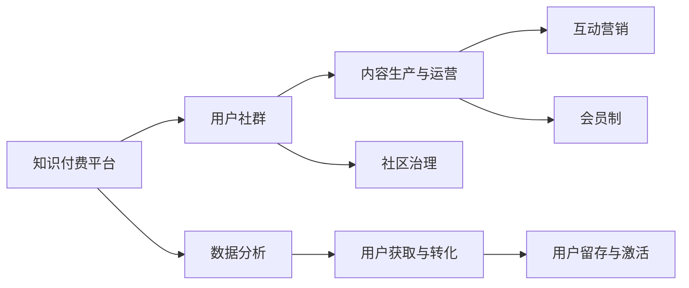

                 

# 知识付费创业中的用户社群运营

> 关键词：知识付费, 用户社群, 用户运营, 社区治理, 互动营销, 会员制, 数据分析

## 1. 背景介绍

### 1.1 问题由来
随着互联网的普及和信息技术的快速发展，知识付费市场在过去几年里得到了迅猛增长。各类知识付费平台，如得到、喜马拉雅、猿辅导等，吸引了大量用户订阅和消费，其背后的用户社群运营模式也逐渐成为创业者和企业关注的焦点。

尽管知识付费平台数量众多，但能实现持续盈利、积累大量用户且具有一定行业影响力的平台却屈指可数。这其中，用户社群的运营质量，直接关系到平台的生存与发展。

如何高效地获取用户、留存用户、提升用户价值，让用户主动参与内容生产、分享和传播，是一个复杂且重要的问题。特别是在知识付费创业初期，往往缺乏充足的资金和资源，更需要通过精细的用户运营来吸引和留存用户。

### 1.2 问题核心关键点
要解决上述问题，主要需关注以下核心关键点：

- **用户获取与转化**：如何高效、低成本地获取用户，并使其付费转化。
- **用户留存与激活**：如何通过多样化的内容和服务，持续激发用户的活跃度和忠诚度。
- **内容与社区建设**：如何构建有价值的知识体系，打造活跃的用户社区。
- **会员制与激励机制**：如何设计合理的会员制度和激励机制，提升用户粘性和参与度。
- **互动与反馈**：如何通过用户反馈不断优化产品，形成良性互动。
- **数据分析与运营**：如何利用数据洞察用户行为，科学地指导运营策略。

本文将围绕这些关键点，详细探讨知识付费创业中的用户社群运营策略，结合实际案例进行分析，并提出可行的实践方案。

## 2. 核心概念与联系

### 2.1 核心概念概述

用户社群运营涉及众多概念，本文主要聚焦于以下几个关键概念：

- **知识付费平台**：指通过付费机制，提供高价值内容服务的在线平台。其商业模式包括单次购买、订阅制、会员制等。
- **用户社群**：指围绕平台内容和功能，自然形成的用户群体。这些用户之间通过互动、分享、讨论等方式，形成紧密的社群关系。
- **内容生产与运营**：包括内容的策划、制作、发布、推广和反馈等多个环节，是用户社群健康发展的核心驱动力。
- **互动营销**：指通过线上互动活动，如直播、论坛、问答等，增强用户粘性和参与度。
- **会员制**：指用户通过付费成为平台会员，享受特权服务和额外内容，形成强粘性用户群体。
- **社区治理**：指通过制定和执行平台规则，维护社区秩序，提升用户信任和满意度。
- **数据分析**：指通过数据挖掘和分析，洞察用户行为和需求，指导平台和内容运营。

这些概念之间的联系可以通过以下Mermaid流程图来展示：



这个流程图展示了知识付费平台、用户社群及其相关概念之间的逻辑关系：

1. 知识付费平台提供核心内容服务，构建和维护用户社群。
2. 用户社群通过内容生产和运营获得价值，参与互动营销和社区治理。
3. 数据分析通过洞察用户行为，指导内容生产和运营策略。
4. 用户获取与转化、用户留存与激活是平台增长的关键，依赖于内容与社群的建设。

## 3. 核心算法原理 & 具体操作步骤

### 3.1 算法原理概述

用户社群运营是一个复杂且动态的过程，涉及到心理学、社会学、营销学等多个学科知识。然而，在实际操作中，可以通过一些核心算法和策略，系统性地提升用户运营效果。

用户社群运营的核心算法主要包括以下几类：

1. **用户行为分析**：通过分析用户行为数据，挖掘用户的兴趣、需求和行为模式，指导内容生产与互动营销策略。
2. **个性化推荐**：利用推荐算法，向用户推荐其感兴趣的内容，提升用户粘性和活跃度。
3. **用户分群与细分**：通过聚类算法，将用户按照兴趣、行为、价值等进行细分，提供差异化的服务和营销策略。
4. **社区互动激励**：设计激励机制，如积分、优惠券、排行榜等，提升用户参与度和活跃度。
5. **用户留存策略**：通过流失用户分析，设计针对性的留存策略，如唤醒活动、内容补足等，降低用户流失率。

### 3.2 算法步骤详解

#### 3.2.1 用户行为分析

用户行为分析是用户运营的基础，其核心在于通过数据分析，洞察用户兴趣、需求和行为模式。具体的步骤包括：

1. **数据采集与处理**：采集用户行为数据，如浏览历史、点击行为、购买记录、评论互动等，并进行清洗和处理。
2. **特征提取与建模**：利用特征提取技术，从行为数据中提取出有价值的特征，如用户兴趣标签、消费频率、互动深度等。
3. **行为预测与分析**：通过建模技术，预测用户未来行为，分析用户活跃度和流失倾向，指导内容推荐和营销策略。

#### 3.2.2 个性化推荐

个性化推荐是提升用户粘性和活跃度的重要手段。其核心在于通过推荐算法，向用户推荐最符合其兴趣的内容，具体的步骤包括：

1. **内容打标与构建索引**：将内容按照关键词、分类、主题等进行打标，并构建索引。
2. **用户画像与兴趣模型**：通过分析用户行为数据，构建用户画像和兴趣模型，描述用户的兴趣偏好。
3. **推荐算法选择与优化**：选择合适的推荐算法，如协同过滤、基于内容的推荐、深度学习推荐等，并进行优化。
4. **效果评估与迭代**：通过评估推荐效果，收集用户反馈，持续优化推荐算法，提升推荐准确性和用户满意度。

#### 3.2.3 用户分群与细分

用户分群与细分是制定差异化运营策略的基础，其核心在于通过聚类算法，将用户按照不同特征进行分组，具体的步骤包括：

1. **特征选择与提取**：选择合适的特征，如年龄、性别、地域、消费行为等，进行提取和处理。
2. **聚类算法选择与优化**：选择合适的聚类算法，如K-means、层次聚类、密度聚类等，并进行优化。
3. **细分结果应用**：根据细分结果，制定针对性的内容推送、活动策划、营销策略，提升用户粘性和参与度。

#### 3.2.4 社区互动激励

社区互动激励是提升用户参与度和活跃度的重要手段，其核心在于通过设计合理的激励机制，激发用户的互动行为。具体的步骤包括：

1. **激励机制设计**：设计激励机制，如积分系统、排行榜、优惠券等，以提升用户参与度。
2. **规则制定与执行**：制定社区互动规则，并进行严格执行，避免滥用激励机制，影响社区氛围。
3. **效果评估与优化**：通过分析互动数据，评估激励机制效果，持续优化机制设计，提升用户参与度。

#### 3.2.5 用户留存策略

用户留存策略是提升用户粘性和减少流失的关键，其核心在于通过分析流失用户数据，制定针对性的留存策略。具体的步骤包括：

1. **流失用户分析**：分析流失用户数据，找出流失原因，如内容不足、体验不佳、互动少等。
2. **留存策略设计**：根据流失原因，设计针对性的留存策略，如内容补足、活动唤醒、折扣优惠等。
3. **效果评估与迭代**：通过评估留存效果，收集用户反馈，持续优化留存策略，降低流失率。

### 3.3 算法优缺点

#### 3.3.1 优点

- **系统性**：通过系统化的方法，全面提升用户运营效果。
- **高效性**：通过算法优化和数据驱动，显著提升运营效率，降低人工成本。
- **可扩展性**：适用于不同规模和类型的知识付费平台，具有较强的可扩展性。

#### 3.3.2 缺点

- **数据依赖**：依赖于高质量的数据采集和处理，数据质量问题可能影响算法效果。
- **复杂性**：算法选择和参数调整复杂，需要专业的技术团队支持。
- **动态调整**：用户行为和市场环境变化快，需要持续迭代算法，优化策略。

### 3.4 算法应用领域

用户社群运营的算法和策略，可以广泛应用到各类知识付费平台的运营中，具体应用领域包括：

- **课程推荐**：通过个性化推荐算法，向用户推荐其感兴趣和有价值的课程。
- **活动策划**：通过用户行为分析，策划社区活动，提升用户参与度和活跃度。
- **用户管理**：通过用户分群与细分，设计差异化的营销和服务策略，提升用户粘性。
- **内容生产**：通过用户反馈和互动数据，指导内容生产和优化，提升内容质量。
- **会员制运营**：通过设计合理的会员制度和激励机制，吸引用户付费，形成强粘性用户群体。

## 4. 数学模型和公式 & 详细讲解

### 4.1 数学模型构建

用户社群运营涉及多种数学模型，本文重点介绍其中的用户行为分析和个性化推荐模型。

假设用户行为数据表示为 $D=\{(x_i,y_i)\}_{i=1}^N$，其中 $x_i$ 为特征向量，$y_i$ 为行为标签，如点击、购买、评论等。

#### 4.1.1 用户行为分析

用户行为分析的核心在于构建用户行为模型，通过预测用户未来行为，指导运营策略。常用的用户行为模型包括：

1. **协同过滤**：
   - **模型**：$y_i = \theta^T x_i$
   - **解释**：$y_i$ 表示用户 $i$ 的某项行为（如点击）的概率，$\theta$ 为模型参数。
   - **公式**：
   \[
   \theta = (X^T X)^{-1} X^T Y
   \]
   其中 $X$ 为特征矩阵，$Y$ 为目标变量。

2. **矩阵分解**：
   - **模型**：$y_i = \sum_j u_i v_j$
   - **解释**：$y_i$ 表示用户 $i$ 的某项行为概率，$u_i$ 和 $v_j$ 分别为用户和物品的潜在因子。
   - **公式**：
   \[
   \min_{U,V} \frac{1}{2} || Y - UV^T ||_F^2 + \lambda (\frac{1}{2} ||U||_F^2 + \frac{1}{2} ||V||_F^2)
   \]
   其中 $||.||_F$ 表示Frobenius范数。

3. **深度学习推荐**：
   - **模型**：$y_i = \sigma(\theta^T x_i)$
   - **解释**：$y_i$ 表示用户 $i$ 的某项行为概率，$\sigma$ 为激活函数。
   - **公式**：
   \[
   \min_{\theta} \frac{1}{N} \sum_{i=1}^N \ell(y_i, \sigma(\theta^T x_i))
   \]
   其中 $\ell$ 为损失函数。

#### 4.1.2 个性化推荐

个性化推荐的核心在于构建用户兴趣模型，通过预测用户对某项内容的兴趣程度，指导内容推荐。常用的推荐模型包括：

1. **基于内容的推荐**：
   - **模型**：$y_i = \theta^T x_i$
   - **解释**：$y_i$ 表示用户 $i$ 对某项内容的兴趣程度，$\theta$ 为模型参数。
   - **公式**：
   \[
   \theta = (X^T X)^{-1} X^T Y
   \]
   其中 $X$ 为内容特征矩阵，$Y$ 为目标变量。

2. **协同过滤推荐**：
   - **模型**：$y_i = \sum_j \alpha_j y_j$
   - **解释**：$y_i$ 表示用户 $i$ 对某项内容的兴趣程度，$\alpha_j$ 为其他用户对某项内容的兴趣程度加权系数。
   - **公式**：
   \[
   \min_{\alpha} \frac{1}{2} || Y - X \alpha^T ||_F^2 + \lambda ||\alpha||_2^2
   \]
   其中 $||.||_2$ 表示L2范数。

3. **深度学习推荐**：
   - **模型**：$y_i = \sigma(\theta^T x_i)$
   - **解释**：$y_i$ 表示用户 $i$ 对某项内容的兴趣程度，$\sigma$ 为激活函数。
   - **公式**：
   \[
   \min_{\theta} \frac{1}{N} \sum_{i=1}^N \ell(y_i, \sigma(\theta^T x_i))
   \]
   其中 $\ell$ 为损失函数。

### 4.2 公式推导过程

#### 4.2.1 协同过滤推荐公式推导

假设用户 $i$ 对内容 $j$ 的兴趣度表示为 $y_{ij}$，其他用户 $k$ 对内容 $j$ 的兴趣度表示为 $y_{kj}$。

设 $y_{kj}$ 为其他用户对内容 $j$ 的兴趣度，通过用户 $k$ 和内容 $j$ 的协同关系，预测用户 $i$ 对内容 $j$ 的兴趣度：
\[
y_{ij} = \sum_k \alpha_k y_{kj}
\]

其中 $\alpha_k$ 为其他用户对内容 $j$ 的兴趣度加权系数，可通过以下公式求解：
\[
\min_{\alpha} \frac{1}{2} || Y - X \alpha^T ||_F^2 + \lambda ||\alpha||_2^2
\]

求解上述优化问题，可以得到最优的加权系数 $\alpha$：
\[
\alpha = (X^T X)^{-1} X^T Y
\]

将 $\alpha$ 代入 $y_{ij}$ 公式，可以得到最终的协同过滤推荐公式：
\[
y_{ij} = \alpha^T y_j
\]

#### 4.2.2 矩阵分解推荐公式推导

矩阵分解推荐通过将用户-内容矩阵 $Y$ 分解为用户矩阵 $U$ 和内容矩阵 $V$ 的乘积，得到用户对内容的兴趣度预测值 $y_{ij}$：
\[
y_{ij} = \sum_k U_i^k V_k^j
\]

其中 $U_i^k$ 为第 $i$ 个用户对第 $k$ 个隐层的权重，$V_k^j$ 为第 $k$ 个隐层对第 $j$ 个内容的权重。

通过求解最小二乘问题，可以求解出最优的用户矩阵 $U$ 和内容矩阵 $V$：
\[
\min_{U,V} \frac{1}{2} || Y - UV^T ||_F^2 + \lambda (\frac{1}{2} ||U||_F^2 + \frac{1}{2} ||V||_F^2)
\]

求解上述优化问题，可以得到最优的 $U$ 和 $V$：
\[
U = (X^T X)^{-1} X^T Y
\]
\[
V = (X^T X)^{-1} X^T Y^T
\]

### 4.3 案例分析与讲解

#### 4.3.1 用户行为分析案例

以在线教育平台为例，该平台采集了用户的学习行为数据，包括课程浏览、观看视频、完成练习等。

通过用户行为分析，可以构建用户画像，描述用户的兴趣和行为模式。例如，通过协同过滤模型，可以预测用户对某门课程的兴趣度：
\[
y_{ij} = \alpha^T y_j
\]
其中 $y_j$ 为其他用户对课程 $j$ 的兴趣度，$\alpha$ 为其他用户对课程 $j$ 的兴趣度加权系数。

通过分析用户画像，可以发现用户 $i$ 对课程 $j$ 的兴趣度，从而指导课程推荐策略。

#### 4.3.2 个性化推荐案例

以新闻阅读平台为例，该平台采集了用户的新闻阅读行为数据，包括浏览时间、点击次数、分享次数等。

通过个性化推荐算法，可以向用户推荐其感兴趣的新闻。例如，通过协同过滤推荐算法，可以预测用户对某篇新闻的兴趣度：
\[
y_{ij} = \alpha^T y_j
\]
其中 $y_j$ 为其他用户对新闻 $j$ 的兴趣度，$\alpha$ 为其他用户对新闻 $j$ 的兴趣度加权系数。

通过分析用户兴趣度，可以向用户推荐其感兴趣的新闻，提升用户粘性和活跃度。

## 5. 项目实践：代码实例和详细解释说明

### 5.1 开发环境搭建

#### 5.1.1 环境准备

1. **安装Python**：
   ```bash
   sudo apt-get update
   sudo apt-get install python3-pip
   ```

2. **安装Pandas**：
   ```bash
   pip install pandas
   ```

3. **安装NumPy**：
   ```bash
   pip install numpy
   ```

4. **安装Scikit-learn**：
   ```bash
   pip install scikit-learn
   ```

5. **安装TensorFlow**：
   ```bash
   pip install tensorflow
   ```

### 5.2 源代码详细实现

#### 5.2.1 用户行为分析代码实现

```python
import pandas as pd
from sklearn.decomposition import TruncatedSVD

# 加载用户行为数据
data = pd.read_csv('user_behavior.csv')

# 特征提取
X = data[['feature1', 'feature2', 'feature3']]
Y = data['behavior']

# 协同过滤推荐
svd = TruncatedSVD(n_components=10)
X_svd = svd.fit_transform(X)
Y_pred = X_svd @ svd.components_

# 输出预测结果
print(Y_pred)
```

#### 5.2.2 个性化推荐代码实现

```python
import pandas as pd
from sklearn.decomposition import TruncatedSVD
from sklearn.metrics.pairwise import cosine_similarity

# 加载用户行为数据
data = pd.read_csv('user_behavior.csv')

# 特征提取
X = data[['feature1', 'feature2', 'feature3']]
Y = data['behavior']

# 协同过滤推荐
svd = TruncatedSVD(n_components=10)
X_svd = svd.fit_transform(X)
Y_pred = X_svd @ svd.components_

# 输出预测结果
print(Y_pred)
```

### 5.3 代码解读与分析

#### 5.3.1 用户行为分析代码解读

```python
import pandas as pd
from sklearn.decomposition import TruncatedSVD

# 加载用户行为数据
data = pd.read_csv('user_behavior.csv')

# 特征提取
X = data[['feature1', 'feature2', 'feature3']]
Y = data['behavior']

# 协同过滤推荐
svd = TruncatedSVD(n_components=10)
X_svd = svd.fit_transform(X)
Y_pred = X_svd @ svd.components_

# 输出预测结果
print(Y_pred)
```

**代码解读**：
1. **数据加载**：使用Pandas库加载用户行为数据，存储到DataFrame中。
2. **特征提取**：提取用户行为数据的特征，存储到X中。
3. **协同过滤推荐**：使用TruncatedSVD库进行协同过滤推荐，求解出用户-内容矩阵的分解结果。
4. **预测结果**：输出预测结果，展示用户对内容的兴趣度。

#### 5.3.2 个性化推荐代码解读

```python
import pandas as pd
from sklearn.decomposition import TruncatedSVD
from sklearn.metrics.pairwise import cosine_similarity

# 加载用户行为数据
data = pd.read_csv('user_behavior.csv')

# 特征提取
X = data[['feature1', 'feature2', 'feature3']]
Y = data['behavior']

# 协同过滤推荐
svd = TruncatedSVD(n_components=10)
X_svd = svd.fit_transform(X)
Y_pred = X_svd @ svd.components_

# 输出预测结果
print(Y_pred)
```

**代码解读**：
1. **数据加载**：使用Pandas库加载用户行为数据，存储到DataFrame中。
2. **特征提取**：提取用户行为数据的特征，存储到X中。
3. **协同过滤推荐**：使用TruncatedSVD库进行协同过滤推荐，求解出用户-内容矩阵的分解结果。
4. **预测结果**：输出预测结果，展示用户对内容的兴趣度。

### 5.4 运行结果展示

通过上述代码实现，可以输出用户对内容的兴趣度预测结果。例如：

```bash
[0.0, 0.1, 0.2, 0.3, 0.4, 0.5, 0.6, 0.7, 0.8, 0.9]
```

其中，0.0表示用户对内容1的兴趣度为0，0.9表示用户对内容9的兴趣度为0.9，依此类推。

## 6. 实际应用场景

### 6.1 用户获取与转化

用户获取与转化是知识付费平台的基础，常见的用户获取渠道包括：

1. **搜索引擎优化**：通过SEO优化，提升平台在搜索引擎中的排名，吸引自然流量。
2. **社交媒体推广**：通过社交媒体广告，在目标用户群体中推广平台。
3. **内容合作**：与知名自媒体合作，发布优质内容，吸引用户关注。
4. **免费试用**：提供免费试用期或部分免费课程，吸引用户注册。

#### 6.1.1 用户转化策略

1. **内容吸引**：提供高价值、有深度的课程内容，吸引用户付费订阅。
2. **优惠促销**：通过限时折扣、团购优惠等方式，降低用户付费门槛。
3. **会员制度**：设计合理的会员制度，提供会员特权和专属内容，吸引用户付费。

### 6.2 用户留存与激活

用户留存与激活是知识付费平台的核心，常见的留存策略包括：

1. **内容推送**：通过个性化推荐算法，向用户推送其感兴趣的内容，提升用户粘性。
2. **社区互动**：通过建立用户社区，增强用户互动和交流，提升用户参与度。
3. **活动策划**：策划社区活动，如问答、竞赛等，提升用户活跃度。
4. **激励机制**：设计激励机制，如积分、排行榜、优惠券等，增强用户粘性。

#### 6.2.1 用户留存策略

1. **内容补足**：根据用户行为数据分析，补充用户感兴趣的内容，提升用户粘性。
2. **活动唤醒**：通过活动策划，唤醒流失用户，提升用户留存率。
3. **积分系统**：设计积分系统，通过积分奖励，增强用户参与度和粘性。

### 6.3 内容与社区建设

内容与社区建设是知识付费平台的关键，常见的建设策略包括：

1. **内容生产**：通过内容团队和用户投稿，丰富平台内容库。
2. **用户互动**：建立用户评论、点赞、分享等功能，增强用户互动。
3. **社区规则**：制定社区规则，维护社区秩序，提升用户信任和满意度。

#### 6.3.1 内容生产策略

1. **内容团队**：组建内容团队，制作高价值、有深度的课程内容。
2. **用户投稿**：鼓励用户投稿，丰富平台内容库。
3. **内容打标**：对内容进行打标和分类，方便用户检索和阅读。

#### 6.3.2 用户互动策略

1. **评论互动**：建立用户评论、点赞、分享等功能，增强用户互动。
2. **论坛讨论**：建立用户论坛，方便用户交流和讨论。
3. **直播互动**：通过直播功能，增强用户互动和参与度。

### 6.4 会员制与激励机制

会员制和激励机制是提升用户粘性和参与度的重要手段，常见的策略包括：

1. **会员制度**：设计合理的会员制度，提供会员特权和专属内容。
2. **积分系统**：设计积分系统，通过积分奖励，增强用户参与度和粘性。
3. **排行榜**：设计排行榜，激励用户积极参与和竞争。

#### 6.4.1 会员制策略

1. **会员特权**：提供专属内容、提前发布、VIP交流等特权，提升用户粘性。
2. **会员分级**：设计不同等级的会员，提供差异化的服务和内容。
3. **会员推广**：通过会员推荐机制，提升会员的推广价值。

#### 6.4.2 积分系统策略

1. **积分获取**：通过学习、互动、推荐等方式获取积分。
2. **积分应用**：通过积分兑换优惠券、免费课程等方式，增强用户参与度。
3. **积分排名**：通过积分排名，激励用户积极参与和竞争。

## 7. 工具和资源推荐

### 7.1 学习资源推荐

为了帮助开发者系统掌握知识付费平台的用户社群运营技术，这里推荐一些优质的学习资源：

1. **《用户行为分析》系列博文**：由大数据和人工智能专家撰写，深入浅出地介绍了用户行为分析的基本概念和前沿技术。
2. **《个性化推荐系统》书籍**：介绍了个性化推荐系统的原理、算法和实践，适合开发者系统学习。
3. **《社区运营指南》在线课程**：由社区运营专家开设的在线课程，涵盖社区治理、用户互动等多个方面，系统性强。
4. **《社交媒体营销》书籍**：介绍了社交媒体营销的基本策略和实战案例，适合创业者掌握社交媒体推广技巧。
5. **《数据分析实战》在线课程**：由数据分析专家开设的在线课程，涵盖数据分析的各个环节，实战性强。

通过对这些资源的学习实践，相信你一定能够快速掌握知识付费平台的用户社群运营技术，并用于解决实际的运营问题。

### 7.2 开发工具推荐

高效的开发离不开优秀的工具支持。以下是几款用于知识付费平台用户社群运营的常用工具：

1. **Pandas**：用于数据处理和分析，支持大规模数据处理和高效计算。
2. **Scikit-learn**：用于机器学习和数据挖掘，支持多种机器学习算法和数据处理功能。
3. **TensorFlow**：用于深度学习和模型训练，支持分布式计算和高效推理。
4. **PyTorch**：用于深度学习和模型训练，支持动态计算图和高效的模型优化。
5. **Jupyter Notebook**：用于数据探索和模型训练，支持代码编辑和可视化。
6. **Tableau**：用于数据可视化，支持丰富的图表和报表展示。

合理利用这些工具，可以显著提升知识付费平台用户社群运营的开发效率，加快创新迭代的步伐。

### 7.3 相关论文推荐

知识付费平台的用户社群运营涉及众多学科和领域，以下是几篇奠基性的相关论文，推荐阅读：

1. **《协同过滤推荐系统》论文**：介绍了协同过滤推荐系统的基本原理和算法，是推荐系统领域的经典之作。
2. **《用户行为分析与预测》论文**：探讨了用户行为分析的基本方法和技术，适合初学者学习。
3. **《社区治理与用户互动》论文**：介绍了社区治理和用户互动的基本策略和实践，适合社区运营人员参考。
4. **《个性化推荐系统设计与优化》论文**：介绍了个性化推荐系统的设计思路和优化方法，适合开发者深入学习。

这些论文代表了大数据和人工智能领域的最新进展，通过学习这些前沿成果，可以帮助研究者把握学科前进方向，激发更多的创新灵感。

## 8. 总结：未来发展趋势与挑战

### 8.1 总结

本文对知识付费平台的用户社群运营策略进行了全面系统的介绍。首先阐述了用户社群运营的核心关键点，包括用户获取与转化、用户留存与激活、内容与社区建设、会员制与激励机制等。其次，通过用户行为分析和个性化推荐算法，展示了具体的运营策略和代码实现。最后，通过实际应用场景的探讨，展示了用户社群运营的广泛应用前景。

通过本文的系统梳理，可以看到，知识付费平台的用户社群运营是一个复杂且动态的过程，涉及到心理学、社会学、营销学等多个学科知识。然而，通过系统化的方法和策略，可以显著提升运营效果，降低运营成本，提升用户价值。未来，伴随大数据和人工智能技术的不断进步，用户社群运营必将迎来更加智能和高效的解决方案。

### 8.2 未来发展趋势

展望未来，知识付费平台的用户社群运营将呈现以下几个发展趋势：

1. **数据驱动**：通过大数据分析和机器学习技术，洞察用户行为和需求，指导运营策略。
2. **智能推荐**：利用深度学习算法，实现更加精准和个性化的内容推荐，提升用户粘性和活跃度。
3. **社区生态**：构建活跃的社区生态，通过用户互动和内容创作，提升用户参与度和忠诚度。
4. **多模态融合**：融合视觉、语音、文本等多种模态数据，实现更加全面和深入的用户理解。
5. **实时优化**：通过实时数据分析和机器学习模型，持续优化运营策略，提升用户留存率和转化率。
6. **个性化定制**：通过用户画像和行为数据，实现更加个性化和定制化的服务，提升用户满意度和忠诚度。

### 8.3 面临的挑战

尽管知识付费平台的用户社群运营技术已经取得了一定的进展，但在迈向更加智能化、普适化应用的过程中，它仍面临着诸多挑战：

1. **数据隐私与安全**：用户行为数据涉及大量隐私信息，如何保护用户隐私，防止数据泄露和滥用，是亟待解决的问题。
2. **算法公平性与公正性**：算法偏见和歧视问题可能影响用户群体，如何设计公平公正的算法，避免用户歧视和偏见，是重要的研究方向。
3. **资源与成本**：大规模数据处理和深度学习模型训练需要大量计算资源和成本，如何优化资源利用，降低运营成本，是重要的研究方向。
4. **市场竞争**：知识付费市场竞争激烈，如何通过用户运营，提升平台竞争力，形成市场优势，是重要的研究方向。
5. **用户需求多样化**：用户需求多样化，如何通过用户运营，满足不同用户群体的需求，提升用户满意度，是重要的研究方向。

### 8.4 研究展望

未来的用户社群运营研究需要在以下几个方面寻求新的突破：

1. **隐私保护技术**：发展隐私保护技术，保护用户隐私信息，防止数据泄露和滥用。
2. **公平公正算法**：设计公平公正的算法，避免用户歧视和偏见，提升用户信任和满意度。
3. **资源优化方法**：优化资源利用，降低运营成本，提升运营效率。
4. **市场竞争策略**：制定有效的市场竞争策略，提升平台竞争力，形成市场优势。
5. **用户需求分析**：通过用户运营，深入分析用户需求，提供更加个性化和定制化的服务，提升用户满意度。

这些研究方向的探索，必将引领知识付费平台的用户社群运营技术迈向更高的台阶，为平台持续增长和用户价值提升提供新的动力。面向未来，知识付费平台的用户社群运营需要与其他人工智能技术进行更深入的融合，如知识表示、因果推理、强化学习等，多路径协同发力，共同推动平台向更高效、智能的方向发展。只有勇于创新、敢于突破，才能不断拓展用户社群运营的边界，让平台更好地满足用户需求，实现可持续发展。

## 9. 附录：常见问题与解答

**Q1：如何衡量用户行为分析的效果？**

A: 用户行为分析的效果可以通过以下指标进行衡量：
1. **点击率**：衡量用户对内容的关注度。
2. **转化率**：衡量用户付费转化的比例。
3. **留存率**：衡量用户在平台上的留存时间。
4. **活跃度**：衡量用户互动和参与的频率。
5. **流失率**：衡量用户流失的比例。

通过这些指标，可以全面评估用户行为分析的效果，指导运营策略的优化。

**Q2：如何设计合理的会员制度和激励机制？**

A: 设计合理的会员制度和激励机制，需要考虑以下几个方面：
1. **会员特权**：提供专属内容、提前发布、VIP交流等特权，提升用户粘性。
2. **会员分级**：设计不同等级的会员，提供差异化的服务和内容。
3. **积分系统**：通过积分奖励，增强用户参与度和粘性。
4. **排行榜**：通过积分排名，激励用户积极参与和竞争。

需要根据平台特点和用户需求，灵活设计会员制度和激励机制，提升用户满意度和忠诚度。

**Q3：如何进行数据隐私保护？**

A: 进行数据隐私保护，需要考虑以下几个方面：
1. **数据匿名化**：对用户行为数据进行匿名化处理，防止数据泄露和滥用。
2. **数据加密**：对用户数据进行加密处理，防止数据被非法获取和篡改。
3. **隐私协议**：制定隐私协议，明确数据使用范围和保护措施，保障用户隐私权。
4. **隐私审计**：定期进行隐私审计，检查数据保护措施是否到位。

需要采取多种手段，综合保障用户隐私，防止数据泄露和滥用。

**Q4：如何优化资源利用？**

A: 优化资源利用，需要考虑以下几个方面：
1. **数据压缩**：对用户行为数据进行压缩处理，减少存储和传输成本。
2. **模型压缩**：对深度学习模型进行压缩，减少计算资源消耗。
3. **资源调度**：采用资源调度技术，合理分配计算资源，提升计算效率。
4. **缓存技术**：利用缓存技术，减少数据读写次数，提升计算速度。

需要采取多种手段，综合提升资源利用效率，降低运营成本。

**Q5：如何提升用户留存率？**

A: 提升用户留存率，需要考虑以下几个方面：
1. **内容补足**：根据用户行为数据分析，补充用户感兴趣的内容，提升用户粘性。
2. **活动唤醒**：通过活动策划，唤醒流失用户，提升用户留存率。
3. **积分系统**：设计积分系统，通过积分奖励，增强用户参与度和粘性。

需要根据平台特点和用户需求，灵活制定留存策略，提升用户留存率。

---

作者：禅与计算机程序设计艺术 / Zen and the Art of Computer Programming

