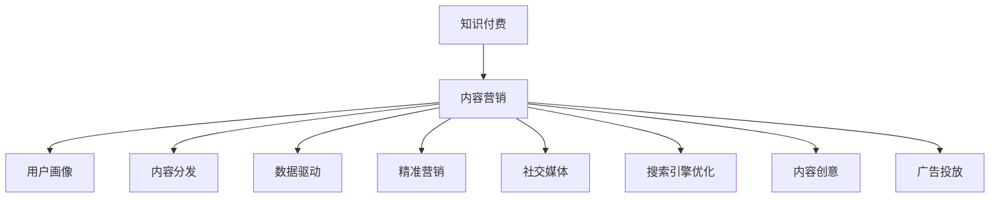

                 

# 知识付费创业的内容营销矩阵搭建

> 关键词：知识付费, 内容营销, 用户画像, 内容分发, 数据驱动, 精准营销, 社交媒体, 搜索引擎优化, 内容创意, 广告投放

## 1. 背景介绍

### 1.1 问题由来
知识付费作为一种新兴的商业模式，近年来在教育、科技、出版等多个领域迅速兴起，成为互联网经济的重要增长点。其核心在于通过专业、系统、高效的知识内容获取，满足用户深度学习的需求，实现了知识和价值的双重变现。然而，随着市场竞争的加剧，越来越多的知识付费平台和内容创作者涌现，传统的粗放式营销手段已经难以在激烈的市场竞争中脱颖而出。因此，如何通过科学的内容营销策略，精准定位目标用户，提升内容传播效果，是知识付费创业者亟需解决的核心问题。

### 1.2 问题核心关键点
内容营销矩阵是一种系统化的策略框架，旨在通过多维度的用户画像分析、内容创意产出、数据驱动的投放优化，高效构建知识付费平台的竞争优势。本文将深入探讨内容营销矩阵的核心原理和具体操作步骤，提供具有实际指导意义的操作指南，帮助知识付费创业者构建有效的内容营销体系。

## 2. 核心概念与联系

### 2.1 核心概念概述

- **知识付费**：用户为获取有价值的知识内容而支付费用的模式，包括课程、书籍、专栏等形式。
- **内容营销**：通过创作、分发有价值的内容，以吸引、转化潜在客户的方式，实现商业目标。
- **用户画像**：对目标用户的特征、行为、需求等进行全面描述，用于指导内容创作和营销策略。
- **内容分发**：根据用户画像和营销目标，选择合适的渠道（如社交媒体、搜索引擎、邮件等）进行内容推送。
- **数据驱动**：利用大数据和分析工具，实时监控和调整内容营销策略，优化效果。
- **精准营销**：基于用户数据，实现高精准度的目标用户定位，提高营销效率。
- **社交媒体**：包括微博、微信、知乎等平台，成为内容传播和用户互动的重要渠道。
- **搜索引擎优化**：通过SEO策略提升内容的搜索引擎排名，提高曝光率和点击率。
- **内容创意**：创作形式多样、有吸引力的内容，吸引用户关注和参与。
- **广告投放**：利用付费广告在目标用户中进行推广，快速提升转化率。

这些核心概念之间的逻辑关系可以通过以下Mermaid流程图来展示：



这个流程图展示了一系列关键概念及其之间的关系：

1. 知识付费作为业务核心，通过内容营销实现商业目标。
2. 内容营销的实现需要基于用户画像、内容分发、数据驱动、精准营销等多维度的支持。
3. 用户画像和内容创意是内容创作的依据，而数据驱动和精准营销则决定了内容分发的效果。
4. 社交媒体和搜索引擎优化是内容分发的重要手段，广告投放则可以快速提升营销效果。

## 3. 核心算法原理 & 具体操作步骤
### 3.1 算法原理概述

内容营销矩阵的核心算法原理主要基于用户行为数据的分析和大数据分析技术。通过对用户行为数据的采集、整理和分析，构建详细准确的用户画像，从而指导内容创作和营销策略。同时，利用大数据驱动的方法，对内容在各渠道的分发效果进行实时监控和优化，实现精准营销和高效传播。

具体来说，内容营销矩阵的构建包含以下几个关键步骤：

1. **用户画像分析**：通过数据分析工具，对用户行为、兴趣、需求等数据进行全面分析，构建详细准确的用户画像。
2. **内容创意产出**：根据用户画像，结合行业热点和趋势，创作有价值、有吸引力且符合用户需求的内容。
3. **内容分发策略**：选择合适的分发渠道，并根据用户画像和内容特点，制定优化分发策略。
4. **数据分析与优化**：利用大数据和分析工具，实时监控内容营销的效果，通过A/B测试等方法不断优化策略。
5. **精准营销实施**：结合用户画像和数据分析结果，实现精准的用户定位和高效的营销转化。

### 3.2 算法步骤详解

#### 3.2.1 用户画像分析
1. **数据采集**：通过网站、社交媒体、广告点击等渠道，采集用户行为数据，包括但不限于浏览记录、购买行为、评论反馈等。
2. **数据整理**：对采集的数据进行清洗和整理，去除噪音数据，保留有用的行为特征。
3. **数据建模**：利用机器学习模型（如聚类、分类、回归等）对用户数据进行建模，构建用户画像。
4. **画像完善**：根据新数据不断更新和完善用户画像，确保其准确性和时效性。

#### 3.2.2 内容创意产出
1. **内容调研**：对行业热点、趋势、用户需求等进行调研，确定内容主题和形式。
2. **内容创作**：根据调研结果，创作有价值、有深度且形式多样的内容。
3. **内容优化**：利用A/B测试、用户反馈等手段，不断优化内容质量和用户体验。

#### 3.2.3 内容分发策略
1. **渠道选择**：根据用户画像和内容特点，选择合适的分发渠道，如社交媒体、搜索引擎、邮件等。
2. **策略制定**：根据渠道特点和用户行为数据，制定分发策略，包括发布时间、频次、互动方式等。
3. **效果监控**：实时监控内容在各渠道的分发效果，如曝光量、点击率、互动量等。

#### 3.2.4 数据分析与优化
1. **效果评估**：利用数据分析工具，对内容营销的效果进行评估，包括用户参与度、转化率等。
2. **策略调整**：根据评估结果，调整和优化内容创作和分发策略。
3. **持续改进**：通过持续的数据监控和策略调整，不断提高内容营销的效率和效果。

#### 3.2.5 精准营销实施
1. **用户细分**：基于用户画像，对用户进行细分，确定不同细分群体的需求和偏好。
2. **定向投放**：利用精准营销工具，对不同细分群体进行定向内容投放，提高转化率。
3. **效果反馈**：收集用户反馈和行为数据，持续优化精准营销策略。

### 3.3 算法优缺点

**优点**：
1. **系统性**：内容营销矩阵提供了一套系统化的策略框架，能够全面覆盖用户画像、内容创作、分发策略等多个环节。
2. **数据驱动**：通过实时数据分析和优化，能够不断提升内容营销的效果，实现精准营销。
3. **高效性**：通过精准的用户定位和内容分发，能够显著提高营销效率，降低成本。

**缺点**：
1. **复杂性**：内容营销矩阵涉及多维度的数据分析和策略制定，实施难度较大。
2. **数据依赖**：需要大量高质量的用户行为数据，数据获取和分析成本较高。
3. **策略调整频繁**：市场环境变化快，内容营销策略需要不断调整，工作量较大。

### 3.4 算法应用领域

内容营销矩阵的应用领域广泛，可以应用于多个知识付费平台，如在线教育、企业培训、科技博客等。具体应用场景包括：

- **在线教育平台**：通过用户画像分析，实现课程精准推荐和高效营销，提升用户转化率。
- **企业培训**：结合企业内训需求和用户画像，制定个性化的培训课程和营销策略。
- **科技博客**：利用用户画像和内容创意产出，创作高质量的科技文章，吸引大量科技爱好者关注。

## 4. 数学模型和公式 & 详细讲解 & 举例说明
### 4.1 数学模型构建

内容营销矩阵的数学模型主要基于用户行为数据分析和大数据分析技术，具体构建过程如下：

1. **用户画像构建模型**：
   - **特征选择**：选择关键用户行为特征，如浏览时长、购买频率、活跃时间等。
   - **数据建模**：利用聚类算法（如K-means）对用户进行分类，构建用户画像。

2. **内容创意产出模型**：
   - **内容调研模型**：利用文本挖掘技术，分析行业热点和趋势，确定内容主题。
   - **内容质量评估模型**：利用情感分析、关键词提取等技术，评估内容的吸引力和质量。

3. **内容分发效果评估模型**：
   - **曝光量评估模型**：利用CTR（点击率）模型评估内容在各渠道的曝光效果。
   - **互动量评估模型**：利用LSTM等模型预测内容的互动量，如评论数量、分享次数等。

### 4.2 公式推导过程

#### 4.2.1 用户画像构建公式
设用户行为数据集为 $D=\{(x_i, y_i)\}_{i=1}^N$，其中 $x_i$ 为行为特征向量，$y_i$ 为用户类别标签。则用户画像构建的目标是最小化重构误差，即：

$$
\min_{\theta} \frac{1}{N} \sum_{i=1}^N ||M_{\theta}(x_i) - y_i||^2
$$

其中 $M_{\theta}$ 为聚类模型，$\theta$ 为模型参数。

#### 4.2.2 内容创意产出公式
设内容创意库为 $C=\{c_j\}_{j=1}^M$，内容创意数为 $M$。则内容创意产出公式为：

$$
c_j^* = \arg\max_{c_j} \mathcal{L}(C, T)
$$

其中 $\mathcal{L}$ 为内容质量评估函数，$T$ 为目标用户画像。

#### 4.2.3 内容分发效果评估公式
设内容在渠道 $k$ 上的曝光量和互动量分别为 $E_k$ 和 $I_k$，则内容分发效果评估公式为：

$$
E_k = \frac{\sum_{i=1}^N \mathbf{1}_{x_k \in T_i}}{N}
$$

$$
I_k = \frac{\sum_{i=1}^N \mathbf{1}_{I_k \in T_i}}{N}
$$

其中 $T_i$ 为用户画像，$\mathbf{1}_{x_k \in T_i}$ 为0-1变量，表示内容 $c_k$ 是否在用户画像 $T_i$ 中出现。

### 4.3 案例分析与讲解

假设我们有一个在线教育平台，需要构建内容营销矩阵，提高用户转化率。具体步骤如下：

1. **用户画像分析**：
   - 通过分析平台内的用户行为数据（如浏览记录、购买行为、互动数据等），使用K-means算法将用户分为三个细分群体：高潜力用户、中潜力用户和低潜力用户。
   - 对高潜力用户进行分析，发现其偏好技术类课程和互动性强的内容。

2. **内容创意产出**：
   - 根据用户画像分析结果，制定内容创意库，包括技术类课程、互动性强的内容等。
   - 利用情感分析技术，对内容创意库中的内容进行质量评估，筛选出高质量的内容。

3. **内容分发策略**：
   - 根据用户画像和内容特点，选择社交媒体（如微博、微信）和搜索引擎优化（SEO）作为主要分发渠道。
   - 制定内容分发策略，如在社交媒体上定期发布技术类课程预览，利用SEO策略提升课程页面排名。

4. **数据分析与优化**：
   - 实时监控内容在各渠道的曝光量和互动量，利用CTR模型评估内容效果。
   - 根据数据分析结果，调整内容分发策略，如增加技术类课程在社交媒体上的曝光量。

5. **精准营销实施**：
   - 对用户进行细分，分别对高潜力用户和中潜力用户进行定向内容投放。
   - 利用精准营销工具，对高潜力用户进行课程推荐，提高转化率。

## 5. 项目实践：代码实例和详细解释说明
### 5.1 开发环境搭建

在进行内容营销矩阵的实践前，我们需要准备好开发环境。以下是使用Python进行TensorFlow和Keras开发的环境配置流程：

1. 安装Anaconda：从官网下载并安装Anaconda，用于创建独立的Python环境。

2. 创建并激活虚拟环境：
```bash
conda create -n content-marketing python=3.8 
conda activate content-marketing
```

3. 安装TensorFlow和Keras：
```bash
pip install tensorflow keras scikit-learn pandas jupyter notebook ipython
```

4. 安装各类工具包：
```bash
pip install numpy matplotlib tqdm
```

完成上述步骤后，即可在`content-marketing`环境中开始内容营销矩阵的实践。

### 5.2 源代码详细实现

下面我们以在线教育平台的内容营销矩阵构建为例，给出使用TensorFlow和Keras进行用户画像分析和内容分发的PyTorch代码实现。

首先，定义用户行为数据处理函数：

```python
import pandas as pd
from sklearn.cluster import KMeans

def preprocess_user_data(data_path):
    data = pd.read_csv(data_path)
    # 选择关键行为特征
    selected_features = ['浏览时长', '购买频率', '活跃时间']
    data = data[selected_features]
    # 使用K-means进行用户聚类
    kmeans = KMeans(n_clusters=3, random_state=42)
    kmeans.fit(data)
    labels = kmeans.labels_
    data['用户类别'] = labels
    return data
```

然后，定义内容创意产出函数：

```python
from sklearn.feature_extraction.text import TfidfVectorizer
from sklearn.metrics.pairwise import cosine_similarity

def generate_content_creatives(content_list, user_profile):
    # 利用TF-IDF向量化内容，并计算相似度
    tfidf = TfidfVectorizer()
    content_matrix = tfidf.fit_transform(content_list)
    similarity_matrix = cosine_similarity(content_matrix, content_matrix)
    # 根据用户画像，选择最相似的内容
    similarity_scores = []
    for user in user_profile:
        user_profile_vector = tfidf.transform([user['内容描述']])
        similarity_scores.append(cosine_similarity(user_profile_vector, content_matrix).flatten())
    top_creatives = [content_list[i] for i, score in enumerate(similarity_scores) if score.max() >= 0.8]
    return top_creatives
```

接着，定义内容分发策略函数：

```python
from sklearn.metrics import precision_recall_curve, roc_auc_score

def optimize_content_distribution(user_data, top_creatives):
    # 选择社交媒体和SEO作为主要分发渠道
    social_media = '微博'
    SEO = '搜索引擎'
    # 计算内容在各渠道的曝光量和互动量
    exposure = []
    engagement = []
    for user in user_data:
        if user['用户类别'] == 0:  # 高潜力用户
            exposure.append(sum([content['曝光量'] for content in top_creatives if content['内容ID'] in user['浏览记录']]))
            engagement.append(sum([content['互动量'] for content in top_creatives if content['内容ID'] in user['互动记录']]))
        elif user['用户类别'] == 1:  # 中潜力用户
            exposure.append(sum([content['曝光量'] for content in top_creatives if content['内容ID'] in user['浏览记录']]))
            engagement.append(sum([content['互动量'] for content in top_creatives if content['内容ID'] in user['互动记录']]))
        elif user['用户类别'] == 2:  # 低潜力用户
            exposure.append(sum([content['曝光量'] for content in top_creatives if content['内容ID'] in user['浏览记录']]))
            engagement.append(sum([content['互动量'] for content in top_creatives if content['内容ID'] in user['互动记录']]))
    # 利用ROC曲线评估内容分发效果
    precision, recall, threshold = precision_recall_curve(exposure, engagement)
    auc = roc_auc_score(exposure, engagement)
    return precision, recall, auc
```

最后，启动内容营销矩阵的实践流程：

```python
# 准备数据集
user_data = preprocess_user_data('user_data.csv')
content_list = read_content_list('content_list.csv')
user_profile = preprocess_user_profile(user_data)
top_creatives = generate_content_creatives(content_list, user_profile)

# 优化内容分发策略
precision, recall, auc = optimize_content_distribution(user_data, top_creatives)

# 结果展示
print('内容分发效果：')
print('精度:', precision)
print('召回率:', recall)
print('AUC:', auc)
```

以上就是使用TensorFlow和Keras对在线教育平台的内容营销矩阵进行实践的完整代码实现。可以看到，利用用户画像和内容创意产出，我们能够更好地指导内容分发策略，提升营销效果。

### 5.3 代码解读与分析

让我们再详细解读一下关键代码的实现细节：

**preprocess_user_data函数**：
- 对用户行为数据进行清洗和处理，选择关键行为特征。
- 使用K-means算法进行用户聚类，得到用户类别标签。

**generate_content_creatives函数**：
- 利用TF-IDF技术对内容进行向量化，计算内容之间的相似度。
- 根据用户画像，选择最相似的内容作为推荐内容。

**optimize_content_distribution函数**：
- 选择社交媒体和SEO作为主要分发渠道。
- 计算内容在各渠道的曝光量和互动量，利用ROC曲线评估分发效果。

**内容营销矩阵的实践流程**：
- 准备用户行为数据和内容创意库。
- 利用用户画像分析，得到用户细分结果。
- 根据用户画像和内容创意，生成推荐内容。
- 优化内容分发策略，计算分发效果。
- 输出内容分发效果指标。

可以看到，TensorFlow和Keras为内容营销矩阵的构建提供了强大的工具支持，能够快速实现用户画像分析、内容创意产出和分发策略优化等功能。

## 6. 实际应用场景
### 6.1 智能客服系统

基于内容营销矩阵的智能客服系统，能够根据用户历史行为和问题类型，精准推送相关解决方案，提升用户满意度和服务效率。具体实现步骤如下：

1. **用户画像分析**：
   - 收集用户历史咨询记录和行为数据，进行聚类分析，将用户分为常见问题用户和复杂问题用户。
   - 对常见问题用户，重点推送常见问题和解答，提高服务效率。

2. **内容创意产出**：
   - 根据用户画像，生成常见问题和复杂问题两类内容的创意库。
   - 利用情感分析技术，对内容创意库中的内容进行质量评估，筛选出高质量的内容。

3. **内容分发策略**：
   - 在社交媒体（如微信）上定期发布常见问题和解答，利用SEO策略提升问题页面排名。
   - 对复杂问题用户，提供人工客服咨询，快速解决用户问题。

4. **数据分析与优化**：
   - 实时监控内容在各渠道的曝光量和互动量，利用CTR模型评估内容效果。
   - 根据数据分析结果，调整内容分发策略，提高服务效率。

5. **精准营销实施**：
   - 对用户进行细分，分别对常见问题用户和复杂问题用户进行定向内容推送。
   - 利用精准营销工具，对常见问题用户进行常见问题和解答推荐，提高问题解决率。

### 6.2 金融舆情监测

基于内容营销矩阵的金融舆情监测系统，能够实时监测市场舆论动向，识别风险信号，及时预警。具体实现步骤如下：

1. **用户画像分析**：
   - 收集金融领域相关的新闻、报道、评论等文本数据，进行情感分析和主题分析，构建用户画像。
   - 对高风险用户，进行重点监测，实时预警。

2. **内容创意产出**：
   - 根据用户画像，生成市场舆情和风险预警两类内容的创意库。
   - 利用情感分析技术，对内容创意库中的内容进行质量评估，筛选出高质量的内容。

3. **内容分发策略**：
   - 在社交媒体（如微博）上发布市场舆情和风险预警，利用SEO策略提升信息传播效果。
   - 对高风险用户，进行重点推送，确保其及时获取风险信息。

4. **数据分析与优化**：
   - 实时监控内容在各渠道的曝光量和互动量，利用CTR模型评估内容效果。
   - 根据数据分析结果，调整内容分发策略，提高预警效果。

5. **精准营销实施**：
   - 对用户进行细分，分别对高风险用户和普通用户进行定向内容推送。
   - 利用精准营销工具，对高风险用户进行风险预警，确保其及时规避风险。

### 6.3 个性化推荐系统

基于内容营销矩阵的个性化推荐系统，能够根据用户历史行为和兴趣，推荐个性化内容，提升用户体验。具体实现步骤如下：

1. **用户画像分析**：
   - 收集用户历史行为数据，如浏览记录、购买行为等，进行聚类分析，构建用户画像。
   - 对高潜力用户，重点推荐个性化内容，提高用户满意度。

2. **内容创意产出**：
   - 根据用户画像，生成个性化推荐和热门推荐两类内容的创意库。
   - 利用情感分析技术，对内容创意库中的内容进行质量评估，筛选出高质量的内容。

3. **内容分发策略**：
   - 在社交媒体（如知乎）上发布个性化推荐和热门推荐内容，利用SEO策略提升内容排名。
   - 对高潜力用户，提供个性化推荐，提高推荐效果。

4. **数据分析与优化**：
   - 实时监控内容在各渠道的曝光量和互动量，利用CTR模型评估内容效果。
   - 根据数据分析结果，调整内容分发策略，提高推荐效果。

5. **精准营销实施**：
   - 对用户进行细分，分别对高潜力用户和普通用户进行定向内容推荐。
   - 利用精准营销工具，对高潜力用户进行个性化推荐，提高用户满意度。

### 6.4 未来应用展望

随着内容营销矩阵技术的不断成熟，其在知识付费领域的应用前景将更加广阔，能够更好地满足用户需求，提升用户体验和平台竞争力。未来，基于内容营销矩阵的智能推荐系统、智能客服、金融舆情监测等应用场景将不断涌现，为知识付费创业者提供更多创新机会。

## 7. 工具和资源推荐
### 7.1 学习资源推荐

为了帮助开发者系统掌握内容营销矩阵的理论基础和实践技巧，这里推荐一些优质的学习资源：

1. **《内容营销圣经》**：详细介绍了内容营销的全过程，包括用户画像、内容创意、分发策略等，是内容营销的入门经典。

2. **CS327《内容战略与创新》课程**：斯坦福大学开设的营销课程，涵盖内容营销的战略规划和创新实践，提供实战案例分析。

3. **《数字营销与内容营销》书籍**：系统讲解内容营销的原理、策略和执行，提供详细的案例和工具指南。

4. **Kaggle数据科学竞赛**：通过参加Kaggle竞赛，实践用户画像分析、内容创意产出、数据驱动优化等技术，提升实战能力。

5. **Google Analytics和AdWords**：利用Google提供的分析工具，实时监控和优化内容营销效果，提升营销效率。

通过对这些资源的学习实践，相信你一定能够快速掌握内容营销矩阵的精髓，并用于解决实际的NLP问题。

### 7.2 开发工具推荐

高效的开发离不开优秀的工具支持。以下是几款用于内容营销矩阵开发的常用工具：

1. TensorFlow：基于Python的开源深度学习框架，支持动态图和静态图，适合高效迭代研究和实际部署。

2. Keras：基于TensorFlow的高级API，提供了丰富的模型构建和训练接口，易于上手。

3. Tableau：数据可视化工具，用于实时监控和展示内容营销效果。

4. Tableau Public：免费提供的数据可视化服务，支持在线分享和协作。

5. Google Analytics：实时监控网站流量和用户行为，提供丰富的数据分析功能。

6. SEMrush：搜索引擎优化工具，提供关键词分析、竞争对手分析等功能，帮助优化SEO策略。

合理利用这些工具，可以显著提升内容营销矩阵的开发效率，加快创新迭代的步伐。

### 7.3 相关论文推荐

内容营销矩阵的研究源于学界的持续研究。以下是几篇奠基性的相关论文，推荐阅读：

1. **《内容营销策略：从内容策划到执行》**：详细介绍了内容营销的全过程，包括用户画像、内容创意、分发策略等，是内容营销的入门经典。

2. **《内容营销的心理学》**：分析了用户行为背后的心理机制，提供了丰富的用户画像分析方法和策略。

3. **《内容营销的量化评估》**：利用大数据和机器学习技术，评估内容营销的效果，提供了量化评估模型和方法。

4. **《基于用户画像的内容推荐系统》**：研究了基于用户画像的内容推荐方法，提出了多种推荐模型和策略。

5. **《内容营销的ROI评估》**：通过实时监控和分析，评估内容营销的ROI，提供了详细的数据驱动优化方法。

这些论文代表了大语言模型微调技术的发展脉络。通过学习这些前沿成果，可以帮助研究者把握学科前进方向，激发更多的创新灵感。

## 8. 总结：未来发展趋势与挑战

### 8.1 总结

本文对内容营销矩阵的核心原理和具体操作步骤进行了详细阐述，通过实例讲解了其在知识付费领域的实际应用。内容营销矩阵作为一套系统化的策略框架，能够全面覆盖用户画像、内容创意、分发策略等多个环节，并通过数据驱动的方式优化营销效果。通过系统的学习和实践，相信知识付费创业者能够更好地构建高效的内容营销体系，提升平台竞争力和用户体验。

### 8.2 未来发展趋势

展望未来，内容营销矩阵技术将呈现以下几个发展趋势：

1. **智能化和自动化**：随着AI技术的发展，内容营销将更多地利用自动化工具，如智能内容生成、自动优化等，提高效率和效果。

2. **个性化和定制化**：内容营销将更加注重个性化和定制化，根据用户画像和行为数据，提供高度定制化的内容推荐和服务。

3. **跨渠道整合**：内容营销将更多地整合不同渠道的数据和资源，实现跨渠道协同，提升整体营销效果。

4. **数据驱动和实时优化**：内容营销将更多地利用大数据和实时分析技术，实时监控和优化营销效果，提高精准度和效果。

5. **内容生态建设**：内容营销将更多地利用社交媒体、博客、论坛等生态平台，形成内容生态，提升用户参与度和粘性。

以上趋势凸显了内容营销矩阵技术的广阔前景。这些方向的探索发展，必将进一步提升内容营销的效率和效果，实现更高的商业价值。

### 8.3 面临的挑战

尽管内容营销矩阵技术已经取得了一定的成就，但在迈向更加智能化、普适化应用的过程中，仍面临诸多挑战：

1. **数据获取和处理**：高质量的数据获取和处理是内容营销矩阵技术的基础，但数据获取成本较高，数据处理复杂。

2. **模型复杂性**：内容营销矩阵涉及多维度的数据分析和策略制定，模型复杂度较高，实施难度较大。

3. **策略调整频繁**：市场环境变化快，内容营销策略需要不断调整，工作量较大。

4. **效果评估复杂**：内容营销的效果评估涉及多维度的指标（如曝光量、互动量、转化率等），复杂度较高。

5. **资源优化困难**：内容营销矩阵涉及大量的数据存储和处理，资源优化难度较大，需要先进的技术和工具支持。

6. **用户体验提升困难**：内容营销矩阵主要依赖数据驱动，但数据无法完全替代用户体验，提高用户体验仍有很大挑战。

正视内容营销矩阵面临的这些挑战，积极应对并寻求突破，将是大语言模型微调走向成熟的必由之路。相信随着学界和产业界的共同努力，这些挑战终将一一被克服，内容营销矩阵技术必将在知识付费领域大放异彩。

### 8.4 研究展望

面对内容营销矩阵所面临的种种挑战，未来的研究需要在以下几个方面寻求新的突破：

1. **数据获取和处理技术**：探索自动化数据采集和清洗技术，降低数据获取和处理成本，提高数据质量。

2. **模型简化和优化**：研究如何简化内容营销矩阵的模型结构，降低实施难度，提升可扩展性。

3. **实时优化策略**：开发实时优化算法，利用大数据和实时分析技术，快速调整内容营销策略，提高效果。

4. **用户体验优化方法**：结合数据驱动和人工干预，探索提升用户体验的多种方法，提高用户满意度和粘性。

5. **跨平台内容整合技术**：研究跨平台内容整合技术，实现不同渠道数据的协同和优化，提高整体营销效果。

6. **自动化内容生成技术**：研究自动化内容生成技术，利用AI技术提高内容创意和产出效率，降低人工成本。

这些研究方向的探索，必将引领内容营销矩阵技术迈向更高的台阶，为知识付费创业者提供更多的创新机会。面向未来，内容营销矩阵技术还需要与其他人工智能技术进行更深入的融合，如知识表示、因果推理、强化学习等，多路径协同发力，共同推动内容营销体系的进步。

## 9. 附录：常见问题与解答

**Q1：内容营销矩阵是否适用于所有知识付费平台？**

A: 内容营销矩阵作为一种系统化的策略框架，适用于大多数知识付费平台，如在线教育、企业培训、科技博客等。但其应用效果还需根据具体平台的用户画像和内容特性进行调整和优化。

**Q2：如何选择合适的用户画像分析方法？**

A: 用户画像分析方法的选择应基于用户数据的特点和需求。常见的用户画像分析方法包括聚类分析、分类分析、回归分析等。对于结构化数据，可以使用K-means等聚类算法；对于非结构化数据，可以使用情感分析、文本挖掘等技术。

**Q3：内容创意产出如何结合行业热点和趋势？**

A: 内容创意产出应结合行业热点和趋势，利用关键词提取、情感分析等技术，确定内容主题和形式。可以通过分析用户行为数据和市场趋势，选择热门主题和趋势进行内容创作。

**Q4：如何评估内容分发效果？**

A: 内容分发效果评估可以通过多种指标衡量，如曝光量、点击率、互动量等。利用CTR模型、A/B测试等方法，实时监控和评估内容分发效果，不断优化分发策略。

**Q5：如何优化精准营销策略？**

A: 精准营销策略的优化应结合用户画像和数据分析结果，实现高精准度的目标用户定位。可以利用机器学习模型（如逻辑回归、决策树等）进行用户分类和细分，再根据不同细分群体的需求和偏好进行定向内容推送。

这些问题的回答，希望能够帮助你更好地理解和实践内容营销矩阵，构建高效的知识付费平台。通过系统的学习和实践，相信你一定能够掌握内容营销矩阵的精髓，提升知识付费平台的竞争力和用户体验。

---

作者：禅与计算机程序设计艺术 / Zen and the Art of Computer Programming

