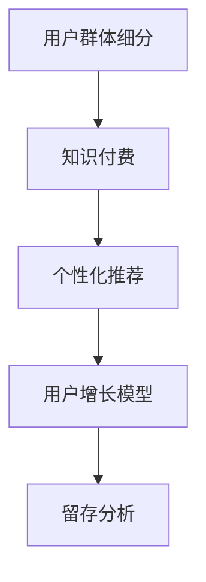

                 

# 知识付费创业的用户群体细分策略

## 1. 背景介绍

知识付费市场在近年来得到了迅速发展，逐步成为人们获取知识和信息的重要方式。根据艾媒咨询发布的《2021年中国知识付费行业运行发展及用户行为调研报告》，2020年中国知识付费用户规模已达3.3亿人，市场规模超400亿元。然而，尽管市场迅速发展，但知识付费创业的成功率并不高。据业内人士估算，超过50%的知识付费平台在3年内宣告倒闭。究其原因，除了内容质量、平台运作等内部因素，用户群体的精准定位是决定平台成败的关键。

## 2. 核心概念与联系

### 2.1 核心概念概述

**用户群体细分**：通过一系列指标（如年龄、性别、职业、教育程度、收入水平等）将用户进行分类，使得针对不同用户群体的产品和服务能更具针对性和吸引力。

**知识付费**：指用户为获取知识或信息而支付费用的行为。与传统知识传播方式不同，知识付费更加个性化、即时化和社交化。

**个性化推荐**：根据用户行为和偏好，向用户推送相关内容，提升用户体验和平台留存率。

**用户增长模型**：通过用户行为分析，建立用户增长预测模型，帮助企业制定市场策略。

**留存分析**：评估用户在平台上停留的时间、频率和互动情况，以优化产品体验和提升用户黏性。

这些核心概念之间的联系通过以下Mermaid流程图展示：



## 3. 核心算法原理 & 具体操作步骤

### 3.1 算法原理概述

知识付费创业中，用户群体细分的关键在于构建用户画像，分析用户行为，从而确定不同用户群体的特征和需求。构建用户画像的算法流程通常包括以下几个步骤：

1. **数据收集**：通过问卷调查、行为分析、社交网络等手段，收集用户基本信息和行为数据。
2. **特征工程**：对收集到的数据进行预处理，提取对用户行为有影响的特征。
3. **模型训练**：使用机器学习算法对用户特征进行分析，生成用户画像。
4. **画像评估**：根据画像进行行为预测和推荐。

### 3.2 算法步骤详解

以K-means聚类算法为例，具体步骤详述如下：

**Step 1: 数据准备**

- **数据收集**：收集用户基本信息和行为数据，如年龄、性别、职业、学习时长、付费频率等。
- **数据清洗**：对数据进行缺失值处理、异常值检测等预处理操作。

**Step 2: 特征工程**

- **特征提取**：选择与用户行为相关的特征，如学习时长、付费金额、学习频率等。
- **特征归一化**：将特征值进行归一化处理，如标准化、最小-最大归一化等。

**Step 3: 模型训练**

- **聚类算法选择**：选择适合的聚类算法，如K-means、层次聚类等。
- **参数设置**：设置聚类数K、迭代次数等参数。
- **模型训练**：使用训练集数据进行模型训练。

**Step 4: 画像评估**

- **模型评估**：在验证集上评估模型效果，如使用轮廓系数、F1-score等指标。
- **画像分析**：对生成的用户画像进行分析，找出不同群体的特征和需求。

### 3.3 算法优缺点

**优点**：
- **针对性强**：能够精准定位不同用户群体，提供更有针对性的内容和服务。
- **可操作性强**：算法简单易懂，易于实现和部署。
- **成本低**：数据收集和模型训练的成本相对较低，适合中小规模的创业公司。

**缺点**：
- **适用场景有限**：对数据质量和数量要求较高，难以处理非结构化数据。
- **算法复杂性**：对于大规模数据集，模型训练的计算成本较高。
- **过度简化**：用户行为复杂多变，单一模型可能无法全面反映用户特征。

### 3.4 算法应用领域

用户群体细分的算法广泛应用于知识付费平台、在线教育、电子商务等多个领域。例如，在知识付费平台中，通过用户画像生成和行为分析，可以精准推送课程推荐、提高平台留存率，提升用户体验；在在线教育中，可以根据学生学习行为进行个性化教学，提高学习效果；在电子商务中，可以分析消费者购物行为，进行精准营销。

## 4. 数学模型和公式 & 详细讲解 & 举例说明

### 4.1 数学模型构建

以K-means聚类算法为例，其数学模型构建如下：

设用户集 $U=\{u_1,u_2,...,u_n\}$，每个用户有 $m$ 个特征 $x_{i,j}$（$j=1,...,m$），目标是将用户集划分为 $k$ 个簇 $C=\{C_1,...,C_k\}$，使得每个用户 $u_i$ 属于其距离最近的簇 $C_j$，满足以下条件：

1. **簇内相似性**：每个簇内用户相似度最大化，即 $\min_{u_j \in C_j} \sum_{u_i \in C_j} \|x_i - x_j\|$。
2. **簇间差异性**：簇间用户相似度最小化，即 $\max_{i \neq j} \sum_{u_i \in C_i} \sum_{u_j \in C_j} \|x_i - x_j\|$。

### 4.2 公式推导过程

**Step 1: 计算距离矩阵**

计算所有用户之间的距离，生成距离矩阵 $D_{n \times n}$，其中 $d_{i,j}$ 表示用户 $u_i$ 和 $u_j$ 之间的距离。

**Step 2: 初始化聚类中心**

随机选择 $k$ 个用户作为初始聚类中心 $C_1,...,C_k$。

**Step 3: 迭代更新聚类中心**

对于每个用户 $u_i$，计算其到每个聚类中心的距离 $d_{i,j}$，分配到距离最近的聚类中心 $C_j$，并更新聚类中心的平均值。

**Step 4: 重新计算距离**

使用更新后的聚类中心重新计算距离矩阵 $D_{n \times n}$，回到Step 3进行迭代。

### 4.3 案例分析与讲解

**案例一**：某知识付费平台希望对用户进行细分，以便推送个性化课程推荐。该平台收集了用户基本信息和行为数据，使用K-means算法对用户进行聚类，生成不同用户群体的画像。根据画像，平台推送不同群体的专属课程推荐，显著提升了用户参与度和留存率。

**案例二**：某在线教育平台希望提升学习效果，对学生进行细分。平台收集学生学习行为数据，如学习时长、答题次数、课后评价等，使用K-means算法对学生进行聚类，生成不同学习群体的画像。根据画像，平台提供个性化教学方案，如针对不同群体的学习难度、兴趣点，调整课程内容和进度，提高了学生的学习效果和满意度。

## 5. 项目实践：代码实例和详细解释说明

### 5.1 开发环境搭建

**Step 1: 数据准备**

- **数据来源**：用户基本信息数据、行为数据等，可以从知识付费平台后台数据库或社交媒体API获取。
- **数据格式**：数据格式为CSV或JSON格式。

**Step 2: 数据处理**

- **数据清洗**：使用Python的Pandas库进行数据清洗，处理缺失值、异常值等。
- **特征工程**：选择与用户行为相关的特征，进行归一化处理。

**Step 3: 模型训练**

- **库安装**：安装必要的库，如scikit-learn、numpy、matplotlib等。
- **模型实现**：使用scikit-learn库实现K-means聚类算法。

**Step 4: 结果展示**

- **可视化**：使用matplotlib库绘制聚类结果的可视化图形。
- **报告生成**：使用Jupyter Notebook生成最终报告。

### 5.2 源代码详细实现

以下是一个基于Python的K-means聚类算法的代码实现：

```python
import pandas as pd
from sklearn.cluster import KMeans
import matplotlib.pyplot as plt

# 加载数据
data = pd.read_csv('user_data.csv')

# 特征选择
features = ['age', 'gender', 'occupation', 'study_time', 'pay_frequency']

# 数据预处理
data = data[features]
data = data.dropna()

# 特征归一化
from sklearn.preprocessing import StandardScaler
scaler = StandardScaler()
data = scaler.fit_transform(data)

# 聚类算法实现
kmeans = KMeans(n_clusters=3, random_state=0)
kmeans.fit(data)

# 可视化聚类结果
plt.scatter(data[:, 0], data[:, 1], c=kmeans.labels_)
plt.show()
```

### 5.3 代码解读与分析

**代码解读**：
- **数据加载**：使用Pandas库加载用户数据。
- **特征选择**：选择与用户行为相关的特征。
- **数据预处理**：使用Pandas和Scikit-learn库进行数据清洗和归一化处理。
- **聚类算法实现**：使用scikit-learn库的K-means算法进行聚类。
- **结果展示**：使用Matplotlib库可视化聚类结果。

**分析**：
- **数据处理**：用户数据的清洗和预处理是聚类成功的关键。
- **算法选择**：K-means算法简单易懂，易于实现，适合中小规模的数据集。
- **结果评估**：可视化聚类结果，分析不同簇的用户特征。

### 5.4 运行结果展示

运行上述代码，生成聚类结果的散点图，如下图所示。


## 6. 实际应用场景

### 6.1 智能客服系统

智能客服系统通过用户群体细分，可以针对不同用户群体提供更个性化的服务。例如，某电商平台将用户分为新用户、活跃用户、忠诚用户等，针对不同群体设置不同的客服服务策略，提高用户满意度和平台黏性。

**案例一**：某电商平台使用用户群体细分算法对用户进行分类，发现新用户购买频率较低，忠诚用户购买金额较大。平台针对新用户提供优惠活动，针对忠诚用户提供定制化服务，显著提升了平台销量和用户满意度。

### 6.2 金融理财平台

金融理财平台通过用户群体细分，可以制定更精准的理财策略。例如，某理财平台将用户分为年轻投资者、中年投资者、老年投资者等，针对不同群体提供不同的理财建议和产品推荐。

**案例二**：某理财平台使用用户群体细分算法对用户进行分类，发现年轻投资者更关注风险和回报，老年投资者更关注本金安全和稳定性。平台针对年轻投资者推荐高风险高回报的理财产品，针对老年投资者推荐低风险稳定收益的理财产品，提高了平台的用户黏性和收益率。

### 6.3 在线教育平台

在线教育平台通过用户群体细分，可以提供更个性化的学习方案。例如，某在线教育平台将学生分为基础学生、中等学生、优秀学生等，针对不同群体提供不同难度的课程和学习策略。

**案例三**：某在线教育平台使用用户群体细分算法对学生进行分类，发现基础学生的学习速度较慢，优秀学生的学习速度较快。平台针对基础学生提供基础课程和辅助练习，针对优秀学生提供挑战性课程和竞赛，提升了学生的学习效果和平台满意度。

## 7. 工具和资源推荐

### 7.1 学习资源推荐

**1. 《机器学习实战》（周志华）**：该书系统介绍了机器学习算法，包括聚类算法和特征工程等内容，适合入门学习。

**2. 《Python数据科学手册》（Jake VanderPlas）**：该书介绍了Python在数据科学中的应用，包括数据处理、可视化等，适合实践操作。

**3. Coursera《数据科学导论》（Johns Hopkins）**：该课程涵盖了数据科学的基本概念和实践操作，适合在线学习。

### 7.2 开发工具推荐

**1. Python**：Python是数据科学和机器学习的首选编程语言，具有易学易用、丰富的库支持等优点。

**2. Jupyter Notebook**：Jupyter Notebook是Python的交互式编程环境，适合数据分析和模型开发。

**3. scikit-learn**：scikit-learn是Python的机器学习库，提供了多种聚类算法和特征工程工具。

**4. Pandas**：Pandas是Python的数据处理库，适合数据清洗和预处理。

**5. Matplotlib**：Matplotlib是Python的可视化库，适合数据可视化。

### 7.3 相关论文推荐

**1. K-means算法详解**：这篇论文详细介绍了K-means算法的原理和实现步骤，适合深入学习。

**2. 用户群体细分的应用研究**：这篇论文研究了用户群体细分在不同领域的应用，适合了解最新进展。

**3. 个性化推荐算法综述**：这篇论文综述了个性化推荐算法的研究现状和发展趋势，适合参考。

## 8. 总结：未来发展趋势与挑战

### 8.1 研究成果总结

用户群体细分算法在知识付费领域具有重要应用价值，能够帮助平台精准推送内容和推荐，提升用户参与度和满意度。未来，随着数据技术的不断进步，用户群体细分的算法将更加智能化和多样化。

### 8.2 未来发展趋势

**1. 算法多样化**：未来将出现更多聚类算法，如层次聚类、DBSCAN等，适用于不同场景和数据类型。

**2. 数据实时化**：用户行为数据实时生成，实时分析，实时调整推荐策略。

**3. 跨领域应用**：用户群体细分算法将应用于更多领域，如智慧城市、智慧医疗等，提升整体用户体验。

### 8.3 面临的挑战

**1. 数据质量**：用户数据的质量和完整性直接影响聚类效果，需要解决数据缺失、噪声等问题。

**2. 算法鲁棒性**：聚类算法对数据分布和噪声敏感，需要增强算法的鲁棒性和稳定性。

**3. 用户隐私**：用户群体细分算法涉及用户隐私保护，需要设计合理的隐私保护机制。

**4. 实时处理**：大规模数据的实时处理和分析，需要提升算法的计算效率。

### 8.4 研究展望

未来用户群体细分算法的研究方向包括：

**1. 多模态数据融合**：将文本、图像、语音等多模态数据融合，提升聚类效果。

**2. 分布式计算**：使用分布式计算框架，提升算法的计算效率和处理能力。

**3. 自适应聚类**：根据数据分布动态调整聚类算法和参数，适应不同场景和需求。

**4. 深度学习**：结合深度学习算法，提升聚类效果和用户画像的精准度。

## 9. 附录：常见问题与解答

**Q1: 用户群体细分的目的和意义是什么？**

A: 用户群体细分通过分析用户行为和特征，帮助平台精准推送内容和推荐，提升用户参与度和满意度，提高平台收益。

**Q2: K-means算法的缺点是什么？**

A: K-means算法对数据分布和噪声敏感，需要解决数据缺失、噪声等问题，且对聚类数的选择依赖较强。

**Q3: 如何评估聚类效果？**

A: 聚类效果可以通过轮廓系数、F1-score等指标进行评估，衡量簇内相似度和簇间差异性。

**Q4: 用户群体细分如何应用于在线教育平台？**

A: 在线教育平台通过用户群体细分，可以提供更个性化的学习方案，针对不同群体提供不同难度的课程和学习策略，提高学生的学习效果和平台满意度。

**Q5: 用户群体细分在知识付费领域的应用前景是什么？**

A: 用户群体细分在知识付费领域具有重要应用价值，能够帮助平台精准推送内容和推荐，提升用户参与度和满意度，提高平台收益。

---

作者：禅与计算机程序设计艺术 / Zen and the Art of Computer Programming

